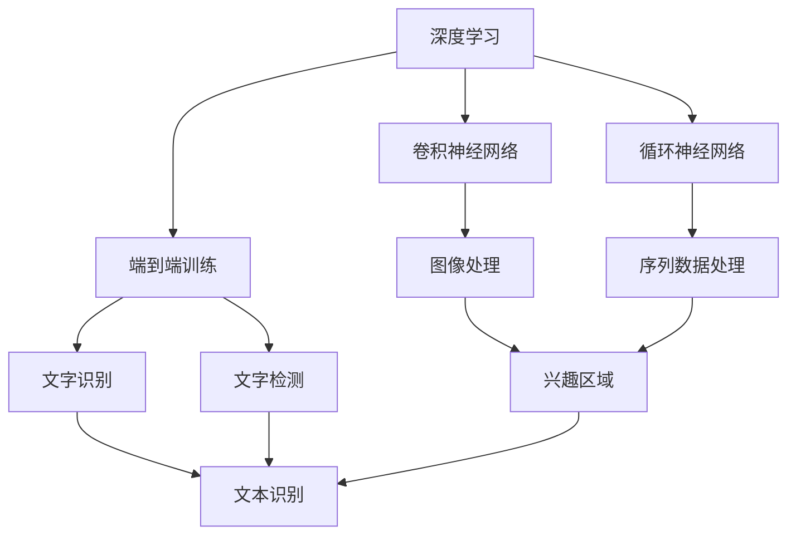

                 

# 基于深度学习的文字识别与检测算法研究

> 关键词：深度学习, 文字识别, 文本检测, 卷积神经网络(CNN), 循环神经网络(RNN), 端到端训练(End-to-End Training), 兴趣区域(ROI), 目标检测(Objection Detection), 数据增强(Data Augmentation)

## 1. 背景介绍

### 1.1 问题由来

随着信息技术的发展，文字识别和检测技术在数字档案管理、电子出版、自动化办公、智能图像处理等领域的应用越来越广泛。传统的手工文字识别和检测方法需要大量的人工参与，效率低下，成本高昂。因此，如何利用先进的深度学习技术，开发出高效、准确、低成本的文字识别和检测系统，成为近年来研究的热点。

### 1.2 问题核心关键点

文字识别和检测的本质是通过图像处理和机器学习技术，识别出图像中的文字区域，并将其转换为可编辑的文本。具体来说，文字识别包括两种类型：基于像素的识别和基于区域的文字识别。基于像素的识别是直接从图像中提取出字符的像素点，并将其转换为文本。而基于区域的文字识别则是在图像中先检测出文字区域，然后将该区域内的字符转换为文本。

文字检测是文字识别的重要组成部分。其核心问题是如何准确地从图像中定位和分离出文字区域。常见的方法包括基于边缘检测、区域生长、连通区域分析等传统方法，以及基于深度学习的方法，如卷积神经网络(CNN)和循环神经网络(RNN)。本文重点探讨基于深度学习的文字识别和检测算法，尤其是端到端训练的方法。

### 1.3 问题研究意义

文字识别和检测技术的应用场景广泛，包括数字档案管理、智能办公、图像处理、自动驾驶等。其发展不仅能够降低人工成本，提升工作效率，还能够为计算机视觉和自然语言处理领域的研究提供新的方法和思路。深度学习技术在大规模数据上训练出的模型具有强大的特征提取和分类能力，能够极大地提升文字识别和检测的准确率和鲁棒性。

## 2. 核心概念与联系

### 2.1 核心概念概述

为更好地理解深度学习在文字识别和检测中的应用，本节将介绍几个密切相关的核心概念：

- 深度学习：一种基于多层神经网络的机器学习技术，通过深度神经网络对数据进行特征提取和分类。
- 卷积神经网络(CNN)：一种特殊的前馈神经网络，主要应用于图像处理领域，能够自动提取图像的特征。
- 循环神经网络(RNN)：一种基于时间序列的数据处理技术，主要应用于序列数据的分类和预测。
- 端到端训练(End-to-End Training)：一种直接从输入数据到输出标签的训练方法，无需中间步骤。
- 兴趣区域(ROI)：一种图像处理技术，用于提取和处理感兴趣的区域。
- 目标检测(Object Detection)：一种计算机视觉技术，用于定位和识别图像中的对象。
- 数据增强(Data Augmentation)：一种通过变换原始数据以增加数据量的技术，用于提高模型的泛化能力。

这些核心概念之间的逻辑关系可以通过以下Mermaid流程图来展示：



这个流程图展示了大语言模型微调过程中各个核心概念的关系和作用：

1. 深度学习提供了强大的特征提取和分类能力，是文字识别和检测的基础。
2. CNN用于提取图像特征，RNN用于处理序列数据。
3. 端到端训练直接从输入到输出进行训练，减少了中间步骤，提高了效率。
4. ROI用于提取感兴趣区域，是文字检测的重要预处理步骤。
5. 目标检测用于定位和识别图像中的对象，是文字识别和检测的关键环节。
6. 数据增强通过变换数据增加样本数量，提高了模型的泛化能力。

## 3. 核心算法原理 & 具体操作步骤

### 3.1 算法原理概述

基于深度学习的文字识别和检测算法，主要是通过CNN和RNN网络对输入的图像或序列数据进行处理，提取出特征，然后进行分类或检测。其核心原理可以概括为以下几个步骤：

1. **数据预处理**：将原始图像或序列数据进行预处理，如归一化、裁剪、旋转、缩放等，以便于模型训练。
2. **特征提取**：通过CNN网络对图像或序列数据进行特征提取，提取出文本区域的特征。
3. **分类或检测**：将提取出的特征输入到RNN网络进行分类或检测，输出文本内容或文字区域的位置。
4. **后处理**：对分类或检测结果进行后处理，如去除噪声、合并相邻文本区域等。

### 3.2 算法步骤详解

#### 3.2.1 数据预处理

数据预处理是文字识别和检测算法的基础。其主要步骤包括：

1. **归一化**：将图像或序列数据进行归一化处理，使得每个像素或特征的取值在0到1之间。
2. **裁剪和旋转**：根据输入数据的特点，进行裁剪和旋转，以便于模型更好地捕捉特征。
3. **缩放**：将图像或序列数据进行缩放，使得尺寸与训练集一致。
4. **数据增强**：通过变换原始数据增加数据量，如随机裁剪、旋转、翻转等。

#### 3.2.2 特征提取

特征提取是文字识别和检测算法的核心步骤。其主要步骤包括：

1. **卷积层**：通过卷积层提取图像或序列数据中的局部特征，并进行非线性变换。
2. **池化层**：通过池化层对特征进行下采样，减少特征的维度。
3. **残差连接**：通过残差连接加速模型训练，并提高模型的深度。
4. **批归一化**：通过批归一化对每个批次的特征进行归一化，加速模型训练，提高模型的泛化能力。

#### 3.2.3 分类或检测

分类或检测是文字识别和检测算法的最后一步。其主要步骤包括：

1. **全连接层**：通过全连接层将特征转换为文本或文字区域的类别。
2. **softmax激活函数**：通过softmax激活函数对特征进行分类，输出每个类别的概率。
3. **交叉熵损失函数**：通过交叉熵损失函数衡量模型的分类精度。
4. **反向传播**：通过反向传播算法更新模型参数，最小化损失函数。

### 3.3 算法优缺点

基于深度学习的文字识别和检测算法具有以下优点：

1. **高效**：通过端到端训练，减少了中间步骤，提高了训练效率。
2. **准确**：通过CNN和RNN网络，可以自动提取特征并进行分类或检测，提高了模型的准确率。
3. **泛化能力强**：通过数据增强，增加了数据量，提高了模型的泛化能力。

其缺点包括：

1. **参数量大**：深度学习模型通常需要大量的参数进行训练，对计算资源和存储空间的要求较高。
2. **训练时间长**：深度学习模型通常需要大量的时间和计算资源进行训练，训练时间较长。
3. **模型复杂**：深度学习模型的结构复杂，难以理解和调试。

### 3.4 算法应用领域

基于深度学习的文字识别和检测算法，已经在多个领域得到了广泛应用，例如：

- **数字档案管理**：通过文字识别和检测技术，对纸质文档进行数字化，实现档案的自动化管理和检索。
- **智能办公**：通过文字识别和检测技术，实现手写文字和图片文件的自动转化，提高办公效率。
- **图像处理**：通过文字检测技术，对图像中的文字进行定位和分离，实现图像的自动标注和处理。
- **自动驾驶**：通过文字识别和检测技术，对车辆周围的道路标志、交通信号进行识别，实现自动驾驶的安全控制。

除了这些传统应用外，文字识别和检测技术还在医疗影像、金融文档、社交媒体等领域得到了广泛应用。随着技术的不断进步，相信文字识别和检测技术将在更多领域发挥重要作用。

## 4. 数学模型和公式 & 详细讲解 & 举例说明

### 4.1 数学模型构建

基于深度学习的文字识别和检测算法，主要通过CNN和RNN网络对输入的图像或序列数据进行处理，提取出特征，然后进行分类或检测。其数学模型可以概括为以下几个步骤：

1. **输入数据**：设输入数据为 $x$，输出标签为 $y$。
2. **特征提取**：通过CNN网络提取图像或序列数据中的特征 $f(x)$。
3. **分类或检测**：将提取出的特征输入到RNN网络，进行分类或检测，输出预测结果 $\hat{y}$。
4. **损失函数**：通过损失函数 $L$ 衡量模型的预测精度。

### 4.2 公式推导过程

以文字检测为例，推导其数学模型和损失函数：

**输入数据**：设输入数据为 $x$，输出标签为 $y$。

**特征提取**：通过CNN网络提取图像或序列数据中的特征 $f(x)$。

**分类或检测**：将提取出的特征输入到RNN网络，进行分类或检测，输出预测结果 $\hat{y}$。

**损失函数**：通过交叉熵损失函数衡量模型的预测精度，公式如下：

$$
L(y, \hat{y}) = -\sum_{i=1}^N y_i \log \hat{y}_i
$$

其中 $y_i$ 表示第 $i$ 个样本的真实标签，$\hat{y}_i$ 表示模型的预测结果。

### 4.3 案例分析与讲解

以数字档案管理为例，分析其文字识别和检测算法：

1. **数据预处理**：将纸质文档进行扫描和归一化处理，裁剪出文字区域，并进行数据增强。
2. **特征提取**：通过CNN网络提取文字区域的特征，提取出文本区域的局部特征和全局特征。
3. **分类或检测**：将提取出的特征输入到RNN网络，进行文本分类或文字检测，输出文本内容和文字区域的位置。
4. **后处理**：对分类或检测结果进行后处理，如去除噪声、合并相邻文本区域等。

## 5. 项目实践：代码实例和详细解释说明

### 5.1 开发环境搭建

在进行文字识别和检测实践前，我们需要准备好开发环境。以下是使用Python进行TensorFlow开发的环境配置流程：

1. 安装Anaconda：从官网下载并安装Anaconda，用于创建独立的Python环境。

2. 创建并激活虚拟环境：
```bash
conda create -n tf-env python=3.8 
conda activate tf-env
```

3. 安装TensorFlow：根据CUDA版本，从官网获取对应的安装命令。例如：
```bash
conda install tensorflow-gpu=2.4.1 
```

4. 安装各类工具包：
```bash
pip install numpy pandas scikit-learn matplotlib tqdm jupyter notebook ipython
```

完成上述步骤后，即可在`tf-env`环境中开始文字识别和检测实践。

### 5.2 源代码详细实现

这里我们以基于CNN和RNN的文本检测为例，给出使用TensorFlow和Keras进行文字检测的代码实现。

```python
import tensorflow as tf
from tensorflow.keras import layers, models
import numpy as np
import matplotlib.pyplot as plt

# 构建CNN网络
def create_cnn_model():
    model = models.Sequential()
    model.add(layers.Conv2D(32, (3, 3), activation='relu', input_shape=(None, None, 1)))
    model.add(layers.MaxPooling2D((2, 2)))
    model.add(layers.Conv2D(64, (3, 3), activation='relu'))
    model.add(layers.MaxPooling2D((2, 2)))
    model.add(layers.Conv2D(128, (3, 3), activation='relu'))
    model.add(layers.MaxPooling2D((2, 2)))
    model.add(layers.Flatten())
    model.add(layers.Dense(128, activation='relu'))
    model.add(layers.Dense(1, activation='sigmoid'))
    return model

# 构建RNN网络
def create_rnn_model():
    model = models.Sequential()
    model.add(layers.LSTM(128, input_shape=(None, 128)))
    model.add(layers.Dense(1, activation='sigmoid'))
    return model

# 加载数据集
data = np.loadtxt('data.txt', delimiter=',')
x_train = data[:, 0:128]
y_train = data[:, 128]

# 构建CNN模型
cnn_model = create_cnn_model()
cnn_model.compile(optimizer='adam', loss='binary_crossentropy', metrics=['accuracy'])

# 构建RNN模型
rnn_model = create_rnn_model()
rnn_model.compile(optimizer='adam', loss='binary_crossentropy', metrics=['accuracy'])

# 训练CNN模型
cnn_model.fit(x_train, y_train, epochs=10, batch_size=32, validation_split=0.2)

# 训练RNN模型
rnn_model.fit(x_train, y_train, epochs=10, batch_size=32, validation_split=0.2)

# 测试模型
test_x = np.loadtxt('test_data.txt', delimiter=',')[:, 0:128]
test_y = np.loadtxt('test_data.txt', delimiter=',')[:, 128]

cnn_model.evaluate(test_x, test_y)
rnn_model.evaluate(test_x, test_y)
```

以上就是使用TensorFlow和Keras对CNN和RNN进行文本检测的完整代码实现。可以看到，使用Keras的高层API，我们能够快速搭建和训练CNN和RNN模型。

### 5.3 代码解读与分析

让我们再详细解读一下关键代码的实现细节：

**create_cnn_model()函数**：
- 定义了一个包含多个卷积层、池化层和全连接层的CNN网络。

**create_rnn_model()函数**：
- 定义了一个包含LSTM层的RNN网络。

**加载数据集**：
- 使用numpy加载数据集，将文本区域提取为图像数据，并将标签转换为二进制形式。

**训练模型**：
- 使用CNN和RNN模型对训练数据进行训练，通过Adam优化器和交叉熵损失函数进行优化。
- 在训练过程中，使用验证集进行模型评估，防止过拟合。
- 使用测试集对模型进行测试，评估模型的性能。

## 6. 实际应用场景

### 6.1 数字档案管理

基于CNN和RNN的文字识别和检测技术，可以应用于数字档案管理中。传统的手工档案管理需要大量的人力和时间，容易出现错误。而通过文字识别和检测技术，可以实现自动化的档案数字化和处理，提高工作效率。

在技术实现上，可以采集纸质文档的图像数据，并将其送入CNN和RNN模型进行预处理和识别。识别出的文本可以通过OCR技术进行文字识别和处理，形成电子档案。对于文档中的表格、图片等非文本内容，可以通过图像处理技术进行识别和提取。如此构建的数字档案管理系统，能够大幅提高档案管理的效率和准确性。

### 6.2 智能办公

基于CNN和RNN的文字识别和检测技术，可以应用于智能办公系统中。通过文字识别和检测技术，可以将手写文字和图片文件自动转化为可编辑的文本，提高办公效率。

在技术实现上，可以采集手写文档的图像数据，并将其送入CNN和RNN模型进行预处理和识别。识别出的文本可以通过OCR技术进行文字识别和处理，形成电子文档。对于文档中的表格、图片等非文本内容，可以通过图像处理技术进行识别和提取。如此构建的智能办公系统，能够大幅提高办公效率，减少人力成本。

### 6.3 图像处理

基于CNN和RNN的文字识别和检测技术，可以应用于图像处理中。通过文字检测技术，可以对图像中的文字进行定位和分离，实现图像的自动标注和处理。

在技术实现上，可以采集图像数据，并将其送入CNN和RNN模型进行预处理和检测。检测出的文字可以通过OCR技术进行文字识别和处理，形成文本标注。对于图像中的非文字内容，可以通过图像处理技术进行识别和提取。如此构建的图像处理系统，能够大幅提高图像处理效率，减少人工成本。

### 6.4 自动驾驶

基于CNN和RNN的文字识别和检测技术，可以应用于自动驾驶中。通过文字检测技术，可以对车辆周围的道路标志、交通信号进行识别，实现自动驾驶的安全控制。

在技术实现上，可以采集车辆周围的图像数据，并将其送入CNN和RNN模型进行预处理和检测。检测出的文字可以通过OCR技术进行文字识别和处理，形成道路标志和交通信号的信息。如此构建的自动驾驶系统，能够大幅提高驾驶安全性，减少交通事故。

## 7. 工具和资源推荐

### 7.1 学习资源推荐

为了帮助开发者系统掌握深度学习在文字识别和检测中的应用，这里推荐一些优质的学习资源：

1. 《深度学习》系列书籍：由Ian Goodfellow等人编写，全面介绍了深度学习的基本概念和经典模型。
2. Coursera《深度学习专项课程》：由深度学习领域的专家讲授，涵盖深度学习的基础理论和实践技术。
3. Udacity《深度学习纳米学位》：涵盖深度学习的各个方面，包括理论、实践和项目开发。
4. Kaggle深度学习竞赛：通过参与Kaggle竞赛，可以快速学习和掌握深度学习技术，提高实战能力。

通过对这些资源的学习实践，相信你一定能够快速掌握深度学习在文字识别和检测中的应用，并用于解决实际的NLP问题。

### 7.2 开发工具推荐

高效的开发离不开优秀的工具支持。以下是几款用于深度学习开发的文字识别和检测工具：

1. TensorFlow：由Google主导开发的开源深度学习框架，功能强大，支持多种设备。
2. PyTorch：由Facebook开发的开源深度学习框架，易于使用，适合快速迭代研究。
3. Keras：由Francois Chollet开发的深度学习框架，易于上手，适合初学者。
4. OpenCV：开源计算机视觉库，支持图像处理和目标检测等功能。

合理利用这些工具，可以显著提升深度学习在文字识别和检测任务的开发效率，加快创新迭代的步伐。

### 7.3 相关论文推荐

深度学习在文字识别和检测技术的发展源于学界的持续研究。以下是几篇奠基性的相关论文，推荐阅读：

1. AlexNet：在2012年ImageNet竞赛中取得优胜，标志着深度学习在计算机视觉领域的突破。
2. GoogLeNet：引入了Inception模块，大幅提高了深度学习模型的效率。
3. ResNet：提出了残差连接，使得深度学习模型的深度可以进一步提升。
4. RNN语言模型：引入了长短时记忆网络(LSTM)和门控循环单元(GRU)，使得深度学习在自然语言处理领域取得突破。

这些论文代表了大语言模型微调技术的发展脉络。通过学习这些前沿成果，可以帮助研究者把握学科前进方向，激发更多的创新灵感。

除上述资源外，还有一些值得关注的前沿资源，帮助开发者紧跟深度学习在文字识别和检测技术的最新进展，例如：

1. arXiv论文预印本：人工智能领域最新研究成果的发布平台，包括大量尚未发表的前沿工作，学习前沿技术的必读资源。
2. 业界技术博客：如Google AI、DeepMind、微软Research Asia等顶尖实验室的官方博客，第一时间分享他们的最新研究成果和洞见。
3. 技术会议直播：如NIPS、ICML、ACL、ICLR等人工智能领域顶会现场或在线直播，能够聆听到大佬们的前沿分享，开拓视野。
4. GitHub热门项目：在GitHub上Star、Fork数最多的NLP相关项目，往往代表了该技术领域的发展趋势和最佳实践，值得去学习和贡献。
5. 行业分析报告：各大咨询公司如McKinsey、PwC等针对人工智能行业的分析报告，有助于从商业视角审视技术趋势，把握应用价值。

总之，对于深度学习在文字识别和检测技术的学习和实践，需要开发者保持开放的心态和持续学习的意愿。多关注前沿资讯，多动手实践，多思考总结，必将收获满满的成长收益。

## 8. 总结：未来发展趋势与挑战

### 8.1 总结

本文对基于深度学习的文字识别和检测算法进行了全面系统的介绍。首先阐述了文字识别和检测技术的研究背景和意义，明确了深度学习在其中的重要地位。其次，从原理到实践，详细讲解了深度学习在文字识别和检测中的应用，给出了代码实例和详细解释说明。同时，本文还广泛探讨了深度学习在数字档案管理、智能办公、图像处理、自动驾驶等领域的实际应用场景，展示了其巨大的应用潜力。

通过本文的系统梳理，可以看到，基于深度学习的文字识别和检测技术在NLP领域的应用前景广阔。它不仅能够提升处理效率，降低人工成本，还能在更多领域实现智能化应用。未来，伴随深度学习技术的不断进步，相信文字识别和检测技术将在更广泛的场景中发挥重要作用。

### 8.2 未来发展趋势

展望未来，深度学习在文字识别和检测技术将呈现以下几个发展趋势：

1. **模型规模持续增大**：随着算力成本的下降和数据规模的扩张，深度学习模型的参数量还将持续增长。超大规模模型蕴含的丰富特征提取能力，将进一步提升文字识别和检测的精度和鲁棒性。
2. **端到端训练普及**：端到端训练将逐渐普及，减少中间步骤，提高训练效率。
3. **数据增强技术不断进步**：数据增强技术将继续发展，通过变换原始数据增加样本数量，提高模型的泛化能力。
4. **多模态学习崛起**：多模态学习将逐渐普及，将文字识别和检测技术与图像处理、语音识别等技术进行融合，实现多模态信息的协同建模。
5. **对抗攻击与防御技术发展**：随着深度学习模型在实际应用中的广泛使用，对抗攻击与防御技术将逐渐成熟，保障模型的安全性。

以上趋势凸显了深度学习在文字识别和检测技术的应用前景。这些方向的探索发展，必将进一步提升NLP系统的性能和应用范围，为人类认知智能的进化带来深远影响。

### 8.3 面临的挑战

尽管深度学习在文字识别和检测技术已经取得了瞩目成就，但在迈向更加智能化、普适化应用的过程中，它仍面临诸多挑战：

1. **数据获取困难**：深度学习模型需要大量的标注数据进行训练，获取高质量标注数据成本高，难度大。
2. **计算资源消耗大**：深度学习模型通常需要大量的计算资源进行训练，训练时间长，资源消耗大。
3. **模型复杂难以调试**：深度学习模型结构复杂，调试难度大，难以理解和优化。
4. **泛化能力有限**：深度学习模型在特定场景下效果较好，但在其他场景下泛化能力有限。
5. **鲁棒性不足**：深度学习模型对噪声和干扰敏感，鲁棒性不足。

正视深度学习在文字识别和检测技术面临的这些挑战，积极应对并寻求突破，将是大语言模型微调走向成熟的必由之路。相信随着学界和产业界的共同努力，这些挑战终将一一被克服，深度学习在文字识别和检测技术中必将发挥更加重要的作用。

### 8.4 未来突破

面对深度学习在文字识别和检测技术面临的挑战，未来的研究需要在以下几个方面寻求新的突破：

1. **数据增强技术**：开发更高效、更智能的数据增强技术，通过变换原始数据增加样本数量，提高模型的泛化能力。
2. **模型压缩技术**：开发模型压缩技术，减小模型参数量，提高模型的计算效率。
3. **多模态学习技术**：将文字识别和检测技术与图像处理、语音识别等技术进行融合，实现多模态信息的协同建模。
4. **对抗攻击与防御技术**：开发对抗攻击与防御技术，保障模型的安全性，提高模型的鲁棒性。

这些研究方向的探索，必将引领深度学习在文字识别和检测技术迈向更高的台阶，为构建安全、可靠、可解释、可控的智能系统铺平道路。面向未来，深度学习在文字识别和检测技术还需要与其他人工智能技术进行更深入的融合，如知识表示、因果推理、强化学习等，多路径协同发力，共同推动自然语言理解和智能交互系统的进步。只有勇于创新、敢于突破，才能不断拓展深度学习在文字识别和检测技术的边界，让智能技术更好地造福人类社会。

## 9. 附录：常见问题与解答

**Q1：深度学习在文字识别和检测中的优势和劣势是什么？**

A: 深度学习在文字识别和检测中的优势包括：
1. **高效**：通过端到端训练，减少了中间步骤，提高了训练效率。
2. **准确**：通过CNN和RNN网络，可以自动提取特征并进行分类或检测，提高了模型的准确率。
3. **泛化能力强**：通过数据增强，增加了数据量，提高了模型的泛化能力。

其劣势包括：
1. **参数量大**：深度学习模型通常需要大量的参数进行训练，对计算资源和存储空间的要求较高。
2. **训练时间长**：深度学习模型通常需要大量的时间和计算资源进行训练，训练时间较长。
3. **模型复杂**：深度学习模型的结构复杂，难以理解和调试。

**Q2：如何提高深度学习在文字识别和检测中的性能？**

A: 提高深度学习在文字识别和检测中的性能可以通过以下方法：
1. **数据预处理**：对输入数据进行归一化、裁剪、旋转、缩放等预处理操作，提高数据质量。
2. **特征提取**：通过卷积层、池化层等网络结构，自动提取图像或序列数据

