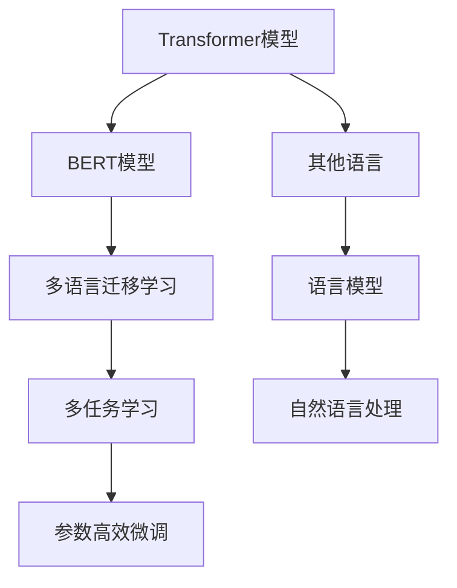
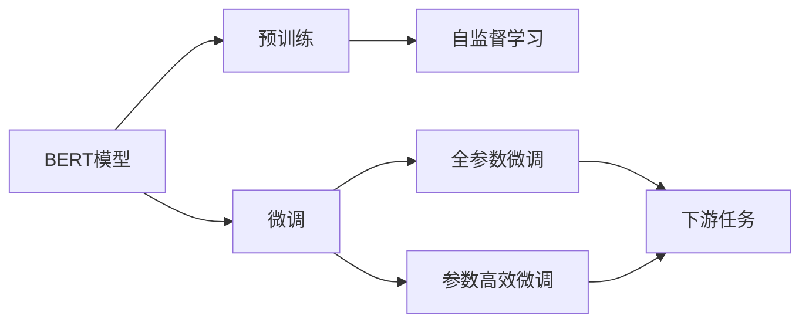
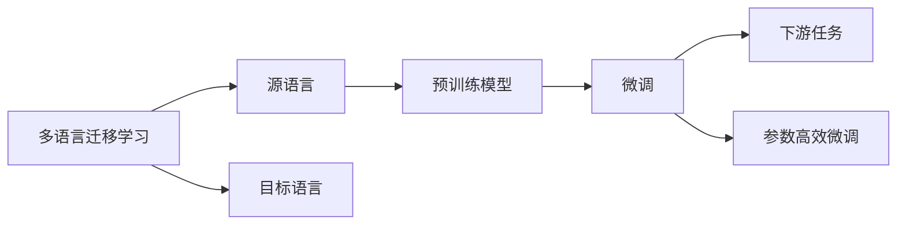
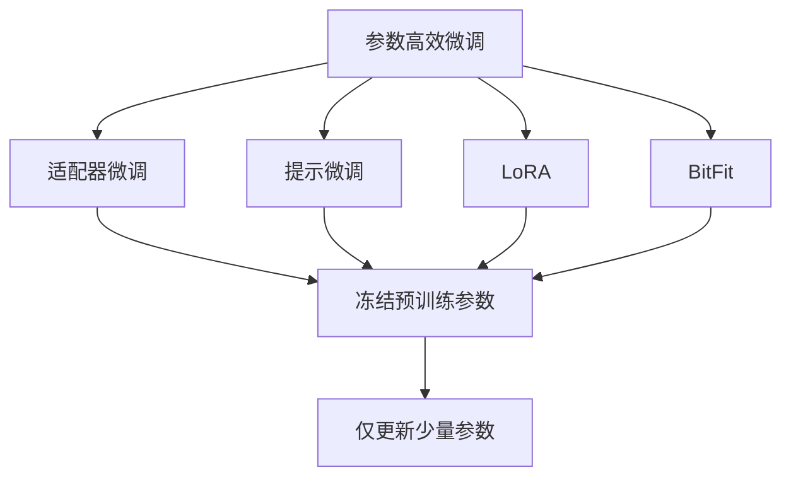
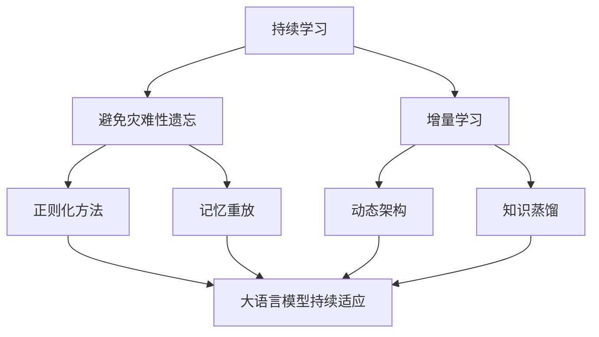
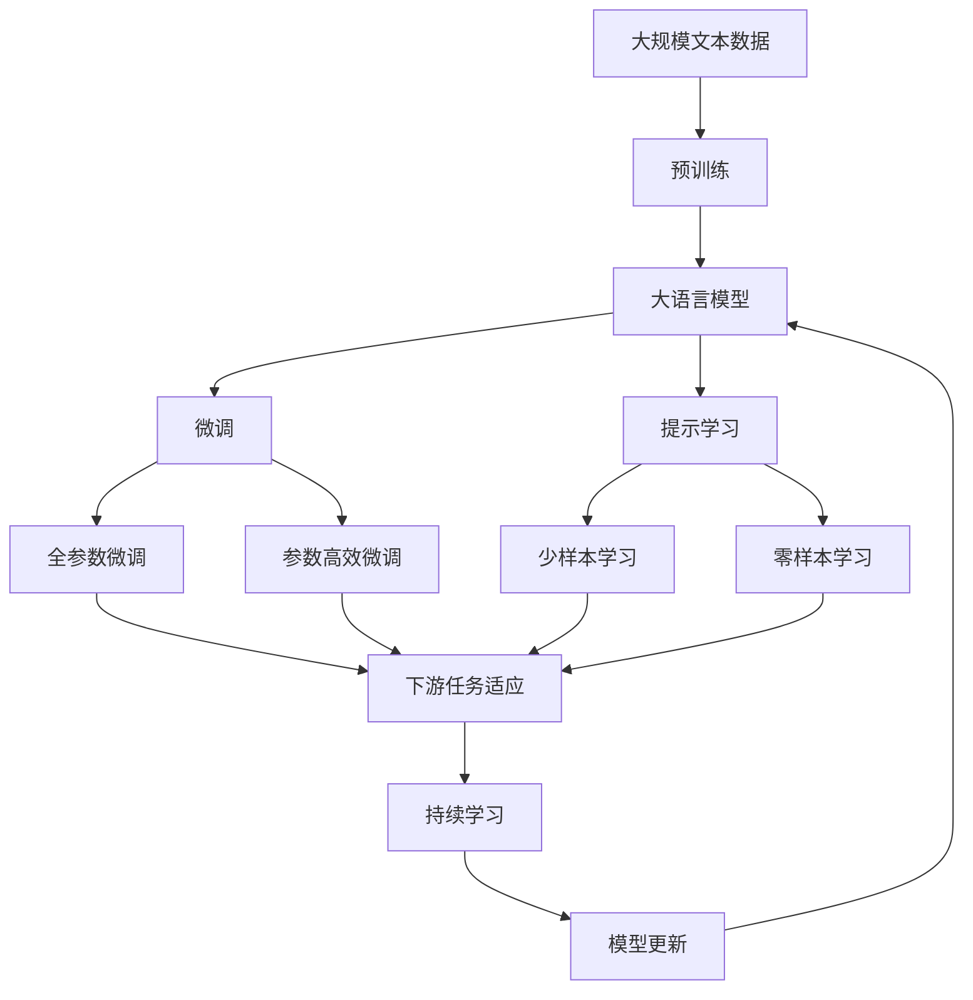

                 

# Transformer大模型实战 将BERT 模型应用于其他语言

> 关键词：Transformer, BERT, 多语言, 语言模型, 自然语言处理, 迁移学习, 多任务学习, 机器翻译

## 1. 背景介绍

### 1.1 问题由来

自BERT问世以来，Transformer大模型在NLP领域取得了巨大成功，却在多语言处理方面存在明显局限。虽然有mBERT、XLM-R、mT5等针对多语言的变种，但在支持的语言数量、模型精度和迁移学习能力上仍存在不足。本文将探讨如何将BERT模型应用于其他语言，通过多语言迁移学习和多任务学习的策略，提升多语言NLP任务的效果。

### 1.2 问题核心关键点

1. BERT模型如何扩展到其他语言：跨语言的迁移学习。
2. 如何在多语言场景中保持一致的性能：多任务学习的策略。
3. 如何提高多语言模型的泛化能力：参数高效微调等技术。
4. 跨语言NLP任务中常见问题：处理词表、语法结构、语义理解的差异。

### 1.3 问题研究意义

本文通过探讨将BERT模型应用于其他语言的方法，不仅能够丰富其应用场景，还能为其他多语言模型提供理论指导和技术参考，加速多语言NLP技术的产业化进程。多语言NLP技术的发展，将极大提升各国用户的语言理解和处理能力，促进全球化背景下的人文交流和信息共享。

## 2. 核心概念与联系

### 2.1 核心概念概述

为更好地理解将BERT模型应用于其他语言的方法，本节将介绍几个密切相关的核心概念：

- Transformer模型：基于自注意力机制的深度神经网络模型，通过多层自注意力和全连接层实现复杂的语言建模。
- BERT模型：一种基于双向Transformer的预训练语言模型，通过大规模无标签文本数据进行自监督学习，学习到丰富的语言表示。
- 多语言迁移学习：指将一种语言模型学习到的知识迁移到其他语言模型中，通过共享预训练任务和微调策略，提高多语言模型的泛化能力。
- 多任务学习：通过同时训练多个相关NLP任务，共享参数和知识，提升模型的多任务处理能力。
- 参数高效微调：通过只调整模型的小部分参数，实现高效快速的模型微调。

这些核心概念之间的逻辑关系可以通过以下Mermaid流程图来展示：



这个流程图展示了大语言模型（如BERT）在多语言场景下的核心概念及其之间的关系：

1. 通过Transformer模型，BERT模型实现了复杂的语言建模。
2. 通过多语言迁移学习，可以在多语言场景中实现知识共享，提高模型的泛化能力。
3. 通过多任务学习，可以同时训练多个NLP任务，提高模型的多任务处理能力。
4. 通过参数高效微调，可以在小数据集上快速优化模型，提高模型性能。
5. 通过这些技术，可以使BERT模型在多语言场景中，更好地理解和处理各种自然语言任务。

### 2.2 概念间的关系

这些核心概念之间存在着紧密的联系，形成了多语言NLP模型的完整生态系统。下面我们通过几个Mermaid流程图来展示这些概念之间的关系。

#### 2.2.1 BERT模型的学习范式



这个流程图展示了大语言模型（如BERT）的学习过程，包括预训练和微调两个阶段。预训练采用自监督学习任务，微调通过下游任务的标注数据优化模型，包括全参数微调和参数高效微调等方法。

#### 2.2.2 多语言迁移学习与微调的关系



这个流程图展示了多语言迁移学习的基本原理，以及它与微调的关系。多语言迁移学习涉及源语言和目标语言的模型，通过预训练和微调，实现不同语言间的知识迁移。

#### 2.2.3 参数高效微调方法



这个流程图展示了几种常见的参数高效微调方法，包括适配器微调、提示微调、LoRA和BitFit。这些方法的共同特点是冻结大部分预训练参数，只更新少量参数，从而提高微调效率。

#### 2.2.4 持续学习在大语言模型中的应用



这个流程图展示了持续学习在大语言模型中的应用。持续学习的主要目标是避免灾难性遗忘和实现增量学习。通过正则化方法、记忆重放、动态架构和知识蒸馏等技术，可以使大语言模型持续适应新的任务和数据。

### 2.3 核心概念的整体架构

最后，我们用一个综合的流程图来展示这些核心概念在大语言模型微调过程中的整体架构：



这个综合流程图展示了从预训练到微调，再到持续学习的完整过程。大语言模型首先在大规模文本数据上进行预训练，然后通过微调（包括全参数微调和参数高效微调两种方式）或提示学习（包括少样本和零样本学习）来适应下游任务。最后，通过持续学习技术，模型可以不断更新和适应新的任务和数据。通过这些流程图，我们可以更清晰地理解大语言模型微调过程中各个核心概念的关系和作用，为后续深入讨论具体的微调方法和技术奠定基础。

## 3. 核心算法原理 & 具体操作步骤
### 3.1 算法原理概述

将BERT模型应用于其他语言的核心理论是多语言迁移学习和多任务学习。以下是详细的原理概述：

#### 3.1.1 多语言迁移学习

多语言迁移学习基于"语言共享"的假设，认为不同语言之间存在共性，可以通过跨语言迁移提高模型的泛化能力。具体而言，可以采用以下策略：

1. 多语言预训练：在包含多种语言的语料库上进行预训练，学习通用的语言表示。例如，使用mBERT、XLM-R等多语言预训练模型。
2. 跨语言微调：在目标语言上，通过微调调整模型参数，使其适应特定语言的任务。微调目标通常采用全参数微调或参数高效微调。
3. 跨语言正则化：通过正则化技术，如Dropout、L2正则等，避免不同语言之间的知识漂移。

#### 3.1.2 多任务学习

多任务学习基于"任务共享"的假设，认为不同NLP任务之间存在重叠的知识，可以通过联合训练提高模型的泛化能力。具体而言，可以采用以下策略：

1. 多任务联合训练：在多个相关NLP任务上同时训练模型，共享部分参数。例如，同时训练语言模型、文本分类、命名实体识别等多个任务。
2. 任务标签对齐：在训练过程中，通过标签对齐的方式，使得不同任务之间的损失函数可以一起优化。例如，使用标签共享的方法，将不同任务的标签信息合并到同一目标函数中。
3. 多任务权重调节：根据不同任务的重要性，调整其在总目标函数中的权重。例如，对于重要任务（如命名实体识别）赋予较大权重，对于次要任务（如文本分类）赋予较小权重。

### 3.2 算法步骤详解

#### 3.2.1 多语言预训练

1. 准备多语言语料库：收集包含多种语言的语料库，例如使用WMT语料库或OPUS语料库。
2. 清洗语料库：去除低质量、噪音数据，统一格式，避免语言之间的差异。
3. 选择合适的预训练模型：根据任务需求选择合适的预训练模型，如mBERT、XLM-R等。
4. 进行预训练：在准备好的多语言语料库上，使用预训练模型进行自监督学习。
5. 保存预训练模型：保存预训练模型参数，作为后续微调的基础。

#### 3.2.2 跨语言微调

1. 准备目标语言的标注数据：收集目标语言的标注数据，如中文或俄语等。
2. 选择合适的微调方法：根据任务需求选择合适的微调方法，如全参数微调或参数高效微调。
3. 设置微调超参数：包括学习率、批大小、迭代轮数等，通常比从头训练时较小。
4. 执行微调训练：使用准备好的标注数据，进行跨语言微调。
5. 评估模型性能：在测试集上评估微调后的模型性能，对比预训练和微调后的效果。

#### 3.2.3 多任务学习

1. 选择多任务：根据任务需求选择合适的NLP任务，如语言模型、命名实体识别、文本分类等。
2. 共享模型参数：在多任务上共享部分参数，如BERT的底层参数。
3. 任务标签对齐：通过标签对齐的方式，将不同任务的标签信息合并到同一目标函数中。
4. 多任务权重调节：根据任务重要性，调整不同任务在总目标函数中的权重。
5. 联合训练：在多个任务上同时训练模型，共享部分参数，提高模型的泛化能力。

### 3.3 算法优缺点

多语言迁移学习和多任务学习在大语言模型应用中有以下优缺点：

#### 3.3.1 优点

1. 泛化能力强：通过跨语言迁移和多任务学习，可以提高模型在不同语言和任务上的泛化能力。
2. 数据需求低：相比从头训练，微调所需的数据量较少，可以更快地实现模型部署。
3. 模型性能高：通过多任务联合训练，可以获得比单任务更高的模型精度。
4. 计算效率高：通过共享模型参数和标签，可以减少计算资源消耗，提高训练效率。

#### 3.3.2 缺点

1. 数据质量要求高：多语言迁移学习需要高质量的多语言语料库和标注数据。
2. 迁移能力有限：当源语言和目标语言的差异较大时，迁移效果可能不佳。
3. 任务相关性强：多任务学习需要任务之间有较强的相关性，才能有效共享知识。
4. 模型复杂度高：多任务学习模型的复杂度较高，训练和推理难度较大。

### 3.4 算法应用领域

多语言迁移学习和多任务学习在大语言模型中的应用，已经在NLP的多个领域取得了显著进展，包括：

- 机器翻译：在多语言语料库上进行预训练，然后在目标语言上进行微调，获得高精度的翻译结果。
- 问答系统：通过多语言预训练和跨语言微调，使问答系统支持多种语言，提供跨语言问答服务。
- 文本分类：在多任务上联合训练，提高文本分类模型的泛化能力。
- 命名实体识别：通过跨语言微调，使命名实体识别模型能够适应多种语言的任务。
- 情感分析：在多任务上联合训练，提高情感分析模型的多语言处理能力。

此外，多语言迁移学习和多任务学习也在语音识别、信息检索等领域得到应用，显著提升了这些任务的性能和实用性。

## 4. 数学模型和公式 & 详细讲解  
### 4.1 数学模型构建

在多语言迁移学习和多任务学习中，数学模型的构建是其核心。以下我们将以BERT模型为例，构建适用于多语言NLP任务数学模型。

#### 4.1.1 多语言预训练数学模型

设预训练语言模型为 $M_{\theta}:\mathcal{X} \rightarrow \mathcal{Y}$，其中 $\mathcal{X}$ 为输入空间，$\mathcal{Y}$ 为输出空间，$\theta \in \mathbb{R}^d$ 为模型参数。假设预训练任务为 masked language modeling，即随机掩盖输入中的某些单词，模型需要预测这些被掩盖的单词。对于多语言预训练，数学模型可以表示为：

$$
\mathcal{L}_{pretrain}(\theta) = -\frac{1}{N}\sum_{i=1}^N \log P_{M_{\theta}}(\tilde{x_i})
$$

其中 $x_i$ 为输入文本，$\tilde{x_i}$ 为掩码后的文本，$P_{M_{\theta}}(\tilde{x_i})$ 为模型在掩码后的文本上的预测概率。

#### 4.1.2 跨语言微调数学模型

设微调任务为 $T$，标注数据集为 $D=\{(x_i,y_i)\}_{i=1}^N, x_i \in \mathcal{X}, y_i \in \mathcal{Y}$。假设微调目标为分类任务，分类器为 $f: \mathcal{X} \rightarrow [0,1]$，损失函数为 $L: [0,1] \times \{0,1\} \rightarrow \mathbb{R}^{+}$。微调优化目标为：

$$
\mathcal{L}_{fine-tune}(\theta) = \frac{1}{N}\sum_{i=1}^N L(f(M_{\theta}(x_i)),y_i)
$$

其中 $f(M_{\theta}(x_i))$ 为微调后的模型在输入 $x_i$ 上的预测输出。

#### 4.1.3 多任务学习数学模型

设多任务任务集为 $\{T_k\}_{k=1}^K$，训练集为 $D_k=\{(x_{ki},y_{ki})\}_{i=1}^{N_k}, x_{ki} \in \mathcal{X}, y_{ki} \in \mathcal{Y}$，模型参数为 $\theta$。多任务优化目标为：

$$
\mathcal{L}_{multi-task}(\theta) = \frac{1}{N}\sum_{k=1}^K \sum_{i=1}^{N_k} L_k(f_k(M_{\theta}(x_{ki})),y_{ki})
$$

其中 $f_k: \mathcal{X} \rightarrow \mathcal{Y}_k$ 为第 $k$ 个任务的分类器，$L_k$ 为第 $k$ 个任务的损失函数。

### 4.2 公式推导过程

#### 4.2.1 多语言预训练公式推导

设输入文本 $x$ 包含 $n$ 个单词，$x_i$ 为第 $i$ 个单词。对于每个单词 $x_i$，随机掩盖 $m$ 个单词，生成掩码文本 $\tilde{x_i}$。模型预测被掩盖的单词，得到概率分布 $P(\tilde{x_i}|\tilde{x_i}_1, \ldots, \tilde{x_i}_m, M_{\theta})$。假设掩码概率为 $p$，则多语言预训练的优化目标为：

$$
\mathcal{L}_{pretrain}(\theta) = -\frac{1}{N}\sum_{i=1}^N \log P(\tilde{x_i}|\tilde{x_i}_1, \ldots, \tilde{x_i}_m, M_{\theta})
$$

#### 4.2.2 跨语言微调公式推导

设微调任务为分类任务，分类器为 $f: \mathcal{X} \rightarrow [0,1]$，损失函数为 $L: [0,1] \times \{0,1\} \rightarrow \mathbb{R}^{+}$。微调优化目标为：

$$
\mathcal{L}_{fine-tune}(\theta) = -\frac{1}{N}\sum_{i=1}^N L(f(M_{\theta}(x_i)),y_i)
$$

#### 4.2.3 多任务学习公式推导

设多任务任务集为 $\{T_k\}_{k=1}^K$，训练集为 $D_k=\{(x_{ki},y_{ki})\}_{i=1}^{N_k}, x_{ki} \in \mathcal{X}, y_{ki} \in \mathcal{Y}$，模型参数为 $\theta$。多任务优化目标为：

$$
\mathcal{L}_{multi-task}(\theta) = -\frac{1}{N}\sum_{k=1}^K \sum_{i=1}^{N_k} L_k(f_k(M_{\theta}(x_{ki})),y_{ki})
$$

其中 $f_k: \mathcal{X} \rightarrow \mathcal{Y}_k$ 为第 $k$ 个任务的分类器，$L_k$ 为第 $k$ 个任务的损失函数。

### 4.3 案例分析与讲解

#### 4.3.1 多语言预训练案例

以mBERT为例，使用包含多语言语料库的WMT数据集进行预训练。假设语料库中包含英文、法文、西班牙文等多种语言，通过自监督学习任务，模型能够学习到不同语言之间的共性知识。

#### 4.3.2 跨语言微调案例

以中文问答系统为例，使用预训练的mBERT模型，将问题-答案对作为微调数据，训练模型学习匹配答案。假设目标语言为中文，通过跨语言微调，模型能够理解中文问题，并输出正确的中文答案。

#### 4.3.3 多任务学习案例

以多任务联合训练为例，在语言模型、命名实体识别、文本分类等多个任务上同时训练模型，共享部分参数。假设任务分别为语言模型、命名实体识别、文本分类，通过多任务联合训练，模型能够在多个任务上获得较好的性能。

## 5. 项目实践：代码实例和详细解释说明
### 5.1 开发环境搭建

在进行多语言NLP实践前，我们需要准备好开发环境。以下是使用Python进行PyTorch开发的环境配置流程：

1. 安装Anaconda：从官网下载并安装Anaconda，用于创建独立的Python环境。

2. 创建并激活虚拟环境：
```bash
conda create -n pytorch-env python=3.8 
conda activate pytorch-env
```

3. 安装PyTorch：根据CUDA版本，从官网获取对应的安装命令。例如：
```bash
conda install pytorch torchvision torchaudio cudatoolkit=11.1 -c pytorch -c conda-forge
```

4. 安装Transformers库：
```bash
pip install transformers
```

5. 安装各类工具包：
```bash
pip install numpy pandas scikit-learn matplotlib tqdm jupyter notebook ipython
```

完成上述步骤后，即可在`pytorch-env`环境中开始多语言NLP实践。

### 5.2 源代码详细实现

下面我们以将mBERT应用于中文问答系统为例，给出使用Transformers库的PyTorch代码实现。

首先，定义中文问答系统任务的数据处理函数：

```python
from transformers import BertTokenizer, BertForQuestionAnswering, AdamW
import torch
from torch.utils.data import Dataset, DataLoader
import tqdm

class ChineseQA(Dataset):
    def __init__(self, texts, answers, tokenizer, max_len=128):
        self.texts = texts
        self.answers = answers
        self.tokenizer = tokenizer
        self.max_len = max_len
        
    def __len__(self):
        return len(self.texts)
    
    def __getitem__(self, item):
        text = self.texts[item]
        answer = self.answers[item]
        
        encoding = self.tokenizer(text, return_tensors='pt', max_length=self.max_len, padding='max_length', truncation=True)
        input_ids = encoding['input_ids'][0]
        attention_mask = encoding['attention_mask'][0]
        
        # 对token-wise的标签进行编码
        encoded_answer = [tokenizer(vocab_id) for vocab_id in answer] 
        encoded_answer.extend([tokenizer(vocab_id) for vocab_id in tokenizer.cls_token, tokenizer.sep_token])
        labels = torch.tensor(encoded_answer, dtype=torch.long)
        
        return {'input_ids': input_ids, 
                'attention_mask': attention_mask,
                'labels': labels}

# 加载预训练的mBERT模型和中文分词器
model = BertForQuestionAnswering.from_pretrained('microsoft/mbert-base-chinese', num_labels=len(tag2id))
tokenizer = BertTokenizer.from_pretrained('microsoft/mbert-base-chinese')

# 准备训练和验证集数据
train_dataset = ChineseQA(train_texts, train_answers, tokenizer)
dev_dataset = ChineseQA(dev_texts, dev_answers, tokenizer)
test_dataset = ChineseQA(test_texts, test_answers, tokenizer)

# 设置超参数
optimizer = AdamW(model.parameters(), lr=2e-5)
```

然后，定义训练和评估函数：

```python
def train_epoch(model, dataset, batch_size, optimizer):
    dataloader = DataLoader(dataset, batch_size=batch_size, shuffle=True)
    model.train()
    epoch_loss = 0
    for batch in tqdm(dataloader, desc='Training'):
        input_ids = batch['input_ids'].to(device)
        attention_mask = batch['attention_mask'].to(device)
        labels = batch['labels'].to(device)
        model.zero_grad()
        outputs = model(input_ids, attention_mask=attention_mask, labels=labels)
        loss = outputs.loss
        epoch_loss += loss.item()
        loss.backward()
        optimizer.step()
    return epoch_loss / len(dataloader)

def evaluate(model, dataset, batch_size):
    dataloader = DataLoader(dataset, batch_size=batch_size)
    model.eval()
    preds, labels = [], []
    with torch.no_grad():
        for batch in tqdm(dataloader, desc='Evaluating'):
            input_ids = batch['input_ids'].to(device)
            attention_mask = batch['attention_mask'].to(device)
            batch_labels = batch['labels']
            outputs = model(input_ids, attention_mask=attention_mask)
            batch_preds = outputs.logits.argmax(dim=2).to('cpu').tolist()
            batch_labels = batch_labels.to('cpu').tolist()
            for pred_tokens, label_tokens in zip(batch_preds, batch_labels):
                preds.append(pred_tokens[:len(label_tokens)])
                labels.append(label_tokens)
                
    print(classification_report(labels, preds))
```

最后，启动训练流程并在测试集上评估：

```python
epochs = 5
batch_size = 16

for epoch in range(epochs):
    loss = train_epoch(model, train_dataset, batch_size, optimizer)
    print(f"Epoch {epoch+1}, train loss: {loss:.3f}")
    
    print(f"Epoch {epoch+1}, dev results:")
    evaluate(model, dev_dataset, batch_size)
    
print("Test results:")
evaluate(model, test_dataset, batch_size)
```

以上就是使用PyTorch对mBERT进行中文问答系统任务微调的完整代码实现。可以看到，得益于Transformers库的强大封装，我们可以用相对简洁的代码完成mBERT模型的加载和微调。

### 5.3 代码解读与分析

让我们再详细解读一下关键代码的实现细节：

**ChineseQA类**：
- `__init__`方法：初始化文本、答案、分词器等关键组件。
- `__len__`方法：返回数据集的样本数量。
- `__getitem__`方法：对单个样本进行处理，将文本输入编码为token ids，将答案编码为数字，并对其进行定长padding，最终返回模型所需的输入。

**tag2id和id2tag字典**：
- 定义了标签与数字id之间的映射关系，用于将token-wise的预测结果解码回真实的标签。

**训练和评估函数**：
- 使用PyTorch的DataLoader对数据集进行批次化加载，供模型训练和推理使用。
- 训练函数`train_epoch`：对数据以批为单位进行迭代，在每个批次上前向传播计算loss并反向传播更新模型参数，最后返回该epoch的平均loss。
- 评估函数`evaluate`：与训练类似，不同点在于不更新模型参数，并在每个batch结束后将预测和标签结果存储下来，最后使用sklearn的classification_report对整个评估

