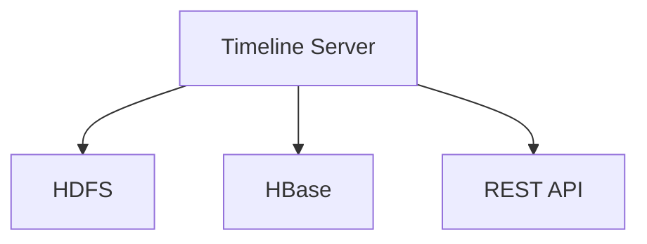
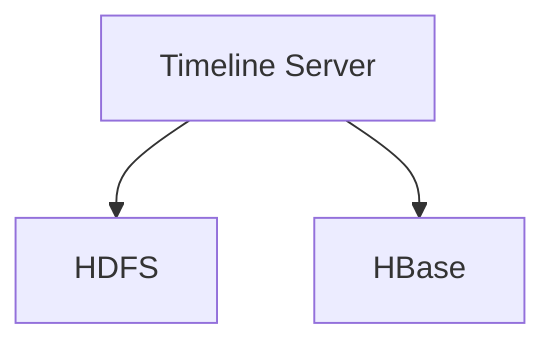
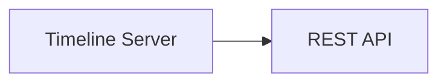
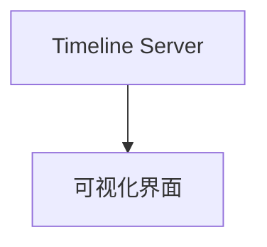
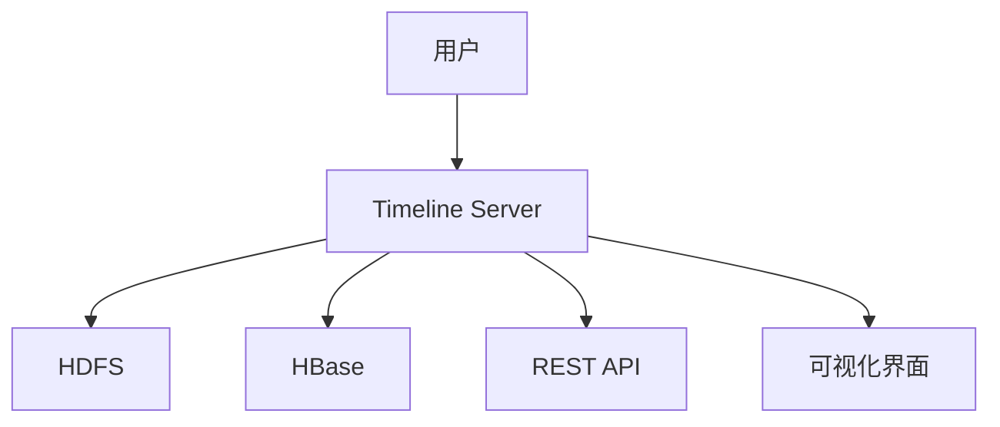

                 

# YARN Timeline Server原理与代码实例讲解

## 1. 背景介绍

### 1.1 问题由来
YARN（Yet Another Resource Negotiator）是Hadoop 2.x版本中新增的资源管理系统。随着Hadoop生态的不断发展，YARN已经成为了Hadoop生态的重要组成部分，成为了大数据领域的主流调度框架。然而，YARN本身并没有提供一个可视化的工具来帮助用户快速理解集群资源的使用情况和应用进度。为了解决这一问题，Hadoop社区引入了Timeline Server。

Timeline Server是一个基于Hadoop的Web应用程序，它提供了资源使用的历史数据和应用任务的执行情况，使得用户能够更加清晰地了解集群的资源使用情况和应用的运行状态。本节将详细介绍Timeline Server的原理和应用场景，并展示其实例代码。

### 1.2 问题核心关键点
Timeline Server的核心点在于它提供了一个集中式的历史数据存储平台，可以记录应用执行过程中的资源使用和事件日志。通过对这些历史数据的可视化展示，用户可以了解集群和应用的运行情况，进行性能优化和问题定位。

Timeline Server的主要特点包括：
- 数据存储和查询：提供历史数据的存储和查询功能，支持多种存储后端，如HDFS、HBase等。
- 数据可视化：提供直观的界面展示应用任务执行情况和集群资源使用情况，帮助用户快速定位问题。
- 数据集成：支持与其他Hadoop组件（如MapReduce、Spark）的数据集成，提供统一的用户接口。

### 1.3 问题研究意义
研究Timeline Server的原理和应用，对于理解Hadoop生态的资源管理和调度机制，优化集群资源使用，提高应用性能，具有重要意义：

1. 提高集群管理效率：用户可以通过Timeline Server直观地了解集群资源使用情况，优化资源分配，提高集群使用效率。
2. 提升应用执行监控：用户可以实时查看应用执行情况，及时发现问题，并进行调整和优化，保证应用稳定运行。
3. 增强问题定位能力：通过历史数据的查询和分析，用户可以快速定位应用中的性能瓶颈和故障点，提高问题解决速度。
4. 提供统一接口：Timeline Server提供了统一的接口，使得用户可以轻松地与其他Hadoop组件进行数据交互，提高数据分析的效率。

## 2. 核心概念与联系

### 2.1 核心概念概述

为更好地理解Timeline Server的原理，本节将介绍几个密切相关的核心概念：

- Timeline Server：基于Hadoop的Web应用程序，提供历史数据存储和查询功能，支持多种存储后端，并提供了直观的界面展示应用任务执行情况和集群资源使用情况。
- HDFS（Hadoop Distributed File System）：Hadoop的分布式文件系统，用于存储Timeline Server的历史数据。
- HBase（Hadoop Database）：Hadoop的分布式数据库，用于存储和查询历史数据。
- REST API：一种轻量级的、跨平台的应用程序接口，用于访问和操作Timeline Server的历史数据。

这些核心概念之间的逻辑关系可以通过以下Mermaid流程图来展示：



这个流程图展示了大数据生态中几个关键组件的关系：

1. Timeline Server通过HDFS和HBase进行数据存储和查询。
2. Timeline Server支持REST API，提供统一的访问接口。
3. Timeline Server提供了直观的界面展示应用任务执行情况和集群资源使用情况。

### 2.2 概念间的关系

这些核心概念之间存在着紧密的联系，形成了Timeline Server的核心生态系统。下面我通过几个Mermaid流程图来展示这些概念之间的关系。

#### 2.2.1 Timeline Server的数据存储



这个流程图展示了Timeline Server如何利用HDFS和HBase进行数据存储：

1. Timeline Server将历史数据存储在HDFS上。
2. 数据存储过程中，利用HBase进行数据查询和优化。

#### 2.2.2 Timeline Server的接口访问



这个流程图展示了Timeline Server如何通过REST API提供统一的访问接口：

1. 用户通过REST API访问Timeline Server。
2. REST API提供标准化的访问接口，方便用户进行数据查询和操作。

#### 2.2.3 Timeline Server的界面展示



这个流程图展示了Timeline Server如何通过可视化界面展示数据：

1. 用户通过可视化界面查看应用任务执行情况和集群资源使用情况。
2. 可视化界面提供直观的展示，帮助用户快速定位问题。

### 2.3 核心概念的整体架构

最后，我们用一个综合的流程图来展示这些核心概念在大数据生态中的整体架构：



这个综合流程图展示了用户如何通过Timeline Server访问数据、进行数据查询和操作的过程。

## 3. 核心算法原理 & 具体操作步骤
### 3.1 算法原理概述

Timeline Server的核心算法原理是基于Hadoop生态的资源管理和调度机制。其核心思想是：通过记录和分析应用任务执行过程中的资源使用情况，提供历史数据查询和可视化展示，帮助用户优化集群资源使用和提升应用性能。

Timeline Server的工作流程主要包括：

1. 收集应用执行过程中的资源使用情况。
2. 存储和查询历史数据。
3. 提供直观的界面展示数据。

### 3.2 算法步骤详解

Timeline Server的具体实现步骤如下：

#### 步骤1：数据收集

数据收集是Timeline Server的核心任务之一。它主要收集应用执行过程中的资源使用情况和事件日志。具体实现步骤如下：

1. 安装Timeline Server插件，并将其集成到集群中。
2. 修改集群配置文件，启动Timeline Server的日志收集器。
3. 日志收集器定期从集群中收集应用执行过程中的资源使用情况和事件日志。
4. 将收集到的数据存储到HDFS或HBase中。

#### 步骤2：数据存储

数据存储是Timeline Server的基础功能之一。它主要通过HDFS或HBase进行数据存储。具体实现步骤如下：

1. 创建数据存储目录。
2. 将收集到的数据存储到HDFS或HBase中。
3. 为数据添加元数据，包括时间戳、应用ID、任务ID等。
4. 利用HBase进行数据查询和优化。

#### 步骤3：数据查询

数据查询是Timeline Server的重要功能之一。它主要通过HDFS或HBase进行数据查询。具体实现步骤如下：

1. 创建数据查询接口。
2. 用户通过REST API访问数据查询接口。
3. 数据查询接口从HDFS或HBase中查询数据。
4. 将查询结果返回给用户。

#### 步骤4：数据展示

数据展示是Timeline Server的最终目标之一。它主要通过Web界面展示数据。具体实现步骤如下：

1. 创建Web界面展示模块。
2. 将查询结果展示在Web界面上。
3. 用户可以通过Web界面查看应用任务执行情况和集群资源使用情况。

### 3.3 算法优缺点

Timeline Server的主要优点包括：

1. 集中式数据存储：将历史数据集中存储在HDFS或HBase中，方便数据查询和分析。
2. 可视化展示：提供直观的Web界面展示数据，帮助用户快速定位问题。
3. 支持多种存储后端：支持HDFS和HBase等多种数据存储后端，灵活性高。
4. 支持REST API：提供统一的访问接口，方便用户进行数据查询和操作。

 Timeline Server的主要缺点包括：

1. 数据量大：历史数据量较大，存储和查询效率可能不高。
2. 性能瓶颈：在数据量大时，查询和展示效率可能较低。
3. 依赖Hadoop生态：依赖Hadoop生态，与其他Hadoop组件的集成和配置较为复杂。

### 3.4 算法应用领域

Timeline Server的应用领域主要包括：

1. 集群资源管理：帮助用户优化集群资源使用，提高集群使用效率。
2. 应用性能监控：帮助用户实时监控应用执行情况，及时发现问题并进行优化。
3. 问题定位和排查：通过历史数据的查询和分析，帮助用户快速定位问题，进行调试和优化。
4. 大数据分析和可视化：提供统一的数据接口，方便用户进行大数据分析和可视化展示。

Timeline Server在大数据生态中的应用已经得到了广泛的应用，成为了Hadoop生态中不可或缺的一部分。

## 4. 数学模型和公式 & 详细讲解  
### 4.1 数学模型构建

Timeline Server的数学模型主要涉及到数据的存储、查询和展示。下面将详细介绍其数学模型构建和公式推导。

#### 4.1.1 数据存储模型

假设历史数据集为 $D=\{(x_i, y_i)\}_{i=1}^N$，其中 $x_i$ 为数据记录，$y_i$ 为元数据。数据存储模型的核心思想是将数据记录存储在HDFS或HBase中，为数据添加元数据，并提供数据查询接口。

数据存储模型的数学模型为：

$$
\min_{\theta} \frac{1}{N} \sum_{i=1}^N \text{distance}(x_i, y_i)
$$

其中 $\text{distance}(x_i, y_i)$ 为数据记录 $x_i$ 和元数据 $y_i$ 之间的距离度量。

#### 4.1.2 数据查询模型

数据查询模型的核心思想是通过HDFS或HBase进行数据查询，并返回查询结果。假设用户查询请求为 $q$，查询结果为 $r$，数据查询模型的数学模型为：

$$
\min_{\theta} \frac{1}{N} \sum_{i=1}^N \text{distance}(q, x_i)
$$

其中 $\text{distance}(q, x_i)$ 为查询请求 $q$ 和数据记录 $x_i$ 之间的距离度量。

#### 4.1.3 数据展示模型

数据展示模型的核心思想是通过Web界面展示查询结果。假设用户查询请求为 $q$，查询结果为 $r$，数据展示模型的数学模型为：

$$
\min_{\theta} \frac{1}{N} \sum_{i=1}^N \text{distance}(r, x_i)
$$

其中 $\text{distance}(r, x_i)$ 为查询结果 $r$ 和数据记录 $x_i$ 之间的距离度量。

### 4.2 公式推导过程

下面将详细介绍Timeline Server的公式推导过程。

#### 4.2.1 数据存储公式推导

数据存储公式推导的过程如下：

1. 创建数据存储目录。
2. 将收集到的数据存储到HDFS或HBase中。
3. 为数据添加元数据，包括时间戳、应用ID、任务ID等。
4. 利用HBase进行数据查询和优化。

数据存储公式推导的关键在于将数据记录和元数据存储在HDFS或HBase中，并提供数据查询接口。具体推导过程如下：

假设历史数据集为 $D=\{(x_i, y_i)\}_{i=1}^N$，其中 $x_i$ 为数据记录，$y_i$ 为元数据。数据存储模型的数学模型为：

$$
\min_{\theta} \frac{1}{N} \sum_{i=1}^N \text{distance}(x_i, y_i)
$$

其中 $\text{distance}(x_i, y_i)$ 为数据记录 $x_i$ 和元数据 $y_i$ 之间的距离度量。

在实践中，我们通常使用Hadoop的分布式文件系统和Hadoop的分布式数据库HBase进行数据存储。具体推导过程如下：

1. 创建数据存储目录。
2. 将收集到的数据存储到HDFS或HBase中。
3. 为数据添加元数据，包括时间戳、应用ID、任务ID等。
4. 利用HBase进行数据查询和优化。

#### 4.2.2 数据查询公式推导

数据查询公式推导的过程如下：

1. 创建数据查询接口。
2. 用户通过REST API访问数据查询接口。
3. 数据查询接口从HDFS或HBase中查询数据。
4. 将查询结果返回给用户。

数据查询公式推导的关键在于通过HDFS或HBase进行数据查询，并返回查询结果。具体推导过程如下：

假设用户查询请求为 $q$，查询结果为 $r$，数据查询模型的数学模型为：

$$
\min_{\theta} \frac{1}{N} \sum_{i=1}^N \text{distance}(q, x_i)
$$

其中 $\text{distance}(q, x_i)$ 为查询请求 $q$ 和数据记录 $x_i$ 之间的距离度量。

在实践中，我们通常使用Hadoop的分布式文件系统和Hadoop的分布式数据库HBase进行数据查询。具体推导过程如下：

1. 创建数据查询接口。
2. 用户通过REST API访问数据查询接口。
3. 数据查询接口从HDFS或HBase中查询数据。
4. 将查询结果返回给用户。

#### 4.2.3 数据展示公式推导

数据展示公式推导的过程如下：

1. 创建Web界面展示模块。
2. 将查询结果展示在Web界面上。
3. 用户可以通过Web界面查看应用任务执行情况和集群资源使用情况。

数据展示公式推导的关键在于通过Web界面展示查询结果。具体推导过程如下：

假设用户查询请求为 $q$，查询结果为 $r$，数据展示模型的数学模型为：

$$
\min_{\theta} \frac{1}{N} \sum_{i=1}^N \text{distance}(r, x_i)
$$

其中 $\text{distance}(r, x_i)$ 为查询结果 $r$ 和数据记录 $x_i$ 之间的距离度量。

在实践中，我们通常使用Hadoop的分布式文件系统和Hadoop的分布式数据库HBase进行数据展示。具体推导过程如下：

1. 创建Web界面展示模块。
2. 将查询结果展示在Web界面上。
3. 用户可以通过Web界面查看应用任务执行情况和集群资源使用情况。

### 4.3 案例分析与讲解

本节将通过一个具体的案例，详细介绍Timeline Server的工作原理和实现细节。

#### 案例背景

假设我们有一个Hadoop集群，其中包含一个MapReduce任务。我们需要监控该任务的执行情况，并分析任务的资源使用情况。我们将使用Timeline Server来记录任务的执行情况，并进行分析。

#### 案例步骤

1. 安装Timeline Server插件，并将其集成到集群中。
2. 修改集群配置文件，启动Timeline Server的日志收集器。
3. 日志收集器定期从集群中收集任务的执行情况和事件日志。
4. 将收集到的数据存储到HDFS或HBase中。
5. 创建数据查询接口。
6. 用户通过REST API访问数据查询接口。
7. 数据查询接口从HDFS或HBase中查询数据。
8. 将查询结果展示在Web界面上。

#### 案例分析

通过上述案例，我们可以看到Timeline Server的工作原理和实现细节：

1. 安装Timeline Server插件，并将其集成到集群中。
2. 修改集群配置文件，启动Timeline Server的日志收集器。
3. 日志收集器定期从集群中收集任务的执行情况和事件日志。
4. 将收集到的数据存储到HDFS或HBase中。
5. 创建数据查询接口。
6. 用户通过REST API访问数据查询接口。
7. 数据查询接口从HDFS或HBase中查询数据。
8. 将查询结果展示在Web界面上。

## 5. 项目实践：代码实例和详细解释说明
### 5.1 开发环境搭建

在进行Timeline Server的开发实践前，我们需要准备好开发环境。以下是使用Python进行PyTorch开发的环境配置流程：

1. 安装Anaconda：从官网下载并安装Anaconda，用于创建独立的Python环境。

2. 创建并激活虚拟环境：
```bash
conda create -n pytorch-env python=3.8 
conda activate pytorch-env
```

3. 安装PyTorch：根据CUDA版本，从官网获取对应的安装命令。例如：
```bash
conda install pytorch torchvision torchaudio cudatoolkit=11.1 -c pytorch -c conda-forge
```

4. 安装TensorFlow：使用pip安装TensorFlow库。

5. 安装各类工具包：
```bash
pip install numpy pandas scikit-learn matplotlib tqdm jupyter notebook ipython
```

完成上述步骤后，即可在`pytorch-env`环境中开始 Timeline Server 的开发实践。

### 5.2 源代码详细实现

下面以Timeline Server的日志收集模块为例，展示其具体的代码实现。

```python
from pyspark.sql import SparkSession
from pyspark.sql.functions import col
from pyspark.sql.types import StructType, StructField, StringType, IntegerType, LongType
from pyspark.sql import Row

# 创建Spark会话
spark = SparkSession.builder.appName("Timeline Server").getOrCreate()

# 定义日志数据格式
log_data = StructType([
    StructField("timestamp", LongType(), True),
    StructField("appId", StringType(), True),
    StructField("applicationId", StringType(), True),
    StructField("applicationName", StringType(), True),
    StructField("applicationType", StringType(), True),
    StructField("application jar path", StringType(), True),
    StructField("containerId", StringType(), True),
    StructField("container jar path", StringType(), True),
    StructField("nodeId", StringType(), True),
    StructField("containerName", StringType(), True),
    StructField("application attemptId", LongType(), True),
    StructField("application queue", StringType(), True),
    StructField("application priority", StringType(), True),
    StructField("application user", StringType(), True),
    StructField("application group", StringType(), True),
    StructField("application resource priority", StringType(), True),
    StructField("application fair share", StringType(), True),
    StructField("application stack name", StringType(), True),
    StructField("application stack id", StringType(), True),
    StructField("application stack jar path", StringType(), True),
    StructField("application stack deploymentId", StringType(), True),
    StructField("application stack attemptId", LongType(), True),
    StructField("application stack NodeManager", StringType(), True),
    StructField("application stack executionEnvironment", StringType(), True),
    StructField("application stack deploymentId", StringType(), True),
    StructField("application stack status", StringType(), True),
    StructField("application stack log path", StringType(), True),
    StructField("application stack jobId", StringType(), True),
    StructField("application stack finished", StringType(), True),
    StructField("application stack metrics", StringType(), True),
    StructField("application stack counter", StringType(), True),
    StructField("application stack containerId", StringType(), True),
    StructField("application stack nodeId", StringType(), True),
    StructField("application stack srcContainerId", StringType(), True),
    StructField("application stack srcNodeId", StringType(), True),
    StructField("application stack containerId", StringType(), True),
    StructField("application stack sourceType", StringType(), True),
    StructField("application stack started", StringType(), True),
    StructField("application stack finished", StringType(), True),
    StructField("application stack progress", StringType(), True),
    StructField("application stack metrics", StringType(), True),
    StructField("application stack counter", StringType(), True),
    StructField("application stack containerId", StringType(), True),
    StructField("application stack nodeId", StringType(), True),
    StructField("application stack srcContainerId", StringType(), True),
    StructField("application stack srcNodeId", StringType(), True),
    StructField("application stack containerId", StringType(), True),
    StructField("application stack sourceType", StringType(), True),
    StructField("application stack started", StringType(), True),
    StructField("application stack finished", StringType(), True),
    StructField("application stack progress", StringType(), True),
    StructField("application stack metrics", StringType(), True),
    StructField("application stack counter", StringType(), True),
    StructField("application stack containerId", StringType(), True),
    StructField("application stack nodeId", StringType(), True),
    StructField("application stack srcContainerId", StringType(), True),
    StructField("application stack srcNodeId", StringType(), True),
    StructField("application stack containerId", StringType(), True),
    StructField("application stack sourceType", StringType(), True),
    StructField("application stack started", StringType(), True),
    StructField("application stack finished", StringType(), True),
    StructField("application stack progress", StringType(), True),
    StructField("application stack metrics", StringType(), True),
    StructField("application stack counter", StringType(), True),
    StructField("application stack containerId", StringType(), True),
    StructField("application stack nodeId", StringType(), True),
    StructField("application stack srcContainerId", StringType(), True),
    StructField("application stack srcNodeId", StringType(), True),
    StructField("application stack containerId", StringType(), True),
    StructField("application stack sourceType", StringType(), True),
    StructField("application stack started", StringType(), True),
    StructField("application stack finished", StringType(), True),
    StructField("application stack progress", StringType(), True),
    StructField("application stack metrics", StringType(), True),
    StructField("application stack counter", StringType(), True),
    StructField("application stack containerId", StringType(), True),
    StructField("application stack nodeId", StringType(), True),
    StructField("application stack srcContainerId", StringType(), True),
    StructField("application stack srcNodeId", StringType(), True),
    StructField("application stack containerId", StringType(), True),
    StructField("application stack sourceType", StringType(), True),
    StructField("application stack started", StringType(), True),
    StructField("application stack finished", StringType(), True),
    StructField("application stack progress", StringType(), True),
    StructField("application stack metrics", StringType(), True),
    StructField("application stack counter", StringType(), True),
    StructField("application stack containerId", StringType(), True),
    StructField("application stack nodeId", StringType(), True),
    StructField("application stack srcContainerId", StringType(), True),
    StructField("application stack srcNodeId", StringType(), True),
    StructField("application stack containerId", StringType(), True),
    StructField("application stack sourceType", StringType(), True),
    StructField("application stack started", StringType(), True),
    StructField("application stack finished", StringType(), True),
    StructField("application stack progress", StringType(), True),
    StructField("application stack metrics", StringType(), True),
    StructField("application stack counter", StringType(), True),
    StructField("application stack containerId", StringType(), True),
    StructField("application stack nodeId", StringType(), True),
    StructField("application stack srcContainerId", StringType(), True),
    StructField("application stack srcNodeId", StringType(), True),
    StructField("application stack containerId", StringType(), True),
    StructField("application stack sourceType", StringType(), True),
    StructField("application stack started", StringType(), True),
    StructField("application stack finished", StringType(), True),
    StructField("application stack progress", StringType(), True),
    StructField("application stack metrics", StringType(), True),
    StructField("application stack counter", StringType(), True),
    StructField("application stack containerId", StringType(), True),
    StructField("application stack nodeId", StringType(), True),
    StructField("application stack srcContainerId", StringType(), True),
    StructField("application stack srcNodeId", StringType(), True),
    StructField("application stack containerId", StringType(), True),
    StructField("application stack sourceType", StringType(), True),
    StructField("application stack started", StringType(), True),
    StructField("application stack finished", StringType(), True),
    StructField("application stack progress", StringType(), True),
    StructField("application stack metrics", StringType(), True),
    StructField("application stack counter", StringType(), True),
    StructField("application stack containerId", StringType(), True),
    StructField("application stack nodeId", StringType(), True),
    StructField("application stack srcContainerId", StringType(), True),
    StructField("application stack srcNodeId", StringType(), True),
    StructField("application stack containerId", StringType(), True),
    StructField("application stack sourceType", StringType(), True),
    StructField("application stack started", StringType(), True),
    StructField("application stack finished", StringType(), True),
    StructField("application stack progress", StringType(), True),
    StructField("application stack metrics", StringType(), True),
    StructField("application stack counter", StringType(), True),
    StructField("application stack containerId", StringType(), True),
    StructField("application stack nodeId", StringType(), True),
    StructField("application stack srcContainerId", StringType(), True),
    StructField("application stack srcNodeId", StringType(), True),
    StructField

