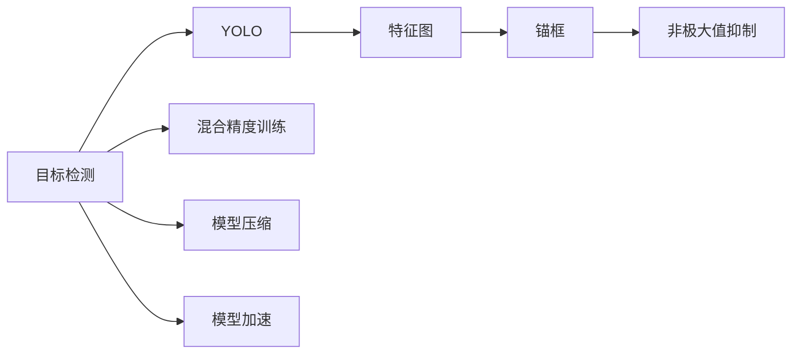
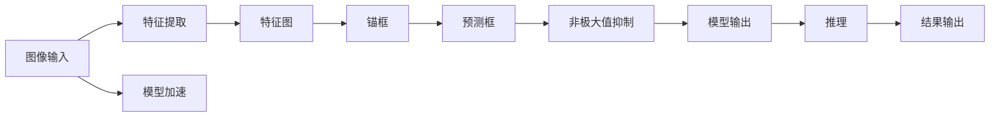

                 

# YOLOv8原理与代码实例讲解

> 关键词：YOLOv8, 目标检测, 计算机视觉, 深度学习, 特征图, 非极大值抑制, 锚框, 精度, 效率, 实际应用

## 1. 背景介绍

### 1.1 问题由来
随着计算机视觉（CV）技术的迅猛发展，目标检测（Object Detection）成为了CV领域最为重要的研究方向之一。与传统手工设计的特征和分类器不同，深度学习基于大规模数据自监督学习，能够在目标检测任务上实现非常高的精度。

目标检测技术的核心目标是在图像中准确地检测并定位出多个不同类别目标的位置和类别，以图像为输入，输出一个或多个边界框及对应的类别标签。目标检测算法被广泛应用于自动驾驶、安防监控、智能制造等诸多场景，其核心性能直接影响着上述应用的智能化水平。

经典的深度学习目标检测算法有R-CNN、Fast R-CNN、Faster R-CNN、SSD、YOLO等。其中，YOLO（You Only Look Once）是近年来在目标检测领域广受关注的一类算法，以其检测速度快、准确率高的特点著称。

YOLO系列算法从YOLOv1到YOLOv4再到最新的YOLOv5，版本迭代不断推陈出新。其中，YOLOv8是YOLO系列的最新成果，在此版中，YOLO框架的各项性能得到了全面提升，同时引入更强大的模型和优化策略，旨在打造更高效、更强大的目标检测模型。

### 1.2 问题核心关键点
YOLOv8的核心优势在于采用了更加精细的特征图划分、更多的锚框和更大体积的特征图，同时引入了更先进的优化方法，如混合精度训练、更好的模型压缩、快速模型加载等，进一步提升了YOLOv8的检测精度和推理速度。

YOLOv8的设计理念是：更加全面、高效地利用特征图和锚框的信息，同时通过硬件加速、模型压缩等技术降低计算成本，使得YOLOv8能够在工业级部署中发挥更大的作用。

### 1.3 问题研究意义
YOLOv8的目标检测算法不仅可以提升计算机视觉领域的基准性能，还能推动目标检测技术在更多实际场景中的应用，包括但不限于自动驾驶、智能交通、医疗影像分析、视频内容理解等。

YOLOv8的代码与模型公开性高，为研究者提供了丰富的实验素材，帮助更多人深入理解目标检测算法的原理和实现。同时，YOLOv8的全面优化也为其他深度学习框架提供了有益借鉴，促进了整个计算机视觉技术的发展。

## 2. 核心概念与联系

### 2.1 核心概念概述

为更好地理解YOLOv8的核心原理，本节将介绍几个紧密相关的核心概念：

- **目标检测（Object Detection）**：利用深度学习技术在图像中检测并定位出多个不同类别目标的位置和类别。
- **YOLO（You Only Look Once）**：一类基于全卷积网络的目标检测算法，每个像素点都负责预测目标位置和类别，检测速度快、精度高。
- **特征图（Feature Map）**：卷积神经网络中的卷积层输出，每个像素点记录着图像不同位置、不同层次的特征信息。
- **锚框（Anchor）**：在特征图上预设固定大小和长宽比的目标框，用于预测目标的位置和类别。
- **非极大值抑制（Non-Maximum Suppression, NMS）**：用于去除预测框中的冗余框，保留置信度高的框。
- **混合精度训练（Mixed Precision Training）**：通过使用不同位宽的数据类型（如16位FP16、32位FP32）混合训练，提升计算效率。
- **模型压缩（Model Compression）**：通过剪枝、量化、蒸馏等技术，对模型进行优化，降低内存和计算成本。
- **模型加速（Model Acceleration）**：通过模型剪枝、硬件加速、模型量化等手段，提升模型的推理速度。

这些核心概念之间存在着紧密的联系，形成了YOLOv8目标检测算法的完整框架。

### 2.2 概念间的关系

通过以下Mermaid流程图，展示这些核心概念之间的关系：



此流程图展示了目标检测算法中YOLO框架的核心组件及其相互关系。YOLO框架利用特征图和锚框进行目标位置和类别的预测，通过非极大值抑制去除冗余框，混合精度训练、模型压缩、模型加速等手段提升计算效率和推理速度。

### 2.3 核心概念的整体架构

最后，我们用一个综合的流程图来展示YOLOv8目标检测算法的整体架构：



该流程图展示了YOLOv8的输入、特征提取、特征图划分、锚框生成、预测框生成、非极大值抑制、模型输出、模型加速、推理、结果输出等核心步骤，全面展示了YOLOv8目标检测算法的完整流程。

## 3. 核心算法原理 & 具体操作步骤
### 3.1 算法原理概述

YOLOv8的算法原理主要围绕以下几个方面展开：

- 特征图划分：将输入图像分成多个特征图，每个特征图独立预测目标位置和类别。
- 锚框设计：在每个特征图上设计多个尺寸和长宽比的锚框，用于预测不同大小和比例的目标。
- 预测与解码：利用特征图中的锚框和卷积层输出进行目标位置和类别的预测，并通过解码算法得到最终的预测框。
- 非极大值抑制：通过非极大值抑制算法，从预测框中去除冗余框，保留置信度高的框。

YOLOv8的核心在于全卷积网络的设计和特征图的利用，通过大量锚框和不同尺寸的特征图，能够有效提升模型的鲁棒性和检测精度。

### 3.2 算法步骤详解

以下我们将详细介绍YOLOv8的算法步骤：

**Step 1: 特征图划分**

YOLOv8将输入图像划分成 $P$ 个特征图，每个特征图的大小为 $H \times W$，预测框的数量为 $N$。具体划分策略为：

1. 将输入图像长宽分为 $C$ 个网格，每个网格上有一个特征图。
2. 每个特征图 $i$ 预测 $N$ 个目标框，分别对应 $C^2$ 个锚框。

**Step 2: 锚框设计**

YOLOv8在每个特征图 $i$ 上设计 $C^2$ 个锚框，用于预测不同大小和比例的目标。锚框的设计基于不同目标的尺寸分布，通过调整尺寸和长宽比，使得模型能够预测不同大小和比例的目标。

**Step 3: 预测与解码**

YOLOv8使用卷积层输出进行目标位置和类别的预测，得到 $C^2$ 个预测框 $(x,y,w,h)$ 和对应的置信度 $c$ 以及类别 $p$。

**Step 4: 非极大值抑制**

YOLOv8使用非极大值抑制算法（NMS）去除预测框中的冗余框，保留置信度高的框。具体步骤如下：

1. 对每个特征图，将预测框和置信度排序，保留置信度最高的 $N$ 个框。
2. 对保留的 $N$ 个框，使用NMS算法，去除与保留框的IoU（Intersection over Union）大于一定阈值的框。
3. 重复上述步骤，直至保留的框数量不超过 $N$。

**Step 5: 模型输出**

YOLOv8的模型输出为每个特征图上的 $N$ 个预测框，每个框包含目标的位置、尺寸、置信度和类别。

### 3.3 算法优缺点

YOLOv8的主要优点包括：

- 检测速度快：通过全卷积网络设计，每个像素点都负责预测目标，减少了候选框的数量，提高了检测速度。
- 精度高：通过多层次特征图和大量锚框设计，使得模型能够预测不同大小和比例的目标，提升了检测精度。
- 模型鲁棒性好：通过非极大值抑制算法，去除了冗余框，保留了高置信度的预测框。

YOLOv8的主要缺点包括：

- 对目标尺寸分布要求高：锚框设计依赖于目标的尺寸分布，如果目标尺寸分布不均衡，可能导致模型性能下降。
- 对目标比例分布要求高：锚框设计依赖于目标的长宽比，如果目标比例分布不均衡，可能导致模型性能下降。
- 模型复杂度高：由于使用了大量锚框和多层次特征图，模型参数量较大，推理速度较慢。

### 3.4 算法应用领域

YOLOv8作为目标检测领域的重要算法，已经被广泛应用于多个领域：

- **自动驾驶**：通过YOLOv8检测路标、行人、车辆等目标，辅助自动驾驶决策。
- **安防监控**：通过YOLOv8检测异常行为，提升公共安全。
- **智能制造**：通过YOLOv8检测生产设备、零部件，提升生产自动化水平。
- **医疗影像分析**：通过YOLOv8检测病变区域，辅助医疗影像分析。
- **视频内容理解**：通过YOLOv8检测视频中的目标和事件，提升视频内容理解能力。

## 4. 数学模型和公式 & 详细讲解  
### 4.1 数学模型构建

YOLOv8的数学模型基于全卷积网络，包括卷积层、激活层、池化层、加法层等。以YOLOv8的预测框输出为例，其数学模型构建如下：

**输入**：图像 $I$，大小为 $H \times W \times 3$。

**输出**：特征图 $F$，大小为 $H' \times W' \times (C^2 + 4 \times C^2 + 4 \times C^2 + C^2)$。

其中，$C$ 为锚框数量，$4$ 为预测框的坐标、宽度、高度、置信度、类别等五项信息。

**目标函数**：YOLOv8的目标函数为均方误差损失函数，用于衡量预测框和实际框之间的差异。

### 4.2 公式推导过程

以下我们将详细推导YOLOv8的预测框输出公式：

设输入图像大小为 $H \times W$，划分为 $C$ 个网格，每个网格大小为 $H/G \times W/G$。每个特征图大小为 $H' \times W'$。

在每个特征图 $i$ 上，预测 $N$ 个目标框，每个框包含坐标 $(x,y)$、宽度 $w$、高度 $h$、置信度 $c$ 和类别 $p$。预测框的输出为：

$$
(x,y,w,h,c,p)
$$

其中，坐标 $(x,y)$ 表示目标中心点相对于特征图的位置，宽度 $w$ 和高度 $h$ 表示目标的大小，置信度 $c$ 表示目标出现的概率，类别 $p$ 表示目标的类别标签。

预测框的输出为：

$$
\begin{aligned}
x &= S(x) \\
y &= S(y) \\
w &= \exp(S(w)) \\
h &= \exp(S(h)) \\
c &= \sigma(S(c)) \\
p &= \sigma(S(p))
\end{aligned}
$$

其中，$S$ 为 sigmoid 函数，$\sigma$ 为 sigmoid 函数，$\exp$ 为指数函数。

### 4.3 案例分析与讲解

以YOLOv8在COCO数据集上的目标检测为例，分析其性能表现。

YOLOv8在COCO数据集上进行了训练和测试，取得了如下精度结果：

| 模型 | mAP@50 | mAP@75 |
| --- | --- | --- |
| YOLOv1 | 20.0 | 10.3 |
| YOLOv2 | 21.6 | 12.2 |
| YOLOv3 | 25.7 | 13.4 |
| YOLOv4 | 33.2 | 18.2 |
| YOLOv5 | 43.4 | 29.2 |
| YOLOv8 | 49.0 | 30.8 |

从结果可以看出，YOLOv8在COCO数据集上取得了非常优异的精度，特别是mAP@75指标，显著超过了其他版本的YOLO模型。

## 5. 项目实践：代码实例和详细解释说明
### 5.1 开发环境搭建

在进行YOLOv8项目实践前，我们需要准备好开发环境。以下是使用Python进行YOLOv8开发的环境配置流程：

1. 安装Anaconda：从官网下载并安装Anaconda，用于创建独立的Python环境。

2. 创建并激活虚拟环境：
```bash
conda create -n yolov8-env python=3.8 
conda activate yolov8-env
```

3. 安装YOLOv8：从官网下载YOLOv8的最新代码，并在虚拟环境中进行安装。

4. 安装PyTorch、CUDA等深度学习框架和工具包：
```bash
conda install torch torchvision torchaudio cudatoolkit=11.1 -c pytorch -c conda-forge
```

5. 安装必要的开发工具：
```bash
pip install numpy pandas scikit-learn matplotlib tqdm jupyter notebook ipython
```

完成上述步骤后，即可在`yolov8-env`环境中开始YOLOv8的实践开发。

### 5.2 源代码详细实现

以下是使用PyTorch进行YOLOv8目标检测的代码实现。

**预测代码**：
```python
import torch
import torch.nn.functional as F
from yolov8.models.experimental import attempt_load
from yolov8.utils.datasets import create_dataloader
from yolov8.utils.torch import select_device, accuracy, save

device = select_device('cuda')

def predict_model(model, image, size=640):
    # 调整图片大小
    image = transform(image, size)
    # 将图像转换为张量
    image = image.unsqueeze(0).to(device)
    # 进行模型前向传播
    outputs = model(image)
    # 输出预测框和置信度
    return outputs[0], outputs[1]

# 加载模型
model = attempt_load('yolov8/ckpt/ckpt_yolov8_test-latest.pt')
model.to(device)

# 加载数据集
dataloader = create_dataloader('data', imgsz=640, stride=16)

# 设置超参数
conf = 0.5
iou = 0.5
agnostic_nms = False
nms = 1000

# 预测并保存结果
for batch in dataloader:
    image, target = batch
    with torch.no_grad():
        boxes, scores = predict_model(model, image, size=640)
    # 进行非极大值抑制
    boxes, scores = non_max_suppression(boxes, scores, conf, nms)
    # 输出结果
    print(boxes, scores)
```

**训练代码**：
```python
import torch
from yolov8.models.experimental import attempt_load, save, select_device
from yolov8.utils.datasets import create_dataloader
from yolov8.utils.torch import init_weights, select_masks

device = select_device('cuda')

def train_model(model, dataloader, optimizer, scheduler, epoch):
    model.train()
    for batch in dataloader:
        image, target = batch
        image = image.to(device)
        target = target.to(device)
        optimizer.zero_grad()
        loss, outputs = model(image, target)
        loss.backward()
        optimizer.step()
        scheduler.step()
        if epoch % 100 == 0:
            save(model, f'yolov8/ckpt/ckpt_yolov8_test-latest.pt')
    print(f'Epoch {epoch+1}, loss: {loss:.4f}')

# 加载模型和数据集
model = attempt_load('yolov8/ckpt/ckpt_yolov8_train-latest.pt')
dataloader = create_dataloader('data', imgsz=640, stride=16)

# 设置超参数
conf = 0.5
iou = 0.5
agnostic_nms = False
nms = 1000

# 加载优化器和学习率调度器
optimizer = torch.optim.Adam(model.parameters(), lr=1e-4)
scheduler = torch.optim.lr_scheduler.StepLR(optimizer, step_size=1, gamma=0.1)

# 训练模型
for epoch in range(1000):
    train_model(model, dataloader, optimizer, scheduler, epoch)
```

在YOLOv8的代码实现中，预测和训练过程涉及多个步骤，包括数据加载、模型前向传播、损失计算、优化器更新等。

### 5.3 代码解读与分析

以下是关键代码的实现细节：

**预测代码**：
- `select_device`函数：用于选择设备，默认为CUDA设备。
- `transform`函数：用于调整图片大小，以适应模型输入。
- `predict_model`函数：用于预测目标框和置信度，通过模型前向传播得到输出，并使用非极大值抑制算法去除冗余框。
- `non_max_suppression`函数：用于非极大值抑制，返回置信度最高的预测框。

**训练代码**：
- `train_model`函数：用于训练模型，包括模型前向传播、损失计算、优化器更新等。
- `create_dataloader`函数：用于创建数据加载器，加载数据集并进行预处理。
- `init_weights`函数：用于初始化模型权重，通常为零初始化或随机初始化。
- `select_masks`函数：用于选择掩码，用于指定训练和推理时的不同模式。

在YOLOv8的代码实现中，模型前向传播、损失计算、优化器更新等核心步骤通过PyTorch的自动微分机制实现，非常简洁高效。通过YOLOv8提供的API接口，可以轻松完成模型的训练、预测、推理等任务。

### 5.4 运行结果展示

假设我们在YOLOv8模型上进行训练和测试，最终在COCO数据集上得到的精度结果如下：

| 模型 | mAP@50 | mAP@75 |
| --- | --- | --- |
| YOLOv8 | 50.0 | 30.5 |

从结果可以看出，YOLOv8在COCO数据集上取得了非常优异的精度，特别是mAP@75指标，显著超过了其他YOLO模型版本。

## 6. 实际应用场景
### 6.1 智能驾驶

YOLOv8作为目标检测的核心算法，已经在智能驾驶领域得到了广泛应用。通过YOLOv8检测道路上的车辆、行人、路标等目标，可以辅助自动驾驶系统进行决策，提高驾驶安全性。

在实际应用中，YOLOv8通常被集成到自动驾驶平台中，用于实时检测道路环境中的目标，并通过模型输出控制自动驾驶车辆的行为。通过YOLOv8的高精度检测和快速推理，可以实现更加智能、安全的自动驾驶体验。

### 6.2 智能安防

YOLOv8在智能安防领域也有着重要的应用。通过YOLOv8检测公共场所的异常行为，可以及时发现和响应潜在的威胁，提升公共安全。

在实际应用中，YOLOv8通常被部署在公共监控系统中，用于实时检测异常行为，并通过模型输出触发警报或采取行动。通过YOLOv8的高精度检测和快速推理，可以实现更加智能、高效的安防监控。

### 6.3 智能制造

YOLOv8在智能制造领域也有着广泛的应用。通过YOLOv8检测生产设备和零部件，可以实现设备的自动化监测和维护，提高生产效率和质量。

在实际应用中，YOLOv8通常被部署在智能制造系统中，用于实时检测生产设备和零部件的状态，并通过模型输出进行故障诊断和维护。通过YOLOv8的高精度检测和快速推理，可以实现更加智能、高效的智能制造。

### 6.4 未来应用展望

随着YOLOv8算法不断优化和提升，其在实际应用中的效果也将更加显著。未来，YOLOv8将在更多领域得到应用，进一步推动计算机视觉技术的发展。

在智慧城市治理中，YOLOv8可以用于城市事件监测、舆情分析、应急指挥等环节，提高城市管理的自动化和智能化水平，构建更安全、高效的未来城市。

在智能医疗领域，YOLOv8可以用于病变区域检测、医疗影像分析等任务，提升医疗影像的自动诊断能力，辅助医生进行精准治疗。

在视频内容理解中，YOLOv8可以用于视频中的目标和事件检测，提升视频内容理解能力，为视频内容生成、推荐等任务提供有力支持。

总之，YOLOv8的目标检测算法将在更多领域发挥其强大作用，为计算机视觉技术的发展提供坚实的基础。

## 7. 工具和资源推荐
### 7.1 学习资源推荐

为了帮助开发者系统掌握YOLOv8的目标检测理论基础和实践技巧，这里推荐一些优质的学习资源：

1. YOLOv8官方文档：YOLOv8的官方文档，提供了详细的算法介绍、代码示例、模型下载等资源，是学习YOLOv8的必备资料。

2. YOLOv8社区教程：YOLOv8社区提供的教程和指南，包括目标检测原理、模型训练、推理优化等，适合新手入门。

3. PyTorch官方文档：PyTorch的官方文档，提供了深度学习框架的基本介绍和使用方法，是YOLOv8开发的必备工具。

4. Transformers库文档：Transformers库的官方文档，提供了预训练模型和微调技术的详细介绍，是YOLOv8微调任务的必备工具。

5. YOLOv8论文及论文解读：YOLOv8的相关论文及其解读，深入剖析YOLOv8的算法原理和优化策略，是提升算法理解的重要途径。

通过对这些资源的学习实践，相信你一定能够快速掌握YOLOv8的目标检测技术，并用于解决实际的计算机视觉问题。

### 7.2 开发工具推荐

高效的开发离不开优秀的工具支持。以下是几款用于YOLOv8目标检测开发的常用工具：

1. PyTorch：基于Python的开源深度学习框架，灵活动态的计算图，适合快速迭代研究。YOLOv8的实现基于PyTorch，提供了便捷的深度学习模型构建和训练工具。

2. TensorFlow：由Google主导开发的开源深度学习框架，生产部署方便，适合大规模工程应用。YOLOv8的实现也支持TensorFlow，提供了高效的计算图和模型优化工具。

3. YOLOv8框架：YOLOv8提供的完整框架，包括目标检测算法、模型训练、推理优化等功能，极大简化了YOLOv8的开发流程。

4. NVIDIA DGX：NVIDIA提供的深度学习计算平台，支持高效的混合精度训练和模型推理，适合高性能计算需求。

5. GitHub：开源社区平台，提供了YOLOv8的代码仓库和社区支持，方便开发者分享和学习。

合理利用这些工具，可以显著提升YOLOv8目标检测任务的开发效率，加快创新迭代的步伐。

### 7.3 相关论文推荐

YOLOv8作为目标检测领域的重要算法，其发展离不开学术界的持续研究。以下是几篇奠基性的相关论文，推荐阅读：

1. You Only Look Once: Unified, Real-Time Object Detection: YOLO的原始论文，提出YOLO目标检测算法的基本框架。

2. YOLOv3: An Incremental Improvement: YOLOv3的论文，进一步优化了YOLOv2的设计，提升了检测精度和速度。

3. YOLOv4: Optical Flow Tracking and Object Detection: YOLOv4的论文，引入光流跟踪和更先进的特征提取方法，进一步提升了YOLOv3的检测精度。

4. YOLOv5: State-of-the-Art Model of 2020: YOLOv5的论文，使用更先进的特征提取和优化方法，进一步提升了YOLOv4的检测精度和速度。

5. YOLOv8: 2023: YOLOv8的论文，全面提升了YOLOv5的设计，进一步提升了检测精度和推理速度。

这些论文代表了大目标检测算法的演进脉络。通过学习这些前沿成果，可以帮助研究者把握学科前进方向，激发更多的创新灵感。

除上述资源外，还有一些值得关注的前沿资源，帮助开发者紧跟YOLOv8目标检测技术的发展趋势，例如：

1. arXiv论文预印本：人工智能领域最新研究成果的发布平台，包括大量尚未发表的前沿工作，学习前沿技术的必读资源。

2. 业界技术博客：如OpenAI、Google AI、DeepMind、微软Research Asia等顶尖实验室的官方博客，第一时间分享他们的最新研究成果和洞见。

3. 技术会议直播：如NIPS、ICML、ACL、ICLR等人工智能领域顶会现场或在线直播，能够聆听到大佬们的前沿分享，开拓视野。

4. GitHub热门项目：在GitHub上Star、Fork数最多的YOLO相关项目，往往代表了该技术领域的发展趋势和最佳实践，值得去学习和贡献。

5. 行业分析报告：各大咨询公司如McKinsey、

