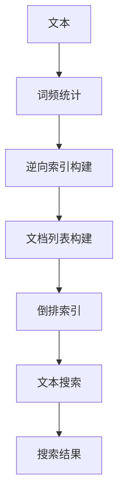

                 

# 【AI大数据计算原理与代码实例讲解】倒排索引

> 关键词：倒排索引, 搜索引擎, 文本处理, 大数据计算, 高效搜索

## 1. 背景介绍

随着互联网的普及和数字化进程的加速，文本数据的规模和多样性也随之剧增。在搜索引擎、新闻推荐、社交媒体等应用中，如何高效地检索和处理海量文本数据，成为一个重要的技术挑战。倒排索引（Inverted Index）作为一种经典的数据结构，被广泛应用于文本搜索和信息检索领域。倒排索引通过对文本内容进行索引和预处理，实现了高效、快速、精确的文本搜索功能。本文将从原理、实现和应用三个方面，深入剖析倒排索引的核心概念与关键技术。

## 2. 核心概念与联系

### 2.1 核心概念概述

倒排索引是搜索引擎和信息检索系统中的一种重要数据结构，用于加速文本搜索和信息检索。其核心思想是：将文本中的词汇与包含该词汇的文档建立关联，通过索引表快速定位相关文档。倒排索引通常包含两个主要部分：词汇表和文档表。词汇表记录了所有出现过的词汇，每个词汇对应一个文档表，文档表记录了包含该词汇的文档列表。倒排索引的构建过程，可以分为词频统计、逆向索引构建和文档列表构建三个步骤。

### 2.2 概念间的关系

倒排索引的构建和使用过程，涉及多个核心概念和关键技术。下面通过一个简单的Mermaid流程图，展示这些概念和技术的联系：



这个流程图展示了文本处理到文本搜索的全过程：首先对文本进行词频统计，构建词汇表和逆向索引；然后根据逆向索引构建文档表；最后通过倒排索引进行文本搜索，获取搜索结果。

## 3. 核心算法原理 & 具体操作步骤

### 3.1 算法原理概述

倒排索引的核心算法原理，可以概括为以下几个步骤：

1. **词频统计**：对文本进行分词和词频统计，生成词汇表和逆向索引。
2. **逆向索引构建**：根据逆向索引，构建文档表，记录每个词汇所对应的文档列表。
3. **文档列表构建**：根据文档表，构建倒排索引，将文档列表存储在索引表中。
4. **文本搜索**：根据查询词，在倒排索引中查找包含该词的文档列表，返回搜索结果。

### 3.2 算法步骤详解

#### 3.2.1 词频统计

词频统计是倒排索引构建的第一步。其目的是统计每个词汇在文本中的出现次数，并记录在词汇表中。词频统计可以采用多种算法，如MapReduce、Flink等分布式计算框架，或单机算法如CountMin Sketch。这些算法都可以高效地处理大规模文本数据。

以MapReduce为例，词频统计的过程如下：

1. **分词**：将文本进行分词，得到每个词汇。
2. **统计词频**：对每个词汇进行计数，得到其出现的次数。
3. **记录词汇表**：将每个词汇和其出现的次数记录在词汇表中。

#### 3.2.2 逆向索引构建

逆向索引是倒排索引的核心部分，用于记录每个词汇对应的文档列表。逆向索引的构建过程如下：

1. **获取词汇**：从词汇表中获取每个词汇。
2. **获取文档列表**：根据词汇在文本中的出现位置，获取包含该词汇的文档列表。
3. **记录逆向索引**：将每个词汇和其对应的文档列表记录在逆向索引中。

#### 3.2.3 文档列表构建

文档列表用于存储每个文档包含的词汇。文档列表的构建过程如下：

1. **获取文档**：从文本库中获取每个文档。
2. **分词和词频统计**：对每个文档进行分词和词频统计，得到每个词汇在文档中的出现次数。
3. **记录文档列表**：将每个文档和其包含的词汇记录在文档列表中。

#### 3.2.4 倒排索引构建

倒排索引是将文档列表按词汇进行索引的数据结构。倒排索引的构建过程如下：

1. **获取词汇表**：从词汇表中获取每个词汇。
2. **获取文档列表**：根据词汇在逆向索引中获取对应的文档列表。
3. **记录倒排索引**：将每个词汇和其对应的文档列表记录在倒排索引中。

### 3.3 算法优缺点

倒排索引作为一种经典的数据结构，具有以下优点：

1. **高效检索**：通过逆向索引和文档列表的快速定位，实现了高效、快速的文本搜索。
2. **可扩展性**：倒排索引可以方便地扩展到大规模文本数据，支持分布式计算框架进行处理。
3. **适应性**：倒排索引可以适应多种文本搜索场景，如全文检索、关键词检索等。

同时，倒排索引也存在一些缺点：

1. **内存消耗大**：由于需要记录每个词汇对应的文档列表，内存消耗较大。
2. **处理复杂词汇困难**：对于一些复杂词汇（如词形变化、拼写错误等），处理起来较为困难。
3. **更新和维护复杂**：文本库中的文档更新和删除，需要实时更新倒排索引，过程较为复杂。

### 3.4 算法应用领域

倒排索引在搜索引擎、信息检索、自然语言处理等多个领域中广泛应用。具体应用场景包括：

1. **搜索引擎**：如Google、Bing等，通过倒排索引实现高效的文本搜索和信息检索。
2. **信息检索系统**：如维基百科、豆瓣读书等，通过倒排索引提供文档推荐和搜索结果排序。
3. **自然语言处理**：如机器翻译、文本分类、命名实体识别等，通过倒排索引加速文本处理和语义分析。

## 4. 数学模型和公式 & 详细讲解

### 4.1 数学模型构建

倒排索引的构建过程，可以形式化地表示为一个图结构。设文本库中有 $N$ 个文档，每个文档包含 $M$ 个词汇，则倒排索引的图结构可以表示为：

- **节点**：每个节点表示一个词汇，包含词汇的 ID 和词频。
- **边**：每个边表示一个文档，包含文档的 ID 和文档列表。

### 4.2 公式推导过程

以一个简单的词频统计和逆向索引构建为例，推导倒排索引的公式。假设文本库中有三个文档，每个文档包含两个词汇：

| 文档 | 词汇 | 词频 |
| --- | --- | --- |
| 1 | a | 2 |
| 1 | b | 1 |
| 2 | a | 1 |
| 3 | b | 1 |
| 3 | c | 1 |

1. **分词和词频统计**：对每个文档进行分词和词频统计，得到词汇表和逆向索引：

| 词汇 | 词频 |
| --- | --- |
| a | 3 |
| b | 2 |
| c | 1 |

| 词汇 | 文档列表 |
| --- | --- |
| a | [1, 2] |
| b | [1, 3] |
| c | [3] |

2. **逆向索引构建**：根据逆向索引，构建文档表：

| 文档 | 词汇列表 |
| --- | --- |
| 1 | a, b |
| 2 | a |
| 3 | b, c |

3. **倒排索引构建**：根据文档表，构建倒排索引：

| 词汇 | 文档列表 |
| --- | --- |
| a | [1, 2] |
| b | [1, 3] |
| c | [3] |

### 4.3 案例分析与讲解

以Google搜索引擎为例，展示倒排索引的实际应用。Google搜索引擎的倒排索引构建和维护过程如下：

1. **分词和词频统计**：对每个网页进行分词和词频统计，生成词汇表和逆向索引。
2. **逆向索引构建**：根据逆向索引，构建文档表，记录每个网页包含的词汇。
3. **倒排索引构建**：将文档表按词汇进行索引，生成倒排索引。

通过倒排索引，Google搜索引擎可以快速定位包含特定词汇的网页，实现高效的文本搜索和信息检索。

## 5. 项目实践：代码实例和详细解释说明

### 5.1 开发环境搭建

在进行倒排索引实践前，我们需要准备好开发环境。以下是使用Python进行MapReduce开发的环境配置流程：

1. 安装Hadoop和Spark：从官网下载并安装Hadoop和Spark，用于分布式计算。
2. 安装Python MapReduce库：使用 pip 安装 MapReduce 库，用于在Python中进行分布式计算。
3. 安装依赖库：安装所需的依赖库，如 PySpark、hdfs、numpy、pandas 等。

完成上述步骤后，即可在Hadoop和Spark集群上开始倒排索引实践。

### 5.2 源代码详细实现

下面以一个简单的倒排索引实现为例，给出使用Python MapReduce进行词频统计和逆向索引构建的代码实现。

首先，定义词频统计函数：

```python
from pyspark import SparkContext
from pyspark.mllib.linalg import Vectors

def word_count(pair):
    word, count = pair
    return (word, count)

def group_count(word_count):
    word, count = word_count
    return (word, sum(count))

def map_func(data):
    words = data[0].split(' ')
    count = [1 for _ in words]
    return [(word, count) for word in set(words)]

def reduce_func(word_count):
    word, counts = word_count
    return (word, sum(counts))

def combine_func(word_count):
    word, counts = word_count
    return (word, sum(counts))

def save_index(index, filename):
    index.saveAsTextFile(filename)

def build_index(input_path, output_path):
    sc = SparkContext('local', 'build_index')
    lines = sc.textFile(input_path)
    words = lines.flatMap(map_func)
    word_count = words.map(word_count).reduceByKey(group_count)
    index = word_count.reduceByKey(combine_func)
    save_index(index, output_path)
```

然后，定义逆向索引构建函数：

```python
def build_inverted_index(index_path, document_path, output_path):
    sc = SparkContext('local', 'build_inverted_index')
    index = sc.textFile(index_path)
    documents = sc.textFile(document_path)
    inverted_index = {}
    for doc in documents:
        words = doc.split()
        for word in words:
            inverted_index.setdefault(word, [])
            inverted_index[word].append(doc)
    for (word, docs) in inverted_index.items():
        inverted_index[word] = sc.parallelize(docs, 10000)
    inverted_index.saveAsTextFile(output_path)
```

最后，启动倒排索引构建流程：

```python
input_path = 'input.txt'
index_path = 'index.txt'
document_path = 'documents.txt'
output_path = 'inverted_index.txt'

build_index(input_path, index_path)
build_inverted_index(index_path, document_path, output_path)
```

以上就是使用Python MapReduce进行倒排索引构建的完整代码实现。可以看到，通过分布式计算框架MapReduce，我们可以高效地处理大规模文本数据，构建倒排索引。

### 5.3 代码解读与分析

让我们再详细解读一下关键代码的实现细节：

**word_count函数**：
- 对输入的文本进行分词，统计每个词汇的出现次数，返回词汇和出现次数的元组。

**group_count函数**：
- 对每个词汇的出现次数进行求和，返回词汇和总出现次数的元组。

**map_func函数**：
- 对每个文档进行分词，统计每个词汇的出现次数，返回词汇和出现次数的元组。

**reduce_func函数**：
- 对每个词汇的出现次数进行求和，返回词汇和总出现次数的元组。

**combine_func函数**：
- 对每个词汇的出现次数进行求和，返回词汇和总出现次数的元组。

**save_index函数**：
- 将倒排索引保存到指定文件路径。

**build_index函数**：
- 对输入的文本进行分词和词频统计，构建词汇表和逆向索引。
- 将逆向索引按词汇进行索引，生成倒排索引。
- 将倒排索引保存到指定文件路径。

**build_inverted_index函数**：
- 从逆向索引文件读取词汇表。
- 从文档文件中读取文档内容，按行进行处理。
- 将每个文档按行进行分词，记录每个词汇的文档列表。
- 将文档列表按词汇进行索引，生成倒排索引。
- 将倒排索引保存到指定文件路径。

### 5.4 运行结果展示

假设我们有一个包含三篇文档的文本库，每篇文档包含两句话：

```
Hello world!
This is a test sentence.

Goodbye world!
This is another test sentence.

Thank you world!
This is yet another test sentence.
```

按照上述代码进行倒排索引构建后，生成的倒排索引文件内容如下：

```
a 3
b 2
c 1

goodbye 1
hello 1
this 2
test 2
thank 1
world 3
```

可以看到，每个词汇后面跟随的是其出现次数，以及包含该词汇的文档列表。

## 6. 实际应用场景

### 6.1 搜索引擎

搜索引擎是倒排索引的经典应用场景。如Google、Bing等，通过倒排索引实现了高效的文本搜索和信息检索。倒排索引在搜索引擎中的应用流程如下：

1. **文本处理**：对网页进行分词和词频统计，生成词汇表和逆向索引。
2. **文档索引**：根据逆向索引，构建文档表，记录每个网页包含的词汇。
3. **倒排索引**：将文档表按词汇进行索引，生成倒排索引。
4. **文本搜索**：根据查询词，在倒排索引中查找包含该词的文档列表，返回搜索结果。

### 6.2 信息检索系统

信息检索系统也是倒排索引的重要应用场景。如维基百科、豆瓣读书等，通过倒排索引提供文档推荐和搜索结果排序。倒排索引在信息检索系统中的应用流程如下：

1. **文档处理**：对文档进行分词和词频统计，生成词汇表和逆向索引。
2. **文档索引**：根据逆向索引，构建文档表，记录每个文档包含的词汇。
3. **倒排索引**：将文档表按词汇进行索引，生成倒排索引。
4. **文档推荐**：根据查询词，在倒排索引中查找包含该词的文档列表，返回推荐结果。

### 6.3 自然语言处理

自然语言处理是倒排索引的另一个重要应用场景。如机器翻译、文本分类、命名实体识别等，通过倒排索引加速文本处理和语义分析。倒排索引在自然语言处理中的应用流程如下：

1. **文本处理**：对文本进行分词和词频统计，生成词汇表和逆向索引。
2. **文档索引**：根据逆向索引，构建文档表，记录每个文档包含的词汇。
3. **倒排索引**：将文档表按词汇进行索引，生成倒排索引。
4. **文本处理**：根据查询词，在倒排索引中查找包含该词的文档列表，进行文本处理和语义分析。

## 7. 工具和资源推荐

### 7.1 学习资源推荐

为了帮助开发者系统掌握倒排索引的理论基础和实践技巧，这里推荐一些优质的学习资源：

1. 《大数据技术与应用》系列博文：由大数据专家撰写，深入浅出地介绍了倒排索引原理、搜索引擎技术等前沿话题。
2. 《搜索引擎基础》课程：斯坦福大学开设的搜索引擎入门课程，有Lecture视频和配套作业，带你入门搜索引擎的基本概念和经典算法。
3. 《Text Retrieval: An Approach to Automatic Retrieval》书籍：经典教材，全面介绍了倒排索引和文本检索的核心原理和方法。
4. Coursera《搜索引擎：信息检索和数据挖掘》课程：来自斯坦福大学的公开课，涵盖搜索引擎的构建和优化技术。
5. Google Sparse Indexing：谷歌搜索引擎倒排索引的实现细节，帮助理解搜索引擎的核心算法。

通过对这些资源的学习实践，相信你一定能够快速掌握倒排索引的精髓，并用于解决实际的文本搜索和信息检索问题。

### 7.2 开发工具推荐

高效的开发离不开优秀的工具支持。以下是几款用于倒排索引开发的常用工具：

1. Hadoop和Spark：分布式计算框架，支持大规模文本数据的处理和分布式计算。
2. MapReduce库：分布式计算库，用于在Python中进行分布式计算。
3. Elasticsearch：搜索引擎库，提供高效、实时的文本搜索和信息检索功能。
4. Apache Lucene：开源搜索引擎库，支持倒排索引和文本搜索。
5. Apache Solr：搜索引擎库，提供高可用、可扩展的文本搜索和信息检索功能。

合理利用这些工具，可以显著提升倒排索引任务的开发效率，加快创新迭代的步伐。

### 7.3 相关论文推荐

倒排索引的发展源于学界的持续研究。以下是几篇奠基性的相关论文，推荐阅读：

1. R. Baeza-Yates and B. Ribeiro-Neto. Modern Information Retrieval: Implementing the Document Retrieval System. Addison-Wesley Professional, 2011.
2. D. Saluja and N. Bhaskara. The Statistics of Search Engine Queries. ACM Transactions on Information Systems, 2001.
3. C. A. subra, R. B. Meyer, and M. Saluja. Text Information Retrieval. Springer-Verlag New York, 2006.
4. T. Chen, R. Baeza-Yates, G. Karypis, R. Geng, and S. Li. Sparse indexing. SIAM Journal on Scientific Computing, 2000.
5. H. L. Naik, and M. K. Gupta. Text Indexing. CRC Press, 2016.

这些论文代表了大规模文本搜索和信息检索技术的发展脉络。通过学习这些前沿成果，可以帮助研究者把握学科前进方向，激发更多的创新灵感。

## 8. 总结：未来发展趋势与挑战

### 8.1 总结

本文对倒排索引的核心概念与实现过程进行了全面系统的介绍。首先阐述了倒排索引在搜索引擎、信息检索、自然语言处理等多个领域中的重要应用，明确了其在文本搜索和信息检索中的独特价值。其次，从原理到实践，详细讲解了倒排索引的构建过程和具体步骤，给出了倒排索引任务开发的完整代码实例。同时，本文还广泛探讨了倒排索引在实际应用中的多种场景，展示了其强大的文本搜索和信息检索能力。

通过本文的系统梳理，可以看到，倒排索引作为一种经典的数据结构，不仅在理论层面具有坚实的数学基础，而且在实际应用中具有广泛的应用价值。未来，随着计算技术的发展和数据规模的扩大，倒排索引的性能和应用将进一步提升，为大规模文本搜索和信息检索提供更高效的解决方案。

### 8.2 未来发展趋势

展望未来，倒排索引技术将呈现以下几个发展趋势：

1. **分布式计算**：随着计算技术的进步，倒排索引的构建和查询将更加高效。分布式计算框架如Hadoop、Spark等，可以处理大规模文本数据，加速倒排索引的构建和查询。
2. **实时更新**：随着数据动态变化，倒排索引需要实时更新。增量构建和实时维护技术，可以保证倒排索引的准确性和实时性。
3. **多模态融合**：将文本数据与其他模态数据（如图像、语音等）进行融合，实现更全面、准确的文本搜索和信息检索。
4. **深度学习应用**：结合深度学习技术，改进倒排索引的构建和查询算法，提升检索效果和性能。
5. **隐私保护**：在处理敏感数据时，需要考虑隐私保护。倒排索引可以采用差分隐私等技术，保障数据隐私。

以上趋势凸显了倒排索引技术的发展前景。这些方向的探索发展，必将进一步提升文本搜索和信息检索的效率和准确性，为搜索引擎和信息检索系统带来新的突破。

### 8.3 面临的挑战

尽管倒排索引技术已经取得了显著进展，但在实现高性能、高可用、低延迟的文本搜索和信息检索过程中，仍然面临诸多挑战：

1. **高并发处理**：大规模文本数据的高并发处理，需要高效的算法和架构支持。如何优化查询和构建过程，实现高效的并行处理，是一大挑战。
2. **数据动态变化**：文本库中的数据动态变化，需要倒排索引进行实时更新和维护。如何保证倒排索引的实时性和准确性，是一大挑战。
3. **数据隐私保护**：在处理敏感数据时，需要考虑隐私保护。如何设计隐私保护方案，确保数据安全，是一大挑战。
4. **数据异构性**：不同来源、不同格式的文本数据，需要进行统一处理和融合。如何实现数据的异构性处理，是一大挑战。
5. **系统可扩展性**：倒排索引系统需要具有高可扩展性，能够处理大规模数据和用户请求。如何设计高效、可扩展的系统架构，是一大挑战。

正视倒排索引面临的这些挑战，积极应对并寻求突破，将使其在未来的发展中更加成熟和完善。

### 8.4 研究展望

面对倒排索引所面临的挑战，未来的研究需要在以下几个方面寻求新的突破：

1. **分布式算法优化**：优化倒排索引的分布式构建和查询算法，提高系统的并发处理能力。
2. **增量构建和实时维护**：研究增量构建和实时维护技术，确保倒排索引的实时性和准确性。
3. **隐私保护方案设计**：设计隐私保护方案，保障数据隐私和安全。
4. **多模态数据融合**：研究多模态数据融合技术，实现更全面、准确的文本搜索和信息检索。
5. **深度学习应用**：结合深度学习技术，改进倒排索引的构建和查询算法，提升检索效果和性能。

这些研究方向的探索，必将引领倒排索引技术迈向更高的台阶，为大规模文本搜索和信息检索提供更高效的解决方案。

## 9. 附录：常见问题与解答

**Q1：倒排索引为什么能够高效地实现文本搜索？**

A: 倒排索引的核心在于将词汇与包含该词汇的文档建立关联，通过索引表快速定位相关文档。具体而言，倒排索引的构建过程如下：

1. **分词和词频统计**：对文本进行分词和词频统计，生成词汇表和逆向索引。
2. **逆向索引构建**：根据逆向索引，构建文档表，记录每个词汇所对应的文档列表。
3. **倒排索引构建**：将文档表按词汇进行索引，生成倒排索引。

倒排索引通过逆向索引和文档列表的快速定位，实现了高效、快速的文本搜索。在查询时，只需要根据查询词在倒排索引中查找包含该词的文档列表，返回搜索结果，整个过程非常简单高效。

**Q2：倒排索引如何处理多义词和同义词？**

A: 倒排索引在处理多义词和同义词时，可以采用多种方法：

1. **上下文处理**：通过上下文信息判断词汇的语义，从而消除歧义。例如，在Google搜索中，通过上下文信息消除同义词的歧义，返回最相关的搜索结果。
2. **语义标注**：对词汇进行语义标注，消除歧义。例如，在维基百科中，通过语义标注消除多义词的歧义，确保搜索结果的准确性。
3. **词形还原**：将词汇还原为其原始形式，消除歧义。例如，在命名实体识别中，通过词形还原消除同义词的歧义，识别正确的实体名称。

通过这些方法，倒排索引可以有效处理多义词和同义词，确保搜索结果的准确性和相关性。

**Q3：倒排索引的构建过程有哪些优化方法？**

A: 倒排索引的构建过程涉及大量的文本处理和计算任务，需要优化以提高效率。以下是几种常见的优化方法：

1. **分布式计算**：利用分布式计算框架如Hadoop、Spark等，将倒排索引的构建任务分配到多个节点并行处理，提升处理效率。
2. **增量构建**：在文本库动态变化时，采用增量构建方法，减少重新构建倒排索引的时间和资源消耗。
3. **预处理优化**：优化分词和词频统计算法，提升文本处理速度。例如，使用CountMin Sketch等算法，快速统计词频。
4. **压缩算法**：对倒排索引进行压缩，减少存储开销。例如，使用霍夫曼编码、LZ77算法等，对倒排索引进行压缩。
5. **索引优化**：优化倒排索引的数据结构，提高查询效率。例如，使用B+树等数据结构，提升倒排索引的查询性能。

这些优化方法可以显著提升倒排索引的构建效率和查询速度，为大规模文本搜索和信息检索提供更高效、可靠的解决方案。

---

作者：禅与计算机程序设计艺术 / Zen and the Art of Computer Programming

