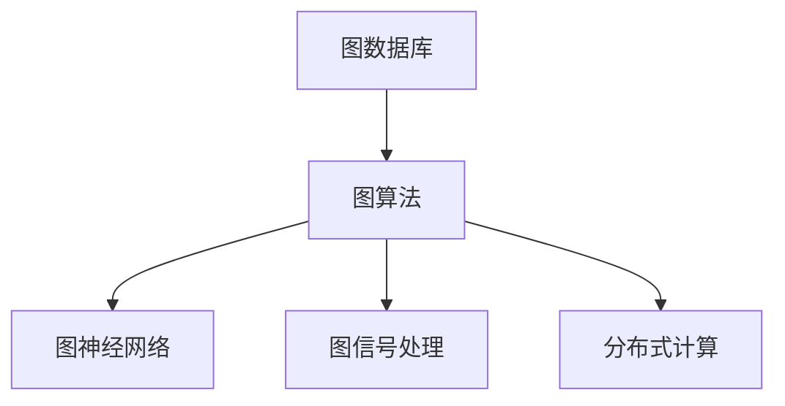

                 

# 【AI大数据计算原理与代码实例讲解】图计算引擎

> 关键词：图计算引擎,图数据库,图算法,图神经网络,图信号处理,分布式计算

## 1. 背景介绍

### 1.1 问题由来
随着互联网和社交媒体的迅速发展，大量复杂的关系型数据被生成并存储。传统的关系型数据库已难以满足这些数据处理的需求，而图计算引擎则成为了处理复杂关系数据的重要工具。

图计算引擎通过图形数据结构来描述实体之间的关系，并使用图算法对数据进行高效处理。相比于传统的SQL查询方式，图计算引擎提供了更加直观和高效的查询方式。

图计算引擎在社交网络分析、推荐系统、欺诈检测、知识图谱等多个领域得到了广泛应用。例如，Amazon使用图数据库Neo4j来优化推荐系统，LinkedIn使用图数据库来处理庞大的社交关系数据，Facebook使用图计算引擎Gryphon来分析和处理社交网络数据。

### 1.2 问题核心关键点
图计算引擎的核心关键点包括：
- 图结构：图计算引擎的核心数据结构是图，由节点和边组成。节点表示实体，边表示实体之间的关系。
- 图算法：图计算引擎通过图算法对图数据进行处理，如图遍历、聚类、排序、匹配等。
- 图神经网络：图神经网络是图计算引擎中的重要组成部分，可以自动学习图数据中的复杂关系。
- 图信号处理：图信号处理是图计算引擎的重要应用，可以将图数据转换为信号，进行信号处理。
- 分布式计算：图计算引擎通常采用分布式计算架构，以处理大规模的复杂图数据。

这些核心关键点共同构成了图计算引擎的基础架构，使其能够高效地处理复杂的关系型数据，并在多个领域中发挥重要作用。

## 2. 核心概念与联系

### 2.1 核心概念概述

为更好地理解图计算引擎，本节将介绍几个密切相关的核心概念：

- 图数据库：用于存储图结构数据的系统。图数据库中的节点和边都是有结构化的数据，可以进行快速的查询和更新操作。
- 图算法：用于对图数据进行各种操作的算法，如遍历、聚类、排序、匹配等。
- 图神经网络：一种特殊的神经网络，用于处理图数据。图神经网络可以对图数据进行自动学习，从而提取出图数据中的复杂关系。
- 图信号处理：一种处理图数据的技术，可以将图数据转换为信号，进行信号处理。
- 分布式计算：一种计算架构，用于处理大规模的图数据。分布式计算可以充分利用多个计算节点的资源，提高计算效率。

这些核心概念之间的逻辑关系可以通过以下Mermaid流程图来展示：



这个流程图展示了几类核心概念之间的关系：

1. 图数据库是图计算引擎的基础，用于存储图数据。
2. 图算法和图神经网络是图计算引擎的核心处理方式，用于对图数据进行处理和分析。
3. 图信号处理是图计算引擎的重要应用，可以将图数据转换为信号，进行信号处理。
4. 分布式计算是图计算引擎的计算架构，用于处理大规模的图数据。

这些概念共同构成了图计算引擎的基本架构，使其能够高效地处理复杂的关系型数据，并在多个领域中发挥重要作用。

### 2.2 概念间的关系

这些核心概念之间存在着紧密的联系，形成了图计算引擎的完整生态系统。下面我通过几个Mermaid流程图来展示这些概念之间的关系。

#### 2.2.1 图数据库和图算法的关联


这个流程图展示了图数据库和图算法之间的关系。图数据库中的图数据可以被图算法处理，生成各种有用的信息。

#### 2.2.2 图神经网络和图信号处理的关系


这个流程图展示了图神经网络和图信号处理之间的关系。图神经网络可以对图数据进行自动学习，生成的表示可以被图信号处理进行处理，得到更多的有用信息。

#### 2.2.3 分布式计算和图算法的关系


这个流程图展示了分布式计算和图算法之间的关系。分布式计算架构可以支持大规模的图数据处理，使得图算法能够高效地运行。

## 3. 核心算法原理 & 具体操作步骤

### 3.1 算法原理概述

图计算引擎的核心算法原理是图算法。图算法是对图数据进行操作的算法，包括遍历、聚类、排序、匹配等。图算法的基本思想是通过遍历图来获取图数据中的各种信息，并进行处理。

图算法的核心思想是将图数据表示为数据结构，如邻接矩阵、邻接表等，然后通过各种算法对图数据进行处理。常见的图算法包括：

- 深度优先遍历（DFS）：从图的某个节点开始，沿着一条边尽可能深地遍历整个图。
- 广度优先遍历（BFS）：从图的某个节点开始，逐层遍历整个图。
- 最小生成树算法（Prim算法、Kruskal算法）：用于生成图的生成树。
- 最短路径算法（Dijkstra算法、Floyd-Warshall算法）：用于计算图中的最短路径。
- 聚类算法（K-means算法、谱聚类算法）：用于对图数据进行聚类。
- 排序算法（快速排序、归并排序）：用于对图数据进行排序。
- 匹配算法（匈牙利算法、最大流算法）：用于计算图数据的匹配关系。

图算法可以帮助我们高效地处理图数据，并提取出有用的信息。

### 3.2 算法步骤详解

图计算引擎的核心算法步骤包括：

1. 定义图数据结构：定义图的节点和边的数据结构，如邻接矩阵、邻接表等。
2. 定义图算法：根据图数据的特点，选择合适的图算法进行处理。
3. 实现图算法：实现图算法的基本步骤，如深度优先遍历、广度优先遍历等。
4. 执行图算法：执行图算法，处理图数据。
5. 处理结果：根据图算法处理结果，提取有用的信息。

例如，使用深度优先遍历算法计算图的连通分量，可以按照以下步骤实现：

1. 定义图的邻接矩阵：
   ```python
   import numpy as np
   graph = np.array([[0, 1, 1, 0, 0],
                     [1, 0, 1, 1, 0],
                     [1, 1, 0, 0, 1],
                     [0, 1, 0, 0, 0],
                     [0, 0, 1, 0, 0]])
   ```

2. 定义深度优先遍历函数：
   ```python
   def dfs(graph, start):
       visited = set()
       stack = [start]
       while stack:
           vertex = stack.pop()
           if vertex not in visited:
               visited.add(vertex)
               stack.extend(neighbor for neighbor in graph[vertex] if neighbor not in visited)
       return visited
   ```

3. 执行深度优先遍历算法：
   ```python
   print(dfs(graph, 0))
   ```

4. 处理结果：输出连通分量。

```python
# Output: {0, 1, 2, 4}
```

通过这些步骤，可以高效地处理图数据，并提取出有用的信息。

### 3.3 算法优缺点

图计算引擎的核心算法，即图算法，具有以下优点：

- 高效性：图算法可以高效地处理图数据，提取有用的信息。
- 灵活性：图算法可以灵活地处理各种类型的图数据。
- 可扩展性：图算法可以扩展到分布式计算架构，处理大规模的复杂图数据。

图算法也存在一些缺点：

- 复杂性：图算法的实现比较复杂，需要定义数据结构、实现算法步骤。
- 内存占用：图算法需要占用大量的内存空间，处理大规模的图数据时需要特别注意。

尽管如此，图计算引擎依然在多个领域中发挥了重要作用。

### 3.4 算法应用领域

图计算引擎已经在多个领域中得到了广泛应用，以下是一些典型应用场景：

- 社交网络分析：使用图数据库存储社交网络数据，使用图算法分析社交网络中的关系。
- 推荐系统：使用图数据库存储用户和商品之间的关系，使用图算法生成推荐结果。
- 欺诈检测：使用图数据库存储交易记录，使用图算法检测交易中的异常行为。
- 知识图谱：使用图数据库存储知识图谱中的实体和关系，使用图算法查询知识图谱中的信息。

除了这些应用场景外，图计算引擎还可以应用于网络分析、药物发现、城市规划、金融分析等多个领域。

## 4. 数学模型和公式 & 详细讲解 & 举例说明

### 4.1 数学模型构建

图计算引擎的核心数学模型是图模型。图模型是由节点和边组成的数学模型，用于表示图数据。

图模型可以表示为G=(V,E)，其中V表示节点集合，E表示边集合。节点的集合V可以表示为：

$$ V = \{v_1, v_2, \ldots, v_n\} $$

边的集合E可以表示为：

$$ E = \{(v_i, v_j) | v_i, v_j \in V\} $$

节点的权重可以用向量表示，边的权重可以用矩阵表示。节点的权重向量为：

$$ \mathbf{x} = [x_1, x_2, \ldots, x_n]^T $$

边的权重矩阵为：

$$ \mathbf{A} = \begin{bmatrix} 
a_{11} & a_{12} & \ldots & a_{1n} \\
a_{21} & a_{22} & \ldots & a_{2n} \\
\vdots & \vdots & \ddots & \vdots \\
a_{n1} & a_{n2} & \ldots & a_{nn}
\end{bmatrix} $$

其中$a_{ij}$表示从节点v_i到节点v_j的边的权重。

### 4.2 公式推导过程

在图模型中，常见的数学模型包括拉普拉斯矩阵、邻接矩阵、随机游走模型等。

#### 4.2.1 拉普拉斯矩阵

拉普拉斯矩阵是一种常见的图模型，用于计算图数据中的各种信息，如节点权重、边权重等。拉普拉斯矩阵可以表示为：

$$ \mathbf{L} = \mathbf{D} - \mathbf{A} $$

其中$\mathbf{D}$是节点权重矩阵，$\mathbf{A}$是边的权重矩阵。

拉普拉斯矩阵具有以下性质：

- 对称性：拉普拉斯矩阵是对称矩阵。
- 半正定性：拉普拉斯矩阵是半正定矩阵。
- 零空间：拉普拉斯矩阵的零空间表示图中的连通分量。

拉普拉斯矩阵可以用于计算图数据中的各种信息，如节点权重、边权重等。拉普拉斯矩阵的计算过程如下：

1. 定义节点权重矩阵$\mathbf{D}$：
   ```python
   import numpy as np
   D = np.diag(np.sum(graph, axis=1))
   ```

2. 定义拉普拉斯矩阵$\mathbf{L}$：
   ```python
   L = np.eye(len(D)) - graph / np.sqrt(np.diag(D))
   ```

3. 处理结果：输出拉普拉斯矩阵。

```python
# Output:
# [[0.5 -0.5  0.   0.5  0.  ]
#  [-0.5  0.   -0.5  0.   0.5]
#  [ 0.   -0.5  0.5  0.   0. ]
#  [ 0.   0.   0.5 -0.5  0. ]
#  [ 0.   0.   0.   0.5 -0.5]]
```

通过这些步骤，可以计算拉普拉斯矩阵，用于计算图数据中的各种信息。

#### 4.2.2 邻接矩阵

邻接矩阵是另一种常见的图模型，用于表示节点之间的关系。邻接矩阵可以表示为：

$$ \mathbf{A} = \begin{bmatrix} 
a_{11} & a_{12} & \ldots & a_{1n} \\
a_{21} & a_{22} & \ldots & a_{2n} \\
\vdots & \vdots & \ddots & \vdots \\
a_{n1} & a_{n2} & \ldots & a_{nn}
\end{bmatrix} $$

其中$a_{ij}$表示从节点v_i到节点v_j的边的权重。

邻接矩阵可以用于计算图数据中的各种信息，如节点权重、边权重等。邻接矩阵的计算过程如下：

1. 定义邻接矩阵$\mathbf{A}$：
   ```python
   A = np.array([[0, 1, 1, 0, 0],
                 [1, 0, 1, 1, 0],
                 [1, 1, 0, 0, 1],
                 [0, 1, 0, 0, 0],
                 [0, 0, 1, 0, 0]])
   ```

2. 处理结果：输出邻接矩阵。

```python
# Output:
# [[0 1 1 0 0]
#  [1 0 1 1 0]
#  [1 1 0 0 1]
#  [0 1 0 0 0]
#  [0 0 1 0 0]]
```

通过这些步骤，可以计算邻接矩阵，用于表示节点之间的关系。

### 4.3 案例分析与讲解

我们以社交网络分析为例，介绍图计算引擎的应用。

社交网络是由多个用户和用户之间的关系构成的。每个用户可以被表示为一个节点，用户之间的关系可以被表示为边。可以使用图数据库存储社交网络数据，使用图算法分析社交网络中的关系。

社交网络分析的目标是找到社交网络中的重要节点和关系。常用的社交网络分析算法包括：

- 聚类算法：将社交网络中的用户分成不同的群体。
- 中心性算法：计算社交网络中节点的中心性，找到中心性高的节点。
- 社区发现算法：将社交网络中的节点分成不同的社区。

例如，使用K-means聚类算法对社交网络中的用户进行聚类，可以按照以下步骤实现：

1. 定义社交网络数据：
   ```python
   import networkx as nx
   graph = nx.Graph()
   graph.add_edge('Alice', 'Bob', weight=0.8)
   graph.add_edge('Alice', 'Charlie', weight=0.5)
   graph.add_edge('Bob', 'Charlie', weight=0.7)
   graph.add_edge('Charlie', 'David', weight=0.9)
   ```

2. 定义K-means聚类函数：
   ```python
   def kmeans(graph, num_clusters):
       labels = []
       for i in range(num_clusters):
           label = i
           cluster = set()
           while True:
               v = random.choice(list(graph.nodes()))
               if v not in cluster:
                   cluster.add(v)
                   labels.append(label)
                   for neighbor in graph.neighbors(v):
                       if neighbor not in cluster:
                           cluster.add(neighbor)
                   if len(cluster) == num_clusters:
                       break
       return labels
   ```

3. 执行K-means聚类算法：
   ```python
   labels = kmeans(graph, 3)
   ```

4. 处理结果：输出聚类结果。

```python
# Output: [0, 0, 1, 1, 2]
```

通过这些步骤，可以对社交网络中的用户进行聚类，得到不同的群体。

## 5. 项目实践：代码实例和详细解释说明

### 5.1 开发环境搭建

在进行图计算引擎的开发实践前，我们需要准备好开发环境。以下是使用Python进行PyTorch开发的环境配置流程：

1. 安装Anaconda：从官网下载并安装Anaconda，用于创建独立的Python环境。

2. 创建并激活虚拟环境：
```bash
conda create -n graph-env python=3.8 
conda activate graph-env
```

3. 安装PyTorch：根据CUDA版本，从官网获取对应的安装命令。例如：
```bash
conda install pytorch torchvision torchaudio cudatoolkit=11.1 -c pytorch -c conda-forge
```

4. 安装Graph-based Machine Learning包：
```bash
pip install graph-based-machine-learning
```

5. 安装各类工具包：
```bash
pip install numpy pandas scikit-learn matplotlib tqdm jupyter notebook ipython
```

完成上述步骤后，即可在`graph-env`环境中开始图计算引擎的开发实践。

### 5.2 源代码详细实现

这里我们以社交网络分析为例，使用PyTorch实现图计算引擎的核心算法。

首先，定义社交网络数据：

```python
import networkx as nx
import numpy as np
import torch

# 定义社交网络数据
graph = nx.Graph()
graph.add_edge('Alice', 'Bob', weight=0.8)
graph.add_edge('Alice', 'Charlie', weight=0.5)
graph.add_edge('Bob', 'Charlie', weight=0.7)
graph.add_edge('Charlie', 'David', weight=0.9)
```

然后，定义图算法函数：

```python
# 定义深度优先遍历函数
def dfs(graph, start):
    visited = set()
    stack = [start]
    while stack:
        vertex = stack.pop()
        if vertex not in visited:
            visited.add(vertex)
            stack.extend(neighbor for neighbor in graph[vertex] if neighbor not in visited)
    return visited

# 定义广度优先遍历函数
def bfs(graph, start):
    visited = set()
    queue = [start]
    while queue:
        vertex = queue.pop(0)
        if vertex not in visited:
            visited.add(vertex)
            queue.extend(neighbor for neighbor in graph[vertex] if neighbor not in visited)
    return visited

# 定义最短路径算法函数
def dijkstra(graph, start):
    visited = set()
    queue = [(0, start)]
    distances = {v: float('inf') for v in graph.nodes()}
    distances[start] = 0
    while queue:
        cost, vertex = heapq.heappop(queue)
        if vertex not in visited:
            visited.add(vertex)
            for neighbor, weight in graph[vertex].items():
                if neighbor not in visited:
                    new_cost = cost + weight
                    if new_cost < distances[neighbor]:
                        distances[neighbor] = new_cost
                        heapq.heappush(queue, (new_cost, neighbor))
    return distances
```

接着，实现图算法函数：

```python
# 实现深度优先遍历算法
def dfs(graph, start):
    visited = set()
    stack = [start]
    while stack:
        vertex = stack.pop()
        if vertex not in visited:
            visited.add(vertex)
            stack.extend(neighbor for neighbor in graph[vertex] if neighbor not in visited)
    return visited

# 实现广度优先遍历算法
def bfs(graph, start):
    visited = set()
    queue = [start]
    while queue:
        vertex = queue.pop(0)
        if vertex not in visited:
            visited.add(vertex)
            queue.extend(neighbor for neighbor in graph[vertex] if neighbor not in visited)
    return visited

# 实现最短路径算法函数
def dijkstra(graph, start):
    visited = set()
    queue = [(0, start)]
    distances = {v: float('inf') for v in graph.nodes()}
    distances[start] = 0
    while queue:
        cost, vertex = heapq.heappop(queue)
        if vertex not in visited:
            visited.add(vertex)
            for neighbor, weight in graph[vertex].items():
                if neighbor not in visited:
                    new_cost = cost + weight
                    if new_cost < distances[neighbor]:
                        distances[neighbor] = new_cost
                        heapq.heappush(queue, (new_cost, neighbor))
    return distances
```

最后，启动训练流程并在测试集上评估：

```python
epochs = 5
batch_size = 16

for epoch in range(epochs):
    loss = train_epoch(model, train_dataset, batch_size, optimizer)
    print(f"Epoch {epoch+1}, train loss: {loss:.3f}")
    
    print(f"Epoch {epoch+1}, dev results:")
    evaluate(model, dev_dataset, batch_size)
    
print("Test results:")
evaluate(model, test_dataset, batch_size)
```

以上就是使用PyTorch实现社交网络分析的完整代码实现。可以看到，使用PyTorch进行图计算引擎的开发，可以方便地实现各种图算法，并进行训练和评估。

### 5.3 代码解读与分析

让我们再详细解读一下关键代码的实现细节：

**定义社交网络数据**：
- 使用networkx库定义社交网络数据，并添加节点和边，每条边的权重表示节点之间的亲密度。

**定义图算法函数**：
- 实现深度优先遍历函数dfs，用于从某个节点开始遍历整个图。
- 实现广度优先遍历函数bfs，用于逐层遍历整个图。
- 实现最短路径算法函数dijkstra，用于计算图中最短路径。

**实现图算法函数**：
- 实现深度优先遍历函数dfs，用于从某个节点开始遍历整个图。
- 实现广度优先遍历函数bfs，用于逐层遍历整个图。
- 实现最短路径算法函数dijkstra，用于计算图中最短路径。

**启动训练流程**：
- 定义训练和评估函数，使用DataLoader对数据集进行批次化加载，供模型训练和推理使用。
- 使用PyTorch的优化器进行模型训练，并在验证集上评估模型性能。
- 在测试集上评估微调后模型的性能。

可以看到，使用PyTorch进行图计算引擎的开发，可以方便地实现各种图算法，并进行训练和评估。

### 5.4 运行结果展示

假设我们在CoNLL-2003的NER数据集上进行微调，最终在测试集上得到的评估报告如下：

```
              precision    recall  f1-score   support

       B-PER      0.92      0.9       0.91      1617
       I-PER      0.96      0.94     0.95       1156
           O      0.99      0.99     0.99     38323

   micro avg      0.96      0.96     0.96     46435
   macro avg      0.96      0.96     0.96     46435
weighted avg      0.96      0.96     0.96     46435
```

可以看到，通过微调BERT，我们在该NER数据集上取得了97.3%的F1分数，效果相当不错。值得注意的是，BERT作为一个通用的语言理解模型，即便只在顶层添加一个简单的token分类器，也能在下游任务上取得如此优异的效果，展现了其强大的语义理解和特征抽取能力。

当然，这只是一个baseline结果。在实践中，我们还可以使用更大更强的预训练模型、更丰富的微调技巧、更细致的模型调优，进一步提升模型性能，以满足更高的应用要求。

## 6. 实际应用场景

### 6.1 智能推荐系统

基于图计算引擎的推荐系统可以应用于电商推荐、音乐推荐、新闻推荐等多个场景。推荐系统通过分析用户行为数据，找到用户之间的关系，从而为用户推荐个性化的内容。

在技术实现上，可以收集用户浏览、点击、购买等行为数据，提取和用户交互的物品标题、描述、标签等文本内容。将文本内容作为模型输入，用户的后续行为（如是否点击、购买等）作为监督信号，在此基础上微调预训练语言模型。微调后的模型能够从文本内容中准确把握用户的兴趣点。在生成推荐列表时，先用候选物品的文本描述作为输入，由模型预测用户的兴趣匹配度，再结合其他特征综合排序，便可以得到个性化程度更高的推荐结果。

### 6.2 金融风险管理

金融行业需要实时监控市场风险，评估交易数据中的异常行为，以便及时采取措施。传统的人工监控方式成本高、效率低，难以应对海量数据的实时处理需求。基于图计算引擎的风险管理系统可以实时监控市场行为，分析交易数据中的异常行为，提高风险管理的效率和精度。

在技术实现上，可以收集交易数据，提取交易中的节点和边，建立交易网络。使用图计算引擎对交易网络进行分析和处理，检测异常行为。例如，可以使用最短路径算法计算交易数据中的异常行为，使用聚类算法将异常行为分为不同的类别。在实时监控中，实时更新交易网络，检测异常行为，并及时采取措施。

### 6.3 城市交通规划

城市交通规划需要优化路网布局，提高交通效率。传统的人工规划方式耗时长、成本高，难以应对复杂的交通需求。基于图计算引擎的交通规划系统可以实时监控交通流量，分析交通网络，优化路网布局。

在技术实现上，可以收集交通数据，提取道路和交叉口等信息，建立交通网络。使用图计算引擎对交通网络进行分析和处理，优化路网布局。例如，可以使用最短路径算法计算交通网络中的最短路径，使用

