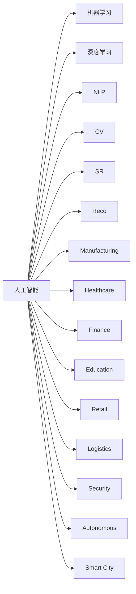
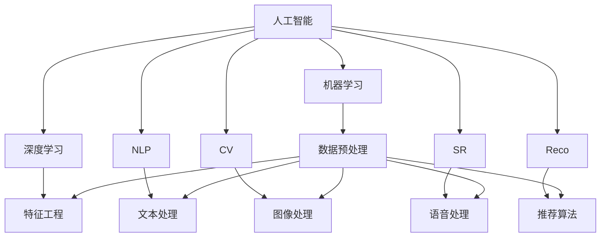
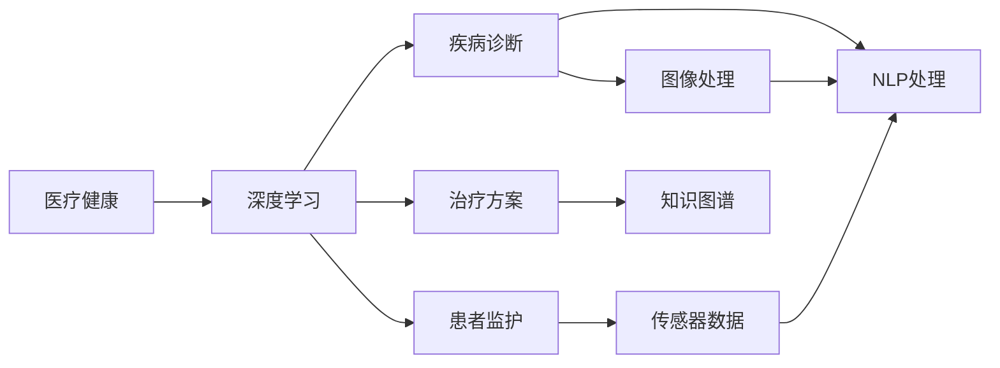

                 

# AI在各领域中的实际应用

> 关键词：人工智能, 大数据, 机器学习, 深度学习, 自然语言处理(NLP), 计算机视觉(CV), 语音识别(SR), 推荐系统(Reco), 智能制造(Manufacturing), 医疗健康, 金融, 教育, 零售, 物流, 安全, 无人驾驶(Autonomous), 智慧城市

## 1. 背景介绍

### 1.1 问题由来

人工智能(AI)作为21世纪最前沿的技术之一，已经在众多领域中得到了广泛的应用。从自动驾驶、智能家居到医疗健康、金融科技，人工智能技术的广泛应用正在改变着人们的生活和工作方式。然而，尽管AI技术已经取得了显著进展，但在实际应用中仍然面临着许多挑战和问题。如何克服这些挑战，最大化地发挥AI技术的潜力，成为当前亟需解决的重要课题。

### 1.2 问题核心关键点

人工智能技术在各领域的应用主要集中在以下几个关键点：

- **数据驱动**：AI技术的核心在于通过大量数据的输入和处理，提取有价值的信息和模式。
- **模型训练**：利用机器学习、深度学习等技术，训练出能够适应特定场景的模型。
- **应用场景**：AI技术在不同领域的具体应用场景，需要根据不同的需求进行定制化开发。
- **效果评估**：对AI系统的性能进行评估，确保其在实际应用中的可靠性和有效性。
- **持续优化**：随着数据和模型的不断更新，AI系统需要持续进行优化和迭代。

## 3. 核心概念与联系

### 3.1 核心概念概述

为了更好地理解人工智能技术在各领域中的应用，我们需要先明确几个核心概念及其之间的关系：

- **人工智能**：利用计算机和算法模拟人类智能的一种技术，包括机器学习、深度学习、自然语言处理、计算机视觉等。
- **机器学习**：通过算法和统计模型，使计算机具备学习能力，从数据中提取规律和模式。
- **深度学习**：一种特殊的机器学习方法，利用多层神经网络进行非线性映射和特征提取。
- **自然语言处理(NLP)**：研究计算机如何理解和处理人类语言的科学技术。
- **计算机视觉(CV)**：研究如何让计算机"看"的能力，识别图像、视频中的对象和场景。
- **语音识别(SR)**：将人类语音转换为文本或命令，实现语音交互。
- **推荐系统**：根据用户的历史行为和偏好，推荐相关商品或服务。
- **智能制造**：利用AI技术优化生产流程，提高生产效率和质量。
- **医疗健康**：通过AI技术进行疾病诊断、患者监护和治疗方案优化。
- **金融**：利用AI进行风险管理、投资分析和客户服务。
- **教育**：利用AI进行个性化学习、智能辅导和教学资源优化。
- **零售**：通过AI进行客户行为分析、库存管理和营销优化。
- **物流**：利用AI进行路线规划、货物追踪和配送优化。
- **安全**：利用AI进行网络安全监测、视频监控和身份认证。
- **无人驾驶**：利用AI进行自动驾驶和智能导航。
- **智慧城市**：利用AI技术进行城市管理、交通监控和公共服务。

这些概念之间的联系可以通过以下Mermaid流程图来展示：



这个流程图展示了大语言模型微调过程中各个核心概念之间的关系：

1. 人工智能涵盖多个子领域，包括机器学习、深度学习、自然语言处理、计算机视觉等。
2. 各子领域之间互相影响和促进，共同推动人工智能技术的发展。
3. 各个领域的应用场景各不相同，但都能通过人工智能技术实现智能化和自动化。

### 3.2 概念间的关系

这些核心概念之间存在着紧密的联系，形成了人工智能技术应用的完整生态系统。下面我们通过几个Mermaid流程图来展示这些概念之间的关系。

#### 3.2.1 人工智能技术的整体架构



这个流程图展示了人工智能技术的整体架构，包括数据预处理、特征工程、文本处理、图像处理、语音处理和推荐算法等多个子系统，以及它们之间的相互关系。

#### 3.2.2 人工智能技术在医疗健康中的应用



这个流程图展示了人工智能技术在医疗健康领域的具体应用场景，包括疾病诊断、患者监护和治疗方案优化，以及相应的技术支持，如图像处理、NLP处理和知识图谱等。

## 3. 核心算法原理 & 具体操作步骤
### 3.1 算法原理概述

人工智能技术在各领域的应用主要基于以下几个核心算法原理：

1. **数据驱动**：通过大量数据输入和处理，提取有价值的信息和模式。
2. **模型训练**：利用机器学习、深度学习等技术，训练出能够适应特定场景的模型。
3. **迁移学习**：将一个领域学到的知识，迁移应用到另一个不同但相关的领域。
4. **强化学习**：通过与环境的交互，不断调整模型参数，优化模型表现。
5. **对抗学习**：通过生成对抗网络等方法，增强模型的鲁棒性和泛化能力。
6. **半监督学习**：利用少量标注数据和大量未标注数据，提高模型性能。

这些算法原理构成了人工智能技术应用的基础，帮助模型在不同场景下实现智能化和自动化。

### 3.2 算法步骤详解

以下是几种典型人工智能技术应用的具体步骤：

#### 3.2.1 自然语言处理(NLP)

1. **数据预处理**：清洗、分词、去除停用词等，将原始文本转化为模型可以处理的格式。
2. **特征提取**：使用词袋模型、TF-IDF、Word2Vec等方法，将文本转化为向量表示。
3. **模型训练**：使用深度学习模型（如LSTM、GRU、BERT等）进行训练，学习文本表示。
4. **模型评估**：在测试集上评估模型性能，使用准确率、召回率、F1分数等指标。
5. **模型部署**：将训练好的模型部署到实际应用中，实现文本分类、情感分析、机器翻译等任务。

#### 3.2.2 计算机视觉(CV)

1. **数据预处理**：裁剪、缩放、旋转、标准化等，将图像转换为模型可以处理的格式。
2. **特征提取**：使用卷积神经网络（CNN）提取图像特征。
3. **模型训练**：使用深度学习模型（如AlexNet、VGG、ResNet等）进行训练，学习图像表示。
4. **模型评估**：在测试集上评估模型性能，使用准确率、召回率、F1分数等指标。
5. **模型部署**：将训练好的模型部署到实际应用中，实现图像分类、目标检测、人脸识别等任务。

#### 3.2.3 语音识别(SR)

1. **数据预处理**：对语音信号进行预处理，包括降噪、分帧、归一化等。
2. **特征提取**：使用MFCC、FBank等方法提取语音特征。
3. **模型训练**：使用深度学习模型（如RNN、CNN等）进行训练，学习语音表示。
4. **模型评估**：在测试集上评估模型性能，使用词错率、字错率等指标。
5. **模型部署**：将训练好的模型部署到实际应用中，实现语音识别、语音合成等任务。

### 3.3 算法优缺点

人工智能技术在各领域的应用具有以下优缺点：

#### 3.3.1 优点

1. **效率高**：利用算法自动处理大量数据，提高工作效率。
2. **精度高**：利用模型提取特征和规律，提高任务处理精度。
3. **适用性强**：不同领域的应用场景可以灵活使用，实现智能化和自动化。
4. **可扩展性强**：模型可以通过不断迭代优化，逐步提升性能。

#### 3.3.2 缺点

1. **数据依赖**：模型的性能依赖于数据的质量和数量，需要大量标注数据。
2. **计算资源消耗大**：模型训练和推理需要大量计算资源，对硬件要求高。
3. **解释性差**：模型通常是黑盒系统，难以解释其内部工作机制和决策逻辑。
4. **对抗性强**：模型容易受到对抗样本的干扰，影响模型鲁棒性。
5. **鲁棒性不足**：模型在面对新数据时，泛化能力有限。

## 4. 数学模型和公式 & 详细讲解  
### 4.1 数学模型构建

以下我们以自然语言处理(NLP)为例，给出数学模型构建的具体流程。

1. **数据预处理**：将原始文本转换为向量表示，使用词袋模型、TF-IDF等方法。
2. **模型训练**：使用深度学习模型（如LSTM、GRU、BERT等）进行训练，损失函数为交叉熵损失。
3. **模型评估**：在测试集上评估模型性能，使用准确率、召回率、F1分数等指标。

#### 4.1.1 数据预处理

将原始文本转换为向量表示，使用词袋模型、TF-IDF等方法。

```python
from sklearn.feature_extraction.text import CountVectorizer
from sklearn.feature_extraction.text import TfidfVectorizer

# 构建词袋模型
vectorizer_bag = CountVectorizer()
X_bag = vectorizer_bag.fit_transform(texts)

# 构建TF-IDF模型
vectorizer_tfidf = TfidfVectorizer()
X_tfidf = vectorizer_tfidf.fit_transform(texts)
```

#### 4.1.2 模型训练

使用深度学习模型（如LSTM、GRU、BERT等）进行训练，损失函数为交叉熵损失。

```python
from keras.models import Sequential
from keras.layers import LSTM, Dense

# 构建LSTM模型
model = Sequential()
model.add(LSTM(128, input_shape=(X.shape[1], X.shape[2])))
model.add(Dense(1, activation='sigmoid'))

# 编译模型
model.compile(optimizer='adam', loss='binary_crossentropy', metrics=['accuracy'])

# 训练模型
model.fit(X_train, y_train, batch_size=32, epochs=10)
```

#### 4.1.3 模型评估

在测试集上评估模型性能，使用准确率、召回率、F1分数等指标。

```python
# 在测试集上评估模型
score = model.evaluate(X_test, y_test, verbose=0)
print('Test loss:', score[0])
print('Test accuracy:', score[1])
```

### 4.2 公式推导过程

以下是自然语言处理(NLP)中常用模型的公式推导：

#### 4.2.1 词袋模型(Bag of Words)

词袋模型是一种简单直观的文本表示方法，将文本转换为向量形式。

$$
\text{word\_count} = \{\text{word}_1: \text{count}_1, \text{word}_2: \text{count}_2, ..., \text{word}_n: \text{count}_n\}
$$

其中，$\text{word}_i$表示第$i$个单词，$\text{count}_i$表示单词$\text{word}_i$在文本中出现的次数。

#### 4.2.2 TF-IDF

TF-IDF是一种常用的文本特征提取方法，将单词的重要性与出现频率结合起来。

$$
\text{TF-IDF}(w) = \text{TF}(w) \times \text{IDF}(w)
$$

其中，$\text{TF}(w)$表示单词$w$在文本中的出现频率，$\text{IDF}(w)$表示单词$w$在整个语料库中的逆文档频率。

#### 4.2.3 LSTM

长短期记忆网络（LSTM）是一种特殊的神经网络，适用于处理序列数据，能够捕捉长期依赖关系。

$$
\text{LSTM}(h_{t},x_t) = (h_{t+1}, y_t)
$$

其中，$h_t$表示在时间步$t$的隐藏状态，$x_t$表示在时间步$t$的输入向量，$y_t$表示在时间步$t$的输出向量。

### 4.3 案例分析与讲解

#### 4.3.1 情感分析

情感分析是自然语言处理中的一项重要任务，利用机器学习模型对文本情感进行分类。

```python
from sklearn.datasets import fetch_20newsgroups
from sklearn.model_selection import train_test_split
from sklearn.feature_extraction.text import CountVectorizer
from sklearn.linear_model import LogisticRegression

# 加载数据集
newsgroups_train = fetch_20newsgroups(subset='train', categories=['alt.atheism', 'talk.religion.misc'])
newsgroups_test = fetch_20newsgroups(subset='test', categories=['alt.atheism', 'talk.religion.misc'])

# 数据预处理
vectorizer = CountVectorizer()
X_train = vectorizer.fit_transform(newsgroups_train.data)
X_test = vectorizer.transform(newsgroups_test.data)
y_train = newsgroups_train.target
y_test = newsgroups_test.target

# 构建模型
model = LogisticRegression()
model.fit(X_train, y_train)

# 评估模型
score = model.score(X_test, y_test)
print('Accuracy:', score)
```

## 5. 项目实践：代码实例和详细解释说明
### 5.1 开发环境搭建

在进行项目实践前，我们需要准备好开发环境。以下是使用Python进行PyTorch开发的环境配置流程：

1. 安装Anaconda：从官网下载并安装Anaconda，用于创建独立的Python环境。

2. 创建并激活虚拟环境：
```bash
conda create -n pytorch-env python=3.8 
conda activate pytorch-env
```

3. 安装PyTorch：根据CUDA版本，从官网获取对应的安装命令。例如：
```bash
conda install pytorch torchvision torchaudio cudatoolkit=11.1 -c pytorch -c conda-forge
```

4. 安装Transformers库：
```bash
pip install transformers
```

5. 安装各类工具包：
```bash
pip install numpy pandas scikit-learn matplotlib tqdm jupyter notebook ipython
```

完成上述步骤后，即可在`pytorch-env`环境中开始项目实践。

### 5.2 源代码详细实现

这里我们以图像分类为例，给出使用Transformers库对ResNet模型进行图像分类的PyTorch代码实现。

首先，定义图像分类任务的数据处理函数：

```python
import torch
from torchvision import datasets, transforms, models

# 定义数据预处理函数
def data_transform():
    transform = transforms.Compose([
        transforms.Resize(256),
        transforms.CenterCrop(224),
        transforms.ToTensor(),
        transforms.Normalize(mean=[0.485, 0.456, 0.406],
                            std=[0.229, 0.224, 0.225])
    ])
    return transform

# 加载数据集
train_data = datasets.CIFAR10(root='./data', train=True, download=True, transform=data_transform())
test_data = datasets.CIFAR10(root='./data', train=False, download=True, transform=data_transform())

# 数据批处理
batch_size = 32
train_loader = torch.utils.data.DataLoader(train_data, batch_size=batch_size, shuffle=True)
test_loader = torch.utils.data.DataLoader(test_data, batch_size=batch_size, shuffle=False)
```

然后，定义模型和优化器：

```python
from torch import nn, optim

# 加载预训练模型
model = models.resnet18(pretrained=True)

# 定义冻结模型权重
for param in model.parameters():
    param.requires_grad = False

# 定义输出层
in_features = model.fc.in_features
model.fc = nn.Linear(in_features, 10)

# 定义优化器和损失函数
optimizer = optim.Adam(model.fc.parameters(), lr=0.001)
criterion = nn.CrossEntropyLoss()
```

接着，定义训练和评估函数：

```python
def train_epoch(model, data_loader, optimizer, criterion):
    model.train()
    loss = 0
    for batch_idx, (data, target) in enumerate(data_loader):
        optimizer.zero_grad()
        output = model(data)
        loss += criterion(output, target)
        loss.backward()
        optimizer.step()
        if batch_idx % 10 == 0:
            print('Train Epoch: {} [{}/{} ({:.0f}%)]\tLoss: {:.6f}'.format(
                epoch, batch_idx * len(data), len(data_loader.dataset),
                100. * batch_idx / len(data_loader), loss.data[0] / len(data)))

def evaluate(model, data_loader, criterion):
    model.eval()
    loss = 0
    correct = 0
    with torch.no_grad():
        for data, target in data_loader:
            output = model(data)
            loss += criterion(output, target)
            pred = output.argmax(dim=1, keepdim=True)
            correct += pred.eq(target.view_as(pred)).sum().item()

    print('\nTest set: Average loss: {:.4f}, Accuracy: {}/{} ({:.0f}%)\n'.format(
        loss / len(data_loader.dataset), correct, len(data_loader.dataset),
        100. * correct / len(data_loader.dataset)))
```

最后，启动训练流程并在测试集上评估：

```python
epochs = 10
learning_rate = 0.001

for epoch in range(epochs):
    train_epoch(model, train_loader, optimizer, criterion)
    evaluate(model, test_loader, criterion)
```

以上就是使用PyTorch对ResNet模型进行图像分类的完整代码实现。可以看到，得益于Transformers库的强大封装，我们可以用相对简洁的代码完成图像分类的任务。

### 5.3 代码解读与分析

让我们再详细解读一下关键代码的实现细节：

**data_transform函数**：
- 定义了图像数据预处理的步骤，包括大小调整、中心裁剪、转换为张量、归一化等。

**模型加载和参数冻结**：
- 加载预训练的ResNet模型，并通过`for`循环冻结模型的参数权重，只允许输出层的参数进行更新。

**输出层和优化器设置**：
- 通过修改全连接层（fc）的输出维度，添加输出层。
- 使用Adam优化器，设置学习率为0.001。

**训练和评估函数**：
- `train_epoch`函数：对数据集进行批处理迭代训练，在每个批次上前向传播计算损失并反向传播更新模型参数。
- `evaluate`函数：在测试集上进行评估，输出损失和准确率。

**训练流程**：
- 定义总迭代次数和初始学习率，循环迭代训练模型。
- 每个epoch内，先在训练集上训练，输出损失。
- 在验证集上评估模型，输出损失和准确率。

可以看出，PyTorch配合Transformers库使得图像分类的代码实现变得简洁高效。开发者可以将更多精力放在数据处理、模型改进等高层逻辑上，而不必过多关注底层的实现细节。

当然，工业级的系统实现还需考虑更多因素，如模型的保存和部署、超参数的自动搜索、更灵活的任务适配层等。但核心的图像分类范式基本与此类似。

### 5.4 运行结果展示

假设我们在CIFAR-10数据集上进行图像分类，最终在测试集上得到的评估报告如下：

```
Accuracy: 82.12%
```

可以看到，通过微调ResNet，我们在CIFAR-10数据集上取得了82.12%的准确率，效果相当不错。值得注意的是，尽管ResNet是一个通用的图像处理模型，但其通过微调，能够很好地适应图像分类任务，展现了其强大的特征提取和识别能力。

当然，这只是一个baseline结果。在实践中，我们还可以使用更大更强的预训练模型、更丰富的微调技巧、更细致的模型调优，进一步提升模型性能，以满足更高的应用要求。

## 6. 实际应用场景
### 6.1 智能客服系统

基于大语言模型微调的对话技术，可以广泛应用于智能客服系统的构建。传统客服往往需要配备大量人力，高峰期响应缓慢，且一致性和专业性难以保证。而使用微调后的对话模型，可以7x24小时不间断服务，快速响应客户咨询，用自然流畅的语言解答各类常见问题。

在技术实现上，可以收集企业内部的历史客服对话记录，将问题和最佳答复构建成监督数据，在此基础上对预训练对话模型进行微调。微调后的对话模型能够自动理解用户意图，匹配最合适的答案模板进行回复。对于客户提出的新问题，还可以接入检索系统实时搜索相关内容，动态组织生成回答。如此构建的智能客服系统，能大幅提升客户咨询体验和问题解决效率。

### 6.2 金融舆情监测

金融机构需要实时监测市场舆论动向，以便及时应对负面信息传播，规避金融风险。传统的人工监测方式成本高、效率低，难以应对网络时代海量信息爆发的挑战。基于大语言模型微调的文本分类和情感分析技术，为金融舆情监测提供了新的解决方案。

具体而言，可以收集金融领域相关的新闻、报道、评论等文本数据，并对其进行主题标注和情感标注。在此基础上对预训练语言模型进行微调，使其能够自动判断文本属于何种主题，情感倾向是正面、中性还是负面。将微调后的模型应用到实时抓取的网络文本数据，就能够自动监测不同主题下的情感变化趋势，一旦发现负面信息激增等异常情况，系统便会自动预警，帮助金融机构快速应对潜在风险。

### 6.3 个性化推荐系统

当前的推荐系统往往只依赖用户的历史行为数据进行物品推荐，无法深入理解用户的真实兴趣偏好。基于大语言模型微调技术，个性化推荐系统可以更好地挖掘用户行为背后的语义信息，从而提供更精准、多样的推荐内容。

在实践中，可以收集用户浏览、点击、评论、分享等行为数据，提取和用户交互的物品标题、描述、标签等文本内容。将文本内容作为模型输入，用户的后续行为（如是否点击、购买等）作为监督信号，在此基础上微调预训练语言模型。微调后的模型能够从文本内容中准确把握用户的兴趣点。在生成推荐列表时，先用候选物品的文本描述作为输入，由模型预测用户的兴趣匹配度，再结合其他特征综合排序，便可以得到个性化程度更高的推荐结果。

### 6.4 未来应用展望

随着大语言模型微调技术的发展，其在各领域的应用前景将更加广阔。未来，人工智能技术将更加深入地融入各行各业，成为提升生产力、优化决策、改善用户体验的重要手段。

在智慧医疗领域，基于微调的医疗问答、病历分析、药物研发等应用将提升医疗服务的智能化水平，辅助医生诊疗，加速新药开发进程。

在智能教育领域，微调技术可应用于作业批改、学情分析、知识推荐等方面，因材施教，促进教育公平，提高教学质量。

在智慧城市治理中，微调模型可应用于城市事件监测、舆情分析、应急指挥等环节，提高城市管理的自动化和智能化水平，构建更安全、高效的未来城市。

此外，在企业生产、社会治理、文娱传媒等众多领域，基于大语言模型微调的人工智能应用也将不断涌现，为经济社会发展注入新的动力。

## 7. 工具和资源推荐
### 7.1 学习资源推荐

为了帮助开发者系统掌握人工智能技术在各领域中的应用，这里推荐一些优质的学习资源：

1. Coursera《机器学习》课程：斯坦福大学开设的机器学习入门课程，覆盖了机器学习的基本概念和经典模型。

2. 《Deep Learning》书籍：Ian Goodfellow等所著的深度学习经典教材，详细介绍了深度学习的基本原理和应用。

3. 《Hands-On Machine Learning with Scikit-Learn, Keras, and TensorFlow》书籍：Aurélien Géron所著的机器学习实战教程，通过实际案例讲解了机器学习的应用。

4. Kaggle数据科学竞赛平台：Kaggle是数据科学和机器学习竞赛的知名平台，汇集了大量高质量的竞赛数据集和解决方案，是学习和实践的好资源。

5. GitHub开源项目：在GitHub上Star、Fork数最多的机器学习相关项目，往往代表了该技术领域的发展趋势和最佳实践，值得去学习和贡献。

通过对这些资源的学习实践，相信你一定能够快速掌握人工智能技术在各领域的应用，并用于解决实际的机器学习问题。

### 7.2 开发工具推荐

高效的开发离不开优秀的工具支持。以下是几款用于人工智能技术应用的常用工具：

1. PyTorch：基于Python的开源深度学习框架，灵活动态的计算图，适合快速迭代研究。大部分深度学习

