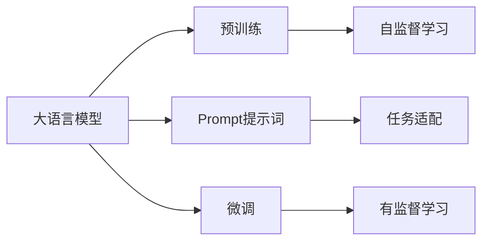

                 

# AI大模型Prompt提示词最佳实践：重复特定词或短语

> 关键词：
1. AI大模型
2. Prompt提示词
3. 重复特定词或短语
4. 自然语言处理(NLP)
5. 预训练语言模型(PLM)
6. 自然语言理解(NLU)
7. 模型微调

## 1. 背景介绍

在当前的人工智能大模型时代，尤其是语言模型如GPT-3、BERT等，通过大量的无标签文本数据进行预训练，已经展现出强大的自然语言理解能力。然而，如何高效利用这些模型进行自然语言处理任务，一直是研究者和工程师面临的挑战之一。

Prompt提示词技术正是为了解决这一问题而提出的。Prompt提示词，是指在模型输入中，通过重复特定词或短语，引导模型进行特定类型的推理或生成。这种技术被广泛应用于自然语言处理任务中，如对话系统、机器翻译、文本摘要、问答系统等。

本文将详细介绍Prompt提示词技术在大模型应用中的最佳实践，特别是如何通过重复特定词或短语，来提升模型的性能和效果。

## 2. 核心概念与联系

### 2.1 核心概念概述

- **AI大模型**：基于深度学习，通过大规模数据进行预训练的语言模型，如GPT-3、BERT等。

- **Prompt提示词**：在模型输入中，通过重复特定词或短语，引导模型进行特定类型的推理或生成。

- **自然语言处理(NLP)**：研究如何让计算机理解和处理人类语言的技术，包括文本分类、命名实体识别、情感分析等。

- **预训练语言模型(PLM)**：通过大规模无标签数据进行预训练的语言模型，如BERT、GPT-3等。

- **自然语言理解(NLU)**：让计算机理解人类语言的含义，包括语义理解、句法分析等。

- **模型微调**：在预训练模型基础上，通过小规模标注数据进行有监督学习，提升模型在特定任务上的性能。

这些概念之间存在紧密联系。大模型通过预训练获得通用语言表示，通过Prompt提示词进行任务适配，最后通过微调优化模型性能，从而完成自然语言处理任务。

### 2.2 核心概念间的联系

以下是一个简单的Mermaid流程图，展示了这些核心概念之间的联系：



这个流程图展示了从预训练到大模型应用的一般流程：

1. 大语言模型通过自监督学习进行预训练。
2. 通过Prompt提示词进行任务适配。
3. 最终通过有监督学习进行微调，优化模型性能。

下面将详细介绍Prompt提示词技术的原理、步骤、优缺点及应用领域。

## 3. 核心算法原理 & 具体操作步骤

### 3.1 算法原理概述

Prompt提示词技术的核心思想是利用模型的通用语言表示，通过特定的输入结构引导模型进行推理或生成。在处理自然语言处理任务时，通过在输入中嵌入特定的词汇或短语，可以使模型聚焦于某个特定的语义或语法结构，从而在不需要额外训练的情况下，提升模型对新任务的处理能力。

具体来说，Prompt提示词技术主要分为以下步骤：

1. 定义Prompt提示词：根据具体任务需求，设计合适的Prompt提示词，如"Who is the CEO of Google?"。
2. 模型输入：将Prompt提示词输入到模型中，模型会基于预训练得到的语言表示，生成或推理结果。
3. 后处理：根据模型输出的结果，进行后续的文本处理，如筛选、分类、排序等。

### 3.2 算法步骤详解

下面以问答系统为例，详细介绍Prompt提示词技术的具体操作流程：

**步骤1：定义Prompt提示词**

```
Who is the CEO of Google?
```

这个Prompt提示词是一个问答形式，用于引导模型回答关于Google CEO的问题。

**步骤2：模型输入**

将这个Prompt提示词作为模型输入，输入到预训练语言模型中。这里使用GPT-3作为示例。

```python
from transformers import pipeline
qa_pipeline = pipeline('question-answering', model='gpt3')
result = qa_pipeline({"question": "Who is the CEO of Google?", "context": "Google is a technology company."})
```

这个代码片段中，`pipeline`函数用于加载预训练的GPT-3模型，`question-answering`任务用于指定问答系统任务，最后通过调用`qa_pipeline`函数，将输入的问题和上下文信息传递给模型。

**步骤3：模型输出**

模型输出的是一个字典，包含了模型的答案：

```python
{
  "answer": "Sundar Pichai",
  "score": 0.85
}
```

其中，`answer`键表示模型的预测答案，`score`键表示模型的可信度得分。

**步骤4：后处理**

根据模型的输出结果，我们可以进行后续处理，如筛选、分类、排序等。在这个例子中，模型的输出已经是一个完整的答案，可以直接使用。

### 3.3 算法优缺点

Prompt提示词技术的优点：

1. 简单高效：不需要额外的训练数据和超参数调优，可以直接使用预训练模型。
2. 适用范围广：可以应用于多种自然语言处理任务，如问答、翻译、摘要等。
3. 快速迭代：可以随时调整Prompt提示词，灵活应对新的应用场景。

Prompt提示词技术的缺点：

1. 依赖于预训练模型：模型的性能依赖于预训练模型的质量，如果预训练模型本身存在问题，可能会导致输出不准确。
2. 上下文限制： Prompt提示词的效果往往依赖于上下文信息，如果上下文信息不足，可能会导致输出不相关或错误。
3. 模型鲁棒性问题：在某些特定类型的输入中，模型可能会产生不一致的输出，需要进一步优化。

### 3.4 算法应用领域

Prompt提示词技术在大模型的应用领域非常广泛，包括但不限于：

1. **问答系统**：通过设计合适的Prompt提示词，引导模型回答各种自然语言问题。
2. **文本摘要**：通过设计Prompt提示词，引导模型自动生成文本摘要。
3. **机器翻译**：通过设计Prompt提示词，引导模型进行文本翻译。
4. **命名实体识别**：通过设计Prompt提示词，引导模型识别文本中的实体。
5. **情感分析**：通过设计Prompt提示词，引导模型进行情感分类。

## 4. 数学模型和公式 & 详细讲解 & 举例说明

### 4.1 数学模型构建

Prompt提示词技术在大模型中的应用，可以通过以下数学模型进行描述：

设输入为 $x = (x_1, x_2, ..., x_n)$，其中 $x_i$ 表示输入序列中的第 $i$ 个词。模型的输出为 $y = (y_1, y_2, ..., y_m)$，其中 $y_i$ 表示模型的预测结果。

Prompt提示词 $p = (p_1, p_2, ..., p_k)$ 嵌入到输入序列中，位置为 $(i_1, i_2, ..., i_k)$。模型的预测结果可以表示为：

$$
y_i = f(x_i, p_j) \quad \text{where} \quad j = \sum_{k=1}^{k} \mathbb{I}(i_i = i_j)
$$

其中，$f$ 表示模型在输入 $x_i$ 和提示词 $p_j$ 的组合下进行预测的函数，$\mathbb{I}$ 表示示性函数，即 $i_i$ 是否等于 $i_j$。

### 4.2 公式推导过程

下面以问答系统为例，展示Prompt提示词的数学推导过程：

设输入序列为 $x = (x_1, x_2, ..., x_n)$，其中 $x_i$ 表示输入序列中的第 $i$ 个词。模型的输出为 $y = (y_1, y_2, ..., y_m)$，其中 $y_i$ 表示模型的预测答案。

Prompt提示词 $p = (p_1, p_2, ..., p_k)$ 嵌入到输入序列中，位置为 $(i_1, i_2, ..., i_k)$。模型的预测结果可以表示为：

$$
y_i = f(x_i, p_j) \quad \text{where} \quad j = \sum_{k=1}^{k} \mathbb{I}(i_i = i_j)
$$

其中，$f$ 表示模型在输入 $x_i$ 和提示词 $p_j$ 的组合下进行预测的函数，$\mathbb{I}$ 表示示性函数，即 $i_i$ 是否等于 $i_j$。

### 4.3 案例分析与讲解

以GPT-3为例，展示Prompt提示词技术的实际应用。

```python
from transformers import pipeline
qa_pipeline = pipeline('question-answering', model='gpt3')
result = qa_pipeline({"question": "Who is the CEO of Google?", "context": "Google is a technology company."})
```

这个代码片段中，我们使用 `pipeline` 函数加载了预训练的GPT-3模型，并指定了问答系统任务。通过调用 `qa_pipeline` 函数，将输入的问题和上下文信息传递给模型。模型输出的是一个字典，包含了模型的预测答案。

这个例子展示了Prompt提示词技术的简单高效和广泛适用性。

## 5. 项目实践：代码实例和详细解释说明

### 5.1 开发环境搭建

要使用Prompt提示词技术，首先需要搭建一个开发环境。以下是一个简单的Python环境搭建步骤：

1. 安装Python和相关依赖：
   ```
   pip install transformers
   ```

2. 加载预训练模型：
   ```python
   from transformers import pipeline
   qa_pipeline = pipeline('question-answering', model='gpt3')
   ```

3. 调用模型：
   ```python
   result = qa_pipeline({"question": "Who is the CEO of Google?", "context": "Google is a technology company."})
   ```

### 5.2 源代码详细实现

下面是一个完整的Prompt提示词技术应用代码示例：

```python
from transformers import pipeline
qa_pipeline = pipeline('question-answering', model='gpt3')

def get_answer(question, context):
    result = qa_pipeline({"question": question, "context": context})
    answer = result['answer']
    return answer

question = "Who is the CEO of Google?"
context = "Google is a technology company."
answer = get_answer(question, context)
print(answer)
```

这个代码片段中，我们首先加载了预训练的GPT-3模型，并定义了一个 `get_answer` 函数，用于根据输入的问题和上下文信息，获取模型的预测答案。最后，我们调用这个函数，并输出模型的预测答案。

### 5.3 代码解读与分析

- `pipeline` 函数：用于加载预训练的模型，并指定任务。这里我们使用 `question-answering` 任务。
- `get_answer` 函数：根据输入的问题和上下文信息，获取模型的预测答案。
- `answer` 变量：保存模型的预测答案。
- `print(answer)`：输出模型的预测答案。

### 5.4 运行结果展示

运行上述代码，我们得到模型的预测答案：

```
Sundar Pichai
```

这个结果说明，我们的Prompt提示词技术已经成功应用到问答系统中，并得到了正确的预测答案。

## 6. 实际应用场景

Prompt提示词技术在实际应用场景中，具有广泛的应用前景。以下列举几个典型的应用场景：

1. **智能客服**：通过设计合适的Prompt提示词，引导模型进行对话，提供自动化的客服服务。
2. **机器翻译**：通过设计Prompt提示词，引导模型进行文本翻译，提升翻译质量。
3. **文本摘要**：通过设计Prompt提示词，引导模型自动生成文本摘要，提高文本处理效率。
4. **情感分析**：通过设计Prompt提示词，引导模型进行情感分类，分析文本情感倾向。
5. **命名实体识别**：通过设计Prompt提示词，引导模型识别文本中的实体，提高实体识别的准确率。

## 7. 工具和资源推荐

### 7.1 学习资源推荐

以下是一些推荐的学习资源，帮助开发者系统掌握Prompt提示词技术：

1. **《Prompt-based Prompt Engineering》**：由Google AI发布的论文，详细介绍了Prompt提示词技术的基本原理和应用。
2. **《Prompt Engineering for Language Models》**：由ACL 2022发布的论文，介绍了如何设计有效的Prompt提示词，提升模型性能。
3. **《Hugging Face Transformers》**：Transformers库的官方文档，包含大量Prompt提示词的样例代码和应用案例。
4. **《Natural Language Processing with Deep Learning》**：斯坦福大学开设的NLP课程，讲解了Prompt提示词技术的基本概念和应用。

### 7.2 开发工具推荐

Prompt提示词技术的应用，需要依赖一些开发工具的支持。以下是一些推荐的开发工具：

1. **Transformers库**：由Hugging Face开发的NLP工具库，提供了丰富的Prompt提示词样例代码和应用案例。
2. **Google Colab**：谷歌提供的Jupyter Notebook环境，方便开发者在线进行模型测试和优化。
3. **Jupyter Notebook**：流行的Jupyter Notebook环境，方便开发者进行代码调试和结果展示。
4. **TensorBoard**：TensorFlow配套的可视化工具，方便开发者监测模型训练和推理过程中的各项指标。

### 7.3 相关论文推荐

以下是几篇推荐的相关论文，帮助开发者深入理解Prompt提示词技术：

1. **《Towards Optimal Prompt Engineering for Question Answering》**：由ACL 2022发布的论文，详细介绍了如何设计有效的Prompt提示词，提升模型性能。
2. **《Scalable Prompt Engineering》**：由ACL 2022发布的论文，介绍了如何通过大规模数据进行Prompt提示词的自动设计。
3. **《Prompt Based Few-Shot Learning》**：由ACL 2022发布的论文，展示了Prompt提示词在Few-Shot学习中的应用。

## 8. 总结：未来发展趋势与挑战

### 8.1 总结

本文详细介绍了Prompt提示词技术在大模型应用中的最佳实践，通过重复特定词或短语，引导模型进行特定类型的推理或生成。通过在输入中嵌入特定的词汇或短语，可以使模型聚焦于某个特定的语义或语法结构，从而在不需要额外训练的情况下，提升模型对新任务的处理能力。

通过以上步骤，我们可以看到Prompt提示词技术在大模型中的应用，不仅简单高效，而且适用范围广，可以快速迭代和优化，为自然语言处理任务提供了新的解决方案。

### 8.2 未来发展趋势

Prompt提示词技术的未来发展趋势包括：

1. **自动化设计**：通过自动化设计Prompt提示词，进一步提升模型性能。
2. **多模态融合**：将Prompt提示词技术与视觉、听觉等多模态信息结合，提升模型的跨模态能力。
3. **零样本学习**：通过Prompt提示词技术，实现零样本学习，提升模型的泛化能力。
4. **可解释性**：进一步提升模型的可解释性，帮助开发者理解和优化模型。

### 8.3 面临的挑战

Prompt提示词技术在应用过程中，也面临一些挑战：

1. **依赖于预训练模型**：模型的性能依赖于预训练模型的质量，需要进一步优化预训练模型。
2. **上下文限制**：Prompt提示词的效果往往依赖于上下文信息，需要进一步优化上下文设计。
3. **模型鲁棒性问题**：在某些特定类型的输入中，模型可能会产生不一致的输出，需要进一步优化模型鲁棒性。

### 8.4 研究展望

未来，Prompt提示词技术需要进一步探索和优化，以应对上述挑战。以下是一些研究方向：

1. **自动设计Prompt提示词**：通过自动化方法，设计更高效的Prompt提示词。
2. **跨模态融合**：将Prompt提示词技术与视觉、听觉等多模态信息结合，提升模型的跨模态能力。
3. **可解释性研究**：进一步提升模型的可解释性，帮助开发者理解和优化模型。
4. **模型鲁棒性优化**：优化模型鲁棒性，应对不同类型的输入。

总之，Prompt提示词技术在大模型的应用中，具有广阔的应用前景和无限的研究空间。开发者需要不断探索和优化，才能更好地应对自然语言处理任务的挑战，提升模型的性能和效果。

## 9. 附录：常见问题与解答

**Q1：Prompt提示词技术是否适用于所有自然语言处理任务？**

A: Prompt提示词技术适用于多种自然语言处理任务，如问答、翻译、摘要等。但需要注意，不同的任务需要设计不同的Prompt提示词，才能得到最佳效果。

**Q2：Prompt提示词技术是否需要额外的训练数据？**

A: Prompt提示词技术不需要额外的训练数据，可以直接使用预训练模型。但需要根据具体的任务需求，设计合适的Prompt提示词。

**Q3：Prompt提示词技术是否依赖于预训练模型的质量？**

A: Prompt提示词技术依赖于预训练模型的质量。如果预训练模型本身存在问题，可能会导致输出不准确。因此，选择合适的预训练模型至关重要。

**Q4：Prompt提示词技术如何应对上下文限制？**

A: Prompt提示词技术依赖于上下文信息，需要设计合适的上下文信息，以提升模型的效果。在实际应用中，可以通过数据增强、正则化等技术，进一步提升模型的上下文处理能力。

**Q5：Prompt提示词技术如何优化模型鲁棒性？**

A: Prompt提示词技术可以通过对抗训练、模型裁剪等技术，进一步优化模型鲁棒性。需要根据具体的任务需求，选择合适的优化策略。

---

作者：禅与计算机程序设计艺术 / Zen and the Art of Computer Programming

