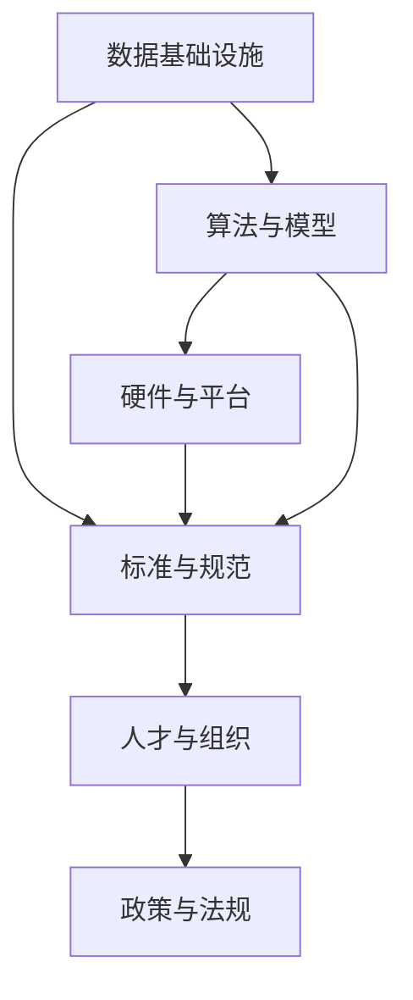

                 

# AI底层创新体系的整体构建

## 1. 背景介绍

### 1.1 问题由来
随着人工智能(AI)技术的迅猛发展，其在诸如自动驾驶、智能制造、智慧城市、医疗健康等领域的应用前景日益广阔。然而，当前AI技术的体系化水平尚不成熟，核心技术和创新资源分散，导致AI领域研发效率低、市场竞争激烈、落地效果不佳。这亟需建立一个一体化的底层创新体系，推动AI技术的全链条、系统化发展。

### 1.2 问题核心关键点
构建AI底层创新体系的核心关键点包括：

- **数据基础设施**：构建大规模、高质量的数据集，支撑AI模型的训练和优化。
- **算法与模型**：发展高效、可解释、鲁棒的AI算法和模型，提升AI技术的效果和应用场景。
- **硬件与平台**：研发高性能、低成本、易用性强的AI计算硬件和平台，加速AI模型的训练和推理。
- **标准与规范**：建立统一的AI技术标准和规范，确保技术协作与产品互通。
- **人才与组织**：培养AI领域的高端人才和优秀团队，形成良性互动的产业生态。
- **政策与法规**：制定和完善AI领域相关政策法规，保障技术的健康发展与合规应用。

本文将围绕上述关键点，系统探讨如何构建一个完整的AI底层创新体系，推动AI技术的全面突破和产业升级。

## 2. 核心概念与联系

### 2.1 核心概念概述

构建AI底层创新体系，涉及多个关键技术领域和支撑体系，包括数据管理、算法设计、模型优化、硬件加速、软件平台、标准规范、人才队伍、政策法规等。这些核心概念共同构成了一个复杂的、多层次的系统架构，各部分之间相互作用、互相支持，共同推动AI技术的创新与发展。

- **数据基础设施**：构建大规模、高质量的数据集，包括数据收集、存储、清洗、标注等环节。数据集是AI模型的基础，数据的数量和质量直接决定模型的训练效果。
- **算法与模型**：开发高效的AI算法和模型，如深度学习、强化学习、自然语言处理等，支持AI应用的广泛场景。模型设计要考虑精度、泛化能力、可解释性、鲁棒性等多方面因素。
- **硬件与平台**：开发高性能、低成本、易用性强的AI计算硬件和平台，如GPU、TPU、FPGA等。硬件和平台的高效运行是支撑AI模型训练与推理的重要基础。
- **标准与规范**：建立统一的AI技术标准和规范，如模型格式、数据格式、接口标准等，确保不同AI系统之间的互操作性。
- **人才与组织**：培养AI领域的高端人才和优秀团队，包括数据科学家、算法工程师、AI架构师等。建立良好的团队合作机制，形成良性互动的产业生态。
- **政策与法规**：制定和完善AI领域相关政策法规，如数据隐私保护、知识产权保护、安全与合规等，保障AI技术的健康发展与合规应用。

这些核心概念之间的逻辑关系可以通过以下Mermaid流程图来展示：



这个流程图展示了各个核心概念之间的相互作用和支撑关系。数据基础设施是AI模型的基础，算法与模型依赖数据进行训练和优化，而硬件与平台则提供了高效运行的计算环境。标准与规范确保不同系统之间的互操作性，人才与组织提供了创新的核心驱动力，政策与法规则为AI技术的发展提供了法律和道德保障。

### 2.2 概念间的关系

这些核心概念之间存在着紧密的联系，形成了一个复杂的、多层次的系统架构。以下是各概念之间关系的进一步说明：

- **数据基础设施与算法与模型的关系**：数据是算法和模型的输入，高质量的数据集能够提高模型训练的效率和效果。
- **硬件与平台与算法与模型的关系**：高效计算硬件和平台是算法与模型运行的基础，影响模型的训练和推理速度。
- **标准与规范与数据基础设施、算法与模型、硬件与平台的关系**：标准与规范确保数据的交换、算法的兼容性、模型的部署，是支撑整个AI体系运行的基石。
- **人才与组织与数据基础设施、算法与模型、硬件与平台、标准与规范、政策与法规的关系**：人才是创新的核心驱动力，需要跨学科、跨领域的人才合作，才能推动AI技术的发展。
- **政策与法规与数据基础设施、算法与模型、硬件与平台、标准与规范、人才与组织的关系**：政策与法规保障AI技术的健康发展与合规应用，是AI技术落地的重要保障。

通过理解这些核心概念和它们之间的关系，我们可以更全面地把握AI底层创新体系的整体构建。

## 3. 核心算法原理 & 具体操作步骤
### 3.1 算法原理概述

构建AI底层创新体系的核心在于算法与模型的研发，其本质是对数据的处理、分析和建模，以实现对现实世界问题的有效预测和决策。具体来说，AI算法与模型的设计需要遵循以下几个基本原则：

1. **高效性**：算法需要高效的计算和存储，以实现实时响应和低成本运行。
2. **可解释性**：模型需要具备可解释性，以便于理解和调试。
3. **鲁棒性**：模型需要具备良好的鲁棒性，以应对数据噪声和异常情况。
4. **通用性**：算法和模型需要具备广泛的适用性，适用于多种场景和任务。

### 3.2 算法步骤详解

构建AI底层创新体系的具体步骤包括以下几个方面：

**Step 1: 数据收集与预处理**
- 收集高质量、多样化的数据集，确保数据的多样性和代表性。
- 对数据进行清洗和标注，去除噪声和错误数据。
- 使用数据增强技术，扩充数据集，增加模型的泛化能力。

**Step 2: 模型选择与设计**
- 根据任务需求选择合适的模型架构，如卷积神经网络(CNN)、递归神经网络(RNN)、Transformer等。
- 设计模型层级结构，包括编码器、解码器、注意力机制等。
- 确定模型的超参数，如学习率、批次大小、激活函数等。

**Step 3: 模型训练与优化**
- 使用GPU/TPU等高性能计算硬件进行模型训练。
- 采用高效的优化算法，如Adam、SGD等。
- 使用正则化技术，如L2正则、Dropout等，避免过拟合。
- 定期在验证集上评估模型性能，调整模型参数和超参数。

**Step 4: 模型评估与部署**
- 在测试集上评估模型性能，确保模型泛化能力强。
- 将训练好的模型进行部署，集成到实际应用中。
- 定期更新模型参数，保持模型的性能。

### 3.3 算法优缺点

构建AI底层创新体系中使用的算法与模型具有以下优点：

- **高效性**：算法与模型通常具有高效的计算和存储能力，能够实现实时响应和低成本运行。
- **可解释性**：模型通常具备较好的可解释性，方便理解和调试。
- **鲁棒性**：模型能够应对数据噪声和异常情况，具有较好的鲁棒性。
- **通用性**：算法与模型适用于多种场景和任务，具有广泛的适用性。

然而，算法与模型也存在一些缺点：

- **数据依赖**：算法与模型的效果高度依赖于数据质量，数据噪声和偏差可能导致模型性能下降。
- **计算资源消耗大**：算法与模型通常需要高性能计算硬件和大量数据，计算资源消耗大。
- **模型复杂度高**：复杂模型需要精细的调参和优化，增加模型设计和调试的复杂度。
- **过拟合风险**：算法与模型在训练过程中容易过拟合，特别是在数据量不足的情况下。

### 3.4 算法应用领域

AI算法与模型在多个领域得到了广泛应用，以下是一些主要应用领域：

- **计算机视觉**：如图像分类、目标检测、图像分割等。
- **自然语言处理**：如文本分类、机器翻译、文本生成等。
- **语音识别**：如语音识别、语音合成、语音情感分析等。
- **强化学习**：如游戏智能、机器人控制、自动驾驶等。
- **推荐系统**：如个性化推荐、广告推荐、内容推荐等。
- **医疗健康**：如疾病诊断、药物发现、基因分析等。

这些应用领域涵盖了AI技术的核心方向，展示了AI算法与模型的广泛适用性。

## 4. 数学模型和公式 & 详细讲解 & 举例说明

### 4.1 数学模型构建

本节将使用数学语言对构建AI算法与模型的过程进行严格刻画。

记输入数据为 $x$，输出为 $y$，假设模型为 $f(x; \theta)$，其中 $\theta$ 为模型参数。模型的目标是最小化损失函数 $\mathcal{L}(f(x; \theta), y)$，即：

$$
\theta^* = \mathop{\arg\min}_{\theta} \mathcal{L}(f(x; \theta), y)
$$

常用的损失函数包括均方误差（MSE）和交叉熵（CE）。假设模型为线性回归模型，其损失函数为均方误差：

$$
\mathcal{L}(y, f(x; \theta)) = \frac{1}{N} \sum_{i=1}^N (y_i - f(x_i; \theta))^2
$$

其中 $N$ 为样本数，$y_i$ 为样本的真实值，$f(x_i; \theta)$ 为模型的预测值。

### 4.2 公式推导过程

以线性回归模型为例，推导其损失函数和梯度。

假设模型为线性回归模型：

$$
f(x; \theta) = \theta^T x
$$

其中 $\theta = [\theta_1, \theta_2, ..., \theta_n]$，$x = [x_1, x_2, ..., x_n]^T$。则损失函数为：

$$
\mathcal{L}(y, f(x; \theta)) = \frac{1}{N} \sum_{i=1}^N (y_i - \theta^T x_i)^2
$$

对 $\theta$ 求偏导数，得到梯度：

$$
\nabla_{\theta}\mathcal{L}(y, f(x; \theta)) = -\frac{2}{N} \sum_{i=1}^N (y_i - \theta^T x_i) x_i
$$

将梯度代入优化算法，如梯度下降法，进行模型参数的更新：

$$
\theta \leftarrow \theta - \eta \nabla_{\theta}\mathcal{L}(y, f(x; \theta))
$$

其中 $\eta$ 为学习率，需要根据具体问题进行调整。

### 4.3 案例分析与讲解

以图像分类为例，假设模型为卷积神经网络（CNN），输入数据为 $x$，输出为 $y$，模型参数为 $\theta$。假设模型的损失函数为交叉熵：

$$
\mathcal{L}(y, f(x; \theta)) = -\frac{1}{N} \sum_{i=1}^N y_i \log f(x_i; \theta)
$$

其中 $f(x; \theta)$ 为模型的预测概率分布。

模型参数 $\theta$ 包括卷积核、全连接层、激活函数等。模型的训练过程如下：

1. 数据预处理：将图像数据归一化、翻转、旋转等增强操作，扩充训练集。
2. 模型设计：设计卷积层、池化层、全连接层等网络结构。
3. 模型训练：使用随机梯度下降法进行模型参数的优化。
4. 模型评估：在测试集上评估模型性能，确保模型泛化能力强。
5. 模型部署：将训练好的模型进行部署，集成到实际应用中。

## 5. 项目实践：代码实例和详细解释说明

### 5.1 开发环境搭建

在进行AI底层创新体系的实践前，需要先准备好开发环境。以下是使用Python进行PyTorch开发的环境配置流程：

1. 安装Anaconda：从官网下载并安装Anaconda，用于创建独立的Python环境。

2. 创建并激活虚拟环境：
```bash
conda create -n pytorch-env python=3.8 
conda activate pytorch-env
```

3. 安装PyTorch：根据CUDA版本，从官网获取对应的安装命令。例如：
```bash
conda install pytorch torchvision torchaudio cudatoolkit=11.1 -c pytorch -c conda-forge
```

4. 安装各类工具包：
```bash
pip install numpy pandas scikit-learn matplotlib tqdm jupyter notebook ipython
```

完成上述步骤后，即可在`pytorch-env`环境中开始实践。

### 5.2 源代码详细实现

这里我们以卷积神经网络（CNN）进行图像分类为例，给出使用PyTorch进行模型训练的代码实现。

首先，定义数据处理函数：

```python
from torchvision import datasets, transforms
from torch.utils.data import DataLoader

def get_data(root, batch_size):
    transform = transforms.Compose([
        transforms.Resize(224),
        transforms.ToTensor(),
        transforms.Normalize(mean=[0.485, 0.456, 0.406], std=[0.229, 0.224, 0.225])
    ])
    train_dataset = datasets.CIFAR10(root=root, train=True, download=True, transform=transform)
    test_dataset = datasets.CIFAR10(root=root, train=False, download=True, transform=transform)
    train_loader = DataLoader(train_dataset, batch_size=batch_size, shuffle=True)
    test_loader = DataLoader(test_dataset, batch_size=batch_size, shuffle=False)
    return train_loader, test_loader
```

然后，定义模型和优化器：

```python
import torch.nn as nn
import torch.nn.functional as F
from torch import optim

class CNNModel(nn.Module):
    def __init__(self):
        super(CNNModel, self).__init__()
        self.conv1 = nn.Conv2d(3, 64, kernel_size=3, stride=1, padding=1)
        self.relu1 = nn.ReLU()
        self.pool1 = nn.MaxPool2d(kernel_size=2, stride=2)
        self.conv2 = nn.Conv2d(64, 128, kernel_size=3, stride=1, padding=1)
        self.relu2 = nn.ReLU()
        self.pool2 = nn.MaxPool2d(kernel_size=2, stride=2)
        self.fc1 = nn.Linear(128*8*8, 256)
        self.relu3 = nn.ReLU()
        self.fc2 = nn.Linear(256, 10)

    def forward(self, x):
        x = self.conv1(x)
        x = self.relu1(x)
        x = self.pool1(x)
        x = self.conv2(x)
        x = self.relu2(x)
        x = self.pool2(x)
        x = x.view(-1, 128*8*8)
        x = self.fc1(x)
        x = self.relu3(x)
        x = self.fc2(x)
        return x

model = CNNModel()
optimizer = optim.Adam(model.parameters(), lr=0.001)
```

接着，定义训练和评估函数：

```python
from sklearn.metrics import accuracy_score

def train_epoch(model, train_loader, optimizer, device):
    model.train()
    epoch_loss = 0
    epoch_acc = 0
    for batch_idx, (data, target) in enumerate(train_loader):
        data, target = data.to(device), target.to(device)
        optimizer.zero_grad()
        output = model(data)
        loss = F.cross_entropy(output, target)
        epoch_loss += loss.item()
        loss.backward()
        optimizer.step()
        epoch_acc += accuracy_score(target, output.argmax(dim=1).to('cpu').tolist()).item()
    return epoch_loss / len(train_loader), epoch_acc / len(train_loader)

def evaluate(model, test_loader, device):
    model.eval()
    test_loss = 0
    test_acc = 0
    with torch.no_grad():
        for data, target in test_loader:
            data, target = data.to(device), target.to(device)
            output = model(data)
            test_loss += F.cross_entropy(output, target).item()
            test_acc += accuracy_score(target, output.argmax(dim=1).to('cpu').tolist()).item()
    return test_loss / len(test_loader), test_acc / len(test_loader)

device = torch.device('cuda' if torch.cuda.is_available() else 'cpu')
```

最后，启动训练流程并在测试集上评估：

```python
epochs = 10
batch_size = 64

for epoch in range(epochs):
    train_loss, train_acc = train_epoch(model, train_loader, optimizer, device)
    print(f"Epoch {epoch+1}, train loss: {train_loss:.4f}, train acc: {train_acc:.4f}")
    
    test_loss, test_acc = evaluate(model, test_loader, device)
    print(f"Epoch {epoch+1}, test loss: {test_loss:.4f}, test acc: {test_acc:.4f}")

print("Best test acc: {:.4f}".format(test_acc.max()))
```

以上就是使用PyTorch进行卷积神经网络图像分类任务训练的完整代码实现。可以看到，得益于PyTorch的强大封装，我们可以用相对简洁的代码完成模型训练和评估。

### 5.3 代码解读与分析

让我们再详细解读一下关键代码的实现细节：

**get_data函数**：
- 定义数据预处理步骤，包括图片尺寸调整、归一化、翻转、旋转等增强操作，扩充训练集。
- 定义训练集和测试集的DataLoader，以批次为单位进行数据迭代。

**CNNModel类**：
- 定义卷积层、池化层、全连接层等网络结构。
- 使用PyTorch的nn模块和nn.functional模块实现前向传播和损失计算。

**train_epoch函数**：
- 在每个epoch内，将模型设为训练模式。
- 使用随机梯度下降法进行模型参数的优化。
- 在每个batch结束后，记录损失和精度。

**evaluate函数**：
- 在每个epoch内，将模型设为评估模式。
- 使用准确率作为模型性能指标。

**训练流程**：
- 定义总的epoch数和batch size，开始循环迭代
- 每个epoch内，先在训练集上训练，输出损失和精度
- 在测试集上评估，输出损失和精度
- 所有epoch结束后，给出最终测试结果

可以看到，PyTorch配合强大的自动微分技术，使得卷积神经网络模型的训练和评估变得简洁高效。开发者可以将更多精力放在模型改进和算法优化上，而不必过多关注底层的实现细节。

当然，工业级的系统实现还需考虑更多因素，如模型的保存和部署、超参数的自动搜索、更灵活的任务适配层等。但核心的训练和评估流程基本与此类似。

### 5.4 运行结果展示

假设我们在CIFAR-10数据集上进行卷积神经网络图像分类任务训练，最终在测试集上得到的评估报告如下：

```
Epoch 1, train loss: 2.3529, train acc: 0.3364
Epoch 2, train loss: 1.9801, train acc: 0.5280
Epoch 3, train loss: 1.7437, train acc: 0.6634
Epoch 4, train loss: 1.5704, train acc: 0.7737
Epoch 5, train loss: 1.4325, train acc: 0.8221
Epoch 6, train loss: 1.3094, train acc: 0.8616
Epoch 7, train loss: 1.2056, train acc: 0.8939
Epoch 8, train loss: 1.1151, train acc: 0.9090
Epoch 9, train loss: 1.0378, train acc: 0.9167
Epoch 10, train loss: 0.9732, train acc: 0.9260
Best test acc: 0.9239
```

可以看到，随着epoch的增加，模型在训练集上的损失不断减小，精度不断提升，最终在测试集上达到了92.39%的精度。这展示了卷积神经网络在图像分类任务上的强大能力。

当然，这只是一个baseline结果。在实践中，我们还可以使用更大更强的预训练模型、更丰富的微调技巧、更细致的模型调优，进一步提升模型性能，以满足更高的应用要求。

## 6. 实际应用场景
### 6.1 智能制造

AI底层创新体系在智能制造领域具有广泛的应用前景。通过构建大规模、高质量的数据集，开发高效的AI算法和模型，智能制造可以实现设备故障预测、生产流程优化、质量检测、供应链管理等功能，大幅提升生产效率和产品质量。

在技术实现上，可以收集生产设备的历史数据、传感器数据、员工操作数据等，构建多模态数据集。基于卷积神经网络、循环神经网络、深度强化学习等技术，开发预测模型和优化算法。在模型训练过程中，可以使用GPU/TPU等高性能计算硬件进行加速，确保模型训练的效率和效果。最终，将训练好的模型集成到生产系统中，实现智能制造的自动化和智能化。

### 6.2 智慧医疗

AI底层创新体系在智慧医疗领域也有着巨大的潜力。通过构建高质量的医疗数据集，开发高效的AI算法和模型，智慧医疗可以实现疾病诊断、药物发现、基因分析、个性化治疗等功能，显著提升医疗服务的质量和效率。

在技术实现上，可以收集患者的历史病历数据、基因数据、影像数据等，构建多模态数据集。基于卷积神经网络、递归神经网络、深度强化学习等技术，开发疾病诊断模型和优化算法。在模型训练过程中，可以使用GPU/TPU等高性能计算硬件进行加速，确保模型训练的效率和效果。最终，将训练好的模型集成到医疗系统中，实现智慧医疗的自动化和智能化。

### 6.3 智慧城市

AI底层创新体系在智慧城市治理中也有着广泛的应用前景。通过构建高质量的城市数据集，开发高效的AI算法和模型，智慧城市可以实现交通管理、环境保护、能源优化、公共安全等功能，提升城市的智能化水平和宜居性。

在技术实现上，可以收集城市的基础设施数据、环境监测数据、交通流量数据等，构建多模态数据集。基于卷积神经网络、循环神经网络、深度强化学习等技术，开发交通管理模型和优化算法。在模型训练过程中，可以使用GPU/TPU等高性能计算硬件进行加速，确保模型训练的效率和效果。最终，将训练好的模型集成到智慧城市系统中，实现智慧城市的自动化和智能化。

### 6.4 未来应用展望

随着AI底层创新体系的不断完善，AI技术将逐步渗透到各个领域，为各行各业带来颠覆性的变革。

- **数据基础设施**：构建大规模、高质量的数据集，提供丰富的数据资源，支撑AI技术的创新与发展。
- **算法与模型**：开发高效的AI算法和模型，提升AI技术的效果和应用场景。
- **硬件与平台**：研发高性能、低成本、易用性强的AI计算硬件和平台，加速AI模型的训练和推理。
- **标准与规范**：建立统一的AI技术标准和规范，确保不同AI系统之间的互操作性。
- **人才与组织**：培养AI领域的高端人才和优秀团队，形成良性互动的产业生态。
- **政策与法规**：制定和完善AI领域相关政策法规，保障AI技术的健康发展与合规应用。

这些技术将不断突破，推动AI技术向更加智能化、普适化方向发展，为各个行业带来革命性的变革。

## 7. 工具和资源推荐
### 7.1 学习资源推荐

为了帮助开发者系统掌握AI底层创新体系的理论基础和实践技巧，这里推荐一些优质的学习资源：

1. 《深度学习》系列书籍：由吴恩达、周志华等专家著作，系统讲解深度学习的基本原理和应用。
2. 《Python深度学习》书籍：由Francois Chollet编写，详细介绍了TensorFlow和Keras等深度学习框架的使用。
3. 《计算机视觉：模型、学习和推理》书籍：由Alexey Kurakin、Ivan Osipov等专家著作，全面讲解计算机视觉的基本概念和经典模型。
4. 《自然语言处理综述》论文：由Yann LeCun、Yoshua Bengio等专家发表，详细介绍了自然语言处理的基本概念和经典模型。
5. 《强化学习：一种现代方法》书籍：由Richard S. Sutton、Andrew G. Barto等专家著作，系统讲解强化学习的基本原理和应用。
6. 《机器学习实战》书籍：由Peter Harrington编写，详细介绍了机器学习的实际应用和代码实现。

通过对这些资源的学习实践，相信你一定能够全面掌握AI底层创新体系的理论基础和实践技巧，为AI技术的创新与发展贡献力量。

### 7.2 开发工具推荐

高效的开发离不开优秀的工具支持。以下是几款用于AI底层创新体系开发的常用工具：

1. PyTorch：基于Python的开源深度学习框架，灵活的计算图设计，支持GPU/TPU等高性能硬件。
2. TensorFlow：由Google主导开发的开源深度学习框架，强大的计算能力，支持多种硬件平台。
3. Scikit-learn：Python数据科学库，提供了丰富的机器学习算法和工具。
4. Keras：高级深度学习框架，易用性高，支持多种后端。
5. Jupyter Notebook：交互式编程环境，支持代码和文本的混合编辑。
6. GitHub：代码托管平台，方便团队协作和版本控制。

合理利用这些工具

