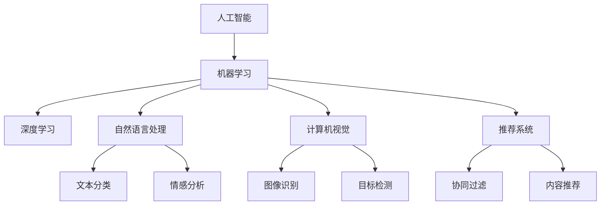
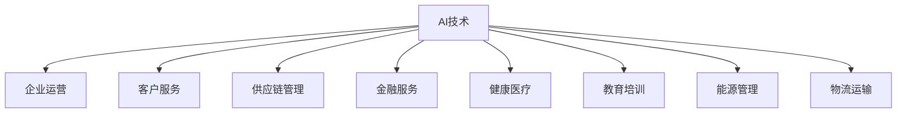

                 

# AI技术与商业模式的结合

## 1. 背景介绍

### 1.1 问题由来
随着人工智能（AI）技术的飞速发展，其在商业应用中日益受到重视。AI技术的应用不仅提高了企业的运营效率，降低了成本，还为用户提供了更加个性化的服务体验。然而，AI技术与商业模式的结合并非易事，需要企业在技术、业务、市场等各个层面进行综合考量。本文将深入探讨AI技术与商业模式的结合方式，分析其背后的原理与挑战，旨在为企业提供有价值的参考。

### 1.2 问题核心关键点
AI技术与商业模式的结合涉及多个关键点，包括：

1. **数据获取与处理**：数据是AI应用的基础，数据的准确性和多样性直接影响模型的训练效果。
2. **算法选择与应用**：选择合适的算法是AI应用成功的关键，需要根据业务需求和数据特点进行评估。
3. **模型训练与优化**：训练高效、泛化能力强的模型是AI应用的核心。
4. **系统部署与集成**：将AI模型成功部署到业务系统中，并与现有系统进行无缝集成，是AI应用的关键。
5. **业务流程优化**：通过AI技术优化业务流程，提升企业效率和客户满意度。
6. **市场推广与营销**：AI技术需要与市场营销策略相结合，才能实现商业价值。

### 1.3 问题研究意义
AI技术与商业模式的结合，对于提升企业竞争力、推动商业创新具有重要意义：

1. **提高运营效率**：通过自动化和智能化技术，AI技术可以大幅提高企业的运营效率，降低成本。
2. **优化客户体验**：AI技术能够提供个性化的服务，提升客户满意度和忠诚度。
3. **开拓新市场**：AI技术的应用可以开拓新的市场领域，创造新的业务增长点。
4. **增强决策能力**：通过数据分析和预测，AI技术能够辅助企业做出更加科学的决策。
5. **提升创新能力**：AI技术为企业的创新提供了新的工具和平台，促进了业务的持续发展。

## 2. 核心概念与联系

### 2.1 核心概念概述

为更好地理解AI技术与商业模式的结合，本节将介绍几个关键概念：

- **人工智能（AI）**：利用计算机技术和算法，使机器具有类似于人类的智能，能够感知、理解、学习、推理和决策。
- **机器学习（ML）**：一种通过数据和算法让计算机系统自动学习和改进的技术。
- **深度学习（DL）**：机器学习的一种高级形式，通过多层神经网络进行复杂特征提取和模式识别。
- **自然语言处理（NLP）**：使计算机能够理解和处理人类语言的技术。
- **计算机视觉（CV）**：使计算机能够识别、理解和生成图像和视频的技术。
- **推荐系统**：通过分析用户行为数据，推荐个性化产品或服务的技术。

这些概念之间相互关联，共同构成了AI技术的应用生态系统。以下是一个Mermaid流程图，展示了这些概念之间的联系：



这个流程图展示了AI技术的几个核心应用领域及其内部的子领域。通过这些领域的技术结合，AI技术可以在不同场景下发挥其独特优势。

### 2.2 概念间的关系

这些核心概念之间存在着紧密的联系，形成了AI技术的应用框架。下面我们通过几个Mermaid流程图来展示这些概念之间的关系。

#### 2.2.1 AI技术的应用领域



这个流程图展示了AI技术在多个行业中的应用，涵盖了企业运营、客户服务、供应链管理、金融服务、健康医疗、教育培训、能源管理、物流运输等多个领域。

#### 2.2.2 数据与算法的关系


这个流程图展示了数据与算法之间的关系。数据经过特征工程处理后，用于模型训练和优化，通过模型评估最终确定是否用于业务应用。

## 3. 核心算法原理 & 具体操作步骤

### 3.1 算法原理概述

AI技术与商业模式的结合，核心在于如何将AI技术应用于具体的商业场景中。常见的AI技术应用包括以下几个方面：

1. **数据分析与预测**：利用机器学习和深度学习技术，从大量数据中提取有用信息，进行预测和决策。
2. **自动化与智能化**：通过自动化技术，提高生产效率和服务质量，如机器人自动化、智能客服等。
3. **个性化推荐**：利用推荐系统技术，提供个性化的产品或服务推荐，提升用户体验。
4. **自然语言处理**：使计算机能够理解和生成自然语言，实现智能对话和文本处理。
5. **计算机视觉**：使计算机能够识别和处理图像和视频数据，实现自动驾驶、安防监控等功能。

这些技术通过数据、算法、模型等环节的有机结合，实现了AI技术与商业模式的有效结合。

### 3.2 算法步骤详解

AI技术与商业模式的结合通常包括以下几个步骤：

1. **数据收集与预处理**：从业务系统中获取数据，并进行清洗、标注和预处理。
2. **特征工程**：提取和构造对业务有意义的特征，用于模型训练。
3. **模型选择与训练**：选择合适的算法模型，并使用标注数据进行训练。
4. **模型评估与优化**：通过评估指标评估模型性能，并根据反馈进行优化。
5. **系统集成与部署**：将训练好的模型集成到业务系统中，并进行测试和部署。
6. **业务优化与迭代**：根据业务反馈和用户需求，不断优化模型和系统，实现业务增长。

### 3.3 算法优缺点

AI技术与商业模式的结合具有以下优点：

1. **提升效率**：通过自动化和智能化技术，大幅提高业务处理效率，降低人工成本。
2. **改善体验**：提供个性化服务，提升用户满意度和忠诚度。
3. **创新突破**：推动业务创新，开拓新的市场领域。
4. **决策支持**：通过数据分析和预测，辅助企业做出科学决策。

然而，也存在一些缺点：

1. **数据依赖性高**：需要大量高质量的数据，数据质量直接影响模型效果。
2. **技术门槛高**：AI技术应用需要专业知识和技术支持，对企业技术团队要求较高。
3. **系统复杂度大**：集成AI模型到现有业务系统，需要综合考虑系统架构和数据接口问题。
4. **伦理和安全问题**：AI技术应用可能涉及用户隐私和数据安全问题，需要严格遵守法律法规。

### 3.4 算法应用领域

AI技术与商业模式的结合，在多个领域都得到了广泛应用，例如：

1. **零售行业**：通过推荐系统、库存管理、客户分析等技术，提升零售业务效率和用户满意度。
2. **金融行业**：利用金融风控、信用评估、量化交易等技术，降低风险和提升收益。
3. **医疗行业**：通过医学影像分析、病历诊断、智能问诊等技术，提升医疗服务质量。
4. **制造业**：利用自动化生产、设备预测维护、质量控制等技术，提高生产效率和产品质量。
5. **交通运输**：通过智能交通管理、自动驾驶、路线优化等技术，提升交通效率和安全性。

这些应用领域展示了AI技术与商业模式的广泛结合，为各行各业带来了巨大的变革和机遇。

## 4. 数学模型和公式 & 详细讲解 & 举例说明

### 4.1 数学模型构建

AI技术的数学模型构建通常包括以下几个部分：

- **输入数据**：输入特征向量 $x \in \mathbb{R}^n$，表示业务数据中的特征信息。
- **模型参数**：模型参数 $w \in \mathbb{R}^m$，用于训练和预测。
- **损失函数**：损失函数 $L(w, x)$，用于衡量模型预测与真实标签之间的差异。
- **优化算法**：优化算法 $f(w)$，用于更新模型参数以最小化损失函数。

常见的数学模型包括线性回归模型、逻辑回归模型、神经网络模型等。以下以线性回归模型为例，介绍其构建和优化过程。

### 4.2 公式推导过程

线性回归模型的目标是找到一个线性函数 $f(x) = w^Tx$，使得模型预测值与真实标签之间的误差最小化。具体公式为：

$$
\min_{w} \sum_{i=1}^N (y_i - w^T x_i)^2
$$

其中 $y_i$ 为真实标签，$x_i$ 为输入特征向量，$N$ 为样本数量。

通过最小二乘法求解上述优化问题，可得：

$$
w = (X^TX)^{-1}X^Ty
$$

其中 $X$ 为特征矩阵，$y$ 为标签向量。

### 4.3 案例分析与讲解

以零售行业的推荐系统为例，展示AI技术的实际应用。假设一个在线零售平台有1000个用户和1000个商品，用户的购买历史数据用于训练模型。

**步骤1**：收集用户的购买历史数据，并将其转化为特征向量 $x$。例如，用户购买的商品ID、购买时间、购买频率等。

**步骤2**：构建推荐模型，选择线性回归模型进行训练，得到模型参数 $w$。

**步骤3**：对新的用户输入特征向量 $x$，利用模型预测用户可能感兴趣的商品。

**步骤4**：根据用户反馈和点击率，调整模型参数，提高模型效果。

通过以上步骤，推荐系统能够根据用户的历史购买行为，推荐其可能感兴趣的商品，提升用户满意度和销售额。

## 5. 项目实践：代码实例和详细解释说明

### 5.1 开发环境搭建

在进行AI项目开发前，需要进行开发环境搭建。以下是使用Python进行TensorFlow开发的环境配置流程：

1. 安装Anaconda：从官网下载并安装Anaconda，用于创建独立的Python环境。

2. 创建并激活虚拟环境：
```bash
conda create -n tf-env python=3.8 
conda activate tf-env
```

3. 安装TensorFlow：根据CUDA版本，从官网获取对应的安装命令。例如：
```bash
conda install tensorflow==2.6 -c tensorflow -c conda-forge
```

4. 安装各类工具包：
```bash
pip install numpy pandas scikit-learn matplotlib tqdm jupyter notebook ipython
```

完成上述步骤后，即可在`tf-env`环境中开始AI项目开发。

### 5.2 源代码详细实现

这里以一个简单的股票价格预测项目为例，展示AI技术的开发流程。

**步骤1**：收集股票历史价格数据，并进行预处理。

```python
import pandas as pd
import numpy as np

# 加载股票数据
data = pd.read_csv('stock_data.csv')

# 预处理数据
features = data[['open', 'high', 'low', 'volume']]
labels = data['close'].shift(-1)
features.columns = ['feature_{}'.format(i) for i in range(features.shape[1])]
features = np.array(features)

# 标准化数据
from sklearn.preprocessing import StandardScaler
scaler = StandardScaler()
features = scaler.fit_transform(features)

# 划分训练集和测试集
train_size = int(0.8 * len(features))
train_features, test_features = features[:train_size], features[train_size:]
train_labels, test_labels = labels[:train_size], labels[train_size:]
```

**步骤2**：构建模型，选择线性回归模型进行训练。

```python
import tensorflow as tf
from tensorflow.keras.models import Sequential
from tensorflow.keras.layers import Dense

# 构建模型
model = Sequential()
model.add(Dense(64, input_dim=features.shape[1], activation='relu'))
model.add(Dense(1))

# 编译模型
model.compile(loss='mse', optimizer=tf.keras.optimizers.Adam())

# 训练模型
model.fit(train_features, train_labels, epochs=100, batch_size=32, validation_split=0.2)
```

**步骤3**：对新的股票数据进行预测。

```python
# 加载新数据
new_data = pd.read_csv('new_stock_data.csv')

# 预处理新数据
new_features = new_data[features.columns].to_numpy()
new_features = scaler.transform(new_features)

# 预测新数据
predictions = model.predict(new_features)
predictions = np.array(predictions).reshape(-1)
```

**步骤4**：评估模型效果。

```python
# 加载真实标签
new_labels = new_data['close'].shift(-1)

# 计算评估指标
from sklearn.metrics import mean_squared_error
mse = mean_squared_error(new_labels, predictions)
print('MSE:', mse)
```

### 5.3 代码解读与分析

让我们再详细解读一下关键代码的实现细节：

**数据预处理**：
- 加载股票数据，并进行特征选择。
- 标准化数据，保证不同特征具有相同的权重。
- 划分训练集和测试集，用于模型训练和测试。

**模型构建与训练**：
- 选择线性回归模型，通过Dense层实现。
- 使用Adam优化器进行模型训练，损失函数为均方误差。
- 设置训练轮数和批次大小，并进行模型训练。

**模型预测与评估**：
- 对新数据进行预测，并通过MSE评估模型效果。

### 5.4 运行结果展示

假设在股票价格预测项目中，模型在测试集上得到了0.1的MSE，即误差平方的平均值。这表明模型预测的股票价格与实际价格的误差较小，模型的预测能力较强。

## 6. 实际应用场景

### 6.1 智能客服

基于AI技术的智能客服系统，可以24小时不间断地为用户提供高质量的服务。通过自然语言处理技术，智能客服能够理解用户的问题，并根据历史数据进行推荐。例如，某用户询问“如何退换货”，智能客服能够根据用户的历史购买记录，推荐相关的退换货政策和流程。

**步骤1**：收集用户的历史对话记录和行为数据。
**步骤2**：使用NLP技术进行文本分析和意图识别。
**步骤3**：根据历史数据和用户行为，推荐合适的答案。
**步骤4**：不断优化模型，提高推荐效果。

通过智能客服系统，企业能够显著降低人力成本，提升用户体验。

### 6.2 金融风控

金融行业面临的风险较大，传统的风控方式难以满足高需求。基于AI技术的金融风控系统，能够实时监控用户行为，识别潜在的风险点，并给出相应的预警。例如，某用户申请贷款时，系统通过分析其历史行为和当前状态，判断其还款能力，并根据风控模型给出是否批准贷款的建议。

**步骤1**：收集用户的历史行为数据，如贷款记录、信用卡消费记录等。
**步骤2**：使用机器学习模型进行风险评估，构建风控模型。
**步骤3**：实时监控用户行为，并根据风控模型进行风险预警。
**步骤4**：根据风险预警结果，进行相应的操作，如拒绝贷款、调整贷款额度等。

通过金融风控系统，企业能够有效降低金融风险，提升客户满意度。

### 6.3 智能医疗

医疗行业的数据量庞大，传统的人工分析方式效率低下。基于AI技术的智能医疗系统，能够快速处理和分析大量的医疗数据，辅助医生进行诊断和治疗。例如，某医院使用AI系统进行癌症筛查，通过分析患者的医学影像和病历数据，快速判断其是否患有癌症，并提供相应的治疗建议。

**步骤1**：收集患者的医学影像和病历数据。
**步骤2**：使用计算机视觉和深度学习技术，进行图像分析和特征提取。
**步骤3**：使用自然语言处理技术，对病历数据进行分析和理解。
**步骤4**：根据分析和理解结果，给出诊断和治疗建议。

通过智能医疗系统，医生能够快速诊断和处理疾病，提高医疗效率。

### 6.4 未来应用展望

未来，AI技术与商业模式的结合将进一步深化，将覆盖更多的领域和场景。以下是几个未来应用展望：

1. **自动驾驶**：基于AI技术的自动驾驶系统，将大幅提升交通安全和效率。
2. **智能制造**：利用AI技术进行设备预测维护和质量控制，提高生产效率和产品质量。
3. **智能家居**：通过智能设备和语音助手，提升家居智能化水平。
4. **智慧城市**：利用AI技术进行交通管理、环境监测、公共安全等，提升城市管理水平。
5. **教育培训**：通过AI技术进行个性化学习和智能辅导，提升教育效果。

## 7. 工具和资源推荐

### 7.1 学习资源推荐

为了帮助开发者系统掌握AI技术与商业模式的结合理论基础和实践技巧，这里推荐一些优质的学习资源：

1. **《深度学习》（Ian Goodfellow, Yoshua Bengio, Aaron Courville著）**：全面介绍深度学习的基础理论和算法，适合初学者和进阶者。
2. **CS231n：卷积神经网络（CNN）**：斯坦福大学开设的计算机视觉课程，包含大量实际案例和代码，适合计算机视觉学习者。
3. **《自然语言处理综论》（Daniel Jurafsky, James H. Martin著）**：全面介绍自然语言处理的基本概念和技术，适合NLP学习者。
4. **Coursera AI和机器学习课程**：包含多个知名大学的课程，涵盖AI和机器学习的基础知识和前沿技术。
5. **Kaggle竞赛**：通过参与数据科学竞赛，锻炼实际问题解决能力，积累项目经验。

通过对这些资源的学习实践，相信你一定能够快速掌握AI技术与商业模式的结合精髓，并用于解决实际的AI问题。

### 7.2 开发工具推荐

高效的开发离不开优秀的工具支持。以下是几款用于AI开发的工具：

1. **TensorFlow**：由Google主导开发的开源深度学习框架，支持分布式训练，适合大规模项目。
2. **PyTorch**：Facebook开发的开源深度学习框架，灵活性高，适合研究型项目。
3. **Keras**：高层API，简单易用，适合快速原型开发。
4. **Jupyter Notebook**：交互式编程工具，适合数据处理和模型训练。
5. **Scikit-learn**：数据处理和机器学习库，包含丰富的算法和工具。

合理利用这些工具，可以显著提升AI项目开发效率，加快创新迭代的步伐。

### 7.3 相关论文推荐

AI技术与商业模式的结合涉及众多前沿技术，以下是几篇奠基性的相关论文，推荐阅读：

1. **深度学习（Deep Learning）**：Goodfellow, I., Bengio, Y., and Courville, A.（2016）。
2. **计算机视觉：基础与实践**：LeCun, Y., Bottou, L., Bengio, Y., and Hinton, G.（2015）。
3. **自然语言处理综述**：Jurafsky, D., and Martin, J.H.（2018）。
4. **强化学习**：Sutton, R.S.和Barto, A.G.（2018）。

这些论文代表了大数据、深度学习、计算机视觉和自然语言处理等领域的最新研究进展，是深入了解AI技术的基础。

除上述资源外，还有一些值得关注的前沿资源，帮助开发者紧跟AI技术的发展趋势，例如：

1. **arXiv论文预印本**：人工智能领域最新研究成果的发布平台，包括大量尚未发表的前沿工作，学习前沿技术的必读资源。
2. **顶会论文**：如NIPS、ICML、ACL、ICLR等人工智能领域顶会现场或在线直播，能够聆听到大佬们的前沿分享，开拓视野。
3. **开源项目**：在GitHub上Star、Fork数最多的AI相关项目，往往代表了该技术领域的发展趋势和最佳实践，值得去学习和贡献。

## 8. 总结：未来发展趋势与挑战

### 8.1 总结

本文对AI技术与商业模式的结合进行了全面系统的介绍。首先阐述了AI技术在商业应用中的重要性和应用场景，明确了AI技术与商业模式的结合方式和作用。其次，从原理到实践，详细讲解了AI技术在商业应用中的核心算法、操作步骤和注意事项，给出了AI项目开发的完整代码实例。同时，本文还广泛探讨了AI技术在智能客服、金融风控、智能医疗等多个行业领域的应用前景，展示了AI技术的巨大潜力。此外，本文精选了AI技术的各类学习资源，力求为读者提供全方位的技术指引。

通过本文的系统梳理，可以看到，AI技术与商业模式的结合正在成为各行各业的重要技术趋势，AI技术的应用不仅提升了企业的运营效率和服务质量，还创造了新的商业模式和价值。未来，随着AI技术的持续进步和商业应用的不断拓展，AI技术与商业模式的结合将带来更多创新和突破。

### 8.2 未来发展趋势

展望未来，AI技术与商业模式的结合将呈现以下几个发展趋势：

1. **技术更加普及**：AI技术将在更多行业中得到应用，成为企业核心竞争力的一部分。
2. **应用更加深入**：AI技术将渗透到业务流程的各个环节，提升业务效率和客户体验。
3. **领域更加多样化**：AI技术将在医疗、金融、制造、教育、交通等多个领域发挥重要作用。
4. **场景更加丰富**：AI技术将应用于更多实际场景，解决复杂问题。
5. **智能更加融合**：AI技术将与其他技术如区块链、物联网等融合，形成智能生态系统。
6. **安全更加重视**：AI技术应用需要重视数据安全、伦理道德等问题，确保应用安全。

以上趋势凸显了AI技术与商业模式的广阔前景。这些方向的探索发展，必将进一步提升AI技术在商业应用中的价值，为各行各业带来更多变革和机遇。

### 8.3 面临的挑战

尽管AI技术与商业模式的结合取得了不少进展，但在迈向更加智能化、普适化应用的过程中，仍面临诸多挑战：

1. **数据质量与数量**：高质量数据是AI技术应用的基础，数据获取和处理需要大量资源。
2. **技术复杂度**：AI技术的应用需要跨学科知识，对企业技术团队要求较高。
3. **系统集成**：AI技术需要与现有系统无缝集成，涉及到系统架构和数据接口问题。
4. **伦理和安全**：AI技术应用可能涉及用户隐私和数据安全问题，需要严格遵守法律法规。
5. **性能优化**：AI模型在大规模数据上的训练和推理需要高性能计算资源。
6. **商业价值**：如何实现AI技术的商业价值最大化，需要深入研究和市场验证。

### 8.4 研究展望

面对AI技术与商业模式的结合所面临的挑战，未来的研究需要在以下几个方面寻求新的突破：

1. **数据获取与处理**：探索高效、低成本的数据获取和处理方式，提升数据质量。
2. **技术优化**：开发更加高效、易用的AI技术工具，降低技术门槛。
3. **系统集成**：开发标准化接口和组件，实现系统无缝集成。
4. **伦理与安全**：建立AI技术应用的伦理和安全规范，确保应用合规。
5. **性能优化**：优化模型训练和推理效率，降低计算资源消耗。
6. **商业价值**：探索AI技术在各行业中的商业应用场景，提升商业价值。

这些研究方向将推动AI技术与商业模式的深度结合，带来更多创新和突破，为各行业的数字化转型提供强有力的技术支持。

## 9. 附录：常见问题与解答

**Q1：AI技术与商业模式的结合是否适用于所有企业？**

A: AI技术与商业模式的结合并非适用于所有企业，需要考虑企业的业务性质和资源条件。一般来说，数据量较大、业务复杂的企业，更容易实现AI技术的商业应用。

**Q2：AI技术的商业应用是否需要大量的初始投资？**

A: 是的，AI技术的商业应用需要大量的初始投资，包括数据获取、技术开发、系统集成等。但是，随着AI技术的普及和算力成本的下降，未来的投入成本将会逐渐降低。

**Q3：AI技术的商业应用如何评估其商业价值？**

A: 评估AI技术的商业价值需要综合考虑多个方面，包括提高的效率、降低的成本、提升的体验等。可以通过业务指标、用户反馈、市场反应等进行评估。

**Q4：AI技术的商业应用如何保护用户隐私和数据安全？**

A: 保护用户隐私和数据安全是AI技术应用的重要问题。企业需要遵守相关法律法规，如GDPR等，确保用户数据的安全和隐私保护。

**Q5：AI技术的商业应用如何实现可持续发展？**

A: 实现AI技术的可持续发展需要考虑多个方面，包括数据持续更新、技术持续优化、用户持续反馈等。企业需要建立可持续发展的AI应用生态系统。

通过本文的系统梳理，可以看到，AI技术与商业模式的结合正在成为各行各业的重要技术趋势，AI技术的应用不仅提升了企业的运营效率和服务质量，还创造了新的商业模式和价值。未来，随着AI技术的持续进步和商业应用的不断拓展，AI技术与商业模式的结合将带来更多创新和突破，为各行各业带来更多变革和机遇。

---

作者：禅与计算机程序设计艺术 / Zen and the Art of Computer Programming

