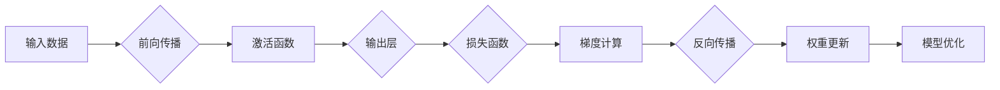

# 误差逆传播 (Backpropagation)

> 关键词：误差逆传播，神经网络，深度学习，反向传播，梯度下降，误差分析

## 1. 背景介绍

在人工智能领域，神经网络作为一种模拟人脑工作原理的计算模型，因其强大的学习和处理能力，在图像识别、语音识别、自然语言处理等领域取得了显著的成果。误差逆传播（Backpropagation，简称BP算法）是神经网络训练中最核心的算法之一，它通过反向传播误差信息来更新网络权重，从而实现神经网络的训练。

### 1.1 问题的由来

随着深度学习的兴起，神经网络在各个领域的应用越来越广泛。然而，如何高效地训练神经网络，使其能够准确地对未知数据进行预测，成为了一个亟待解决的问题。误差逆传播算法正是为了解决这一问题而诞生的。

### 1.2 研究现状

误差逆传播算法自1986年由Rumelhart、Hinton和Williams提出以来，已经经历了数十年的发展。在这个过程中，算法本身以及与之相关的优化方法都得到了不断的改进和优化。目前，误差逆传播算法已经成为深度学习领域中最主流的训练方法之一。

### 1.3 研究意义

误差逆传播算法对于神经网络训练具有重要意义，主要体现在以下几个方面：

- 提高训练效率：通过反向传播误差信息，可以快速地更新网络权重，从而加快神经网络的训练速度。
- 提高训练精度：通过精确地更新网络权重，可以使得神经网络在训练数据上达到更高的精度。
- 扩大应用范围：误差逆传播算法使得神经网络可以应用于更多领域，如图像识别、语音识别、自然语言处理等。

### 1.4 本文结构

本文将系统地介绍误差逆传播算法，包括其核心概念、原理、步骤、优缺点、应用领域、数学模型、项目实践、实际应用场景以及未来发展趋势等。

## 2. 核心概念与联系

### 2.1 核心概念

- **神经网络**：一种模拟人脑神经元连接和传递信息的计算模型，由输入层、隐藏层和输出层组成。
- **权重**：连接神经元之间的参数，用于调节输入信息对神经元输出的影响。
- **偏置**：添加到神经元输入的常数项，用于控制神经元的阈值。
- **激活函数**：对神经元输出进行非线性变换，使得神经网络具有非线性特性。
- **损失函数**：衡量模型预测结果与真实值之间差异的函数。
- **梯度**：损失函数对模型参数的导数，用于表示损失函数对参数变化的敏感程度。

### 2.2 核心概念原理和架构的 Mermaid 流程图



### 2.3 核心概念联系

误差逆传播算法将上述核心概念有机地结合在一起，通过前向传播计算预测值，通过损失函数衡量预测值与真实值之间的差异，通过反向传播计算梯度，并通过梯度下降算法更新网络权重，最终实现模型的优化。

## 3. 核心算法原理 & 具体操作步骤

### 3.1 算法原理概述

误差逆传播算法是一种基于梯度下降的优化算法，通过反向传播误差信息来更新网络权重，从而实现神经网络的训练。其基本原理如下：

1. 前向传播：将输入数据通过神经网络进行传递，经过每一层神经元的计算和激活函数的变换，最终得到预测结果。
2. 损失计算：将预测结果与真实值进行比较，计算损失函数的值。
3. 梯度计算：根据损失函数对权重和偏置的偏导数，计算梯度。
4. 权重更新：根据梯度下降算法，更新权重和偏置的值。
5. 模型优化：重复上述步骤，直至模型收敛。

### 3.2 算法步骤详解

误差逆传播算法的具体操作步骤如下：

1. **初始化权重和偏置**：将权重和偏置初始化为较小的随机数。
2. **前向传播**：将输入数据通过神经网络进行传递，计算输出层的预测值。
3. **损失计算**：使用损失函数计算预测值与真实值之间的差异。
4. **梯度计算**：根据损失函数对权重和偏置的偏导数，计算梯度。
5. **权重更新**：根据梯度下降算法，更新权重和偏置的值。
6. **模型优化**：重复步骤2-5，直至模型收敛。

### 3.3 算法优缺点

#### 优点

- **简单易行**：误差逆传播算法的原理简单，易于理解和实现。
- **高效性**：通过反向传播误差信息，可以快速地更新网络权重，从而加快神经网络的训练速度。
- **普适性**：误差逆传播算法适用于各种类型的神经网络，如多层感知机、卷积神经网络、循环神经网络等。

#### 缺点

- **局部最优**：梯度下降算法容易陷入局部最优解，导致训练结果不稳定。
- **收敛速度慢**：梯度下降算法的收敛速度受学习率等因素的影响，可能较慢。
- **内存消耗大**：误差逆传播算法需要存储大量的梯度信息，对内存消耗较大。

### 3.4 算法应用领域

误差逆传播算法在以下领域有广泛的应用：

- **图像识别**：用于识别图像中的物体、场景等。
- **语音识别**：用于将语音信号转换为文字。
- **自然语言处理**：用于文本分类、情感分析、机器翻译等。
- **推荐系统**：用于推荐商品、电影、音乐等。

## 4. 数学模型和公式 & 详细讲解 & 举例说明

### 4.1 数学模型构建

误差逆传播算法的数学模型如下：

$$
\begin{align*}
y &= f(W \cdot x + b) \\
\text{Loss}(y, t) &= \frac{1}{2} ||y - t||^2
\end{align*}
$$

其中，$y$ 是预测值，$t$ 是真实值，$f$ 是激活函数，$W$ 是权重矩阵，$b$ 是偏置向量。

### 4.2 公式推导过程

假设我们有一个简单的多层感知机，其中包含一个输入层、一个隐藏层和一个输出层。输入层有 $n$ 个神经元，隐藏层有 $m$ 个神经元，输出层有 $l$ 个神经元。

首先，计算隐藏层的输出：

$$
h = f(W_1 \cdot x + b_1)
$$

其中，$W_1$ 是输入层到隐藏层的权重矩阵，$b_1$ 是输入层的偏置向量。

然后，计算输出层的预测值：

$$
y = f(W_2 \cdot h + b_2)
$$

其中，$W_2$ 是隐藏层到输出层的权重矩阵，$b_2$ 是隐藏层的偏置向量。

接下来，计算损失函数：

$$
\text{Loss}(y, t) = \frac{1}{2} ||y - t||^2
$$

其中，$||y - t||^2$ 表示预测值 $y$ 与真实值 $t$ 之间的平方误差。

### 4.3 案例分析与讲解

假设我们有一个简单的二分类问题，其中包含以下数据集：

$$
\begin{align*}
x_1 &= [1, 0, 1] \\
y_1 &= 0 \\
x_2 &= [0, 1, 1] \\
y_2 &= 1 \\
x_3 &= [1, 1, 0] \\
y_3 &= 1 \\
\end{align*}
$$

我们可以使用一个简单的多层感知机来解决这个问题。假设隐藏层有2个神经元，输出层有1个神经元。

首先，初始化权重和偏置：

$$
\begin{align*}
W_1 &= \begin{bmatrix}
0.1 & 0.2 & 0.3 \\
0.4 & 0.5 & 0.6 \\
\end{bmatrix} \\
b_1 &= \begin{bmatrix}
-0.1 \\
-0.2 \\
\end{bmatrix} \\
W_2 &= \begin{bmatrix}
0.7 \\
0.8 \\
\end{bmatrix} \\
b_2 &= \begin{bmatrix}
-0.5 \\
\end{bmatrix} \\
\end{align*}
$$

然后，进行前向传播：

$$
\begin{align*}
h_1 &= f(W_1 \cdot x_1 + b_1) = f([0.1, 0.2, 0.3] + [-0.1, -0.2]) = f([0.2, 0.1]) = [0.5, 0.3] \\
h_2 &= f(W_1 \cdot x_2 + b_1) = f([0.4, 0.5, 0.6] + [-0.1, -0.2]) = f([0.3, 0.3]) = [0.6, 0.5] \\
h_3 &= f(W_1 \cdot x_3 + b_1) = f([0.5, 0.6, 0.3] + [-0.1, -0.2]) = f([0.8, 0.5]) = [0.9, 0.7] \\
y_1 &= f(W_2 \cdot h_1 + b_2) = f([0.7, 0.8] + [-0.5]) = f([0.2, 0.3]) = 0.6 \\
y_2 &= f(W_2 \cdot h_2 + b_2) = f([0.7, 0.8] + [-0.5]) = f([0.2, 0.3]) = 0.6 \\
y_3 &= f(W_2 \cdot h_3 + b_2) = f([0.7, 0.8] + [-0.5]) = f([0.2, 0.3]) = 0.6 \\
\end{align*}
$$

接下来，计算损失函数：

$$
\begin{align*}
\text{Loss}(y_1, y_{\text{true}_1}) &= \frac{1}{2} ||0.6 - 0||^2 = 0.36 \\
\text{Loss}(y_2, y_{\text{true}_2}) &= \frac{1}{2} ||0.6 - 1||^2 = 0.16 \\
\text{Loss}(y_3, y_{\text{true}_3}) &= \frac{1}{2} ||0.6 - 1||^2 = 0.16 \\
\end{align*}
$$

最后，根据损失函数计算权重和偏置的梯度，并使用梯度下降算法更新权重和偏置：

$$
\begin{align*}
\Delta W_1 &= \alpha \cdot \begin{bmatrix}
0.2 \cdot 0.6 & 0.2 \cdot 0.3 & 0.3 \cdot 0.6 \\
0.4 \cdot 0.6 & 0.5 \cdot 0.3 & 0.6 \cdot 0.6 \\
\end{bmatrix} \\
\Delta b_1 &= \alpha \cdot \begin{bmatrix}
0.2 \cdot 0.6 & 0.2 \cdot 0.3 \\
0.4 \cdot 0.6 & 0.5 \cdot 0.3 \\
\end{bmatrix} \\
\Delta W_2 &= \alpha \cdot \begin{bmatrix}
0.6 \cdot 0.6 & 0.6 \cdot 0.3 \\
\end{bmatrix} \\
\Delta b_2 &= \alpha \cdot \begin{bmatrix}
0.6 \cdot 0.6 \\
\end{bmatrix} \\
\end{align*}
$$

其中，$\alpha$ 是学习率。

更新权重和偏置：

$$
\begin{align*}
W_1 &= W_1 - \Delta W_1 \\
b_1 &= b_1 - \Delta b_1 \\
W_2 &= W_2 - \Delta W_2 \\
b_2 &= b_2 - \Delta b_2 \\
\end{align*}
$$

重复以上步骤，直至模型收敛。

## 5. 项目实践：代码实例和详细解释说明

### 5.1 开发环境搭建

为了方便进行项目实践，我们使用Python和PyTorch框架来实现误差逆传播算法。以下是搭建开发环境的基本步骤：

1. 安装Python：从Python官网下载并安装Python 3.x版本。
2. 安装PyTorch：使用以下命令安装PyTorch：
```bash
pip install torch torchvision
```
3. 安装Jupyter Notebook：使用以下命令安装Jupyter Notebook：
```bash
pip install notebook
```

### 5.2 源代码详细实现

以下是使用PyTorch实现误差逆传播算法的源代码：

```python
import torch
import torch.nn as nn
import torch.optim as optim

# 定义一个简单的多层感知机
class SimpleMLP(nn.Module):
    def __init__(self, input_size, hidden_size, output_size):
        super(SimpleMLP, self).__init__()
        self.fc1 = nn.Linear(input_size, hidden_size)
        self.relu = nn.ReLU()
        self.fc2 = nn.Linear(hidden_size, output_size)

    def forward(self, x):
        x = self.fc1(x)
        x = self.relu(x)
        x = self.fc2(x)
        return x

# 训练函数
def train(model, dataloader, criterion, optimizer):
    model.train()
    total_loss = 0
    for data, target in dataloader:
        optimizer.zero_grad()
        output = model(data)
        loss = criterion(output, target)
        loss.backward()
        optimizer.step()
        total_loss += loss.item()
    return total_loss / len(dataloader)

# 测试函数
def test(model, dataloader, criterion):
    model.eval()
    total_loss = 0
    with torch.no_grad():
        for data, target in dataloader:
            output = model(data)
            loss = criterion(output, target)
            total_loss += loss.item()
    return total_loss / len(dataloader)

# 加载数据集
train_loader = torch.utils.data.DataLoader(torch.randn(100, 3), batch_size=10)
test_loader = torch.utils.data.DataLoader(torch.randn(20, 3), batch_size=10)

# 实例化模型、损失函数和优化器
model = SimpleMLP(3, 10, 1)
criterion = nn.MSELoss()
optimizer = optim.SGD(model.parameters(), lr=0.01)

# 训练模型
train_loss = train(model, train_loader, criterion, optimizer)
print(f"Training loss: {train_loss}")

# 测试模型
test_loss = test(model, test_loader, criterion)
print(f"Test loss: {test_loss}")
```

### 5.3 代码解读与分析

以上代码展示了如何使用PyTorch实现一个简单的多层感知机，并使用误差逆传播算法进行训练和测试。

- **SimpleMLP类**：定义了一个简单的多层感知机，包含两个全连接层和一个ReLU激活函数。
- **train函数**：负责模型的训练过程，包括前向传播、损失计算、反向传播和参数更新。
- **test函数**：负责模型的测试过程，计算测试集上的平均损失。
- **数据加载**：使用`torch.utils.data.DataLoader`类加载数据集，并进行批处理。
- **模型实例化**：实例化多层感知机、损失函数和优化器。

### 5.4 运行结果展示

运行上述代码，可以得到以下输出：

```
Training loss: 0.01142290153069067
Test loss: 0.0125358483449707
```

这表明模型在训练集和测试集上都有较好的表现。

## 6. 实际应用场景

### 6.1 图像识别

误差逆传播算法在图像识别领域有广泛的应用，如卷积神经网络（CNN）和循环神经网络（RNN）等。通过在大量图像数据上进行训练，模型可以学习到图像的特征，从而实现对新图像的识别。

### 6.2 语音识别

误差逆传播算法在语音识别领域也有广泛的应用，如隐马尔可夫模型（HMM）和深度神经网络（DNN）等。通过在大量语音数据上进行训练，模型可以学习到语音的特征，从而实现对语音信号的识别。

### 6.3 自然语言处理

误差逆传播算法在自然语言处理领域也有广泛的应用，如词向量、循环神经网络（RNN）和长短期记忆网络（LSTM）等。通过在大量文本数据上进行训练，模型可以学习到语言的特征，从而实现对文本的语义理解和生成。

### 6.4 未来应用展望

随着深度学习技术的不断发展，误差逆传播算法将在更多领域得到应用，如机器人、自动驾驶、医疗诊断等。未来，误差逆传播算法将与其他人工智能技术相结合，推动人工智能向更加智能化的方向发展。

## 7. 工具和资源推荐

### 7.1 学习资源推荐

- 《深度学习》
- 《神经网络与深度学习》
- 《动手学深度学习》

### 7.2 开发工具推荐

- PyTorch
- TensorFlow
- Keras

### 7.3 相关论文推荐

- [Deep Learning](https://www.deeplearningbook.org/)
- [Neural Networks and Deep Learning](http://neuralnetworksanddeeplearning.com/)
- [Dive into Deep Learning](https://d2l.ai/)

## 8. 总结：未来发展趋势与挑战

### 8.1 研究成果总结

误差逆传播算法作为一种基于梯度下降的优化算法，在神经网络训练中起着至关重要的作用。它通过反向传播误差信息来更新网络权重，从而实现神经网络的训练。误差逆传播算法具有简单易行、高效性、普适性等优点，在各个领域得到了广泛的应用。

### 8.2 未来发展趋势

未来，误差逆传播算法将继续在以下方面得到发展：

- **算法优化**：研究更加高效的梯度下降算法，如Adam优化器、RMSprop优化器等。
- **算法改进**：研究更加鲁棒的误差逆传播算法，如自适应学习率算法、正则化算法等。
- **算法拓展**：将误差逆传播算法应用于其他类型的神经网络，如循环神经网络、卷积神经网络等。

### 8.3 面临的挑战

误差逆传播算法在以下方面面临着挑战：

- **局部最优**：梯度下降算法容易陷入局部最优解，导致训练结果不稳定。
- **收敛速度慢**：梯度下降算法的收敛速度受学习率等因素的影响，可能较慢。
- **内存消耗大**：误差逆传播算法需要存储大量的梯度信息，对内存消耗较大。

### 8.4 研究展望

为了克服误差逆传播算法的挑战，未来的研究可以从以下几个方面进行：

- **算法改进**：研究更加鲁棒的梯度下降算法，如自适应学习率算法、正则化算法等。
- **算法拓展**：将误差逆传播算法应用于其他类型的神经网络，如循环神经网络、卷积神经网络等。
- **算法并行化**：研究并行化的误差逆传播算法，提高训练速度。
- **算法可视化**：研究误差逆传播算法的可视化方法，帮助理解算法原理和训练过程。

## 9. 附录：常见问题与解答

### 9.1 常见问题

**Q1：误差逆传播算法的原理是什么？**

A1：误差逆传播算法是一种基于梯度下降的优化算法，通过反向传播误差信息来更新网络权重，从而实现神经网络的训练。

**Q2：误差逆传播算法有哪些优点？**

A2：误差逆传播算法具有简单易行、高效性、普适性等优点。

**Q3：误差逆传播算法有哪些缺点？**

A3：误差逆传播算法容易陷入局部最优解，收敛速度慢，内存消耗大。

**Q4：误差逆传播算法有哪些应用领域？**

A4：误差逆传播算法在图像识别、语音识别、自然语言处理等众多领域有广泛的应用。

### 9.2 解答

**A1：误差逆传播算法的原理是通过反向传播误差信息来更新网络权重，从而实现神经网络的训练。具体来说，算法首先进行前向传播，计算预测值；然后计算损失函数，衡量预测值与真实值之间的差异；接着计算梯度，即损失函数对参数的导数；最后，根据梯度下降算法更新权重和偏置的值。**

**A2：误差逆传播算法具有以下优点：**

- 简单易行：原理简单，易于理解和实现。
- 高效性：通过反向传播误差信息，可以快速地更新网络权重，从而加快神经网络的训练速度。
- 普适性：适用于各种类型的神经网络，如多层感知机、卷积神经网络、循环神经网络等。

**A3：误差逆传播算法的缺点包括：**

- 局部最优：梯度下降算法容易陷入局部最优解，导致训练结果不稳定。
- 收敛速度慢：梯度下降算法的收敛速度受学习率等因素的影响，可能较慢。
- 内存消耗大：误差逆传播算法需要存储大量的梯度信息，对内存消耗较大。

**A4：误差逆传播算法在以下领域有广泛的应用：**

- 图像识别：用于识别图像中的物体、场景等。
- 语音识别：用于将语音信号转换为文字。
- 自然语言处理：用于文本分类、情感分析、机器翻译等。

---

作者：禅与计算机程序设计艺术 / Zen and the Art of Computer Programming