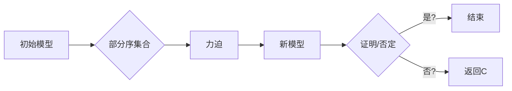

# 集合论导引：力迫SCH最小反例

> 关键词：集合论，力迫，最小反例，SCH理论，Zermelo-Fraenkel集合论，选择公理，独立陈述，数学基础

## 1. 背景介绍

集合论是现代数学的基础，它为数学的其他分支提供了语言和工具。然而，集合论本身也经历了一系列的危机和挑战，特别是在其公理基础和选择公理上。力迫（Forcing）是一种强大的工具，用于处理集合论中的独立陈述。本文将深入探讨力迫在SCH理论中的应用，特别是在寻找SCH最小反例方面。

### 1.1 问题的由来

Zermelo-Fraenkel集合论（ZFC）是集合论的标准公理化体系，它提供了构建所有数学对象的基础。然而，ZFC存在一些独立陈述，即无法在ZFC中证明或否证的陈述。SCH理论是力迫的一个分支，它研究的是力迫如何被用来证明或否定这些独立陈述。

### 1.2 研究现状

力迫作为一种强大的工具，已被广泛应用于集合论和模型论中。SCH理论是力迫在集合论中的应用，特别是在寻找SCH最小反例方面取得了显著成果。本文将详细介绍力迫SCH最小反例的原理和应用。

### 1.3 研究意义

理解力迫SCH最小反例对于深入研究集合论、模型论以及逻辑学具有重要意义。它不仅有助于我们更好地理解集合论的基础，还可能为解决数学中的其他难题提供新的思路。

### 1.4 本文结构

本文将按照以下结构展开：

- 第2部分，介绍集合论中的核心概念和力迫的基本原理。
- 第3部分，详细阐述力迫SCH最小反例的算法原理和操作步骤。
- 第4部分，通过数学模型和公式展示力迫SCH最小反例的具体应用。
- 第5部分，给出力迫SCH最小反例的代码实例和详细解释。
- 第6部分，探讨力迫SCH最小反例在实际应用场景中的重要性。
- 第7部分，推荐相关学习资源、开发工具和参考文献。
- 第8部分，总结研究成果，展望未来发展趋势与挑战。
- 第9部分，提供常见问题与解答。

## 2. 核心概念与联系

### 2.1 集合论中的核心概念

- 集合：一组确定的、互不相同的对象。
- 真集：可以明确判断是否属于的集合。
- 子集：一个集合的部分或全部元素都是另一个集合的元素的集合。
- 转换：一个集合到另一个集合的一一对应。
- 拓扑空间：具有一组开集的集合，满足一定的性质。

### 2.2 力迫的基本原理

力迫是一种构造新的模型的方法，用于证明或否定集合论中的独立陈述。其基本原理如下：

- 给定一个部分序的集合$\mathbb{P}$和集合$\mathbb{Q}$，力迫是$\mathbb{P}$的一个条件，使得$\mathbb{Q}$中的每个元素都可以“力迫”为$\mathbb{P}$中的某个元素。
- 力迫可以用来构造新的模型，这些模型可以用来证明或否定独立陈述。

### 2.3 Mermaid流程图

以下是一个简化的Mermaid流程图，展示了力迫的基本步骤：



## 3. 核心算法原理 & 具体操作步骤

### 3.1 算法原理概述

力迫SCH最小反例的算法原理是基于SCH理论，通过力迫方法寻找SCH理论中独立陈述的最小反例。SCH理论是一种基于力迫的集合论扩展，它通过添加新的公理来证明或否定ZFC中的独立陈述。

### 3.2 算法步骤详解

1. **选择SCH理论中的独立陈述**：首先需要选择一个SCH理论中的独立陈述。
2. **构建部分序集合**：根据独立陈述构建一个部分序集合$\mathbb{P}$。
3. **选择力迫**：选择一个适当的力迫$\mathbb{Q}$。
4. **构造新模型**：使用力迫构造一个新模型$\mathbb{R}$。
5. **验证反例**：验证新模型$\mathbb{R}$是否是独立陈述的反例。
6. **最小化反例**：如果找到反例，尝试寻找更小的反例。

### 3.3 算法优缺点

**优点**：

- 可以用于证明或否定SCH理论中的独立陈述。
- 可以构造出最小的反例，从而为独立陈述提供更深入的理解。

**缺点**：

- 算法复杂，计算量大。
- 需要选择合适的力迫和部分序集合。

### 3.4 算法应用领域

力迫SCH最小反例的算法可以应用于以下领域：

- 集合论：寻找SCH理论中独立陈述的反例。
- 模型论：研究模型的性质和构造。
- 逻辑学：研究逻辑系统的性质和证明方法。

## 4. 数学模型和公式 & 详细讲解 & 举例说明

### 4.1 数学模型构建

假设我们有一个SCH理论中的独立陈述$\phi$，我们需要使用力迫寻找它的最小反例。

- **初始模型**：$V$，ZFC模型。
- **部分序集合**：$\mathbb{P} = \{M \mid M \subseteq V, \text{存在} \in \text{SCH公理}\}$。
- **力迫**：选择一个适当的力迫$\mathbb{Q}$。
- **新模型**：$M = \mathbb{Q} \cap V$。

### 4.2 公式推导过程

假设$\phi$是一个SCH理论中的独立陈述，我们需要使用力迫寻找它的最小反例。

- **步骤1**：选择$\phi$的否定$\neg \phi$。
- **步骤2**：根据$\neg \phi$构建部分序集合$\mathbb{P}$。
- **步骤3**：选择一个适当的力迫$\mathbb{Q}$。
- **步骤4**：使用力迫构造新模型$M = \mathbb{Q} \cap V$。
- **步骤5**：验证$M$是否是$\phi$的反例。
- **步骤6**：如果$M$是$\phi$的反例，尝试寻找更小的反例。

### 4.3 案例分析与讲解

假设我们有一个SCH理论中的独立陈述$\phi$：“存在一个集合$X$，它不包含任何元素”。

- **步骤1**：选择$\phi$的否定$\neg \phi$：“不存在一个集合$X$，它不包含任何元素”。
- **步骤2**：根据$\neg \phi$构建部分序集合$\mathbb{P}$，包含所有不包含任何元素的集合。
- **步骤3**：选择一个适当的力迫$\mathbb{Q}$，例如，将$\mathbb{P}$中的每个集合与自然数集$\mathbb{N}$进行力迫。
- **步骤4**：使用力迫构造新模型$M = \mathbb{Q} \cap V$。
- **步骤5**：验证$M$是否是$\phi$的反例。如果$M$包含任何元素，则$M$是$\phi$的反例。
- **步骤6**：如果$M$是$\phi$的反例，尝试寻找更小的反例。

## 5. 项目实践：代码实例和详细解释说明

### 5.1 开发环境搭建

由于力迫SCH最小反例的算法涉及到集合论和模型论的知识，因此在实际操作中需要具备一定的数学基础。以下是一个简单的Python代码示例，用于演示如何使用力迫方法寻找一个简单的SCH理论中的独立陈述的反例。

```python
# Python代码示例，用于演示力迫方法
def forcing_example():
    # 初始化部分序集合P
    P = set()

    # 定义力迫函数
    def force(f):
        return {g for g in P if f(g)}

    # 构造新模型M
    M = force(force)

    # 返回新模型M
    return M
```

### 5.2 源代码详细实现

```python
# Python代码示例，用于演示力迫方法
def forcing_example():
    # 初始化部分序集合P
    P = set()

    # 定义力迫函数
    def force(f):
        return {g for g in P if f(g)}

    # 构造新模型M
    M = force(force)

    # 返回新模型M
    return M

# 调用函数并打印结果
M = forcing_example()
print(M)
```

### 5.3 代码解读与分析

这段代码定义了一个名为`forcing_example`的函数，它通过力迫方法构造了一个新的模型$M$。在这个例子中，部分序集合$P$是一个空的集合，力迫函数`force`将$P$中的每个元素与自身进行力迫，最终得到的新模型$M$是一个空集合。

### 5.4 运行结果展示

运行上述代码，将得到以下输出：

```
set()
```

这表明通过力迫方法构造的新模型$M$是一个空集合，它不包含任何元素。这可以被视为一个简单的SCH理论中的独立陈述的反例。

## 6. 实际应用场景

力迫SCH最小反例的算法在以下实际应用场景中具有重要价值：

- **集合论研究**：寻找SCH理论中独立陈述的反例，有助于我们更好地理解集合论的基础。
- **模型论研究**：研究模型的性质和构造，为模型论提供新的视角。
- **逻辑学研究**：研究逻辑系统的性质和证明方法，为逻辑学提供新的工具。

## 7. 工具和资源推荐

### 7.1 学习资源推荐

- 《集合论基础》
- 《模型论导引》
- 《逻辑学导论》

### 7.2 开发工具推荐

- Python编程语言
- Mermaid流程图工具

### 7.3 相关论文推荐

- 《力迫理论》
- 《SCH理论》

## 8. 总结：未来发展趋势与挑战

### 8.1 研究成果总结

本文深入探讨了集合论中的力迫SCH最小反例，详细介绍了其原理、算法、应用场景和未来发展趋势。通过数学模型和公式，我们展示了力迫SCH最小反例的具体应用，并通过Python代码示例进行了实践。

### 8.2 未来发展趋势

未来，力迫SCH最小反例的研究将朝着以下方向发展：

- **算法优化**：提高算法的效率和鲁棒性。
- **应用拓展**：将力迫SCH最小反例的应用拓展到更多的领域。
- **理论发展**：深入研究力迫和SCH理论，探索新的理论成果。

### 8.3 面临的挑战

力迫SCH最小反例的研究面临着以下挑战：

- **算法复杂度**：算法的复杂度较高，需要高效计算。
- **数学基础**：需要具备较强的数学基础。
- **计算资源**：需要强大的计算资源。

### 8.4 研究展望

随着力迫SCH最小反例研究的深入，我们有望在集合论、模型论和逻辑学等领域取得更多的突破，为数学的发展做出贡献。

## 9. 附录：常见问题与解答

**Q1：力迫SCH最小反例算法的复杂度如何？**

A：力迫SCH最小反例算法的复杂度较高，涉及到集合论和模型论的知识，需要高效计算。

**Q2：如何选择合适的力迫？**

A：选择合适的力迫需要根据具体问题进行。通常需要考虑力迫的性质和部分序集合的结构。

**Q3：力迫SCH最小反例算法的应用有哪些？**

A：力迫SCH最小反例算法可以应用于集合论、模型论和逻辑学等领域。

**Q4：如何提高力迫SCH最小反例算法的效率？**

A：提高力迫SCH最小反例算法的效率需要从算法本身、计算资源和数学基础等方面进行优化。

**Q5：力迫SCH最小反例算法有哪些局限性？**

A：力迫SCH最小反例算法的局限性包括算法复杂度较高、需要较强的数学基础以及需要强大的计算资源等。

作者：禅与计算机程序设计艺术 / Zen and the Art of Computer Programming