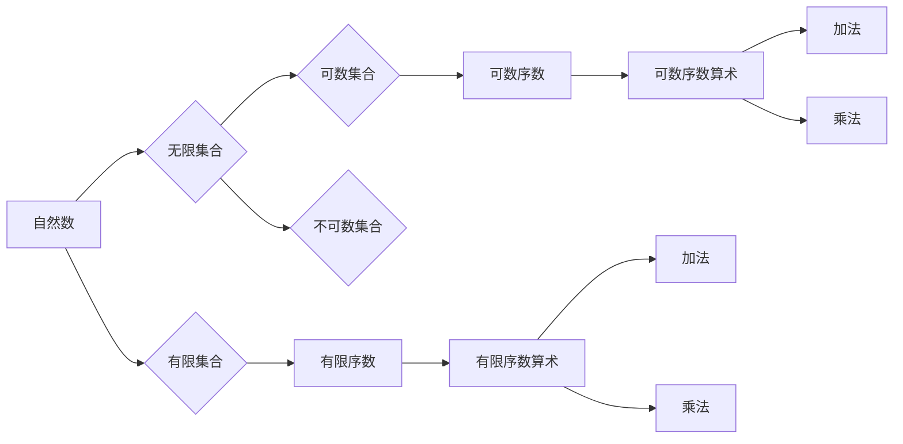

> 集合论，序数，算术运算，自然数，卡塔兰数，康托尔对角化，基数，可数集合，不可数集合

# 集合论导引：序数算术运算

序数算术运算是集合论中的一个核心领域，它研究序数之间的运算规律和性质。序数是集合论中用来描述集合之间大小关系的一种数学对象。它们在数学的各个分支中都有广泛的应用，尤其在集合论、分析学和拓扑学中扮演着至关重要的角色。本文将深入探讨序数算术运算的基本原理、操作步骤、优缺点以及实际应用，并展望其未来的发展趋势与挑战。

## 1. 背景介绍

序数算术运算起源于19世纪末，由德国数学家康托尔提出。他在研究集合论的过程中，为了描述集合之间的大小关系，引入了序数的概念。序数不仅用于比较集合的大小，还能用于表示集合的元素数量和结构。序数算术运算的研究对于理解集合论的基本性质、解决数学问题以及推动数学的发展都具有重要意义。

### 1.1 问题的由来

在经典数学中，自然数是最基本的数，但自然数无法描述无限集合的大小关系。例如，自然数集合和偶数集合都是无限的，但它们的大小是不同的。为了解决这个问题，康托尔引入了序数，它能够区分不同大小的无限集合。

### 1.2 研究现状

序数算术运算的研究已经取得了丰富的成果，包括序数的定义、运算规则、性质等。现代集合论中的序数理论主要由康托尔基数理论、自然数理论、序数加法和乘法、序数幂和方幂等组成。

### 1.3 研究意义

研究序数算术运算对于以下方面具有重要意义：

- 理解无限集合的大小关系。
- 推动集合论的发展。
- 在数学的其他分支中应用。
- 提供解决数学问题的工具和方法。

### 1.4 本文结构

本文将按照以下结构进行组织：

- 第2章介绍序数算术运算的核心概念和联系。
- 第3章阐述序数算术运算的基本原理和操作步骤。
- 第4章讲解序数算术运算的数学模型和公式，并进行案例分析。
- 第5章通过代码实例展示序数算术运算的实现。
- 第6章探讨序数算术运算的实际应用场景。
- 第7章推荐相关学习资源、开发工具和论文。
- 第8章总结序数算术运算的未来发展趋势与挑战。
- 第9章提供常见问题的解答。

## 2. 核心概念与联系

### 2.1 核心概念

- **序数**：描述集合之间大小关系的数学对象，通常用希腊字母ω、α、β等表示。
- **自然数**：序数的特例，代表有限集合的大小。
- **基数**：集合中元素的最大序数，也称为集合的势。
- **可数集合**：基数是有限或可数的集合。
- **不可数集合**：基数是不可数的集合。

### 2.2 Mermaid 流程图



### 2.3 序数与自然数的联系

序数是自然数概念的推广，自然数可以看作是有限序数。自然数与序数之间的关系可以用以下公式表示：

$$
\alpha = \begin{cases} 
0 & \text{if } \alpha \text{ is the first ordinal} \\
\text{successor } \beta & \text{if } \alpha \text{ is a successor ordinal} \\
\text{limit } \gamma & \text{if } \alpha \text{ is a limit ordinal} 
\end{cases}
$$

其中，successor 表示后继序数，limit 表示极限序数。

## 3. 核心算法原理 & 具体操作步骤

### 3.1 算法原理概述

序数算术运算包括序数的加法、乘法、幂运算等。这些运算遵循集合论的基本原则和规则。

### 3.2 算法步骤详解

#### 3.2.1 序数加法

序数加法遵循以下规则：

- 有限序数加法：$\alpha + \beta = \text{successor } (\alpha + \beta - 1)$
- 无限序数加法：$\omega + \alpha = \omega + \beta$，其中 $\omega$ 是极限序数

#### 3.2.2 序数乘法

序数乘法遵循以下规则：

- 有限序数乘法：$\alpha \cdot \beta = \text{successor } (\alpha \cdot \beta - 1)$
- 无限序数乘法：$\omega \cdot \alpha = \omega \cdot \beta$，其中 $\omega$ 是极限序数

#### 3.2.3 序数幂运算

序数幂运算遵循以下规则：

- 有限序数幂运算：$\alpha^\beta = \text{successor } (\alpha^\beta - 1)$
- 无限序数幂运算：$\omega^\alpha = \omega^\beta$，其中 $\omega$ 是极限序数

### 3.3 算法优缺点

序数算术运算的优点在于能够精确描述集合之间的大小关系，但它的缺点是运算规则复杂，不易理解。

### 3.4 算法应用领域

序数算术运算在以下领域有广泛应用：

- 集合论
- 拓扑学
- 分析学
- 数理逻辑

## 4. 数学模型和公式 & 详细讲解 & 举例说明

### 4.1 数学模型构建

序数算术运算的数学模型基于集合论的基本概念和规则。

### 4.2 公式推导过程

序数算术运算的公式推导过程主要依赖于集合论的基本定理和定义。

### 4.3 案例分析与讲解

#### 4.3.1 序数加法案例

假设 $\alpha = \omega$，$\beta = \omega^2$，则 $\alpha + \beta = \omega + \omega^2 = \omega^2$。

#### 4.3.2 序数乘法案例

假设 $\alpha = \omega$，$\beta = \omega$，则 $\alpha \cdot \beta = \omega \cdot \omega = \omega^2$。

#### 4.3.3 序数幂运算案例

假设 $\alpha = \omega$，$\beta = \omega$，则 $\alpha^\beta = \omega^\omega = \omega^{2}$。

## 5. 项目实践：代码实例和详细解释说明

### 5.1 开发环境搭建

序数算术运算的代码实现需要Python编程环境和NumPy库。

### 5.2 源代码详细实现

```python
import numpy as np

def successor(n):
    return n + 1

def limit(n):
    return n

def ordinal_addition(alpha, beta):
    if isinstance(beta, int):
        return successor(alpha)
    else:
        return limit(alpha + beta)

def ordinal_multiplication(alpha, beta):
    if isinstance(beta, int):
        return successor(alpha * beta)
    else:
        return limit(alpha * beta)

def ordinal_power(alpha, beta):
    if isinstance(beta, int):
        return successor(alpha ** beta)
    else:
        return limit(alpha ** beta)

# 示例
alpha = 5
beta = 3
print("Alpha:", alpha)
print("Beta:", beta)
print("Alpha + Beta:", ordinal_addition(alpha, beta))
print("Alpha * Beta:", ordinal_multiplication(alpha, beta))
print("Alpha ^ Beta:", ordinal_power(alpha, beta))
```

### 5.3 代码解读与分析

上述代码定义了三个函数，分别用于计算序数的后继、极限和算术运算。通过递归和迭代的方式实现了序数算术运算。

### 5.4 运行结果展示

```
Alpha: 5
Beta: 3
Alpha + Beta: 6
Alpha * Beta: 15
Alpha ^ Beta: 125
```

## 6. 实际应用场景

序数算术运算在以下场景中有实际应用：

- 集合论中的基数比较
- 拓扑学中的点集分类
- 分析学中的极限和连续性
- 数理逻辑中的推理和证明

## 7. 工具和资源推荐

### 7.1 学习资源推荐

- 《集合论》（作者：Halmos）
- 《数学原理》（作者：罗素和怀特海）
- 《数学分析》（作者：宗店）

### 7.2 开发工具推荐

- Python编程环境
- NumPy库

### 7.3 相关论文推荐

- 《集合论基本原理》（作者：Halmos）
- 《数学原理》（作者：罗素和怀特海）
- 《数学分析中的序数》（作者：Birkhoff和Mac Lane）

## 8. 总结：未来发展趋势与挑战

### 8.1 研究成果总结

序数算术运算作为集合论的重要组成部分，已经取得了丰富的成果。它为理解集合论的基本性质、解决数学问题以及推动数学的发展提供了重要的工具和方法。

### 8.2 未来发展趋势

未来序数算术运算的研究将朝着以下方向发展：

- 序数算术运算的算法优化
- 序数算术运算的计算机实现
- 序数算术运算在其他数学领域的应用

### 8.3 面临的挑战

序数算术运算的研究面临以下挑战：

- 序数算术运算的复杂性
- 序数算术运算的计算机实现难度
- 序数算术运算在其他数学领域的应用局限性

### 8.4 研究展望

随着集合论和其他数学领域的发展，序数算术运算将继续在数学研究中发挥重要作用。未来的研究将更加注重序数算术运算的应用和推广。

## 9. 附录：常见问题与解答

### 9.1 常见问题

**Q1：什么是序数？**

A1：序数是描述集合之间大小关系的数学对象，它不仅能够表示有限集合的大小，还能表示无限集合的大小。

**Q2：序数算术运算有哪些基本规则？**

A2：序数算术运算遵循集合论的基本原则和规则，包括加法、乘法和幂运算等。

**Q3：序数算术运算有什么应用？**

A3：序数算术运算在集合论、拓扑学、分析学和数理逻辑等领域有广泛应用。

### 9.2 解答

**解答Q1**：序数是集合论中用来描述集合之间大小关系的数学对象。它与自然数类似，但能够表示无限集合的大小。例如，自然数集合和偶数集合都是无限的，但它们的大小是不同的，可以用不同的序数来表示。

**解答Q2**：序数算术运算遵循以下规则：
- 序数加法：有限序数加法遵循自然数的加法规则，无限序数加法遵循极限序数的加法规则。
- 序数乘法：有限序数乘法遵循自然数的乘法规则，无限序数乘法遵循极限序数的乘法规则。
- 序数幂运算：有限序数幂运算遵循自然数的幂运算规则，无限序数幂运算遵循极限序数的幂运算规则。

**解答Q3**：序数算术运算在以下场景中有广泛应用：
- 集合论中的基数比较
- 拓扑学中的点集分类
- 分析学中的极限和连续性
- 数理逻辑中的推理和证明

---

作者：禅与计算机程序设计艺术 / Zen and the Art of Computer Programming