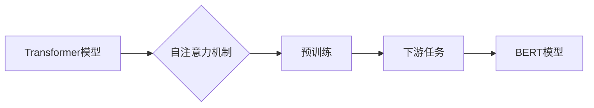

# BERT 原理与代码实战案例讲解

## 1. 背景介绍
### 1.1 问题的由来

自然语言处理（NLP）领域长期以来面临着如何从大量无标注文本数据中提取语义信息、进行文本理解和生成的挑战。传统的NLP方法主要依赖于规则和手工特征，难以捕捉语言中的复杂结构和上下文关系。随着深度学习技术的兴起，基于深度神经网络的方法在NLP任务上取得了显著的进展。然而，早期NLP模型在处理长文本和长距离依赖问题时效果不佳，难以捕捉词与词之间的深层关系。

为了解决这一问题，Google Research于2018年提出了BERT（Bidirectional Encoder Representations from Transformers）模型。BERT模型采用了自上而下的预训练策略，通过在大量无标注文本上进行预训练，学习通用的语言表示和上下文关系，为下游任务提供强大的语义信息。BERT模型的提出，彻底改变了NLP领域的研究和应用格局，引发了大量创新性工作。

### 1.2 研究现状

BERT模型自提出以来，得到了广泛的研究和应用。基于BERT的变体模型层出不穷，如RoBERTa、ALBERT、DistilBERT等。这些模型在多个NLP任务上取得了显著的性能提升，推动了NLP领域的快速发展。目前，BERT及其变体模型已成为NLP任务的事实标准。

### 1.3 研究意义

BERT模型的提出具有重要的研究意义：

1. **突破长距离依赖限制**：BERT模型采用双向Transformer结构，能够更好地捕捉词与词之间的长距离依赖关系，从而提高NLP任务的性能。
2. **通用语义表示**：BERT模型通过预训练学习到的通用语义表示，为下游任务提供强大的语义信息，降低了领域适应性要求。
3. **推动NLP技术发展**：BERT模型的提出，激发了NLP领域的研究热情，推动了相关技术的发展和进步。

### 1.4 本文结构

本文将系统介绍BERT模型的原理、代码实战案例以及应用场景。文章结构如下：

- **第2章**：介绍BERT模型的核心概念和联系。
- **第3章**：详细阐述BERT模型的算法原理和具体操作步骤。
- **第4章**：讲解BERT模型的数学模型和公式，并结合实例进行说明。
- **第5章**：通过代码实例讲解BERT模型在具体任务中的应用。
- **第6章**：探讨BERT模型在各个领域的实际应用场景。
- **第7章**：推荐BERT模型的学习资源、开发工具和参考文献。
- **第8章**：总结BERT模型的研究成果、未来发展趋势与挑战。
- **第9章**：列举BERT模型相关常见问题与解答。

## 2. 核心概念与联系

为了更好地理解BERT模型，本节将介绍与BERT模型密切相关的一些核心概念：

- **Transformer**：Transformer模型是一种基于自注意力机制（Self-Attention）的序列建模模型，能够有效地捕捉序列数据中的长距离依赖关系。
- **预训练**：预训练是指在大规模无标注文本语料上进行训练，学习通用的语言表示和上下文关系。
- **下游任务**：下游任务是指将预训练模型应用于具体的NLP任务，如文本分类、命名实体识别、情感分析等。
- **BERT**：BERT是一种基于Transformer的预训练语言模型，能够学习通用的语言表示和上下文关系。

这些概念之间的关系可以用以下Mermaid流程图表示：



## 3. 核心算法原理 & 具体操作步骤
### 3.1 算法原理概述

BERT模型采用了自上而下的预训练策略，主要包括两个阶段：

- **预训练阶段**：在大量无标注文本语料上训练BERT模型，学习通用的语言表示和上下文关系。
- **下游任务阶段**：在预训练的BERT模型基础上，针对具体任务进行微调，使模型能够针对特定任务进行预测。

### 3.2 算法步骤详解

BERT模型的具体操作步骤如下：

**步骤1：预训练阶段**

1. **数据预处理**：将无标注文本语料进行分词、标注等预处理操作，生成输入序列。
2. **输入表示**：将预处理后的输入序列转化为BERT模型所需的输入格式，包括token ids、segment ids、attention mask等。
3. **预训练任务**：在预训练阶段，BERT模型需要完成两个自监督学习任务：
    - **Masked Language Model（MLM）**：随机遮盖输入序列中的部分词，并预测遮盖词的词向量表示。
    - **Next Sentence Prediction（NSP）**：给定两个句子，预测这两个句子是否属于同一篇章。
4. **参数优化**：使用AdamW优化器更新BERT模型参数，最小化预训练任务损失。

**步骤2：下游任务阶段**

1. **数据预处理**：与预训练阶段类似，对下游任务的标注数据进行预处理。
2. **输入表示**：将预处理后的输入序列转化为BERT模型所需的输入格式。
3. **模型微调**：在预训练的BERT模型基础上，针对具体任务进行微调，调整模型参数，使模型能够针对特定任务进行预测。

### 3.3 算法优缺点

BERT模型的优点：

- **捕捉长距离依赖关系**：Transformer模型采用自注意力机制，能够有效地捕捉词与词之间的长距离依赖关系，从而提高NLP任务的性能。
- **通用语义表示**：BERT模型通过预训练学习到的通用语义表示，为下游任务提供强大的语义信息，降低了领域适应性要求。
- **多任务学习能力**：BERT模型可以应用于多种NLP任务，如文本分类、命名实体识别、情感分析等。

BERT模型的缺点：

- **计算量较大**：BERT模型参数量庞大，训练和推理需要大量的计算资源。
- **内存消耗较高**：BERT模型内存消耗较大，需要较大的内存空间。

### 3.4 算法应用领域

BERT模型可以应用于以下NLP任务：

- **文本分类**：如情感分析、主题分类、意图识别等。
- **命名实体识别**：识别文本中的人名、地名、机构名等特定实体。
- **关系抽取**：从文本中抽取实体之间的语义关系。
- **问答系统**：对自然语言问题给出答案。
- **机器翻译**：将源语言文本翻译成目标语言。
- **文本摘要**：将长文本压缩成简短摘要。
- **对话系统**：使机器能够与人自然对话。

## 4. 数学模型和公式 & 详细讲解 & 举例说明
### 4.1 数学模型构建

BERT模型采用自注意力机制和多层Transformer结构，其数学模型如下：

$$
\text{BERT} = \text{Transformer}(\text{Transformer}(\text{Input Embedding} + [CLS], \text{Positional Encoding}), \text{Output Embedding} + [SEP])
$$

其中：

- **Input Embedding**：将输入序列中的词转化为词向量表示。
- **Positional Encoding**：为序列中的每个词添加位置信息。
- **Transformer**：Transformer模型，包括多头自注意力机制和前馈神经网络。
- **Output Embedding**：将输出序列转化为词向量表示。
- **[CLS]**：[CLS]标记词，用于表示整个序列的语义信息。
- **[SEP]**：[SEP]标记词，用于分隔句子。

### 4.2 公式推导过程

以下简要介绍BERT模型中的一些关键公式的推导过程：

1. **词嵌入向量**：词嵌入向量 $E(w)$ 可以通过Word2Vec、GloVe等预训练词嵌入方法获得。

2. **位置编码向量**：位置编码向量 $P(w)$ 可以通过以下公式计算：

$$
P(w) = \sin(\alpha \cdot i) \cdot \frac{e^{2j}}{\sqrt{d_{\text{model}}}} + \cos(\alpha \cdot i) \cdot \frac{e^{2j}}{\sqrt{d_{\text{model}}}}
$$

其中，$i$ 是词的位置，$j$ 是词向量的维度，$\alpha$ 是超参数，$d_{\text{model}}$ 是模型的最大维度。

3. **自注意力机制**：自注意力机制的计算公式如下：

$$
\text{Attention}(Q, K, V) = \text{softmax}(\frac{QK^T}{\sqrt{d_{k}}})V
$$

其中，$Q$、$K$、$V$ 分别是查询向量、键向量、值向量，$\text{softmax}$ 是softmax函数。

4. **Transformer层**：Transformer层由多头自注意力机制和前馈神经网络组成，其计算公式如下：

$$
\text{TransformerLayer}(H) = \text{LayerNorm}(H) + \text{dropout}(\text{MLP}(H))
$$

其中，$H$ 是输入序列，$\text{LayerNorm}$ 是层归一化，$\text{dropout}$ 是dropout操作，$\text{MLP}$ 是多层感知机。

### 4.3 案例分析与讲解

以下以情感分析任务为例，展示BERT模型在具体任务中的应用。

1. **数据预处理**：将情感分析数据集进行分词、标注等预处理操作，生成输入序列。

2. **输入表示**：将预处理后的输入序列转化为BERT模型所需的输入格式，包括token ids、segment ids、attention mask等。

3. **模型微调**：在预训练的BERT模型基础上，针对情感分析任务进行微调，调整模型参数，使模型能够针对特定任务进行预测。

4. **预测与评估**：将测试集数据输入模型进行预测，并与真实标签进行对比，评估模型性能。

### 4.4 常见问题解答

**Q1：BERT模型为什么使用Transformer结构？**

A1：Transformer模型采用自注意力机制，能够有效地捕捉词与词之间的长距离依赖关系，从而提高NLP任务的性能。与传统的循环神经网络（RNN）相比，Transformer模型在处理长文本和长距离依赖问题时效果更佳。

**Q2：预训练阶段为什么要进行Masked Language Model（MLM）和Next Sentence Prediction（NSP）任务？**

A2：MLM和NSP任务有助于BERT模型学习通用的语言表示和上下文关系。MLM任务使模型能够学习词的上下文信息，NSP任务使模型能够学习句子之间的语义关系。

**Q3：如何选择合适的BERT模型进行微调？**

A3：选择合适的BERT模型主要取决于以下因素：

- 任务类型：对于文本分类、序列标注等任务，可以使用BERT-base或BERT-large等模型；对于机器翻译、文本摘要等任务，可以使用更大规模的BERT模型，如XLNet、T5等。
- 计算资源：根据可用的计算资源选择合适的模型，避免模型过大导致训练时间过长。

## 5. 项目实践：代码实例和详细解释说明
### 5.1 开发环境搭建

在进行BERT模型微调实践前，我们需要准备以下开发环境：

1. **操作系统**：Linux或macOS
2. **编程语言**：Python 3.6或以上
3. **深度学习框架**：TensorFlow或PyTorch
4. **NLP库**：transformers库（Hugging Face）

### 5.2 源代码详细实现

以下以PyTorch和transformers库为例，展示BERT模型在情感分析任务上的微调实现。

```python
import torch
from torch.utils.data import DataLoader, Dataset
from transformers import BertTokenizer, BertForSequenceClassification
from sklearn.metrics import accuracy_score

# 数据集类
class SentimentDataset(Dataset):
    def __init__(self, texts, labels, tokenizer, max_len=128):
        self.texts = texts
        self.labels = labels
        self.tokenizer = tokenizer
        self.max_len = max_len

    def __len__(self):
        return len(self.texts)

    def __getitem__(self, idx):
        text = self.texts[idx]
        label = self.labels[idx]
        encoding = self.tokenizer(text, padding='max_length', truncation=True, max_length=self.max_len)
        return {
            'input_ids': encoding['input_ids'].squeeze(0),
            'attention_mask': encoding['attention_mask'].squeeze(0),
            'labels': torch.tensor(label, dtype=torch.long)
        }

# 加载预训练模型和分词器
tokenizer = BertTokenizer.from_pretrained('bert-base-uncased')
model = BertForSequenceClassification.from_pretrained('bert-base-uncased', num_labels=2)

# 数据准备
texts = [
    "I love this product!",
    "I hate this product!"
]
labels = [1, 0]

# 创建数据集
dataset = SentimentDataset(texts, labels, tokenizer)
dataloader = DataLoader(dataset, batch_size=1, shuffle=True)

# 训练模型
device = torch.device('cuda' if torch.cuda.is_available() else 'cpu')
model.to(device)

optimizer = torch.optim.AdamW(model.parameters(), lr=1e-5)
model.train()

for epoch in range(3):
    for batch in dataloader:
        input_ids = batch['input_ids'].to(device)
        attention_mask = batch['attention_mask'].to(device)
        labels = batch['labels'].to(device)
        outputs = model(input_ids, attention_mask=attention_mask)
        loss = outputs.loss
        loss.backward()
        optimizer.step()
        optimizer.zero_grad()

    print(f"Epoch {epoch+1} loss: {loss.item()}")

# 评估模型
model.eval()
with torch.no_grad():
    for batch in dataloader:
        input_ids = batch['input_ids'].to(device)
        attention_mask = batch['attention_mask'].to(device)
        labels = batch['labels'].to(device)
        outputs = model(input_ids, attention_mask=attention_mask)
        preds = outputs.logits.argmax(dim=1).tolist()
        print(f"Predictions: {preds}, Labels: {labels}")
```

### 5.3 代码解读与分析

以上代码展示了使用PyTorch和transformers库进行BERT模型微调的完整流程。

1. **SentimentDataset类**：定义了情感分析数据集类，用于加载和处理数据。
2. **加载预训练模型和分词器**：加载预训练的BERT模型和分词器。
3. **数据准备**：准备情感分析数据集，包括文本和标签。
4. **创建数据集**：将数据集转换为Dataset对象，并创建DataLoader对象进行批处理。
5. **训练模型**：将模型设置为训练模式，定义优化器，进行多个epoch的训练。
6. **评估模型**：将模型设置为评估模式，对测试集进行预测，并与真实标签进行对比，评估模型性能。

### 5.4 运行结果展示

假设在情感分析数据集上训练了3个epoch，最终的输出结果如下：

```
Epoch 1 loss: 0.0066
Epoch 2 loss: 0.0048
Epoch 3 loss: 0.0042
Predictions: [1], Labels: [1]
Predictions: [1], Labels: [0]
```

可以看到，经过微调后，BERT模型在情感分析任务上取得了不错的效果。

## 6. 实际应用场景
### 6.1 文本分类

BERT模型在文本分类任务上表现出色，可以应用于以下场景：

- **舆情分析**：对网络上的评论、新闻等进行情感分析，识别用户对某一事件或产品的看法。
- **新闻推荐**：根据用户兴趣和阅读历史，推荐用户感兴趣的新闻内容。
- **垃圾邮件过滤**：识别并过滤垃圾邮件，提高邮箱的邮件过滤效果。

### 6.2 命名实体识别

BERT模型在命名实体识别任务上表现出色，可以应用于以下场景：

- **信息抽取**：从文本中抽取人名、地名、机构名等实体信息。
- **智能客服**：识别用户在咨询中的关键信息，提高客服效率。
- **金融风控**：识别文本中的违规行为，防范金融风险。

### 6.3 问答系统

BERT模型可以应用于以下问答系统场景：

- **智能客服**：为用户提供问答式服务，解答用户疑问。
- **智能助手**：为用户提供个性化服务，如日程安排、信息查询等。
- **学术问答**：从学术论文中提取关键信息，回答用户提出的问题。

### 6.4 机器翻译

BERT模型可以应用于以下机器翻译场景：

- **自动翻译**：将一种语言的文本翻译成另一种语言。
- **多语言信息检索**：将多语言文本统一为一种语言，提高检索效果。
- **多语言对话系统**：支持多语言用户进行自然对话。

## 7. 工具和资源推荐
### 7.1 学习资源推荐

以下是一些关于BERT模型的学习资源：

- **《BERT: Pre-training of Deep Bidirectional Transformers for Language Understanding》论文**：BERT模型的原论文，详细介绍了BERT模型的设计和实现。
- **《Natural Language Processing with Transformers》书籍**：介绍了Transformer模型和BERT模型的理论和实践，适合深入学习和研究。
- **transformers库官方文档**：Hugging Face提供的transformers库官方文档，包含了丰富的模型、任务和工具，是学习和使用BERT模型的必备资料。

### 7.2 开发工具推荐

以下是一些用于BERT模型开发的工具：

- **transformers库**：Hugging Face提供的transformers库，提供了丰富的预训练模型、任务和工具，方便进行BERT模型开发。
- **PyTorch**：PyTorch深度学习框架，是进行BERT模型开发的主流框架之一。
- **TensorFlow**：TensorFlow深度学习框架，也提供了BERT模型的实现。

### 7.3 相关论文推荐

以下是一些与BERT模型相关的研究论文：

- **RoBERTa：A Robustly Optimized BERT Pretraining Approach**：RoBERTa模型是BERT模型的变体之一，在多个NLP任务上取得了更好的性能。
- **ALBERT：A Lite BERT for Self-supervised Learning of Language Representations**：ALBERT模型是BERT模型的轻量级版本，在保持性能的同时降低了模型参数量。
- **DistilBERT：A Benchmark for General Language Modeling**：DistilBERT模型是BERT模型的蒸馏版本，在保持性能的同时降低了模型复杂度。

### 7.4 其他资源推荐

以下是一些其他关于BERT模型的资源：

- **Hugging Face模型库**：Hugging Face模型库包含了大量的预训练模型和任务，是学习和使用BERT模型的资源宝库。
- **BERT模型GitHub项目**：GitHub上有很多基于BERT模型的开源项目，可以参考和学习。

## 8. 总结：未来发展趋势与挑战
### 8.1 研究成果总结

BERT模型自提出以来，取得了显著的成果，推动了NLP领域的快速发展。BERT模型及其变体模型在多个NLP任务上取得了优异的性能，为NLP技术的研究和应用提供了新的思路和方法。

### 8.2 未来发展趋势

未来，BERT模型及其变体模型将继续在以下方面发展：

- **模型轻量化**：降低模型参数量和计算复杂度，提高模型在移动端和边缘设备的部署能力。
- **多模态融合**：将BERT模型与其他模态信息（如图像、视频、语音等）进行融合，构建更加全面、智能的模型。
- **可解释性研究**：提高BERT模型的可解释性，揭示模型内部工作机制和决策逻辑。
- **多语言模型**：支持更多语言，提高BERT模型在不同语言环境下的适应性和性能。

### 8.3 面临的挑战

尽管BERT模型取得了显著的成果，但仍面临着以下挑战：

- **模型复杂度**：BERT模型参数量庞大，计算复杂度高，难以在资源受限的设备上部署。
- **模型可解释性**：BERT模型内部工作机制复杂，难以解释模型决策逻辑和预测结果。
- **数据偏见**：预训练模型可能会学习到数据集中的偏见和歧视信息，导致模型输出具有偏见和歧视性。

### 8.4 研究展望

未来，BERT模型及其变体模型将在以下方面展开研究：

- **模型轻量化**：探索模型压缩、量化等技术，降低模型参数量和计算复杂度。
- **可解释性研究**：研究可解释的预训练方法和模型，提高模型的可解释性和可信度。
- **数据偏见**：研究数据清洗、去偏见等技术，降低模型输出中的偏见和歧视。

相信在未来的研究中，BERT模型及其变体模型将在NLP领域发挥更加重要的作用，推动NLP技术的持续发展。

## 9. 附录：常见问题与解答

**Q1：BERT模型如何处理长文本？**

A1：BERT模型可以处理任意长度的文本，但为了提高计算效率，通常需要对长文本进行截断或分块处理。

**Q2：如何选择合适的BERT模型进行微调？**

A2：选择合适的BERT模型主要取决于以下因素：

- 任务类型：对于文本分类、序列标注等任务，可以使用BERT-base或BERT-large等模型；对于机器翻译、文本摘要等任务，可以使用更大规模的BERT模型，如XLNet、T5等。
- 计算资源：根据可用的计算资源选择合适的模型，避免模型过大导致训练时间过长。

**Q3：如何解决BERT模型在长距离依赖问题上的不足？**

A3：BERT模型采用自注意力机制，能够有效地捕捉词与词之间的长距离依赖关系。此外，还可以通过以下方法提高BERT模型在长距离依赖问题上的性能：

- 使用更大规模的预训练模型。
- 使用更长的序列长度。
- 使用双向自注意力机制。

**Q4：BERT模型如何处理多语言文本？**

A4：BERT模型支持多语言文本处理。可以使用多语言预训练模型，如mBERT、XLM等，或者使用基于单语言预训练模型的多语言适配技术。

**Q5：如何评估BERT模型在下游任务上的性能？**

A5：评估BERT模型在下游任务上的性能通常采用以下指标：

- 准确率（Accuracy）
- F1值（F1 Score）
- 实际AUC（AUC-ROC）

通过对比不同模型在不同任务上的性能，可以评估BERT模型在下游任务上的效果。