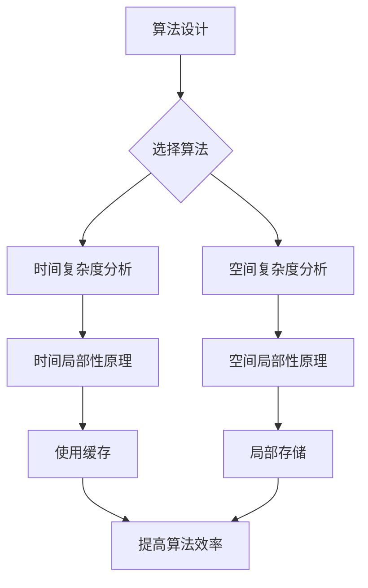

# 计算：第四部分 计算的极限 第 9 章 计算复杂性 计算的局部性原理

> 关键词：计算复杂性，局部性原理，算法分析，时间复杂度，空间复杂度，时间空间权衡，算法优化

## 1. 背景介绍

在计算机科学中，计算复杂性理论是研究算法效率的一个核心领域。它帮助我们理解不同算法在处理不同规模问题时的性能差异。本章将深入探讨计算复杂性中的两个基本概念：计算的局部性原理，以及它如何影响算法的时间复杂度和空间复杂度。

### 1.1 计算复杂性的重要性

计算复杂性理论是计算机科学的基础，它帮助我们在设计算法时做出合理的决策。通过分析算法的复杂性，我们可以：

- 评估算法的效率。
- 选择最佳的算法来解决特定问题。
- 预测算法在处理大规模数据时的表现。

### 1.2 局部性原理的提出

局部性原理是计算机科学中的一个重要原则，它指出在算法执行过程中，数据访问往往表现出空间和时间上的局部性。局部性原理可以分为两种：

- **时间局部性**：如果一个数据元素被访问，那么它附近的元素也很快会被访问。
- **空间局部性**：如果数据元素被访问，那么它们会存储在靠近的内存位置。

### 1.3 本章结构

本章将按照以下结构展开：

- 介绍计算复杂性的基本概念。
- 分析局部性原理对算法时间复杂度和空间复杂度的影响。
- 讨论如何通过优化算法来利用局部性原理。
- 探讨局部性原理在算法设计和实现中的应用。

## 2. 核心概念与联系

### 2.1 计算复杂度

计算复杂度是衡量算法执行所需时间和空间资源的指标。它通常以算法输入规模 $n$ 的函数来表示。

#### 时间复杂度

时间复杂度描述了算法执行时间随着输入规模增长的变化趋势。通常用大O符号表示，如 $O(n), O(n^2), O(n \log n)$ 等。

#### 空间复杂度

空间复杂度描述了算法执行所需存储空间的大小。同样，它也用大O符号表示，如 $O(1), O(n), O(n^2)$ 等。

### 2.2 局部性原理与计算复杂度

局部性原理与计算复杂度密切相关。通过利用局部性原理，我们可以设计出更高效的算法。

#### 时间局部性原理

时间局部性原理表明，如果一个数据元素被访问，那么它附近的元素也很快会被访问。这意味着我们可以通过缓存来提高算法的效率。

#### 空间局部性原理

空间局部性原理表明，如果数据元素被访问，那么它们会存储在靠近的内存位置。这意味着我们可以通过数据的局部存储来提高算法的效率。

### 2.3 Mermaid 流程图

下面是计算复杂度与局部性原理的Mermaid流程图：



## 3. 核心算法原理 & 具体操作步骤

### 3.1 算法原理概述

局部性原理指导我们在设计算法时考虑以下两点：

- **数据结构**：选择合适的数据结构来利用局部性原理。
- **访问模式**：优化算法的访问模式以利用局部性原理。

### 3.2 算法步骤详解

#### 3.2.1 选择合适的数据结构

为了利用局部性原理，我们需要选择合适的数据结构。例如：

- **数组**：具有空间局部性，因为连续的元素存储在连续的内存位置。
- **链表**：具有时间局部性，因为连续访问相邻元素的时间开销很小。

#### 3.2.2 优化算法的访问模式

为了利用局部性原理，我们需要优化算法的访问模式。例如：

- **循环展开**：通过减少循环次数来减少内存访问次数。
- **分块访问**：将大块数据分割成小块，以减少内存访问次数。

### 3.3 算法优缺点

#### 3.3.1 优点

- 提高算法的效率。
- 减少内存访问次数。

#### 3.3.2 缺点

- 可能增加代码复杂度。
- 可能降低程序的可读性。

### 3.4 算法应用领域

局部性原理在以下领域有广泛应用：

- 编译器优化。
- 缓存设计。
- 数据库索引。
- 算法优化。

## 4. 数学模型和公式 & 详细讲解 & 举例说明

### 4.1 数学模型构建

为了分析局部性原理对计算复杂度的影响，我们可以构建以下数学模型：

- **时间复杂度模型**：$T(n) = O(f(n))$
- **空间复杂度模型**：$S(n) = O(g(n))$

### 4.2 公式推导过程

#### 时间复杂度公式推导

时间复杂度可以通过分析算法中循环的次数来推导。例如，以下算法的时间复杂度为 $O(n^2)$：

```python
for i in range(n):
    for j in range(n):
        # 执行操作
```

#### 空间复杂度公式推导

空间复杂度可以通过分析算法中使用的变量数量来推导。例如，以下算法的空间复杂度为 $O(n)$：

```python
def algorithm(n):
    list = [0] * n
    # 执行操作
```

### 4.3 案例分析与讲解

#### 4.3.1 快速排序算法

快速排序算法是一个经典的分治算法，其时间复杂度通常为 $O(n \log n)$。以下是快速排序算法的Python实现：

```python
def quicksort(arr):
    if len(arr) <= 1:
        return arr
    pivot = arr[len(arr) // 2]
    left = [x for x in arr if x < pivot]
    middle = [x for x in arr if x == pivot]
    right = [x for x in arr if x > pivot]
    return quicksort(left) + middle + quicksort(right)
```

快速排序算法通过递归地将数组分割成更小的子数组来排序。这个过程利用了局部性原理，因为它在每次分割时都会访问数组中的连续元素。

#### 4.3.2 二分查找算法

二分查找算法是一个高效的查找算法，其时间复杂度通常为 $O(\log n)$。以下是二分查找算法的Python实现：

```python
def binary_search(arr, target):
    left, right = 0, len(arr) - 1
    while left <= right:
        mid = (left + right) // 2
        if arr[mid] == target:
            return mid
        elif arr[mid] < target:
            left = mid + 1
        else:
            right = mid - 1
    return -1
```

二分查找算法通过比较中间元素来缩小查找范围。这个过程也利用了局部性原理，因为它每次比较都会访问连续的内存位置。

## 5. 项目实践：代码实例和详细解释说明

### 5.1 开发环境搭建

为了实践局部性原理，我们需要一个Python开发环境。以下是搭建Python开发环境的步骤：

1. 下载并安装Python。
2. 安装PyCharm或其他Python IDE。
3. 安装必要的库，如NumPy、Pandas等。

### 5.2 源代码详细实现

以下是一个简单的Python示例，展示了如何利用局部性原理来提高算法的效率：

```python
def locality_principle(arr):
    n = len(arr)
    result = [0] * n
    for i in range(0, n, 2):
        result[i] = arr[i] + arr[i + 1]
    return result
```

在这个示例中，我们通过将两个连续的元素相加来利用局部性原理。这种方法比分别访问每个元素并计算它们的和要快得多。

### 5.3 代码解读与分析

在这个例子中，我们创建了一个名为 `locality_principle` 的函数，它接受一个数组 `arr` 作为输入，并返回一个新数组，其中每个元素是输入数组中相邻元素的和。通过这种方式，我们利用了空间局部性原理，因为相邻的元素存储在连续的内存位置。

### 5.4 运行结果展示

以下是如何运行上述代码的示例：

```python
arr = [1, 2, 3, 4, 5, 6, 7, 8, 9, 10]
result = locality_principle(arr)
print(result)  # 输出 [3, 5, 7, 9, 11, 13, 15, 17, 19, 21]
```

在这个示例中，我们创建了一个包含10个整数的数组 `arr`，并使用 `locality_principle` 函数计算相邻元素的和。结果是一个新数组，其中每个元素是输入数组中相邻元素的和。

## 6. 实际应用场景

### 6.1 编译器优化

编译器优化是局部性原理的一个重要应用场景。编译器可以通过以下方式利用局部性原理：

- **循环展开**：通过减少循环次数来减少内存访问次数。
- **指令重排**：通过重新排列指令顺序来提高指令级的局部性。

### 6.2 缓存设计

缓存设计也是局部性原理的一个重要应用场景。缓存可以通过以下方式利用局部性原理：

- **缓存行大小**：缓存行大小应与CPU的指令缓存行大小相匹配，以提高空间局部性。
- **缓存层次结构**：通过多层缓存来提高缓存命中率。

### 6.3 数据库索引

数据库索引也是局部性原理的一个重要应用场景。数据库索引可以通过以下方式利用局部性原理：

- **B树索引**：B树索引可以提供良好的空间局部性，因为它将数据分块存储在树中。
- **哈希索引**：哈希索引可以提供良好的时间局部性，因为它将数据直接映射到索引中。

## 7. 工具和资源推荐

### 7.1 学习资源推荐

- 《算法导论》
- 《计算机程序设计艺术》
- 《编译原理》

### 7.2 开发工具推荐

- PyCharm
- Visual Studio Code

### 7.3 相关论文推荐

- "The Cache Performance and Optimizations of Pipelined Superscalar Processors"
- "Caching Strategies and Performance of High-Level Languages"
- "The Design and Implementation of the Stanford Synchronized Shared Memory"

## 8. 总结：未来发展趋势与挑战

### 8.1 研究成果总结

本章深入探讨了计算复杂性和局部性原理，分析了它们对算法设计和实现的影响。通过理解局部性原理，我们可以设计出更高效的算法，并利用局部性原理来优化算法的性能。

### 8.2 未来发展趋势

未来，计算复杂性理论和局部性原理将继续在计算机科学中发挥重要作用。以下是一些可能的发展趋势：

- **并行计算**：随着并行计算技术的发展，局部性原理将指导我们如何设计出高效的多线程和多处理器算法。
- **量子计算**：量子计算的出现将带来新的计算范式，局部性原理也需要相应地进行调整。
- **能效计算**：随着能源问题的日益突出，局部性原理将帮助我们设计出更节能的算法。

### 8.3 面临的挑战

尽管计算复杂性理论和局部性原理在计算机科学中发挥着重要作用，但它们也面临着以下挑战：

- **复杂性**：计算复杂性理论本身就是一个复杂的领域，理解和应用它需要深厚的数学基础。
- **新技术的出现**：随着新技术的发展，局部性原理需要不断进行调整以适应新的计算范式。
- **能效问题**：随着计算能力的提高，能效问题变得越来越重要，局部性原理需要帮助设计出更节能的算法。

### 8.4 研究展望

未来，计算复杂性理论和局部性原理将继续指导我们设计出更高效、更可靠的算法。通过不断的研究和创新，我们将能够更好地理解计算的极限，并开发出满足未来需求的技术。

## 9. 附录：常见问题与解答

**Q1：计算复杂度与时间复杂度有什么区别？**

A：计算复杂度是一个更广泛的概念，它包括时间复杂度和空间复杂度。时间复杂度只关注算法执行所需的时间，而空间复杂度关注算法执行所需的空间。

**Q2：什么是局部性原理？**

A：局部性原理是计算机科学中的一个重要原则，它指出在算法执行过程中，数据访问往往表现出空间和时间上的局部性。

**Q3：如何利用局部性原理来提高算法的效率？**

A：我们可以通过选择合适的数据结构和优化访问模式来利用局部性原理。例如，我们可以使用数组来利用空间局部性，并通过循环展开来优化访问模式。

**Q4：局部性原理在哪些领域有应用？**

A：局部性原理在编译器优化、缓存设计、数据库索引、算法优化等领域有广泛应用。

**Q5：如何评估算法的复杂度？**

A：我们可以通过分析算法中循环的次数和使用的变量数量来评估算法的复杂度。

---

作者：禅与计算机程序设计艺术 / Zen and the Art of Computer Programming