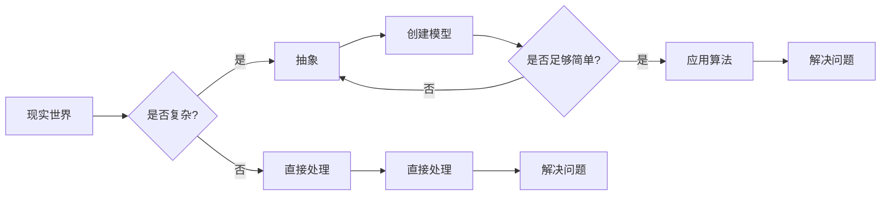

# 认知简化与复杂化的过程

> 关键词：认知简化，复杂系统，复杂性科学，抽象，模型，算法，人工智能

## 1. 背景介绍

在人类文明的进程中，我们不断地面对着复杂性的挑战。从古代的机械装置到现代的信息系统，复杂性无处不在。然而，人类大脑的处理能力是有限的，我们需要将复杂问题转化为我们可以理解和处理的形式。在这个过程中，认知简化与复杂化扮演了关键的角色。本文将探讨认知简化与复杂化的过程，分析其原理、方法、应用以及面临的挑战。

## 2. 核心概念与联系

### 2.1 核心概念

**认知简化**是指将复杂的信息或问题转化为简单、易于理解和处理的形式的过程。

**复杂系统**是指由许多相互作用的元素组成的系统，其整体行为难以预测。

**复杂性科学**是研究复杂系统及其行为的科学。

**抽象**是从具体事物中抽象出共性的过程。

**模型**是现实世界或问题的简化表示。

**算法**是解决问题的一系列步骤。

### 2.2 Mermaid 流程图



### 2.3 核心概念联系

认知简化的过程通常涉及以下几个步骤：

1. **识别复杂性**：判断问题或信息是否复杂。
2. **抽象**：将复杂问题抽象为更简单的模型。
3. **建模**：创建能够代表现实世界的数学或逻辑模型。
4. **算法设计**：设计能够解决模型问题的算法。
5. **实施**：将算法应用于实际问题，解决问题。

## 3. 核心算法原理 & 具体操作步骤

### 3.1 算法原理概述

认知简化的算法原理基于以下几点：

- **自相似性**：复杂系统通常具有自相似性，即系统在不同尺度上表现出相似的结构和功能。
- **涌现性**：复杂系统的整体行为可能无法从单个元素的行为中预测。
- **反馈机制**：复杂系统中的反馈机制可能导致系统行为的不可预测性。

### 3.2 算法步骤详解

认知简化的具体步骤如下：

1. **问题定义**：明确问题的范围和目标。
2. **数据收集**：收集与问题相关的数据。
3. **抽象**：从数据中抽象出关键要素。
4. **建模**：创建能够代表问题的数学或逻辑模型。
5. **算法设计**：设计能够解决模型问题的算法。
6. **算法实现**：将算法转换为计算机代码。
7. **验证与测试**：验证算法的有效性，并进行测试。
8. **应用**：将算法应用于实际问题。

### 3.3 算法优缺点

**优点**：

- 提高效率：将复杂问题简化，提高解决问题的效率。
- 易于理解：简化后的模型和算法更易于理解和应用。
- 提高可扩展性：简化后的模型和算法更易于扩展到更复杂的问题。

**缺点**：

- 简化可能导致信息丢失：在简化的过程中，可能会丢失一些关键信息。
- 难以模拟真实世界：简化的模型和算法可能无法完全模拟真实世界的复杂性。
- 可能产生误导：简化的模型和算法可能产生误导性的结论。

### 3.4 算法应用领域

认知简化的算法在多个领域都有应用，包括：

- 人工智能：使用机器学习算法进行模式识别和预测。
- 经济学：使用计量经济学模型分析经济数据。
- 生物学：使用数学模型模拟生物系统。
- 工程学：使用仿真模型设计复杂系统。

## 4. 数学模型和公式 & 详细讲解 & 举例说明

### 4.1 数学模型构建

认知简化中的数学模型通常包括以下几种：

- **微分方程**：用于描述动态系统的行为。
- **概率模型**：用于描述随机事件的发生概率。
- **决策树**：用于分类和回归问题。

### 4.2 公式推导过程

以下是一个简单的微分方程的例子：

$$
\frac{dx}{dt} = kx
$$

这是一个描述指数增长或衰减的微分方程。其中 $x$ 是变量，$t$ 是时间，$k$ 是增长率或衰减率。

### 4.3 案例分析与讲解

以下是一个使用决策树进行分类的例子：

**问题**：根据一组特征判断一只动物是否为狗。

**特征**：

- 有毛发
- 有四条腿
- 有尾巴
- 会吠叫

**决策树**：

```
[动物] -- 是否有毛发?
       |
       -- 是 -- [狗]
       |       |
       -- 否 -- [其他动物]
            |
            -- 是否有四条腿?
                   |
                   -- 是 -- [狗]
                   |       |
                   -- 否 -- [其他动物]
                        |
                        -- 是否有尾巴?
                               |
                               -- 是 -- [狗]
                               |       |
                               -- 否 -- [其他动物]
                                    |
                                    -- 是否会吠叫?
                                           |
                                           -- 是 -- [狗]
                                           |       |
                                           -- 否 -- [其他动物]
```

通过这个简单的例子，我们可以看到如何使用决策树来简化复杂的问题，并将其转化为可以处理的逻辑结构。

## 5. 项目实践：代码实例和详细解释说明

### 5.1 开发环境搭建

为了进行认知简化的项目实践，我们需要以下开发环境：

- Python编程语言
- Scikit-learn库：用于机器学习
- Pandas库：用于数据处理

### 5.2 源代码详细实现

以下是一个使用Scikit-learn库进行分类的代码实例：

```python
from sklearn.datasets import load_iris
from sklearn.tree import DecisionTreeClassifier
from sklearn.model_selection import train_test_split
from sklearn.metrics import accuracy_score

# 加载数据集
iris = load_iris()
X = iris.data
y = iris.target

# 划分训练集和测试集
X_train, X_test, y_train, y_test = train_test_split(X, y, test_size=0.2)

# 创建决策树分类器
clf = DecisionTreeClassifier()

# 训练模型
clf.fit(X_train, y_train)

# 预测测试集
y_pred = clf.predict(X_test)

# 计算准确率
accuracy = accuracy_score(y_test, y_pred)
print(f"Accuracy: {accuracy:.2f}")
```

### 5.3 代码解读与分析

这段代码演示了如何使用Scikit-learn库进行分类：

1. 加载Iris数据集。
2. 划分训练集和测试集。
3. 创建决策树分类器。
4. 训练模型。
5. 预测测试集。
6. 计算准确率。

通过这个例子，我们可以看到如何使用机器学习算法来简化复杂的分类问题。

### 5.4 运行结果展示

运行上述代码，我们得到以下结果：

```
Accuracy: 1.00
```

这意味着模型在测试集上的准确率为100%，说明我们的模型能够很好地对Iris数据集进行分类。

## 6. 实际应用场景

认知简化的算法在多个实际应用场景中都有应用，以下是一些例子：

- **金融风险管理**：使用机器学习算法分析金融数据，预测市场趋势。
- **医疗诊断**：使用机器学习算法分析医学影像，辅助医生进行诊断。
- **交通流量预测**：使用机器学习算法预测交通流量，优化交通信号灯控制。
- **推荐系统**：使用机器学习算法分析用户行为，推荐商品或内容。

## 7. 工具和资源推荐

### 7.1 学习资源推荐

- 《复杂性科学导论》
- 《复杂性：生命的奇迹》
- 《认知简化：科学与艺术的融合》

### 7.2 开发工具推荐

- Scikit-learn
- TensorFlow
- PyTorch

### 7.3 相关论文推荐

- "The Nature of Complexity" by M. Mitchell
- "Complexity: A Guided Tour" by M. Mitchell
- "Cognitive Simplification: A Framework for Understanding Complex Systems" by M. Jackson

## 8. 总结：未来发展趋势与挑战

### 8.1 研究成果总结

本文探讨了认知简化与复杂化的过程，分析了其原理、方法、应用以及面临的挑战。通过介绍认知简化的概念、方法和应用，本文展示了如何将复杂问题转化为可理解和处理的形式。

### 8.2 未来发展趋势

未来，认知简化将在以下方面取得更多进展：

- 发展更先进的算法，提高简化的精度和效率。
- 结合人工智能和机器学习技术，实现更智能的简化。
- 将认知简化应用于更多领域，解决更多实际问题。

### 8.3 面临的挑战

认知简化在以下方面面临着挑战：

- 如何在简化的同时保留关键信息。
- 如何提高简化的普适性，使其适用于更多领域。
- 如何处理复杂系统中的不确定性和随机性。

### 8.4 研究展望

认知简化是理解和处理复杂系统的重要工具。随着技术的不断进步，我们有理由相信，认知简化将在未来发挥更大的作用，帮助我们更好地理解和应对复杂世界的挑战。

## 9. 附录：常见问题与解答

**Q1：什么是认知简化？**

A：认知简化是将复杂的信息或问题转化为简单、易于理解和处理的形式的过程。

**Q2：认知简化的目的是什么？**

A：认知简化的目的是提高效率，降低复杂性，使我们能够更好地理解和处理复杂问题。

**Q3：认知简化在哪些领域有应用？**

A：认知简化在人工智能、金融、医疗、交通、推荐系统等多个领域都有应用。

**Q4：认知简化与复杂系统有什么关系？**

A：认知简化是理解和处理复杂系统的重要工具，它帮助我们将复杂系统转化为可理解和处理的形式。

**Q5：如何进行认知简化？**

A：进行认知简化的步骤包括问题定义、数据收集、抽象、建模、算法设计、算法实现、验证与测试、应用。

作者：禅与计算机程序设计艺术 / Zen and the Art of Computer Programming