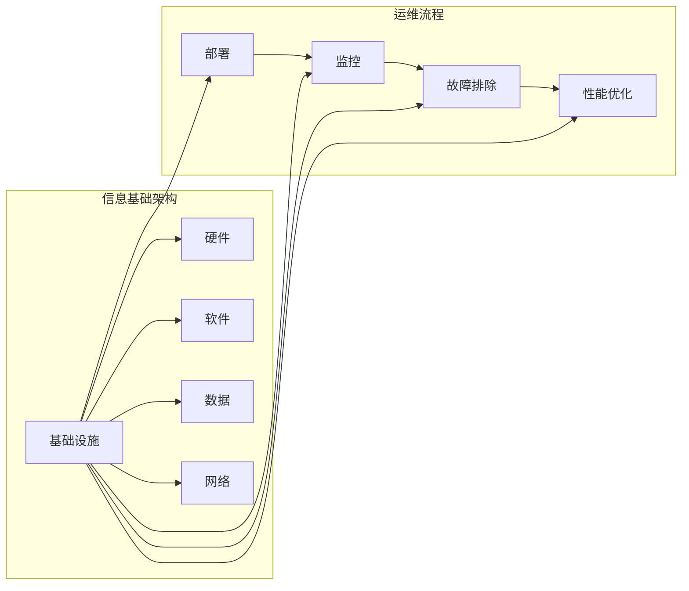

# 评估、优化、修订信息基础架构和运维流程

> 关键词：信息基础架构，运维流程，DevOps，自动化，性能优化，风险评估，持续集成/持续部署，监控

## 1. 背景介绍

在当今快速发展的IT行业中，信息基础架构和运维流程的效率和质量对于企业的竞争力至关重要。随着云计算、大数据、人工智能等技术的发展，企业对信息系统的依赖日益加深，对基础架构和运维流程的要求也越来越高。本文将深入探讨如何评估、优化和修订信息基础架构和运维流程，以提高IT系统的可靠性、性能和安全性。

### 1.1 问题的由来

信息技术的发展带来了以下挑战：

- **复杂性增加**：现代IT系统日益复杂，涉及多个技术栈和组件，传统的人工运维方式难以满足需求。
- **响应速度要求高**：业务需求的快速变化要求IT系统能够快速响应，传统流程往往效率低下。
- **成本控制**：随着IT基础设施规模的扩大，成本控制成为企业关注的重点。
- **安全性挑战**：网络安全威胁日益严峻，要求运维流程能够及时发现和应对安全事件。

### 1.2 研究现状

为了应对上述挑战，企业纷纷寻求改进信息基础架构和运维流程的方法。以下是当前的研究现状：

- **DevOps文化**：DevOps文化的兴起，强调开发、运维和业务团队的紧密合作，以及自动化和持续集成/持续部署（CI/CD）的实践。
- **自动化工具**：自动化工具的发展，如Ansible、Terraform、Chef等，能够简化基础设施的部署和管理。
- **监控和性能分析**：利用工具如Prometheus、Grafana等进行系统监控和性能分析，及时发现并解决问题。
- **风险评估和管理**：采用风险评估方法，如风险矩阵和SWOT分析，来识别和管理潜在风险。

### 1.3 研究意义

评估、优化和修订信息基础架构和运维流程的意义在于：

- 提高IT系统的可用性和可靠性。
- 降低运维成本，提高资源利用率。
- 增强对安全威胁的抵御能力。
- 提升IT团队能力，加快响应业务需求的速度。

### 1.4 本文结构

本文将分为以下几个部分：

- 介绍信息基础架构和运维流程的核心概念。
- 分析评估、优化和修订流程的原理和方法。
- 通过实例说明如何在实际项目中应用这些方法。
- 探讨未来发展趋势和挑战。

## 2. 核心概念与联系

### 2.1 核心概念原理

信息基础架构是指企业的IT基础设施，包括硬件、软件、数据、网络等组件。运维流程是指管理和维护这些基础设施的过程，包括部署、监控、故障排除、性能优化等。

### 2.2 核心概念架构

以下是一个简化的Mermaid流程图，展示了信息基础架构和运维流程的核心概念和联系：

### 2.3 关系联系

信息基础架构是运维流程的基础，运维流程的目标是确保信息基础架构的高效运行。两者相互依赖，共同构成了企业的IT系统。

## 3. 核心算法原理 & 具体操作步骤

### 3.1 算法原理概述

评估、优化和修订信息基础架构和运维流程的原理主要包括以下几个方面：

- **自动化**：通过自动化工具和脚本减少手动操作，提高效率和准确性。
- **标准化**：制定标准化的流程和规范，确保运维的一致性。
- **监控**：实时监控系统状态，及时发现并解决问题。
- **性能优化**：分析系统性能，找出瓶颈并优化。
- **风险评估**：识别潜在风险，并采取措施降低风险。

### 3.2 算法步骤详解

以下是一个评估、优化和修订信息基础架构和运维流程的步骤详解：

1. **需求分析**：明确企业的业务需求和技术需求，确定信息基础架构和运维流程的目标。
2. **现状评估**：评估当前信息基础架构和运维流程的现状，包括自动化程度、标准化程度、监控能力、性能水平、风险控制等。
3. **问题识别**：分析现状评估的结果，识别存在的问题和瓶颈。
4. **解决方案设计**：针对识别出的问题，设计相应的解决方案，包括自动化工具的选择、流程的优化、监控和性能优化的策略等。
5. **实施**：根据解决方案设计，实施自动化、标准化、监控、性能优化和风险评估等措施。
6. **测试**：对实施后的流程进行测试，确保其有效性和稳定性。
7. **持续改进**：根据测试结果和业务需求的变化，持续改进信息基础架构和运维流程。

### 3.3 算法优缺点

**优点**：

- 提高IT系统的可靠性和性能。
- 降低运维成本，提高资源利用率。
- 增强对安全威胁的抵御能力。
- 提升IT团队能力，加快响应业务需求的速度。

**缺点**：

- 需要投入一定的资源进行流程改进。
- 需要团队能力的提升。
- 改进过程可能需要较长时间。

### 3.4 算法应用领域

评估、优化和修订信息基础架构和运维流程的方法适用于所有需要提高IT系统质量和效率的企业。

## 4. 数学模型和公式 & 详细讲解 & 举例说明

### 4.1 数学模型构建

在评估、优化和修订信息基础架构和运维流程时，可以使用以下数学模型：

- **成本效益分析（CBA）**：分析改进流程的成本和预期收益，评估其可行性。
- **风险评估模型**：评估潜在风险的概率和影响，确定优先级。
- **系统性能模型**：评估系统的性能指标，如响应时间、吞吐量等。

### 4.2 公式推导过程

以下是一个简单的成本效益分析公式：

$$
\text{CBA} = \frac{\text{预期收益}}{\text{成本}}
$$

其中，预期收益是指改进流程后带来的经济效益，成本是指改进流程所需的资源投入。

### 4.3 案例分析与讲解

假设一家企业计划通过自动化部署来提高IT基础设施的部署效率。以下是成本效益分析的实例：

- 预期收益：每年节省10,000小时的运维时间，假设每小时成本为100元，则每年可节省1,000,000元。
- 成本：自动化部署工具的费用为10,000元，培训费用为5,000元，总成本为15,000元。

根据成本效益分析公式：

$$
\text{CBA} = \frac{1,000,000}{15,000} = 66.67
$$

CBA值大于1，说明该自动化部署项目是可行的。

## 5. 项目实践：代码实例和详细解释说明

### 5.1 开发环境搭建

由于本文的重点在于流程和方法，而非具体技术实现，因此不涉及具体的开发环境搭建。

### 5.2 源代码详细实现

同样，由于篇幅限制，本文不提供具体的代码实现。但是，以下是一些常用的自动化工具和监控工具：

- **自动化工具**：Ansible、Terraform、Chef
- **监控工具**：Prometheus、Grafana

### 5.3 代码解读与分析

自动化工具和监控工具的使用可以显著提高运维效率和系统性能。例如，使用Ansible可以自动化部署和应用配置，使用Prometheus可以监控系统性能和资源使用情况。

### 5.4 运行结果展示

通过使用自动化工具和监控工具，可以实现以下目标：

- **自动化部署**：自动化部署可以减少人工操作，提高部署效率，降低错误率。
- **性能监控**：实时监控系统性能和资源使用情况，及时发现并解决问题。

## 6. 实际应用场景

### 6.1 企业级应用

在企业级应用中，评估、优化和修订信息基础架构和运维流程可以帮助企业：

- 提高IT系统的可靠性和性能。
- 降低运维成本，提高资源利用率。
- 增强对安全威胁的抵御能力。
- 提升IT团队能力，加快响应业务需求的速度。

### 6.2 云计算环境

在云计算环境中，评估、优化和修订信息基础架构和运维流程可以帮助企业：

- 节省云资源成本。
- 提高云服务的可靠性和性能。
- 简化云资源的运维和管理。

### 6.3 互联网公司

对于互联网公司来说，评估、优化和修订信息基础架构和运维流程可以帮助企业：

- 快速响应市场变化。
- 提高产品质量和用户体验。
- 降低运维成本。

## 7. 工具和资源推荐

### 7.1 学习资源推荐

- 《DevOps实践指南》
- 《持续集成与持续部署：实践指南》
- 《自动化运维实践》

### 7.2 开发工具推荐

- **自动化工具**：Ansible、Terraform、Chef
- **监控工具**：Prometheus、Grafana

### 7.3 相关论文推荐

- 《DevOps文化：推动软件交付的革命》
- 《持续集成与持续部署：原理与实践》
- 《自动化运维：从脚本到平台》

## 8. 总结：未来发展趋势与挑战

### 8.1 研究成果总结

本文介绍了评估、优化和修订信息基础架构和运维流程的方法，并通过实例说明了其在实际应用中的价值。

### 8.2 未来发展趋势

未来，信息基础架构和运维流程将呈现以下发展趋势：

- **智能化**：利用人工智能和机器学习技术，实现自动化运维的智能化。
- **云原生**：云原生技术将成为主流，运维流程将更加灵活和高效。
- **安全第一**：安全将贯穿整个运维流程，确保IT系统的安全性。

### 8.3 面临的挑战

在实施评估、优化和修订信息基础架构和运维流程时，企业将面临以下挑战：

- **技术挑战**：如何选择合适的工具和技术，实现自动化和智能化。
- **组织挑战**：如何推动DevOps文化的落地，促进团队协作。
- **人员挑战**：如何培养和吸引具备DevOps技能的人才。

### 8.4 研究展望

为了应对未来的挑战，需要从以下几个方面进行研究：

- **技术创新**：研发更先进的自动化工具和智能运维技术。
- **人才培养**：培养更多具备DevOps技能的专业人才。
- **文化变革**：推动DevOps文化的普及和落地。

## 9. 附录：常见问题与解答

**Q1：什么是DevOps？**

A：DevOps是一种文化和实践，强调开发、运维和业务团队的紧密合作，以及自动化和持续集成/持续部署（CI/CD）的实践。

**Q2：如何进行自动化部署？**

A：可以使用自动化工具，如Ansible、Terraform、Chef等，自动化部署应用程序和配置。

**Q3：什么是监控？**

A：监控是指实时跟踪系统的运行状态，包括性能指标、资源使用情况等，以便及时发现和解决问题。

**Q4：如何进行性能优化？**

A：可以通过分析系统性能指标，找出瓶颈并进行优化，如优化数据库查询、缓存数据等。

**Q5：如何进行风险评估？**

A：可以使用风险评估模型，如风险矩阵和SWOT分析，评估潜在风险的概率和影响。

---

作者：禅与计算机程序设计艺术 / Zen and the Art of Computer Programming