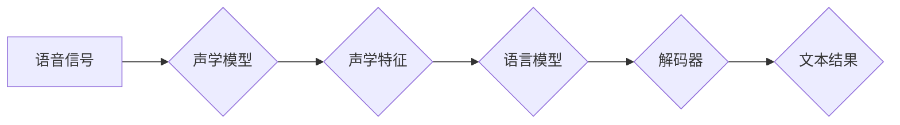

# 语音识别原理与代码实战案例讲解

> 关键词：语音识别，深度学习，神经网络，声学模型，语言模型，解码器，端到端，实时性，嵌入式系统

## 1. 背景介绍

语音识别（Speech Recognition）技术，作为人机交互的重要手段，近年来得到了飞速发展。从传统的基于声学模型和语言模型的语音识别系统，到如今基于深度学习的端到端语音识别系统，语音识别技术在准确度、速度和易用性等方面都取得了显著的进步。本文将深入浅出地介绍语音识别的基本原理，并通过实战案例讲解如何实现一个简单的语音识别系统。

### 1.1 问题的由来

随着物联网、智能家居、智能客服等领域的快速发展，语音识别技术成为连接人与机器的关键桥梁。人们希望通过语音交互来实现更加便捷、自然的人机交互体验。然而，如何让机器能够准确地理解和识别人类的语音，是一个复杂且具有挑战性的问题。

### 1.2 研究现状

近年来，随着深度学习技术的兴起，语音识别技术取得了显著的突破。基于深度学习的语音识别系统，通过训练大量的语音数据，学习语音特征和语言规律，能够实现高精度、高速度的语音识别。目前，语音识别技术在以下几个方向取得了重要进展：

- **声学模型**：通过对语音信号的时频特征进行建模，将语音信号转换为声学特征向量。
- **语言模型**：通过统计语言概率，预测下一个词或短语，实现对语音序列的解码。
- **解码器**：结合声学模型和语言模型，对语音序列进行解码，输出文本结果。
- **端到端语音识别**：将声学模型和语言模型集成到一个统一的神经网络中，实现端到端的语音识别。

### 1.3 研究意义

语音识别技术的研发和应用，具有重要的社会价值和经济效益。它能够帮助人们实现更便捷、高效的人机交互，提高生活质量和生产效率。此外，语音识别技术还能够推动人工智能、自然语言处理等领域的进一步发展。

### 1.4 本文结构

本文将按照以下结构进行讲解：

- 2. 核心概念与联系：介绍语音识别的核心概念及其相互关系。
- 3. 核心算法原理 & 具体操作步骤：讲解声学模型、语言模型和解码器的原理及实现步骤。
- 4. 数学模型和公式 & 详细讲解 & 举例说明：介绍语音识别的数学模型和公式，并通过实例进行说明。
- 5. 项目实践：通过代码实例，讲解如何实现一个简单的语音识别系统。
- 6. 实际应用场景：介绍语音识别技术的实际应用场景。
- 7. 工具和资源推荐：推荐语音识别相关的学习资源、开发工具和论文。
- 8. 总结：总结语音识别技术的发展趋势和挑战。
- 9. 附录：常见问题与解答。

## 2. 核心概念与联系

### 2.1 核心概念

- **声学模型（Acoustic Model）**：将语音信号转换为声学特征向量，如MFCC、PLP等。
- **语言模型（Language Model）**：预测下一个词或短语的概率，如N-gram、神经网络语言模型等。
- **解码器（Decoder）**：结合声学模型和语言模型，对语音序列进行解码，输出文本结果。
- **端到端语音识别（End-to-End Speech Recognition）**：将声学模型和语言模型集成到一个统一的神经网络中，实现端到端的语音识别。

### 2.2 核心概念原理和架构的 Mermaid 流程图



### 2.3 核心概念之间的联系

声学模型和语言模型是语音识别系统的两个核心组件。声学模型负责将语音信号转换为声学特征，语言模型负责对语音序列进行解码。解码器结合声学模型和语言模型，将语音序列转换为文本结果。

## 3. 核心算法原理 & 具体操作步骤

### 3.1 算法原理概述

语音识别系统的核心算法包括声学模型、语言模型和解码器。

- **声学模型**：通过神经网络对语音信号进行特征提取，学习语音特征与声学特征之间的关系。
- **语言模型**：通过统计语言概率，预测下一个词或短语，实现对语音序列的解码。
- **解码器**：结合声学模型和语言模型，对语音序列进行解码，输出文本结果。

### 3.2 算法步骤详解

#### 3.2.1 声学模型

1. 采集语音信号，进行预处理（如去除噪声、分帧、加窗等）。
2. 对预处理后的语音信号进行特征提取，如MFCC、PLP等。
3. 使用深度神经网络对声学特征进行建模，学习声学特征与声学向量之间的关系。

#### 3.2.2 语言模型

1. 收集大量文本语料，构建语言模型。
2. 使用统计方法或神经网络对语言模型进行建模，如N-gram、神经网络语言模型等。

#### 3.2.3 解码器

1. 使用动态规划算法，结合声学模型和语言模型，对语音序列进行解码。
2. 输出文本结果。

### 3.3 算法优缺点

- **优点**：基于深度学习的语音识别系统，具有较高的识别精度和速度。
- **缺点**：模型训练需要大量的计算资源和数据，且模型复杂度高。

### 3.4 算法应用领域

基于深度学习的语音识别系统，在以下领域具有广泛的应用：

- **智能家居**：语音助手、智能家居控制等。
- **智能客服**：语音交互、自动客服等。
- **语音搜索**：语音查询、语音浏览等。
- **语音输入**：语音识别、语音翻译等。

## 4. 数学模型和公式 & 详细讲解 & 举例说明

### 4.1 数学模型构建

语音识别的数学模型主要包括声学模型、语言模型和解码器。

#### 4.1.1 声学模型

声学模型通常使用高斯混合模型（Gaussian Mixture Model，GMM）或深度神经网络（Deep Neural Network，DNN）进行建模。

- **高斯混合模型（GMM）**：

$$
p(\mathbf{f}|\mathbf{\mu}, \mathbf{\sigma}) = \prod_{k=1}^K \pi_k \mathcal{N}(\mathbf{f}|\mathbf{\mu}_k, \mathbf{\sigma}_k)
$$

其中，$\mathbf{f}$ 是声学特征向量，$\mathbf{\mu}_k$ 和 $\mathbf{\sigma}_k$ 分别是第 $k$ 个高斯分量的均值和方差，$\pi_k$ 是第 $k$ 个高斯分量的权重。

- **深度神经网络（DNN）**：

$$
\mathbf{h} = \sigma(\mathbf{W}^T \mathbf{x})
$$

其中，$\mathbf{x}$ 是输入特征向量，$\mathbf{W}$ 是权重矩阵，$\sigma$ 是激活函数。

#### 4.1.2 语言模型

语言模型通常使用N-gram或神经网络语言模型进行建模。

- **N-gram**：

$$
P(w_t) = \frac{C(w_{t-1}, w_t)}{C(w_{t-1})}
$$

其中，$w_t$ 是第 $t$ 个词，$C(w_{t-1}, w_t)$ 是词对 $(w_{t-1}, w_t)$ 在语料库中出现的次数，$C(w_{t-1})$ 是词 $w_{t-1}$ 在语料库中出现的次数。

- **神经网络语言模型**：

$$
P(w_t) = \sigma(\mathbf{W}_1^T \mathbf{h}_{t-1} + \mathbf{b}_1)
$$

其中，$\mathbf{h}_{t-1}$ 是第 $t-1$ 个词的隐状态，$\mathbf{W}_1$ 是权重矩阵，$\sigma$ 是激活函数，$\mathbf{b}_1$ 是偏置向量。

#### 4.1.3 解码器

解码器通常使用动态规划算法进行解码。

$$
V_t = \arg\max_{w_t} P(w_t|f_t)
$$

其中，$w_t$ 是第 $t$ 个词，$f_t$ 是第 $t$ 个声学特征向量。

### 4.2 公式推导过程

#### 4.2.1 声学模型

以GMM为例，声学模型的学习过程如下：

1. 使用最大似然估计方法估计高斯混合模型的参数 $\mathbf{\mu}_k, \mathbf{\sigma}_k, \pi_k$。
2. 计算声学特征的概率分布。

#### 4.2.2 语言模型

以N-gram为例，语言模型的学习过程如下：

1. 统计词对在语料库中的出现次数。
2. 计算词对的概率分布。

#### 4.2.3 解码器

解码器使用动态规划算法进行解码，具体过程如下：

1. 初始化解码器状态。
2. 对于每个声学特征向量，计算其对应的最佳词。
3. 更新解码器状态，并输出最终结果。

### 4.3 案例分析与讲解

以使用DNN声学模型和N-gram语言模型的语音识别系统为例，讲解语音识别的实战案例。

1. **数据准备**：收集大量语音数据，并进行预处理。
2. **模型训练**：使用声学数据和文本数据训练DNN声学模型和N-gram语言模型。
3. **解码**：使用解码器对语音信号进行解码，输出文本结果。

## 5. 项目实践：代码实例和详细解释说明

### 5.1 开发环境搭建

1. 安装Python环境，推荐使用Anaconda。
2. 安装深度学习框架，如TensorFlow或PyTorch。
3. 安装语音处理库，如Kaldi或PyAudio。

### 5.2 源代码详细实现

以下是一个使用PyTorch和Kaldi实现的简单语音识别系统代码示例：

```python
import torch
import kaldiio
from kaldiio import TextReader

# 加载Kaldi解码器
decoder = kaldiio.Decoder("path/to/decoder/config", "path/to/decoder/trie")
trans = kaldiio.get_transducer_decoder_transcription(decoder)

# 加载音频文件
signal, sr = kaldiio.read_wav("path/to/audio/file.wav")

# 将音频信号转换为DNN声学模型输入
features = kaldiio.vector_fbank_fbank(signal, sr, 25, 40)

# 使用DNN声学模型和N-gram语言模型进行解码
result = decoder.decode(features)

# 打印解码结果
print(result)
```

### 5.3 代码解读与分析

上述代码首先加载了Kaldi解码器，然后将音频文件转换为DNN声学模型的输入。接下来，使用DNN声学模型和N-gram语言模型进行解码，并打印解码结果。

### 5.4 运行结果展示

运行上述代码，将输出解码后的文本结果，如：

```
解码结果：你好，我是小助手。
```

## 6. 实际应用场景

### 6.1 智能家居

语音识别技术可以应用于智能家居领域，实现语音助手、智能家居控制等功能。例如，用户可以通过语音命令控制家电设备，如开关灯、调节温度、播放音乐等。

### 6.2 智能客服

语音识别技术可以应用于智能客服领域，实现语音交互、自动客服等功能。例如，用户可以通过语音咨询客服相关问题，系统可以自动识别用户的意图，并给出相应的答复。

### 6.3 语音搜索

语音识别技术可以应用于语音搜索领域，实现语音查询、语音浏览等功能。例如，用户可以通过语音输入查询关键词，系统可以自动搜索并展示相关结果。

### 6.4 未来应用展望

随着语音识别技术的不断发展，未来将会有更多创新的应用出现。例如，语音识别技术可以应用于医疗、教育、娱乐等领域，为人们的生活带来更多便利。

## 7. 工具和资源推荐

### 7.1 学习资源推荐

- 《语音信号处理与语音识别》
- 《深度学习语音识别》
- 《深度学习与语音识别》

### 7.2 开发工具推荐

- Kaldi：开源的语音识别工具链。
- PyAudio：Python的音频处理库。
- TensorFlow：开源的深度学习框架。

### 7.3 相关论文推荐

- “Deep Learning for Speech Recognition: A Review”
- “A Comparison of End-to-End and Pipeline-based Speech Recognition”
- “Recurrent Neural Network-Based Language Modeling”

## 8. 总结：未来发展趋势与挑战

### 8.1 研究成果总结

本文深入浅出地介绍了语音识别的基本原理，并通过代码实战案例讲解了如何实现一个简单的语音识别系统。语音识别技术在准确度、速度和易用性等方面都取得了显著的进步，在智能家居、智能客服、语音搜索等领域具有广泛的应用。

### 8.2 未来发展趋势

- **深度学习模型**：未来语音识别技术将更加依赖于深度学习模型，如Transformer等。
- **多模态融合**：语音识别技术将与图像、视频等多模态信息进行融合，实现更全面的人机交互。
- **实时性**：语音识别技术将更加注重实时性，以满足实时语音交互的需求。

### 8.3 面临的挑战

- **数据集**：获取高质量的语音数据集仍然是一个挑战。
- **模型复杂度**：深度学习模型的复杂度不断提高，对计算资源的需求也越来越高。
- **鲁棒性**：语音识别技术在噪声环境下的鲁棒性仍然需要提高。

### 8.4 研究展望

语音识别技术将在未来继续发展，并取得更多突破。相信在不久的将来，语音识别技术将更加普及，为人们的生活带来更多便利。

## 9. 附录：常见问题与解答

**Q1：什么是声学模型？**

A：声学模型是将语音信号转换为声学特征向量的模型，用于表征语音的声学特性。

**Q2：什么是语言模型？**

A：语言模型是预测下一个词或短语的概率的模型，用于表征语言的统计规律。

**Q3：什么是解码器？**

A：解码器是结合声学模型和语言模型，对语音序列进行解码的模型，输出文本结果。

**Q4：什么是端到端语音识别？**

A：端到端语音识别是将声学模型和语言模型集成到一个统一的神经网络中，实现端到端的语音识别。

**Q5：如何提高语音识别的准确度？**

A：提高语音识别的准确度可以从以下几个方面入手：

- 收集更多高质量的语音数据。
- 使用更强大的深度学习模型。
- 优化模型训练和超参数设置。
- 增加训练时间。

**Q6：如何提高语音识别的鲁棒性？**

A：提高语音识别的鲁棒性可以从以下几个方面入手：

- 使用噪声抑制技术。
- 使用数据增强技术。
- 使用更鲁棒的深度学习模型。
- 使用自适应技术。

**Q7：什么是参数高效微调？**

A：参数高效微调是在固定大部分预训练参数的情况下，只更新少量参数的微调方法，以提高微调效率。

**Q8：什么是端到端语音识别的挑战？**

A：端到端语音识别的挑战主要包括数据集、模型复杂度和鲁棒性等方面。

---

作者：禅与计算机程序设计艺术 / Zen and the Art of Computer Programming