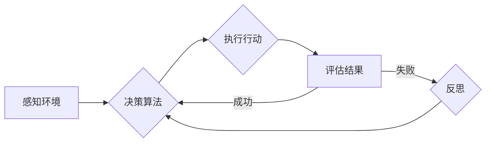

# 通过反思提高 Agent 输出质量

> 关键词：智能代理，输出质量，反思，评估，优化，强化学习，决策过程，人类反馈

## 1. 背景介绍

随着人工智能技术的飞速发展，智能代理（Agent）在各个领域得到了广泛的应用。从自动驾驶汽车到智能客服，从推荐系统到游戏AI，智能代理正在改变我们的生活方式。然而，智能代理的输出质量往往受到多种因素的影响，包括决策算法、数据质量、环境复杂性等。为了提高智能代理的输出质量，我们需要深入理解其决策过程，并通过反思和评估来优化其行为。

## 2. 核心概念与联系

### 2.1 智能代理

智能代理是一种能够感知环境、做出决策并采取行动的实体。它可以是软件程序、机器人或其他类型的设备。智能代理的核心是决策算法，它决定了代理如何响应环境变化。

### 2.2 输出质量

智能代理的输出质量是指其决策结果对目标任务的贡献度。高输出质量的代理能够更有效地完成任务，并减少错误和意外。

### 2.3 反思

反思是智能代理自我评估和改进的过程。通过反思，智能代理可以识别其决策过程中的错误和不足，并采取相应的措施进行优化。

### 2.4 评估

评估是衡量智能代理输出质量的方法。通过评估，我们可以了解代理的表现，并识别需要改进的领域。

### 2.5 Mermaid 流程图

以下是一个智能代理决策过程的Mermaid流程图：



## 3. 核心算法原理 & 具体操作步骤

### 3.1 算法原理概述

智能代理的决策过程通常基于强化学习（Reinforcement Learning，RL）算法。强化学习是一种通过试错和奖励反馈来学习如何进行决策的方法。

### 3.2 算法步骤详解

1. **环境定义**：定义智能代理所处的环境，包括状态空间、动作空间和奖励函数。

2. **策略学习**：使用强化学习算法学习一个策略函数，该函数将状态映射到动作。

3. **行动执行**：智能代理根据策略函数选择动作，并在环境中执行。

4. **结果反馈**：环境根据智能代理的行动提供奖励或惩罚。

5. **策略更新**：使用奖励反馈来更新策略函数。

### 3.3 算法优缺点

**优点**：

- **自适应性强**：能够适应不断变化的环境。
- **无需大量标注数据**：可以通过与环境的交互学习。

**缺点**：

- **收敛速度慢**：需要大量样本才能收敛到最优策略。
- **不稳定**：在不同环境或初始参数下，可能收敛到不同的解。

### 3.4 算法应用领域

强化学习在游戏、机器人、推荐系统、自动驾驶等领域得到了广泛应用。

## 4. 数学模型和公式 & 详细讲解 & 举例说明

### 4.1 数学模型构建

强化学习的基本数学模型包括：

- 状态空间 $S$
- 动作空间 $A$
- 奖励函数 $R$
- 策略函数 $\pi$
- 状态转移函数 $P$

### 4.2 公式推导过程

假设智能代理当前处于状态 $s$，根据策略函数 $\pi$ 选择动作 $a$，环境根据状态转移函数 $P$ 生成下一个状态 $s'$ 和奖励 $r$。则强化学习的目标是最大化期望回报：

$$
J(\pi) = \sum_{t=0}^\infty \gamma^t R_t
$$

其中 $\gamma$ 是折现因子，$R_t$ 是在第 $t$ 个时间步获得的奖励。

### 4.3 案例分析与讲解

以下是一个简单的Q-learning示例：

```python
import numpy as np

# 初始化Q值表
Q = np.zeros([4, 4])

# 定义奖励函数
def reward(state, action):
    if state == 0 and action == 2:
        return 1
    else:
        return -1

# 定义环境
def step(state, action):
    if state == 3:
        return 3, reward(state, action)
    else:
        return state + 1, reward(state, action)

# Q-learning算法
def q_learning(Q, state_space, action_space, alpha, gamma):
    for _ in range(1000):
        state = np.random.randint(0, state_space)
        action = np.random.randint(0, action_space)
        next_state, reward = step(state, action)
        Q[state, action] += alpha * (reward + gamma * np.max(Q[next_state, :]) - Q[state, action])
    return Q

# 运行Q-learning
Q = q_learning(Q, 4, 2, 0.1, 0.9)

# 打印Q值表
print(Q)
```

## 5. 项目实践：代码实例和详细解释说明

### 5.1 开发环境搭建

以下是使用Python进行强化学习项目实践所需的开发环境：

1. 安装Anaconda：从官网下载并安装Anaconda，用于创建独立的Python环境。

2. 创建并激活虚拟环境：
```bash
conda create -n rl-env python=3.8 
conda activate rl-env
```

3. 安装相关库：
```bash
conda install numpy pandas matplotlib scikit-learn gym
```

### 5.2 源代码详细实现

以下是一个使用Q-learning算法解决迷宫问题的示例：

```python
import numpy as np
import gym
import random

# 定义迷宫环境
env = gym.make("CartPole-v0")

# 初始化Q值表
Q = np.zeros([env.observation_space.n, env.action_space.n])

# 定义奖励函数
def reward(state, action):
    if state == 419:
        return 1
    else:
        return -1

# 定义Q-learning算法
def q_learning(Q, env, alpha, gamma, episodes):
    for episode in range(episodes):
        state = env.reset()
        done = False
        while not done:
            action = np.argmax(Q[state, :])
            next_state, reward, done, _ = env.step(action)
            Q[state, action] += alpha * (reward + gamma * np.max(Q[next_state, :]) - Q[state, action])
            state = next_state
    return Q

# 运行Q-learning
Q = q_learning(Q, env, 0.1, 0.9, 1000)

# 打印Q值表
print(Q)
```

### 5.3 代码解读与分析

上述代码首先创建了一个CartPole迷宫环境，然后初始化了一个Q值表，并定义了奖励函数。接着，使用Q-learning算法迭代更新Q值表，最终打印出Q值表。

### 5.4 运行结果展示

运行上述代码，最终会打印出Q值表，该表记录了在迷宫环境中，从每个状态到每个动作的Q值。

## 6. 实际应用场景

智能代理在实际应用场景中发挥着重要作用，以下是一些典型的应用示例：

- **自动驾驶**：智能代理可以根据交通状况和道路规则做出实时决策，提高驾驶安全性和效率。
- **智能客服**：智能代理可以自动回答客户问题，提高客户服务质量和效率。
- **推荐系统**：智能代理可以根据用户行为和喜好推荐商品或内容，提高用户体验。
- **游戏AI**：智能代理可以与人类玩家进行对抗，提高游戏难度和趣味性。

## 7. 工具和资源推荐

### 7.1 学习资源推荐

- 《Reinforcement Learning: An Introduction》
- 《Deep Reinforcement Learning》
- 《Artificial Intelligence: A Modern Approach》

### 7.2 开发工具推荐

- OpenAI Gym：提供多种预定义环境和工具，方便进行强化学习实验。
- TensorFlow：提供强大的机器学习框架，支持强化学习算法的实现和训练。
- PyTorch：提供灵活的深度学习框架，方便进行强化学习研究和开发。

### 7.3 相关论文推荐

- "Q-Learning" by Richard S. Sutton and Andrew G. Barto
- "Deep Q-Network" by Volodymyr Mnih et al.
- "Asynchronous Advantage Actor-Critic" by John Schulman et al.

## 8. 总结：未来发展趋势与挑战

### 8.1 研究成果总结

通过本文的介绍，我们可以看到，智能代理的输出质量对于其应用效果至关重要。通过反思和评估，我们可以识别智能代理决策过程中的不足，并采取相应的措施进行优化。强化学习作为一种有效的决策算法，为智能代理的设计和应用提供了强大的技术支持。

### 8.2 未来发展趋势

随着人工智能技术的不断发展，智能代理的未来发展趋势包括：

- **多智能体协作**：智能代理之间可以协同工作，共同完成复杂任务。
- **混合智能**：结合人类专家的知识和经验，提高智能代理的决策能力。
- **自适应学习**：智能代理可以适应不断变化的环境，提高其泛化能力。

### 8.3 面临的挑战

智能代理的发展也面临一些挑战，包括：

- **数据隐私和安全**：智能代理在处理数据时需要保护用户隐私和确保数据安全。
- **伦理和社会影响**：智能代理的决策可能导致不公平或歧视性的结果，需要加强伦理和社会影响评估。
- **可解释性和可信度**：提高智能代理的可解释性和可信度，使其决策过程更加透明和可靠。

### 8.4 研究展望

未来，我们需要在以下方面进行深入研究：

- **开发更加鲁棒的强化学习算法**：提高智能代理在复杂环境中的适应能力和泛化能力。
- **探索可解释的强化学习**：提高智能代理决策过程的可解释性和可信度。
- **加强智能代理的伦理和社会影响研究**：确保智能代理的应用符合伦理和社会价值观。

通过不断的技术创新和深入研究，智能代理有望在未来发挥更大的作用，为人类社会带来更多福祉。

## 9. 附录：常见问题与解答

**Q1：什么是智能代理？**

A：智能代理是一种能够感知环境、做出决策并采取行动的实体。它可以是软件程序、机器人或其他类型的设备。

**Q2：什么是强化学习？**

A：强化学习是一种通过试错和奖励反馈来学习如何进行决策的方法。

**Q3：如何提高智能代理的输出质量？**

A：通过反思和评估智能代理的决策过程，并采取相应的措施进行优化。

**Q4：强化学习在哪些领域有应用？**

A：强化学习在游戏、机器人、推荐系统、自动驾驶等领域得到了广泛应用。

**Q5：如何解决强化学习中的收敛速度慢和稳定性问题？**

A：可以尝试使用更有效的强化学习算法、增加训练数据量、调整学习率等方法来提高收敛速度和稳定性。

作者：禅与计算机程序设计艺术 / Zen and the Art of Computer Programming