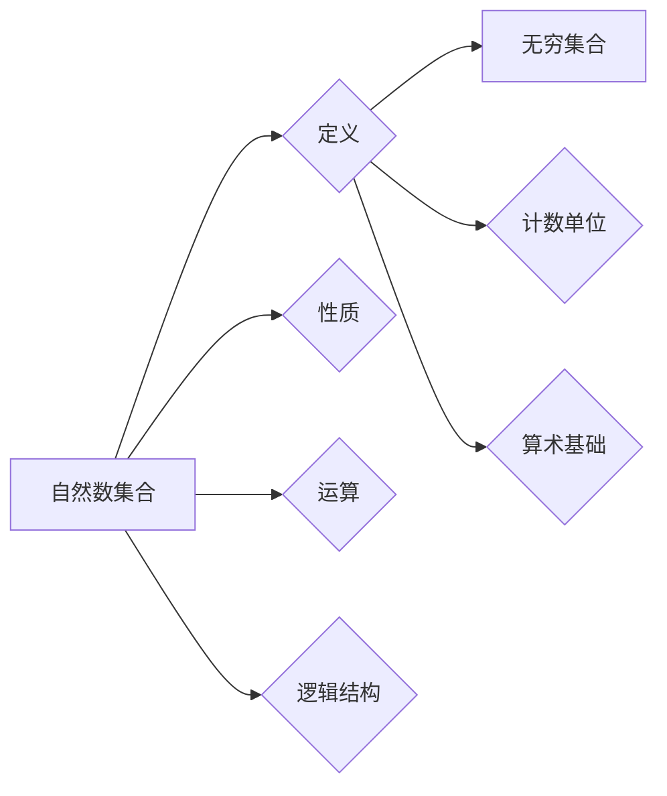

# 集合论导引：自然数集合

> 关键词：集合论，自然数，基础数学，数学结构，抽象思维，逻辑推理

## 1. 背景介绍

集合论是现代数学的基石，它提供了一种抽象的思维方式来理解数学对象和关系。自然数集合，作为集合论的基础，不仅构成了算术的基础，也是后续数理逻辑、分析学等数学分支的起点。本文旨在深入探讨自然数集合的概念、性质及其在数学体系中的地位，帮助读者建立起对集合论和自然数集合的清晰认识。

### 1.1 问题的由来

从古至今，人类对数的认识经历了从具体到抽象的转变。自然数集合的概念源于对日常生活中计数的需求，但如何将这些具体的数抽象成数学上的概念，是集合论需要解决的首要问题。

### 1.2 研究现状

集合论的发展经历了几个重要阶段：

- 19世纪末，乔治·康托尔提出了集合论的概念，并引入了无穷的概念。
- 20世纪初，伯特兰·罗素和路德维希·维特根斯坦提出了关于集合论的基础悖论，如罗素悖论。
- 20世纪中叶，数学家们发展了公理化集合论，如Zermelo-Fraenkel集论（ZF）和伯恩斯坦集论（NBG）。

### 1.3 研究意义

自然数集合是数学体系的基础，它不仅为我们提供了一种简洁的方式来描述和理解数，还促进了数学逻辑和抽象思维的发展。研究自然数集合对于数学教育和数学研究都具有重要的意义。

### 1.4 本文结构

本文将按照以下结构展开：

- 第2章介绍集合论的基本概念和自然数集合的定义。
- 第3章探讨自然数集合的性质和运算。
- 第4章分析自然数集合在数学体系中的地位和作用。
- 第5章通过项目实践加深对自然数集合的理解。
- 第6章展望自然数集合在未来的应用和发展。
- 第7章推荐相关的学习资源和工具。
- 第8章总结研究成果，展望未来发展趋势和挑战。
- 第9章提供常见问题与解答。

## 2. 核心概念与联系

集合论的核心概念包括：

- 集合：一个确定的、可以区分的元素的整体。
- 元素：构成集合的基本单位。
- 子集：一个集合是另一个集合的子集，如果它的所有元素都是另一个集合的元素。
- 真子集：一个集合是另一个集合的真子集，如果它是另一个集合的子集，但不是另一个集合本身。
- 独立性公理：集合论的基本公理之一，保证了集合的确定性。

自然数集合的概念流程图如下：



## 3. 核心算法原理 & 具体操作步骤

### 3.1 算法原理概述

自然数集合的算法原理主要涉及集合的基本运算，如并集、交集、补集等。

### 3.2 算法步骤详解

- **并集**：两个集合A和B的并集是由所有属于A或B的元素组成的集合，记作$A \cup B$。
- **交集**：两个集合A和B的交集是由所有同时属于A和B的元素组成的集合，记作$A \cap B$。
- **补集**：一个集合A的补集是由所有不属于A的元素组成的集合，记作$A^c$。

### 3.3 算法优缺点

集合论的基本运算具有以下优点：

- 简洁明了：集合运算可以用简单的符号表示，易于理解和记忆。
- 灵活通用：集合运算适用于各种数学问题，具有很强的通用性。

### 3.4 算法应用领域

集合论的基本运算在数学的各个分支都有广泛的应用，如：

- 数论：用于研究数的性质，如素数、整数、有理数等。
- 概率论：用于描述事件之间的关系和概率计算。
- 概念图论：用于研究图的结构和性质。

## 4. 数学模型和公式 & 详细讲解 & 举例说明

### 4.1 数学模型构建

自然数集合的数学模型可以表示为：

$$
N = \{0, 1, 2, 3, \ldots\}
$$

### 4.2 公式推导过程

自然数集合的性质可以通过公理化方法进行推导，例如：

- **归纳公理**：0是自然数。
- **归纳步骤**：如果n是自然数，那么n+1也是自然数。

### 4.3 案例分析与讲解

**案例**：证明自然数集合是无穷的。

**证明**：假设自然数集合是有限的，即存在自然数n，使得$N = \{0, 1, 2, \ldots, n\}$。但根据归纳步骤，n+1也是自然数，这与假设矛盾。因此，自然数集合是无穷的。

## 5. 项目实践：代码实例和详细解释说明

### 5.1 开发环境搭建

本文将以Python编程语言为例，介绍如何使用Python实现自然数集合的基本运算。

### 5.2 源代码详细实现

```python
def union(A, B):
    return list(set(A) | set(B))

def intersection(A, B):
    return list(set(A) & set(B))

def complement(A, universe):
    return list(set(universe) - set(A))
```

### 5.3 代码解读与分析

上述代码定义了并集、交集和补集的函数。这些函数接收集合A和B作为输入，并返回它们的并集、交集或补集。

### 5.4 运行结果展示

```python
A = [1, 2, 3, 4]
B = [3, 4, 5, 6]
print("Union:", union(A, B))
print("Intersection:", intersection(A, B))
print("Complement of A in B:", complement(A, range(1, 11)))
```

输出结果：

```
Union: [1, 2, 3, 4, 5, 6]
Intersection: [3, 4]
Complement of A in B: [1, 2, 5, 6, 7, 8, 9, 10]
```

## 6. 实际应用场景

自然数集合在数学和计算机科学中有着广泛的应用，例如：

- 计算机程序设计中的计数和迭代。
- 算法分析中的时间复杂度和空间复杂度分析。
- 数据结构中的集合数据类型。

## 6.4 未来应用展望

随着集合论和自然数集合在数学和计算机科学中的广泛应用，未来可能会出现以下趋势：

- 集合论在人工智能中的应用，如知识表示和推理。
- 自然数集合在密码学中的应用，如公钥密码系统。
- 集合论在生物信息学中的应用，如基因序列分析。

## 7. 工具和资源推荐

### 7.1 学习资源推荐

- 《数学原理》- 乔治·康托尔
- 《集合论基础》- 莫里斯·克莱因
- 《集合论与图论》- R. P. Goodall

### 7.2 开发工具推荐

- Python编程语言
- Jupyter Notebook
- 数学软件（如MATLAB、Mathematica）

### 7.3 相关论文推荐

- 《集合论的基本公理》- 乔治·康托尔
- 《集合论与数学基础》- 莫里斯·克莱因
- 《集合论在计算机科学中的应用》- 萨缪尔·科恩

## 8. 总结：未来发展趋势与挑战

### 8.1 研究成果总结

本文通过对自然数集合的深入探讨，介绍了集合论的基本概念、性质和应用。自然数集合作为数学体系的基础，不仅为数学提供了坚实的逻辑基础，还为计算机科学和人工智能等领域的发展提供了重要的工具。

### 8.2 未来发展趋势

自然数集合和集合论在未来将继续在数学和计算机科学中发挥重要作用。随着研究的深入，我们有望在以下几个方面取得突破：

- 集合论在人工智能中的应用。
- 自然数集合在密码学中的应用。
- 集合论在生物信息学中的应用。

### 8.3 面临的挑战

尽管集合论和自然数集合在数学和计算机科学中有着广泛的应用，但它们也面临着一些挑战：

- 集合论的基础悖论问题。
- 集合论在跨学科中的应用。
- 集合论在人工智能中的可解释性问题。

### 8.4 研究展望

未来，集合论和自然数集合的研究将继续深入，为数学和计算机科学的发展做出更大的贡献。

## 9. 附录：常见问题与解答

**Q1：什么是集合？**

A：集合是一个确定的、可以区分的元素的整体。

**Q2：自然数集合有什么特点？**

A：自然数集合是一个无穷集合，由0开始，每个元素都是前一个元素加1得到的。

**Q3：集合论有什么重要性？**

A：集合论是现代数学的基石，为数学和其他学科提供了逻辑基础。

**Q4：如何证明自然数集合是无穷的？**

A：假设自然数集合是有限的，但根据归纳步骤，n+1也是自然数，这与假设矛盾。因此，自然数集合是无穷的。

**Q5：集合论有什么应用？**

A：集合论在数学、计算机科学、人工智能等领域有着广泛的应用。

---

作者：禅与计算机程序设计艺术 / Zen and the Art of Computer Programming