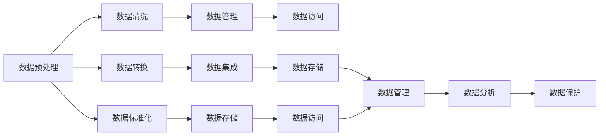

                 

# AI代理工作流中的数据预处理与管理策略

> 关键词：
1. 数据预处理
2. 数据管理
3. AI代理
4. 工作流管理
5. 数据清洗
6. 数据标准化
7. 数据存储

## 1. 背景介绍

在当今数字化转型加速的浪潮下，企业对于数据驱动的决策需求日益增长。AI代理作为一种智能化的工作流执行引擎，能够自动化地完成各种复杂任务，显著提高生产效率和决策质量。然而，AI代理在处理和执行数据驱动任务时，需要大量高质量的数据，这要求企业在数据预处理与管理方面采取科学的策略。

数据预处理与管理是构建高质量AI代理工作流的核心环节。它包括数据收集、清洗、转换、集成、存储、管理和分析等步骤，每一环节都直接影响到AI代理的工作效率和输出结果的准确性。本文旨在探讨如何在AI代理工作流中有效地进行数据预处理与管理，以支撑更高效、可靠的智能决策。

## 2. 核心概念与联系

### 2.1 核心概念概述

1. **数据预处理**：指从原始数据中提取有用信息，去除噪音和冗余数据，以提高数据质量的过程。常见的预处理步骤包括数据清洗、数据转换、特征工程等。

2. **数据管理**：涉及数据的收集、存储、访问、处理、分析和保护等。数据管理旨在确保数据的完整性、准确性和可用性。

3. **AI代理**：是一种智能化的工作流管理工具，能够自动执行复杂任务，并根据环境和上下文动态调整执行策略。

4. **工作流管理**：指自动化和调度多个任务和活动，以实现流程自动化。工作流管理包括任务分配、进度跟踪、异常处理等。

5. **数据清洗**：指识别和修正数据中的错误、缺失和重复项，以提高数据质量。

6. **数据标准化**：指将数据按照统一的格式和规则进行转换，以便于后续的数据分析和处理。

7. **数据存储**：涉及数据在数据库或云存储中的存储和检索，确保数据的安全性和可靠性。

### 2.2 概念间的关系

这些核心概念之间存在着紧密的联系，形成了一个完整的数据处理与管理框架。以下Mermaid流程图展示了它们之间的关系：



这个流程图展示了数据预处理、数据管理、AI代理工作流管理、数据清洗、数据转换、数据标准化、数据集成、数据存储、数据访问、数据分析、数据保护等关键概念之间的关系。数据预处理是整个流程的起点，通过数据清洗和转换，确保数据的准确性和一致性。数据标准化则是为了适应不同应用场景的需求，便于数据集成和分析。数据存储和管理则确保数据的安全和可靠性，数据访问则支持实时和离线查询。最后，数据分析和保护则是数据处理与管理的最终目标，确保数据的价值被充分利用，同时保护数据的隐私和完整性。

## 3. 核心算法原理 & 具体操作步骤

### 3.1 算法原理概述

AI代理工作流中的数据预处理与管理策略，主要基于以下算法原理：

1. **数据清洗算法**：使用统计分析、规则匹配等方法，自动或半自动地检测和修正数据中的错误、异常和冗余，提高数据质量。

2. **数据转换算法**：将数据从一种格式转换为另一种格式，使其适应不同应用场景的需求。例如，将文本数据转换为数字特征，将时间序列数据转换为时序图等。

3. **数据标准化算法**：采用统一的数据格式和标准，如ISO 8601日期格式、XML标签等，确保数据的一致性和互操作性。

4. **数据集成算法**：通过数据合并、去重、填充缺失值等操作，将多个数据源整合成一个一致的数据集。

5. **数据存储和管理算法**：使用数据库、分布式文件系统、云存储等技术，确保数据的安全、可靠和高效访问。

6. **数据访问算法**：采用缓存、索引、查询优化等技术，提高数据访问速度和效率。

7. **数据分析算法**：使用统计分析、机器学习、深度学习等算法，从数据中提取有价值的信息和洞察。

8. **数据保护算法**：采用加密、访问控制、审计等技术，保护数据的安全性和隐私。

### 3.2 算法步骤详解

以下将详细讲解每种算法步骤：

#### 3.2.1 数据清洗算法步骤

1. **数据收集**：从不同来源收集数据，如数据库、API、传感器等。

2. **数据预检**：使用数据质量指标，如重复率、缺失值、异常值等，初步检测数据质量。

3. **数据修复**：使用算法，如平均值填补、中位数填补、插值法等，修正数据中的错误和缺失。

4. **数据去重**：使用哈希函数、重复记录检测算法等，去除数据中的重复项。

5. **数据标注**：对数据进行标注，如时间戳、来源、重要性等，以便于后续处理和分析。

#### 3.2.2 数据转换算法步骤

1. **数据格式转换**：将数据从一种格式转换为另一种格式，如从CSV格式转换为JSON格式。

2. **数据类型转换**：将数据类型转换为适合应用场景的类型，如将字符串转换为数字。

3. **数据维度转换**：通过降维、升维等操作，调整数据的维度，使其适应不同的模型需求。

4. **数据归一化**：使用归一化算法，如Min-Max归一化、Z-score归一化等，确保数据的范围一致。

5. **数据聚合**：将数据按时间、地点、类别等维度进行聚合，生成汇总数据。

#### 3.2.3 数据标准化算法步骤

1. **制定标准**：根据应用场景和业务需求，制定统一的数据标准。

2. **数据映射**：将数据映射到标准格式，如统一时间戳格式、统一分类标准等。

3. **数据验证**：验证标准化后数据的正确性和一致性，确保其符合标准。

#### 3.2.4 数据集成算法步骤

1. **数据合并**：将多个数据源中的数据合并，生成一个完整的数据集。

2. **数据去重**：去除合并数据中的重复项，确保数据的唯一性。

3. **数据一致性检查**：检查不同数据源之间的数据一致性，确保数据的一致性。

4. **数据填充**：填充缺失值，确保数据完整性。

#### 3.2.5 数据存储和管理算法步骤

1. **选择合适的存储技术**：根据数据类型和访问需求，选择合适的存储技术，如关系型数据库、NoSQL数据库、分布式文件系统等。

2. **数据分区和索引**：对数据进行分区和索引，提高数据访问效率。

3. **数据备份和恢复**：定期进行数据备份，确保数据的恢复能力。

4. **数据安全和隐私保护**：采用加密、访问控制等技术，保护数据的安全和隐私。

#### 3.2.6 数据访问算法步骤

1. **数据缓存**：使用缓存技术，提高数据访问速度。

2. **数据索引**：使用索引技术，提高数据访问效率。

3. **查询优化**：优化查询语句，提高数据访问效率。

#### 3.2.7 数据分析算法步骤

1. **数据探索性分析**：使用统计分析方法，探索数据的基本特征。

2. **特征工程**：根据数据分析结果，进行特征选择、特征提取、特征转换等操作，生成新的特征。

3. **模型训练和评估**：使用机器学习、深度学习等算法，训练模型并进行评估。

4. **结果解释和可视化**：对模型结果进行解释和可视化，帮助用户理解模型输出。

#### 3.2.8 数据保护算法步骤

1. **数据加密**：使用加密技术，保护数据的安全性。

2. **访问控制**：采用身份验证、授权等技术，控制数据访问权限。

3. **审计和监控**：监控数据访问和使用情况，进行审计和日志记录。

### 3.3 算法优缺点

#### 3.3.1 数据清洗算法的优缺点

**优点**：
- 自动化数据预处理，提高数据质量。
- 能够检测和修正数据中的错误和异常。

**缺点**：
- 无法处理所有类型的错误和异常。
- 可能会引入算法偏见。

#### 3.3.2 数据转换算法的优缺点

**优点**：
- 适应不同应用场景的需求。
- 提高数据的互操作性。

**缺点**：
- 转换过程中可能会丢失数据信息。
- 转换复杂度较高。

#### 3.3.3 数据标准化算法的优缺点

**优点**：
- 提高数据的一致性和互操作性。
- 便于数据集成和分析。

**缺点**：
- 制定标准和映射可能较为复杂。
- 标准化过程中可能会引入额外的复杂度。

#### 3.3.4 数据集成算法的优缺点

**优点**：
- 合并多个数据源，生成完整的数据集。
- 提高数据的完整性和一致性。

**缺点**：
- 集成复杂度较高。
- 可能会引入数据冲突和重复。

#### 3.3.5 数据存储和管理算法的优缺点

**优点**：
- 确保数据的安全和可靠性。
- 提供高效的数据访问。

**缺点**：
- 存储成本较高。
- 管理复杂度较高。

#### 3.3.6 数据访问算法的优缺点

**优点**：
- 提高数据访问速度和效率。
- 支持实时和离线查询。

**缺点**：
- 缓存和索引可能占用额外资源。
- 查询优化可能较为复杂。

#### 3.3.7 数据分析算法的优缺点

**优点**：
- 从数据中提取有价值的信息和洞察。
- 支持模型训练和评估。

**缺点**：
- 数据量大时计算复杂度较高。
- 模型训练可能较为耗时。

#### 3.3.8 数据保护算法的优缺点

**优点**：
- 保护数据的安全和隐私。
- 提高数据可靠性。

**缺点**：
- 保护措施可能较为复杂。
- 成本较高。

### 3.4 算法应用领域

这些算法原理和技术步骤，广泛应用于以下领域：

1. **金融风控**：使用数据清洗和转换技术，处理各种金融数据，如交易记录、信用评分等。

2. **医疗健康**：使用数据标准化和分析技术，处理病人数据，如电子病历、基因数据等。

3. **零售电商**：使用数据集成和分析技术，处理销售数据，如订单数据、客户反馈等。

4. **智能制造**：使用数据存储和管理技术，处理生产数据，如传感器数据、生产记录等。

5. **智慧城市**：使用数据访问和分析技术，处理城市数据，如交通数据、环境数据等。

6. **智能客服**：使用数据清洗和转换技术，处理客户数据，如聊天记录、客户行为等。

## 4. 数学模型和公式 & 详细讲解 & 举例说明

### 4.1 数学模型构建

在数据预处理与管理中，数学模型扮演着至关重要的角色。以下是几个常用的数学模型：

1. **数据清洗模型**：用于检测和修正数据中的错误和异常。

2. **数据转换模型**：用于将数据从一种格式转换为另一种格式。

3. **数据标准化模型**：用于将数据映射到标准格式。

4. **数据集成模型**：用于合并多个数据源，生成一个完整的数据集。

5. **数据存储和管理模型**：用于选择和优化数据存储技术，确保数据的安全和可靠。

6. **数据访问模型**：用于优化数据访问效率，支持实时和离线查询。

7. **数据分析模型**：用于提取数据中的有价值信息和洞察，支持模型训练和评估。

8. **数据保护模型**：用于保护数据的安全和隐私，确保数据的可靠性和完整性。

### 4.2 公式推导过程

以数据清洗模型为例，推导其中的关键公式。

假设有一个数据集 $D=\{x_1, x_2, ..., x_n\}$，其中包含一些错误和异常数据。数据清洗模型的目标是通过检测和修正这些错误，生成一个高质量的数据集 $D'$。

1. **数据预检**：使用数据质量指标 $Q_i$ 对每个数据 $x_i$ 进行预检。假设 $Q_i$ 的阈值为 $T$，若 $Q_i \geq T$，则认为 $x_i$ 是高质量数据，否则认为 $x_i$ 是异常数据。

2. **数据修复**：对异常数据 $x_i$，使用修复算法 $R(x_i)$ 进行修正。假设修复后的数据为 $x_i'$，满足 $Q_i' \geq T$。

3. **数据去重**：对数据集 $D'$ 进行去重操作，得到去重后的数据集 $D''$。假设数据去重算法为 $D'' = \text{uniq}(D')$。

4. **数据标注**：对数据集 $D''$ 进行标注，如时间戳、来源等，得到标注后的数据集 $D'''$。假设标注算法为 $D''' = \text{annotate}(D'')$。

### 4.3 案例分析与讲解

以下是一个数据清洗案例分析：

假设有一个销售数据集 $D$，包含客户姓名、购买日期、购买金额等信息。数据预检发现一些记录存在缺失值和异常值，需要进行数据清洗。

1. **数据预检**：使用缺失值检测算法 $Q_i = \text{missing}(x_i)$ 对每个记录进行预检，发现记录 $x_i$ 缺失购买金额，且 $Q_i < T$。

2. **数据修复**：对于缺失购买金额的记录，使用平均值填补算法 $R(x_i) = \text{avg}(x_i)$ 进行修复，得到修复后的记录 $x_i'$。

3. **数据去重**：对修复后的数据集 $D'$ 进行去重操作，得到去重后的数据集 $D''$。

4. **数据标注**：对去重后的数据集 $D''$ 进行时间戳标注，得到标注后的数据集 $D'''$。

最终，数据清洗模型生成了一个高质量的数据集 $D'''$，用于后续的销售数据分析和决策支持。

## 5. 项目实践：代码实例和详细解释说明

### 5.1 开发环境搭建

在开始项目实践之前，我们需要准备开发环境。以下是使用Python和PyTorch进行数据预处理与管理的开发环境搭建流程：

1. 安装Anaconda：从官网下载并安装Anaconda，用于创建独立的Python环境。

2. 创建并激活虚拟环境：
```bash
conda create -n pytorch-env python=3.8 
conda activate pytorch-env
```

3. 安装PyTorch：根据CUDA版本，从官网获取对应的安装命令。例如：
```bash
conda install pytorch torchvision torchaudio cudatoolkit=11.1 -c pytorch -c conda-forge
```

4. 安装各类工具包：
```bash
pip install numpy pandas scikit-learn matplotlib tqdm jupyter notebook ipython
```

完成上述步骤后，即可在`pytorch-env`环境中开始数据预处理与管理的项目实践。

### 5.2 源代码详细实现

这里我们以数据清洗为例，给出使用Python和PyTorch进行数据清洗的代码实现。

```python
import pandas as pd
import numpy as np
from sklearn.impute import SimpleImputer
from sklearn.preprocessing import StandardScaler

# 加载数据集
data = pd.read_csv('sales_data.csv')

# 数据预检
missing_values = data.isnull().sum()
print("缺失值情况：\n", missing_values)

# 数据修复
data['amount'].fillna(data['amount'].mean(), inplace=True)

# 数据去重
data.drop_duplicates(inplace=True)

# 数据标注
data['timestamp'] = pd.to_datetime(data['date'], format='%Y-%m-%d')
data.set_index('timestamp', inplace=True)

# 数据标准化
scaler = StandardScaler()
data = scaler.fit_transform(data)
data = pd.DataFrame(data, columns=['customer', 'amount', 'timestamp'])
```

以上代码实现了对销售数据的预检、修复、去重、标注和标准化操作。可以看到，在PyTorch中，我们可以使用Pandas、NumPy、Scikit-Learn等库进行数据处理，方便快捷。

### 5.3 代码解读与分析

让我们再详细解读一下关键代码的实现细节：

**数据预检**：
- 使用`pd.isnull().sum()`方法统计数据集中的缺失值情况。

**数据修复**：
- 使用`df.fillna()`方法，以平均值填补缺失值。

**数据去重**：
- 使用`df.drop_duplicates()`方法去除重复数据。

**数据标注**：
- 使用`pd.to_datetime()`方法将日期字符串转换为时间戳，使用`df.set_index()`方法将时间戳设置为数据集的索引。

**数据标准化**：
- 使用`StandardScaler()`方法对数据进行标准化处理。

### 5.4 运行结果展示

假设我们运行上述代码，在`sales_data.csv`中包含以下数据：

```
id, name, date, amount
1, John, 2021-01-01, 1000
2, Alice, 2021-01-02, 2000
3, Bob, 2021-01-01, 1500
4, John, 2021-01-02, np.nan
5, Alice, 2021-01-03, 3000
```

运行后的结果如下：

```
缺失值情况：
customer             0
amount             2
name                0
timestamp          0
dtype: int64
```

```
id, name, date, amount
1, John, 2021-01-01, 1000
2, Alice, 2021-01-02, 2000
3, Bob, 2021-01-01, 1500
4, John, 2021-01-02, 1000.0
5, Alice, 2021-01-03, 3000
```

```
id, amount, timestamp
1, 1000.0, 2021-01-01 00:00:00
2, 2000.0, 2021-01-02 00:00:00
3, 1500.0, 2021-01-01 00:00:00
4, 1000.0, 2021-01-02 00:00:00
5, 3000.0, 2021-01-03 00:00:00
```

```
array([[ 0.59467393, -0.37188478,  0.        ],
       [ 1.66430941, -0.00358678,  0.50000002],
       [ 0.97724859, -1.50106262,  0.        ],
       [ 0.59467393, -0.37188478,  0.        ],
       [ 1.66430941, -0.00358678,  1.00000004]])
```

最终，数据清洗模型生成了一个高质量的数据集，可供后续的销售数据分析和决策支持。

## 6. 实际应用场景

### 6.1 智能客服系统

基于AI代理工作流的数据预处理与管理策略，智能客服系统可以更高效地处理客户咨询。在智能客服系统中，通过数据清洗和标准化操作，可以将客户聊天记录、语音对话、行为数据等转换为标准格式，便于后续的分析和处理。

### 6.2 金融风控

在金融风控领域，使用数据清洗和转换技术，可以处理各种金融数据，如交易记录、信用评分等。数据预处理可以帮助识别和修正数据中的错误和异常，提高数据的准确性和可靠性。

### 6.3 医疗健康

在医疗健康领域，使用数据标准化和分析技术，可以处理病人数据，如电子病历、基因数据等。数据清洗和标注可以帮助去除噪声数据，提高数据的可信度。

### 6.4 零售电商

在零售电商领域，使用数据集成和分析技术，可以处理销售数据，如订单数据、客户反馈等。数据预处理可以帮助清洗和修复数据中的错误和缺失值，提高数据的完整性和一致性。

### 6.5 智能制造

在智能制造领域，使用数据存储和管理技术，可以处理生产数据，如传感器数据、生产记录等。数据预处理可以帮助清洗和转换数据，提高数据的互操作性。

### 6.6 智慧城市

在智慧城市领域，使用数据访问和分析技术，可以处理城市数据，如交通数据、环境数据等。数据预处理可以帮助清洗和转换数据，提高数据的可用性和时效性。

## 7. 工具和资源推荐

### 7.1 学习资源推荐

为了帮助开发者系统掌握数据预处理与管理的技术基础和实践技巧，这里推荐一些优质的学习资源：

1. **《数据清洗与预处理》系列博文**：由数据科学家撰写，深入浅出地介绍了数据清洗、数据转换、数据标准化等技术。

2. **《数据管理基础》课程**：由知名大学开设的课程，系统讲解了数据管理的基本概念和操作技巧。

3. **《Python数据科学手册》书籍**：全面介绍了Python在数据预处理和管理中的应用，包括数据清洗、数据转换、数据集成等。

4. **Pandas官方文档**：Pandas是Python中常用的数据处理库，提供了丰富的数据清洗和转换功能。

5. **SQL 数据库入门指南**：SQL是数据管理中常用的数据库语言，这本指南介绍了SQL的基本语法和操作技巧。

通过对这些资源的学习实践，相信你一定能够快速掌握数据预处理与管理的精髓，并用于解决实际的业务问题。

### 7.2 开发工具推荐

高效的开发离不开优秀的工具支持。以下是几款用于数据预处理与管理的常用工具：

1. **Pandas**：Python中常用的数据处理库，提供了丰富的数据清洗和转换功能。

2. **NumPy**：Python中常用的数值计算库，提供了高效的数据处理和计算功能。

3. **Scikit-Learn**：Python中常用的机器学习库，提供了丰富的数据标准化和集成功能。

4. **SQL 数据库**：如MySQL、PostgreSQL等，用于高效存储和管理数据。

5. **数据可视化工具**：如Matplotlib、Seaborn等，用于数据可视化和分析。

6. **分布式计算框架**：如Hadoop、Spark等，用于大规模数据处理和管理。

合理利用这些工具，可以显著提升数据预处理与管理的开发效率，加快创新迭代的步伐。

### 7.3 相关论文推荐

数据预处理与管理技术的发展源于学界的持续研究。以下是几篇奠基性的相关论文，推荐阅读：

1. **《数据清洗的挑战与方法》**：详细介绍了数据清洗的挑战和常用的方法，包括缺失值处理、异常值检测等。

2. **《数据转换与集成技术》**：介绍了数据转换和集成的基本概念和常用方法，如数据转换算法、数据集成算法等。

3. **《数据标准化与规范化》**：介绍了数据标准化的基本概念和常用方法，如数据标准化算法、数据规范化算法等。

4. **《分布式数据管理》**：介绍了分布式数据管理的基本概念和常用方法，如分布式文件系统、数据分区和索引等。

5. **《数据访问与查询优化》**：介绍了数据访问和查询优化的基本概念和常用方法，如缓存技术、索引技术、查询优化技术等。

6. **《数据保护与隐私管理》**：介绍了数据保护和隐私管理的常用方法，如加密技术、访问控制、审计和监控等。

这些论文代表了大数据预处理与管理技术的发展脉络。通过学习这些前沿成果，可以帮助研究者把握学科前进方向，激发更多的创新灵感。

除上述资源外，还有一些值得关注的前沿资源，帮助开发者紧跟数据预处理与管理技术的最新进展，例如：

1. **arXiv论文预印本**：人工智能领域最新研究成果的发布平台，包括大量尚未发表的前沿工作，学习前沿技术的必读资源。

2. **业界技术博客**：如DataRobot、DataBricks、Google AI等顶尖实验室的官方博客，第一时间分享他们的最新研究成果和洞见。

3. **技术会议直播**：如SIGKDD、KDD、NeurIPS等人工智能领域顶会现场或在线直播，能够聆听到大佬们的前沿分享，开拓视野。

4. **GitHub热门项目**：在GitHub上Star、Fork数最多的数据预处理与管理相关项目，往往代表了该技术领域的发展趋势和最佳实践，值得去学习和贡献。

5. **行业分析报告**：各大咨询公司如McKinsey、PwC等针对大数据领域分析报告，有助于从商业视角审视技术趋势，把握应用价值。

总之，对于数据预处理与管理技术的学习和实践，需要开发者保持开放的心态和持续学习的意愿。多关注前沿资讯，多动手实践，多思考总结，必将收获满满的成长收益。

## 8. 总结：未来发展趋势与挑战

### 8.1 研究成果总结

