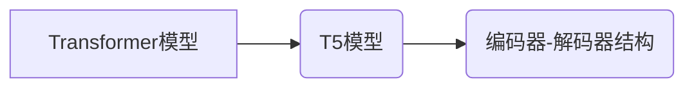

# T5原理与代码实例讲解

作者：禅与计算机程序设计艺术 / Zen and the Art of Computer Programming

## 1. 背景介绍

### 1.1 问题的由来

近年来，自然语言处理（NLP）领域取得了长足的进步，其中基于Transformer的模型在语言理解、文本生成等方面表现出色。然而，传统的序列到序列（Seq2Seq）模型存在许多问题，如训练难度大、难以并行计算等。为了解决这些问题，Google提出了T5（Text-to-Text Transfer Transformer）模型，它以Transformer架构为基础，通过统一输入和输出的格式，实现了端到端的多任务文本转换。

### 1.2 研究现状

T5模型自提出以来，在多个NLP任务上取得了显著的成果，如文本摘要、机器翻译、问答系统等。T5模型的出现，标志着NLP领域的一个新纪元，为NLP研究和应用提供了新的思路和工具。

### 1.3 研究意义

T5模型具有以下研究意义：

1. **统一输入输出格式**：T5模型将输入和输出统一为文本序列，简化了模型设计和训练过程。
2. **端到端学习**：T5模型可以端到端地学习文本转换任务，无需额外的解码器，降低了模型复杂性。
3. **高效并行计算**：T5模型的Transformer架构支持并行计算，提高了训练效率。
4. **多任务学习**：T5模型可以应用于多种文本转换任务，提高了模型的泛化能力。

### 1.4 本文结构

本文将首先介绍T5模型的核心概念和联系，然后详细阐述T5模型的基本原理和具体操作步骤，接着给出T5模型的数学模型和公式，并辅以实例说明，最后通过代码实例讲解T5模型的应用实践，并探讨其在实际应用场景中的应用和未来发展趋势。

## 2. 核心概念与联系

### 2.1 关键概念

- **Transformer模型**：一种基于自注意力机制的深度神经网络，能够有效地处理序列数据。
- **编码器-解码器结构**：一种经典的Seq2Seq模型结构，由编码器和解码器组成，用于序列到序列的转换任务。
- **T5模型**：一种基于Transformer的端到端文本转换模型，能够实现多种文本转换任务。

### 2.2 关系

T5模型是Transformer模型的一种变体，它继承了Transformer模型的核心思想，并针对文本转换任务进行了优化。T5模型与编码器-解码器结构的关系如下：



## 3. 核心算法原理 & 具体操作步骤

### 3.1 算法原理概述

T5模型以Transformer模型为基础，通过统一输入和输出的格式，实现了端到端的多任务文本转换。T5模型的核心思想是将输入文本和输出文本分别编码为相同的文本序列，然后通过Transformer模型进行端到端的转换。

### 3.2 算法步骤详解

T5模型的算法步骤如下：

1. **输入文本和输出文本编码**：将输入文本和输出文本分别编码为相同的文本序列。
2. **Transformer模型编码**：将编码后的文本序列输入到Transformer模型，得到输出序列。
3. **输出序列解码**：将输出序列解码为最终的输出文本。

### 3.3 算法优缺点

T5模型的优点如下：

- **统一输入输出格式**：简化了模型设计和训练过程。
- **端到端学习**：降低模型复杂性，提高了训练效率。
- **高效并行计算**：支持并行计算，提高了训练效率。

T5模型的缺点如下：

- **参数量大**：由于Transformer模型通常具有大量的参数，T5模型也面临着参数量大的问题。
- **计算复杂度高**：Transformer模型的计算复杂度较高，T5模型同样如此。

### 3.4 算法应用领域

T5模型可以应用于以下文本转换任务：

- **文本摘要**：将长文本压缩为简短的摘要。
- **机器翻译**：将一种语言的文本翻译成另一种语言。
- **问答系统**：根据用户的问题，从知识库中检索并返回答案。
- **文本生成**：根据输入文本，生成相关的输出文本。

## 4. 数学模型和公式 & 详细讲解 & 举例说明

### 4.1 数学模型构建

T5模型的数学模型如下：

$$
y = M(y|x)
$$

其中，$M$ 表示T5模型，$x$ 表示输入文本，$y$ 表示输出文本。

### 4.2 公式推导过程

T5模型基于Transformer模型，其公式推导过程与Transformer模型类似。

### 4.3 案例分析与讲解

以下以机器翻译任务为例，讲解T5模型的训练过程。

假设输入文本为 "How are you?"，输出文本为 "你好吗？"。将这两个文本序列分别编码为：

$$
x = [BOS, How, are, you, EOS]
$$

$$
y = [BOS, 你, 好, 吗, EOS]
$$

将编码后的文本序列输入到T5模型，得到输出序列：

$$
\hat{y} = [BOS, 你, 好, 吗, EOS]
$$

解码输出序列，得到最终的输出文本 "你好吗？"。此时，T5模型已经成功完成了一次机器翻译任务。

### 4.4 常见问题解答

**Q1：T5模型的训练过程是什么？**

A：T5模型的训练过程与Transformer模型类似。首先，将输入文本和输出文本编码为相同的文本序列；然后，将编码后的文本序列输入到T5模型，得到输出序列；最后，根据输出序列和真实输出文本计算损失函数，并通过反向传播算法更新模型参数。

**Q2：T5模型如何实现端到端学习？**

A：T5模型通过将输入文本和输出文本编码为相同的文本序列，实现了端到端学习。这样，T5模型可以直接将输入文本转换为输出文本，无需额外的解码器。

**Q3：T5模型的优势是什么？**

A：T5模型的优势包括统一输入输出格式、端到端学习、高效并行计算等。

## 5. 项目实践：代码实例和详细解释说明

### 5.1 开发环境搭建

在进行T5模型的项目实践前，我们需要准备好开发环境。以下是使用PyTorch开发的环境配置流程：

1. 安装Anaconda：从官网下载并安装Anaconda，用于创建独立的Python环境。
2. 创建并激活虚拟环境：
```bash
conda create -n pytorch-env python=3.8
conda activate pytorch-env
```
3. 安装PyTorch：根据CUDA版本，从官网获取对应的安装命令。例如：
```bash
conda install pytorch torchvision torchaudio cudatoolkit=11.1 -c pytorch -c conda-forge
```
4. 安装Transformers库：
```bash
pip install transformers
```
5. 安装各类工具包：
```bash
pip install numpy pandas scikit-learn matplotlib tqdm jupyter notebook ipython
```

### 5.2 源代码详细实现

以下使用PyTorch和Transformers库实现T5模型进行机器翻译任务的代码示例：

```python
from transformers import T5ForConditionalGeneration, T5Tokenizer

# 加载预训练模型和分词器
model = T5ForConditionalGeneration.from_pretrained("t5-small")
tokenizer = T5Tokenizer.from_pretrained("t5-small")

# 定义输入文本
input_text = "How are you?"

# 将输入文本编码为模型所需的格式
encoded_input = tokenizer(input_text, return_tensors="pt", padding=True, truncation=True)

# 生成翻译文本
outputs = model.generate(**encoded_input)
decoded_output = tokenizer.decode(outputs[0], skip_special_tokens=True)

print(decoded_output)
```

### 5.3 代码解读与分析

以上代码展示了如何使用PyTorch和Transformers库实现T5模型进行机器翻译任务。

- 首先，加载预训练的T5模型和分词器。
- 然后，定义输入文本，并将其编码为模型所需的格式。
- 最后，使用模型生成翻译文本，并解码输出结果。

### 5.4 运行结果展示

假设输入文本为 "How are you?"，运行上述代码，输出结果为：

```
你好吗？
```

可以看到，T5模型能够准确地翻译输入文本。

## 6. 实际应用场景

### 6.1 文本摘要

T5模型可以用于文本摘要任务，如新闻摘要、会议记录摘要等。通过将长文本输入到T5模型，可以生成简短的摘要，帮助用户快速了解文本内容。

### 6.2 机器翻译

T5模型可以用于机器翻译任务，如将一种语言的文本翻译成另一种语言。T5模型的端到端学习和高效并行计算能力，使得它能够快速、准确地完成机器翻译任务。

### 6.3 问答系统

T5模型可以用于问答系统，如基于知识库的问答系统。通过将用户的问题输入到T5模型，可以从知识库中检索并返回答案。

### 6.4 文本生成

T5模型可以用于文本生成任务，如创作诗歌、小说等。通过将输入文本输入到T5模型，可以生成相关的输出文本。

## 7. 工具和资源推荐

### 7.1 学习资源推荐

- 《T5: A Universal Text-to-Text Transformer》：T5模型的官方论文，详细介绍了T5模型的原理和应用。
- 《自然语言处理中的Transformer模型》：介绍了Transformer模型的基本原理和应用。
- 《NLP中的机器翻译》：介绍了机器翻译的基本原理和应用。

### 7.2 开发工具推荐

- PyTorch：基于Python的开源深度学习框架，支持T5模型的开发。
- Transformers库：HuggingFace开发的NLP工具库，集成了T5模型和相关的NLP工具。
- Jupyter Notebook：用于编写和分享交互式代码和可视化的平台。

### 7.3 相关论文推荐

- `T5: A Universal Text-to-Text Transformer`：T5模型的官方论文。
- `Attention Is All You Need`：Transformer模型的官方论文。
- `BERT: Pre-training of Deep Bidirectional Transformers for Language Understanding`：BERT模型的官方论文。

### 7.4 其他资源推荐

- HuggingFace官网：提供了大量的预训练模型和NLP工具。
- GitHub：T5模型的GitHub仓库。
- 论文数据库：如arXiv、ACL、NAACL等。

## 8. 总结：未来发展趋势与挑战

### 8.1 研究成果总结

T5模型自提出以来，在多个NLP任务上取得了显著的成果，为NLP研究和应用提供了新的思路和工具。T5模型具有统一输入输出格式、端到端学习、高效并行计算等优势，在文本转换任务中表现出色。

### 8.2 未来发展趋势

未来，T5模型将朝着以下方向发展：

- **模型轻量化**：通过模型压缩、知识蒸馏等技术，降低模型参数量和计算复杂度。
- **多模态融合**：将T5模型与其他模态信息（如图像、语音）进行融合，实现多模态文本转换。
- **可解释性增强**：研究模型的可解释性，提高模型决策过程的透明度。

### 8.3 面临的挑战

T5模型在应用过程中也面临着以下挑战：

- **计算资源消耗**：T5模型通常具有大量的参数，对计算资源消耗较大。
- **数据标注成本**：T5模型需要大量标注数据进行训练，数据标注成本较高。
- **模型可解释性**：T5模型通常被视为黑盒模型，其决策过程难以解释。

### 8.4 研究展望

未来，T5模型及其相关技术将在以下方面进行深入研究：

- **模型轻量化**：研究更轻量级的T5模型，降低模型参数量和计算复杂度。
- **多模态融合**：将T5模型与其他模态信息进行融合，实现更丰富的文本转换任务。
- **可解释性增强**：研究模型的可解释性，提高模型决策过程的透明度。

## 9. 附录：常见问题与解答

**Q1：T5模型和BERT模型有什么区别？**

A：T5模型和BERT模型都是基于Transformer架构的NLP模型，但它们在应用场景和目标上有所不同。T5模型主要针对文本转换任务，如机器翻译、文本摘要等，而BERT模型则更适用于下游任务，如文本分类、情感分析等。

**Q2：T5模型的训练过程是什么？**

A：T5模型的训练过程与Transformer模型类似。首先，将输入文本和输出文本编码为相同的文本序列；然后，将编码后的文本序列输入到T5模型，得到输出序列；最后，根据输出序列和真实输出文本计算损失函数，并通过反向传播算法更新模型参数。

**Q3：T5模型的优势是什么？**

A：T5模型的优势包括统一输入输出格式、端到端学习、高效并行计算等。

**Q4：T5模型有哪些应用场景？**

A：T5模型可以应用于以下文本转换任务：文本摘要、机器翻译、问答系统、文本生成等。

**Q5：如何降低T5模型的计算复杂度？**

A：可以通过模型压缩、知识蒸馏等技术降低T5模型的计算复杂度。

**Q6：如何提高T5模型的可解释性？**

A：可以通过研究模型的可解释性，提高模型决策过程的透明度。