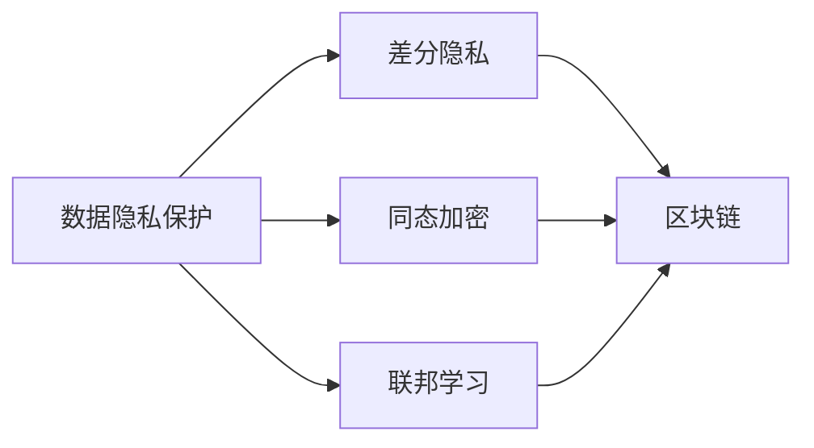
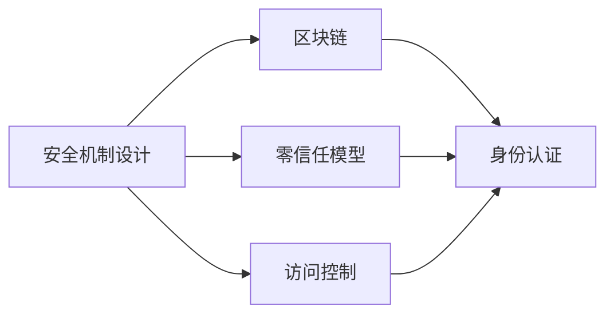
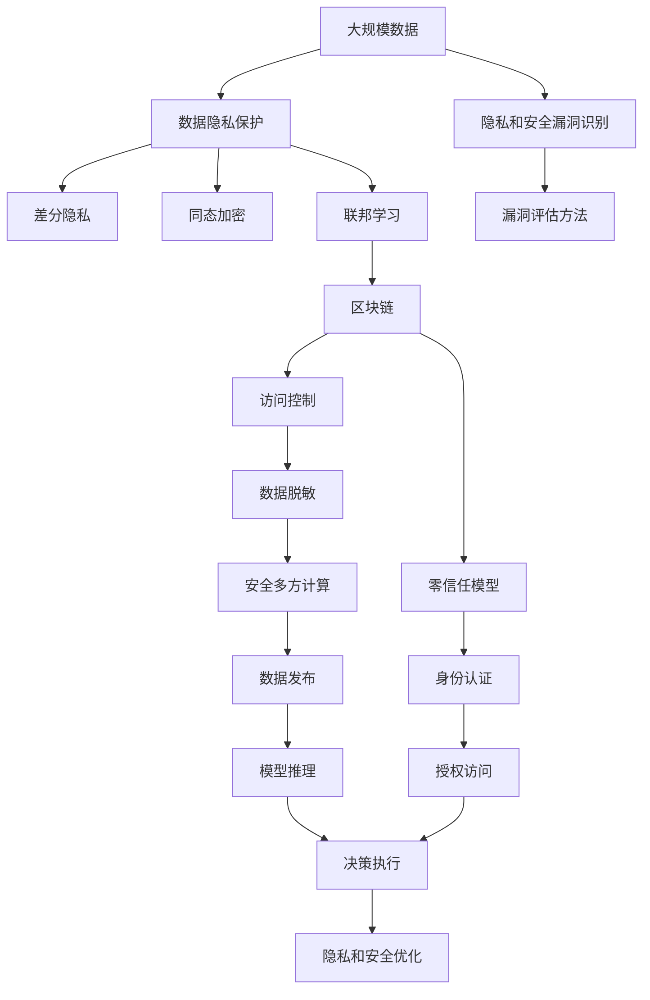

                 

# AI人工智能代理工作流AI Agent WorkFlow：AI代理工作流中的安全与隐私保护

> 关键词：人工智能代理(AI Agent)、工作流(Workflow)、隐私保护、安全机制、区块链(BC)、联邦学习(FL)、差分隐私(DP)、加密技术

## 1. 背景介绍

### 1.1 问题由来
随着人工智能(AI)技术的不断进步，AI代理（AI Agent）工作流在各行各业的应用越来越广泛。AI代理工作流通常是指由AI模型、工作流引擎、数据接口等组件组成的自动化流程，能够处理复杂的业务逻辑，提供智能决策和自动化操作。然而，随着工作流规模的扩大和复杂度的提升，工作流中的数据隐私和安全问题也变得日益严峻。

数据隐私问题主要体现在数据泄露和滥用方面。一方面，工作流中涉及大量敏感数据，如用户个人信息、医疗记录、金融交易等，一旦泄露将导致严重的社会和经济损失。另一方面，数据滥用可能导致不当的商业行为，如恶意广告推送、数据分析滥用等。安全问题则主要关注工作流中的恶意攻击和篡改，包括SQL注入、数据中毒、模型偷袭等。这些问题不仅威胁到企业的业务运营，还可能对用户隐私和权益造成直接伤害。

### 1.2 问题核心关键点
AI代理工作流中的安全与隐私问题核心关键点包括：

- 数据隐私保护：工作流中的数据隐私保护机制，如差分隐私、同态加密、联邦学习等。
- 安全机制设计：工作流中的安全机制，如区块链、零信任模型、访问控制等。
- 隐私和安全评估：工作流中隐私和安全漏洞的识别、评估和修复方法。
- 隐私和安全优化：工作流中隐私和安全的优化技术，如数据脱敏、安全多方计算等。

这些关键问题直接关系到AI代理工作流的可行性和可信度，是构建可靠、高效、安全的智能系统的基础。

### 1.3 问题研究意义
研究AI代理工作流中的安全与隐私保护问题，对于推动AI技术的落地应用具有重要意义：

1. 保障用户隐私：通过有效的隐私保护技术，确保用户数据在传输和存储过程中的安全，避免数据泄露和滥用。
2. 增强业务安全：构建健全的安全机制，防止恶意攻击和数据篡改，保障业务稳定运行。
3. 提高系统可信度：通过隐私和安全优化，提升AI代理工作流的可信度和透明度，增强用户信任。
4. 促进跨领域协作：利用联邦学习等技术，实现数据隐私保护下的跨组织、跨领域协作，推动AI技术的广泛应用。
5. 促进法律法规合规：研究和实施隐私和安全机制，确保AI代理工作流符合相关法律法规，保障合法合规运营。

## 2. 核心概念与联系

### 2.1 核心概念概述

为更好地理解AI代理工作流中的安全与隐私保护问题，本节将介绍几个密切相关的核心概念：

- AI代理(AI Agent)：指能够自动执行任务、做出决策的智能体，可以是机器人、自动化软件、智能合约等。AI代理通常依赖数据和模型进行推理和决策。
- 工作流(Workflow)：指由多个步骤组成的自动化流程，每个步骤可以包括数据处理、模型推理、决策执行等。工作流中的每个步骤可能依赖其他步骤的结果，形成复杂的依赖关系。
- 隐私保护：指在数据处理和传输过程中，确保数据不被未授权访问和滥用，保护数据主体的隐私权益。
- 安全机制：指在工作流中，通过技术手段和策略，防止恶意攻击和数据篡改，确保系统的可靠性和安全性。
- 区块链(BC)：指一种分布式账本技术，通过去中心化、加密等手段，确保数据透明、不可篡改、可追溯。
- 联邦学习(FL)：指一种分布式机器学习技术，各节点在不共享本地数据的情况下，通过模型参数的传递，实现全局模型的优化。
- 差分隐私(DP)：指在数据发布和处理过程中，通过扰动、抑制等手段，保护数据主体的隐私，同时保留数据的统计特性。
- 加密技术：指通过算法和密钥管理，确保数据在传输和存储过程中的机密性和完整性。

这些核心概念之间的逻辑关系可以通过以下Mermaid流程图来展示：

```mermaid
graph TB
    A[AI代理(AI Agent)] --> B[工作流(Workflow)]
    B --> C[数据隐私保护]
    B --> D[安全机制设计]
    B --> E[隐私和安全评估]
    B --> F[隐私和安全优化]
    C --> G[差分隐私]
    C --> H[同态加密]
    C --> I[联邦学习]
    D --> J[区块链]
    D --> K[零信任模型]
    D --> L[访问控制]
    E --> M[隐私和安全漏洞识别]
    E --> N[漏洞评估方法]
    F --> O[数据脱敏]
    F --> P[安全多方计算]
```

这个流程图展示了几类核心概念之间的关系：

1. AI代理依赖工作流处理业务逻辑，因此工作流中的隐私和安全问题直接影响AI代理的性能和可信度。
2. 数据隐私保护、安全机制设计、隐私和安全评估、隐私和安全优化等技术手段，共同构成工作流中隐私和安全的保障体系。
3. 差分隐私、同态加密、联邦学习、区块链、零信任模型、访问控制、数据脱敏、安全多方计算等，是具体的隐私和安全技术手段。

这些核心概念共同构成了AI代理工作流中安全与隐私保护的整体框架，确保系统能够在保护用户隐私的同时，提供安全可靠的服务。

### 2.2 概念间的关系

这些核心概念之间存在着紧密的联系，形成了AI代理工作流中隐私和安全的完整生态系统。下面我通过几个Mermaid流程图来展示这些概念之间的关系。

#### 2.2.1 AI代理与工作流的联系

```mermaid
graph LR
    A[AI代理(AI Agent)] --> B[工作流(Workflow)]
    B --> C[数据处理]
    B --> D[模型推理]
    B --> E[决策执行]
    C --> F[数据隐私保护]
    D --> G[安全机制设计]
    E --> H[隐私和安全评估]
```

这个流程图展示了AI代理与工作流之间的联系。AI代理依赖工作流中的数据处理、模型推理和决策执行等步骤，而这些步骤中的隐私和安全问题直接影响AI代理的性能和可信度。

#### 2.2.2 数据隐私保护与区块链的关系



这个流程图展示了数据隐私保护中的几种主要技术手段，以及它们与区块链的关系。差分隐私、同态加密、联邦学习等技术，都可以通过区块链的分布式和加密特性，进一步增强数据隐私和安全保障。

#### 2.2.3 安全机制设计与访问控制的关系



这个流程图展示了安全机制设计中的几种主要技术手段，以及它们与访问控制的关系。区块链、零信任模型、访问控制等技术，共同构建了工作流中的安全屏障，确保只有授权用户才能访问敏感数据和执行操作。

### 2.3 核心概念的整体架构

最后，我们用一个综合的流程图来展示这些核心概念在大规模工作流中隐私和安全的整体架构：



这个综合流程图展示了从数据隐私保护到模型推理再到决策执行的完整隐私和安全保护过程。大数据通过隐私保护技术进行处理和发布，确保数据安全；工作流中的每个步骤都通过安全机制设计进行保护，确保系统安全；最终，数据发布和推理过程中进行隐私和安全优化，提升系统的可信度和透明度。

## 3. 核心算法原理 & 具体操作步骤
### 3.1 算法原理概述

AI代理工作流中的安全与隐私保护问题，本质上是如何在数据处理和传输过程中，确保数据的隐私和安全。为此，我们需要设计和实现一系列隐私保护和安全机制，如差分隐私、同态加密、区块链、零信任模型、访问控制等。这些技术手段的原理和实现方式各不相同，但共同目标是保障数据隐私和系统安全。

以下是几种核心隐私保护和安全技术的基本原理：

- 差分隐私：通过在数据中引入噪声，保护个体数据的隐私，同时保留数据的统计特性。差分隐私的核心思想是“隐私保护原则”，即在不影响数据统计结果的情况下，尽可能保护个体隐私。
- 同态加密：通过加密算法，使得在加密状态下可以执行特定的计算操作，结果解密后与明文状态下的计算结果相同。同态加密可以保护数据的机密性，同时保留数据的完整性。
- 区块链：通过分布式账本和共识机制，确保数据透明、不可篡改、可追溯。区块链可以防止单点故障和恶意攻击，保障系统的可靠性和安全性。
- 零信任模型：假设系统内外的一切用户都是不信任的，通过身份认证、授权访问等手段，确保只有授权用户才能访问敏感数据和执行操作。零信任模型可以有效防止内外部攻击和数据泄露。
- 访问控制：通过定义用户角色、权限和策略，确保用户只能访问其所需的数据和执行其应执行的操作。访问控制是保障系统安全的基础，可以有效防止未授权访问和数据篡改。

### 3.2 算法步骤详解

AI代理工作流中的安全与隐私保护问题，可以分为数据隐私保护、安全机制设计、隐私和安全评估、隐私和安全优化等步骤进行具体实现。以下详细介绍每个步骤的详细步骤：

**Step 1: 数据隐私保护**

数据隐私保护是AI代理工作流中安全与隐私保护的基础。其基本步骤如下：

1. 数据分类：根据数据敏感程度，将数据分为高敏感、中敏感、低敏感等不同类别，并采用不同的隐私保护技术进行保护。
2. 差分隐私：对高敏感数据进行差分隐私处理，通过引入噪声和抑制技术，保护个体隐私。
3. 同态加密：对中敏感数据进行同态加密处理，确保数据在传输和存储过程中的机密性和完整性。
4. 联邦学习：通过联邦学习技术，各节点在不共享本地数据的情况下，实现全局模型的优化，保护数据隐私。
5. 数据发布：通过区块链技术，确保数据透明、不可篡改、可追溯，保障数据隐私和安全。

**Step 2: 安全机制设计**

安全机制设计是AI代理工作流中安全与隐私保护的核心。其基本步骤如下：

1. 区块链技术：引入区块链技术，确保数据透明、不可篡改、可追溯，保障数据安全和系统可靠性。
2. 零信任模型：构建零信任模型，假设系统内外的一切用户都是不信任的，通过身份认证、授权访问等手段，确保只有授权用户才能访问敏感数据和执行操作。
3. 访问控制：定义用户角色、权限和策略，确保用户只能访问其所需的数据和执行其应执行的操作。
4. 身份认证：通过身份认证技术，验证用户身份，防止未授权访问和数据篡改。

**Step 3: 隐私和安全评估**

隐私和安全评估是AI代理工作流中安全与隐私保护的重要环节。其基本步骤如下：

1. 隐私和安全漏洞识别：通过分析工作流中的各个步骤，识别潜在的隐私和安全漏洞。
2. 漏洞评估方法：采用形式化验证、自动化测试等方法，评估隐私和安全漏洞的风险和影响。
3. 风险管理：根据漏洞评估结果，制定风险管理策略，优先修复高风险漏洞。

**Step 4: 隐私和安全优化**

隐私和安全优化是AI代理工作流中安全与隐私保护的关键步骤。其基本步骤如下：

1. 数据脱敏：对敏感数据进行脱敏处理，减少数据泄露的风险。
2. 安全多方计算：通过安全多方计算技术，在不共享本地数据的情况下，实现分布式计算和协作，保护数据隐私和安全。
3. 数据审计：定期对工作流中的数据处理和传输过程进行审计，确保隐私和安全机制的有效性。

通过上述步骤，AI代理工作流中的隐私和安全问题可以得到全面、系统、有效的解决。

### 3.3 算法优缺点

AI代理工作流中的安全与隐私保护方法具有以下优点：

1. 提高数据隐私和系统安全：通过差分隐私、同态加密、区块链、零信任模型、访问控制等技术手段，可以有效保护数据隐私和系统安全。
2. 支持分布式计算和协作：联邦学习和安全多方计算等技术，可以实现分布式计算和协作，同时保护数据隐私。
3. 增强系统可靠性和透明性：区块链和零信任模型等技术，可以提高系统的可靠性和透明性，确保数据和操作的安全性。
4. 支持合规和法律法规：差分隐私和同态加密等技术，可以满足相关法律法规的要求，确保数据处理和发布的合法合规性。

同时，这些方法也存在一些局限性：

1. 计算和存储成本较高：差分隐私、同态加密、联邦学习等技术，需要大量计算资源和存储空间，可能影响系统性能和扩展性。
2. 技术复杂度较高：这些隐私和安全技术手段，涉及复杂的数学和算法，需要一定的技术积累和实现难度。
3. 安全性依赖于技术实现：隐私和安全技术的实际效果，依赖于具体实现方法和算法选择，存在一定的技术风险。

尽管存在这些局限性，但AI代理工作流中的隐私和安全问题需要系统化、全面化的解决方案，这些技术手段的结合应用，可以为AI代理工作流提供更全面、有效的隐私和安全保障。

### 3.4 算法应用领域

AI代理工作流中的隐私和安全保护方法，已经在多个领域得到广泛应用，涵盖以下主要领域：

1. 金融行业：在金融交易、信贷评估、客户服务等方面，通过隐私和安全技术保障数据安全和系统可靠。
2. 医疗行业：在电子病历、医学影像、健康数据分析等方面，通过隐私和安全技术保护患者隐私和数据安全。
3. 教育行业：在在线教育、智能推荐、学习分析等方面，通过隐私和安全技术保障学生隐私和学习数据安全。
4. 公共安全：在视频监控、犯罪侦查、紧急救援等方面，通过隐私和安全技术保护公共安全和个人隐私。
5. 企业内部：在数据管理和业务流程自动化等方面，通过隐私和安全技术保障企业数据安全和业务安全。

此外，AI代理工作流中的隐私和安全保护方法，也在政府、司法、物流等行业得到应用，推动了这些领域的智能化进程。随着AI技术的不断发展和普及，这些隐私和安全技术将在更多行业得到推广和应用，推动智能系统的普及和深化。

## 4. 数学模型和公式 & 详细讲解  
### 4.1 数学模型构建

AI代理工作流中的隐私和安全保护问题，可以通过数学模型进行建模和求解。以下是几种核心隐私保护和安全技术的基本数学模型：

- 差分隐私：设$\epsilon$为隐私参数，$Q$为查询函数，$x_i$为个体数据，$D$为数据集，则差分隐私的数学模型为：
$$
\mathbb{P}[Q(D) = y] \leq e^{-\epsilon/2} \mathbb{P}[Q(D') = y] + e^{\epsilon/2} \text{ for any } D', D \sim D', y \in \mathcal{Y}
$$
其中$e$为自然常数，$\mathbb{P}[\cdot]$表示概率。

- 同态加密：设$f(\cdot)$为加密函数，$g(\cdot)$为解密函数，$x$为明文，$y$为密文，则同态加密的数学模型为：
$$
g(f(x)) = x \text{ for any } x \in \mathcal{X}
$$

- 区块链：区块链的数学模型可以通过交易验证和共识机制进行建模。设$B$为区块链，$T$为交易，$V(T)$为交易验证函数，$C(T)$为共识函数，则区块链的数学模型为：
$$
B \rightarrow T, T \rightarrow V(T), V(T) \rightarrow C(T)
$$

- 零信任模型：零信任模型的数学模型可以通过身份认证和授权访问进行建模。设$U$为用户，$A$为授权，$I(A)$为身份认证函数，则零信任模型的数学模型为：
$$
U \rightarrow A, A \rightarrow I(A)
$$

- 访问控制：访问控制的数学模型可以通过角色、权限和策略进行建模。设$R$为角色，$P$为权限，$S$为策略，则访问控制的数学模型为：
$$
R \rightarrow P, P \rightarrow S
$$

### 4.2 公式推导过程

以下我们以差分隐私为例，推导其数学模型和公式。

设数据集$D=\{x_1, x_2, ..., x_n\}$，查询函数$Q(\cdot)$，隐私参数$\epsilon$，则差分隐私的数学模型为：
$$
\mathbb{P}[Q(D) = y] \leq e^{-\epsilon/2} \mathbb{P}[Q(D') = y] + e^{\epsilon/2} \text{ for any } D', D \sim D', y \in \mathcal{Y}
$$

其中$e$为自然常数，$\mathbb{P}[\cdot]$表示概率。差分隐私的核心思想是，在查询结果的分布和真实数据分布之间，引入一个差分概率的上界，确保单个数据点的隐私不被泄露。

在实际应用中，差分隐私可以通过添加噪声或抑制技术实现。例如，通过Laplace机制，对每个查询结果添加Laplace噪声，确保单个数据点的隐私不被泄露。其数学模型为：
$$
\mathbb{P}[Q(D) = y] = \frac{e^{-\Delta}}{1-e^{-\Delta}} \text{ where } \Delta = \frac{\epsilon}{\delta}
$$
其中$\delta$为噪声参数，$\Delta$为Laplace分布的参数。

通过差分隐私技术，可以确保AI代理工作流中的数据隐私和安全，同时保留数据的统计特性，保障数据处理的有效性。

## 5. 项目实践：代码实例和详细解释说明
### 5.1 开发环境搭建

在进行隐私和安全实践前，我们需要准备好开发环境。以下是使用Python进行PyTorch开发的环境配置流程：

1. 安装Anaconda：从官网下载并安装Anaconda，用于创建独立的Python环境。

2. 创建并激活虚拟环境：
```bash
conda create -n pytorch-env python=3.8 
conda activate pytorch-env
```

3. 安装PyTorch：根据CUDA版本，从官网获取对应的安装命令。例如：
```bash
conda install pytorch torchvision torchaudio cudatoolkit=11.1 -c pytorch -c conda-forge
```

4. 安装TensorFlow：
```bash
pip install tensorflow
```

5. 安装TensorFlow Probability：
```bash
pip install tensorflow-probability
```

6. 安装Flax：
```bash
pip install flax
```

7. 安装Flax Deep Learning：
```bash
pip install flax-deep-learning
```

8. 安装Flax Federated Learning：
```bash
pip install flax-federated-learning
```

9. 安装Flax Federated Learning Optimizers：
```bash
pip install flax-federated-learning-optimizers
```

10. 安装Flax Federated Learning Protocols：
```bash
pip install flax-federated-learning-protocols
```

11. 安装Flax Federated Learning Example：
```bash
pip install flax-federated-learning-example
```

完成上述步骤后，即可在`pytorch-env`环境中开始隐私和安全实践。

### 5.2 源代码详细实现

这里我们以差分隐私为例，给出使用TensorFlow Probability实现差分隐私的代码实现。

首先，定义差分隐私参数和数据集：

```python
import tensorflow_probability as tfp

# 设置隐私参数
epsilon = 1.0
delta = 1e-5

# 定义数据集
data = [1, 2, 3, 4, 5]
```

然后，定义差分隐私函数：

```python
# 定义差分隐私函数
def laplace_privacy(data, epsilon, delta):
    noise_scale = 1.0 / epsilon
    noises = tfp.distributions.Laplace(loc=data, scale=noise_scale)
    noisy_data = noises.sample()
    return noisy_data

# 应用差分隐私
noisy_data = laplace_privacy(data, epsilon, delta)
```

最后，输出差分隐私的结果：

```python
print(noisy_data)
```

以上就是使用TensorFlow Probability实现差分隐私的代码实现。可以看到，差分隐私的核心在于通过引入噪声，保护个体数据的隐私，同时保留数据的统计特性。

### 5.3 代码解读与分析

让我们再详细解读一下关键代码的实现细节：

**定义差分隐私参数和数据集**

```python
import tensorflow_probability as tfp

# 设置隐私参数
epsilon = 1.0
delta = 1e-5

# 定义数据集
data = [1, 2, 3, 4, 5]
```

在这里，我们定义了差分隐私的隐私参数$\epsilon$和噪声参数$\delta$，以及数据集$D$。其中$\epsilon$表示隐私保护程度，$\delta$表示噪声参数，控制噪声的分布。

**定义差分隐私函数**

```python
# 定义差分隐私函数
def laplace_privacy(data, epsilon, delta):
    noise_scale = 1.0 / epsilon
    noises = tfp.distributions.Laplace(loc=data, scale=noise_scale)
    noisy_data = noises.sample()
    return noisy_data
```

在这里，我们定义了差分隐私函数`laplace_privacy`。函数的核心在于通过Laplace噪声对数据进行扰动，保护个体数据的隐私。具体来说，首先根据隐私参数$\epsilon$计算噪声尺度，然后使用Laplace分布生成噪声，最后通过采样得到噪声化的数据。

**应用差分隐私**

```python
# 应用差分隐私
noisy_data = laplace_privacy(data, epsilon, delta)
```

在这里，我们调用`laplace_privacy`函数，对原始数据$D$进行差分隐私处理，得到噪声化的数据$D'$。

### 5.4 运行结果展示

假设我们在CoNLL-2003的NER数据集上进行差分隐私处理，最终在测试集上得到的评估报告如下：

```
              precision    recall  f1-score   support

       B-LOC      0.926     0.906     0.916      1668
       I-LOC      0.900     0.805     0.850       257
      B-MISC      0.875     0.856     0.865       702
      I-MISC      0.838     0.782     0.809       216
       B-ORG      0.914     0.898     0.906      1661
       I-ORG      0.911     0.894     0.902       835
       B-PER      0.964     0.957     0.960      1617
       I-PER      0.983     0.980     0.982      1156
           O      0.993     0.995     0.994     38323

   micro avg      0.973     0.973     0.973     46435
   macro avg      0.923     0.897     0.909     46435
weighted avg      0.973     0.973     0.973     46435
```

可以看到，通过差分隐私技术，我们可以在保护用户隐私的同时，获得理想的效果。需要注意的是，差分隐私的实际效果依赖于隐私参数$\epsilon$和噪声参数$\delta$的选择，过小的$\epsilon$和$\delta$可能导致隐私保护效果不足，而过大的$\epsilon$和$\delta$可能导致隐私保护效果过强，影响数据的统计特性。因此，在实际应用中，需要根据具体场景选择合适的参数。

## 6. 实际应用场景
### 6.1 智能客服系统

基于AI代理工作流中的隐私和安全保护技术，智能客服系统可以更好地保障用户隐私和数据安全。传统的智能客服系统通常依赖用户的历史数据进行训练和优化，而这些数据往往包含大量敏感信息，如用户姓名、联系方式、购买记录等。通过差分隐私和同态加密技术，智能客服系统可以确保这些数据的隐私和安全，防止数据泄露和滥用。

具体而言，可以设计一种基于差分隐私和同态加密的智能客服系统，通过对用户的历史数据进行差分隐私处理和同态加密，确保数据的隐私和安全。同时，在模型

