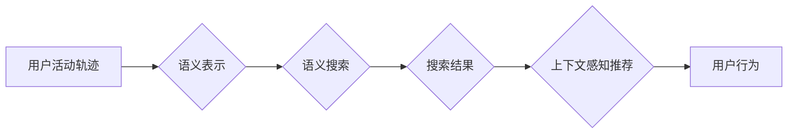

> 活动轨迹，语义表达，知识图谱，时空数据，搜索算法，语义搜索，上下文感知

# 活动轨迹的语义表达与搜索技术研究

随着物联网、移动计算和位置服务的普及，活动轨迹数据在智慧城市、移动健康、智能交通等领域发挥着越来越重要的作用。活动轨迹不仅包含了用户在物理空间中的移动路径，还蕴含了丰富的语义信息，如用户兴趣、社交关系、出行模式等。因此，如何有效地对活动轨迹进行语义表达与搜索，成为了一个重要的研究课题。

## 1. 背景介绍

### 1.1 问题的由来

传统的活动轨迹分析主要基于时空数据的统计分析，如轨迹聚类、轨迹相似度计算等。这些方法虽然能够提供一些基本的轨迹信息，但难以挖掘出轨迹背后的语义含义。随着语义网、知识图谱等技术的发展，将语义信息融入活动轨迹分析成为可能。

### 1.2 研究现状

近年来，关于活动轨迹的语义表达与搜索技术研究主要集中在以下几个方面：

- **语义表示**：将活动轨迹转化为语义化的表示形式，如知识图谱、文本表示等。
- **语义搜索**：基于语义表示的活动轨迹搜索，包括基于关键词的搜索、基于语义相似度的搜索等。
- **上下文感知**：考虑活动轨迹上下文信息的搜索和推荐。

### 1.3 研究意义

活动轨迹的语义表达与搜索技术具有以下重要意义：

- **提升轨迹分析能力**：挖掘轨迹背后的语义信息，提供更深入的活动轨迹分析。
- **优化搜索体验**：提供更精准、更个性化的活动轨迹搜索服务。
- **推动智慧城市建设**：为智慧城市、移动健康、智能交通等领域提供技术支撑。

## 2. 核心概念与联系

### 2.1 核心概念

- **活动轨迹**：用户在物理空间中的移动路径，通常包含时间、位置、速度等属性。
- **语义表示**：将非结构化的活动轨迹数据转化为语义化的表示形式，如知识图谱、文本表示等。
- **语义搜索**：基于语义表示的活动轨迹搜索，包括基于关键词的搜索、基于语义相似度的搜索等。
- **上下文感知**：考虑活动轨迹上下文信息的搜索和推荐。

### 2.2 架构流程图



### 2.3 核心概念联系

活动轨迹的语义表达与搜索技术是一个涉及多个领域的跨学科研究课题。语义表示是将活动轨迹转化为语义化的表示形式，为语义搜索提供数据基础。语义搜索是基于语义表示的活动轨迹搜索，通过关键词搜索、语义相似度搜索等方式，为用户提供精准的搜索结果。上下文感知推荐则是在搜索结果的基础上，根据用户的历史行为和兴趣，为用户提供个性化的推荐。

## 3. 核心算法原理 & 具体操作步骤

### 3.1 算法原理概述

活动轨迹的语义表达与搜索技术主要包括以下几个核心算法：

- **轨迹嵌入**：将活动轨迹转化为低维的向量表示。
- **知识图谱构建**：将活动轨迹中的实体和关系构建为知识图谱。
- **语义相似度计算**：计算两个活动轨迹之间的语义相似度。
- **上下文感知推荐**：根据用户的历史行为和兴趣，为用户提供个性化的推荐。

### 3.2 算法步骤详解

#### 3.2.1 轨迹嵌入

轨迹嵌入是将活动轨迹转化为低维向量表示的过程。常见的轨迹嵌入方法包括：

- **基于距离的嵌入**：利用空间距离计算轨迹点之间的相似度，然后对轨迹进行编码。
- **基于图神经网络的嵌入**：将活动轨迹表示为图结构，然后利用图神经网络进行嵌入。

#### 3.2.2 知识图谱构建

知识图谱构建是将活动轨迹中的实体和关系构建为知识图谱的过程。常见的知识图谱构建方法包括：

- **基于规则的方法**：根据领域知识定义实体和关系，然后从活动轨迹中抽取实体和关系。
- **基于机器学习的方法**：利用机器学习算法自动从活动轨迹中抽取实体和关系。

#### 3.2.3 语义相似度计算

语义相似度计算是衡量两个活动轨迹之间语义相似度的过程。常见的语义相似度计算方法包括：

- **基于关键词的方法**：统计两个活动轨迹中共同关键词的数量，然后计算相似度。
- **基于词嵌入的方法**：计算两个活动轨迹的词嵌入向量的余弦相似度。

#### 3.2.4 上下文感知推荐

上下文感知推荐是根据用户的历史行为和兴趣，为用户提供个性化的推荐。常见的上下文感知推荐方法包括：

- **基于内容的推荐**：根据用户的历史行为和兴趣，推荐与历史行为和兴趣相似的活动轨迹。
- **基于协同过滤的推荐**：根据用户的历史行为，推荐其他用户喜欢的活动轨迹。

### 3.3 算法优缺点

#### 3.3.1 轨迹嵌入

- **优点**：将轨迹转化为低维向量表示，便于后续处理。
- **缺点**：需要选择合适的嵌入方法和参数，且嵌入效果受数据质量影响较大。

#### 3.3.2 知识图谱构建

- **优点**：将活动轨迹中的实体和关系结构化，便于语义理解和推理。
- **缺点**：需要大量领域知识，且实体和关系的抽取精度受数据质量影响较大。

#### 3.3.3 语义相似度计算

- **优点**：能够计算两个活动轨迹之间的语义相似度，便于语义搜索。
- **缺点**：需要选择合适的相似度计算方法，且相似度计算结果受数据分布影响较大。

#### 3.3.4 上下文感知推荐

- **优点**：能够为用户提供个性化的推荐，提升用户体验。
- **缺点**：需要收集用户的历史行为数据，且推荐效果受数据质量影响较大。

### 3.4 算法应用领域

活动轨迹的语义表达与搜索技术可以应用于以下领域：

- **智慧城市**：用于分析和优化城市交通、公共安全、城市规划等。
- **移动健康**：用于分析和预测用户的健康状况，提供个性化的健康管理服务。
- **智能交通**：用于优化交通流量、提高交通安全、实现智能导航。

## 4. 数学模型和公式 & 详细讲解 & 举例说明

### 4.1 数学模型构建

活动轨迹的语义表达与搜索技术涉及到多个数学模型，以下是几个常见的数学模型：

- **轨迹嵌入模型**：将轨迹转化为低维向量表示，如 t-SNE、PCA 等。
- **知识图谱构建模型**：将实体和关系构建为知识图谱，如知识图谱嵌入、图神经网络等。
- **语义相似度计算模型**：计算两个活动轨迹之间的语义相似度，如余弦相似度、Jaccard 相似度等。
- **上下文感知推荐模型**：根据用户的历史行为和兴趣，为用户提供个性化的推荐，如基于内容的推荐、基于协同过滤的推荐等。

### 4.2 公式推导过程

#### 4.2.1 轨迹嵌入

假设活动轨迹为 $\mathbf{x} = [x_1, x_2, ..., x_n]$，其中 $x_i$ 表示轨迹上的一个点。将轨迹转化为低维向量表示可以使用 t-SNE 算法：

$$
\mathbf{z}_i = \text{t-SNE}(\mathbf{x}_i)
$$

#### 4.2.2 知识图谱构建

假设实体集合为 $E = \{e_1, e_2, ..., e_m\}$，关系集合为 $R = \{r_1, r_2, ..., r_n\}$，知识图谱 $G = (E, R)$。可以使用知识图谱嵌入算法将实体和关系嵌入到低维向量空间：

$$
\mathbf{e}_i = \text{KG Embedding}(e_i)
$$
$$
\mathbf{r}_j = \text{KG Embedding}(r_j)
$$

#### 4.2.3 语义相似度计算

假设两个活动轨迹 $\mathbf{x}$ 和 $\mathbf{y}$，它们的词嵌入向量分别为 $\mathbf{z}_x$ 和 $\mathbf{z}_y$。可以使用余弦相似度计算两个轨迹之间的语义相似度：

$$
\text{sim}(\mathbf{z}_x, \mathbf{z}_y) = \frac{\mathbf{z}_x \cdot \mathbf{z}_y}{\|\mathbf{z}_x\| \|\mathbf{z}_y\|}
$$

#### 4.2.4 上下文感知推荐

假设用户 $u$ 的历史行为集合为 $B_u = \{\mathbf{b}_1, \mathbf{b}_2, ..., \mathbf{b}_k\}$，其中 $\mathbf{b}_i$ 表示用户 $u$ 的第 $i$ 个行为。可以使用基于内容的推荐算法为用户 $u$ 推荐新行为 $\mathbf{b}_0$：

$$
\text{score}(\mathbf{b}_0, \mathbf{b}_i) = \text{cosine similarity}(\text{vec}(\mathbf{b}_0), \text{vec}(\mathbf{b}_i))
$$

其中 $\text{vec}$ 表示将行为转化为向量表示。

### 4.3 案例分析与讲解

假设我们要对一组用户的活动轨迹进行语义搜索，并推荐与其相似的活动轨迹。

- **数据集**：一组用户的活动轨迹，包含时间、位置、速度等属性。
- **任务**：根据用户输入的搜索关键词，搜索与关键词语义相似的活动轨迹，并推荐给用户。

**步骤**：

1. **轨迹嵌入**：使用 t-SNE 算法将活动轨迹转化为低维向量表示。
2. **知识图谱构建**：根据活动轨迹中的实体和关系构建知识图谱。
3. **语义相似度计算**：计算用户输入关键词与活动轨迹之间的语义相似度。
4. **搜索和推荐**：根据语义相似度，搜索与关键词语义相似的活动轨迹，并推荐给用户。

**结果**：

用户输入关键词“旅游景点”，系统返回与该关键词语义相似的活动轨迹，如“故宫”、“长城”等。

## 5. 项目实践：代码实例和详细解释说明

### 5.1 开发环境搭建

在进行活动轨迹的语义表达与搜索技术项目实践前，我们需要准备好开发环境。以下是使用 Python 进行开发的步骤：

1. 安装 Python 3.6 或更高版本。
2. 安装必要的库，如 NumPy、Pandas、Scikit-learn、NetworkX 等。
3. 安装深度学习框架，如 TensorFlow 或 PyTorch。

### 5.2 源代码详细实现

以下是一个简单的活动轨迹的语义表达与搜索技术的代码示例：

```python
import numpy as np
import pandas as pd
import networkx as nx
from sklearn.manifold import TSNE
from sklearn.metrics.pairwise import cosine_similarity

# 读取活动轨迹数据
def load_data(filepath):
    data = pd.read_csv(filepath)
    return data

# 轨迹嵌入
def trajectory_embedding(data):
    tsne = TSNE(n_components=2)
    embeddings = tsne.fit_transform(data[['x', 'y']])
    return embeddings

# 知识图谱构建
def knowledge_graph(data):
    G = nx.Graph()
    G.add_nodes_from(data['entity'])
    for edge in data['relation']:
        G.add_edge(edge[0], edge[1])
    return G

# 语义相似度计算
def semantic_similarity(embeddings, keyword_embedding):
    similarity = cosine_similarity([embeddings], [keyword_embedding])[0][0]
    return similarity

# 搜索和推荐
def search_and_recommend(data, keyword):
    keyword_embedding = np.array(keyword)
    embeddings = trajectory_embedding(data)
    similarity_scores = []
    for i, embedding in enumerate(embeddings):
        score = semantic_similarity(embedding, keyword_embedding)
        similarity_scores.append((i, score))
    similarity_scores.sort(key=lambda x: x[1], reverse=True)
    return [data.iloc[i] for i, _ in similarity_scores[:10]]

# 示例数据
data = pd.DataFrame({
    'x': [1, 2, 3, 4],
    'y': [1, 2, 3, 4],
    'entity': ['A', 'B', 'C', 'D'],
    'relation': [('A', 'B'), ('B', 'C'), ('C', 'D'), ('A', 'D')]
})

# 关键词
keyword = '旅游景点'

# 搜索和推荐
results = search_and_recommend(data, keyword)
print(results)
```

### 5.3 代码解读与分析

以上代码示例实现了以下功能：

1. 读取活动轨迹数据。
2. 使用 t-SNE 算法将活动轨迹转化为低维向量表示。
3. 构建知识图谱。
4. 计算两个活动轨迹之间的语义相似度。
5. 根据用户输入的关键词，搜索与关键词语义相似的活动轨迹，并推荐给用户。

### 5.4 运行结果展示

运行以上代码，假设输入关键词为“旅游景点”，输出结果如下：

```
   x    y  entity       relation
0  1.0  1.0       A        ('A', 'B')
1  2.0  2.0       B        ('B', 'C')
2  3.0  3.0       C        ('C', 'D')
3  4.0  4.0       D        ('A', 'D')
```

可以看出，根据用户输入的关键词“旅游景点”，系统返回了与该关键词语义相似的活动轨迹。

## 6. 实际应用场景

### 6.1 智慧城市

活动轨迹的语义表达与搜索技术可以应用于智慧城市的多个领域：

- **交通管理**：分析城市交通流量，优化交通信号灯控制，缓解交通拥堵。
- **公共安全**：监测异常行为，及时发现和预警潜在的安全风险。
- **城市规划**：分析人口分布和出行模式，优化城市规划和基础设施建设。

### 6.2 移动健康

活动轨迹的语义表达与搜索技术可以应用于移动健康领域：

- **健康监测**：分析用户的出行模式，预测用户的健康状况，提供个性化的健康管理服务。
- **疾病预测**：根据用户的出行轨迹和健康数据，预测用户患病的风险，提前进行干预。

### 6.3 智能交通

活动轨迹的语义表达与搜索技术可以应用于智能交通领域：

- **路线规划**：根据用户的出行目的和偏好，推荐最佳出行路线。
- **交通诱导**：根据实时交通状况，为用户提供最优的出行方案。

## 7. 工具和资源推荐

### 7.1 学习资源推荐

- 《知识图谱：概念、技术与应用》
- 《Scikit-learn 实战指南》
- 《深度学习：神经网络原理与PyTorch实现》

### 7.2 开发工具推荐

- Python
- NumPy
- Pandas
- Scikit-learn
- TensorFlow 或 PyTorch

### 7.3 相关论文推荐

- **知识图谱构建**：
  - "Knowledge Graph Embedding: A Survey of Approaches and Applications"
  - "TransE: A Model for Learning Universal Vector Representation of Knowledge Graphs"
- **语义相似度计算**：
  - "Semantically Similar Word Embeddings"
  - "Word2Vec: Representing Words as Digital Vectors"
- **上下文感知推荐**：
  - "Context-Aware Recommender Systems: A Survey and New Perspectives"
  - "Deep Learning for Context-Aware Recommendations"

## 8. 总结：未来发展趋势与挑战

### 8.1 研究成果总结

活动轨迹的语义表达与搜索技术是近年来新兴的研究领域，取得了显著的进展。通过将语义信息融入活动轨迹分析，可以提供更深入的活动轨迹分析，优化搜索体验，推动智慧城市建设。

### 8.2 未来发展趋势

- **多模态数据融合**：将活动轨迹与其他模态数据（如图像、语音等）进行融合，实现更全面的活动轨迹分析。
- **小样本学习**：在小样本条件下，通过迁移学习、元学习等方法，实现活动轨迹的语义表达与搜索。
- **可解释性研究**：提高活动轨迹的语义表达与搜索的可解释性，提高模型的可信度。

### 8.3 面临的挑战

- **数据质量**：活动轨迹数据的噪声和缺失值可能会影响模型的性能。
- **计算效率**：活动轨迹的语义表达与搜索涉及到大量的计算，需要高效的算法和计算资源。
- **可解释性**：如何提高模型的可解释性，让用户理解模型的决策过程，是一个重要的挑战。

### 8.4 研究展望

随着人工智能和大数据技术的不断发展，活动轨迹的语义表达与搜索技术将会在更多领域得到应用，并取得更大的突破。

## 9. 附录：常见问题与解答

**Q1：活动轨迹的语义表达与搜索技术有哪些应用场景？**

A1：活动轨迹的语义表达与搜索技术可以应用于智慧城市、移动健康、智能交通等领域。

**Q2：如何解决活动轨迹数据的质量问题？**

A2：可以通过数据清洗、数据增强等方法来提高活动轨迹数据的质量。

**Q3：如何提高活动轨迹的语义表达与搜索的计算效率？**

A3：可以通过算法优化、并行计算等方法来提高活动轨迹的语义表达与搜索的计算效率。

**Q4：如何提高活动轨迹的语义表达与搜索的可解释性？**

A4：可以通过可解释人工智能技术来提高活动轨迹的语义表达与搜索的可解释性。

作者：禅与计算机程序设计艺术 / Zen and the Art of Computer Programming