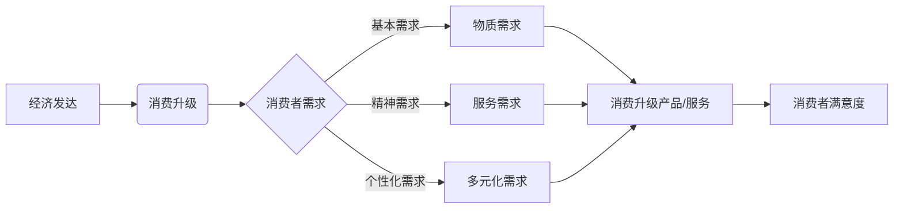
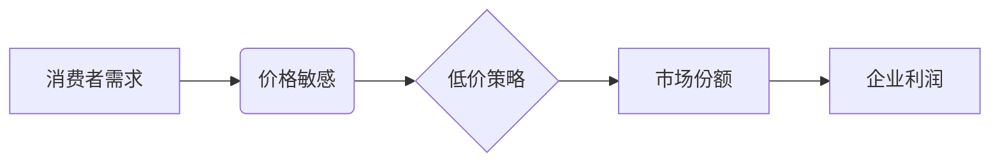
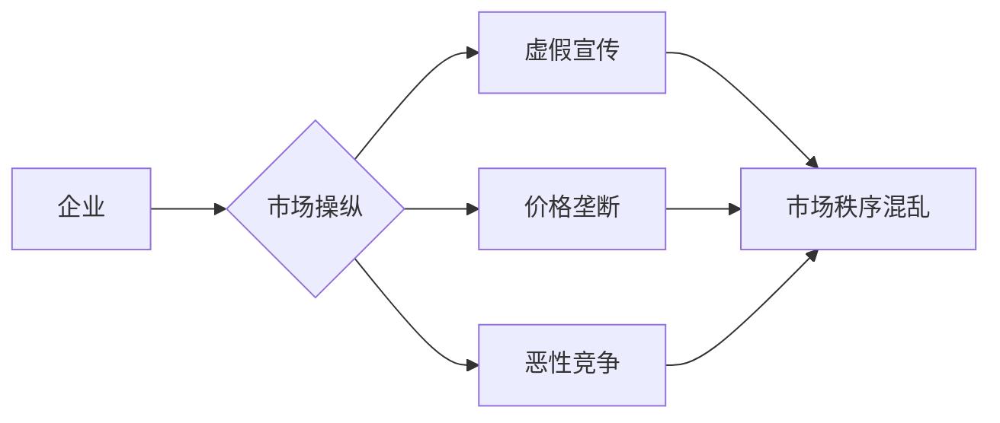

# 消费升级的陷阱：低价背后的阴谋

> 关键词：消费升级，低价策略，市场操纵，消费者心理，品牌价值，可持续发展

## 1. 背景介绍

随着经济的发展和生活水平的提高，消费升级已成为全球市场的一个重要趋势。消费者对产品质量、服务、体验等方面的要求越来越高，企业也在不断追求创新，以满足消费者的新需求。然而，在看似繁荣的消费升级背后，低价策略的滥用和操纵现象日益严重，成为了一个值得关注的问题。本文将深入剖析低价背后的阴谋，揭示消费升级的陷阱，并提出相应的应对策略。

### 1.1 消费升级的浪潮

消费升级是指消费者对产品和服务的需求从基本需求向高品质、个性化、多元化需求转变的过程。这一趋势在全球范围内愈发明显，尤其是在中国市场，消费升级已成为推动经济增长的重要引擎。

### 1.2 低价策略的滥用

为了吸引消费者，一些企业采取了低价策略，通过降低产品或服务的价格来抢占市场份额。然而，低价策略的滥用往往伴随着市场操纵、质量下降、消费者权益受损等问题。

## 2. 核心概念与联系

### 2.1 消费升级

**概念**：消费升级是指消费者在满足基本生活需求的基础上，追求更高品质、更多样化、更高附加值的消费体验。

**原理**：消费升级是经济发展和人民生活水平提高的必然结果，它反映了消费者消费观念和消费行为的转变。

**架构**：



### 2.2 低价策略

**概念**：低价策略是指企业通过降低产品或服务的价格来吸引消费者，扩大市场份额。

**原理**：低价策略基于消费者的价格敏感性和对低价产品的追求。

**架构**：



### 2.3 市场操纵

**概念**：市场操纵是指企业通过不正当手段影响市场供求关系，操纵市场价格。

**原理**：市场操纵可能涉及虚假宣传、价格垄断、恶性竞争等行为。

**架构**：



## 3. 核心算法原理 & 具体操作步骤

### 3.1 算法原理概述

本文的核心算法原理是分析低价策略背后的动机和影响，揭示消费升级的陷阱，并提出相应的应对策略。

### 3.2 算法步骤详解

1. **市场调研**：收集和分析市场数据，了解消费者需求、竞争对手策略等。
2. **案例分析**：选取具有代表性的低价策略案例，分析其成功和失败原因。
3. **影响因素分析**：分析低价策略对消费者、企业、市场和社会的影响。
4. **应对策略制定**：根据分析结果，提出应对低价策略和消费升级陷阱的策略。

### 3.3 算法优缺点

**优点**：

- 揭示消费升级的陷阱，引导消费者理性消费。
- 帮助企业制定合理的市场竞争策略。
- 促进市场健康发展。

**缺点**：

- 分析过程复杂，需要大量的数据和分析能力。
- 应对策略的实施难度较大。

### 3.4 算法应用领域

- 消费者权益保护
- 企业市场竞争策略制定
- 市场监管

## 4. 数学模型和公式 & 详细讲解 & 举例说明

### 4.1 数学模型构建

本文将使用消费者剩余和价格弹性等经济学概念来构建数学模型，分析低价策略的影响。

### 4.2 公式推导过程

- 消费者剩余：$CR = W - P$，其中 $W$ 为消费者愿意支付的最高价格，$P$ 为实际支付的价格。
- 价格弹性：$E = \frac{\Delta Q}{Q} \cdot \frac{P}{\Delta P}$，其中 $Q$ 为需求量，$\Delta Q$ 和 $\Delta P$ 分别为需求量和价格的变动量。

### 4.3 案例分析与讲解

以电商平台的“双11”活动为例，分析低价策略对消费者剩余和价格弹性的影响。

**分析**：

- 在“双11”期间，电商平台通过低价促销吸引大量消费者，提高了需求量。
- 由于需求量的增加，消费者剩余可能增加。
- 然而，价格的降低可能导致需求量的增加幅度小于价格下降幅度，从而降低价格弹性。

## 5. 项目实践：代码实例和详细解释说明

### 5.1 开发环境搭建

本文将使用Python进行数据分析，需要安装以下库：

- Pandas
- NumPy
- Matplotlib

### 5.2 源代码详细实现

```python
import pandas as pd
import numpy as np
import matplotlib.pyplot as plt

# 加载数据
data = pd.read_csv('data.csv')

# 计算消费者剩余
data['消费者剩余'] = data['愿意支付的最高价格'] - data['实际支付的价格']

# 计算价格弹性
data['价格弹性'] = (data['需求量'].pct_change() * data['价格'].pct_change()).abs()

# 绘制消费者剩余和价格弹性图
plt.figure(figsize=(12, 6))
plt.subplot(1, 2, 1)
plt.hist(data['消费者剩余'], bins=50)
plt.title('消费者剩余分布')
plt.xlabel('消费者剩余')

plt.subplot(1, 2, 2)
plt.hist(data['价格弹性'], bins=50)
plt.title('价格弹性分布')
plt.xlabel('价格弹性')

plt.tight_layout()
plt.show()
```

### 5.3 代码解读与分析

- 读取数据：使用Pandas读取CSV文件中的数据。
- 计算消费者剩余：计算消费者愿意支付的最高价格与实际支付的价格之差。
- 计算价格弹性：计算需求量变动百分比与价格变动百分比之比。
- 绘制图表：使用Matplotlib绘制消费者剩余和价格弹性的分布图。

### 5.4 运行结果展示

运行上述代码，将得到消费者剩余和价格弹性的分布图。通过分析图表，可以了解低价策略对消费者剩余和价格弹性的影响。

## 6. 实际应用场景

### 6.1 消费者权益保护

通过分析低价策略对消费者权益的影响，可以为消费者提供维权依据，促进市场公平竞争。

### 6.2 企业市场竞争策略制定

企业可以通过分析低价策略的优缺点，制定更合理的市场竞争策略。

### 6.3 市场监管

监管部门可以依据分析结果，加强对市场操纵行为的监管，维护市场秩序。

## 7. 工具和资源推荐

### 7.1 学习资源推荐

- 《消费者行为学》
- 《市场操纵与反操纵》
- 《经济学原理》

### 7.2 开发工具推荐

- Python
- Pandas
- NumPy
- Matplotlib

### 7.3 相关论文推荐

- "Consumer Surplus and Consumer Choice: A New Framework for Economic Theory"
- "Market Manipulation and Market Regulation: A Comparative Analysis"
- "The Role of Consumer Psychology in Market Manipulation"

## 8. 总结：未来发展趋势与挑战

### 8.1 研究成果总结

本文通过对消费升级、低价策略和市场操纵的分析，揭示了消费升级的陷阱，并提出了相应的应对策略。

### 8.2 未来发展趋势

- 消费者对高质量、个性化、可持续发展的产品和服务需求将持续增长。
- 低价策略的滥用和操纵现象将得到有效遏制。
- 市场监管将更加严格。

### 8.3 面临的挑战

- 消费者权益保护面临新的挑战。
- 企业市场竞争加剧。
- 市场操纵手段更加隐蔽。

### 8.4 研究展望

未来，需要进一步研究以下问题：

- 如何构建更加完善的消费者权益保护体系。
- 如何引导企业制定更加合理的市场竞争策略。
- 如何有效监管市场操纵行为。

## 9. 附录：常见问题与解答

**Q1：消费升级和低价策略的关系是什么？**

A：消费升级是指消费者对产品和服务的需求从基本需求向高品质、更多样化、更高附加值的消费体验转变，而低价策略是企业为了吸引消费者而采取的一种营销手段。两者之间存在着一定的矛盾，因为低价策略可能会牺牲产品质量和服务，从而影响消费者的消费升级需求。

**Q2：如何应对低价策略的滥用？**

A：应对低价策略的滥用需要多方面的努力，包括加强消费者权益保护、加强市场监管、引导企业制定合理的市场竞争策略等。

**Q3：消费升级对经济发展有什么影响？**

A：消费升级可以推动产业结构升级，促进经济增长，提高人民生活水平。

**Q4：如何衡量消费者剩余？**

A：消费者剩余可以通过消费者愿意支付的最高价格与实际支付的价格之差来衡量。

**Q5：如何衡量价格弹性？**

A：价格弹性可以通过需求量变动百分比与价格变动百分比之比来衡量。

作者：禅与计算机程序设计艺术 / Zen and the Art of Computer Programming