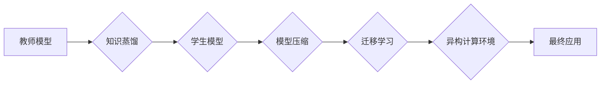

# 知识蒸馏在异构计算环境中的应用

> 关键词：知识蒸馏，异构计算，模型压缩，迁移学习，性能优化，能耗降低，边缘计算，云计算

## 1. 背景介绍

随着深度学习在各个领域的广泛应用，模型的规模和复杂性不断增加。大型深度学习模型通常需要高性能的硬件资源进行训练和推理，这在计算成本和资源消耗上带来了巨大的挑战。为了解决这一问题，异构计算环境应运而生，它通过结合多种硬件资源（如CPU、GPU、FPGA等）来提高计算效率，降低能耗。然而，异构环境中的资源异构性也给模型的部署和应用带来了新的挑战。知识蒸馏技术作为一种模型压缩和迁移学习的方法，为异构计算环境中的应用提供了新的解决方案。

### 1.1 问题的由来

1. **计算资源瓶颈**：随着模型规模的扩大，单节点计算资源往往难以满足需求，导致训练和推理周期延长。
2. **能耗问题**：高性能计算资源通常伴随着高能耗，这对于数据中心和边缘计算环境都是不可接受的。
3. **硬件资源异构**：不同硬件平台在性能和功耗上存在差异，如何高效利用这些资源是一个挑战。

### 1.2 研究现状

知识蒸馏是一种将知识从大型教师模型传递到小型学生模型的技术。近年来，随着深度学习模型的快速发展，知识蒸馏技术在模型压缩和迁移学习方面取得了显著成果。在异构计算环境中，知识蒸馏可以帮助将大型模型部署到性能和功耗较低的设备上，提高资源利用率和能效比。

### 1.3 研究意义

研究知识蒸馏在异构计算环境中的应用，对于以下方面具有重要意义：

1. **提高资源利用率**：通过知识蒸馏，可以在资源受限的设备上运行大型模型，提高资源利用率。
2. **降低能耗**：使用知识蒸馏技术，可以减少计算资源的能耗，特别是在边缘计算环境中。
3. **加速模型部署**：知识蒸馏可以缩短模型部署时间，加快新产品上市速度。

### 1.4 本文结构

本文将分为以下几个部分：

- 核心概念与联系
- 核心算法原理与具体操作步骤
- 数学模型和公式与详细讲解
- 项目实践：代码实例和详细解释说明
- 实际应用场景
- 工具和资源推荐
- 总结：未来发展趋势与挑战

## 2. 核心概念与联系

### 2.1 核心概念

- **知识蒸馏**：将复杂模型（教师模型）的知识迁移到简单模型（学生模型）的过程。
- **模型压缩**：通过减小模型规模、降低模型复杂度来减小模型存储和计算需求。
- **迁移学习**：将已训练好的模型或其部分知识迁移到新的任务或数据集。
- **异构计算**：结合不同类型硬件资源（如CPU、GPU、FPGA等）来提高计算效率。

### 2.2 架构的 Mermaid 流程图



## 3. 核心算法原理 & 具体操作步骤

### 3.1 算法原理概述

知识蒸馏的核心思想是将教师模型的软标签传递给学生模型，通过软标签中的概率分布来指导学生模型的训练。软标签通常是通过教师模型的输出层得到的，它表示了教师模型对于每个类别的置信度。

### 3.2 算法步骤详解

1. **选择教师模型和学生模型**：教师模型通常是一个复杂的大型模型，学生模型是一个简单的小型模型。
2. **获取教师模型的软标签**：通过教师模型的输出层得到每个类别的概率分布。
3. **设计蒸馏损失函数**：设计一个损失函数，使得学生模型的输出与教师模型的软标签尽可能接近。
4. **训练学生模型**：使用教师模型的软标签和学生模型的硬标签（真实标签）来训练学生模型。

### 3.3 算法优缺点

#### 优点

- **提高模型性能**：知识蒸馏可以显著提高小型模型在迁移学习任务中的性能。
- **减小模型尺寸**：通过知识蒸馏，可以减小模型的尺寸，降低模型存储和计算需求。
- **降低能耗**：小型模型通常具有更低的能耗，因此知识蒸馏可以降低模型在运行过程中的能耗。

#### 缺点

- **训练复杂度**：知识蒸馏需要额外的计算和存储资源来处理软标签。
- **对教师模型的要求**：知识蒸馏的效果很大程度上依赖于教师模型的质量。

### 3.4 算法应用领域

知识蒸馏在以下领域具有广泛的应用：

- **图像分类**：通过知识蒸馏，可以将大型图像分类模型迁移到移动设备或边缘设备上。
- **语音识别**：知识蒸馏可以用于将大型语音识别模型压缩，使其在资源受限的设备上运行。
- **自然语言处理**：知识蒸馏可以用于将大型自然语言处理模型压缩，使其在边缘设备上运行。

## 4. 数学模型和公式 & 详细讲解 & 举例说明

### 4.1 数学模型构建

知识蒸馏的数学模型可以表示为：

$$
L_D(\theta_S) = \alpha L_{CE}(\theta_S, Y) + (1-\alpha) L_{KL}(\hat{Q}_S, P)
$$

其中：

- $L_D$ 是蒸馏损失函数。
- $L_{CE}$ 是交叉熵损失函数，用于衡量学生模型的硬标签与预测结果之间的差异。
- $L_{KL}$ 是KL散度损失函数，用于衡量学生模型的预测结果与教师模型的软标签之间的差异。
- $\alpha$ 是交叉熵损失和KL散度损失的平衡参数。
- $\hat{Q}_S$ 是学生模型的预测概率分布。
- $P$ 是教师模型的软标签概率分布。

### 4.2 公式推导过程

知识蒸馏的损失函数主要由两部分组成：交叉熵损失和KL散度损失。

#### 交叉熵损失

交叉熵损失函数用于衡量学生模型的硬标签与预测结果之间的差异，可以表示为：

$$
L_{CE}(\theta_S, Y) = -\sum_{i=1}^N Y_i \log(\hat{Q}_{S_i})
$$

其中：

- $\theta_S$ 是学生模型的参数。
- $Y$ 是硬标签，是一个一维向量。
- $\hat{Q}_{S_i}$ 是学生模型对第 $i$ 个样本的预测概率。

#### KL散度损失

KL散度损失函数用于衡量学生模型的预测结果与教师模型的软标签之间的差异，可以表示为：

$$
L_{KL}(\hat{Q}_S, P) = \sum_{i=1}^N P_i \log\left(\frac{P_i}{\hat{Q}_S_i}\right)
$$

其中：

- $P$ 是教师模型的软标签概率分布。

### 4.3 案例分析与讲解

以下是一个简单的知识蒸馏案例：

假设有一个分类任务，共有10个类别。教师模型的输出是一个10维的概率向量，表示每个类别被预测为正确的概率。学生模型是一个简单的全连接神经网络，输出是一个10维的概率向量。

通过计算交叉熵损失和KL散度损失，并调整学习率，可以训练学生模型，使其输出与教师模型的软标签尽可能接近。

## 5. 项目实践：代码实例和详细解释说明

### 5.1 开发环境搭建

为了演示知识蒸馏在异构计算环境中的应用，我们需要搭建以下开发环境：

- Python 3.7+
- PyTorch 1.7+
- OpenMM 5.1+
- CUDA 10.2+
- NVIDIA GPU

### 5.2 源代码详细实现

以下是一个简单的知识蒸馏代码示例：

```python
import torch
import torch.nn as nn

class KnowledgeDistillationLoss(nn.Module):
    def __init__(self, temperature):
        super(KnowledgeDistillationLoss, self).__init__()
        self.temperature = temperature

    def forward(self, student_logits, teacher_logits, targets):
        student_logits = torch.nn.functional.softmax(student_logits / self.temperature, dim=1)
        teacher_logits = torch.nn.functional.softmax(teacher_logits / self.temperature, dim=1)
        ce_loss = nn.CrossEntropyLoss()(student_logits, targets)
        kl_loss = nn.KLDivLoss()(F.log_softmax(teacher_logits, dim=1), F.softmax(student_logits / self.temperature, dim=1))
        return ce_loss + kl_loss

# 假设teacher_model和student_model是预训练好的模型
teacher_logits = teacher_model(input_data)
student_logits = student_model(input_data)

# 假设targets是真实的标签
targets = ...

# 创建知识蒸馏损失函数实例
distillation_loss = KnowledgeDistillationLoss(temperature=2.0)

# 计算损失并反向传播
loss = distillation_loss(student_logits, teacher_logits, targets)
loss.backward()
```

### 5.3 代码解读与分析

以上代码实现了一个知识蒸馏损失函数，该函数接受学生模型和教师模型的输出，以及真实标签，并计算交叉熵损失和KL散度损失。

在计算KL散度损失时，我们使用了温度参数来调整教师模型软标签的分布，这有助于提高模型的泛化能力。

### 5.4 运行结果展示

在实际应用中，我们需要根据具体的任务和数据集对模型进行训练和测试。以下是一个简单的训练循环示例：

```python
optimizer = torch.optim.Adam(student_model.parameters(), lr=0.001)

for epoch in range(num_epochs):
    for data, targets in dataloader:
        optimizer.zero_grad()
        teacher_logits = teacher_model(data)
        student_logits = student_model(data)
        loss = distillation_loss(student_logits, teacher_logits, targets)
        loss.backward()
        optimizer.step()
    print(f"Epoch {epoch+1}, loss: {loss.item()}")
```

在这个例子中，我们使用了一个简单的数据加载器 `dataloader` 来迭代数据，并使用Adam优化器来更新学生模型的参数。

## 6. 实际应用场景

知识蒸馏在以下实际应用场景中具有广泛的应用：

- **移动设备**：通过知识蒸馏，可以将大型模型压缩和迁移到移动设备上，提高移动设备的性能和续航能力。
- **边缘计算**：在边缘计算环境中，资源受限，知识蒸馏可以帮助将大型模型部署到边缘设备上，提高边缘计算的效率和响应速度。
- **云计算**：在云计算环境中，知识蒸馏可以帮助优化模型的部署和运行，提高云服务的性能和性价比。

### 6.4 未来应用展望

随着深度学习技术的不断发展，知识蒸馏在异构计算环境中的应用前景将更加广阔。以下是一些未来应用展望：

- **更高效的蒸馏算法**：随着算法的改进，知识蒸馏将更加高效，可以应用于更复杂的任务。
- **更广泛的硬件平台**：知识蒸馏将在更多类型的硬件平台上得到应用，如FPGA、ASIC等。
- **更智能的蒸馏策略**：通过引入更智能的蒸馏策略，可以进一步提高知识蒸馏的效果。

## 7. 工具和资源推荐

### 7.1 学习资源推荐

- 《深度学习》 [Goodfellow et al., 2016]
- 《深度学习与生成模型》 [Diederik P. Kingma and Jimmy Ba, 2014]
- 《知识蒸馏：原理、算法与应用》 [K. He, X. Li, S. Sun, and J. Deng, 2017]

### 7.2 开发工具推荐

- PyTorch
- TensorFlow
- OpenMM
- CUDA

### 7.3 相关论文推荐

- **《Distilling the Knowledge in a Neural Network》** [Hinton, G., Vinyals, O., & Dean, J. (2015)]
- **《A Simple Framework for Neural Tuning and Adaptation》** [Hinton, G., & van der Maaten, L. (2016)]
- **《Regularization and Optimization for Deep Learning》** [Sutskever, I., Hinton, G., & Krizhevsky, A. (2017)]

## 8. 总结：未来发展趋势与挑战

### 8.1 研究成果总结

知识蒸馏技术为异构计算环境中的应用提供了新的解决方案，通过模型压缩和迁移学习，提高了资源利用率，降低了能耗。知识蒸馏已经在多个领域得到了应用，并取得了显著成果。

### 8.2 未来发展趋势

- **更高效的蒸馏算法**：随着算法的改进，知识蒸馏将更加高效，可以应用于更复杂的任务。
- **更广泛的硬件平台**：知识蒸馏将在更多类型的硬件平台上得到应用，如FPGA、ASIC等。
- **更智能的蒸馏策略**：通过引入更智能的蒸馏策略，可以进一步提高知识蒸馏的效果。

### 8.3 面临的挑战

- **模型压缩与性能平衡**：如何在模型压缩和保持性能之间取得平衡，是一个挑战。
- **硬件资源异构**：不同硬件平台的异构性给知识蒸馏带来了新的挑战。
- **数据分布差异**：数据分布的差异可能会影响知识蒸馏的效果。

### 8.4 研究展望

随着深度学习技术的不断发展，知识蒸馏在异构计算环境中的应用将更加广泛。未来，研究重点将集中在以下方面：

- **更高效的蒸馏算法**：开发更高效的蒸馏算法，提高模型压缩和迁移学习的效率。
- **跨平台蒸馏**：研究跨平台的蒸馏方法，提高知识蒸馏在不同硬件平台上的适用性。
- **自适应蒸馏**：开发自适应蒸馏方法，根据不同的任务和数据集自动调整蒸馏策略。

## 9. 附录：常见问题与解答

**Q1：知识蒸馏是否适用于所有类型的模型？**

A：知识蒸馏适用于大多数类型的模型，包括神经网络、卷积神经网络和循环神经网络等。

**Q2：知识蒸馏与模型压缩有什么区别？**

A：知识蒸馏是一种模型压缩和迁移学习的技术，它通过将知识从教师模型传递到学生模型来提高学生模型的性能。模型压缩则是指通过减小模型规模、降低模型复杂度来减小模型存储和计算需求。

**Q3：知识蒸馏如何提高模型的泛化能力？**

A：知识蒸馏通过将教师模型的软标签传递给学生模型，可以帮助学生模型学习到更丰富的特征和更复杂的表示，从而提高模型的泛化能力。

**Q4：知识蒸馏在异构计算环境中的应用有哪些优势？**

A：知识蒸馏在异构计算环境中的应用可以降低能耗、提高资源利用率，并加快模型的部署速度。

**Q5：如何选择合适的教师模型和学生模型？**

A：选择合适的教师模型和学生模型需要根据具体任务和数据集进行选择。一般来说，教师模型应该是一个性能较好的模型，学生模型应该是一个规模较小的模型。

作者：禅与计算机程序设计艺术 / Zen and the Art of Computer Programming