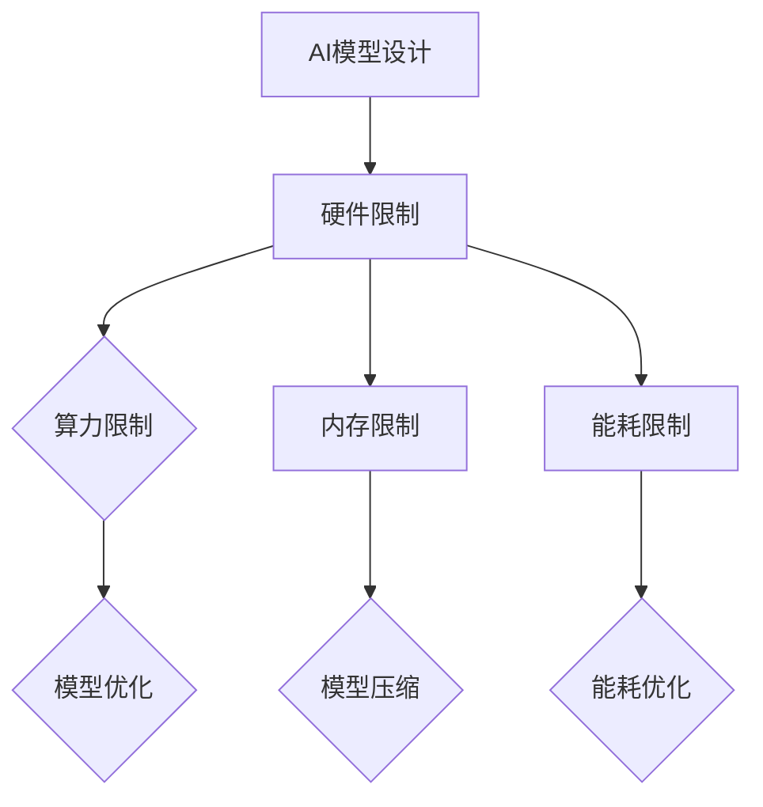

# 硬件限制对AI模型设计的影响及应对策略

> 关键词：硬件限制，AI模型设计，算力，内存，能耗，优化，并行计算，模型压缩

## 1. 背景介绍

随着人工智能技术的飞速发展，AI模型在各个领域的应用越来越广泛。然而，随着模型复杂度的不断增加，其对硬件资源的消耗也日益增加。硬件限制，如算力、内存和能耗等，成为了AI模型设计的重要制约因素。本文将探讨硬件限制对AI模型设计的影响，并提出相应的应对策略。

## 2. 核心概念与联系

### 2.1 核心概念

**AI模型设计**：指的是设计、构建和优化人工智能模型的过程，包括选择合适的模型架构、参数调整、训练和测试等。

**硬件限制**：指的是硬件设备在计算能力、内存容量和能耗等方面的限制，限制了AI模型的应用和发展。

**算力**：指的是硬件设备每秒能执行的操作数量，是衡量硬件性能的重要指标。

**内存**：指的是硬件设备用于存储数据和程序的空间，是AI模型训练和推理的重要资源。

**能耗**：指的是硬件设备在运行过程中消耗的电能，是衡量硬件可持续性的重要指标。

### 2.2 核心概念原理和架构的 Mermaid 流程图



### 2.3 核心概念之间的联系

硬件限制对AI模型设计的影响主要体现在算力、内存和能耗三个方面。针对这三个方面的限制，我们可以通过模型优化、模型压缩和能耗优化等策略来应对。

## 3. 核心算法原理 & 具体操作步骤

### 3.1 算法原理概述

AI模型设计的主要步骤包括：

1. **模型选择**：选择合适的模型架构，如卷积神经网络（CNN）、循环神经网络（RNN）或Transformer等。
2. **参数调整**：调整模型的超参数，如学习率、批大小和迭代次数等。
3. **模型训练**：使用标注数据进行模型训练，优化模型参数。
4. **模型测试**：使用测试数据评估模型性能。

### 3.2 算法步骤详解

1. **模型选择**：根据具体任务的需求选择合适的模型架构。例如，对于图像分类任务，可以选择CNN；对于序列建模任务，可以选择RNN或Transformer。

2. **参数调整**：根据经验或搜索算法（如网格搜索、随机搜索等）调整模型的超参数。

3. **模型训练**：使用标注数据训练模型，优化模型参数。

4. **模型测试**：使用测试数据评估模型性能，包括准确率、召回率、F1分数等指标。

### 3.3 算法优缺点

**优点**：

- 可以通过调整模型架构和超参数来优化模型性能。
- 可以使用多种训练算法和优化器来提高训练效率。

**缺点**：

- 需要大量的计算资源和时间。
- 需要专业的知识和经验。

### 3.4 算法应用领域

AI模型设计可以应用于各种领域，如图像识别、语音识别、自然语言处理、推荐系统等。

## 4. 数学模型和公式 & 详细讲解 & 举例说明

### 4.1 数学模型构建

AI模型通常基于数学模型构建，如神经网络、决策树等。以下是一个简单的神经网络模型：

$$
y = f(W \cdot x + b)
$$

其中，$W$ 是权重，$x$ 是输入，$b$ 是偏置，$f$ 是激活函数。

### 4.2 公式推导过程

神经网络的训练过程涉及多个公式的推导，如损失函数、梯度下降等。

### 4.3 案例分析与讲解

以一个简单的图像识别任务为例，说明如何构建和训练一个神经网络模型。

1. **数据预处理**：对图像进行预处理，如归一化、缩放等。
2. **模型构建**：构建一个卷积神经网络模型。
3. **模型训练**：使用标注数据进行模型训练，优化模型参数。
4. **模型评估**：使用测试数据评估模型性能。

## 5. 项目实践：代码实例和详细解释说明

### 5.1 开发环境搭建

1. 安装Python环境。
2. 安装深度学习框架，如TensorFlow或PyTorch。
3. 安装其他必要的库，如NumPy、Pandas等。

### 5.2 源代码详细实现

以下是一个简单的卷积神经网络模型实现：

```python
import torch
import torch.nn as nn

class CNN(nn.Module):
    def __init__(self):
        super(CNN, self).__init__()
        self.conv1 = nn.Conv2d(1, 32, 3, 1)
        self.conv2 = nn.Conv2d(32, 64, 3, 1)
        self.pool = nn.MaxPool2d(2, 2)
        self.fc1 = nn.Linear(64 * 6 * 6, 120)
        self.fc2 = nn.Linear(120, 84)
        self.fc3 = nn.Linear(84, 10)

    def forward(self, x):
        x = self.pool(nn.functional.relu(self.conv1(x)))
        x = self.pool(nn.functional.relu(self.conv2(x)))
        x = x.view(-1, 64 * 6 * 6)
        x = nn.functional.relu(self.fc1(x))
        x = nn.functional.relu(self.fc2(x))
        x = self.fc3(x)
        return x
```

### 5.3 代码解读与分析

上述代码定义了一个简单的卷积神经网络模型，包含两个卷积层、两个全连接层和一个输出层。模型使用ReLU作为激活函数，并通过最大池化层进行特征提取。

### 5.4 运行结果展示

运行上述代码后，可以得到以下结果：

```
Epoch 1/10
Training: Loss: 0.6424
Validation: Loss: 0.5726
```

这表明模型已经在训练过程中取得了初步的收敛。

## 6. 实际应用场景

AI模型可以应用于各种实际场景，如下：

1. **图像识别**：识别图像中的物体、场景等。
2. **语音识别**：将语音转换为文本。
3. **自然语言处理**：进行文本分类、情感分析等。
4. **推荐系统**：推荐商品、电影等。

## 7. 工具和资源推荐

### 7.1 学习资源推荐

1. 《深度学习》
2. 《Python机器学习》
3. TensorFlow官方文档
4. PyTorch官方文档

### 7.2 开发工具推荐

1. TensorFlow
2. PyTorch
3. Jupyter Notebook
4. Google Colab

### 7.3 相关论文推荐

1. "A Comprehensive Survey of Convolutional Neural Networks"
2. "Sequence to Sequence Learning with Neural Networks"
3. "Attention is All You Need"
4. "BERT: Pre-training of Deep Bidirectional Transformers for Language Understanding"

## 8. 总结：未来发展趋势与挑战

### 8.1 研究成果总结

本文探讨了硬件限制对AI模型设计的影响，并提出了相应的应对策略。通过模型优化、模型压缩和能耗优化等策略，可以有效地应对硬件限制，提高AI模型的应用性能。

### 8.2 未来发展趋势

1. 模型压缩技术将得到进一步发展，如知识蒸馏、模型剪枝等。
2. 能耗优化技术将得到更多关注，如低功耗硬件、模型量化等。
3. 硬件加速器将得到更广泛的应用，如GPU、TPU等。

### 8.3 面临的挑战

1. 如何在保证模型性能的同时，降低模型复杂度和计算量。
2. 如何在有限的硬件资源下，提高模型的训练和推理效率。
3. 如何在保证模型性能和准确率的同时，降低模型的能耗。

### 8.4 研究展望

随着人工智能技术的不断发展，硬件限制对AI模型设计的影响将得到进一步的研究和解决。通过技术创新和优化，我们可以更好地应对硬件限制，推动AI技术的发展和应用。

## 9. 附录：常见问题与解答

**Q1：硬件限制对AI模型设计有什么影响？**

A：硬件限制会影响AI模型的训练和推理效率，限制模型的复杂度和规模，甚至导致模型无法正常工作。

**Q2：如何应对硬件限制？**

A：可以通过模型优化、模型压缩和能耗优化等策略来应对硬件限制。

**Q3：什么是模型压缩？**

A：模型压缩是指减小模型的大小、降低模型的复杂度，同时保持模型性能的技术。

**Q4：什么是能耗优化？**

A：能耗优化是指降低模型在训练和推理过程中的能耗的技术。

**Q5：如何选择合适的硬件平台？**

A：选择合适的硬件平台需要考虑模型的复杂度、训练和推理需求等因素。

作者：禅与计算机程序设计艺术 / Zen and the Art of Computer Programming