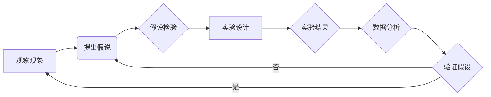

# 科学探究：从假说到真理

> 关键词：科学方法，假说，理论，实验，验证，模型，验证，迭代，创新，批判性思维

## 1. 背景介绍

科学探究是人类认识世界、解释现象、预测未来的一种系统性方法。它基于观察、实验、推理和验证等步骤，不断推进我们对自然界的理解。从古希腊的亚里士多德到现代的物理学家，科学探究一直是推动科技进步和社会发展的重要力量。本文将深入探讨科学探究的过程，从假说到真理，解析这一过程的核心要素和关键步骤。

## 2. 核心概念与联系

### 2.1 科学方法

科学方法是一套系统化的思维和操作规程，它包括观察、假设、实验、分析和验证等步骤。以下是科学方法的Mermaid流程图：



### 2.2 假说

假说是科学探究的起点，它是基于观察和已有知识提出的一种解释现象的可能性。一个良好的假说通常具有可测试性、简单性和解释力。

### 2.3 理论

理论是经过验证的假说体系，它能够解释一系列现象并预测新的现象。理论是科学探究的终极目标。

### 2.4 实验和验证

实验是科学探究的关键步骤，它通过操作和控制变量来测试假说。验证是通过实验结果来确认或否定假设。

### 2.5 模型和迭代

模型是理论的一种数学或物理形式，它能够模拟和预测现象。迭代是指在科学探究过程中不断改进和完善模型和理论。

## 3. 核心算法原理 & 具体操作步骤

### 3.1 算法原理概述

科学探究的算法原理可以概括为以下几个步骤：

1. 观察现象：通过感官或仪器收集数据和信息。
2. 提出假说：基于观察和已有知识，提出可能的解释。
3. 设计实验：设计实验来测试假说。
4. 收集数据：在实验中收集数据。
5. 分析数据：对收集到的数据进行分析。
6. 验证假说：根据数据分析结果验证或否定假说。
7. 迭代：根据验证结果改进假说或模型。

### 3.2 算法步骤详解

1. **观察现象**：科学探究始于对自然界的观察。观察可以是直接的，也可以是间接的，通过仪器设备进行。
2. **提出假说**：基于观察到的现象和已有的科学知识，提出一个或多个可能的解释。
3. **设计实验**：为了测试假说，需要设计实验来收集数据。实验设计应能够控制变量，排除干扰因素。
4. **收集数据**：在实验中收集相关数据，确保数据的准确性和可靠性。
5. **分析数据**：使用统计或数学方法对收集到的数据进行分析，以验证或否定假说。
6. **验证假说**：根据数据分析结果，判断假说是否成立。如果假说成立，则可以进一步发展和完善；如果假说不成立，则需要重新提出假说或修改实验设计。
7. **迭代**：科学探究是一个迭代的过程，每一步都可能需要回到前面的步骤进行改进。

### 3.3 算法优缺点

科学探究算法的优点在于其系统性和可重复性。通过遵循科学方法，科学家可以确保研究的可靠性和可验证性。然而，科学探究也存在一些局限性，例如：

- **观察偏差**：观察者的主观性可能导致对现象的解释出现偏差。
- **实验误差**：实验设计不当或操作失误可能导致实验结果不准确。
- **理论局限**：现有理论可能无法解释所有现象，需要新的理论来替代。

### 3.4 算法应用领域

科学探究算法广泛应用于各个科学领域，包括物理学、化学、生物学、医学、工程学等。以下是科学探究算法在一些领域的应用示例：

- **物理学**：通过实验验证牛顿定律和量子力学理论。
- **化学**：通过实验研究化学反应和分子结构。
- **生物学**：通过实验研究生物体的结构和功能。
- **医学**：通过实验研究疾病的原因和治疗方法。

## 4. 数学模型和公式 & 详细讲解 & 举例说明

### 4.1 数学模型构建

数学模型是科学探究中的一种工具，它使用数学语言来描述现象和理论。以下是一个简单的数学模型示例：

$$
F = ma
$$

这个公式描述了牛顿第二定律，即力等于质量乘以加速度。

### 4.2 公式推导过程

牛顿第二定律的推导过程基于以下观察：

- 当作用在物体上的力增加时，物体的加速度也会增加。
- 当物体的质量增加时，在相同力的作用下，物体的加速度会减小。

通过这些观察，牛顿提出了以下假设：

- 物体所受的力与其加速度成正比。
- 物体的质量与其加速度成反比。

基于这些假设，牛顿推导出了上述公式。

### 4.3 案例分析与讲解

以下是一个科学探究的案例分析：

**案例**：研究行星运动的规律。

**步骤**：

1. **观察现象**：天文学家观察到行星围绕太阳的运动轨迹是椭圆形。
2. **提出假说**：行星围绕太阳的运动轨迹可能是由于太阳对行星的引力作用。
3. **设计实验**：通过观测行星的位置和时间，计算行星的速度和加速度。
4. **收集数据**：收集大量行星的位置和时间数据。
5. **分析数据**：使用牛顿的运动定律和引力公式分析数据。
6. **验证假说**：通过数据分析验证行星的运动轨迹符合椭圆轨道，从而支持了太阳引力作用的假说。
7. **迭代**：根据新的观测数据，进一步改进模型和理论。

## 5. 项目实践：代码实例和详细解释说明

### 5.1 开发环境搭建

为了演示科学探究的过程，我们可以使用Python编写一个简单的物理模拟程序。

### 5.2 源代码详细实现

以下是一个使用Python模拟行星运动的代码示例：

```python
import matplotlib.pyplot as plt
import numpy as np

# 定义行星运动的参数
G = 6.67430e-11  # 引力常数
m_sun = 1.989e30  # 太阳质量
m_earth = 5.972e24  # 地球质量
distance = 1.496e11  # 地日距离
time_step = 1  # 时间步长
total_time = 365 * 24 * 3600  # 总时间（地球年）

# 定义行星的初始状态
position = np.array([distance, 0])
velocity = np.array([0, 2 * np.pi * distance / total_time])

# 模拟行星运动
def simulate_orbit(position, velocity, time_step, total_time):
    time = 0
    while time < total_time:
        # 计算引力
        distance_to_sun = np.linalg.norm(position)
        force = G * m_sun * m_earth / distance_to_sun**2
        force_direction = force / np.linalg.norm(force)
        
        # 更新速度和位置
        acceleration = force_direction * force / m_earth
        velocity += acceleration * time_step
        position += velocity * time_step
        
        # 绘制行星轨道
        plt.plot(position[0], position[1], 'bo')
        time += time_step
    
    plt.show()

simulate_orbit(position, velocity, time_step, total_time)
```

### 5.3 代码解读与分析

这段代码模拟了地球围绕太阳的运动。我们定义了引力常数、太阳和地球的质量、地日距离以及时间步长和总时间。然后，我们初始化了地球的初始位置和速度，并定义了一个函数`simulate_orbit`来模拟行星运动。在函数中，我们计算了地球所受的引力，并更新了地球的速度和位置。最后，我们使用matplotlib库绘制了地球的轨道。

### 5.4 运行结果展示

运行上述代码将显示一个地球围绕太阳运动的轨道图。

## 6. 实际应用场景

科学探究算法在各个领域都有广泛的应用，以下是一些实际应用场景的示例：

- **气候变化研究**：通过收集和分析气候变化数据，科学家可以建立模型来预测未来的气候变化趋势。
- **药物研发**：通过实验和数据分析，研究人员可以开发新的药物来治疗疾病。
- **天体物理学**：通过观测和分析宇宙数据，天文学家可以探索宇宙的起源和演化。

### 6.4 未来应用展望

随着技术的进步，科学探究算法将在以下方面得到进一步发展：

- **大数据分析**：通过分析海量数据，科学家可以揭示新的科学规律。
- **人工智能**：人工智能可以帮助科学家更有效地进行数据分析，提高科学探究的效率。
- **虚拟现实**：虚拟现实技术可以帮助科学家进行更加直观的科学实验。

## 7. 工具和资源推荐

### 7.1 学习资源推荐

- 《科学革命的结构》
- 《科学方法》
- 《物理学史》

### 7.2 开发工具推荐

- Python
- NumPy
- Matplotlib

### 7.3 相关论文推荐

- 《牛顿定律》
- 《相对论》
- 《量子力学基础》

## 8. 总结：未来发展趋势与挑战

### 8.1 研究成果总结

科学探究是从假说到真理的过程，它基于观察、实验、推理和验证等步骤。科学探究算法在各个领域都有广泛的应用，并将在未来得到进一步发展。

### 8.2 未来发展趋势

- 大数据分析
- 人工智能
- 虚拟现实

### 8.3 面临的挑战

- 数据质量和可靠性
- 算法复杂性和可解释性
- 道德和伦理问题

### 8.4 研究展望

科学探究将继续推动人类对自然界的理解，为科技进步和社会发展提供动力。

## 9. 附录：常见问题与解答

**Q1：科学探究的目的是什么？**

A：科学探究的目的是通过观察、实验和推理来理解自然界的规律，并预测未来的现象。

**Q2：科学方法的关键步骤是什么？**

A：科学方法的关键步骤包括观察现象、提出假说、设计实验、收集数据、分析数据、验证假说和迭代。

**Q3：数学模型在科学探究中有什么作用？**

A：数学模型是科学探究中的一种工具，它使用数学语言来描述现象和理论。

**Q4：科学探究算法在哪些领域有应用？**

A：科学探究算法在各个领域都有应用，包括物理学、化学、生物学、医学、工程学等。

**Q5：科学探究的未来发展趋势是什么？**

A：科学探究的未来发展趋势包括大数据分析、人工智能和虚拟现实等。

作者：禅与计算机程序设计艺术 / Zen and the Art of Computer Programming