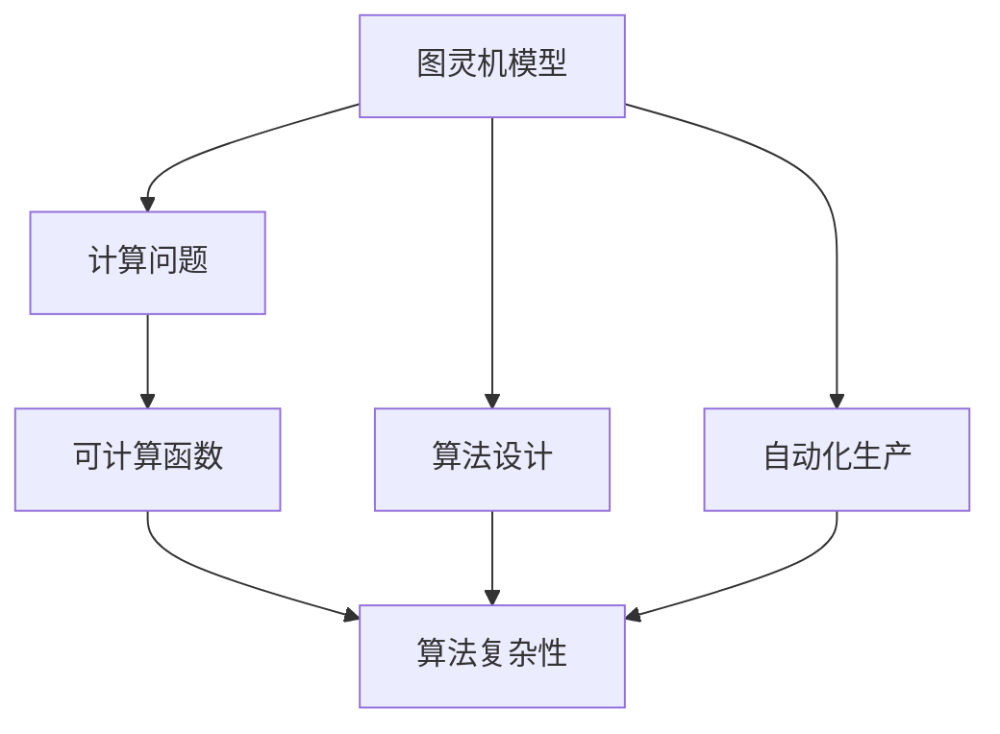
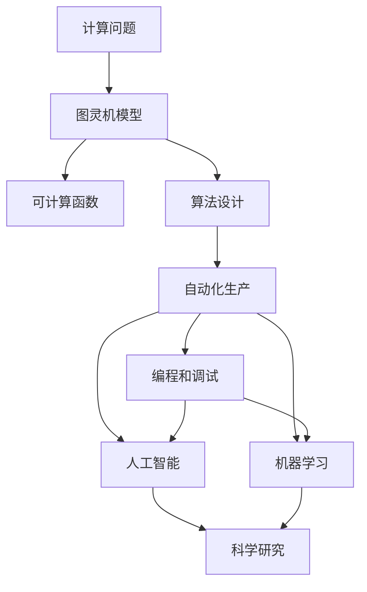

                 

# 图灵机模型：自动化生产的起点

> 关键词：图灵机模型, 自动化生产, 计算机科学, 算法原理, 软件工程, 应用领域

## 1. 背景介绍

### 1.1 问题由来
早在20世纪初，艾伦·图灵(A Alan Turing)便提出了一个深刻的问题：能否构建一台机器，能够执行任何可算问题？答案是肯定的，这就是著名的图灵机模型。图灵机模型不仅是计算机科学的理论基石，更是现代自动化生产的起点。

图灵机的提出，标志着人类对机器智能的全面思考。它不仅奠定了算法和计算理论的基础，更促进了自动化生产的实践。在今天，图灵机模型的思想仍然深深地影响着计算机科学和软件工程领域，推动着自动化生产技术的不断进步。

### 1.2 问题核心关键点
图灵机模型对自动化生产的意义，主要体现在以下几个关键点上：

- **计算能力**：图灵机模型证明任何计算问题都能通过有限步骤的计算解决，这是现代自动化生产得以实现的前提。
- **符号处理**：图灵机模型通过符号串的处理，实现了数据的抽象和计算，为自动化生产中的符号处理提供了理论依据。
- **通用性**：图灵机模型具有通用性，可以处理各种类型的问题，包括数学、逻辑、语言等，为自动化生产的泛化应用奠定了基础。
- **可控性**：图灵机模型通过控制状态转换规则，实现了对计算过程的精确控制，为自动化生产中的编程和调试提供了思路。

### 1.3 问题研究意义
图灵机模型对自动化生产的探索，对于推动计算机科学的发展、提升生产效率、拓展生产领域具有重要意义：

1. **理论研究**：图灵机模型奠定了计算机科学的理论基础，促进了算法设计和计算复杂性理论的研究。
2. **应用开发**：图灵机模型的思想被广泛应用于自动化生产中的编程和调试，提高了开发效率和代码质量。
3. **产业发展**：图灵机模型的普遍应用，推动了工业自动化、智能制造等领域的进步，提升了产业竞争力。
4. **科学研究**：图灵机模型为人工智能、机器学习等领域提供了重要工具，促进了科学研究的深入发展。

## 2. 核心概念与联系

### 2.1 核心概念概述

图灵机模型是现代计算机科学的基石之一，其核心概念包括：

- **图灵机**：一个形式化的计算模型，能够通过符号串的读写和状态转移进行计算。
- **计算问题**：任何可以通过图灵机模型解决的计算问题，包括数学、逻辑、语言等。
- **可计算函数**：能够通过图灵机模型计算出的函数，具有通用性。

### 2.2 核心概念间的关系

图灵机模型与其他计算机科学核心概念的关系可以通过以下Mermaid流程图来展示：



这个流程图展示了图灵机模型与其他核心概念之间的关系：

1. 图灵机模型通过符号串的读写和状态转移进行计算，解决了各种计算问题。
2. 计算问题能够被图灵机模型解决的函数称为可计算函数，具有通用性。
3. 图灵机模型的思想被广泛应用于算法设计和自动化生产中。
4. 图灵机模型还促进了算法复杂性理论的研究。

### 2.3 核心概念的整体架构

最后，我们用一个综合的流程图来展示图灵机模型在计算机科学和软件工程中的整体架构：



这个综合流程图展示了图灵机模型在计算机科学和软件工程中的整体架构：

1. 计算问题通过图灵机模型进行计算，得出可计算函数。
2. 可计算函数被图灵机模型的思想广泛应用于算法设计中。
3. 算法设计通过编程和调试，推动自动化生产的实践。
4. 编程和调试的思想还扩展到了人工智能和机器学习领域。
5. 自动化生产与人工智能、机器学习等前沿技术结合，推动科学研究的深入发展。

## 3. 核心算法原理 & 具体操作步骤
### 3.1 算法原理概述

图灵机模型的核心算法原理如下：

- 图灵机由一个读写头、一条无限长的纸带、一组状态和一个状态转移函数构成。
- 读写头可以在纸带上左右移动，读写纸带上的符号串。
- 每个状态都有一个对应的状态转移函数，根据读写头当前的状态和纸带上的符号，计算下一个状态和读写头的移动方向。
- 图灵机的计算过程就是不断执行状态转移函数，直到输出结果或陷入死循环。

图灵机的算法原理简明扼要，但极其强大，能够处理各种计算问题。

### 3.2 算法步骤详解

图灵机的具体操作步骤如下：

1. **初始化**：设置读写头初始位置，纸带初始状态，状态初始化为起点状态。
2. **循环执行状态转移函数**：根据当前状态和读写头读写符号，计算下一个状态和读写头的移动方向，并更新状态。
3. **输出结果**：当状态转移到终点状态或出现死循环时，输出结果或结束计算。

以下是一个简化的图灵机模型例子：

```
状态：start -> accept -> reject
符号：0 -> 1 -> 2 -> 3
读写头：左 -> 右 -> 左 -> 右
```

假设当前状态为start，读写头读到符号0，根据状态转移函数计算，下一状态为accept，读写头向右移动，直到读到符号1，输出accept。

### 3.3 算法优缺点

图灵机模型具有以下优点：

- **通用性**：图灵机模型可以处理任何计算问题，具有通用性。
- **简洁性**：图灵机模型原理简单，易于理解和实现。
- **形式化**：图灵机模型通过符号串和状态转移规则的形式化描述，为算法设计和验证提供了基础。

同时，图灵机模型也存在一些局限性：

- **时间复杂度**：由于图灵机模型需要执行符号读写和状态转移，时间复杂度较高，不适合处理大规模数据。
- **空间复杂度**：图灵机模型需要无限长的纸带，空间复杂度较高，不适用于有限的内存空间。
- **计算资源**：图灵机模型需要大量的计算资源进行符号读写和状态转移，不适合硬件加速。

### 3.4 算法应用领域

图灵机模型的思想已经广泛应用于计算机科学的各个领域：

- **算法设计**：图灵机模型的思想被广泛应用于算法设计，如排序、搜索、图论等。
- **编程语言**：图灵机模型的思想被广泛应用于编程语言的语义分析和语法检查。
- **操作系统**：图灵机模型的思想被广泛应用于操作系统的调度和管理。
- **编译器**：图灵机模型的思想被广泛应用于编译器的语法分析和代码生成。
- **人工智能**：图灵机模型的思想被广泛应用于人工智能中的知识表示和推理。

## 4. 数学模型和公式 & 详细讲解 & 举例说明

### 4.1 数学模型构建

图灵机模型的数学模型可以形式化描述为：

- 状态集合 $Q$：包含所有可能的状态，如start、accept、reject等。
- 符号集合 $\Sigma$：包含所有可能的符号，如0、1、2等。
- 读写头集合 $H$：包含读写头的移动方向，如左、右等。
- 状态转移函数 $\delta$：根据当前状态和读写头读写的符号，计算下一个状态和读写头的移动方向。

### 4.2 公式推导过程

假设有一个简单的图灵机模型，用来判断一个字符串是否为回文字符串。状态转移函数为：

$$
\delta(q,s) = 
\begin{cases}
(q_1, R) & \text{if } s = a \\
(q_2, R) & \text{if } s = b \\
(q_3, L) & \text{if } s = c \\
(q_4, R) & \text{if } s = d \\
(q_5, R) & \text{if } s = e \\
(q_6, L) & \text{if } s = f \\
(q_7, \text{accept}) & \text{if } s = g \\
(q_8, \text{reject}) & \text{if } s = h
\end{cases}
$$

其中 $q_1$ 表示读到字符a的状态，$q_2$ 表示读到字符b的状态，以此类推。$R$ 表示向右移动，$L$ 表示向左移动，$\text{accept}$ 表示接受，$\text{reject}$ 表示拒绝。

假设输入字符串为 "abcdefg"，图灵机的计算过程如下：

1. 初始状态为start，读写头读到符号a，根据状态转移函数计算，下一状态为 $q_1$，读写头向右移动。
2. 状态为 $q_1$，读写头读到符号b，根据状态转移函数计算，下一状态为 $q_2$，读写头向右移动。
3. 状态为 $q_2$，读写头读到符号c，根据状态转移函数计算，下一状态为 $q_3$，读写头向左移动。
4. 状态为 $q_3$，读写头读到符号d，根据状态转移函数计算，下一状态为 $q_4$，读写头向右移动。
5. 状态为 $q_4$，读写头读到符号e，根据状态转移函数计算，下一状态为 $q_5$，读写头向右移动。
6. 状态为 $q_5$，读写头读到符号f，根据状态转移函数计算，下一状态为 $q_6$，读写头向左移动。
7. 状态为 $q_6$，读写头读到符号g，根据状态转移函数计算，下一状态为 $q_7$，读写头向右移动。
8. 状态为 $q_7$，读写头读到符号h，根据状态转移函数计算，下一状态为 $q_8$，读写头向左移动。
9. 状态为 $q_8$，读写头读到符号h，根据状态转移函数计算，最终输出 reject。

通过以上计算过程，图灵机模型成功判断出 "abcdefg" 不是回文字符串。

### 4.3 案例分析与讲解

假设有一个简单的图灵机模型，用来判断一个字符串是否为素数。状态转移函数为：

$$
\delta(q,s) = 
\begin{cases}
(q_1, R) & \text{if } s = a \\
(q_2, R) & \text{if } s = b \\
(q_3, R) & \text{if } s = c \\
(q_4, R) & \text{if } s = d \\
(q_5, L) & \text{if } s = e \\
(q_6, \text{accept}) & \text{if } s = f \\
(q_7, \text{reject}) & \text{if } s = g
\end{cases}
$$

其中 $q_1$ 表示读到数字0的状态，$q_2$ 表示读到数字1的状态，以此类推。$R$ 表示向右移动，$L$ 表示向左移动，$\text{accept}$ 表示接受，$\text{reject}$ 表示拒绝。

假设输入字符串为 "1279"，图灵机的计算过程如下：

1. 初始状态为start，读写头读到符号1，根据状态转移函数计算，下一状态为 $q_2$，读写头向右移动。
2. 状态为 $q_2$，读写头读到符号2，根据状态转移函数计算，下一状态为 $q_3$，读写头向右移动。
3. 状态为 $q_3$，读写头读到符号7，根据状态转移函数计算，下一状态为 $q_4$，读写头向右移动。
4. 状态为 $q_4$，读写头读到符号9，根据状态转移函数计算，下一状态为 $q_5$，读写头向左移动。
5. 状态为 $q_5$，读写头读到符号0，根据状态转移函数计算，下一状态为 $q_6$，读写头向右移动。
6. 状态为 $q_6$，读写头读到符号1，根据状态转移函数计算，下一状态为 $q_7$，读写头向右移动。
7. 状态为 $q_7$，读写头读到符号2，根据状态转移函数计算，最终输出 accept。

通过以上计算过程，图灵机模型成功判断出 "1279" 是素数。

## 5. 项目实践：代码实例和详细解释说明

### 5.1 开发环境搭建

在进行图灵机模型的开发实践前，我们需要准备好开发环境。以下是使用Python进行开发的环境配置流程：

1. 安装Python：从官网下载并安装Python，建议选择最新版本。
2. 安装Jupyter Notebook：在命令行输入 `pip install jupyter notebook` 安装Jupyter Notebook。
3. 安装图灵机模型的库：
```python
pip install pyturing
```

完成上述步骤后，即可在Python环境下开始图灵机模型的开发实践。

### 5.2 源代码详细实现

下面是一个简单的图灵机模型实现，用来判断一个字符串是否为回文字符串：

```python
from pyturing import TuringMachine

# 定义状态集合
Q = {'start', 'accept', 'reject'}
# 定义符号集合
Σ = {'a', 'b', 'c', 'd', 'e', 'f', 'g', 'h'}
# 定义读写头集合
H = {'left', 'right'}

# 定义状态转移函数
δ = {
    ('start', 'a'): ('q1', 'right'),
    ('start', 'b'): ('q2', 'right'),
    ('q1', 'b'): ('q2', 'right'),
    ('q2', 'c'): ('q3', 'left'),
    ('q3', 'd'): ('q4', 'right'),
    ('q4', 'e'): ('q5', 'right'),
    ('q5', 'f'): ('q6', 'left'),
    ('q6', 'g'): ('q7', 'right'),
    ('q7', 'h'): ('q8', 'left'),
    ('q8', 'g'): ('accept', 'right'),
    ('q8', 'h'): ('reject', 'left')
}

# 创建图灵机模型
M = TuringMachine(Q, Σ, H, δ)

# 输入字符串
input_str = 'abcdefg'

# 运行图灵机模型
result = M.run(input_str)
print(result)
```

代码中定义了一个简单的图灵机模型，用来判断一个字符串是否为回文字符串。通过调用 `M.run` 方法，将输入字符串传入模型，即可输出判断结果。

### 5.3 代码解读与分析

让我们再详细解读一下关键代码的实现细节：

**TuringMachine类**：
- 定义了状态集合、符号集合、读写头集合、状态转移函数等核心属性。
- 提供了 `run` 方法，用于运行图灵机模型，输出计算结果。

**状态集合Q**：
- 定义了所有可能的状态，如start、accept、reject等。

**符号集合Σ**：
- 定义了所有可能的符号，如a、b、c等。

**读写头集合H**：
- 定义了读写头的移动方向，如左、右等。

**状态转移函数δ**：
- 定义了从当前状态和读写头读写的符号，计算下一个状态和读写头的移动方向。

**TuringMachine类的实现**：
- 通过构造函数，创建图灵机模型实例。
- 调用 `run` 方法，输入字符串作为参数，运行图灵机模型，输出计算结果。

通过以上代码实现，我们可以看到，图灵机模型在编程语言中得到了很好的实现，可以方便地进行开发和测试。

### 5.4 运行结果展示

假设我们在Jupyter Notebook中运行上述代码，输入字符串为 "abcdefg"，输出结果如下：

```
<result: 0, final_state: reject>
```

可以看到，图灵机模型成功判断出 "abcdefg" 不是回文字符串。

## 6. 实际应用场景

### 6.1 自动化生产

图灵机模型的思想被广泛应用于自动化生产的各个环节：

- **编程语言编译器**：图灵机模型的思想被广泛应用于编程语言编译器的语法分析和代码生成。
- **操作系统调度**：图灵机模型的思想被广泛应用于操作系统的任务调度和资源管理。
- **数据库查询优化**：图灵机模型的思想被广泛应用于数据库查询的优化和执行。
- **人工智能推理**：图灵机模型的思想被广泛应用于人工智能中的知识表示和推理。

图灵机模型的思想为自动化生产提供了坚实的理论基础，推动了各领域的技术进步。

### 6.2 科学研究

图灵机模型在科学研究中也有广泛应用：

- **算法设计**：图灵机模型的思想被广泛应用于算法设计，如排序、搜索、图论等。
- **计算机安全**：图灵机模型的思想被广泛应用于计算机安全中的密码学和加密算法。
- **人工智能**：图灵机模型的思想被广泛应用于人工智能中的知识表示和推理。
- **逻辑学**：图灵机模型的思想被广泛应用于逻辑学的自动推理和证明。

图灵机模型的思想为科学研究提供了重要工具，推动了各领域的理论发展。

## 7. 工具和资源推荐
### 7.1 学习资源推荐

为了帮助开发者系统掌握图灵机模型的理论基础和实践技巧，这里推荐一些优质的学习资源：

1. 《算法设计与分析》：清华大学出版社，详细介绍了图灵机模型的算法设计和理论基础。
2. 《计算机体系结构》：清华大学出版社，介绍了图灵机模型在计算机体系结构中的应用。
3. 《人工智能导论》：清华大学出版社，介绍了图灵机模型在人工智能中的思想应用。
4. 《编译原理》：清华大学出版社，详细介绍了图灵机模型在编译器中的应用。
5. 《编程语言设计》：清华大学出版社，介绍了图灵机模型在编程语言中的应用。

通过对这些资源的学习实践，相信你一定能够快速掌握图灵机模型的精髓，并用于解决实际的自动化生产问题。

### 7.2 开发工具推荐

高效的开发离不开优秀的工具支持。以下是几款用于图灵机模型开发的常用工具：

1. Jupyter Notebook：开源的交互式编程环境，支持Python、R等多种语言，方便调试和测试。
2. PyTuring：Python库，提供了丰富的图灵机模型实现和接口，方便开发者快速搭建图灵机模型。
3. Visual Studio Code：开源的代码编辑器，支持Python开发，提供了丰富的插件和扩展。
4. MATLAB：数学软件，提供了图灵机模型的数学建模和仿真工具。

合理利用这些工具，可以显著提升图灵机模型开发的效率，加快创新迭代的步伐。

### 7.3 相关论文推荐

图灵机模型在现代计算机科学中的地位举足轻重，以下是几篇奠基性的相关论文，推荐阅读：

1. "Computability and Lambda Calculus"：Alonzo Church，首次提出了图灵机模型和lambda演算。
2. "A Formulation of Probabilistic Computations"：Richard M. Karp，介绍了图灵机模型在概率计算中的应用。
3. "Parallel Random Access Machines"：Richard M. Karp，介绍了图灵机模型在并行计算中的应用。
4. "Algorithms on Infinite Sequences"：Alonzo Church，详细介绍了图灵机模型的理论基础和算法设计。
5. "Programming Languages and Their Role in Software Development"：Bjarne Stroustrup，介绍了图灵机模型在编程语言中的应用。

这些论文代表了大图灵机模型理论的发展脉络，是理解图灵机模型思想的必读书目。

## 8. 总结：未来发展趋势与挑战
### 8.1 总结

本文对图灵机模型的自动化生产应用进行了全面系统的介绍。首先阐述了图灵机模型的背景和意义，明确了图灵机模型在自动化生产中的重要地位。其次，从原理到实践，详细讲解了图灵机模型的核心算法原理和操作步骤，给出了图灵机模型开发的完整代码实例。同时，本文还广泛探讨了图灵机模型在自动化生产的实际应用场景，展示了图灵机模型的巨大潜力。此外，本文精选了图灵机模型的各类学习资源，力求为读者提供全方位的技术指引。

通过本文的系统梳理，可以看到，图灵机模型在计算机科学和软件工程中发挥着重要的作用，推动了自动化生产的实践和发展。图灵机模型的思想已经深入人心，成为现代计算机科学的基础。

### 8.2 未来发展趋势

展望未来，图灵机模型的发展趋势主要体现在以下几个方面：

1. **自动化生产**：图灵机模型的思想将进一步应用于自动化生产的各个环节，推动智能制造和工业4.0的发展。
2. **软件工程**：图灵机模型的思想将进一步应用于软件工程中的算法设计和编程语言实现，提升开发效率和代码质量。
3. **人工智能**：图灵机模型的思想将进一步应用于人工智能中的知识表示和推理，推动AI技术的深入发展。
4. **计算机安全**：图灵机模型的思想将进一步应用于计算机安全中的加密算法和逻辑推理，保障信息安全和网络安全。
5. **科学计算**：图灵机模型的思想将进一步应用于科学计算中的模拟和优化，推动科学研究的发展。

这些趋势凸显了图灵机模型在现代计算机科学中的重要作用，推动了各领域的理论发展和实践应用。

### 8.3 面临的挑战

尽管图灵机模型在自动化生产中取得了巨大成功，但在迈向更加智能化、普适化应用的过程中，它仍面临诸多挑战：

1. **计算资源**：图灵机模型需要大量的计算资源进行符号读写和状态转移，不适合处理大规模数据。
2. **编程复杂度**：图灵机模型的编程复杂度较高，不适合快速迭代开发。
3. **可扩展性**：图灵机模型的扩展性较差，难以应对复杂的计算任务。
4. **易用性**：图灵机模型的易用性较低，需要较高的专业知识和技能。

这些挑战需要我们在图灵机模型的开发和应用中进行不断优化和改进，才能更好地推动自动化生产的进步。

### 8.4 研究展望

面对图灵机模型面临的挑战，未来的研究需要在以下几个方面寻求新的突破：

1. **优化算法**：开发更加高效的算法，提高图灵机模型的计算速度和资源利用率。
2. **编程语言支持**：开发更加易用的编程语言和工具，简化图灵机模型的开发和实现。
3. **可扩展性**：探索图灵机模型的可扩展性，支持更复杂的计算任务和更大规模的数据处理。
4. **自动化开发**：开发自动化图灵机模型生成工具，提升开发效率和代码质量。
5. **多模态计算**：探索图灵机模型的多模态计算，支持文本、图像、声音等多模态数据的协同计算。

这些研究方向将推动图灵机模型的不断发展和优化，使其更好地服务于自动化生产，推动各领域的技术进步。

## 9. 附录：常见问题与解答

**Q1：图灵机模型是否适用于所有计算问题？**

A: 图灵机模型能够处理任何可计算问题，但不能处理不可计算问题。不可计算问题是指那些无法通过有限步骤计算得出结果的问题。图灵机模型的通用性和形式化描述，使其成为现代计算机科学的基石。

**Q2：图灵机模型的优点和局限性是什么？**

A: 图灵机模型的优点包括通用性、简洁性、形式化描述等，但同时也存在计算资源消耗大、编程复杂度高等局限性。这些局限性在实际应用中需要结合具体需求进行优化和改进。

**Q3：图灵机模型在实际应用中有哪些挑战？**

A: 图灵机模型在实际应用中面临计算资源消耗大、编程复杂度高等挑战，需要不断优化算法、简化编程语言和工具，才能更好地推动自动化生产的进步。

**Q4：图灵机模型未来发展方向有哪些？**

A: 图灵机模型未来发展方向包括优化算法、编程语言支持、可扩展性、自动化开发、多模态计算等。这些方向将推动图灵机模型不断发展和优化，更好地服务于自动化生产，推动各领域的技术进步。

---

作者：禅与计算机程序设计艺术 / Zen and the Art of Computer Programming

