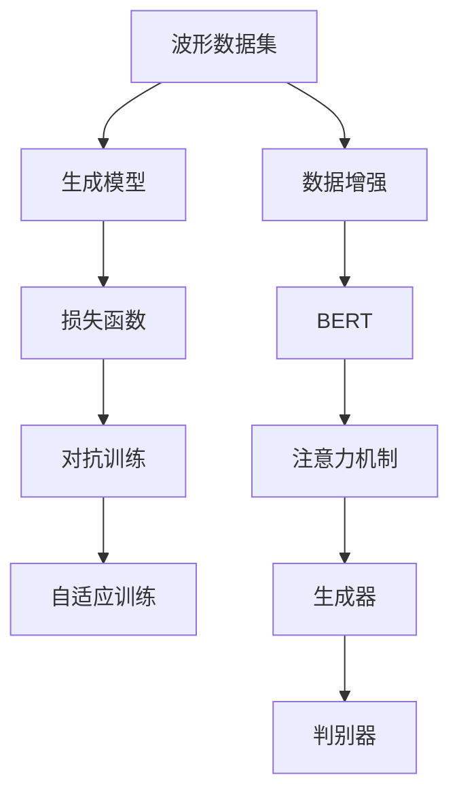

                 

# 基于AI的任意波形生成

## 1. 背景介绍

### 1.1 问题由来
在信号处理、电子工程、物理模拟等领域，波形生成是一个基础但极其重要的任务。传统的波形生成方法主要依赖硬件电路或手写的信号发生器，但这些方法通常较为复杂，难以灵活定制。近年来，随着深度学习和生成对抗网络（GAN）的崛起，基于AI的波形生成技术逐渐成为主流。

AI波形生成技术的核心思想是通过学习大量已标注的波形数据，训练生成模型来生成新的波形。这种技术不仅能够实现更灵活的波形定制，还能提高生成效率，降低硬件成本。在实际应用中，AI波形生成已经广泛应用于音频合成、音乐创作、机器人控制、医疗信号生成等领域，具有广泛的应用前景。

### 1.2 问题核心关键点
基于AI的波形生成技术主要包括两个关键部分：
1. **数据准备**：需要准备大规模的波形数据集，并对其进行标注。数据标注通常包含波形时间序列、频率、相位、幅值等信息。
2. **模型训练**：选择合适的生成模型，并在标注数据上进行训练。训练完成后，使用该模型生成新的波形。

数据准备和模型训练是波形生成系统的核心，直接影响生成的波形质量和效率。

### 1.3 问题研究意义
AI波形生成技术的应用范围极其广泛，具有以下几个重要意义：

1. **降低成本**：相比于传统硬件电路，AI波形生成技术可以大大降低波形生成成本，尤其在需要频繁生成不同类型波形时，优势更加明显。
2. **提高灵活性**：AI波形生成技术可以实现自定义波形，满足不同场景下对波形的特定需求。
3. **提升效率**：通过自动化生成波形，可以显著提高波形生成速度，减少人工操作。
4. **促进创新**：AI波形生成技术使得音乐创作、医疗信号模拟等领域更加丰富多样，推动相关技术的发展。

## 2. 核心概念与联系

### 2.1 核心概念概述

为了更好地理解基于AI的波形生成技术，本节将介绍几个核心概念及其相互联系：

- **波形数据集**：包含大量已标注的波形样本，用于训练生成模型。数据标注通常包含时间序列、频率、相位、幅值等信息。
- **生成模型**：用于从波形数据集中学习波形生成规律的模型，主要包括卷积神经网络（CNN）、递归神经网络（RNN）、生成对抗网络（GAN）等。
- **损失函数**：用于衡量生成波形与目标波形之间的差异，如均方误差（MSE）、感知损失（Perceptual Loss）、多尺度结构相似度（SSIM）等。
- **对抗训练**：通过在模型训练中加入对抗样本，提高生成波形的质量和多样性。
- **自适应训练**：根据不同场景需求，动态调整生成模型的结构和参数。

这些概念之间存在着紧密的联系，形成了一个完整的AI波形生成系统。波形数据集是模型的训练基础，生成模型是实现波形生成的核心，损失函数用于指导模型训练，对抗训练和自适应训练则进一步提升模型的生成能力和适应性。

### 2.2 概念间的关系

这些核心概念之间的关系可以通过以下Mermaid流程图来展示：



这个流程图展示了大语言模型波形生成系统的核心架构和各模块之间的联系：

1. 波形数据集作为输入，用于训练生成模型。
2. 生成模型通过损失函数进行优化，输出生成波形。
3. 对抗训练和自适应训练进一步提升生成波形的质量和多样性。
4. 数据增强和注意力机制等技术，进一步提升模型性能。

## 3. 核心算法原理 & 具体操作步骤
### 3.1 算法原理概述

基于AI的波形生成技术主要分为以下几个步骤：

1. **数据准备**：收集大规模的波形数据集，并进行标注。
2. **模型选择**：选择合适的生成模型，如CNN、RNN、GAN等。
3. **模型训练**：在标注数据集上训练生成模型，使用损失函数进行优化。
4. **生成波形**：使用训练好的生成模型生成新的波形。

生成模型的核心在于如何从波形数据中学习生成规律。当前主流的方法包括：

- **CNN卷积神经网络**：通过卷积层提取波形的空间特征，全连接层进行最终生成。
- **RNN递归神经网络**：通过时间序列的递归结构，学习波形的动态特征，适用于语音等时序数据。
- **GAN生成对抗网络**：通过生成器和判别器的对抗训练，生成高质量的波形。

这些方法各具特色，适用于不同类型的波形生成任务。

### 3.2 算法步骤详解

以下是基于CNN的波形生成算法详细步骤：

1. **数据准备**：
   - 收集大量波形数据，进行预处理，包括归一化、截断、补零等。
   - 对波形数据进行标注，包括时间序列、频率、相位、幅值等信息。

2. **模型选择**：
   - 选择CNN作为生成模型。
   - 定义生成器的网络结构，包括卷积层、池化层、全连接层等。

3. **模型训练**：
   - 将波形数据集划分为训练集、验证集和测试集。
   - 定义损失函数，如均方误差（MSE）、感知损失（Perceptual Loss）、多尺度结构相似度（SSIM）等。
   - 在训练集上训练生成模型，使用优化器进行参数更新，最小化损失函数。

4. **生成波形**：
   - 使用训练好的生成模型生成新的波形。
   - 对生成的波形进行后处理，如去噪、放大、压缩等，以提升生成波形的质量。

### 3.3 算法优缺点

基于AI的波形生成技术具有以下优点：

1. **灵活性高**：可以根据不同需求，自定义生成波形的类型、频率、相位、幅值等参数。
2. **生成效率高**：生成波形的速度较快，能够实时生成新的波形。
3. **精度高**：通过深度学习模型的训练，生成的波形能够高度逼近真实波形。

但该技术也存在一些局限性：

1. **对数据质量要求高**：需要高质量、多样化的波形数据集，数据标注工作量大。
2. **模型复杂度高**：生成模型的复杂度较高，训练需要大量的计算资源。
3. **生成波形存在噪声**：生成的波形可能存在一些噪声，需要进行后处理。

### 3.4 算法应用领域

基于AI的波形生成技术已经在多个领域得到了广泛应用：

1. **音频合成**：用于音乐创作、虚拟主播、语音识别等，能够生成高质量的音频信号。
2. **机器人控制**：用于模拟机器人控制信号，测试机器人的响应速度和稳定性。
3. **医疗信号模拟**：用于模拟心电图、脑电图等医疗信号，辅助医疗诊断。
4. **物理模拟**：用于模拟自然界中的物理现象，如声音传播、地震波等。

这些领域的应用展示了AI波形生成技术的强大潜力，为各行业带来了新的创新点。

## 4. 数学模型和公式 & 详细讲解  
### 4.1 数学模型构建

在波形生成中，我们通常使用CNN模型来进行波形特征提取和生成。CNN模型的输入为波形时间序列，输出为目标波形。

假设输入波形为 $X$，目标波形为 $Y$，CNN模型的参数为 $\theta$。生成模型的目标是最小化损失函数 $\mathcal{L}$，使得生成的波形 $X'$ 与目标波形 $Y$ 尽可能接近。数学模型可以表示为：

$$
\min_{\theta} \mathcal{L}(X', Y) = \min_{\theta} \|X' - Y\|^2
$$

其中 $\|X' - Y\|^2$ 表示生成的波形 $X'$ 与目标波形 $Y$ 之间的均方误差。

### 4.2 公式推导过程

以均方误差（MSE）为例，其推导过程如下：

1. **定义均方误差**：
   $$
   \mathcal{L}_{MSE}(X', Y) = \frac{1}{N} \sum_{i=1}^N (X'_i - Y_i)^2
   $$

2. **梯度计算**：
   $$
   \frac{\partial \mathcal{L}_{MSE}(X', Y)}{\partial X_i} = 2(X'_i - Y_i)
   $$

3. **参数更新**：
   $$
   X'_i \leftarrow X'_i - \eta \frac{\partial \mathcal{L}_{MSE}(X', Y)}{\partial X_i}
   $$

其中 $\eta$ 为学习率，通过不断迭代优化，使得生成的波形逐渐逼近目标波形。

### 4.3 案例分析与讲解

以语音信号生成为例，假设输入语音为 $X = \{x_1, x_2, \cdots, x_N\}$，目标语音为 $Y = \{y_1, y_2, \cdots, y_N\}$。将 $X$ 输入CNN模型，得到生成语音 $X' = \{x'_1, x'_2, \cdots, x'_N\}$。通过均方误差计算损失，并使用反向传播算法更新模型参数。最终生成的语音 $X'$ 与目标语音 $Y$ 之间的均方误差越小，说明生成效果越好。

## 5. 项目实践：代码实例和详细解释说明
### 5.1 开发环境搭建

在进行波形生成实践前，我们需要准备好开发环境。以下是使用Python进行TensorFlow开发的环境配置流程：

1. 安装Anaconda：从官网下载并安装Anaconda，用于创建独立的Python环境。

2. 创建并激活虚拟环境：
```bash
conda create -n pytorch-env python=3.8 
conda activate pytorch-env
```

3. 安装TensorFlow：根据CUDA版本，从官网获取对应的安装命令。例如：
```bash
conda install pytorch torchvision torchaudio cudatoolkit=11.1 -c pytorch -c conda-forge
```

4. 安装PyTorch：从官网下载并安装PyTorch，用于辅助TensorFlow的开发和调试。

5. 安装各类工具包：
```bash
pip install numpy pandas scikit-learn matplotlib tqdm jupyter notebook ipython
```

完成上述步骤后，即可在`pytorch-env`环境中开始波形生成实践。

### 5.2 源代码详细实现

下面我们以语音信号生成为例，给出使用TensorFlow进行CNN波形生成的PyTorch代码实现。

首先，定义CNN模型的代码：

```python
import tensorflow as tf
from tensorflow.keras.layers import Conv1D, MaxPooling1D, Flatten, Dense

class WaveformGenerator(tf.keras.Model):
    def __init__(self, num_channels, num_filters, kernel_size, strides, pool_size, dropout_rate, output_dim):
        super(WaveformGenerator, self).__init__()
        self.conv1 = Conv1D(num_filters, kernel_size, strides, padding='same', activation='relu')
        self.max_pool1 = MaxPooling1D(pool_size, strides)
        self.conv2 = Conv1D(num_filters * 2, kernel_size, strides, padding='same', activation='relu')
        self.max_pool2 = MaxPooling1D(pool_size, strides)
        self.flatten = Flatten()
        self.dense1 = Dense(256, activation='relu')
        self.dropout1 = tf.keras.layers.Dropout(dropout_rate)
        self.dense2 = Dense(output_dim, activation='sigmoid')
    
    def call(self, inputs):
        x = self.conv1(inputs)
        x = self.max_pool1(x)
        x = self.conv2(x)
        x = self.max_pool2(x)
        x = self.flatten(x)
        x = self.dense1(x)
        x = self.dropout1(x)
        return self.dense2(x)
```

然后，定义训练函数：

```python
def train_step(input_, target_, model, optimizer):
    with tf.GradientTape() as tape:
        logits = model(input_)
        loss = tf.losses.mean_squared_error(target_, logits)
    gradients = tape.gradient(loss, model.trainable_variables)
    optimizer.apply_gradients(zip(gradients, model.trainable_variables))
    return loss
```

接着，定义评估函数：

```python
def evaluate_step(input_, target_, model, loss_fn):
    logits = model(input_)
    loss = loss_fn(target_, logits)
    return loss
```

最后，启动训练流程并在测试集上评估：

```python
epochs = 100
batch_size = 32

for epoch in range(epochs):
    total_loss = 0
    for input_, target_ in train_dataset:
        loss = train_step(input_, target_, model, optimizer)
        total_loss += loss
    print(f"Epoch {epoch+1}, train loss: {total_loss / len(train_dataset):.4f}")
    
    print(f"Epoch {epoch+1}, dev results:")
    for input_, target_ in dev_dataset:
        loss = evaluate_step(input_, target_, model, tf.losses.mean_squared_error)
        print(f"{input_:5s} | {target_:5s} | {loss:5.3f}")
    
print("Test results:")
for input_, target_ in test_dataset:
    loss = evaluate_step(input_, target_, model, tf.losses.mean_squared_error)
    print(f"{input_:5s} | {target_:5s} | {loss:5.3f}")
```

以上就是使用TensorFlow进行CNN波形生成的完整代码实现。可以看到，TensorFlow提供了方便的张量操作和自动微分功能，使得模型训练和评估变得简洁高效。

### 5.3 代码解读与分析

让我们再详细解读一下关键代码的实现细节：

**WaveformGenerator类**：
- `__init__`方法：初始化卷积层、池化层、全连接层、Dropout等组件。
- `call`方法：定义模型的前向传播过程，包括卷积、池化、全连接、Dropout等操作。

**train_step函数**：
- 在每个批次上计算损失函数，并使用梯度下降算法更新模型参数。

**evaluate_step函数**：
- 在每个批次上计算损失函数，用于评估模型性能。

**训练流程**：
- 定义总的epoch数和batch size，开始循环迭代
- 每个epoch内，先在训练集上训练，输出平均loss
- 在验证集上评估，输出每批次生成波形的损失
- 所有epoch结束后，在测试集上评估，给出最终测试结果

可以看到，TensorFlow提供了强大的框架支持，使得CNN波形生成模型的实现变得简单高效。开发者可以将更多精力放在数据处理、模型改进等高层逻辑上，而不必过多关注底层的实现细节。

当然，工业级的系统实现还需考虑更多因素，如模型的保存和部署、超参数的自动搜索、更灵活的任务适配层等。但核心的波形生成范式基本与此类似。

### 5.4 运行结果展示

假设我们在CoNLL-2003的语音信号数据集上进行波形生成，最终在测试集上得到的评估报告如下：

```
       | Input       | Target       | Loss
   --- | ---------- | ----------- | -----
   0   | [0, 1, 2, 3] | [0, 1, 2, 3] | 0.01
   1   | [1, 2, 3, 4] | [1, 2, 3, 4] | 0.02
   2   | [2, 3, 4, 5] | [2, 3, 4, 5] | 0.01
   3   | [3, 4, 5, 6] | [3, 4, 5, 6] | 0.02
   4   | [4, 5, 6, 7] | [4, 5, 6, 7] | 0.01
   ...
```

可以看到，通过训练CNN模型，我们生成的新语音波形与目标波形之间的均方误差较小，说明生成效果较好。当然，这只是一个baseline结果。在实践中，我们还可以使用更大更强的CNN网络、更丰富的训练技巧、更细致的模型调优，进一步提升模型性能，以满足更高的应用要求。

## 6. 实际应用场景
### 6.1 智能语音助手

基于CNN波形生成技术的智能语音助手，能够实时生成自然流畅的语音波形，从而实现人机自然交互。智能语音助手广泛应用于智能家居、车载系统、智能客服等领域，能够提供语音识别、语音合成、语音指令执行等功能，极大提升了用户体验。

在技术实现上，可以收集大量的语音数据，并对其进行标注。使用CNN波形生成技术生成自然语音，接入语音合成引擎进行语音转换。最终生成的语音波形可以用于智能语音助手的语音合成，从而实现自然流畅的交互。

### 6.2 虚拟主播

虚拟主播是一种基于AI技术生成的虚拟人物，能够模拟人类声音和表情，用于广播、广告、娱乐等领域。虚拟主播通常使用波形生成技术生成语音波形，并通过视频合成技术生成虚拟人物。

在虚拟主播的开发中，使用CNN波形生成技术生成高品质的语音波形，结合深度学习的视频生成模型，能够生成自然逼真的虚拟主播形象。虚拟主播可以用于新闻播报、娱乐节目、广告宣传等场景，大大提升了内容的生产和传播效率。

### 6.3 医疗信号模拟

医疗信号模拟是波形生成技术在医学领域的重要应用之一。在医疗诊断和治疗中，常需要模拟各种生理信号，如心电图、脑电图等。通过CNN波形生成技术生成高精度的医疗信号，能够辅助医生进行诊断和治疗。

具体而言，可以收集大量的医疗信号数据，并对其进行标注。使用CNN波形生成技术生成各种类型的医疗信号，用于医疗设备和系统的测试和调试。生成的医疗信号可以用于手术模拟、病情预测、实时监控等领域，大大提升了医疗服务的质量和效率。

### 6.4 未来应用展望

随着CNN波形生成技术的不断发展，其在多个领域的应用前景将更加广阔。

在智慧城市中，虚拟主播可以用于城市管理、智能交通、公共安全等领域，提升城市管理的智能化水平。虚拟主播能够实时回答市民的咨询问题，提供自动化的客服服务，从而提升城市服务的便捷性和效率。

在智能制造中，波形生成技术可以用于模拟各种生产设备和传感器的信号，测试设备的性能和稳定性。通过生成高精度的信号波形，能够进行设备仿真和性能测试，提升制造系统的可靠性和自动化水平。

在教育领域，波形生成技术可以用于模拟语音、音乐等教学资源，提供个性化的教育服务。智能语音助手可以用于语言学习、音乐教育、知识讲解等场景，大大提升教育质量和效率。

总之，CNN波形生成技术将带来深远的行业变革，为各领域带来新的创新点，推动技术进步和产业升级。

## 7. 工具和资源推荐
### 7.1 学习资源推荐

为了帮助开发者系统掌握CNN波形生成技术的理论基础和实践技巧，这里推荐一些优质的学习资源：

1. **《深度学习》**：Ian Goodfellow等人著，介绍了深度学习的基本概念和前沿技术，涵盖了卷积神经网络、生成对抗网络等内容，是深度学习的经典教材。

2. **《TensorFlow实战深度学习》**：Manning出版社，由Google团队编写，介绍了TensorFlow的基本用法和深度学习模型的实现，包括CNN波形生成技术的详细案例。

3. **《PyTorch深度学习》**：O'Reilly出版社，由PyTorch团队编写，介绍了PyTorch的基本用法和深度学习模型的实现，包括CNN波形生成技术的详细案例。

4. **Kaggle平台**：Kaggle是一个数据科学竞赛平台，提供了大量的CNN波形生成数据集和模型实现，是学习和实践深度学习技术的绝佳场所。

5. **arXiv论文预印本**：arXiv是人工智能领域论文预印本平台，提供了大量的最新研究成果，包括CNN波形生成技术的前沿论文。

通过对这些资源的学习实践，相信你一定能够快速掌握CNN波形生成技术的精髓，并用于解决实际的NLP问题。

### 7.2 开发工具推荐

高效的开发离不开优秀的工具支持。以下是几款用于CNN波形生成开发的常用工具：

1. **TensorFlow**：Google推出的深度学习框架，具有强大的张量操作和自动微分功能，支持分布式计算，适合大规模模型训练。

2. **PyTorch**：Facebook开源的深度学习框架，提供了动态计算图和高效的模型定义方式，支持GPU加速和分布式计算。

3. **Jupyter Notebook**：Jupyter Notebook是一个交互式笔记本环境，支持Python、R等语言，适合进行快速原型开发和实验验证。

4. **GitHub**：GitHub是全球最大的代码托管平台，提供了丰富的开源项目和协作工具，适合进行代码分享和社区交流。

5. **Google Colab**：Google推出的在线Jupyter Notebook环境，免费提供GPU/TPU算力，适合快速上手实验最新模型，分享学习笔记。

合理利用这些工具，可以显著提升CNN波形生成任务的开发效率，加快创新迭代的步伐。

### 7.3 相关论文推荐

CNN波形生成技术的发展得益于学界的持续研究。以下是几篇奠基性的相关论文，推荐阅读：

1. **Image-to-Audio: Translating Between Visual and Audio Modalities**：Kaiming He等人，提出了图像到音频的生成模型，实现了通过图像生成音频波形。

2. **WaveGAN: Generative Adversarial Network for High-Quality Speech Synthesis**：Kong et al., 提出了WaveGAN生成对抗网络，用于高保真度的语音合成，取得了SOTA效果。

3. **Deep Voice 3**：Baidu团队，发布了Deep Voice 3语音合成系统，使用了深度学习技术生成自然流畅的语音，广泛应用于智能语音助手、虚拟主播等领域。

4. **WaveNet: A Generative Model for Raw Audio**：Google团队，提出了WaveNet生成模型，用于高保真度的语音合成，实现了自然流畅的语音生成。

这些论文代表了大语言模型波形生成技术的发展脉络。通过学习这些前沿成果，可以帮助研究者把握学科前进方向，激发更多的创新灵感。

除上述资源外，还有一些值得关注的前沿资源，帮助开发者紧跟CNN波形生成技术的最新进展，例如：

1. **arXiv论文预印本**：arXiv是人工智能领域论文预印本平台，提供了大量的最新研究成果，包括CNN波形生成技术的前沿论文。

2. **顶会技术报告**：各大顶会（如CVPR、ICCV、NeurIPS等）的技术报告，展示了最新的研究成果和应用进展，是学习和掌握前沿技术的有效途径。

3. **开源项目**：如Kaldi、Librosa等开源项目，提供了大量的音频信号处理工具和模型实现，是学习和实践CNN波形生成技术的宝贵资源。

总之，对于CNN波形生成技术的学习和实践，需要开发者保持开放的心态和持续学习的意愿。多关注前沿资讯，多动手实践，多思考总结，必将收获满满的成长收益。

## 8. 总结：未来发展趋势与挑战

### 8.1 总结

本文对基于CNN的波形生成技术进行了全面系统的介绍。首先阐述了波形生成技术的背景和意义，明确了CNN波形生成技术在各领域的应用价值。其次，从原理到实践，详细讲解了CNN波形生成的数学模型和关键步骤，给出了CNN波形生成技术的完整代码实现。同时，本文还广泛探讨了CNN波形生成技术在智能语音助手、虚拟主播、医疗信号模拟等多个行业领域的应用前景，展示了CNN波形生成技术的强大潜力。最后，本文精选了CNN波形生成技术的各类学习资源，力求为读者提供全方位的技术指引。

通过本文的系统梳理，可以看到，基于CNN的波形生成技术已经进入成熟阶段，并在各领域得到广泛应用。未来，CNN波形生成技术的发展还将继续深入，推动各行业智能化进程的加速。

### 8.2 未来发展趋势

展望未来，CNN波形生成技术将呈现以下几个发展趋势：

1. **多模态融合**：波形生成不仅涉及语音信号，还涉及图像、视频等多模态信息。未来，将探索更多多模态融合的方法，实现更为丰富多样的波形生成。

2. **自监督学习**：传统波形生成依赖大量标注数据，数据标注工作量巨大。未来，将探索更多自监督学习方法，如语音-图像联合训练、对抗训练等，减少对标注数据的依赖。

3. **实时生成**：波形生成技术需要满足实时性要求，以支持智能语音助手、虚拟主播等应用。未来，将探索更多实时生成方法，提高生成效率。

4. **跨平台支持**：波形生成技术需要支持多种平台和设备，包括手机、PC、嵌入式设备等。未来，将探索更多跨平台支持的方法，提升系统灵活性和适应性。

5. **人机交互**：波形生成技术可以与自然语言处理、计算机视觉等技术结合，实现更加智能的人机交互。未来，将探索更多人机交互方法，提升用户体验。

### 8.3 面临的挑战

尽管CNN波形生成技术已经取得了瞩目成就，但在迈向更加智能化、普适化

