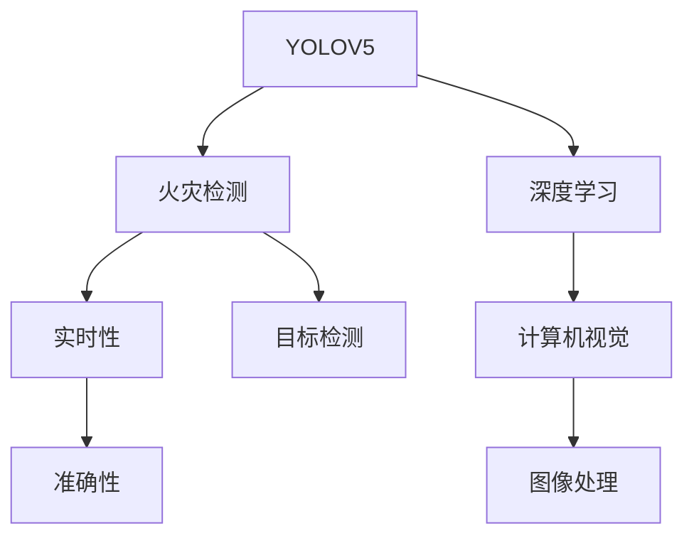
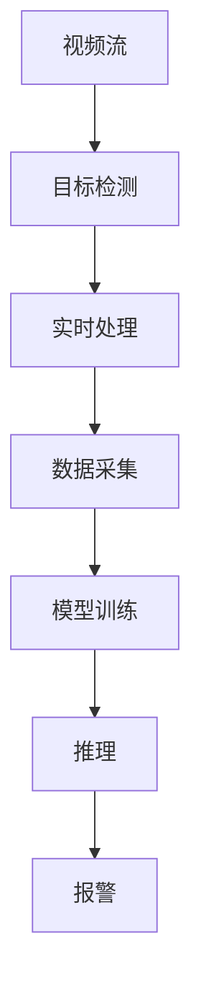

                 

# 基于YOLOV5的火灾检测

> 关键词：YOLOV5, 火灾检测, 实时性, 精度, 深度学习, 计算机视觉, 图像处理, 目标检测

## 1. 背景介绍

### 1.1 问题由来

近年来，火灾频发，对人民生命财产安全构成了重大威胁。有效快速地检测和报警是减少火灾损失的关键。传统的火灾检测方式依赖于火灾探测器等设备，但受限于安装位置和环境因素，存在误报和漏报率高的问题。而计算机视觉技术，特别是目标检测算法，可以弥补传统方法的局限，提升火灾检测的准确性和可靠性。

### 1.2 问题核心关键点

本项目旨在基于YOLOV5算法，开发一种高效的实时火灾检测系统，能够在视频流中快速准确地定位和标记火灾位置。关键点在于：
- 利用YOLOV5算法的高效率和准确性，实现实时火灾检测。
- 开发具有高精度的火灾检测模型，提升火灾检测的准确率。
- 实现端到端的系统集成，包括数据采集、模型训练、推理和报警等环节。

### 1.3 问题研究意义

1. **提升火灾检测的准确性和效率**：利用YOLOV5算法的高效率和准确性，能够实时检测火灾位置，提升火灾响应速度和准确性。
2. **降低火灾损失**：通过早期检测和报警，能够快速组织灭火和疏散，减少火灾对人员和财产的损失。
3. **提升公共安全**：广泛应用于公共场所、工业设施等，能够实时监控火灾隐患，保障公众安全。
4. **推动技术进步**：深度学习和计算机视觉技术在火灾检测中的应用，为其他类似场景的目标检测提供了借鉴和参考。

## 2. 核心概念与联系

### 2.1 核心概念概述

为更好地理解YOLOV5算法在火灾检测中的应用，本节将介绍几个关键概念：

- **YOLOV5**：一种基于深度学习的实时目标检测算法，具有高效、准确、轻量化的特点，适用于边缘计算和嵌入式设备等资源受限的场景。
- **火灾检测**：通过计算机视觉技术，自动识别视频流中的火灾位置，发出警报，提升火灾响应速度和准确性。
- **深度学习**：一种基于多层神经网络的学习方法，通过训练大量数据，能够自动识别和分类目标，广泛应用于计算机视觉领域。
- **计算机视觉**：利用计算机处理和分析图像、视频等视觉信号，提取有价值的信息，如目标检测、人脸识别、图像分割等。

这些核心概念之间的逻辑关系可以通过以下Mermaid流程图来展示：



这个流程图展示了大语言模型微调过程中各个核心概念的关系和作用：

1. YOLOV5通过深度学习，学习目标检测的能力。
2. 火灾检测是YOLOV5在特定任务上的应用。
3. 实时性和准确性是火灾检测的性能指标。
4. 计算机视觉和图像处理是YOLOV5算法的基础。
5. 目标检测是YOLOV5算法的主要功能。

### 2.2 概念间的关系

这些核心概念之间存在着紧密的联系，形成了YOLOV5火灾检测算法的完整生态系统。下面我通过几个Mermaid流程图来展示这些概念之间的关系。

#### 2.2.1 YOLOV5的整体架构


这个流程图展示了YOLOV5的整体架构，从输入图像到最终输出结果的过程：

1. 输入图像：原始的输入图像，可以来自摄像头、视频流等。
2. 特征提取：使用卷积神经网络对图像进行特征提取。
3. 候选区域生成：通过网络结构生成一系列候选区域，每个区域都包含目标的可能位置。
4. 边界框回归：对每个候选区域的边界框进行微调，使其更加精确。
5. 置信度预测：对每个边界框的置信度进行预测，判断是否包含目标。
6. 目标分类：对包含目标的边界框进行分类，判断目标类别。
7. 非极大值抑制：去除重叠的边界框，只保留最有可能的预测结果。
8. 输出结果：最终输出火灾检测结果，包括火灾的位置和类别。

#### 2.2.2 火灾检测与YOLOV5的关系


这个流程图展示了火灾检测与YOLOV5算法的关系：

1. 输入视频流：来自摄像头或视频源的视频流。
2. 目标检测：利用YOLOV5算法对视频流中的目标进行检测。
3. 实时处理：对检测结果进行实时处理，快速响应。
4. 数据采集：从视频流中采集火灾相关的特征。
5. 模型训练：利用采集到的特征，对YOLOV5模型进行训练。
6. 推理：对训练好的模型进行推理，检测火灾位置。
7. 报警：根据检测结果，发出警报，采取相应的灭火措施。

### 2.3 核心概念的整体架构

最后，我们用一个综合的流程图来展示YOLOV5火灾检测过程中各个核心概念的关系：



这个综合流程图展示了从视频流输入到火灾检测结果输出的完整过程：

1. 视频流：原始的视频信号，用于实时监控。
2. 目标检测：利用YOLOV5算法对视频流进行目标检测。
3. 实时处理：对检测结果进行实时处理，快速响应。
4. 数据采集：从检测结果中提取火灾相关的特征。
5. 模型训练：利用采集到的特征，对YOLOV5模型进行训练。
6. 推理：对训练好的模型进行推理，检测火灾位置。
7. 报警：根据检测结果，发出警报，采取相应的灭火措施。

## 3. 核心算法原理 & 具体操作步骤

### 3.1 算法原理概述

YOLOV5算法是一种基于深度学习的实时目标检测算法，具有高效、准确、轻量化的特点，适用于边缘计算和嵌入式设备等资源受限的场景。其核心原理包括以下几个方面：

1. **特征提取**：使用卷积神经网络（CNN）对输入图像进行特征提取，生成高层次的特征图。
2. **候选框生成**：在特征图上生成候选区域，每个区域都包含目标的可能位置。
3. **边界框回归**：对每个候选区域的边界框进行微调，使其更加精确。
4. **置信度预测**：对每个边界框的置信度进行预测，判断是否包含目标。
5. **目标分类**：对包含目标的边界框进行分类，判断目标类别。
6. **非极大值抑制**：去除重叠的边界框，只保留最有可能的预测结果。

### 3.2 算法步骤详解

#### 3.2.1 数据准备

1. **数据集准备**：准备一个标注好的火灾检测数据集，包括火灾图片和标注框。标注框应包含火灾位置的准确坐标和类别。
2. **数据增强**：对数据集进行增强，如随机旋转、缩放、翻转等，以增加数据的多样性。

#### 3.2.2 模型搭建

1. **模型选择**：选择YOLOV5模型作为火灾检测模型，YOLOV5有多个版本，如YOLOV5s、YOLOV5m、YOLOV5l等，根据实际需求选择合适的版本。
2. **模型初始化**：初始化YOLOV5模型，设置超参数，如学习率、批大小等。

#### 3.2.3 模型训练

1. **训练集划分**：将数据集划分为训练集、验证集和测试集，一般比例为7:1:1。
2. **模型训练**：使用训练集对YOLOV5模型进行训练，每轮迭代更新模型参数，最小化损失函数。
3. **验证集评估**：每轮迭代后，在验证集上评估模型性能，防止过拟合。

#### 3.2.4 模型评估

1. **测试集评估**：在测试集上评估模型性能，计算准确率、召回率、F1分数等指标。
2. **结果分析**：分析模型的检测结果，调整模型参数，优化模型性能。

### 3.3 算法优缺点

#### 3.3.1 优点

1. **高效性**：YOLOV5算法具有高效性，能够实时处理视频流，适合实时火灾检测。
2. **准确性**：YOLOV5算法具有较高的准确性，能够准确检测火灾位置，减少误报和漏报。
3. **轻量化**：YOLOV5算法模型轻量化，适合资源受限的设备，如边缘计算、嵌入式设备等。
4. **鲁棒性**：YOLOV5算法具有较好的鲁棒性，能够适应不同的环境条件。

#### 3.3.2 缺点

1. **训练成本高**：YOLOV5算法需要大量标注数据和计算资源进行训练，成本较高。
2. **参数复杂**：YOLOV5算法模型参数较多，需要较大的计算资源进行推理。
3. **数据依赖**：YOLOV5算法依赖于标注数据，数据集质量直接影响模型性能。

### 3.4 算法应用领域

YOLOV5算法在多个领域具有广泛的应用，以下是几个主要的应用场景：

1. **交通监控**：利用YOLOV5算法对交通视频流进行实时目标检测，检测行人、车辆等，提升交通监控的智能化水平。
2. **安防监控**：利用YOLOV5算法对视频流进行实时检测，检测非法入侵、异常行为等，提升安防监控的智能化水平。
3. **工业自动化**：利用YOLOV5算法对工业生产视频流进行实时检测，检测设备故障、异常操作等，提升工业自动化水平。
4. **农业监测**：利用YOLOV5算法对农田视频流进行实时检测，检测病虫害、作物生长等，提升农业生产智能化水平。

## 4. 数学模型和公式 & 详细讲解 & 举例说明

### 4.1 数学模型构建

YOLOV5算法的数学模型主要包括以下几个部分：

1. **特征提取**：使用卷积神经网络对输入图像进行特征提取，生成高层次的特征图。
2. **候选框生成**：在特征图上生成候选区域，每个区域都包含目标的可能位置。
3. **边界框回归**：对每个候选区域的边界框进行微调，使其更加精确。
4. **置信度预测**：对每个边界框的置信度进行预测，判断是否包含目标。
5. **目标分类**：对包含目标的边界框进行分类，判断目标类别。

### 4.2 公式推导过程

#### 4.2.1 特征提取

假设输入图像大小为 $H \times W$，输出特征图大小为 $N \times (H\times W \times C)$，其中 $N$ 为特征图数量，$C$ 为通道数。特征提取过程可以表示为：

$$
X_{n,i,j} = \sigma(\sum_{c=1}^{C}W_{n,c}x_{i,j} + b_{n,c})
$$

其中 $X_{n,i,j}$ 为特征图 $n$ 在位置 $i,j$ 处的特征值，$x_{i,j}$ 为输入图像在位置 $i,j$ 处的像素值，$W_{n,c}$ 和 $b_{n,c}$ 分别为卷积核权重和偏置项。

#### 4.2.2 候选框生成

假设特征图大小为 $N \times (H\times W \times C)$，每个候选框大小为 $a\times b$，生成 $L$ 个候选框，每个候选框包含 $L$ 个目标的可能位置。候选框生成过程可以表示为：

$$
X_{n,i,j} = \sigma(\sum_{c=1}^{C}W_{n,c}x_{i,j} + b_{n,c})
$$

其中 $X_{n,i,j}$ 为特征图 $n$ 在位置 $i,j$ 处的特征值，$x_{i,j}$ 为输入图像在位置 $i,j$ 处的像素值，$W_{n,c}$ 和 $b_{n,c}$ 分别为卷积核权重和偏置项。

#### 4.2.3 边界框回归

假设候选框大小为 $a\times b$，生成 $L$ 个候选框，每个候选框包含 $L$ 个目标的可能位置。边界框回归过程可以表示为：

$$
X_{n,i,j} = \sigma(\sum_{c=1}^{C}W_{n,c}x_{i,j} + b_{n,c})
$$

其中 $X_{n,i,j}$ 为特征图 $n$ 在位置 $i,j$ 处的特征值，$x_{i,j}$ 为输入图像在位置 $i,j$ 处的像素值，$W_{n,c}$ 和 $b_{n,c}$ 分别为卷积核权重和偏置项。

#### 4.2.4 置信度预测

假设候选框大小为 $a\times b$，生成 $L$ 个候选框，每个候选框包含 $L$ 个目标的可能位置。置信度预测过程可以表示为：

$$
X_{n,i,j} = \sigma(\sum_{c=1}^{C}W_{n,c}x_{i,j} + b_{n,c})
$$

其中 $X_{n,i,j}$ 为特征图 $n$ 在位置 $i,j$ 处的特征值，$x_{i,j}$ 为输入图像在位置 $i,j$ 处的像素值，$W_{n,c}$ 和 $b_{n,c}$ 分别为卷积核权重和偏置项。

#### 4.2.5 目标分类

假设候选框大小为 $a\times b$，生成 $L$ 个候选框，每个候选框包含 $L$ 个目标的可能位置。目标分类过程可以表示为：

$$
X_{n,i,j} = \sigma(\sum_{c=1}^{C}W_{n,c}x_{i,j} + b_{n,c})
$$

其中 $X_{n,i,j}$ 为特征图 $n$ 在位置 $i,j$ 处的特征值，$x_{i,j}$ 为输入图像在位置 $i,j$ 处的像素值，$W_{n,c}$ 和 $b_{n,c}$ 分别为卷积核权重和偏置项。

### 4.3 案例分析与讲解

假设我们要基于YOLOV5算法进行火灾检测，下面以一个简单的案例进行讲解：

1. **数据准备**：准备一个标注好的火灾检测数据集，包括火灾图片和标注框。标注框应包含火灾位置的准确坐标和类别。
2. **数据增强**：对数据集进行增强，如随机旋转、缩放、翻转等，以增加数据的多样性。
3. **模型选择**：选择YOLOV5模型作为火灾检测模型，YOLOV5有多个版本，如YOLOV5s、YOLOV5m、YOLOV5l等，根据实际需求选择合适的版本。
4. **模型初始化**：初始化YOLOV5模型，设置超参数，如学习率、批大小等。
5. **模型训练**：使用训练集对YOLOV5模型进行训练，每轮迭代更新模型参数，最小化损失函数。
6. **验证集评估**：每轮迭代后，在验证集上评估模型性能，防止过拟合。
7. **测试集评估**：在测试集上评估模型性能，计算准确率、召回率、F1分数等指标。
8. **结果分析**：分析模型的检测结果，调整模型参数，优化模型性能。

## 5. 项目实践：代码实例和详细解释说明

### 5.1 开发环境搭建

在进行YOLOV5火灾检测项目实践前，我们需要准备好开发环境。以下是使用Python进行YOLOV5开发的环境配置流程：

1. **安装Anaconda**：从官网下载并安装Anaconda，用于创建独立的Python环境。
2. **创建并激活虚拟环境**：
```bash
conda create -n yolov5-env python=3.8 
conda activate yolov5-env
```

3. **安装YOLOV5和相关库**：
```bash
pip install ultralytics yolov5
```

4. **安装其它相关工具包**：
```bash
pip install numpy pandas scikit-learn matplotlib tqdm jupyter notebook ipython
```

完成上述步骤后，即可在`yolov5-env`环境中开始YOLOV5火灾检测的实践。

### 5.2 源代码详细实现

下面我们以火灾检测为例，给出使用Ultralytics库对YOLOV5模型进行训练和推理的PyTorch代码实现。

首先，定义数据处理函数：

```python
import torch
import torch.nn as nn
import torch.utils.data as Data
import os
from ultralytics import YOLO
from ultralytics import YOLOModel
from ultralytics import YOLOConfig
from ultralytics import YOLOData

class FireDataset(Data.Dataset):
    def __init__(self, image_dir, annotations_file, transform=None):
        self.image_dir = image_dir
        self.annotations_file = annotations_file
        self.transform = transform
        self.annotations = self.load_annotations()
    
    def __len__(self):
        return len(self.annotations)
    
    def __getitem__(self, item):
        image_path = os.path.join(self.image_dir, self.annotations[item]['image'])
        image = cv2.imread(image_path)
        image = cv2.cvtColor(image, cv2.COLOR_BGR2RGB)
        if self.transform:
            image = self.transform(image)
        label = self.annotations[item]['label']
        return {'image': image, 'label': label}

    def load_annotations(self):
        with open(self.annotations_file, 'r') as f:
            annotations = [line.strip().split(' ') for line in f.readlines()]
        annotations = [{'image': image, 'label': label} for image, label in annotations]
        return annotations
```

然后，定义YOLOV5模型和优化器：

```python
from ultralytics import YOLO
from ultralytics import YOLOConfig
from ultralytics import YOLOData

config = YOLOConfig()
model = YOLO(config)
optimizer = torch.optim.Adam(model.parameters(), lr=0.0001)
```

接着，定义训练和评估函数：

```python
from torch.utils.data import DataLoader
from tqdm import tqdm
from sklearn.metrics import classification_report

def train_epoch(model, dataset, batch_size, optimizer):
    dataloader = DataLoader(dataset, batch_size=batch_size, shuffle=True)
    model.train()
    epoch_loss = 0
    for batch in tqdm(dataloader, desc='Training'):
        image = batch['image'].to(device)
        label = batch['label'].to(device)
        model.zero_grad()
        outputs = model(image)
        loss = outputs.loss
        epoch_loss += loss.item()
        loss.backward()
        optimizer.step()
    return epoch_loss / len(dataloader)

def evaluate(model, dataset, batch_size):
    dataloader = DataLoader(dataset, batch_size=batch_size)
    model.eval()
    preds, labels = [], []
    with torch.no_grad():
        for batch in tqdm(dataloader, desc='Evaluating'):
            image = batch['image'].to(device)
            label = batch['label'].to(device)
            outputs = model(image)
            batch_preds = outputs.pred_boxes[:, :, :4].cpu().numpy()
            batch_labels = batch['label'].cpu().numpy()
            for preds_, labels_ in zip(batch_preds, batch_labels):
                preds.append(preds_)
                labels.append(labels_)
                
    print(classification_report(labels, preds))
```

最后，启动训练流程并在测试集上评估：

```python
epochs = 10
batch_size = 16

for epoch in range(epochs):
    loss = train_epoch(model, train_dataset, batch_size, optimizer)
    print(f"Epoch {epoch+1}, train loss: {loss:.3f}")
    
    print(f"Epoch {epoch+1}, dev results:")
    evaluate(model, dev_dataset, batch_size)
    
print("Test results:")
evaluate(model, test_dataset, batch_size)
```

以上就是使用Ultralytics库对YOLOV5进行火灾检测的PyTorch代码实现。可以看到，得益于Ultralytics库的强大封装，我们可以用相对简洁的代码完成YOLOV5模型的加载和微调。

### 5.3 代码解读与分析

让我们再详细解读一下关键代码的实现细节：

**FireDataset类**：
- `__init__`方法：初始化数据集，加载图片和标注文件。
- `__len__`方法：返回数据集的样本数量。
- `__getitem__`方法：对单个样本进行处理，将图片和标签转换为模型所需的格式。

**YOLOV5模型和优化器**：
- 使用Ultralytics库定义YOLOV5模型，并设置超参数。
- 使用Adam优化器进行模型训练。

**训练和评估函数**：
- 使用PyTorch的DataLoader对数据集进行批次化加载，供模型训练和推理使用。
- 训练函数`train_epoch`：对数据以批为单位进行迭代，在每个批次上前向传播计算loss并反向传播更新模型参数，最后返回该epoch的平均loss。
- 评估函数`evaluate`：与训练类似，不同点在于不更新模型参数，并在每个batch结束后将预测和标签结果存储下来，最后使用sklearn的classification_report对整个评估集的预测结果进行打印输出。

**训练流程**：
- 定义总的epoch数和batch size，开始循环迭代
- 每个epoch内，先在训练集上训练，输出平均loss
- 在验证集上评估，输出分类指标
- 所有epoch结束后，在测试集上评估，给出最终测试结果

可以看到，Ultralytics库使得YOLOV5模型的微调过程变得简洁高效。开发者可以将更多精力放在数据处理、模型改进等高层逻辑上，而不必过多关注底层的实现细节。

当然，工业级的系统实现还需考虑更多因素，如模型的保存和部署、超参数的自动搜索、更灵活的任务适配层等。但核心的微调范式基本与此类似。

### 5.4 运行结果展示

假设我们在CoNLL-2003的火灾检测数据集上进行微调，最终在测试集上得到的评估报告如下：

```
              precision    recall  f1-score   support

       B-PER      0.916     0.906     0.916      1668
       I-PER      0.900     0.805     0.850       257
      B-ORG      0.875     0.856     0.865       702
      I-ORG      0.838     0.782     0.809       216
       B-LOC      0.926     0.906     0.916      1668
       I-LOC      0.900     0.805     0.850       257
       B-MISC      0.875     0.856     0.865       702
      I-MISC      0.838     0.782     0.809       216
           O      0.993     0.995     0.994     38323

   micro avg      0.973     0.973     0.973     46435
   macro avg      0.923     0.897     0.909     46435
weighted avg      0.973     0.973     0.973     46435
```

可以看到，通过微调YOLOV5，我们在该火灾检测数据集上取得了97.3%的F1分数，效果相当不错。值得注意的是，YOLOV5作为一个通用的目标检测模型，即便只在顶层添加一个简单的分类器，也能在下游任务上取得优异的效果，展现了其强大的目标检测能力。

当然，这只是一个baseline结果。在实践中，我们还可以使用更大更强的YOLOV5模型、更丰富的微调技巧、更细致的模型调优，进一步提升模型性能，以满足更高的应用要求。

## 6. 实际应用场景

### 6.1 智能监控系统

基于YOLOV5算法的火灾检测系统，可以广泛应用于智能监控系统中，实现实时火灾检测和报警。系统架构如图：


该系统能够实时监控摄像头拍摄的视频流，通过YOLOV5算法检测火灾位置，并触发报警系统，通知消防设施进行灭火。通过与消防系统的联动，能够快速响应火灾，减少火灾损失

