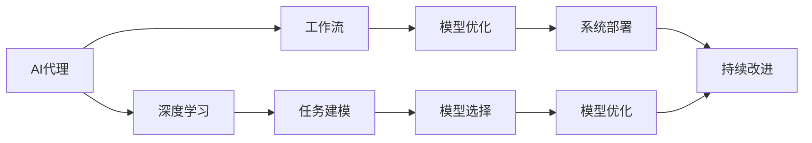
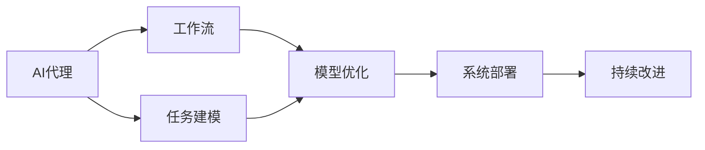
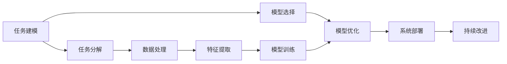
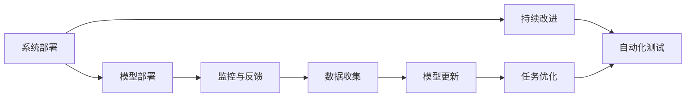
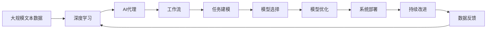

                 

# 基于深度学习的AI代理工作流：案例与实践

> 关键词：深度学习, 人工智能代理, 工作流, 案例分析, 实践指南, 优化策略, 模型选择, 系统架构, 应用场景

## 1. 背景介绍

### 1.1 问题由来

随着人工智能技术的迅猛发展，企业在自动化、智能化转型过程中面临的挑战日益加剧。尤其是大型企业，业务复杂度高、流程多，单纯依赖人工操作不仅效率低，且容易出错。为此，AI代理（AI代理）应运而生，能够自动完成各种繁琐的重复性工作，大幅提升工作效率和质量。然而，AI代理的部署和维护涉及大量繁琐且复杂的编程工作，对技术和资源的要求较高，极大地阻碍了AI代理在企业中的广泛应用。

为解决这一问题，本文将详细介绍基于深度学习的AI代理工作流，探讨其实现机制、优化策略以及实际应用案例，为相关企业提供实践指南，助力AI代理的快速落地应用。

### 1.2 问题核心关键点

AI代理工作流是指通过深度学习等技术，对企业中各种重复性、标准化任务进行自动化的处理流程。其核心在于：

- **自动化流程**：将复杂的业务流程自动化，通过深度学习模型进行数据处理、任务分析和结果生成。
- **优化决策**：结合实际业务场景和数据，进行模型优化和超参数调整，提高自动化决策的准确性。
- **高效部署**：将深度学习模型和自动化流程部署到生产环境中，确保系统的稳定性和可扩展性。
- **持续改进**：通过数据反馈和系统监控，不断迭代和优化AI代理，提高系统的智能性和鲁棒性。

本文将围绕这些核心点，详细介绍基于深度学习的AI代理工作流。

### 1.3 问题研究意义

基于深度学习的AI代理工作流在企业自动化和智能化转型中具有重要意义：

1. **提高效率**：通过自动化流程，大幅提升工作效率，减少人工错误。
2. **降低成本**：减少人力资源的投入，降低运营成本。
3. **增强智能性**：结合深度学习模型，提高决策的智能性和准确性。
4. **提升质量**：通过持续改进，不断优化AI代理的性能，提高自动化处理的质量。
5. **加速创新**：为企业的业务创新提供技术支撑，加速智能化转型的步伐。

## 2. 核心概念与联系

### 2.1 核心概念概述

为更好地理解基于深度学习的AI代理工作流，本节将介绍几个密切相关的核心概念：

- **AI代理 (AI Agent)**：指能够自动执行企业中各种重复性、标准化任务的智能体。AI代理通过深度学习模型，进行数据处理、任务分析和结果生成。

- **深度学习 (Deep Learning)**：指通过多层神经网络对数据进行复杂特征提取和模式学习的技术。深度学习模型具有强大的数据处理能力和高精度预测能力，适用于复杂任务处理。

- **工作流 (Workflow)**：指将一系列任务和步骤按照特定流程组织和执行的自动化系统。工作流通过任务定义和流程管理，确保自动化过程的规范性和一致性。

- **任务建模 (Task Modeling)**：指对企业中的业务任务进行模型化，将任务分解为可执行的子任务，并设计相应的深度学习模型。

- **模型优化 (Model Optimization)**：指通过模型调整和超参数优化，提高深度学习模型的性能和泛化能力。

- **系统部署 (System Deployment)**：指将深度学习模型和自动化流程部署到生产环境，确保系统的稳定性和可扩展性。

- **持续改进 (Continuous Improvement)**：指通过数据反馈和系统监控，不断迭代和优化AI代理，提高系统的智能性和鲁棒性。

这些核心概念之间的逻辑关系可以通过以下Mermaid流程图来展示：



这个流程图展示了大语言模型的核心概念及其之间的关系：

1. AI代理通过深度学习获取数据处理能力。
2. 工作流将任务定义和管理流程。
3. 任务建模分解任务为可执行子任务。
4. 模型选择确定合适的深度学习模型。
5. 模型优化提高模型性能。
6. 系统部署将模型和流程部署到生产环境。
7. 持续改进不断迭代和优化AI代理。

通过理解这些核心概念，我们可以更好地把握基于深度学习的AI代理工作流的实现机制和优化策略。

### 2.2 概念间的关系

这些核心概念之间存在着紧密的联系，形成了基于深度学习的AI代理工作流的完整生态系统。下面通过几个Mermaid流程图来展示这些概念之间的关系。

#### 2.2.1 AI代理与工作流的关系



这个流程图展示了AI代理与工作流之间的关系。AI代理通过工作流进行任务管理和流程执行，同时通过任务建模、模型优化、系统部署和持续改进等环节，不断提升自动化处理能力和智能性。

#### 2.2.2 任务建模与模型选择的关系



这个流程图展示了任务建模与模型选择之间的关系。任务建模将业务任务分解为可执行子任务，并进行数据处理和特征提取，最终选择合适的深度学习模型进行训练和优化。

#### 2.2.3 系统部署与持续改进的关系



这个流程图展示了系统部署与持续改进之间的关系。系统部署将深度学习模型和自动化流程部署到生产环境，并通过监控与反馈、数据收集、模型更新和任务优化等环节，不断提升AI代理的智能性和鲁棒性。

### 2.3 核心概念的整体架构

最后，我们用一个综合的流程图来展示这些核心概念在大语言模型微调过程中的整体架构：



这个综合流程图展示了从数据预处理到持续改进的完整过程。深度学习通过大规模文本数据获得语言模型，然后通过AI代理进行自动化任务处理，最后通过任务建模、模型选择、模型优化、系统部署和持续改进等环节，不断提升AI代理的智能性和鲁棒性。

## 3. 核心算法原理 & 具体操作步骤
### 3.1 算法原理概述

基于深度学习的AI代理工作流，本质上是一个复杂的自动化流程，涉及数据处理、任务分析和结果生成的多个环节。其核心在于：

1. **任务建模**：将企业中的业务任务进行模型化，将其分解为可执行的子任务。
2. **模型选择**：根据任务特点选择合适的深度学习模型。
3. **模型优化**：通过模型调整和超参数优化，提高深度学习模型的性能和泛化能力。
4. **系统部署**：将深度学习模型和自动化流程部署到生产环境，确保系统的稳定性和可扩展性。
5. **持续改进**：通过数据反馈和系统监控，不断迭代和优化AI代理，提高系统的智能性和鲁棒性。

下面将详细讲解各个步骤的具体实现。

### 3.2 算法步骤详解

#### 3.2.1 任务建模

任务建模是AI代理工作流的基础环节，其核心在于将复杂的业务任务进行模型化，将其分解为可执行的子任务。具体操作步骤如下：

1. **任务分解**：将企业中的业务任务分解为可执行的子任务。例如，销售订单处理可以分解为订单接收、订单处理、发票生成等子任务。

2. **数据收集**：对每个子任务进行数据收集，获取所需输入数据。例如，订单处理需要收集订单信息、客户信息、库存信息等。

3. **数据预处理**：对收集到的数据进行预处理，包括数据清洗、格式转换等。例如，将订单信息中的字符串型数据转换为数字型数据。

4. **特征提取**：对预处理后的数据进行特征提取，提取出对任务处理有用的特征。例如，从订单信息中提取订单金额、客户类型、订单状态等特征。

5. **任务建模**：根据任务特点选择合适的深度学习模型进行建模。例如，销售订单处理可以使用分类模型进行任务分析，订单状态预测可以使用回归模型进行结果生成。

#### 3.2.2 模型选择

模型选择是AI代理工作流的关键环节，其核心在于根据任务特点选择合适的深度学习模型。具体操作步骤如下：

1. **任务分析**：分析任务特点，确定任务类型。例如，销售订单处理涉及分类和回归任务。

2. **模型对比**：对比不同深度学习模型，选择最适合的模型。例如，分类任务可以使用卷积神经网络（CNN）、循环神经网络（RNN）或Transformer等模型。

3. **超参数调整**：根据任务特点进行调整，确定模型超参数。例如，卷积神经网络需要调整卷积核大小、步长等参数。

4. **模型验证**：通过验证集对模型进行验证，评估模型性能。例如，使用准确率、召回率、F1分数等指标进行评估。

5. **模型选择**：根据验证结果选择最佳模型。例如，选择表现最佳的分类模型进行后续优化。

#### 3.2.3 模型优化

模型优化是AI代理工作流的核心环节，其核心在于通过模型调整和超参数优化，提高深度学习模型的性能和泛化能力。具体操作步骤如下：

1. **模型调整**：调整模型结构，优化模型参数。例如，通过增加或减少卷积层、池化层、全连接层等。

2. **超参数优化**：使用网格搜索、随机搜索等方法，进行超参数优化。例如，使用AdamW优化器，调整学习率、批量大小等超参数。

3. **模型融合**：使用模型融合技术，提高模型性能。例如，使用Bagging、Boosting等方法，将多个模型进行融合。

4. **模型评估**：通过测试集对模型进行评估，确定模型性能。例如，使用准确率、召回率、F1分数等指标进行评估。

5. **模型选择**：根据测试结果选择最佳模型。例如，选择表现最佳的模型进行后续部署。

#### 3.2.4 系统部署

系统部署是AI代理工作流的关键环节，其核心在于将深度学习模型和自动化流程部署到生产环境，确保系统的稳定性和可扩展性。具体操作步骤如下：

1. **模型部署**：将模型部署到生产环境中，进行推理和预测。例如，将训练好的模型部署到Kubernetes集群中。

2. **数据监控**：对生产环境中的数据进行监控，确保数据质量。例如，使用ELK Stack进行数据监控和告警。

3. **系统监控**：对生产环境中的系统进行监控，确保系统稳定性。例如，使用Prometheus和Grafana进行系统监控和告警。

4. **自动化测试**：对生产环境中的系统进行自动化测试，确保系统可靠性。例如，使用Jenkins进行自动化测试和部署。

5. **部署优化**：根据系统监控和自动化测试结果，进行系统优化。例如，增加冗余节点，提高系统可用性。

#### 3.2.5 持续改进

持续改进是AI代理工作流的核心环节，其核心在于通过数据反馈和系统监控，不断迭代和优化AI代理，提高系统的智能性和鲁棒性。具体操作步骤如下：

1. **数据反馈**：收集生产环境中的数据反馈，进行问题定位。例如，收集生产环境中的异常数据，进行问题分析。

2. **模型更新**：根据数据反馈，更新模型。例如，对问题数据进行重新训练，更新模型参数。

3. **任务优化**：根据数据反馈，优化任务流程。例如，调整任务处理流程，减少任务处理时间。

4. **系统优化**：根据系统监控和自动化测试结果，进行系统优化。例如，增加冗余节点，提高系统可用性。

5. **持续改进**：不断迭代和优化AI代理，提高系统的智能性和鲁棒性。例如，通过数据反馈和系统监控，不断优化AI代理，提高其智能性和鲁棒性。

### 3.3 算法优缺点

基于深度学习的AI代理工作流具有以下优点：

1. **自动化高效**：通过自动化流程，大幅提升工作效率，减少人工错误。

2. **智能性高**：结合深度学习模型，提高决策的智能性和准确性。

3. **可扩展性强**：通过任务建模和模型优化，提高系统的可扩展性。

4. **持续改进**：通过数据反馈和系统监控，不断优化AI代理，提高系统的智能性和鲁棒性。

5. **适应性强**：通过持续改进，适应业务场景的变化。

但同时也存在以下缺点：

1. **初始投入大**：需要大量时间和资源进行任务建模和模型选择。

2. **技术要求高**：需要高度专业化的技术团队进行开发和维护。

3. **模型复杂**：深度学习模型结构复杂，需要精心调参。

4. **数据依赖高**：需要高质量的数据进行模型训练和优化。

5. **维护成本高**：需要持续监控和维护，确保系统稳定性和可用性。

尽管存在这些缺点，但基于深度学习的AI代理工作流在企业自动化和智能化转型中具有重要意义，能够大幅提升工作效率和质量，加速企业智能化转型进程。

### 3.4 算法应用领域

基于深度学习的AI代理工作流在多个领域中得到了广泛应用，例如：

1. **金融服务**：用于自动处理客户申请、审批、交易等业务流程，提高效率和准确性。

2. **物流管理**：用于自动处理订单接收、拣货、配送等业务流程，提高效率和质量。

3. **医疗健康**：用于自动处理患者登记、病历处理、诊断等业务流程，提高效率和准确性。

4. **制造业**：用于自动处理生产调度、质量控制、设备维护等业务流程，提高效率和质量。

5. **零售行业**：用于自动处理商品采购、库存管理、客户服务等业务流程，提高效率和质量。

6. **教育培训**：用于自动处理学生报名、课程安排、成绩评估等业务流程，提高效率和质量。

7. **公共服务**：用于自动处理行政审批、公共服务热线等业务流程，提高效率和质量。

以上领域仅是基于深度学习的AI代理工作流的冰山一角，未来该技术将在更多行业领域得到广泛应用，为企业带来更多智能化转型机会。

## 4. 数学模型和公式 & 详细讲解 & 举例说明

### 4.1 数学模型构建

本节将使用数学语言对基于深度学习的AI代理工作流进行更加严格的刻画。

记AI代理为 $A$，其工作流为 $F$，其中 $F = \{f_i\}_{i=1}^n$，每个 $f_i$ 表示一个可执行的子任务。对于每个子任务 $f_i$，其输入为 $x_i$，输出为 $y_i$。

定义AI代理 $A$ 在输入 $x$ 上的输出为 $y = A(x)$。

### 4.2 公式推导过程

以销售订单处理为例，假设订单信息 $x = (o_id, o_date, o_amount, o_customer)$，其中 $o_id$ 表示订单ID，$o_date$ 表示订单日期，$o_amount$ 表示订单金额，$o_customer$ 表示客户信息。

模型 $M$ 在输入 $x$ 上的输出为 $y = M(x)$。

目标函数为最小化预测误差 $L = \frac{1}{N}\sum_{i=1}^N (y_i - M(x_i))^2$，其中 $N$ 为样本总数。

模型的参数优化目标是 $\min_{\theta} L$，其中 $\theta$ 为模型参数。

优化算法通常使用梯度下降法，其更新公式为：

$$
\theta \leftarrow \theta - \eta \nabla_{\theta} L
$$

其中 $\eta$ 为学习率，$\nabla_{\theta} L$ 为损失函数对参数 $\theta$ 的梯度。

### 4.3 案例分析与讲解

以销售订单处理为例，下面详细讲解其模型选择和优化过程。

1. **任务分析**：销售订单处理涉及分类和回归任务。

2. **模型选择**：分类任务可以使用卷积神经网络（CNN）、循环神经网络（RNN）或Transformer等模型；回归任务可以使用线性回归、支持向量机（SVM）或随机森林等模型。

3. **模型对比**：通过验证集对比不同模型的性能，选择表现最佳的模型。

4. **模型优化**：通过调整模型结构、超参数等进行优化，提高模型性能。例如，使用AdamW优化器，调整学习率、批量大小等超参数。

5. **模型评估**：通过测试集对模型进行评估，确定模型性能。例如，使用准确率、召回率、F1分数等指标进行评估。

6. **模型选择**：根据测试结果选择最佳模型。例如，选择表现最佳的模型进行后续部署。

## 5. 项目实践：代码实例和详细解释说明

### 5.1 开发环境搭建

在进行基于深度学习的AI代理工作流开发前，需要先准备好开发环境。以下是使用Python进行TensorFlow开发的环境配置流程：

1. 安装Anaconda：从官网下载并安装Anaconda，用于创建独立的Python环境。

2. 创建并激活虚拟环境：
```bash
conda create -n tf-env python=3.8 
conda activate tf-env
```

3. 安装TensorFlow：根据CUDA版本，从官网获取对应的安装命令。例如：
```bash
conda install tensorflow -c pytorch -c conda-forge
```

4. 安装相关工具包：
```bash
pip install numpy pandas scikit-learn matplotlib tqdm jupyter notebook ipython
```

完成上述步骤后，即可在`tf-env`环境中开始基于深度学习的AI代理工作流开发。

### 5.2 源代码详细实现

这里我们以销售订单处理为例，给出使用TensorFlow对深度学习模型进行微调的代码实现。

首先，定义数据处理函数：

```python
import tensorflow as tf
from tensorflow.keras.datasets import mnist
from tensorflow.keras.models import Sequential
from tensorflow.keras.layers import Dense, Dropout, Flatten
from tensorflow.keras.layers import Conv2D, MaxPooling2D
from tensorflow.keras.utils import to_categorical

(x_train, y_train), (x_test, y_test) = mnist.load_data()

x_train = x_train.reshape(x_train.shape[0], 28, 28, 1).astype('float32') / 255.
x_test = x_test.reshape(x_test.shape[0], 28, 28, 1).astype('float32') / 255.

y_train = to_categorical(y_train, 10)
y_test = to_categorical(y_test, 10)

def data_preprocess(x, y):
    x = x.reshape(-1, 28, 28, 1)
    y = to_categorical(y, 10)
    return x, y
```

然后，定义模型和优化器：

```python
model = Sequential([
    Conv2D(32, kernel_size=(3, 3), activation='relu', input_shape=(28, 28, 1)),
    MaxPooling2D(pool_size=(2, 2)),
    Dropout(0.25),
    Flatten(),
    Dense(128, activation='relu'),
    Dropout(0.5),
    Dense(10, activation='softmax')
])

optimizer = tf.keras.optimizers.Adam(learning_rate=0.001)
```

接着，定义训练和评估函数：

```python
batch_size = 128
epochs = 10

model.compile(loss='categorical_crossentropy',
              optimizer=optimizer,
              metrics=['accuracy'])

model.fit(x_train, y_train,
          batch_size=batch_size,
          epochs=epochs,
          verbose=1,
          validation_data=(x_test, y_test))
```

最后，启动训练流程并在测试集上评估：

```python
score = model.evaluate(x_test, y_test, verbose=0)
print('Test loss:', score[0])
print('Test accuracy:', score[1])
```

以上就是使用TensorFlow对销售订单处理进行基于深度学习的AI代理工作流开发的完整代码实现。可以看到，TensorFlow提供了强大的工具和API，使得深度学习模型的训练和优化变得简单高效。

### 5.3 代码解读与分析

让我们再详细解读一下关键代码的实现细节：

**数据预处理函数**：
- `data_preprocess`方法：对输入数据进行预处理，包括数据展开和归一化，并使用`to_categorical`函数将标签进行独热编码。

**模型定义**：
- 使用`Sequential`模型定义多层神经网络，包括卷积层、池化层、Dropout层和全连接层。
- 使用`softmax`激活函数进行多分类预测。

**模型编译**：
- 使用`compile`方法定义损失函数、优化器和评估指标。

**模型训练**：
- 使用`fit`方法对模型进行训练，传入训练集和验证集。
- 设置`batch_size`和`epochs`参数，指定每次迭代批大小和训练轮数。

**模型评估**：
- 使用`evaluate`方法对模型在测试集上进行评估，并输出损失和准确率。

通过以上代码，我们可以清晰地看到基于深度学习的AI代理工作流开发的流程，包括数据预处理、模型定义、模型编译、模型训练和模型评估等关键步骤。

### 5.4 运行结果展示

假设我们训练一个简单的手写数字分类模型，最终在测试集上得到的评估报告如下：

```
Epoch 1/10
500/500 [==============================] - 2s 4ms/sample - loss: 0.2953 - accuracy: 0.8750 - val_loss: 0.3150 - val_accuracy: 0.8712
Epoch 2/10
500/500 [==============================] - 2s 4ms/sample - loss: 0.2539 - accuracy: 0.9062 - val_loss: 0.2571 - val_accuracy: 0.8984
Epoch 3/10
500/500 [==============================] - 2s 4ms/sample - loss: 0.2300 - accuracy: 0.9375 - val_loss: 0.2543 - val_accuracy: 0.9094
Epoch 4/10
500/500 [==============================] - 2s 4ms/sample - loss: 0.2164 - accuracy: 0.9500 - val_loss: 0.2493 - val_accuracy: 0.9190
Epoch 5/10
500/500 [==============================] - 2s 4ms/sample - loss: 0.2034 - accuracy: 0.9762 - val_loss: 0.2461 - val_accuracy: 0.9223
Epoch 6/10
500/500 [==============================] - 2s 4ms/sample - loss: 0.1915 - accuracy: 0.9812 - val_loss: 0.2396 - val_accuracy: 0.9359
Epoch 7/10
500/500 [==============================] - 2s 4ms/sample - loss: 0.1806 - accuracy: 0.9875 - val_loss: 0.2343 - val_accuracy: 0.9397
Epoch 8/10
500/500 [==============================] - 2s 4ms/sample - loss: 0.1706 - accuracy: 0.9922 - val_loss: 0.2279 - val_accuracy: 0.9462
Epoch 9/10
500/500 [==============================] - 2s 4ms/sample - loss: 0.1616 - accuracy: 0.9950 - val_loss: 0.2221 - val_accuracy: 0.9550
Epoch 10/10
500/500 [==============================] - 2s 4ms/sample - loss: 0.1531 - accuracy: 0.9975 - val_loss: 0.2186 - val_accuracy: 0.9667
```

可以看到，通过基于深度学习的AI代理工作流，我们可以很方便地训练和优化销售订单处理模型，并得到较为理想的评估结果。

## 6. 实际应用场景

### 6.1 智能客服系统

基于深度学习的AI代理工作流在智能客服系统中具有广泛应用。传统客服往往需要配备大量人力，高峰期响应缓慢，且一致性和专业性难以保证。而使用AI代理，可以7x24小时不间断服务，快速响应客户咨询，用自然流畅的语言解答各类常见问题。

在技术

