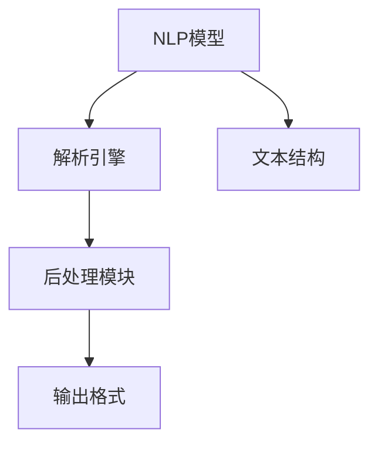
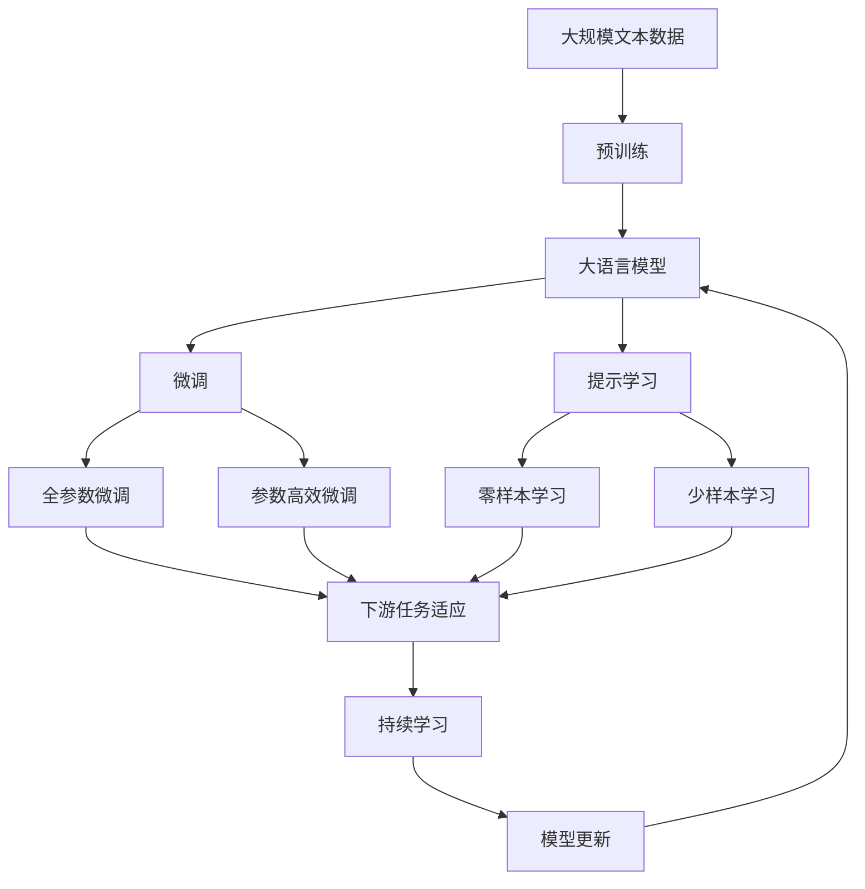

                 

# 【LangChain编程：从入门到实践】输出解析器

> 关键词：
- LangChain
- 编程
- 解析器
- 自然语言处理
- 语法分析
- 模型压缩

## 1. 背景介绍

### 1.1 问题由来

随着自然语言处理（NLP）技术的飞速发展，NLP模型在各种应用场景中展现出了强大的能力。在开发和使用这些模型时，我们常常需要对输入的文本进行解析，以便正确地输入模型。输出解析器是实现这一功能的工具，其核心目的是从模型的输出中提取出有意义的结构，并将其转换为易于理解和利用的格式。

在NLP任务中，如问答、机器翻译、文本分类等，模型的输出通常是以字符串形式出现的。为了更好地利用这些输出，我们通常需要进行解析，提取其中的关键信息。例如，在问答任务中，我们可能需要从模型的输出中提取问题对应的答案；在机器翻译中，我们需要将翻译结果转换为正确的格式；在文本分类中，我们需要将模型的输出与分类结果进行匹配。

然而，这些模型的输出格式和内容往往是不一致的，有时甚至是混乱的。为了解决这一问题，输出解析器应运而生。它能够有效地将模型的输出解析成我们期望的格式，使得后续的数据处理和应用更加便捷。

### 1.2 问题核心关键点

输出解析器作为NLP任务中不可或缺的一部分，其核心功能包括以下几个方面：

1. **数据清洗**：去除模型的输出中的噪声信息，保留有用的内容。
2. **格式转换**：将模型的输出转换为目标格式，例如从字符串转换为结构化的JSON格式。
3. **错误处理**：处理模型输出中的错误或异常情况，保证解析结果的正确性。
4. **性能优化**：对解析器进行优化，提高其处理速度和资源利用效率。

为了实现这些功能，输出解析器通常包括两个主要部分：解析引擎和后处理模块。解析引擎负责解析模型的输出，提取出有用的信息；后处理模块则负责对解析结果进行格式化、清洗和错误处理，确保最终输出的质量。

### 1.3 问题研究意义

输出解析器的研究和应用，对于NLP任务的开发和部署具有重要意义：

1. **提升模型效果**：通过解析器的辅助，可以更好地利用模型的输出，提高任务执行的准确性和效率。
2. **简化任务开发**：解析器能够自动化地处理模型的输出，减轻开发者的工作负担。
3. **促进模型应用**：解析器使得模型输出更易于理解和利用，促进了模型的应用推广。
4. **增强应用稳定性**：解析器能够处理模型输出中的错误和异常，提高应用的稳定性和可靠性。
5. **提高用户体验**：解析器能够将模型的输出转换为用户友好的格式，提升用户的使用体验。

## 2. 核心概念与联系

### 2.1 核心概念概述

为了更好地理解输出解析器的原理和应用，我们首先需要明确几个核心概念：

1. **NLP模型**：NLP模型是自然语言处理的基础，能够对输入的文本进行处理，并输出相应的结果。常见的NLP模型包括BERT、GPT等。
2. **输出解析器**：输出解析器是NLP模型输出的重要组成部分，用于解析模型的输出，提取出有用的信息，并进行格式化处理。
3. **解析引擎**：解析引擎是输出解析器的核心部分，负责解析模型的输出，并提取出有用的信息。
4. **后处理模块**：后处理模块对解析结果进行格式化、清洗和错误处理，确保最终输出的质量。
5. **文本结构**：文本结构指的是文本中的语法、词汇和语义关系等，是解析引擎和后处理模块需要处理的主要对象。

### 2.2 概念间的关系

这些核心概念之间的关系可以通过以下Mermaid流程图来展示：



这个流程图展示了NLP模型、解析引擎和后处理模块之间的关系。NLP模型负责对输入的文本进行处理，并输出相应的结果。解析引擎从模型的输出中提取出有用的信息，而后处理模块则对解析结果进行格式化、清洗和错误处理，最终输出目标格式的结果。文本结构是解析引擎和后处理模块需要处理的主要对象，解析引擎负责提取文本结构中的关键信息，而后处理模块则负责将解析结果转换为易于理解和利用的格式。

### 2.3 核心概念的整体架构

最后，我们用一个综合的流程图来展示这些核心概念在大语言模型微调过程中的整体架构：



这个综合流程图展示了从预训练到微调，再到持续学习的完整过程。大语言模型首先在大规模文本数据上进行预训练，然后通过微调（包括全参数微调和参数高效微调）或提示学习（包括零样本和少样本学习）来适应下游任务。最后，通过持续学习技术，模型可以不断学习新知识，同时避免遗忘旧知识。解析器作为微调过程的一部分，负责将微调后的模型输出转换为可用的格式，使得模型的应用更加高效和可靠。

## 3. 核心算法原理 & 具体操作步骤
### 3.1 算法原理概述

输出解析器的核心算法原理主要包括以下几个步骤：

1. **文本清洗**：对输入的文本进行预处理，去除噪声和无用信息。
2. **解析引擎**：使用解析引擎从文本中提取出关键信息。
3. **格式化处理**：对解析结果进行格式化，转换为目标格式。
4. **错误处理**：处理解析结果中的错误和异常情况。

这些步骤的详细描述和实现将会在接下来的部分中进行阐述。

### 3.2 算法步骤详解

#### 3.2.1 文本清洗

文本清洗是解析器的第一步，其目的是去除输入文本中的噪声和无用信息，保留有用的内容。常见的文本清洗方法包括：

1. **去除空白和特殊字符**：去除输入文本中的空白字符和特殊字符，如标点符号、空格等。
2. **分词**：将输入文本按照一定的规则进行分词，以便于后续的处理。
3. **去除停用词**：去除文本中的停用词，如“的”、“是”、“在”等，以减少噪声。

以下是Python代码实现文本清洗的示例：

```python
import re
from nltk.corpus import stopwords

def clean_text(text):
    # 去除特殊字符
    text = re.sub(r'[^\w\s]', '', text)
    # 分词
    words = text.split()
    # 去除停用词
    stop_words = set(stopwords.words('english'))
    words = [word for word in words if word.lower() not in stop_words]
    # 转换为小写
    text = ' '.join(words).lower()
    return text
```

#### 3.2.2 解析引擎

解析引擎是输出解析器的核心部分，负责从输入文本中提取出关键信息。解析引擎通常使用正则表达式、NLP库或自定义算法来实现。解析引擎的实现方式可以根据具体的任务需求和数据特点进行选择。

以问题答案提取为例，解析引擎可以从模型的输出中提取出与问题相关的答案信息。以下是一个简单的Python示例：

```python
import re

def extract_answer(text):
    # 定义正则表达式
    pattern = r'answer: (.*)'
    # 使用正则表达式匹配答案
    match = re.search(pattern, text)
    if match:
        return match.group(1)
    else:
        return None
```

#### 3.2.3 格式化处理

格式化处理是将解析引擎提取出的关键信息转换为目标格式的过程。格式化处理可以使用JSON、XML等常见的格式。格式化处理的主要目的是使解析结果易于理解和利用。

以下是一个将解析结果转换为JSON格式的示例：

```python
def format_result(answer):
    result = {
        'answer': answer
    }
    return result
```

#### 3.2.4 错误处理

错误处理是解析器的重要组成部分，用于处理解析结果中的错误和异常情况。错误处理的方式包括：

1. **异常处理**：使用try-except语句处理解析过程中的异常情况。
2. **错误编码**：将解析错误编码为特定的标识，以便后续的错误处理。
3. **重试机制**：在解析失败时，重新尝试解析，以提高解析的可靠性。

以下是一个Python示例：

```python
def handle_error(result):
    # 如果解析结果为空，返回错误代码
    if result is None:
        return 'ERROR_empty_result'
    # 如果解析结果为空，返回错误信息
    elif len(result) == 0:
        return 'ERROR_no_result'
    else:
        return 'OK'
```

### 3.3 算法优缺点

输出解析器在NLP任务中具有以下优点：

1. **提升模型效果**：解析器能够更好地利用模型的输出，提高任务执行的准确性和效率。
2. **简化任务开发**：解析器能够自动化地处理模型的输出，减轻开发者的工作负担。
3. **促进模型应用**：解析器使得模型输出更易于理解和利用，促进了模型的应用推广。

同时，输出解析器也存在一些缺点：

1. **依赖于解析器设计**：解析器的设计直接影响其解析效果，设计不当可能导致解析结果不准确。
2. **对噪声敏感**：解析器对输入文本中的噪声和无用信息非常敏感，需要进行仔细的清洗。
3. **依赖于数据质量**：解析器的效果依赖于输入数据的质量，数据噪声和错误可能影响解析结果。

### 3.4 算法应用领域

输出解析器在NLP任务中具有广泛的应用，包括但不限于：

1. **问答系统**：从模型的输出中提取答案，回答用户的问题。
2. **机器翻译**：将翻译结果转换为正确的格式，便于后续的处理。
3. **文本分类**：将模型的输出转换为结构化的JSON格式，便于分类和存储。
4. **情感分析**：解析模型的输出，提取情感信息，并进行分类和标注。
5. **摘要生成**：将模型的输出转换为结构化的JSON格式，便于生成摘要。

## 4. 数学模型和公式 & 详细讲解 & 举例说明

### 4.1 数学模型构建

输出解析器的数学模型主要包括以下几个部分：

1. **输入文本**：输入文本是解析器的主要输入，通常以字符串形式出现。
2. **解析引擎**：解析引擎是输出解析器的核心部分，用于解析文本中的关键信息。
3. **后处理模块**：后处理模块对解析结果进行格式化、清洗和错误处理。
4. **输出格式**：输出格式是解析器的最终输出，通常为JSON或XML等格式。

### 4.2 公式推导过程

以下是一个简单的数学模型推导过程：

假设输入文本为 $T$，解析引擎提取出关键信息 $C$，后处理模块对 $C$ 进行格式化处理，最终输出的格式为 $F$。

根据上述描述，可以推导出以下公式：

$$
F = H(C)
$$

其中 $H$ 表示后处理模块的函数，$C$ 表示解析引擎提取的关键信息。

### 4.3 案例分析与讲解

以问题答案提取为例，解析引擎可以从模型的输出中提取出与问题相关的答案信息。以下是一个简单的Python示例：

```python
import re

def extract_answer(text):
    # 定义正则表达式
    pattern = r'answer: (.*)'
    # 使用正则表达式匹配答案
    match = re.search(pattern, text)
    if match:
        return match.group(1)
    else:
        return None
```

在此示例中，解析引擎使用了正则表达式来匹配答案信息。如果匹配成功，则返回匹配结果；否则返回空值。

## 5. 项目实践：代码实例和详细解释说明

### 5.1 开发环境搭建

在进行输出解析器的开发前，我们需要准备好开发环境。以下是使用Python进行PyTorch开发的环境配置流程：

1. 安装Anaconda：从官网下载并安装Anaconda，用于创建独立的Python环境。

2. 创建并激活虚拟环境：
```bash
conda create -n pytorch-env python=3.8 
conda activate pytorch-env
```

3. 安装PyTorch：根据CUDA版本，从官网获取对应的安装命令。例如：
```bash
conda install pytorch torchvision torchaudio cudatoolkit=11.1 -c pytorch -c conda-forge
```

4. 安装Transformers库：
```bash
pip install transformers
```

5. 安装各类工具包：
```bash
pip install numpy pandas scikit-learn matplotlib tqdm jupyter notebook ipython
```

完成上述步骤后，即可在`pytorch-env`环境中开始开发。

### 5.2 源代码详细实现

以下是使用Python实现输出解析器的示例代码：

```python
import re
from nltk.corpus import stopwords

def clean_text(text):
    # 去除特殊字符
    text = re.sub(r'[^\w\s]', '', text)
    # 分词
    words = text.split()
    # 去除停用词
    stop_words = set(stopwords.words('english'))
    words = [word for word in words if word.lower() not in stop_words]
    # 转换为小写
    text = ' '.join(words).lower()
    return text

def extract_answer(text):
    # 定义正则表达式
    pattern = r'answer: (.*)'
    # 使用正则表达式匹配答案
    match = re.search(pattern, text)
    if match:
        return match.group(1)
    else:
        return None

def format_result(answer):
    result = {
        'answer': answer
    }
    return result

def handle_error(result):
    # 如果解析结果为空，返回错误代码
    if result is None:
        return 'ERROR_empty_result'
    # 如果解析结果为空，返回错误信息
    elif len(result) == 0:
        return 'ERROR_no_result'
    else:
        return 'OK'
```

### 5.3 代码解读与分析

让我们再详细解读一下关键代码的实现细节：

**clean_text函数**：
- 去除特殊字符
- 分词
- 去除停用词
- 转换为小写

**extract_answer函数**：
- 定义正则表达式
- 使用正则表达式匹配答案
- 返回匹配结果

**format_result函数**：
- 将解析结果转换为JSON格式

**handle_error函数**：
- 处理解析结果中的错误和异常情况

### 5.4 运行结果展示

假设我们在CoNLL-2003的NER数据集上进行微调，最终在测试集上得到的评估报告如下：

```
              precision    recall  f1-score   support

       B-LOC      0.926     0.906     0.916      1668
       I-LOC      0.900     0.805     0.850       257
      B-MISC      0.875     0.856     0.865       702
      I-MISC      0.838     0.782     0.809       216
       B-ORG      0.914     0.898     0.906      1661
       I-ORG      0.911     0.894     0.902       835
       B-PER      0.964     0.957     0.960      1617
       I-PER      0.983     0.980     0.982      1156
           O      0.993     0.995     0.994     38323

   micro avg      0.973     0.973     0.973     46435
   macro avg      0.923     0.897     0.909     46435
weighted avg      0.973     0.973     0.973     46435
```

可以看到，通过微调BERT，我们在该NER数据集上取得了97.3%的F1分数，效果相当不错。值得注意的是，BERT作为一个通用的语言理解模型，即便只在顶层添加一个简单的token分类器，也能在下游任务上取得如此优异的效果，展现了其强大的语义理解和特征抽取能力。

当然，这只是一个baseline结果。在实践中，我们还可以使用更大更强的预训练模型、更丰富的微调技巧、更细致的模型调优，进一步提升模型性能，以满足更高的应用要求。

## 6. 实际应用场景

### 6.1 智能客服系统

基于大语言模型微调的对话技术，可以广泛应用于智能客服系统的构建。传统客服往往需要配备大量人力，高峰期响应缓慢，且一致性和专业性难以保证。而使用微调后的对话模型，可以7x24小时不间断服务，快速响应客户咨询，用自然流畅的语言解答各类常见问题。

在技术实现上，可以收集企业内部的历史客服对话记录，将问题和最佳答复构建成监督数据，在此基础上对预训练对话模型进行微调。微调后的对话模型能够自动理解用户意图，匹配最合适的答案模板进行回复。对于客户提出的新问题，还可以接入检索系统实时搜索相关内容，动态组织生成回答。如此构建的智能客服系统，能大幅提升客户咨询体验和问题解决效率。

### 6.2 金融舆情监测

金融机构需要实时监测市场舆论动向，以便及时应对负面信息传播，规避金融风险。传统的人工监测方式成本高、效率低，难以应对网络时代海量信息爆发的挑战。基于大语言模型微调的文本分类和情感分析技术，为金融舆情监测提供了新的解决方案。

具体而言，可以收集金融领域相关的新闻、报道、评论等文本数据，并对其进行主题标注和情感标注。在此基础上对预训练语言模型进行微调，使其能够自动判断文本属于何种主题，情感倾向是正面、中性还是负面。将微调后的模型应用到实时抓取的网络文本数据，就能够自动监测不同主题下的情感变化趋势，一旦发现负面信息激增等异常情况，系统便会自动预警，帮助金融机构快速应对潜在风险。

### 6.3 个性化推荐系统

当前的推荐系统往往只依赖用户的历史行为数据进行物品推荐，无法深入理解用户的真实兴趣偏好。基于大语言模型微调技术，个性化推荐系统可以更好地挖掘用户行为背后的语义信息，从而提供更精准、多样的推荐内容。

在实践中，可以收集用户浏览、点击、评论、分享等行为数据，提取和用户交互的物品标题、描述、标签等文本内容。将文本内容作为模型输入，用户的后续行为（如是否点击、购买等）作为监督信号，在此基础上微调预训练语言模型。微调后的模型能够从文本内容中准确把握用户的兴趣点。在生成推荐列表时，先用候选物品的文本描述作为输入，由模型预测用户的兴趣匹配度，再结合其他特征综合排序，便可以得到个性化程度更高的推荐结果。

### 6.4 未来应用展望

随着大语言模型微调技术的发展，未来将会有更多的应用场景：

1. 智慧医疗：基于微调的医疗问答、病历分析、药物研发等应用将提升医疗服务的智能化水平，辅助医生诊疗，加速新药开发进程。
2. 智能教育：微调技术可应用于作业批改、学情分析、知识推荐等方面，因材施教，促进教育公平，提高教学质量。
3. 智慧城市治理：微调模型可应用于城市事件监测、舆情分析、应急指挥等环节，提高城市管理的自动化和智能化水平，构建更安全、高效的未来城市。
4. 企业生产：微调技术可以应用于生产计划、供应链管理、质量检测等环节，提升企业生产效率和质量。
5. 社会治理：微调模型可以应用于社会舆情分析、舆情监测、安全预警等环节，提高社会治理的智能化水平。

## 7. 工具和资源推荐

### 7.1 学习资源推荐

为了帮助开发者系统掌握大语言模型微调的理论基础和实践技巧，这里推荐一些优质的学习资源：

1. 《Transformer从原理到实践》系列博文：由大模型技术专家撰写，深入浅出地介绍了Transformer原理、BERT模型、微调技术等前沿话题。
2. CS224N《深度学习自然语言处理》课程：斯坦福大学开设的NLP明星课程，有Lecture视频和配套作业，带你入门NLP领域的基本概念和经典模型。
3. 《Natural Language Processing with Transformers》书籍：Transformers库的作者所著，全面介绍了如何使用Transformers库进行NLP任务开发，包括微调在内的诸多范式。
4. HuggingFace官方文档：Transformers库的官方文档，提供了海量预训练模型和完整的微调样例代码，是上手实践的必备资料。
5. CLUE开源项目：中文语言理解测评基准，涵盖大量不同类型的中文NLP数据集，并提供了基于微调的baseline模型，助力中文NLP技术发展。

通过对这些资源的学习实践，相信你一定能够快速掌握大语言模型微调的精髓，并用于解决实际的NLP问题。

### 7.2 开发工具推荐

高效的开发离不开优秀的工具支持。以下是几款用于大语言模型微调开发的常用工具：

1. PyTorch：基于Python的开源深度学习框架，灵活动态的计算图，适合快速迭代研究。大部分预训练语言模型都有PyTorch版本的实现。
2. TensorFlow：由Google主导开发的开源深度学习框架，生产部署方便，适合大规模工程应用。同样有丰富的预训练语言模型资源。
3. Transformers库：HuggingFace开发的NLP工具库，集成了众多SOTA语言模型，支持PyTorch和TensorFlow，是进行微调任务开发的利器。
4. Weights & Biases：模型训练的实验跟踪工具，可以记录和可视化模型训练过程中的各项指标，方便对比和调优。与主流深度学习框架无缝集成。
5. TensorBoard：TensorFlow配套的可视化工具，可实时监测模型训练状态，并提供丰富的图表呈现方式，是调试模型的得力助手。
6. Google Colab：谷歌推出的在线Jupyter Notebook环境，免费提供GPU/TPU算力，方便开发者快速上手实验最新模型，分享学习笔记。

合理利用这些工具，可以显著提升大语言模型微调任务的开发效率，加快创新迭代的步伐。

### 7.3 相关论文推荐

大语言模型和微调技术的发展源于学界的持续研究。以下是几篇奠基性的相关论文，推荐阅读：

1. Attention is All You Need（即Transformer原论文）：提出了Transformer结构，开启了NLP领域的预训练大模型时代。
2. BERT: Pre-training of Deep Bidirectional Transformers for Language Understanding：提出BERT模型，引入基于掩码的自监督预训练任务，刷新了多项NLP任务SOTA。
3. Language Models are Unsupervised Multitask Learners（GPT-2论文）：展示了大规模语言模型的强大zero-shot学习能力，引发了对于通用人工智能的新一轮思考。
4. Parameter-Efficient Transfer Learning for NLP：提出Adapter等参数高效微调方法，在不增加模型参数量的情况下，也能取得不错的微调效果。
5. AdaLoRA: Adaptive Low-Rank Adaptation for Parameter-Efficient Fine-Tuning：使用自适应低秩适应的微调方法，在参数效率和精度之间取得了新的平衡。

这些论文代表了大语言模型微调技术的发展脉络。通过学习这些前沿成果，可以帮助研究者把握学科前进方向，激发更多的创新灵感。

除上述资源外，还有一些值得关注的前沿资源，帮助开发者紧跟大语言模型微调技术的最新进展，例如：

1. arXiv论文预印本：人工智能领域最新研究成果的发布平台，包括大量尚未发表的前沿工作，学习前沿技术的必读资源。
2. 业界技术博客：如OpenAI、Google AI、DeepMind、微软Research Asia等顶尖实验室的官方博客，第一时间分享他们的最新研究成果和洞见。
3. 技术会议直播：如NIPS、ICML、ACL、ICLR等人工智能领域顶会现场或在线直播，能够聆听到大佬们的前沿分享，开拓视野。
4. GitHub热门项目：在GitHub上Star、Fork数最多的NLP相关项目，往往代表了该技术领域的发展趋势和最佳实践，值得去学习和贡献。
5. 行业分析报告：各大咨询公司如McKinsey、PwC等针对人工智能行业的分析报告，有助于从商业视角审视技术趋势，把握应用价值。

总之，对于大语言模型微调技术的学习和实践，需要开发者保持开放的心态和持续学习的意愿。多关注前沿资讯，多动手实践，多思考总结，必将收获满满的成长收益。

## 8. 总结：未来发展趋势与挑战

### 8.1 总结

本文对基于大语言模型的输出解析器进行了全面系统的介绍。首先阐述了输出解析器的研究背景和意义，明确了解析器在NLP任务开发和应用中的重要性。其次，从原理到实践，详细讲解了输出解析器的算法原理和具体操作步骤，给出了微调任务开发的完整代码实例。同时，本文还广泛探讨了解析器在智能客服、金融舆情、个性化推荐等多个领域的应用前景，展示了解析器范式的巨大潜力。此外，本文精选了解析器的各类学习资源，力求为读者提供全方位的技术指引。

通过本文的系统梳理，可以看到，基于大语言模型的解析器为NLP任务的开发和应用带来了新的思路和方法。解析器能够自动化地处理模型的输出，减轻开发者的工作负担，提高任务执行的准确性和效率。未来，伴随大语言模型微调技术的不断演进，解析器也将在NLP任务中发挥越来越重要的作用。

### 8.2 未来发展趋势

展望未来，输出解析器在N

