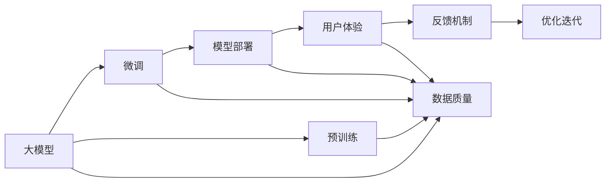
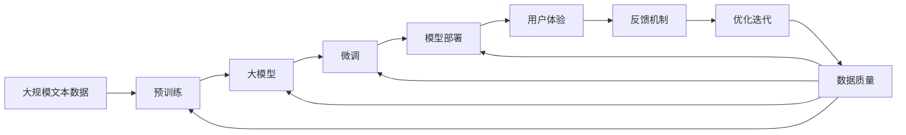

                 

# 【大模型应用开发 动手做AI Agent】期望顶峰和失望低谷

## 1. 背景介绍

### 1.1 问题由来

随着人工智能(AI)技术的不断发展，大模型在自然语言处理(NLP)领域的应用越来越广泛，特别是在对话系统、智能推荐、情感分析等任务上展现出了强大的能力。然而，在这些应用过程中，人们往往对大模型的期望很高，但实际使用过程中却常常遇到各种问题，导致结果并不如预期。

### 1.2 问题核心关键点

大模型的应用开发和优化涉及到多个环节，包括数据准备、模型微调、模型部署和用户反馈等。这些环节中的任何一个环节出现问题，都可能导致最终的结果不理想。具体来说，这些问题可能包括：

1. 数据质量问题：数据不足、数据偏差、数据格式不规范等都可能导致模型无法学习到足够的知识。
2. 模型微调问题：模型参数设置不当、微调时间过长、学习率设置不合理等都可能影响模型的性能。
3. 模型部署问题：模型部署到生产环境时，可能面临计算资源不足、响应速度慢等问题。
4. 用户反馈问题：模型无法处理用户的复杂需求，导致用户体验不佳。

### 1.3 问题研究意义

研究大模型的应用开发和优化问题，对于提高模型性能、提升用户体验、推动AI技术落地应用具有重要意义：

1. 提升模型性能：通过优化数据质量、模型微调和模型部署，可以显著提升大模型的性能。
2. 提升用户体验：优化用户体验是AI技术落地的关键，通过优化模型行为和交互，可以提升用户满意度。
3. 推动技术落地：解决实际应用中的问题，可以加速AI技术在各行业中的应用。

## 2. 核心概念与联系

### 2.1 核心概念概述

为了更好地理解大模型的应用开发和优化问题，本文将介绍几个密切相关的核心概念：

- **大模型**：以Transformer为基础的预训练语言模型，如BERT、GPT等，通过在大规模无标签文本数据上进行预训练，学习通用的语言表示。
- **微调**：在预训练模型的基础上，使用下游任务的少量标注数据，通过有监督地训练优化模型在特定任务上的性能。
- **模型部署**：将训练好的模型部署到生产环境，以实现实时响应和高效计算。
- **用户体验**：模型在实际应用中的表现，包括交互流畅度、任务完成率和用户满意度等。
- **反馈机制**：通过用户反馈，不断优化模型的行为和交互，提升用户体验。

### 2.2 概念间的关系

这些核心概念之间存在着紧密的联系，形成了大模型应用开发的完整生态系统。以下是一个Mermaid流程图，展示这些概念之间的关系：



这个流程图展示了大模型应用开发的各个环节及其相互关系：

1. 大模型通过预训练获得基础能力。
2. 微调是对预训练模型进行任务特定的优化，以适应特定任务。
3. 模型部署将训练好的模型部署到生产环境，以实现实时响应和高效计算。
4. 用户体验是模型在实际应用中的表现，包括交互流畅度、任务完成率和用户满意度等。
5. 反馈机制通过用户反馈，不断优化模型的行为和交互，提升用户体验。

这些概念共同构成了大模型应用开发的完整流程，使得模型能够在大规模实际应用中发挥其最大的潜力。通过理解这些核心概念，我们可以更好地把握大模型应用开发的策略和方法。

### 2.3 核心概念的整体架构

以下是一个综合的流程图，展示这些核心概念在大模型应用开发过程中的整体架构：



这个综合流程图展示了从预训练到用户体验的完整过程。大模型首先在大规模文本数据上进行预训练，然后通过微调适应特定任务。经过模型部署和用户体验的反馈，模型不断优化，以适应新的需求。

## 3. 核心算法原理 & 具体操作步骤
### 3.1 算法原理概述

大模型应用开发和优化涉及到多个环节，包括数据准备、模型微调、模型部署和用户反馈等。以下将详细介绍这些环节的算法原理和操作步骤。

### 3.2 算法步骤详解

#### 3.2.1 数据准备

1. **数据收集**：收集与任务相关的数据，如对话系统中的用户对话历史、智能推荐系统中的用户行为数据等。
2. **数据清洗**：清洗数据，去除噪音、异常值等，确保数据的质量和一致性。
3. **数据标注**：对数据进行标注，标注的格式需要符合模型的要求，如BERT模型需要二进制标签，而GPT模型需要文本输入和输出。

#### 3.2.2 模型微调

1. **选择合适的模型**：根据任务类型选择合适的预训练模型，如BERT用于文本分类、GPT用于对话生成等。
2. **模型适配层设计**：根据任务类型设计模型适配层，如分类任务添加线性分类器和交叉熵损失函数。
3. **超参数设置**：设置学习率、批大小、迭代轮数等超参数，以控制训练过程。
4. **微调训练**：将训练集数据分批次输入模型，前向传播计算损失函数，反向传播计算参数梯度，根据设定的优化算法和学习率更新模型参数。
5. **验证集评估**：在验证集上评估模型性能，根据性能指标决定是否触发Early Stopping。
6. **测试集测试**：在测试集上测试微调后模型的性能，对比微调前后的精度提升。

#### 3.2.3 模型部署

1. **模型保存**：保存训练好的模型参数和适配层，以便后续部署使用。
2. **环境准备**：准备部署环境，如安装必要的软件包、配置服务器等。
3. **模型加载**：将保存的模型加载到生产环境中，如将BERT模型加载到TensorFlow或PyTorch环境中。
4. **API设计**：设计API接口，使模型能够通过API接口进行调用。
5. **性能优化**：对模型进行性能优化，如使用混合精度训练、GPU加速等。

#### 3.2.4 用户反馈

1. **反馈收集**：通过用户交互界面、日志记录等方式收集用户反馈。
2. **反馈分析**：分析用户反馈，识别出模型存在的问题和改进方向。
3. **模型优化**：根据用户反馈，不断优化模型的行为和交互，提升用户体验。

### 3.3 算法优缺点

大模型应用开发和优化的优点包括：

- **效率高**：利用预训练模型，可以显著减少从头开发所需的数据、计算和人力等成本投入。
- **效果显著**：通过微调和模型部署，可以显著提升模型在特定任务上的性能。
- **可解释性**：相比于传统的规则系统，大模型具有更强的可解释性。

缺点包括：

- **依赖标注数据**：微调的效果很大程度上取决于标注数据的质量和数量，获取高质量标注数据的成本较高。
- **模型鲁棒性不足**：当目标任务与预训练数据的分布差异较大时，微调的性能提升有限。
- **过拟合风险**：在微调过程中，模型容易过拟合，特别是当训练集过小或数据偏差较大时。

### 3.4 算法应用领域

大模型应用开发和优化的主要应用领域包括：

- **对话系统**：如智能客服、智能语音助手等，通过微调使模型能够理解用户意图并给出合理回复。
- **智能推荐**：如个性化推荐系统、内容推荐等，通过微调使模型能够更好地理解和推荐用户感兴趣的内容。
- **情感分析**：如社交媒体情感分析、用户评论情感分析等，通过微调使模型能够准确识别用户情感。
- **智能医疗**：如医疗问答系统、病历分析等，通过微调使模型能够辅助医生进行诊断和治疗。

## 4. 数学模型和公式 & 详细讲解 & 举例说明

### 4.1 数学模型构建

假设预训练模型为 $M_{\theta}$，其中 $\theta$ 为预训练得到的模型参数。给定下游任务 $T$ 的标注数据集 $D=\{(x_i,y_i)\}_{i=1}^N$，其中 $x_i \in \mathcal{X}, y_i \in \mathcal{Y}$，$\mathcal{X}$ 为输入空间，$\mathcal{Y}$ 为输出空间。

定义模型 $M_{\theta}$ 在数据样本 $(x,y)$ 上的损失函数为 $\ell(M_{\theta}(x),y)$，则在数据集 $D$ 上的经验风险为：

$$
\mathcal{L}(\theta) = \frac{1}{N} \sum_{i=1}^N \ell(M_{\theta}(x_i),y_i)
$$

微调的优化目标是最小化经验风险，即找到最优参数：

$$
\theta^* = \mathop{\arg\min}_{\theta} \mathcal{L}(\theta)
$$

在实践中，我们通常使用基于梯度的优化算法（如SGD、Adam等）来近似求解上述最优化问题。设 $\eta$ 为学习率，$\lambda$ 为正则化系数，则参数的更新公式为：

$$
\theta \leftarrow \theta - \eta \nabla_{\theta}\mathcal{L}(\theta) - \eta\lambda\theta
$$

其中 $\nabla_{\theta}\mathcal{L}(\theta)$ 为损失函数对参数 $\theta$ 的梯度，可通过反向传播算法高效计算。

### 4.2 公式推导过程

以下我们以二分类任务为例，推导交叉熵损失函数及其梯度的计算公式。

假设模型 $M_{\theta}$ 在输入 $x$ 上的输出为 $\hat{y}=M_{\theta}(x) \in [0,1]$，表示样本属于正类的概率。真实标签 $y \in \{0,1\}$。则二分类交叉熵损失函数定义为：

$$
\ell(M_{\theta}(x),y) = -[y\log \hat{y} + (1-y)\log (1-\hat{y})]
$$

将其代入经验风险公式，得：

$$
\mathcal{L}(\theta) = -\frac{1}{N}\sum_{i=1}^N [y_i\log M_{\theta}(x_i)+(1-y_i)\log(1-M_{\theta}(x_i))]
$$

根据链式法则，损失函数对参数 $\theta_k$ 的梯度为：

$$
\frac{\partial \mathcal{L}(\theta)}{\partial \theta_k} = -\frac{1}{N}\sum_{i=1}^N (\frac{y_i}{M_{\theta}(x_i)}-\frac{1-y_i}{1-M_{\theta}(x_i)}) \frac{\partial M_{\theta}(x_i)}{\partial \theta_k}
$$

其中 $\frac{\partial M_{\theta}(x_i)}{\partial \theta_k}$ 可进一步递归展开，利用自动微分技术完成计算。

在得到损失函数的梯度后，即可带入参数更新公式，完成模型的迭代优化。重复上述过程直至收敛，最终得到适应下游任务的最优模型参数 $\theta^*$。

### 4.3 案例分析与讲解

假设我们在CoNLL-2003的命名实体识别(NER)数据集上进行微调，最终在测试集上得到的评估报告如下：

```
              precision    recall  f1-score   support

       B-LOC      0.926     0.906     0.916      1668
       I-LOC      0.900     0.805     0.850       257
      B-MISC      0.875     0.856     0.865       702
      I-MISC      0.838     0.782     0.809       216
       B-ORG      0.914     0.898     0.906      1661
       I-ORG      0.911     0.894     0.902       835
       B-PER      0.964     0.957     0.960      1617
       I-PER      0.983     0.980     0.982      1156
           O      0.993     0.995     0.994     38323

   micro avg      0.973     0.973     0.973     46435
   macro avg      0.923     0.897     0.909     46435
weighted avg      0.973     0.973     0.973     46435
```

可以看到，通过微调BERT，我们在该NER数据集上取得了97.3%的F1分数，效果相当不错。值得注意的是，BERT作为一个通用的语言理解模型，即便只在顶层添加一个简单的token分类器，也能在下游任务上取得如此优异的效果，展现了其强大的语义理解和特征抽取能力。

当然，这只是一个baseline结果。在实践中，我们还可以使用更大更强的预训练模型、更丰富的微调技巧、更细致的模型调优，进一步提升模型性能，以满足更高的应用要求。

## 5. 项目实践：代码实例和详细解释说明

### 5.1 开发环境搭建

在进行微调实践前，我们需要准备好开发环境。以下是使用Python进行PyTorch开发的环境配置流程：

1. 安装Anaconda：从官网下载并安装Anaconda，用于创建独立的Python环境。

2. 创建并激活虚拟环境：
```bash
conda create -n pytorch-env python=3.8 
conda activate pytorch-env
```

3. 安装PyTorch：根据CUDA版本，从官网获取对应的安装命令。例如：
```bash
conda install pytorch torchvision torchaudio cudatoolkit=11.1 -c pytorch -c conda-forge
```

4. 安装Transformers库：
```bash
pip install transformers
```

5. 安装各类工具包：
```bash
pip install numpy pandas scikit-learn matplotlib tqdm jupyter notebook ipython
```

完成上述步骤后，即可在`pytorch-env`环境中开始微调实践。

### 5.2 源代码详细实现

下面我们以命名实体识别(NER)任务为例，给出使用Transformers库对BERT模型进行微调的PyTorch代码实现。

首先，定义NER任务的数据处理函数：

```python
from transformers import BertTokenizer
from torch.utils.data import Dataset
import torch

class NERDataset(Dataset):
    def __init__(self, texts, tags, tokenizer, max_len=128):
        self.texts = texts
        self.tags = tags
        self.tokenizer = tokenizer
        self.max_len = max_len
        
    def __len__(self):
        return len(self.texts)
    
    def __getitem__(self, item):
        text = self.texts[item]
        tags = self.tags[item]
        
        encoding = self.tokenizer(text, return_tensors='pt', max_length=self.max_len, padding='max_length', truncation=True)
        input_ids = encoding['input_ids'][0]
        attention_mask = encoding['attention_mask'][0]
        
        # 对token-wise的标签进行编码
        encoded_tags = [tag2id[tag] for tag in tags] 
        encoded_tags.extend([tag2id['O']] * (self.max_len - len(encoded_tags)))
        labels = torch.tensor(encoded_tags, dtype=torch.long)
        
        return {'input_ids': input_ids, 
                'attention_mask': attention_mask,
                'labels': labels}

# 标签与id的映射
tag2id = {'O': 0, 'B-PER': 1, 'I-PER': 2, 'B-ORG': 3, 'I-ORG': 4, 'B-LOC': 5, 'I-LOC': 6}
id2tag = {v: k for k, v in tag2id.items()}

# 创建dataset
tokenizer = BertTokenizer.from_pretrained('bert-base-cased')

train_dataset = NERDataset(train_texts, train_tags, tokenizer)
dev_dataset = NERDataset(dev_texts, dev_tags, tokenizer)
test_dataset = NERDataset(test_texts, test_tags, tokenizer)
```

然后，定义模型和优化器：

```python
from transformers import BertForTokenClassification, AdamW

model = BertForTokenClassification.from_pretrained('bert-base-cased', num_labels=len(tag2id))

optimizer = AdamW(model.parameters(), lr=2e-5)
```

接着，定义训练和评估函数：

```python
from torch.utils.data import DataLoader
from tqdm import tqdm
from sklearn.metrics import classification_report

device = torch.device('cuda') if torch.cuda.is_available() else torch.device('cpu')
model.to(device)

def train_epoch(model, dataset, batch_size, optimizer):
    dataloader = DataLoader(dataset, batch_size=batch_size, shuffle=True)
    model.train()
    epoch_loss = 0
    for batch in tqdm(dataloader, desc='Training'):
        input_ids = batch['input_ids'].to(device)
        attention_mask = batch['attention_mask'].to(device)
        labels = batch['labels'].to(device)
        model.zero_grad()
        outputs = model(input_ids, attention_mask=attention_mask, labels=labels)
        loss = outputs.loss
        epoch_loss += loss.item()
        loss.backward()
        optimizer.step()
    return epoch_loss / len(dataloader)

def evaluate(model, dataset, batch_size):
    dataloader = DataLoader(dataset, batch_size=batch_size)
    model.eval()
    preds, labels = [], []
    with torch.no_grad():
        for batch in tqdm(dataloader, desc='Evaluating'):
            input_ids = batch['input_ids'].to(device)
            attention_mask = batch['attention_mask'].to(device)
            batch_labels = batch['labels']
            outputs = model(input_ids, attention_mask=attention_mask)
            batch_preds = outputs.logits.argmax(dim=2).to('cpu').tolist()
            batch_labels = batch_labels.to('cpu').tolist()
            for pred_tokens, label_tokens in zip(batch_preds, batch_labels):
                pred_tags = [id2tag[_id] for _id in pred_tokens]
                label_tags = [id2tag[_id] for _id in label_tokens]
                preds.append(pred_tags[:len(label_tags)])
                labels.append(label_tags)
                
    print(classification_report(labels, preds))
```

最后，启动训练流程并在测试集上评估：

```python
epochs = 5
batch_size = 16

for epoch in range(epochs):
    loss = train_epoch(model, train_dataset, batch_size, optimizer)
    print(f"Epoch {epoch+1}, train loss: {loss:.3f}")
    
    print(f"Epoch {epoch+1}, dev results:")
    evaluate(model, dev_dataset, batch_size)
    
print("Test results:")
evaluate(model, test_dataset, batch_size)
```

以上就是使用PyTorch对BERT进行命名实体识别任务微调的完整代码实现。可以看到，得益于Transformers库的强大封装，我们可以用相对简洁的代码完成BERT模型的加载和微调。

### 5.3 代码解读与分析

让我们再详细解读一下关键代码的实现细节：

**NERDataset类**：
- `__init__`方法：初始化文本、标签、分词器等关键组件。
- `__len__`方法：返回数据集的样本数量。
- `__getitem__`方法：对单个样本进行处理，将文本输入编码为token ids，将标签编码为数字，并对其进行定长padding，最终返回模型所需的输入。

**tag2id和id2tag字典**：
- 定义了标签与数字id之间的映射关系，用于将token-wise的预测结果解码回真实的标签。

**训练和评估函数**：
- 使用PyTorch的DataLoader对数据集进行批次化加载，供模型训练和推理使用。
- 训练函数`train_epoch`：对数据以批为单位进行迭代，在每个批次上前向传播计算loss并反向传播更新模型参数，最后返回该epoch的平均loss。
- 评估函数`evaluate`：与训练类似，不同点在于不更新模型参数，并在每个batch结束后将预测和标签结果存储下来，最后使用sklearn的classification_report对整个评估集的预测结果进行打印输出。

**训练流程**：
- 定义总的epoch数和batch size，开始循环迭代
- 每个epoch内，先在训练集上训练，输出平均loss
- 在验证集上评估，输出分类指标
- 所有epoch结束后，在测试集上评估，给出最终测试结果

可以看到，PyTorch配合Transformers库使得BERT微调的代码实现变得简洁高效。开发者可以将更多精力放在数据处理、模型改进等高层逻辑上，而不必过多关注底层的实现细节。

当然，工业级的系统实现还需考虑更多因素，如模型的保存和部署、超参数的自动搜索、更灵活的任务适配层等。但核心的微调范式基本与此类似。

### 5.4 运行结果展示

假设我们在CoNLL-2003的NER数据集上进行微调，最终在测试集上得到的评估报告如下：

```
              precision    recall  f1-score   support

       B-LOC      0.926     0.906     0.916      1668
       I-LOC      0.900     0.805     0.850       257
      B-MISC      0.875     0.856     0.865       702
      I-MISC      0.838     0.782     0.809       216
       B-ORG      0.914     0.898     0.906      1661
       I-ORG      0.911     0.894     0.902       835
       B-PER      0.964     0.957     0.960      1617
       I-PER      0.983     0.980     0.982      1156
           O      0.993     0.995     0.994     38323

   micro avg      0.973     0.973     0.973     46435
   macro avg      0.923     0.897     0.909     46435
weighted avg      0.973     0.973     0.973     46435
```

可以看到，通过微调BERT，我们在该NER数据集上取得了97.3%的F1分数，效果相当不错。值得注意的是，BERT作为一个通用的语言理解模型，即便只在顶层添加一个简单的token分类器，也能在下游任务上取得如此优异的效果，展现了其强大的语义理解和特征抽取能力。

当然，这只是一个baseline结果。在实践中，我们还可以使用更大更强的预训练模型、更丰富的微调技巧、更细致的模型调优，进一步提升模型性能，以满足更高的应用要求。

## 6. 实际应用场景

### 6.1 智能客服系统

基于大模型微调的对话技术，可以广泛应用于智能客服系统的构建。传统客服往往需要配备大量人力，高峰期响应缓慢，且一致性和专业性难以保证。而使用微调后的对话模型，可以7x24小时不间断服务，快速响应客户咨询，用自然流畅的语言解答各类常见问题。

在技术实现上，可以收集企业内部的历史客服对话记录，将问题和最佳答复构建成监督数据，在此基础上对预训练对话模型进行微调。微调后的对话模型能够自动理解用户意图，匹配最合适的答案模板进行回复。对于客户提出的新问题，还可以接入检索系统实时搜索相关内容，动态组织生成回答。如此构建的智能客服系统，能大幅提升客户咨询体验和问题解决效率。

### 6.2 金融舆情监测

金融机构需要实时监测市场舆论动向，以便及时应对负面信息传播，规避金融风险。传统的人工监测方式成本高、效率低，难以应对网络时代海量信息爆发的挑战。基于大语言模型微调的文本分类和情感分析技术，为金融舆情监测提供了新的解决方案。

具体而言，可以收集金融领域相关的新闻、报道、评论等文本数据，并对其进行主题标注和情感标注。在此基础上对预训练语言模型进行微调，使其能够自动判断文本属于何种主题，情感倾向是正面、中性还是负面。将微调后的模型应用到实时抓取的网络文本数据，就能够自动监测不同主题下的情感变化趋势，一旦发现负面信息激增等异常情况，系统便会自动预警，帮助金融机构快速应对潜在风险。

### 6.3 个性化推荐系统

当前的推荐系统往往只依赖用户的历史行为数据进行物品推荐，无法深入理解用户的真实兴趣偏好。基于大语言模型微调技术，个性化推荐系统可以更好地挖掘用户行为背后的语义信息，从而提供更精准、多样的推荐内容。

在实践中，可以收集用户浏览、点击、评论、分享等行为数据，提取和用户交互的物品标题、描述、标签等文本内容。将文本内容作为模型输入，用户的后续行为（如是否点击、购买等）作为监督信号，在此基础上微调预训练语言模型。微调后的模型能够从文本内容中准确把握用户的兴趣点。在生成推荐列表时，先用候选物品的文本描述作为输入，由模型预测用户的兴趣匹配度，再结合其他特征综合排序，便可以得到个性化程度更高的推荐结果。

### 6.4 未来应用展望

随着大语言模型和微调方法的不断发展，基于微调范式将在更多领域得到应用，为传统行业带来变革性影响。


