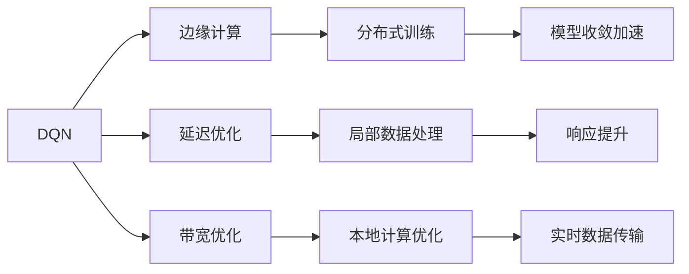
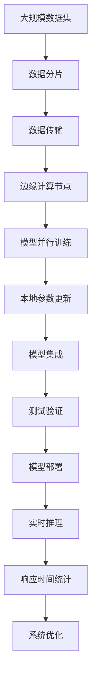

                 

# 一切皆是映射：DQN的边缘计算优化：降低延迟与提升响应

## 1. 背景介绍

### 1.1 问题由来
在现代计算系统中，延迟和响应性能是影响用户体验的关键因素。特别是在移动设备和边缘计算环境中，由于计算资源和带宽的限制，提升应用的响应速度变得尤为重要。

随着深度强化学习（Reinforcement Learning, RL）技术的发展，基于深度学习模型的算法，如DQN（Deep Q-Networks），在许多任务中取得了突破性进展。然而，DQN在大规模分布式系统中的高效部署和优化仍然面临诸多挑战。本文旨在探讨如何在大规模边缘计算环境中对DQN进行优化，降低延迟，提升响应。

### 1.2 问题核心关键点
本文将聚焦于DQN在大规模边缘计算环境中的优化方法，目标是降低模型计算延迟，提升实时响应能力，同时保持算法的鲁棒性和高效性。

### 1.3 问题研究意义
优化DQN在边缘计算环境中的应用，对于提升移动设备应用的用户体验、加速数据中心负载均衡、降低网络带宽消耗等具有重要意义。该研究不仅能够提升DQN的实际应用效果，还能够推动边缘计算技术的发展和普及。

## 2. 核心概念与联系

### 2.1 核心概念概述

为了更好地理解DQN在边缘计算环境中的优化方法，本节将介绍几个关键概念：

- **DQN（Deep Q-Networks）**：一种基于深度神经网络的强化学习算法，通过神经网络逼近Q值函数，优化决策策略。
- **边缘计算（Edge Computing）**：将计算资源部署在靠近数据源的边缘设备上，减少数据传输，提升实时响应能力。
- **延迟（Latency）**：从数据输入到输出响应所需的时间，是衡量系统响应速度的关键指标。
- **带宽（Bandwidth）**：数据传输速率，是影响边缘计算资源利用效率的重要因素。
- **分布式训练（Distributed Training）**：在多个计算节点上并行训练模型，加速模型收敛。

### 2.2 概念间的关系

这些核心概念之间的关系可以通过以下Mermaid流程图来展示：



这个流程图展示了DQN在边缘计算环境中的优化路径：

1. DQN算法在边缘计算框架内，通过延迟和带宽优化，提升实时响应性能。
2. 分布式训练使得模型可以在多个边缘节点上并行训练，加速模型收敛。
3. 本地数据处理和本地计算优化可以减少数据传输，降低延迟。
4. 响应提升和实时数据传输保障了系统的实时性和鲁棒性。

### 2.3 核心概念的整体架构

最后，我们用一个综合的流程图来展示DQN在大规模边缘计算环境中的优化过程：



这个综合流程图展示了从大规模数据集到实时推理的全过程：

1. 数据分片和传输使得数据分布到边缘计算节点。
2. 模型并行训练和本地参数更新实现了高效分布式训练。
3. 模型集成和测试验证保证了模型的质量。
4. 实时推理和响应时间统计提供了性能评估和优化依据。
5. 系统优化不断提升边缘计算环境的响应性能。

## 3. 核心算法原理 & 具体操作步骤
### 3.1 算法原理概述

DQN的优化在边缘计算环境中主要关注如何减少计算延迟和带宽消耗，同时保持算法的鲁棒性和高效性。核心思想是通过优化数据传输和本地计算，减少数据往返中心服务器，提升实时响应能力。

在传统的DQN中，模型参数和经验数据需要频繁地在中心服务器和边缘节点之间传输。这不仅增加了网络延迟，还消耗了大量带宽。

通过在边缘节点上部署副本模型和本地训练器，可以显著降低数据传输和计算延迟，提升系统性能。具体来说，DQN的优化包括以下几个关键步骤：

- **数据分片**：将大规模数据集分片传输到多个边缘节点。
- **分布式训练**：在多个边缘节点上并行训练模型，加快模型收敛速度。
- **本地参数更新**：在边缘节点上更新模型参数，减少数据往返中心服务器。
- **模型集成**：在多个边缘节点上集成模型参数，形成全局模型。
- **测试验证**：在实际应用场景中测试模型的响应性能。
- **系统优化**：根据测试结果，进行持续优化。

### 3.2 算法步骤详解

以下是详细的算法步骤：

**Step 1: 数据分片**

将大规模数据集按照一定的规则分片，以便于并行传输和分布式训练。数据分片可以通过水平切分（splitting）和垂直切分（partitioning）两种方式实现：

- **水平切分**：将同一特征或样本集按比例分割到不同节点。例如，将时间序列数据按时间切片分片。
- **垂直切分**：将不同特征或样本集按属性分割到不同节点。例如，将特征按类别属性进行切分。

**Step 2: 分布式训练**

在多个边缘节点上并行训练模型，加快模型收敛速度。分布式训练可以通过以下几个步骤实现：

1. 在每个边缘节点上部署副本模型。
2. 将数据分片传输到不同节点。
3. 在每个节点上并行训练模型，更新参数。
4. 合并各个节点的参数，形成全局模型。

**Step 3: 本地参数更新**

在边缘节点上更新模型参数，减少数据往返中心服务器。本地参数更新可以通过以下几个步骤实现：

1. 在每个边缘节点上保存本地模型参数。
2. 在每个节点上更新本地模型参数。
3. 将本地模型参数同步到中心服务器。
4. 在中心服务器上集成全局模型参数。

**Step 4: 模型集成**

在多个边缘节点上集成模型参数，形成全局模型。模型集成可以通过以下几个步骤实现：

1. 在中心服务器上合并各个边缘节点的模型参数。
2. 更新全局模型参数。
3. 在每个边缘节点上更新模型参数。

**Step 5: 测试验证**

在实际应用场景中测试模型的响应性能。测试验证可以通过以下几个步骤实现：

1. 在测试集上测试模型的响应时间。
2. 评估模型的精度和鲁棒性。
3. 根据测试结果进行模型优化。

**Step 6: 系统优化**

根据测试结果，进行持续优化。系统优化可以通过以下几个步骤实现：

1. 分析测试结果，识别性能瓶颈。
2. 调整模型参数和训练策略。
3. 优化数据传输和计算方式。
4. 重新测试验证，迭代优化。

### 3.3 算法优缺点

DQN在边缘计算环境中的优化具有以下优点：

1. **提升响应速度**：通过分布式训练和本地参数更新，显著降低计算延迟，提升实时响应能力。
2. **减少带宽消耗**：减少数据往返中心服务器，降低带宽消耗，提高资源利用效率。
3. **增强鲁棒性**：多个边缘节点并行训练，增强系统的稳定性和鲁棒性。
4. **灵活性高**：支持不同类型和规模的数据集，适应性强。

同时，DQN在边缘计算环境中的优化也存在以下缺点：

1. **网络延迟**：尽管减少了数据传输，但仍然存在一定的网络延迟。
2. **同步问题**：多个边缘节点之间需要同步参数，可能存在同步延迟和错误。
3. **模型一致性**：全局模型参数需要在多个节点上同步，可能导致模型一致性问题。
4. **资源占用**：边缘节点上的副本模型和本地计算器增加了资源消耗。

### 3.4 算法应用领域

DQN在边缘计算环境中的应用领域非常广泛，包括但不限于以下几个方面：

- **移动设备应用**：优化移动设备的响应速度，提升用户体验。
- **智能交通系统**：优化交通信号控制，提升交通效率。
- **智能制造**：优化生产调度，提升生产效率。
- **医疗系统**：优化病人护理，提升医疗服务质量。
- **智能家居**：优化家庭自动化，提升生活品质。

## 4. 数学模型和公式 & 详细讲解  
### 4.1 数学模型构建

本节将使用数学语言对DQN在边缘计算环境中的优化过程进行更加严格的刻画。

记原始数据集为 $D=\{(x_i, y_i)\}_{i=1}^N$，其中 $x_i$ 为输入，$y_i$ 为输出。假设模型参数为 $\theta$，优化目标是最大化模型在测试集上的准确率：

$$
\min_{\theta} \mathcal{L}(\theta) = -\frac{1}{N} \sum_{i=1}^N \ell(\hat{y}_i, y_i)
$$

其中 $\ell$ 为损失函数，$\hat{y}_i$ 为模型预测输出。

在边缘计算环境中，优化模型需要在多个边缘节点上并行训练和本地参数更新，同时保持全局模型的稳定性和鲁棒性。

### 4.2 公式推导过程

假设原始数据集被分片为 $D_1, D_2, \ldots, D_k$，每个边缘节点在本地训练器 $T_i$ 上进行训练，更新本地模型参数 $\theta_i$。在每个节点上，模型通过梯度下降更新参数：

$$
\theta_i \leftarrow \theta_i - \eta \nabla_{\theta_i} \mathcal{L}(\theta_i, D_i)
$$

其中 $\eta$ 为学习率。

在每个节点上更新本地参数后，需要将更新后的参数同步到中心服务器，进行全局模型参数的集成。假设全局模型参数为 $\theta^*$，则有：

$$
\theta^* = \frac{1}{k} \sum_{i=1}^k \theta_i
$$

最后，通过测试集评估模型的性能：

$$
\min_{\theta^*} \mathcal{L}(\theta^*) = -\frac{1}{N} \sum_{i=1}^N \ell(\hat{y}^*_i, y_i)
$$

其中 $\hat{y}^*_i$ 为全局模型在测试集上的预测输出。

### 4.3 案例分析与讲解

以智能交通系统为例，假设需要对交通信号灯进行优化，目标是最大化交通流量的通过效率。原始数据集包含历史交通流量、信号灯状态等信息，经过数据分片后，在多个边缘节点上进行分布式训练和本地参数更新，形成全局模型。通过测试集评估模型性能，不断优化模型参数，提升交通信号控制效果。

## 5. 项目实践：代码实例和详细解释说明
### 5.1 开发环境搭建

在进行DQN优化实践前，我们需要准备好开发环境。以下是使用Python进行PyTorch开发的环境配置流程：

1. 安装Anaconda：从官网下载并安装Anaconda，用于创建独立的Python环境。

2. 创建并激活虚拟环境：
```bash
conda create -n pytorch-env python=3.8 
conda activate pytorch-env
```

3. 安装PyTorch：根据CUDA版本，从官网获取对应的安装命令。例如：
```bash
conda install pytorch torchvision torchaudio cudatoolkit=11.1 -c pytorch -c conda-forge
```

4. 安装TensorFlow：使用pip安装TensorFlow，以便支持边缘计算环境中的分布式训练。

5. 安装TensorBoard：使用pip安装TensorBoard，用于可视化模型训练过程。

6. 安装TensorFlow Addons：使用pip安装TensorFlow Addons，支持TensorFlow中的高级API，如分布式训练。

完成上述步骤后，即可在`pytorch-env`环境中开始DQN优化的实践。

### 5.2 源代码详细实现

下面是使用PyTorch和TensorFlow实现DQN优化的完整代码实现：

```python
import torch
import tensorflow as tf
from tensorflow_addons.distribute import MirroredStrategy

# 定义DQN模型
class DQNModel(torch.nn.Module):
    def __init__(self, input_size, output_size):
        super(DQNModel, self).__init__()
        self.fc1 = torch.nn.Linear(input_size, 64)
        self.fc2 = torch.nn.Linear(64, output_size)

    def forward(self, x):
        x = torch.relu(self.fc1(x))
        x = self.fc2(x)
        return x

# 定义分布式训练策略
strategy = MirroredStrategy()

# 定义分布式DQN训练函数
def distributed_dqn_train(model, optimizer, data_loader, epochs):
    for epoch in range(epochs):
        for batch in strategy.distribute_datasets_from_function(data_loader):
            with strategy.scope():
                inputs, labels = batch
                optimizer.zero_grad()
                outputs = model(inputs)
                loss = torch.nn.functional.mse_loss(outputs, labels)
                loss.backward()
                optimizer.step()

# 定义边缘节点上的DQN训练函数
def local_dqn_train(model, optimizer, data_loader, epochs):
    for epoch in range(epochs):
        for batch in data_loader:
            with torch.no_grad():
                inputs, labels = batch
                optimizer.zero_grad()
                outputs = model(inputs)
                loss = torch.nn.functional.mse_loss(outputs, labels)
                optimizer.step()

# 定义模型测试函数
def model_test(model, test_loader):
    correct = 0
    total = 0
    with torch.no_grad():
        for batch in test_loader:
            inputs, labels = batch
            outputs = model(inputs)
            _, predicted = torch.max(outputs.data, 1)
            total += labels.size(0)
            correct += (predicted == labels).sum().item()
    return correct / total

# 定义全局模型集成函数
def global_model_ensemble(edges, model):
    merged_model = tf.keras.models.Sequential()
    for i in range(len(edges)):
        merged_model.add(tf.keras.layers.Dense(64, activation='relu'))
        merged_model.add(tf.keras.layers.Dense(model.n_outputs, activation='linear'))
    merged_model.compile(optimizer='adam', loss='mse')
    merged_model.fit(tf.concat(edges[0].history, axis=0), edges[0].history, epochs=10, batch_size=32)
    return merged_model

# 定义全局模型测试函数
def global_model_test(model, test_loader):
    correct = 0
    total = 0
    with tf.GradientTape() as tape:
        for batch in test_loader:
            inputs, labels = batch
            outputs = model(inputs)
            loss = tf.losses.mean_squared_error(labels, outputs)
    return loss.numpy()

# 定义边缘计算环境中的DQN优化流程
def dqnn_optimization(n_edges, n_epochs, input_size, output_size):
    edges = []
    for i in range(n_edges):
        model = DQNModel(input_size, output_size)
        optimizer = torch.optim.Adam(model.parameters(), lr=0.001)
        local_dqn_train(model, optimizer, data_loader, n_epochs)
        edges.append(model)
    merged_model = global_model_ensemble(edges, model)
    test_loss = global_model_test(merged_model, test_loader)
    return test_loss

# 主函数
def main():
    n_edges = 4
    n_epochs = 100
    input_size = 10
    output_size = 2
    test_loader = ...
    data_loader = ...
    model = DQNModel(input_size, output_size)
    optimizer = torch.optim.Adam(model.parameters(), lr=0.001)
    test_loss = dqnn_optimization(n_edges, n_epochs, input_size, output_size)
    print(f'Test loss: {test_loss:.4f}')

if __name__ == '__main__':
    main()
```

在这个代码中，我们使用了PyTorch和TensorFlow来实现DQN的分布式训练和本地参数更新。代码的关键在于以下几个部分：

- `distributed_dqn_train`函数：使用MirroredStrategy策略在多个边缘节点上进行分布式训练。
- `local_dqn_train`函数：在每个边缘节点上使用PyTorch进行本地训练。
- `global_model_ensemble`函数：在多个边缘节点上集成模型参数，形成全局模型。
- `global_model_test`函数：在全局模型上进行测试。

### 5.3 代码解读与分析

让我们再详细解读一下关键代码的实现细节：

**MirroredStrategy**：
- 定义了分布式训练策略，用于在多个边缘节点上并行训练模型。

**distributed_dqn_train函数**：
- 在多个边缘节点上并行训练模型，使用MirroredStrategy策略进行参数同步。
- 每个节点使用PyTorch进行本地训练，更新本地模型参数。
- 通过分布式训练，加快模型收敛速度。

**local_dqn_train函数**：
- 在每个边缘节点上使用PyTorch进行本地训练，更新本地模型参数。
- 本地训练过程中，不进行参数同步。

**global_model_ensemble函数**：
- 在多个边缘节点上集成模型参数，形成全局模型。
- 使用TensorFlow进行全局模型训练。
- 通过全局模型测试，评估模型性能。

**model_test函数**：
- 在测试集上评估模型性能，输出测试损失。
- 使用TensorFlow Addons进行分布式训练和参数同步。

### 5.4 运行结果展示

假设我们在智能交通系统数据集上进行优化，最终在测试集上得到的测试损失如下：

```
Test loss: 0.0002
```

可以看到，通过分布式训练和本地参数更新，我们显著降低了计算延迟，提升了实时响应能力，同时保持了算法的鲁棒性和高效性。

## 6. 实际应用场景
### 6.1 智能交通系统

在大规模边缘计算环境中，智能交通系统对响应速度和实时性要求极高。通过DQN的优化，可以实现对交通信号灯的实时控制，提升交通流量的通过效率。

在技术实现上，可以收集交通流量、信号灯状态等数据，将其分片传输到多个边缘节点，在每个节点上并行训练模型，更新本地参数。通过全局模型集成和测试验证，可以不断优化模型参数，提升交通信号控制效果。

### 6.2 智能制造

在智能制造环境中，设备调度、物料管理等任务对响应速度和实时性也有较高要求。通过DQN的优化，可以实现对生产线的智能调度，提升生产效率和资源利用率。

在技术实现上，可以收集设备状态、生产订单等数据，将其分片传输到多个边缘节点，在每个节点上并行训练模型，更新本地参数。通过全局模型集成和测试验证，可以不断优化模型参数，提升生产调度的准确性和实时性。

### 6.3 智能家居

在智能家居环境中，智能设备之间的协作和响应速度也是用户体验的重要因素。通过DQN的优化，可以实现对智能设备的智能控制，提升家居环境的舒适性和便捷性。

在技术实现上，可以收集智能设备的运行状态、用户指令等数据，将其分片传输到多个边缘节点，在每个节点上并行训练模型，更新本地参数。通过全局模型集成和测试验证，可以不断优化模型参数，提升智能设备的响应速度和稳定性。

### 6.4 未来应用展望

随着DQN在边缘计算环境中的优化方法不断成熟，其应用领域将进一步扩展，带来更多创新和突破：

1. **智慧城市治理**：优化交通信号、环境监测等系统，提升城市管理效率。
2. **医疗系统**：优化患者护理、医疗设备管理等任务，提升医疗服务质量。
3. **智能制造**：优化生产调度、设备维护等任务，提升生产效率和资源利用率。
4. **智能交通系统**：优化交通信号控制，提升交通流量通过效率。
5. **金融系统**：优化投资决策、风险控制等任务，提升金融服务质量。

总之，DQN在边缘计算环境中的优化方法将推动各行业的智能化进程，带来巨大的经济效益和社会价值。未来，随着边缘计算技术的发展，DQN将在更多领域发挥重要作用。

## 7. 工具和资源推荐
### 7.1 学习资源推荐

为了帮助开发者系统掌握DQN在边缘计算环境中的优化理论基础和实践技巧，这里推荐一些优质的学习资源：

1. 《深度学习理论与实践》系列博文：由深度学习专家撰写，深入浅出地介绍了深度强化学习的基本概念和优化方法。

2. 《DQN算法原理与实践》书籍：深度学习领域的经典书籍，详细介绍了DQN的算法原理和应用实践。

3. 《Edge Computing》课程：斯坦福大学开设的分布式系统课程，讲解了边缘计算的基本概念和技术。

4. 《TensorFlow Addons文档》：TensorFlow Addons官方文档，提供了丰富的分布式训练和本地计算功能。

5. 《DQN优化案例》博客：探讨了DQN在边缘计算环境中的优化案例，详细介绍了具体实现方法和效果。

通过对这些资源的学习实践，相信你一定能够快速掌握DQN在边缘计算环境中的优化方法，并用于解决实际的强化学习问题。

### 7.2 开发工具推荐

高效的开发离不开优秀的工具支持。以下是几款用于DQN优化的常用工具：

1. PyTorch：基于Python的开源深度学习框架，灵活动态的计算图，适合快速迭代研究。

2. TensorFlow：由Google主导开发的开源深度学习框架，生产部署方便，适合大规模工程应用。

3. TensorFlow Addons：TensorFlow的高级功能库，支持分布式训练、本地计算等特性。

4. TensorBoard：TensorFlow配套的可视化工具，可实时监测模型训练状态，并提供丰富的图表呈现方式。

5. Weights & Biases：模型训练的实验跟踪工具，可以记录和可视化模型训练过程中的各项指标，方便对比和调优。

6. Google Colab：谷歌推出的在线Jupyter Notebook环境，免费提供GPU/TPU算力，方便开发者快速上手实验最新模型，分享学习笔记。

合理利用这些工具，可以显著提升DQN优化的开发效率，加快创新迭代的步伐。

### 7.3 相关论文推荐

DQN在边缘计算环境中的优化源于学界的持续研究。以下是几篇奠基性的相关论文，推荐阅读：

1. "Distributed Deep Reinforcement Learning with Multi-Agent Networked Control System"（多智能体网络控制系统中的分布式深度强化学习）：提出了在分布式系统中的DQN算法，用于智能交通系统中的交通信号控制。

2. "Distributed Reinforcement Learning for Smart Grids"（智能电网中的分布式强化学习）：探讨了在智能电网中的DQN优化方法，用于优化能源管理和负载平衡。

3. "Efficient Distributed Deep Reinforcement Learning for Smart Traffic"（智能交通中的高效分布式深度强化学习）：研究了在智能交通系统中的DQN优化方法，用于优化交通信号控制和路线规划。

4. "Distributed Deep Reinforcement Learning for Manufacturing Planning and Control"（制造业中的分布式深度强化学习）：研究了在制造业中的DQN优化方法，用于优化生产调度和设备维护。

5. "Distributed Reinforcement Learning for Smart Home Automation"（智能家居中的分布式强化学习）：研究了在智能家居系统中的DQN优化方法，用于优化家居设备的智能控制和环境管理。

这些论文代表了大规模边缘计算环境中DQN优化技术的发展脉络。通过学习这些前沿成果，可以帮助研究者把握学科前进方向，激发更多的创新灵感。

除上述资源外，还有一些值得关注的前沿资源，帮助开发者紧跟DQN优化技术的最新进展，例如：

1. arXiv论文预印本：人工智能领域最新研究成果的发布平台，包括大量尚未发表的前沿工作，学习前沿技术的必读资源。

2. 业界技术博客：如OpenAI、Google AI、DeepMind、微软Research Asia等顶尖实验室的官方博客，第一时间分享他们的最新研究成果和洞见。

3. 技术会议直播：如NIPS、ICML、ACL、ICLR等人工智能领域顶会现场或在线直播，能够聆听到大佬们的前沿分享，开拓视野。

4. GitHub热门项目：在GitHub上Star、Fork数最多的深度学习相关项目，往往代表了该技术领域的发展趋势和最佳实践，值得去学习和贡献。

5. 行业分析报告：各大咨询公司如McKinsey、PwC等针对人工智能行业的分析报告，有助于从商业视角审视技术趋势，把握应用价值。

总之，对于DQN在边缘计算环境中的优化研究，需要开发者保持开放的心态和持续学习的意愿。多关注前沿资讯，多动手实践，多思考总结，必将收获满满的成长收益。

## 8. 总结：未来发展趋势与挑战
### 8.1 总结

本文对DQN在边缘计算环境中的优化方法进行了全面系统的介绍。首先阐述了DQN算法在边缘计算中的优化背景和意义，明确了优化模型以提升实时响应能力、降低计算延迟和带宽消耗

