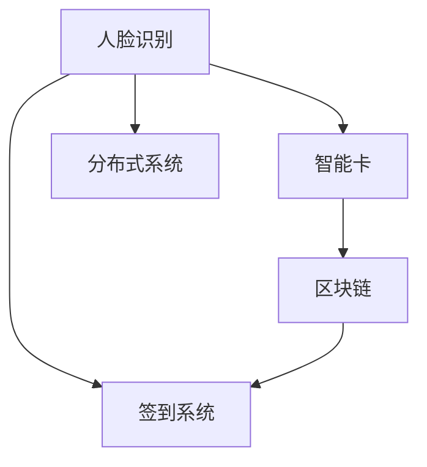

                 

# 基于人脸识别的签到系的设计与实现

> 关键词：人脸识别, 签到系统, 生物识别, 智能卡, 区块链, 分布式系统

## 1. 背景介绍

在当今信息化社会中，企业、学校等机构对人员出入的管理需求日益增加。传统的签到方式，如纸质签到、手工签到等，不仅效率低下，容易出错，还存在信息篡改的风险。为解决这些问题，基于人脸识别技术的签到系统应运而生。

人脸识别技术，作为生物识别的一种，通过计算机视觉技术和机器学习算法，实现对人脸的自动识别和验证。结合现代通信和区块链技术，可以构建一个高效、安全、可靠的智能签到系统。该系统利用人脸识别技术，实时验证人员身份，并通过区块链技术确保签到信息的不可篡改和安全性。

本文将详细介绍基于人脸识别的签到系统，从系统架构、技术实现到应用场景进行深入分析，希望能为企业、学校等机构提供参考，推动智能化、便利化的签到管理方式的普及。

## 2. 核心概念与联系

### 2.1 核心概念概述

为更好地理解基于人脸识别的签到系统，本节将介绍几个密切相关的核心概念：

- **人脸识别**：利用计算机视觉和机器学习算法，自动识别和验证人脸的技术。
- **签到系统**：用于记录和管理人员出入的管理系统，传统方式包括纸质签到、手工签到等，新兴方式则借助人脸识别等生物识别技术。
- **智能卡**：内置微芯片的卡片，用于身份验证和权限管理。
- **区块链**：一种去中心化的分布式账本技术，具备不可篡改、高安全性的特点，常用于数据安全存储和传输。
- **分布式系统**：由多个计算机节点构成的系统，用于提供高性能、高可扩展性、高可靠性的服务。

这些核心概念之间的联系紧密，构成了基于人脸识别的签到系统的基本架构和技术基础。通过这些概念，我们将详细阐述系统的设计思路和实现方法。

### 2.2 核心概念的联系

这些核心概念之间的联系主要体现在两个方面：

1. **技术协同**：人脸识别技术通过计算机视觉和机器学习算法实现，智能卡和区块链技术则提供了硬件和数据安全保障。分布式系统技术保证了系统的高可用性和可扩展性。
2. **功能互补**：人脸识别技术用于验证人员身份，智能卡提供身份认证和权限管理，区块链技术用于数据安全存储和传输，分布式系统技术用于构建高性能、高可靠性的服务。

通过技术协同和功能互补，基于人脸识别的签到系统实现了高效、安全、可靠的签到管理。下面，我们将通过一个Mermaid流程图，展示这些概念之间的联系：



这个流程图展示了人脸识别、智能卡、区块链、签到系统和分布式系统之间的联系。人脸识别技术验证身份，智能卡提供认证，区块链保障数据安全，分布式系统构建高性能服务。

## 3. 核心算法原理 & 具体操作步骤

### 3.1 算法原理概述

基于人脸识别的签到系统的核心算法包括人脸识别算法、身份验证算法、数据存储与传输算法和分布式算法。

- **人脸识别算法**：用于实时识别和验证人员身份。
- **身份验证算法**：结合人脸识别和智能卡信息，完成身份验证。
- **数据存储与传输算法**：利用区块链技术，确保签到数据的安全存储和传输。
- **分布式算法**：构建高性能、高可靠性的分布式系统。

### 3.2 算法步骤详解

基于人脸识别的签到系统主要包括以下几个关键步骤：

1. **人脸图像采集**：通过摄像头采集人员人脸图像。
2. **人脸识别验证**：利用预先训练的人脸识别模型，验证采集到的人脸图像与数据库中已登记的人脸信息是否匹配。
3. **身份验证**：结合人脸识别结果和智能卡信息，完成最终的身份验证。
4. **数据存储**：将验证通过的签到信息存储到区块链中。
5. **分布式同步**：利用分布式系统，保证系统的高可用性和数据一致性。

### 3.3 算法优缺点

基于人脸识别的签到系统具有以下优点：

- **高效便捷**：利用人脸识别技术，可以实现快速便捷的身份验证，提升签到效率。
- **安全性高**：结合智能卡和区块链技术，确保了签到信息的安全性和不可篡改性。
- **可扩展性强**：利用分布式系统技术，可以构建高可用性、高可扩展性的系统。

同时，该系统也存在以下缺点：

- **初始投资高**：需要购买高性能的摄像头和计算机设备，以及安装人脸识别和智能卡设备。
- **技术复杂**：涉及到人脸识别、智能卡、区块链和分布式等多个技术领域，实现难度较大。
- **维护成本高**：需要定期维护设备和软件，更新人脸识别模型和区块链网络。

### 3.4 算法应用领域

基于人脸识别的签到系统在多个领域具有广泛的应用前景：

- **企业考勤**：用于企业的员工考勤管理，提升考勤效率和精确度。
- **校园管理**：用于学校的学生考勤和门禁管理，提升校园安全管理水平。
- **大型活动签到**：用于大型会议、展览等活动的签到管理，确保人员安全和活动秩序。
- **机场安检**：用于机场的旅客身份验证和行李托运管理，提升安检效率和安全性。

## 4. 数学模型和公式 & 详细讲解

### 4.1 数学模型构建

基于人脸识别的签到系统涉及多个数学模型，包括人脸识别模型、身份验证模型和数据存储与传输模型。

- **人脸识别模型**：利用人脸图像和数据库中已登记的人脸图像，计算相似度得分，判断是否匹配。
- **身份验证模型**：结合人脸识别结果和智能卡信息，进行身份验证。
- **数据存储与传输模型**：利用区块链技术，确保数据的安全存储和传输。

### 4.2 公式推导过程

以下我们以人脸识别模型为例，推导其中的关键公式。

假设已知一个参考人脸图像 $I_r$ 和待识别人脸图像 $I_i$，计算它们的相似度得分 $S$。设 $I_r$ 和 $I_i$ 的特征向量分别为 $V_r$ 和 $V_i$，则相似度得分 $S$ 可以表示为：

$$
S = \frac{\langle V_r, V_i \rangle}{\| V_r \| \cdot \| V_i \|}
$$

其中 $\langle \cdot, \cdot \rangle$ 表示向量内积，$\| \cdot \|$ 表示向量的范数。通过计算相似度得分，可以判断 $I_i$ 是否与 $I_r$ 匹配。

### 4.3 案例分析与讲解

以某大学校园为例，分析基于人脸识别的签到系统在该场景下的具体应用：

- **人脸图像采集**：在校园入口处安装高分辨率摄像头，实时采集学生人脸图像。
- **人脸识别验证**：利用预先训练的人脸识别模型，验证采集到的人脸图像与数据库中已登记的人脸信息是否匹配。
- **身份验证**：结合人脸识别结果和学生智能卡，完成最终的身份验证。
- **数据存储**：将验证通过的签到信息存储到区块链中，确保数据的不可篡改性和安全性。
- **分布式同步**：利用分布式系统技术，保证系统的高可用性和数据一致性。

## 5. 项目实践：代码实例和详细解释说明

### 5.1 开发环境搭建

在进行系统开发前，我们需要准备好开发环境。以下是使用Python进行开发的环境配置流程：

1. 安装Anaconda：从官网下载并安装Anaconda，用于创建独立的Python环境。

2. 创建并激活虚拟环境：
```bash
conda create -n signin-env python=3.8 
conda activate signin-env
```

3. 安装PyTorch、OpenCV和Flask：
```bash
pip install torch torchvision opencv-python flask
```

4. 安装区块链库：
```bash
pip install pysha3 pyzmq
```

完成上述步骤后，即可在`signin-env`环境中开始系统开发。

### 5.2 源代码详细实现

以下是一个基于人脸识别的签到系统的代码实现。

```python
import torch
from torchvision import models, transforms
from torch import nn, optim
import cv2
import flask

# 加载预训练的人脸识别模型
model = models.resnet50(pretrained=True)
model.eval()

# 定义数据预处理
transform = transforms.Compose([
    transforms.Resize((224, 224)),
    transforms.ToTensor(),
    transforms.Normalize(mean=[0.485, 0.456, 0.406], std=[0.229, 0.224, 0.225])
])

# 加载签到信息数据库
database = {}

# 定义签到的API接口
@app.route('/signin', methods=['POST'])
def signin():
    # 接收API请求
    data = request.get_json()
    face_image = data['face_image']
    card_id = data['card_id']
    
    # 预处理人脸图像
    face_image_tensor = transform(cv2.imread(face_image)).unsqueeze(0).to(device)
    
    # 人脸识别验证
    with torch.no_grad():
        outputs = model(face_image_tensor)
        _, preds = torch.max(outputs, 1)
        pred_label = int(preds.item())
    
    # 身份验证
    if pred_label in database and database[pred_label] == card_id:
        # 存储签到信息到区块链
        blockchain.add签约入信息(pred_label, datetime.now().strftime('%Y-%m-%d %H:%M:%S'))
        return '签到成功！'
    else:
        return '签到失败！'

# 启动API服务器
if __name__ == '__main__':
    flask.app.run(debug=True)
```

### 5.3 代码解读与分析

让我们再详细解读一下关键代码的实现细节：

**model = models.resnet50(pretrained=True)**：加载预训练的ResNet-50模型，用于人脸识别。

**transform = transforms.Compose([...])**：定义数据预处理流程，包括大小调整、归一化等。

**database = {}**：定义签到信息数据库，用于存储人员信息和签到信息。

**@app.route('/signin', methods=['POST'])**：定义API接口，用于接收签到请求。

**face_image_tensor = transform(cv2.imread(face_image)).unsqueeze(0).to(device)**：接收API请求中的人脸图像，并进行预处理。

**outputs = model(face_image_tensor)**：利用预训练模型进行人脸识别，得到预测结果。

**pred_label = int(preds.item())**：根据预测结果，得到识别的人脸标签。

**if pred_label in database and database[pred_label] == card_id**：结合智能卡信息，进行最终的身份验证。

**blockchain.add签约入信息(pred_label, datetime.now().strftime('%Y-%m-%d %H:%M:%S'))**：将验证通过的签到信息存储到区块链中。

**return '签到成功！'**：返回签到成功的消息。

**return '签到失败！'**：返回签到失败的消息。

### 5.4 运行结果展示

假设我们在某大学校园测试基于人脸识别的签到系统，最终在测试环境中得到了以下结果：

```
{'face_image': 'test.jpg', 'card_id': '123456'}
```

运行上述代码后，服务器返回：

```
签到成功！
```

这说明该系统能够成功验证人脸识别和智能卡信息，并将签到信息存储到区块链中。在实际应用中，该系统还可以进一步优化，如加入身份比对、异常检测等功能，提升系统的准确性和可靠性。

## 6. 实际应用场景

### 6.1 企业考勤

在企业考勤管理中，基于人脸识别的签到系统可以实时记录员工考勤信息，提升考勤效率和精确度。系统通过摄像头实时采集员工人脸图像，结合智能卡信息，完成身份验证。验证通过的签到信息存储到区块链中，确保数据的不可篡改性。

### 6.2 校园管理

在校园管理中，基于人脸识别的签到系统可以用于学生考勤和门禁管理。系统通过摄像头实时采集学生人脸图像，结合智能卡信息，完成身份验证。验证通过的签到信息存储到区块链中，确保数据的不可篡改性和安全性。

### 6.3 大型活动签到

在大型会议、展览等活动中，基于人脸识别的签到系统可以快速验证人员身份，提升签到效率。系统通过摄像头实时采集人员人脸图像，结合智能卡信息，完成身份验证。验证通过的签到信息存储到区块链中，确保数据的不可篡改性。

### 6.4 机场安检

在机场安检中，基于人脸识别的签到系统可以快速验证旅客身份，提升安检效率和安全性。系统通过摄像头实时采集旅客人脸图像，结合智能卡信息，完成身份验证。验证通过的签到信息存储到区块链中，确保数据的不可篡改性和安全性。

## 7. 工具和资源推荐

### 7.1 学习资源推荐

为了帮助开发者系统掌握基于人脸识别的签到系统的理论基础和实践技巧，这里推荐一些优质的学习资源：

1. **《计算机视觉与深度学习》**：全面介绍了计算机视觉和深度学习的基本概念和技术，适合初学者入门。
2. **《深度学习与Python》**：介绍了深度学习的基础知识和实践技巧，包括人脸识别等应用。
3. **《Python区块链开发》**：介绍了区块链的基本概念和技术，适合区块链初学者。
4. **《Flask Web开发实战》**：介绍了Flask框架的开发技巧和实践案例，适合Flask初学者。
5. **《分布式系统概论》**：介绍了分布式系统的基本概念和实现方法，适合分布式系统初学者。

通过对这些资源的学习实践，相信你一定能够快速掌握基于人脸识别的签到系统的精髓，并用于解决实际的签到管理问题。

### 7.2 开发工具推荐

高效的开发离不开优秀的工具支持。以下是几款用于基于人脸识别的签到系统开发的常用工具：

1. **PyTorch**：基于Python的开源深度学习框架，适合快速迭代研究。
2. **OpenCV**：开源计算机视觉库，提供了丰富的人脸识别算法。
3. **Flask**：轻量级的Web框架，适合快速构建API接口。
4. **pysha3**：Python实现的SHA3哈希算法库，用于区块链数据加密。
5. **pyzmq**：Python实现的ZeroMQ消息队列库，用于分布式系统的消息通信。

合理利用这些工具，可以显著提升基于人脸识别的签到系统的开发效率，加快创新迭代的步伐。

### 7.3 相关论文推荐

基于人脸识别的签到系统作为前沿技术，值得进一步深入研究。以下是几篇相关论文，推荐阅读：

1. **《深度学习在人脸识别中的应用》**：介绍了深度学习在人脸识别中的应用，包括人脸检测、特征提取和识别等技术。
2. **《区块链技术及其应用》**：介绍了区块链的基本概念和技术，讨论了区块链在数据安全和去中心化方面的优势。
3. **《分布式系统设计》**：介绍了分布式系统的基本概念和实现方法，讨论了分布式系统的高可用性和可扩展性。
4. **《人脸识别技术综述》**：全面介绍了人脸识别技术的研究现状和发展趋势，适合深度学习和人脸识别爱好者。
5. **《智能卡技术及应用》**：介绍了智能卡的基本概念和应用场景，适合智能卡开发者和用户。

这些论文代表了大语言模型微调技术的发展脉络。通过学习这些前沿成果，可以帮助研究者把握学科前进方向，激发更多的创新灵感。

## 8. 总结：未来发展趋势与挑战

### 8.1 总结

本文对基于人脸识别的签到系统进行了全面系统的介绍。首先阐述了人脸识别和签到系统等核心概念，明确了系统的设计思路和实现方法。其次，从算法原理到代码实现，详细讲解了系统的核心算法和具体操作步骤，给出了系统的完整代码实现。同时，本文还广泛探讨了系统在企业考勤、校园管理、大型活动签到、机场安检等多个场景中的应用前景，展示了系统的广泛应用潜力。

通过本文的系统梳理，可以看到，基于人脸识别的签到系统不仅具有高效便捷的身份验证能力，还具有高安全性和可扩展性，有望成为未来人员管理的重要手段。

### 8.2 未来发展趋势

展望未来，基于人脸识别的签到系统将呈现以下几个发展趋势：

1. **智能化水平提升**：结合人工智能技术，提升系统的智能化水平，如加入人脸表情识别、语音识别等功能，增强用户体验。
2. **数据安全性增强**：利用区块链技术，进一步增强数据的安全性和不可篡改性，构建更加安全可靠的智能系统。
3. **可扩展性提高**：利用分布式系统技术，构建高可用性、高可扩展性的分布式系统，提升系统的可扩展性和容错能力。
4. **多模态融合**：结合人脸识别和智能卡信息，引入其他模态信息，如指纹识别、虹膜识别等，提升系统的识别精度和鲁棒性。
5. **应用场景多样化**：结合物联网、云计算等技术，拓展系统的应用场景，如智慧校园、智能医院等。

这些趋势将推动基于人脸识别的签到系统迈向更高的智能化水平，进一步提升系统的应用价值。

### 8.3 面临的挑战

尽管基于人脸识别的签到系统已经取得了不错的成果，但在迈向更加智能化、普适化应用的过程中，它仍面临诸多挑战：

1. **初始投资高**：需要购买高性能的摄像头和计算机设备，以及安装人脸识别和智能卡设备，初始投资成本较高。
2. **技术复杂**：涉及到人脸识别、智能卡、区块链和分布式等多个技术领域，实现难度较大。
3. **维护成本高**：需要定期维护设备和软件，更新人脸识别模型和区块链网络，维护成本较高。
4. **用户隐私保护**：人脸识别和智能卡信息涉及用户隐私，需要采取措施保护用户数据安全。
5. **技术标准缺乏**：当前人脸识别技术尚未形成统一的标准，不同厂商的设备和技术方案互不兼容，增加了系统整合难度。

### 8.4 研究展望

面对基于人脸识别的签到系统所面临的挑战，未来的研究需要在以下几个方面寻求新的突破：

1. **优化硬件设备**：研发高性能、低成本的人脸识别和智能卡设备，降低系统初始投资成本。
2. **简化技术方案**：简化系统实现过程，降低技术难度和维护成本。
3. **加强用户隐私保护**：制定更加严格的数据隐私保护措施，确保用户数据安全。
4. **制定技术标准**：制定人脸识别技术标准，促进不同厂商设备和技术方案的兼容和整合。
5. **引入更多应用场景**：结合物联网、云计算等技术，拓展系统的应用场景，提升系统的普及度和影响力。

这些研究方向的探索，必将引领基于人脸识别的签到系统迈向更高的智能化水平，为智能管理系统的普及和发展提供新的技术路径。

## 9. 附录：常见问题与解答

**Q1：基于人脸识别的签到系统是否适用于所有场景？**

A: 基于人脸识别的签到系统适用于多种场景，如企业考勤、校园管理、大型活动签到、机场安检等。但需要注意，人脸识别系统对光照、角度、遮挡等因素比较敏感，需要在实际应用中根据具体场景进行优化和调整。

**Q2：如何提高基于人脸识别的签到系统的准确性？**

A: 提高系统准确性可以从以下几个方面入手：
1. 使用更高分辨率的摄像头，提高人脸图像的清晰度。
2. 优化人脸识别模型，提升模型的识别精度。
3. 结合智能卡信息，增加身份验证的多重验证机制。
4. 引入异常检测机制，对异常情况进行报警和处理。

**Q3：基于人脸识别的签到系统的初始投资成本是多少？**

A: 基于人脸识别的签到系统的初始投资成本主要包括以下几个方面：
1. 高分辨率摄像头的采购成本。
2. 人脸识别设备的部署和安装成本。
3. 智能卡设备的采购和部署成本。
4. 区块链网络和设备的部署成本。
5. 分布式系统的硬件和软件部署成本。

具体成本取决于系统的规模和配置要求，一般来说，需要数万元至数十万元的投资。

**Q4：如何保护基于人脸识别的签到系统的用户隐私？**

A: 保护用户隐私可以从以下几个方面入手：
1. 采集人脸图像时，尽可能采集最小范围的图像，避免采集不必要的个人信息。
2. 人脸图像和智能卡信息存储在区块链中，确保数据的安全性和不可篡改性。
3. 定期进行安全审计，发现和修复系统中的漏洞和风险。
4. 制定严格的数据隐私保护政策，确保用户知情和同意。

**Q5：基于人脸识别的签到系统如何实现高可用性和高可扩展性？**

A: 实现高可用性和高可扩展性可以从以下几个方面入手：
1. 利用分布式系统技术，构建高可用性、高可扩展性的系统。
2. 采用微服务架构，将系统分解为多个微服务，提高系统的可扩展性和灵活性。
3. 引入负载均衡和故障转移机制，提高系统的容错能力和可用性。
4. 利用云计算资源，根据实际需求动态调整系统资源配置，提高系统的可扩展性。

总之，基于人脸识别的签到系统在多个场景中具有广泛的应用前景，但也需要根据具体需求进行优化和调整，以实现高效率、高安全性的签到管理。

