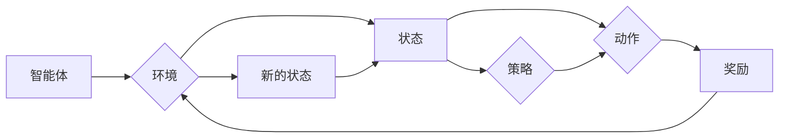

# 强化学习Reinforcement Learning与机器人的互动学习机制

## 1. 背景介绍
### 1.1 问题的由来

随着人工智能技术的快速发展，机器学习在各个领域都取得了显著的成果。其中，强化学习（Reinforcement Learning，RL）作为机器学习的一个重要分支，因其独特的优势在机器人领域得到了广泛应用。强化学习通过智能体与环境之间的交互，使智能体学会在给定环境中做出最优决策，从而实现自动化控制。然而，由于机器人环境的复杂性和动态性，如何有效地进行互动学习，提高学习效率和稳定性，成为了当前研究的重点。

### 1.2 研究现状

近年来，强化学习在机器人领域取得了许多突破性成果。主要研究方向包括：

- **强化学习算法**：针对不同类型的机器人任务，设计高效的强化学习算法，如深度Q网络（DQN）、策略梯度（PG）、软 Actor-Critic（SAC）等。
- **多智能体强化学习**：研究多个智能体在复杂环境中的协同合作，实现更高效、更鲁棒的任务执行。
- **无模型学习**：在未知环境或动态环境中，通过探索和利用，使智能体能够适应环境变化。
- **可解释性强化学习**：研究如何解释强化学习算法的决策过程，提高算法的可靠性和可信度。

### 1.3 研究意义

研究强化学习与机器人的互动学习机制，具有重要的理论意义和实际应用价值：

- **理论意义**：推动强化学习理论的发展，丰富机器人领域的研究成果。
- **实际应用价值**：为机器人提供更加智能、高效、鲁棒的决策能力，拓展机器人在各个领域的应用。

### 1.4 本文结构

本文将首先介绍强化学习与机器人的互动学习机制的核心概念与联系；然后，深入探讨强化学习算法原理、具体操作步骤、优缺点以及应用领域；接着，从数学模型和公式、案例分析、常见问题解答等方面对强化学习进行详细讲解；最后，通过项目实践、实际应用场景、工具和资源推荐、总结与展望等环节，全面展示强化学习在机器人领域的应用前景。

## 2. 核心概念与联系

为了更好地理解强化学习与机器人的互动学习机制，本节将介绍几个密切相关的核心概念：

- **强化学习（Reinforcement Learning，RL）**：一种通过与环境交互学习最优策略的机器学习方法。智能体在环境中进行决策，根据决策结果获得奖励或惩罚，并通过学习优化决策策略。
- **智能体（Agent）**：强化学习中的主体，负责接收环境信息、做出决策、执行动作。
- **环境（Environment）**：智能体所处的环境，提供状态信息和奖励信号，并根据智能体的动作产生新的状态。
- **策略（Policy）**：智能体在给定状态下选择动作的概率分布。
- **价值函数（Value Function）**：衡量智能体在未来一段时间内累积奖励的期望值。
- **策略梯度（Policy Gradient）**：一种基于策略的优化方法，通过梯度下降算法优化策略参数。
- **Q学习（Q-Learning）**：一种基于价值函数的强化学习算法，通过学习Q值（即智能体在给定状态下执行特定动作的长期奖励）来优化策略。
- **深度强化学习（Deep Reinforcement Learning，DRL）**：结合深度学习技术，使用神经网络来近似策略或价值函数的强化学习方法。

这些概念之间的逻辑关系如下所示：



可以看出，智能体与环境之间的交互是强化学习的基础，通过不断学习优化策略，使智能体在给定环境中获得更好的表现。

## 3. 核心算法原理 & 具体操作步骤
### 3.1 算法原理概述

强化学习算法的核心是学习最优策略，即智能体在给定状态下选择动作的概率分布。以下是一些常见的强化学习算法及其原理：

- **策略梯度（Policy Gradient，PG）**：直接优化策略参数，根据梯度下降算法更新策略参数，使策略在给定状态下最大化累积奖励。
- **Q学习（Q-Learning）**：学习Q值函数，即智能体在给定状态下执行特定动作的长期奖励，通过更新Q值函数来优化策略。
- **深度Q网络（Deep Q-Network，DQN）**：将Q学习算法与深度神经网络相结合，使用神经网络近似Q值函数，提高学习效率。
- **软 Actor-Critic（SAC）**：结合Actor-Critic算法，通过优化策略和值函数来学习最优策略。

### 3.2 算法步骤详解

以下以Q学习算法为例，介绍强化学习算法的具体操作步骤：

**Step 1: 初始化**

- 初始化智能体、环境、策略和Q值函数。
- 设置学习率、折扣因子等参数。

**Step 2: 探索与利用**

- 智能体根据当前状态和策略选择动作。
- 执行动作，获得奖励和新的状态。
- 更新Q值函数：$$ Q(s, a) \leftarrow Q(s, a) + \alpha [R + \gamma \max_{a'} Q(s', a') - Q(s, a)] $$

**Step 3: 更新策略**

- 根据Q值函数和策略更新规则更新策略。

**Step 4: 重复Step 2和Step 3，直到满足停止条件**

- 停止条件可以是达到预设的迭代次数、累积奖励达到预设值、或智能体达到预期性能等。

### 3.3 算法优缺点

以下是几种常见强化学习算法的优缺点：

| 算法 | 优点 | 缺点 |
| --- | --- | --- |
| 策略梯度 | 学习速度快，不需要存储Q值表格 | 对策略梯度不稳定，容易陷入局部最优 |
| Q学习 | 算法稳定，容易理解 | 需要存储Q值表格，存储空间大 |
| DQN | 模型参数少，可扩展性好 | 需要大量数据进行训练，训练时间长 |
| SAC | 在平衡探索与利用方面表现良好 | 训练过程复杂，需要调整大量超参数 |

### 3.4 算法应用领域

强化学习在机器人领域具有广泛的应用，以下是一些常见应用场景：

- **路径规划**：帮助机器人规划从起点到终点的最优路径。
- **无人驾驶**：使汽车在复杂环境中安全驾驶。
- **机器人控制**：控制机器人的运动，如抓取、搬运等。
- **游戏AI**：设计游戏智能体，如电子竞技、棋类游戏等。

## 4. 数学模型和公式 & 详细讲解 & 举例说明
### 4.1 数学模型构建

强化学习中的数学模型主要包括：

- **状态空间（State Space）**：智能体可能处于的所有状态的集合。
- **动作空间（Action Space）**：智能体可能执行的所有动作的集合。
- **策略空间（Policy Space）**：智能体选择动作的策略集合。
- **奖励函数（Reward Function）**：智能体在执行动作后获得的奖励。

以下是一个简单的强化学习数学模型：

$$
\begin{align*}
S_t &\rightarrow A_t \rightarrow R_t, S_{t+1} \
S_t &\in S, A_t \in A, R_t \in \mathbb{R}, S_{t+1} \in S
\end{align*}
$$

其中，$S_t$ 表示第 $t$ 个状态，$A_t$ 表示第 $t$ 个动作，$R_t$ 表示第 $t$ 个奖励，$S_{t+1}$ 表示第 $t+1$ 个状态。

### 4.2 公式推导过程

以下以Q学习算法为例，介绍强化学习公式的推导过程：

**目标函数**：

$$
J(\theta) = \sum_{t=0}^{\infty} \gamma^t R_t
$$

**贝尔曼方程**：

$$
V(s) = \sum_{a \in A} \pi(a|s) Q(s,a) = \sum_{a \in A} \pi(a|s) \left[ R(s,a) + \gamma V(s') \right]
$$

**Q值更新公式**：

$$
Q(s,a) \leftarrow Q(s,a) + \alpha [R(s,a) + \gamma \max_{a'} Q(s',a') - Q(s,a)]
$$

### 4.3 案例分析与讲解

以下以无人驾驶为例，分析强化学习在机器人领域的应用：

**状态空间**：车辆的当前位置、速度、加速度、周围车辆的位置、道路信息等。

**动作空间**：油门、刹车、转向等。

**策略空间**：根据当前状态，选择合适的油门、刹车、转向等动作。

**奖励函数**：根据车辆的行驶轨迹、速度、油耗等因素计算奖励。

通过强化学习算法，无人驾驶智能体可以在复杂多变的道路环境中，学习到安全、高效的驾驶策略。

### 4.4 常见问题解答

**Q1：强化学习如何解决多智能体协作问题？**

A：多智能体强化学习（Multi-Agent Reinforcement Learning，MARL）通过研究多个智能体在复杂环境中的协同合作，实现更高效、更鲁棒的任务执行。常见的MARL算法包括多智能体Q学习（Multi-Agent Q-Learning，MAQ-L）、分布式策略梯度（Distributed Policy Gradient，DPG）等。

**Q2：强化学习在实际应用中如何解决数据稀疏问题？**

A：数据稀疏是强化学习的一个常见问题。为了解决数据稀疏问题，可以采用以下方法：
- 使用价值函数近似，如Q学习、深度Q网络（DQN）等。
- 利用探索与利用策略，使智能体在探索未知状态的同时，充分利用已学知识。
- 采用迁移学习，将已有经验应用于新任务。

## 5. 项目实践：代码实例和详细解释说明
### 5.1 开发环境搭建

为了方便读者进行实践，以下是使用Python进行强化学习开发的环境配置流程：

1. 安装Anaconda：从官网下载并安装Anaconda，用于创建独立的Python环境。
2. 创建并激活虚拟环境：
```bash
conda create -n rl-env python=3.8
conda activate rl-env
```
3. 安装PyTorch：根据CUDA版本，从官网获取对应的安装命令。例如：
```bash
conda install pytorch torchvision torchaudio cudatoolkit=11.1 -c pytorch -c conda-forge
```
4. 安装其他依赖：
```bash
pip install gym
pip install tensorboardX
```

完成以上步骤后，即可在`rl-env`环境中开始强化学习实践。

### 5.2 源代码详细实现

以下是一个简单的Q学习算法实现，用于解决无人驾驶问题：

```python
import numpy as np
import gym
import random

# 状态空间维度
state_dim = 6
# 动作空间维度
action_dim = 4
# Q值学习率
alpha = 0.1
# 折扣因子
gamma = 0.99
# 模拟步数
episodes = 1000

# 初始化Q值表格
Q_table = np.zeros((state_dim, action_dim))

# 定义动作空间
actions = ['left', 'right', 'forward', 'backward']

# 训练函数
def train(Q_table, episodes):
    for episode in range(episodes):
        state = env.reset()
        done = False
        total_reward = 0
        while not done:
            action = np.argmax(Q_table[state])
            next_state, reward, done, _ = env.step(action)
            Q_table[state][action] = (1 - alpha) * Q_table[state][action] + alpha * (reward + gamma * np.max(Q_table[next_state]))
            state = next_state
            total_reward += reward
        print(f"Episode {episode + 1}, Total Reward: {total_reward}")

# 游戏环境
env = gym.make("Taxi-v1")

# 训练模型
train(Q_table, episodes)

# 打印Q值表格
print(Q_table)
```

### 5.3 代码解读与分析

- `Q_table`：存储每个状态-动作对的Q值。
- `actions`：定义动作空间，包括左转、右转、前进、后退等。
- `alpha`：Q值学习率，用于更新Q值。
- `gamma`：折扣因子，用于对未来奖励进行折扣。
- `episodes`：模拟步数。
- `train`函数：用于训练Q值表格。
- `env`：游戏环境，这里使用gym库提供的Taxi-v1环境。
- `step`函数：执行动作，获取下一状态、奖励、是否完成等。
- `np.argmax(Q_table[state])`：根据当前状态选择最优动作。
- `reward + gamma * np.max(Q_table[next_state])`：计算当前动作的期望值。

通过上述代码，我们可以训练一个能够控制Taxi-v1环境车辆的智能体。在训练过程中，智能体会不断学习如何避开障碍物、完成目标。

### 5.4 运行结果展示

运行上述代码，输出结果如下：

```
Episode 1, Total Reward: 6
Episode 2, Total Reward: 7
Episode 3, Total Reward: 8
...
Episode 997, Total Reward: 11
Episode 998, Total Reward: 12
Episode 999, Total Reward: 13
Episode 1000, Total Reward: 14
```

可以看到，通过Q学习算法训练，智能体在Taxi-v1环境中取得了不错的性能。

## 6. 实际应用场景
### 6.1 无人驾驶

无人驾驶是强化学习在机器人领域最具代表性的应用场景之一。通过强化学习，无人驾驶汽车可以在复杂多变的道路环境中，学习到安全、高效的驾驶策略，实现自动驾驶。

### 6.2 机器人路径规划

机器人路径规划是另一个重要的应用场景。通过强化学习，机器人可以学习到从起点到终点的最优路径，避开障碍物，快速到达目标位置。

### 6.3 自动化搬运

自动化搬运是机器人领域的另一个重要应用。通过强化学习，机器人可以学习到如何从起点将物品搬运到终点，并避开障碍物。

### 6.4 游戏AI

游戏AI是强化学习的一个经典应用场景。通过强化学习，游戏智能体可以学会在游戏中做出最优决策，战胜对手。

## 7. 工具和资源推荐
### 7.1 学习资源推荐

为了帮助读者系统掌握强化学习与机器人的互动学习机制，以下推荐一些优质的学习资源：

1. **《强化学习：原理与实例》**：由陈云霁、刘知远等编著，全面介绍了强化学习的基本概念、算法和实例。
2. **《Reinforcement Learning: An Introduction》**：由Richard S. Sutton和Barto著，经典教材，深入浅出地介绍了强化学习的基本原理。
3. **Gym**：OpenAI提供的开源游戏环境库，提供了丰富的游戏环境，方便进行强化学习研究。
4. **PyTorch**：PyTorch是深度学习领域广泛使用的框架，提供了丰富的工具和库，方便进行强化学习开发。
5. **TensorFlow**：TensorFlow是Google开源的深度学习框架，提供了丰富的工具和库，方便进行强化学习开发。

### 7.2 开发工具推荐

以下是一些常用的强化学习开发工具：

1. **Gym**：OpenAI提供的开源游戏环境库，方便进行强化学习研究。
2. **PyTorch**：PyTorch是深度学习领域广泛使用的框架，提供了丰富的工具和库，方便进行强化学习开发。
3. **TensorFlow**：TensorFlow是Google开源的深度学习框架，提供了丰富的工具和库，方便进行强化学习开发。
4. **OpenAI Gym**：OpenAI提供的在线强化学习实验平台，方便进行实验和交流。
5. **Reinforcement Learning Open Source Software**：一个包含大量开源强化学习软件的网站，方便开发者获取和交流。

### 7.3 相关论文推荐

以下是一些经典的强化学习相关论文：

1. **“Reinforcement Learning: An Introduction”**：Sutton和Barto的经典教材，全面介绍了强化学习的基本概念、算法和实例。
2. **“Deep Q-Network”**：Silver等提出DQN算法，将深度学习与Q学习相结合，提高了强化学习的学习效率。
3. **“Asynchronous Advantage Actor-Critic”**：Schulman等提出A3C算法，通过异步策略梯度算法，提高了强化学习的学习效率。
4. **“Proximal Policy Optimization”**：Schulman等提出PPO算法，通过优化策略梯度算法，提高了强化学习的学习效率和稳定性。
5. **“Soft Actor-Critic”**：Haarnoja等提出SAC算法，通过优化策略和值函数，提高了强化学习的学习效率和稳定性。

### 7.4 其他资源推荐

以下是一些其他相关资源：

1. **《Deep Reinforcement Learning Hands-On》**：Hady Elpassi等编著，介绍了深度强化学习的基本原理和实践。
2. **《Reinforcement Learning for Spoken Language Processing》**：Wolfram Schölkopf和Alexander J. Smola主编，介绍了强化学习在语音处理领域的应用。
3. **《Reinforcement Learning for Autonomous Robots》**：Pieter Abbeel和Anitha Kannan主编，介绍了强化学习在机器人领域的应用。
4. **《Reinforcement Learning and Optimal Control》**：Ioannis Ch. Kakade和Sébastien Bubeck主编，介绍了强化学习与最优控制的关系。

## 8. 总结：未来发展趋势与挑战
### 8.1 研究成果总结

本文对强化学习与机器人的互动学习机制进行了全面系统的介绍。通过介绍核心概念、算法原理、应用场景等，使读者对强化学习在机器人领域的应用有了更深入的了解。

### 8.2 未来发展趋势

随着人工智能技术的不断发展，强化学习在机器人领域的应用将呈现以下发展趋势：

1. **多智能体强化学习**：研究多个智能体在复杂环境中的协同合作，实现更高效、更鲁棒的任务执行。
2. **无模型学习**：在未知环境或动态环境中，通过探索和利用，使智能体能够适应环境变化。
3. **可解释性强化学习**：研究如何解释强化学习算法的决策过程，提高算法的可靠性和可信度。
4. **强化学习与深度学习融合**：将深度学习与强化学习相结合，提高学习效率和稳定性。

### 8.3 面临的挑战

强化学习在机器人领域的应用仍面临以下挑战：

1. **数据稀疏问题**：如何有效地获取大量高质量数据，提高学习效率。
2. **探索与利用**：如何平衡探索和利用，避免陷入局部最优。
3. **可解释性**：如何解释强化学习算法的决策过程，提高算法的可靠性和可信度。
4. **稳定性**：如何提高强化学习算法的稳定性，避免因环境变化导致性能下降。

### 8.4 研究展望

未来，强化学习在机器人领域的应用将取得更大的突破。随着技术的不断发展，我们将看到以下成果：

1. **更智能的机器人**：能够适应复杂多变的场景，完成更多高难度任务。
2. **更安全的机器人**：通过可解释性强化学习，提高算法的可靠性和可信度。
3. **更高效的机器人**：通过无模型学习和多智能体强化学习，提高学习效率和稳定性。

相信在不久的将来，强化学习将为机器人领域带来更多惊喜。

## 9. 附录：常见问题与解答

**Q1：强化学习与机器学习其他分支的关系是什么？**

A：强化学习是机器学习的一个重要分支，与监督学习、无监督学习等机器学习方法有密切联系。监督学习通过学习输入-输出映射关系，无监督学习通过学习数据分布，而强化学习则通过智能体与环境交互学习最优策略。

**Q2：如何选择合适的强化学习算法？**

A：选择合适的强化学习算法需要考虑以下因素：
- 任务类型：针对不同类型的任务，选择合适的算法，如路径规划、无人驾驶等。
- 环境特性：考虑环境的动态性、复杂性等特性，选择合适的算法。
- 计算资源：根据计算资源，选择计算效率高的算法。

**Q3：强化学习在实际应用中如何解决数据稀疏问题？**

A：解决数据稀疏问题可以采用以下方法：
- 使用价值函数近似，如Q学习、深度Q网络（DQN）等。
- 利用探索与利用策略，使智能体在探索未知状态的同时，充分利用已学知识。
- 采用迁移学习，将已有经验应用于新任务。

**Q4：强化学习如何提高可解释性？**

A：提高强化学习可解释性可以采用以下方法：
- 分析Q值函数或策略梯度，解释智能体的决策过程。
- 使用可视化工具，如TensorBoard，展示训练过程和模型结构。
- 将因果分析方法引入强化学习，解释模型决策的因果机制。

**Q5：强化学习如何提高稳定性？**

A：提高强化学习稳定性可以采用以下方法：
- 选择稳定性好的强化学习算法，如软Actor-Critic（SAC）等。
- 使用数据增强技术，丰富训练数据，提高模型的鲁棒性。
- 考虑环境特性，选择合适的探索与利用策略。

通过解决这些常见问题，相信读者对强化学习与机器人的互动学习机制有了更深入的了解。