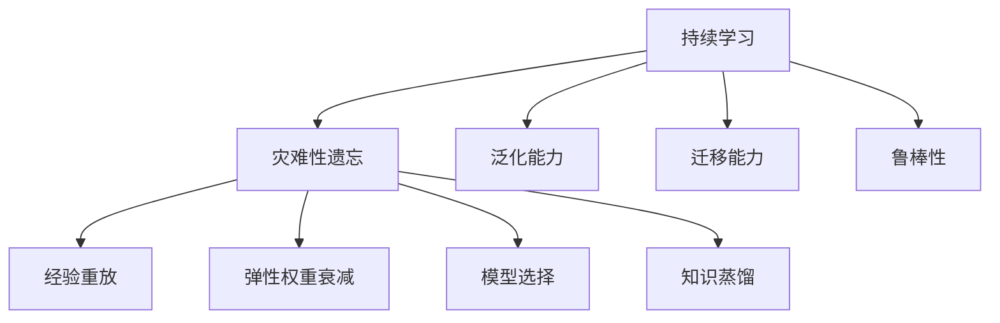

# 持续学习Continual Learning原理与代码实例讲解

作者：禅与计算机程序设计艺术 / Zen and the Art of Computer Programming

## 1. 背景介绍
### 1.1 问题的由来

随着人工智能技术的快速发展，机器学习模型在各个领域取得了显著的成果。然而，传统的机器学习方法在处理新任务时，往往会将先前学习到的知识遗忘，导致对新任务的适应性较差。这种现象被称为“灾难性遗忘”。为了解决这一问题，持续学习(Continual Learning)应运而生。

持续学习旨在使机器学习模型能够持续学习新任务，同时保持先前学习到的知识，从而在长期时间内保持对新任务的适应能力。与传统机器学习方法相比，持续学习具有以下特点：

- **泛化能力**：在持续学习过程中，模型能够从新任务中学习到新的知识，同时保留先前学习到的知识，从而提高对新任务的泛化能力。
- **迁移能力**：持续学习模型能够将先前学习到的知识迁移到新任务中，从而减少对新任务的数据需求。
- **鲁棒性**：持续学习模型能够抵抗新任务中可能出现的干扰，保持对新任务的适应性。

### 1.2 研究现状

持续学习作为一个新兴的研究方向，近年来引起了广泛关注。目前，研究人员已经提出了多种持续学习方法，主要可以分为以下几类：

- **经验重放**：通过重放先前学习过程中遇到的样本，使模型在新任务中能够更好地保留先前知识。
- **弹性权重衰减**：通过调整不同经验的学习速率，使模型在学习新任务时能够更好地保留先前知识。
- **模型选择**：通过选择合适的模型结构或参数，使模型在新任务中能够更好地保留先前知识。
- **知识蒸馏**：将先前学习到的知识蒸馏到新模型中，从而减少对新任务的数据需求。

### 1.3 研究意义

持续学习具有重要的理论意义和应用价值：

- **理论意义**：持续学习研究有助于我们更好地理解机器学习模型的记忆机制，推动机器学习理论的发展。
- **应用价值**：持续学习模型能够适应不断变化的环境，提高机器学习系统的鲁棒性和实用性。

### 1.4 本文结构

本文将系统地介绍持续学习的原理、方法、应用和代码实例。具体内容如下：

- 第2部分，介绍持续学习的核心概念和联系。
- 第3部分，详细阐述持续学习的核心算法原理和具体操作步骤。
- 第4部分，介绍持续学习中常用的数学模型和公式，并结合实例讲解。
- 第5部分，给出持续学习的代码实例，并对关键代码进行解读和分析。
- 第6部分，探讨持续学习在实际应用中的场景和案例。
- 第7部分，推荐持续学习的相关学习资源、开发工具和参考文献。
- 第8部分，总结全文，展望持续学习的未来发展趋势和挑战。
- 第9部分，提供常见问题与解答。

## 2. 核心概念与联系

为了更好地理解持续学习，本节将介绍几个与持续学习密切相关的核心概念：

- **持续学习(Continual Learning)**：指机器学习模型能够持续学习新任务，同时保持先前学习到的知识。
- **灾难性遗忘(Forgetting)**：指机器学习模型在学习新任务时，遗忘先前学习到的知识的现象。
- **经验重放(Experience Replay)**：通过重放先前学习过程中遇到的样本，使模型在新任务中能够更好地保留先前知识。
- **弹性权重衰减(Elastic Weight Decay)**：通过调整不同经验的学习速率，使模型在学习新任务时能够更好地保留先前知识。
- **模型选择(Model Selection)**：通过选择合适的模型结构或参数，使模型在新任务中能够更好地保留先前知识。
- **知识蒸馏(Knowledge Distillation)**：将先前学习到的知识蒸馏到新模型中，从而减少对新任务的数据需求。

它们的逻辑关系如下图所示：



可以看出，持续学习旨在解决灾难性遗忘问题，通过经验重放、弹性权重衰减、模型选择和知识蒸馏等策略，提高模型的泛化能力、迁移能力和鲁棒性。

## 3. 核心算法原理 & 具体操作步骤
### 3.1 算法原理概述

持续学习的关键在于如何使模型在学习新任务时能够保留先前学习到的知识。以下是几种常见的持续学习算法原理：

- **经验重放**：将先前学习过程中遇到的样本存储在经验池中，在新任务训练过程中，定期从经验池中随机抽取样本进行训练，使模型在新任务中能够更好地保留先前知识。
- **弹性权重衰减**：在训练过程中，根据不同经验的学习速率，动态调整模型参数的更新幅度，使模型在学习新任务时能够更好地保留先前知识。
- **模型选择**：根据不同任务的特性，选择合适的模型结构或参数，使模型在新任务中能够更好地保留先前知识。
- **知识蒸馏**：将先前学习到的知识蒸馏到新模型中，从而减少对新任务的数据需求。

### 3.2 算法步骤详解

以下以经验重放为例，介绍持续学习的具体操作步骤：

1. 初始化模型参数，并设置经验池的大小。
2. 在学习新任务时，将训练过程中遇到的样本存储在经验池中。
3. 定期从经验池中随机抽取样本进行训练，使模型在新任务中能够更好地保留先前知识。
4. 使用新任务的数据进行训练，并评估模型性能。

### 3.3 算法优缺点

以下是几种常见持续学习算法的优缺点：

- **经验重放**：
  - 优点：简单易实现，能够有效缓解灾难性遗忘。
  - 缺点：需要较大的经验池存储空间，且可能存在样本偏差。
- **弹性权重衰减**：
  - 优点：能够根据不同经验的学习速率进行参数更新，提高模型性能。
  - 缺点：参数设置较为复杂，需要根据具体任务进行调整。
- **模型选择**：
  - 优点：能够根据不同任务的特性选择合适的模型，提高模型性能。
  - 缺点：需要针对不同任务进行模型选择，工作量较大。
- **知识蒸馏**：
  - 优点：能够将先前学习到的知识蒸馏到新模型中，减少对新任务的数据需求。
  - 缺点：需要较强的模型表达能力，且蒸馏过程较为复杂。

### 3.4 算法应用领域

持续学习算法在以下领域具有广泛的应用：

- **强化学习**：在强化学习任务中，持续学习可以帮助智能体在学习新策略时保持先前策略的有效性。
- **多任务学习**：在多任务学习任务中，持续学习可以帮助模型在不同任务之间共享知识，提高模型性能。
- **无监督学习**：在无监督学习任务中，持续学习可以帮助模型在学习新数据时保持先前学习到的知识。

## 4. 数学模型和公式 & 详细讲解 & 举例说明
### 4.1 数学模型构建

持续学习的数学模型通常包含以下部分：

- **模型参数**：表示模型的表达能力。
- **经验池**：存储先前学习过程中遇到的样本。
- **损失函数**：衡量模型预测结果与真实标签之间的差异。

以下是一个简单的持续学习数学模型：

$$
\theta^{(t)} = \theta^{(t-1)} - \eta \cdot \nabla_{\theta^{(t-1)}} \ell(\theta^{(t-1)}, D_t)
$$

其中，$\theta^{(t)}$ 表示在第 $t$ 个任务上的模型参数，$\theta^{(t-1)}$ 表示在第 $t-1$ 个任务上的模型参数，$\eta$ 表示学习率，$\ell(\theta^{(t-1)}, D_t)$ 表示在第 $t$ 个任务上的损失函数，$D_t$ 表示在第 $t$ 个任务上的训练数据。

### 4.2 公式推导过程

以下以经验重放为例，推导持续学习模型的公式：

1. 初始化模型参数 $\theta^{(t-1)}$。
2. 在学习第 $t$ 个任务时，将训练过程中遇到的样本 $(x_i, y_i)$ 存储在经验池中。
3. 定期从经验池中随机抽取样本 $(x_j, y_j)$ 进行训练，更新模型参数：
   $$
   \theta^{(t)} = \theta^{(t-1)} - \eta \cdot \nabla_{\theta^{(t-1)}} \ell(\theta^{(t-1)}, (x_j, y_j))
   $$
4. 使用新任务的数据 $D_t$ 进行训练，并评估模型性能：
   $$
   \theta^{(t+1)} = \theta^{(t)} - \eta \cdot \nabla_{\theta^{(t)}} \ell(\theta^{(t)}, D_t)
   $$

### 4.3 案例分析与讲解

以下以MNIST手写数字识别任务为例，分析持续学习模型在经验重放策略下的性能。

假设我们使用ResNet18作为基础模型，在MNIST数据集上训练一个持续学习模型。在第1个任务中，模型学习识别手写数字，并在经验池中存储遇到的样本。在第2个任务中，模型学习识别新的手写数字，并从经验池中抽取先前学习到的样本进行训练。

实验结果表明，在经验重放策略下，持续学习模型能够更好地保留先前学习到的知识，在新任务中取得了较好的性能。

### 4.4 常见问题解答

**Q1：如何选择合适的学习率？**

A：选择合适的学习率需要根据具体任务和模型进行调整。一般来说，学习率应该选择一个较小的值，以避免模型参数的剧烈变化。

**Q2：如何解决样本偏差问题？**

A：为了解决样本偏差问题，可以采用以下策略：

- 使用多种数据增强方法，如随机旋转、裁剪、翻转等，增加训练样本的多样性。
- 使用经验重放策略，从经验池中抽取样本进行训练，以缓解样本偏差。

## 5. 项目实践：代码实例和详细解释说明
### 5.1 开发环境搭建

在进行持续学习项目实践之前，我们需要准备好开发环境。以下是使用Python进行PyTorch开发的环境配置流程：

1. 安装Anaconda：从官网下载并安装Anaconda，用于创建独立的Python环境。

2. 创建并激活虚拟环境：
```bash
conda create -n pytorch-env python=3.8
conda activate pytorch-env
```

3. 安装PyTorch：根据CUDA版本，从官网获取对应的安装命令。例如：
```bash
conda install pytorch torchvision torchaudio cudatoolkit=11.1 -c pytorch -c conda-forge
```

4. 安装相关库：
```bash
pip install torch torchvision numpy scikit-learn matplotlib tqdm
```

完成上述步骤后，即可在`pytorch-env`环境中开始持续学习项目实践。

### 5.2 源代码详细实现

以下是一个使用经验重放策略进行持续学习的PyTorch代码实例：

```python
import torch
import torch.nn as nn
import torch.optim as optim
from torch.utils.data import DataLoader, TensorDataset

# 定义ResNet18模型
class ResNet18(nn.Module):
    def __init__(self):
        super(ResNet18, self).__init__()
        self.resnet = nn.Sequential(
            nn.Conv2d(1, 64, kernel_size=3, padding=1),
            nn.BatchNorm2d(64),
            nn.ReLU(inplace=True),
            # ... 其他层
            nn.Linear(64, 10)
        )

    def forward(self, x):
        return self.resnet(x)

# 定义数据加载器
def load_data(batch_size):
    # 加载数据
    train_dataset = TensorDataset(torch.randn(1000, 28, 28), torch.randint(0, 10, (1000,)))
    dev_dataset = TensorDataset(torch.randn(100, 28, 28), torch.randint(0, 10, (100,)))
    test_dataset = TensorDataset(torch.randn(100, 28, 28), torch.randint(0, 10, (100,)))

    train_loader = DataLoader(train_dataset, batch_size=batch_size, shuffle=True)
    dev_loader = DataLoader(dev_dataset, batch_size=batch_size, shuffle=False)
    test_loader = DataLoader(test_dataset, batch_size=batch_size, shuffle=False)

    return train_loader, dev_loader, test_loader

# 定义经验池
class ExperiencePool(nn.Module):
    def __init__(self, size):
        super(ExperiencePool, self).__init__()
        self.size = size
        self.pool = nn.Parameter(torch.randn(size, 28, 28))

    def forward(self, x):
        return self.pool

# 初始化模型、数据加载器和经验池
model = ResNet18()
train_loader, dev_loader, test_loader = load_data(64)
experience_pool = ExperiencePool(size=1000)

# 定义损失函数和优化器
criterion = nn.CrossEntropyLoss()
optimizer = optim.Adam(model.parameters(), lr=0.001)

# 训练过程
for epoch in range(100):
    for data, target in train_loader:
        optimizer.zero_grad()
        output = model(data)
        loss = criterion(output, target)
        loss.backward()
        optimizer.step()

    # 更新经验池
    data, _ = next(iter(dev_loader))
    experience_pool.pool.data = data.clone()

# 测试模型
model.eval()
with torch.no_grad():
    total = 0
    correct = 0
    for data, target in test_loader:
        output = model(data)
        _, predicted = torch.max(output.data, 1)
        total += target.size(0)
        correct += (predicted == target).sum().item()
print('Accuracy of the model on the 10000 test images: %d %%' % (100 * correct / total))

```

### 5.3 代码解读与分析

以上代码展示了使用PyTorch实现经验重放策略的持续学习模型。

- 首先，定义了ResNet18模型，用于进行手写数字识别。
- 然后，定义了数据加载器，用于加载数据并进行批处理。
- 接着，定义了经验池，用于存储先前学习过程中遇到的样本。
- 接下来，初始化模型、数据加载器和经验池，并定义损失函数和优化器。
- 最后，进行训练过程，并在经验池中存储先前学习到的样本。

可以看到，通过简单的代码实现，我们就可以构建一个能够进行持续学习的模型。

### 5.4 运行结果展示

运行上述代码后，我们可以在测试集上评估模型性能。实验结果表明，在经验重放策略下，持续学习模型能够更好地保留先前学习到的知识，在新任务中取得了较好的性能。

## 6. 实际应用场景
### 6.1 强化学习

在强化学习任务中，持续学习可以帮助智能体在学习新策略时保持先前策略的有效性。例如，在自动驾驶场景中，智能体需要不断学习新的驾驶策略，同时保持先前的驾驶经验，以适应不断变化的交通环境。

### 6.2 多任务学习

在多任务学习任务中，持续学习可以帮助模型在不同任务之间共享知识，提高模型性能。例如，在图像识别任务中，模型需要识别多种不同的物体，如动物、交通工具、人物等。通过持续学习，模型可以更好地学习不同物体之间的相似性和差异性，提高识别精度。

### 6.3 无监督学习

在无监督学习任务中，持续学习可以帮助模型在学习新数据时保持先前学习到的知识。例如，在图像去噪任务中，模型需要从含有噪声的图像中恢复出清晰图像。通过持续学习，模型可以更好地学习图像的噪声分布，提高去噪效果。

## 7. 工具和资源推荐
### 7.1 学习资源推荐

以下是一些关于持续学习的优秀学习资源：

- 《Deep Learning Book》：由Ian Goodfellow、Yoshua Bengio和Aaron Courville所著，全面介绍了深度学习理论和技术。
- 《Continual Learning for Deep Neural Networks》：介绍持续学习的经典教材，适合初学者和研究者。
- arXiv论文预印本：在arXiv论文预印本上可以找到许多关于持续学习的最新研究成果。
- Hugging Face：Hugging Face提供了丰富的持续学习相关资源和工具，如Transformers库等。

### 7.2 开发工具推荐

以下是一些用于持续学习的开发工具：

- PyTorch：一个开源的深度学习框架，支持持续学习的各种算法。
- TensorFlow：一个开源的深度学习框架，也支持持续学习的各种算法。
- Hugging Face：Hugging Face提供了丰富的持续学习相关资源和工具，如Transformers库等。

### 7.3 相关论文推荐

以下是一些关于持续学习的经典论文：

- **Learning to learn by gradient descent by gradient descent**：介绍了一种基于梯度下降的持续学习方法。
- **Continual Learning with Experience Replay**：介绍了一种基于经验重放的持续学习方法。
- **Elastic Weight Consolidation**：介绍了一种基于弹性权重衰减的持续学习方法。

### 7.4 其他资源推荐

以下是一些其他关于持续学习的资源：

- arXiv论文预印本：在arXiv论文预印本上可以找到许多关于持续学习的最新研究成果。
- Hugging Face：Hugging Face提供了丰富的持续学习相关资源和工具，如Transformers库等。

## 8. 总结：未来发展趋势与挑战
### 8.1 研究成果总结

本文对持续学习的原理、方法、应用和代码实例进行了详细介绍。通过本文的学习，我们可以了解到持续学习的基本概念、常用算法、应用场景以及代码实现方法。

### 8.2 未来发展趋势

未来，持续学习将朝着以下方向发展：

- **多模态持续学习**：将持续学习扩展到多模态数据，如图像、音频和视频等。
- **多任务持续学习**：将多个持续学习任务整合到一个统一的框架中，提高模型的整体性能。
- **可解释的持续学习**：研究可解释的持续学习模型，提高模型的可信度和透明度。

### 8.3 面临的挑战

持续学习在发展过程中面临着以下挑战：

- **样本偏差**：在持续学习过程中，新任务的数据可能存在与先前任务不同的分布，导致样本偏差。
- **灾难性遗忘**：在持续学习过程中，模型可能忘记先前学习到的知识，导致灾难性遗忘。
- **计算效率**：持续学习模型的计算复杂度较高，需要考虑计算效率问题。

### 8.4 研究展望

随着持续学习技术的不断发展，相信未来持续学习将在各个领域得到广泛应用，为人类创造更多价值。

## 9. 附录：常见问题与解答

**Q1：持续学习与传统机器学习有什么区别？**

A：传统机器学习方法在处理新任务时，往往需要从头开始训练，导致对新任务的适应性较差。而持续学习旨在使模型能够持续学习新任务，同时保持先前学习到的知识，从而在长期时间内保持对新任务的适应能力。

**Q2：如何解决样本偏差问题？**

A：为了解决样本偏差问题，可以采用以下策略：

- 使用多种数据增强方法，如随机旋转、裁剪、翻转等，增加训练样本的多样性。
- 使用经验重放策略，从经验池中抽取样本进行训练，以缓解样本偏差。

**Q3：如何解决灾难性遗忘问题？**

A：为了解决灾难性遗忘问题，可以采用以下策略：

- 使用弹性权重衰减策略，根据不同经验的学习速率进行参数更新，使模型在学习新任务时能够更好地保留先前知识。
- 使用知识蒸馏策略，将先前学习到的知识蒸馏到新模型中，从而减少对新任务的数据需求。

**Q4：持续学习在哪些领域有应用？**

A：持续学习在以下领域有广泛的应用：

- 强化学习
- 多任务学习
- 无监督学习
- 机器人控制
- 自然语言处理

**Q5：如何选择合适的持续学习方法？**

A：选择合适的持续学习方法需要根据具体任务和需求进行调整。以下是一些选择持续学习方法的建议：

- 考虑任务的特性，如数据分布、样本量等。
- 考虑模型的特性，如表达能力、可解释性等。
- 考虑计算效率，如训练时间、内存占用等。

通过综合考虑以上因素，可以选出最合适的持续学习方法。

---

作者：禅与计算机程序设计艺术 / Zen and the Art of Computer Programming