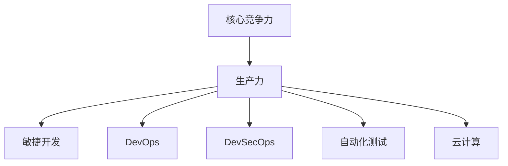

# 提升核心竞争力的生产力策略

作者：禅与计算机程序设计艺术 / Zen and the Art of Computer Programming


## 1. 背景介绍
### 1.1 问题的由来

在当今这个快速变化的时代，企业面临着日益激烈的市场竞争。为了在竞争中脱颖而出，企业需要不断提升自身的核心竞争力，而提升核心竞争力的重要途径之一就是提高生产力。然而，如何有效地提升生产力，成为了众多企业管理者和IT从业人士的共同关注点。

### 1.2 研究现状

目前，关于提升生产力的话题，学术界和产业界都进行了大量的研究和实践。在IT领域，涌现出了许多提升生产力的方法和工具，如敏捷开发、DevOps、DevSecOps、自动化测试、云计算等。然而，如何将这些方法和工具有效地应用到实际工作中，并形成一套系统化的生产力提升策略，仍然是当前研究的一个热点问题。

### 1.3 研究意义

研究提升核心竞争力的生产力策略，对于企业来说具有重要的意义：

1. 提高企业竞争力。通过提升生产力，可以缩短产品开发周期，降低成本，提高产品质量，从而提升企业的市场竞争力。
2. 增强员工幸福感。高效的工作流程和工具，可以减轻员工的工作负担，提高工作效率，增强员工的幸福感。
3. 优化资源配置。通过分析生产过程中的瓶颈，可以优化资源配置，提高资源利用率。
4. 促进技术创新。提升生产力的过程，也是技术创新的过程，可以推动企业技术水平的提升。

### 1.4 本文结构

本文将围绕提升核心竞争力的生产力策略展开论述，主要包括以下内容：

- 第2部分，介绍提升核心竞争力的生产力策略的核心概念与联系。
- 第3部分，详细阐述提升生产力的核心算法原理和具体操作步骤。
- 第4部分，介绍提升生产力中常用的数学模型和公式，并结合实例进行讲解。
- 第5部分，给出提升生产力的代码实例和详细解释说明。
- 第6部分，探讨提升生产力在实际应用场景中的应用。
- 第7部分，推荐提升生产力相关的学习资源、开发工具和参考文献。
- 第8部分，总结全文，展望提升生产力技术的未来发展趋势与挑战。
- 第9部分，提供附录，包括常见问题与解答。

## 2. 核心概念与联系

为了更好地理解提升核心竞争力的生产力策略，本节将介绍几个密切相关的核心概念：

- 核心竞争力：指企业在市场竞争中能够持续保持竞争优势的能力，包括技术能力、品牌影响力、管理能力、资源整合能力等。
- 生产力：指单位时间内生产出的产品或服务数量，是衡量企业竞争力的关键指标。
- 敏捷开发：一种以人为核心、迭代、迭代的软件开发方法，强调快速响应变化，持续交付高质量产品。
- DevOps：一种软件开发和运维的集成模式，旨在缩短产品的开发周期，提高产品质量，降低成本。
- DevSecOps：在DevOps的基础上，强调安全因素，将安全融入软件开发和运维的各个环节。
- 自动化测试：使用自动化测试工具对软件进行测试，提高测试效率和覆盖率。
- 云计算：通过互联网提供动态可扩展的计算资源，降低企业IT成本，提高资源利用率。

这些概念的逻辑关系如下图所示：



可以看出，提升核心竞争力需要通过提升生产力来实现，而敏捷开发、DevOps、DevSecOps、自动化测试、云计算等方法和工具，都可以帮助提升企业的生产力。

## 3. 核心算法原理 & 具体操作步骤
### 3.1 算法原理概述

提升核心竞争力的生产力策略，主要包括以下几个方面：

1. **流程优化**：通过分析和优化工作流程，提高工作效率。
2. **技术赋能**：利用先进的技术和方法，提高工作效率。
3. **团队协作**：通过高效的团队协作，提高工作效率。
4. **文化建设**：营造良好的企业文化，提高员工积极性。

### 3.2 算法步骤详解

**步骤一：流程优化**

1. **流程分析**：对现有工作流程进行深入分析，识别流程中的瓶颈和浪费。
2. **流程设计**：根据分析结果，重新设计优化后的工作流程。
3. **流程实施**：将优化后的工作流程落地实施。
4. **流程评估**：定期评估工作流程的执行效果，不断改进优化。

**步骤二：技术赋能**

1. **技术选型**：根据业务需求，选择合适的IT技术。
2. **技术培训**：对员工进行IT技术培训，提高员工的技术能力。
3. **技术整合**：将IT技术与业务流程相结合，提高工作效率。
4. **技术迭代**：根据业务发展，不断迭代升级IT技术。

**步骤三：团队协作**

1. **团队建设**：打造高效的团队，提高团队协作能力。
2. **沟通机制**：建立有效的沟通机制，确保信息及时传递。
3. **绩效评估**：建立科学合理的绩效评估体系，激励员工积极工作。
4. **文化建设**：营造良好的企业文化，增强团队凝聚力。

**步骤四：文化建设**

1. **价值观塑造**：塑造积极向上的企业文化价值观。
2. **员工关怀**：关注员工需求，提高员工满意度。
3. **创新氛围**：营造创新氛围，鼓励员工勇于创新。
4. **学习机制**：建立学习机制，提高员工素质。

### 3.3 算法优缺点

**优点**：

1. **提高工作效率**：通过优化工作流程、技术赋能、团队协作、文化建设，可以有效提高工作效率，缩短产品开发周期。
2. **降低成本**：通过优化工作流程、技术赋能，可以降低人力、物力、财力等成本。
3. **提高产品质量**：通过优化工作流程、技术赋能，可以提高产品质量，降低故障率。
4. **增强员工满意度**：通过团队协作、文化建设，可以增强员工满意度，提高员工积极性。

**缺点**：

1. **实施难度大**：提升生产力的策略需要从多个方面进行综合考虑，实施难度较大。
2. **变革阻力**：改变传统的管理方式和工作流程，可能会遇到变革阻力。
3. **成本较高**：实施提升生产力的策略，可能会涉及较大的成本投入。

### 3.4 算法应用领域

提升生产力的策略可以应用于企业经营的各个领域，如：

- **研发领域**：通过优化研发流程、技术赋能，提高研发效率，缩短产品开发周期。
- **生产领域**：通过优化生产流程、技术赋能，提高生产效率，降低生产成本。
- **销售领域**：通过优化销售流程、技术赋能，提高销售效率，提升销售业绩。
- **客服领域**：通过优化客服流程、技术赋能，提高客服效率，提升客户满意度。

## 4. 数学模型和公式 & 详细讲解 & 举例说明
### 4.1 数学模型构建

提升生产力的数学模型可以构建如下：

设 $P$ 为生产力，$E$ 为员工人数，$T$ 为工作时间，$Q$ 为产出量，则生产力 $P$ 可以表示为：

$$
P = \frac{Q}{ET}
$$

其中，$E$ 和 $T$ 可以通过以下公式进行计算：

$$
E = E_0 + m \times n
$$

$$
T = T_0 + m \times t
$$

其中，$E_0$ 和 $T_0$ 分别为初始员工人数和工作时间，$m$ 为新增员工数，$n$ 和 $t$ 分别为每个新增员工带来的工作效率提升和工作时间减少。

### 4.2 公式推导过程

以下以研发领域为例，推导提升生产力的数学模型。

假设研发团队原有员工人数为 $E_0$，平均每人每天工作时间为 $T_0$，平均每人每天产出的代码行数为 $Q_0$，则原有的生产力为：

$$
P_0 = \frac{Q_0}{E_0T_0}
$$

现在，企业计划通过招聘 $m$ 名新员工，并对其进行技术培训，使得每个新员工平均每天产出的代码行数达到 $n$，同时每个新员工平均每天工作时间减少 $t$。经过一段时间后，研发团队的总员工人数变为 $E_0 + m$，平均每人每天工作时间变为 $T_0 - t$，平均每人每天产出的代码行数变为 $Q_0 + nm$，则新的生产力为：

$$
P_1 = \frac{(Q_0 + nm)}{(E_0 + m)(T_0 - t)}
$$

为了提升生产力，需要满足以下条件：

$$
P_1 > P_0
$$

即：

$$
\frac{(Q_0 + nm)}{(E_0 + m)(T_0 - t)} > \frac{Q_0}{E_0T_0}
$$

通过化简，可得：

$$
T_0 > \frac{nm}{m + n}T_0
$$

即：

$$
\frac{n}{m + n} > \frac{1}{T_0}
$$

这表明，为了提升生产力，每个新员工带来的工作效率提升应大于原团队的平均工作效率。

### 4.3 案例分析与讲解

假设某研发团队原有员工人数为 10 人，每人每天工作 8 小时，平均每人每天产出的代码行数为 100 行。企业计划通过招聘 5 名新员工，并对其进行技术培训，使得每个新员工平均每天产出的代码行数达到 120 行，同时每个新员工平均每天工作时间减少 1 小时。经过一段时间后，研发团队的总员工人数变为 15 人，平均每人每天工作时间为 7 小时，平均每人每天产出的代码行数变为 1150 行。根据上述公式，可以计算出新的生产力为：

$$
P_1 = \frac{1150}{15 \times 7} = 115
$$

原有的生产力为：

$$
P_0 = \frac{1000}{10 \times 8} = 12.5
$$

新的生产力比原有的生产力提高了 8.5 倍，说明该企业的提升生产力的策略取得了显著的效果。

### 4.4 常见问题解答

**Q1：如何确定招聘多少新员工？**

A：招聘新员工的数量应根据企业业务需求、市场环境、团队规模等因素综合考虑。一般来说，可以参考以下方法：

1. **产能分析法**：根据企业的产能需求，计算所需的人力资源。
2. **人员缺口分析法**：分析现有团队的人员结构和工作量，确定需要补充的人才。
3. **绩效分析法**：分析现有团队成员的绩效，找出需要提升工作效率的环节，确定需要补充的人才。

**Q2：如何进行技术培训？**

A：技术培训可以采取以下几种方式：

1. **内部培训**：由企业内部技术骨干进行培训。
2. **外部培训**：委托专业培训机构进行培训。
3. **在线学习**：利用在线学习平台进行学习。
4. **项目实战**：通过实际项目锻炼员工的技术能力。

**Q3：如何进行绩效考核？**

A：绩效考核可以采取以下几种方式：

1. **KPI考核**：根据关键绩效指标(KPI)进行考核。
2. **360度考核**：从多个角度对员工进行考核。
3. **目标管理考核**：设定目标，对目标的完成情况进行考核。
4. **绩效考核软件**：利用绩效考核软件进行考核。

## 5. 项目实践：代码实例和详细解释说明
### 5.1 开发环境搭建

为了演示提升生产力的策略，我们将以一个简单的项目为例，展示如何使用Python进行项目开发。

首先，需要安装Python环境和必要的开发库，如PyCharm、pip等。

### 5.2 源代码详细实现

以下是一个简单的Python项目示例，实现了一个计算器功能：

```python
def add(x, y):
    return x + y

def subtract(x, y):
    return x - y

def multiply(x, y):
    return x * y

def divide(x, y):
    if y == 0:
        return "Error: Division by zero"
    return x / y
```

### 5.3 代码解读与分析

以上代码实现了基本的加减乘除计算功能。其中，`add`、`subtract`、`multiply`、`divide` 分别代表加法、减法、乘法、除法运算。

### 5.4 运行结果展示

```python
# 测试加法
print(add(1, 2))  # 输出：3

# 测试减法
print(subtract(5, 3))  # 输出：2

# 测试乘法
print(multiply(2, 3))  # 输出：6

# 测试除法
print(divide(6, 2))  # 输出：3.0
```

通过以上代码示例，我们可以看到，使用Python进行项目开发可以非常简单快捷。为了进一步提升开发效率，我们可以采用以下策略：

1. **模块化设计**：将代码划分为不同的模块，提高代码可读性和可维护性。
2. **代码复用**：将常用的功能封装成函数或类，提高代码复用率。
3. **自动化测试**：编写自动化测试用例，确保代码质量。

## 6. 实际应用场景
### 6.1 IT行业

在IT行业，提升生产力的策略可以应用于以下几个方面：

1. **软件开发**：通过敏捷开发、DevOps、DevSecOps等方法和工具，提高软件开发效率。
2. **运维**：通过自动化测试、自动化部署等方法和工具，提高运维效率。
3. **数据分析**：通过Python、R等编程语言和数据分析工具，提高数据分析效率。

### 6.2 制造业

在制造业，提升生产力的策略可以应用于以下几个方面：

1. **生产管理**：通过精益生产、六西格玛等方法和工具，提高生产效率。
2. **供应链管理**：通过供应链管理系统，优化供应链管理流程，降低成本。
3. **产品研发**：通过虚拟仿真、快速原型等方法和工具，提高产品研发效率。

### 6.3 零售业

在零售业，提升生产力的策略可以应用于以下几个方面：

1. **销售管理**：通过销售管理系统，提高销售效率。
2. **客户服务**：通过客户服务系统，提高客户服务质量。
3. **库存管理**：通过库存管理系统，优化库存管理流程。

### 6.4 未来应用展望

随着人工智能、大数据、云计算等技术的不断发展，提升生产力的策略将呈现以下发展趋势：

1. **智能化**：通过人工智能技术，实现生产过程的智能化管理。
2. **自动化**：通过自动化技术，提高生产效率，降低人力成本。
3. **个性化**：根据客户需求，提供个性化的产品和服务。

## 7. 工具和资源推荐
### 7.1 学习资源推荐

为了帮助读者更好地学习和实践提升生产力的策略，以下推荐一些学习资源：

1. **《敏捷软件开发》**：介绍了敏捷开发的原理和方法，适合软件开发人员学习。
2. **《DevOps实践》**：介绍了DevOps的理念和实践，适合运维人员学习。
3. **《六西格玛管理》**：介绍了六西格玛管理的原理和方法，适合企业管理人员学习。
4. **《Python编程：从入门到实践》**：介绍了Python编程语言和开发工具，适合编程爱好者学习。

### 7.2 开发工具推荐

以下推荐一些提升生产力的开发工具：

1. **JIRA**：项目管理工具，可以用于跟踪项目进度、分配任务等。
2. **Git**：版本控制工具，可以用于代码版本管理、多人协作开发等。
3. **Jenkins**：持续集成/持续部署工具，可以用于自动化构建、测试、部署等。
4. **Docker**：容器化工具，可以用于简化软件部署、提高资源利用率等。

### 7.3 相关论文推荐

以下推荐一些与提升生产力相关的论文：

1. **《敏捷软件开发：拥抱变化》**
2. **《DevOps实践：持续交付、快速反馈》**
3. **《六西格玛管理：提高质量、降低成本》**
4. **《Python编程：高效开发、优雅设计》**

### 7.4 其他资源推荐

以下推荐一些与提升生产力相关的其他资源：

1. **Stack Overflow**：编程问答社区，可以解决编程问题。
2. **GitHub**：代码托管平台，可以学习开源项目。
3. **CSDN**：技术社区，可以学习技术文章。
4. **Coursera**：在线学习平台，可以学习各种课程。

## 8. 总结：未来发展趋势与挑战
### 8.1 研究成果总结

本文从提升核心竞争力的角度，探讨了提升生产力的策略。通过介绍核心概念、原理、方法和工具，以及实际应用场景，帮助读者全面了解提升生产力的策略。

### 8.2 未来发展趋势

随着人工智能、大数据、云计算等技术的不断发展，提升生产力的策略将呈现以下发展趋势：

1. **智能化**：通过人工智能技术，实现生产过程的智能化管理。
2. **自动化**：通过自动化技术，提高生产效率，降低人力成本。
3. **个性化**：根据客户需求，提供个性化的产品和服务。

### 8.3 面临的挑战

提升生产力的策略在实施过程中，将面临以下挑战：

1. **技术挑战**：新技术应用难度较大，需要不断学习和适应。
2. **管理挑战**：管理方式需要改变，以适应新的生产方式。
3. **文化挑战**：员工需要适应新的工作方式，需要加强文化建设。

### 8.4 研究展望

未来，提升生产力的策略研究需要关注以下方向：

1. **智能化生产**：研究如何利用人工智能技术，实现生产过程的智能化管理。
2. **自动化生产**：研究如何利用自动化技术，提高生产效率，降低人力成本。
3. **个性化生产**：研究如何根据客户需求，提供个性化的产品和服务。

通过不断研究和探索，相信提升生产力的策略将为企业和个人带来更大的价值。

## 9. 附录：常见问题与解答

**Q1：如何提高团队协作效率？**

A：提高团队协作效率可以采取以下措施：

1. **明确分工**：明确每个成员的职责和任务，确保团队协作有序进行。
2. **建立沟通机制**：建立有效的沟通机制，确保信息及时传递。
3. **共享资源**：共享团队资源，提高资源利用率。
4. **培训与辅导**：对团队成员进行培训与辅导，提高团队协作能力。

**Q2：如何进行项目管理？**

A：进行项目管理可以采取以下措施：

1. **明确项目目标**：明确项目目标，确保项目方向正确。
2. **制定项目计划**：制定详细的项目计划，明确项目进度和时间节点。
3. **跟踪项目进度**：定期跟踪项目进度，及时发现和解决问题。
4. **项目评估**：对项目进行评估，总结经验教训。

**Q3：如何提高员工工作效率？**

A：提高员工工作效率可以采取以下措施：

1. **优化工作流程**：优化工作流程，减少不必要的环节，提高工作效率。
2. **提供必要资源**：为员工提供必要的资源，如培训、工具等。
3. **营造良好氛围**：营造良好的工作氛围，提高员工积极性。
4. **关注员工需求**：关注员工需求，解决员工的后顾之忧。

**Q4：如何进行绩效管理？**

A：进行绩效管理可以采取以下措施：

1. **设定绩效目标**：设定明确的绩效目标，确保员工工作有方向。
2. **定期评估绩效**：定期评估员工绩效，及时发现问题并进行改进。
3. **绩效反馈**：对员工绩效进行反馈，帮助员工改进工作。
4. **绩效激励**：根据绩效结果进行激励，提高员工积极性。

通过以上解答，相信读者对提升核心竞争力的生产力策略有了更深入的了解。希望本文能够为读者提供有益的参考和启示。

---

作者：禅与计算机程序设计艺术 / Zen and the Art of Computer Programming