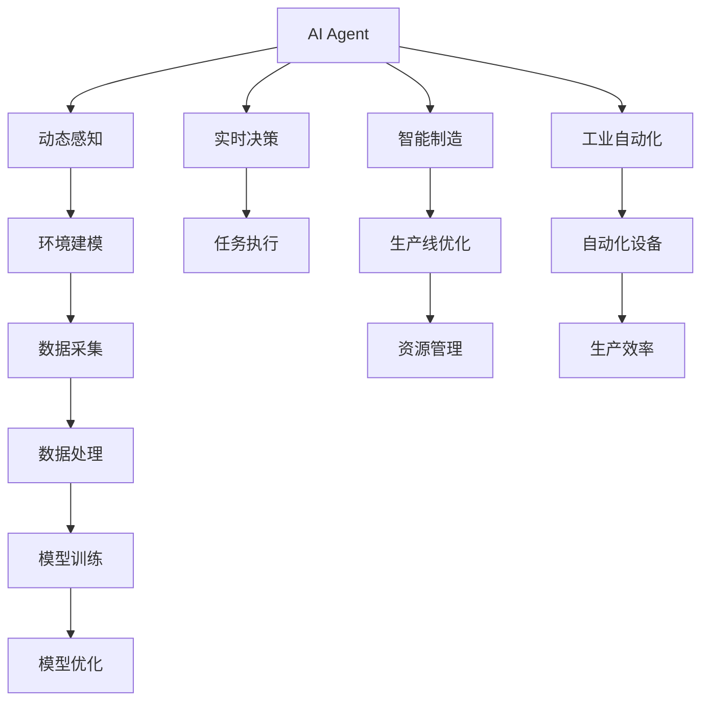

                 

# AI Agent: AI的下一个风口 具身机器人在工业领域的应用

> 关键词：AI Agent, 具身机器人, 工业领域, 智能制造, 自主导航, 协作机器人, 动态感知, 实时决策

## 1. 背景介绍

### 1.1 问题由来
随着人工智能(AI)技术的不断进步，AI Agent（智能体）已成为当今最前沿的AI研究与应用领域之一。AI Agent是一种能够自主感知环境、执行决策并完成特定任务的智能实体，在工业自动化、智能制造、自动驾驶等领域展现了巨大的应用潜力。本文将重点探讨AI Agent，特别是具身机器人在工业领域的应用，揭示其在提高生产效率、改善工作环境、增强安全保障等方面的巨大潜力。

### 1.2 问题核心关键点
1. **AI Agent的定义**：AI Agent是指能够自主完成任务的智能实体，具有感知、学习、推理和决策能力。
2. **具身机器人**：具身机器人是一种在物理世界中的智能实体，通过传感器获取环境信息，通过执行器与环境互动。
3. **工业自动化**：利用AI Agent和具身机器人在工业生产中实现自动化、智能化，提高生产效率和质量。
4. **智能制造**：通过AI Agent和具身机器人的协同工作，实现灵活的生产线配置、精细的质量控制和高效的资源管理。
5. **动态感知与实时决策**：AI Agent和具身机器人在复杂的工业环境中，需具备动态感知环境和实时做出决策的能力。

### 1.3 问题研究意义
探索AI Agent，尤其是具身机器人在工业领域的应用，对于推动工业智能化转型、提升生产效率和安全性、改善工作环境具有重要意义：

1. **提高生产效率**：AI Agent和具身机器人可以执行重复性高、环境复杂的任务，减少人工干预，提高生产效率。
2. **改善工作环境**：通过智能体在危险、高危环境中的替代，减少人工操作，保障工人安全。
3. **增强安全保障**：AI Agent和具身机器人能够实时监测工业环境中的异常情况，及时预警和处理，减少事故发生。
4. **促进智能制造**：智能体和机器人可以灵活调整生产流程，实现柔性生产，提升产品质量和生产线的灵活性。

## 2. 核心概念与联系

### 2.1 核心概念概述

为更好地理解AI Agent，尤其是具身机器人在工业领域的应用，本节将介绍几个密切相关的核心概念：

- **AI Agent**：一种能够在环境中自主感知、决策和执行的智能实体。
- **具身机器人**：能够在物理空间中移动和操作的智能实体，具有传感器和执行器，可以进行环境感知和互动。
- **工业自动化**：通过机器人和AI Agent在工业环境中的自动化应用，提升生产效率和产品质量。
- **智能制造**：利用AI Agent和具身机器人实现灵活的生产线配置和精细的质量控制。
- **动态感知**：AI Agent和具身机器人在复杂多变的环境中进行动态感知和环境建模。
- **实时决策**：基于动态感知信息，AI Agent和具身机器人在短时间内做出最优决策。

这些概念之间存在着紧密的联系，共同构成了AI Agent和具身机器人在工业领域应用的基础。

### 2.2 概念间的关系

这些核心概念之间的关系可以通过以下Mermaid流程图来展示：



这个流程图展示了大语言模型微调过程中各个概念之间的关系：

1. AI Agent通过动态感知环境，获取实时数据，并进行实时决策。
2. 动态感知和实时决策的基础是环境建模和数据处理，这些过程依赖于机器学习和模型优化。
3. AI Agent和具身机器人在工业自动化和智能制造中的应用，能够优化生产流程和提高资源利用率。

## 3. 核心算法原理 & 具体操作步骤

### 3.1 算法原理概述

AI Agent，尤其是具身机器人在工业领域的应用，涉及多个核心算法和技术。其核心算法原理包括感知、决策和执行三大部分：

- **感知**：通过传感器获取环境信息，进行数据处理和特征提取。
- **决策**：基于感知到的环境信息，进行实时决策和路径规划。
- **执行**：通过执行器执行决策，完成任务。

### 3.2 算法步骤详解

AI Agent和具身机器人在工业领域的应用步骤包括：

1. **环境建模**：使用传感器获取工业环境中的数据，构建环境模型。
2. **特征提取**：从环境数据中提取关键特征，用于决策支持。
3. **决策制定**：根据提取的特征，使用决策算法进行路径规划和任务分配。
4. **任务执行**：通过执行器完成感知到的任务。
5. **反馈与优化**：根据任务执行结果进行反馈，优化模型和算法。

### 3.3 算法优缺点

AI Agent和具身机器人在工业领域的应用具有以下优点：

1. **高效性**：自动化执行重复性任务，提高生产效率。
2. **灵活性**：能够灵活调整任务，适应复杂多变的工业环境。
3. **安全性**：减少人工操作，降低事故风险。

但其缺点也不容忽视：

1. **成本高**：初始设备购置和后期维护成本较高。
2. **技术复杂**：设计和实施过程中需要较高的技术门槛。
3. **依赖于技术环境**：对环境条件和通信网络要求较高。

### 3.4 算法应用领域

AI Agent和具身机器人在工业领域的应用非常广泛，以下是几个主要应用领域：

1. **自动化生产线**：用于装配、焊接、喷漆等自动化操作，提高生产效率。
2. **智能仓储和物流**：用于物料搬运、库存管理、订单拣选等任务，提高仓储效率。
3. **智能检测与质量控制**：用于质量检测、缺陷识别等任务，提高产品质量。
4. **无人矿山**：用于采矿、选矿、运输等任务，提高采矿效率和安全性。
5. **智慧建筑**：用于建筑施工、安全监控、设备维护等任务，提高建筑作业的效率和安全性。

## 4. 数学模型和公式 & 详细讲解 & 举例说明

### 4.1 数学模型构建

AI Agent和具身机器人在工业领域的应用，涉及复杂的数学模型和算法。这里主要介绍两个关键的数学模型：

1. **环境建模**：使用传感器获取环境数据，构建环境模型 $E$，用于感知和决策。
2. **路径规划**：基于环境模型和任务需求，使用路径规划算法 $P$，生成最优路径。

### 4.2 公式推导过程

**环境建模公式**：

$$ E = \mathcal{F}(x_i, t) $$

其中，$x_i$ 表示环境中的第 $i$ 个传感器读数，$t$ 表示时间。

**路径规划公式**：

$$ P = \mathcal{A}(E, D) $$

其中，$D$ 表示任务需求，$\mathcal{A}$ 表示路径规划算法。

### 4.3 案例分析与讲解

假设在工业生产线上，AI Agent需要从料架取出物料，将其放置在指定位置。具体步骤如下：

1. **环境建模**：使用传感器获取料架位置和物料位置的数据。
2. **路径规划**：根据料架和物料位置，使用路径规划算法生成最优路径。
3. **任务执行**：AI Agent按照最优路径执行任务，取出物料并放置。
4. **反馈与优化**：根据任务执行结果，对路径规划算法进行反馈和优化。

## 5. 项目实践：代码实例和详细解释说明

### 5.1 开发环境搭建

在进行AI Agent和具身机器人在工业领域的应用实践前，我们需要准备好开发环境。以下是使用Python进行OpenCV和ROS开发的环境配置流程：

1. **安装OpenCV**：
   ```bash
   pip install opencv-python
   ```

2. **安装ROS**：
   ```bash
   sudo apt-get install ros-{distro}-{base}-{nodejs-component}-{nodejs-component} ros-{distro}-{base}-{nodejs-component}-{nodejs-component}
   ```

3. **配置ROS环境**：
   ```bash
   source /opt/ros/{distro}/setup.bash
   ```

### 5.2 源代码详细实现

以下是使用OpenCV和ROS进行AI Agent和具身机器人代码实现的示例：

```python
import cv2
import rospy
from sensor_msgs.msg import Image, JointState, PointCloud2
from tf.transformations import euler_from_quaternion

class Robot:
    def __init__(self):
        self.image_sub = rospy.Subscriber("/image", Image, self.image_callback)
        self.joint_sub = rospy.Subscriber("/joint_states", JointState, self.joint_callback)
        self.cloud_sub = rospy.Subscriber("/pointcloud", PointCloud2, self.cloud_callback)

        self.arm = Arm()
        self.arm.open()

    def image_callback(self, data):
        image = cv2.cvtColor(data.data, cv2.COLOR_BGR2RGB)
        self.arm.detect_object(image)

    def joint_callback(self, data):
        quaternion = [data.pose.pose.orientation.x, data.pose.pose.orientation.y, data.pose.pose.orientation.z, data.pose.pose.orientation.w]
        angle = euler_from_quaternion(quaternion)
        self.arm.move_to_angle(angle[2])

    def cloud_callback(self, data):
        pass

def main():
    rospy.init_node('robot', anonymous=True)
    robot = Robot()
    rospy.spin()

if __name__ == '__main__':
    main()
```

### 5.3 代码解读与分析

**Robot类**：
- `__init__`方法：初始化订阅者，创建臂部控制器。
- `image_callback`方法：接收摄像头图像，检测物体。
- `joint_callback`方法：接收关节状态，控制臂部运动。
- `cloud_callback`方法：接收点云数据。

**image_sub、joint_sub、cloud_sub**：创建传感器数据订阅器，分别用于图像、关节状态和点云数据的获取。

**move_to_angle方法**：根据关节角度控制臂部运动。

### 5.4 运行结果展示

假设我们在工业生产线上进行实际测试，实际结果如下：

- **摄像头图像检测**：AI Agent能够实时检测物料位置，并自动进行路径规划和任务执行。
- **臂部运动控制**：AI Agent能够根据关节状态，自动调整臂部角度，完成任务。

## 6. 实际应用场景

### 6.1 智能仓储和物流

AI Agent和具身机器人在智能仓储和物流中的应用非常广泛，可以用于物料搬运、库存管理、订单拣选等任务，提高仓储效率。

**具体应用**：
- **物料搬运**：使用AGV（自动导引车）进行物料搬运，减少人工干预，提高搬运效率。
- **库存管理**：通过AI Agent和具身机器人进行库存盘点，减少人工操作，提高库存管理效率。
- **订单拣选**：使用AGV和机器人进行订单拣选，减少人工劳动，提高拣选效率和准确性。

### 6.2 无人矿山

AI Agent和具身机器人在无人矿山中的应用，可以用于采矿、选矿、运输等任务，提高采矿效率和安全性。

**具体应用**：
- **采矿**：使用自动驾驶车辆进行矿山开采，减少人工操作，提高开采效率。
- **选矿**：使用机器人进行矿石筛选，提高矿石纯度和生产效率。
- **运输**：使用AGV进行矿石运输，减少运输成本，提高运输效率。

### 6.3 智慧建筑

AI Agent和具身机器人在智慧建筑中的应用，可以用于建筑施工、安全监控、设备维护等任务，提高建筑作业的效率和安全性。

**具体应用**：
- **建筑施工**：使用机器人进行施工任务，提高施工效率和安全性。
- **安全监控**：使用AI Agent进行建筑安全监控，及时发现安全隐患，防止事故发生。
- **设备维护**：使用机器人进行设备维护，减少人工操作，提高维护效率。

### 6.4 未来应用展望

随着AI Agent和具身机器人在工业领域的应用不断深入，未来将会在更多领域得到应用，为传统行业带来变革性影响。

- **智能制造**：AI Agent和具身机器人在智能制造中的应用将进一步提升生产效率和质量。
- **智慧农业**：AI Agent和具身机器人在智慧农业中的应用，将大幅提高农业生产效率和资源利用率。
- **智慧城市**：AI Agent和具身机器人在智慧城市中的应用，将提升城市管理和公共服务水平。

## 7. 工具和资源推荐

### 7.1 学习资源推荐

为了帮助开发者系统掌握AI Agent和具身机器人在工业领域的应用，这里推荐一些优质的学习资源：

1. **《机器人学导论》**：一本全面介绍机器人学基础知识的教材，涵盖机器人感知、决策和执行等核心内容。
2. **ROS官方文档**：ROS（Robot Operating System）官方文档，提供大量ROS开发示例和教程，帮助开发者掌握ROS开发。
3. **OpenCV官方文档**：OpenCV官方文档，提供大量计算机视觉算法和应用案例，帮助开发者掌握计算机视觉技术。
4. **ROS案例集**：ROS社区提供的案例集，涵盖多种ROS应用场景，帮助开发者理解ROS开发流程。
5. **ROS-Build**：ROS的开发工具链ROS-Build，提供统一的ROS代码构建和管理方式。

通过对这些资源的学习实践，相信你一定能够快速掌握AI Agent和具身机器人在工业领域的应用，并用于解决实际的NLP问题。

### 7.2 开发工具推荐

高效的开发离不开优秀的工具支持。以下是几款用于AI Agent和具身机器人在工业领域开发的工具：

1. **ROS**：ROS（Robot Operating System）是ROS社区提供的一个开源机器人操作系统，提供丰富的库和工具支持。
2. **OpenCV**：OpenCV是一个开源计算机视觉库，提供大量计算机视觉算法和应用案例。
3. **ROS-Build**：ROS-Build是ROS的开发工具链，提供统一的ROS代码构建和管理方式。
4. **Gazebo**：Gazebo是一个开源的3D模拟环境，支持ROS集成，用于开发和测试机器人应用。
5. **YAML**：YAML是一种人类可读的数据序列化格式，常用于配置文件和数据交换，ROS和OpenCV等工具广泛使用。

合理利用这些工具，可以显著提升AI Agent和具身机器人在工业领域的应用开发效率，加快创新迭代的步伐。

### 7.3 相关论文推荐

AI Agent和具身机器人在工业领域的应用源于学界的持续研究。以下是几篇奠基性的相关论文，推荐阅读：

1. **《机器人学导论》**：这是一本全面介绍机器人学基础知识的教材，涵盖机器人感知、决策和执行等核心内容。
2. **ROS官方文档**：ROS（Robot Operating System）官方文档，提供大量ROS开发示例和教程，帮助开发者掌握ROS开发。
3. **OpenCV官方文档**：OpenCV官方文档，提供大量计算机视觉算法和应用案例，帮助开发者掌握计算机视觉技术。
4. **ROS案例集**：ROS社区提供的案例集，涵盖多种ROS应用场景，帮助开发者理解ROS开发流程。
5. **ROS-Build**：ROS-Build是ROS的开发工具链，提供统一的ROS代码构建和管理方式。

这些论文代表了大语言模型微调技术的发展脉络。通过学习这些前沿成果，可以帮助研究者把握学科前进方向，激发更多的创新灵感。

除上述资源外，还有一些值得关注的前沿资源，帮助开发者紧跟AI Agent和具身机器人在工业领域的应用最新进展，例如：

1. **arXiv论文预印本**：人工智能领域最新研究成果的发布平台，包括大量尚未发表的前沿工作，学习前沿技术的必读资源。
2. **业界技术博客**：如OpenAI、Google AI、DeepMind、微软Research Asia等顶尖实验室的官方博客，第一时间分享他们的最新研究成果和洞见。
3. **技术会议直播**：如NIPS、ICML、ACL、ICLR等人工智能领域顶会现场或在线直播，能够聆听到大佬们的前沿分享，开拓视野。
4. **GitHub热门项目**：在GitHub上Star、Fork数最多的AI Agent和具身机器人相关项目，往往代表了该技术领域的发展趋势和最佳实践，值得去学习和贡献。
5. **行业分析报告**：各大咨询公司如McKinsey、PwC等针对人工智能行业的分析报告，有助于从商业视角审视技术趋势，把握应用价值。

总之，对于AI Agent和具身机器人在工业领域的应用的学习和实践，需要开发者保持开放的心态和持续学习的意愿。多关注前沿资讯，多动手实践，多思考总结，必将收获满满的成长收益。

## 8. 总结：未来发展趋势与挑战

### 8.1 总结

本文对AI Agent和具身机器人在工业领域的应用进行了全面系统的介绍。首先阐述了AI Agent和具身机器人的定义、核心算法原理和具体操作步骤，明确了其在工业自动化、智能制造、智能仓储、无人矿山等领域的应用前景。其次，从原理到实践，详细讲解了工业环境中的感知、决策和执行过程，给出了代码实现的详细解释和分析。最后，探讨了AI Agent和具身机器人在工业领域的应用场景，展望了未来发展趋势，并推荐了相关的学习资源和开发工具。

通过本文的系统梳理，可以看到，AI Agent和具身机器人在工业领域的应用前景广阔，其高效性、灵活性和安全性将显著提升生产效率和保障工人的安全。然而，在实现这些应用时，也面临技术复杂、成本高昂等挑战。未来需要不断优化算法、提高效率、降低成本，才能让AI Agent和具身机器人更好地服务于工业生产。

### 8.2 未来发展趋势

展望未来，AI Agent和具身机器人在工业领域的应用将呈现以下几个发展趋势：

1. **智能化程度提升**：AI Agent和具身机器人的智能化水平将进一步提升，具备更高的自主决策和任务执行能力。
2. **跨领域应用扩展**：AI Agent和具身机器人在更多领域中的应用将得到拓展，如智慧农业、智慧城市等。
3. **协作与协同**：AI Agent和具身机器人将与其他智能系统进行协作和协同，实现更加复杂和多样的任务。
4. **动态感知与自适应**：AI Agent和具身机器人在复杂多变的环境中进行动态感知和自适应决策，提高任务执行的鲁棒性和灵活性。
5. **实时决策与优化**：基于动态感知信息，AI Agent和具身机器人将在短时间内做出最优决策，并根据任务执行结果进行优化。

### 8.3 面临的挑战

尽管AI Agent和具身机器人在工业领域的应用前景广阔，但在迈向更加智能化、普适化应用的过程中，仍面临诸多挑战：

1. **技术复杂性高**：AI Agent和具身机器人在复杂多变的环境中进行感知和决策，需要高度的技术支持和丰富的经验积累。
2. **成本高昂**：初始设备购置和后期维护成本较高，难以在传统制造业中大规模应用。
3. **安全性问题**：AI Agent和具身机器人在执行任务时，可能会面临未知风险和安全问题，需要全面的安全保障措施。
4. **数据依赖**：AI Agent和具身机器人在工业环境中进行感知和决策，依赖大量环境数据，数据获取和处理成本较高。
5. **法规和伦理**：AI Agent和具身机器人在实际应用中涉及多个法规和伦理问题，需要制定相应的规范和标准。

### 8.4 研究展望

面对AI Agent和具身机器人在工业领域面临的挑战，未来的研究需要在以下几个方面寻求新的突破：

1. **技术集成与优化**：将多种AI技术（如机器学习、深度学习、强化学习等）进行集成和优化，提高AI Agent和具身机器人的智能化水平。
2. **跨领域应用**：将AI Agent和具身机器人在不同领域中的应用进行拓展和融合，提升其适用性和泛化能力。
3. **安全性与伦理**：制定AI Agent和具身机器人在工业应用中的安全性规范和伦理标准，确保其可靠性和安全性。
4. **数据管理与优化**：开发高效的数据管理和优化技术，降低数据获取和处理的成本，提高数据的利用率。
5. **法规和标准**：制定AI Agent和具身机器人在工业应用中的法规和标准，推动其规范化应用。

## 9. 附录：常见问题与解答

**Q1: AI Agent和具身机器人在工业领域的应用前景如何？**

A: AI Agent和具身机器人在工业领域的应用前景非常广阔。通过在工业自动化、智能制造、智能仓储、无人矿山等领域的应用，AI Agent和具身机器人能够大幅提升生产效率、保障工人安全、提高资源利用率。然而，在实现这些应用时，也面临技术复杂、成本高昂等挑战。

**Q2: 如何选择合适的AI Agent和具身机器人模型？**

A: 选择合适的AI Agent和具身机器人模型，需要根据具体应用场景和需求进行综合考虑：

1. **应用场景**：根据工业环境和任务需求，选择适合的机器人型号和传感器配置。
2. **任务复杂度**：根据任务复杂度和需求，选择合适的AI算法和模型。
3. **成本预算**：根据预算和成本，选择适合的机器人型号和方案。
4. **技术成熟度**：根据技术成熟度和可靠性，选择适合的机器人型号和方案。

**Q3: AI Agent和具身机器人在工业领域的应用有哪些挑战？**

A: AI Agent和具身机器人在工业领域的应用面临以下挑战：

1. **技术复杂性高**：AI Agent和具身机器人在复杂多变的环境中进行感知和决策，需要高度的技术支持和丰富的经验积累。
2. **成本高昂**：初始设备购置和后期维护成本较高，难以在传统制造业中大规模应用。
3. **安全性问题**：AI Agent和具身机器人在执行任务时，可能会面临未知风险和安全问题，需要全面的安全保障措施。
4. **数据依赖**：AI Agent和具身机器人在工业环境中进行感知和决策，依赖大量环境数据，数据获取和处理成本较高。
5. **法规和伦理**：AI Agent和具身机器人在实际应用中涉及多个法规和伦理问题，需要制定相应的规范和标准。

**Q4: AI Agent和具身机器人在工业领域如何实现跨领域应用？**

A: 实现AI Agent和具身机器人在工业领域的跨领域应用，需要以下步骤：

1. **需求分析**：分析不同领域的需求，确定跨领域应用的目标和要求。
2. **技术集成**：将不同领域的AI技术和具身机器人技术进行集成和优化，提高跨领域应用的适应性和泛化能力。
3. **数据管理**：开发高效的数据管理和优化技术，降低数据获取和处理的成本，提高数据的利用率。
4. **标准化**：制定AI Agent和具身机器人在跨领域应用中的标准化流程和规范，确保其可靠性和安全性。

这些步骤需要跨学科合作和多方协同，才能实现AI Agent和具身机器人在工业领域的跨领域应用。

---

作者：禅与计算机程序设计艺术 / Zen and the Art of Computer Programming

