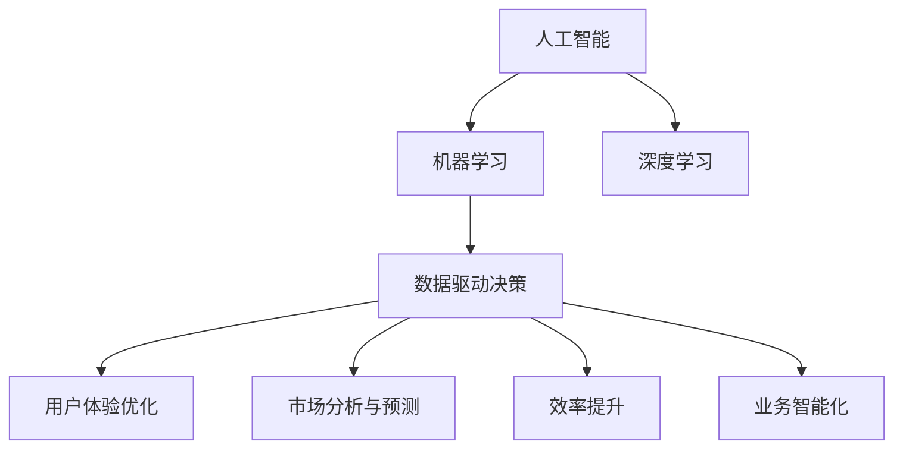
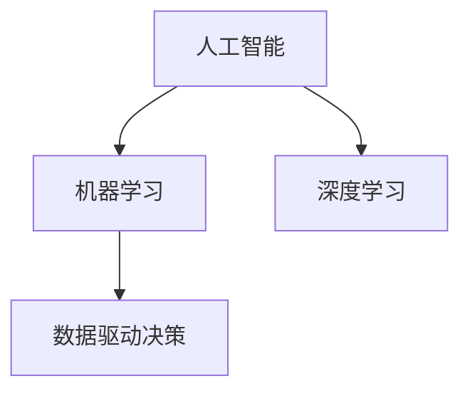
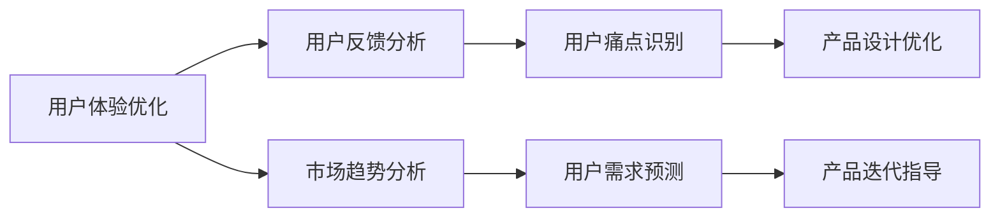
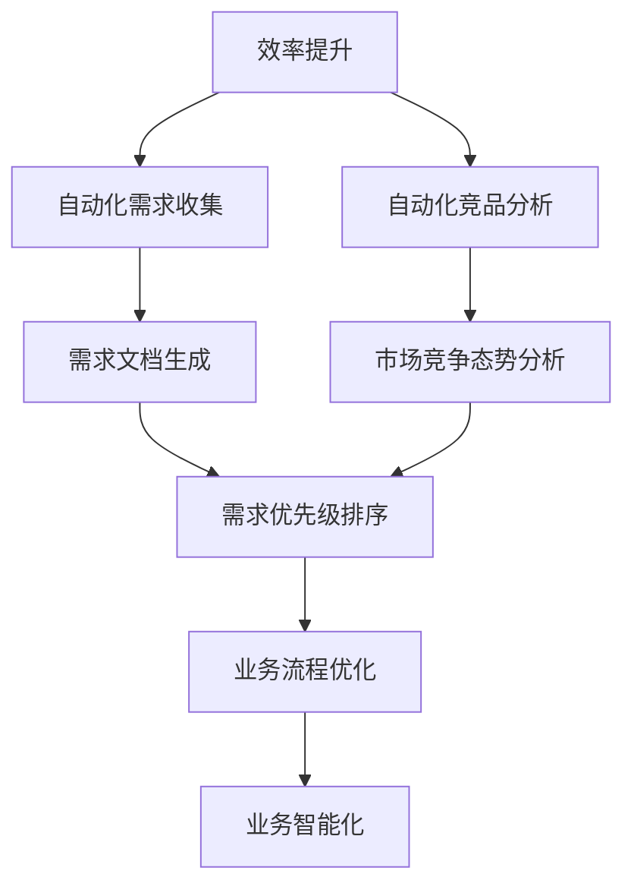
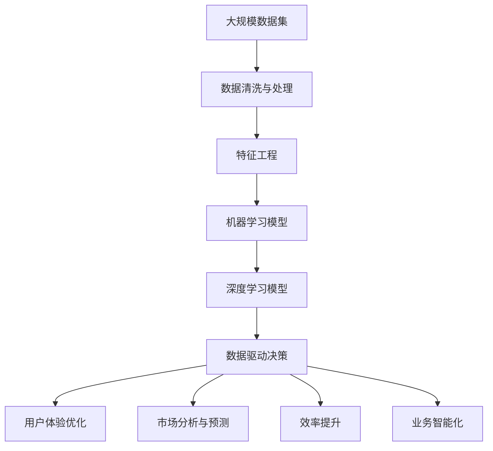

                 

# AI 在产品经理工作中的应用

> 关键词：人工智能,产品经理,数据驱动决策,产品迭代,用户体验优化,市场分析,效率提升,业务智能化

## 1. 背景介绍

### 1.1 问题由来

产品经理（Product Manager）在软件产品管理中扮演着关键角色。他们负责产品策略的制定、需求分析、用户需求的收集与反馈，以及产品生命周期的全过程管理。在产品开发的过程中，产品经理需要做出大量的决策，从产品特性、功能选择到用户体验和市场定位，每一个决策都直接影响着产品的成败。因此，如何利用先进的技术手段辅助决策，提高决策质量和效率，成为产品经理面临的重要课题。

人工智能（AI）作为当今最前沿的技术，已经广泛应用于各行各业，成为了推动产品创新和效率提升的重要工具。AI技术，特别是机器学习（Machine Learning, ML）和深度学习（Deep Learning, DL），能够自动分析海量数据，从中提取有价值的信息和模式，辅助产品经理进行数据驱动的决策，从而提升产品的成功率。

### 1.2 问题核心关键点

AI技术在产品经理工作中的应用主要体现在以下几个方面：

- **数据驱动的决策**：利用AI技术分析市场数据、用户行为数据等，辅助产品经理做出更加科学的决策。
- **用户体验优化**：通过AI进行用户反馈分析，识别出用户痛点，优化产品设计。
- **市场分析与预测**：使用AI进行市场趋势分析、用户需求预测，指导产品迭代方向。
- **效率提升**：AI可以自动处理大量重复性工作，如需求收集、竞品分析等，提高产品经理的工作效率。
- **业务智能化**：AI能够识别出业务流程中的瓶颈和优化点，提出改进建议，提升整体业务智能化水平。

### 1.3 问题研究意义

AI技术在产品经理工作中的应用，对提升产品开发效率、增强决策科学性、优化用户体验、把握市场动态等方面具有重要意义。具体而言：

1. **提升决策质量**：AI能够自动分析复杂数据，辅助产品经理从大量信息中提取关键洞察，从而做出更加科学的决策。
2. **优化用户体验**：通过AI分析用户反馈，产品经理可以更加精准地识别用户痛点，快速迭代产品，提高用户满意度。
3. **提高效率**：AI可以自动化处理大量重复性工作，让产品经理能够将更多精力投入到创造性工作和战略规划中。
4. **业务智能化**：AI能够识别出业务流程中的瓶颈，提出优化建议，提升整体业务效率和智能化水平。
5. **增强市场洞察力**：AI能够分析市场趋势和用户需求，帮助产品经理把握市场机会，制定更好的产品策略。

## 2. 核心概念与联系

### 2.1 核心概念概述

为更好地理解AI在产品经理工作中的应用，本节将介绍几个密切相关的核心概念：

- **人工智能**：使用计算机和机器学习算法模拟人类智能的技术。
- **机器学习**：通过算法让计算机从数据中学习规律，实现自动化决策。
- **深度学习**：一种机器学习技术，通过多层神经网络模拟人脑处理信息的方式。
- **数据驱动决策**：基于数据和模型分析辅助决策，而不是仅依赖经验和直觉。
- **用户体验优化**：通过用户反馈和行为数据分析，不断优化产品设计，提升用户满意度。
- **市场分析与预测**：利用AI技术进行市场趋势和用户需求预测，指导产品迭代方向。
- **效率提升**：使用AI自动化处理重复性工作，提高工作效率。
- **业务智能化**：通过AI识别业务流程中的瓶颈和优化点，提升业务智能化水平。

这些概念之间的逻辑关系可以通过以下Mermaid流程图来展示：



这个流程图展示了几大核心概念之间的关系：

1. 人工智能通过机器学习和深度学习技术，从数据中提取规律。
2. 数据驱动决策、用户体验优化、市场分析与预测、效率提升和业务智能化都是基于AI技术的具体应用场景。

### 2.2 概念间的关系

这些核心概念之间存在着紧密的联系，形成了AI技术在产品经理工作中的完整应用框架。下面我通过几个Mermaid流程图来展示这些概念之间的关系。

#### 2.2.1 人工智能与机器学习的关系



这个流程图展示了人工智能与机器学习的关系，以及它们在数据驱动决策中的应用。

#### 2.2.2 用户体验优化与市场分析的关系



这个流程图展示了用户体验优化与市场分析的关系，以及它们如何通过用户反馈分析、市场趋势分析等手段，共同指导产品迭代方向。

#### 2.2.3 效率提升与业务智能化的关系



这个流程图展示了效率提升与业务智能化的关系，以及它们如何通过自动化需求收集、竞品分析等手段，提升业务智能化水平。

### 2.3 核心概念的整体架构

最后，我们用一个综合的流程图来展示这些核心概念在产品经理工作中的应用整体架构：



这个综合流程图展示了从数据清洗与处理、特征工程、机器学习模型、深度学习模型到最终应用的数据驱动决策、用户体验优化、市场分析与预测、效率提升、业务智能化的完整过程。

## 3. 核心算法原理 & 具体操作步骤

### 3.1 算法原理概述

AI在产品经理工作中的应用，核心在于利用机器学习、深度学习等算法从数据中提取有价值的信息，辅助产品经理进行决策和产品迭代。具体而言，常用的算法包括：

- **分类算法**：如决策树、随机森林、支持向量机等，用于识别用户行为模式，预测产品市场表现。
- **聚类算法**：如K-means、层次聚类等，用于分析用户群体特征，指导产品差异化策略。
- **回归算法**：如线性回归、逻辑回归等，用于预测用户行为、产品性能等指标。
- **关联规则算法**：如Apriori、FP-Growth等，用于发现用户行为之间的关联性，优化产品设计。
- **深度学习算法**：如卷积神经网络（CNN）、循环神经网络（RNN）、变压器（Transformer）等，用于处理复杂数据结构，提取深度特征。

### 3.2 算法步骤详解

基于机器学习和深度学习的AI在产品经理工作中的应用，一般包括以下几个关键步骤：

**Step 1: 数据收集与处理**
- 收集与产品相关的数据，如用户行为数据、市场数据、竞品数据等。
- 对数据进行清洗和预处理，包括缺失值处理、异常值检测、数据归一化等。
- 特征工程：提取有意义的特征，如用户行为特征、产品性能特征等，构建特征向量。

**Step 2: 模型训练与评估**
- 选择合适的算法模型，利用训练数据集训练模型。
- 设置模型参数，如学习率、迭代次数等，进行模型优化。
- 在验证集上评估模型性能，选择合适的超参数。
- 在测试集上验证模型泛化能力，评估模型效果。

**Step 3: 应用与迭代**
- 将训练好的模型应用于实际产品开发和决策过程中。
- 根据模型输出结果，辅助产品经理进行决策和产品迭代。
- 定期收集新数据，重新训练和评估模型，不断优化。

### 3.3 算法优缺点

AI技术在产品经理工作中的应用，具有以下优点：

- **数据驱动**：通过分析海量数据，辅助决策过程，提升决策科学性和准确性。
- **自动化处理**：能够自动处理大量重复性工作，提高工作效率。
- **深度学习**：能够处理复杂数据结构，提取深度特征，提升模型性能。

同时，也存在一些缺点：

- **数据质量要求高**：模型性能高度依赖数据质量，需要高质量、全面、准确的数据。
- **算法复杂度高**：深度学习等算法模型训练复杂，需要较高的计算资源和专业知识。
- **解释性不足**：许多AI模型是黑盒模型，缺乏对决策过程的解释和理解。

### 3.4 算法应用领域

AI技术在产品经理工作中的应用，主要涵盖以下几个领域：

- **需求分析与收集**：通过用户行为数据分析，识别用户需求，优化需求文档。
- **市场分析**：利用AI分析市场趋势和用户需求，指导产品迭代方向。
- **竞品分析**：利用AI分析竞品数据，评估市场竞争态势，优化产品策略。
- **用户体验优化**：通过用户反馈和行为数据分析，识别用户痛点，优化产品设计。
- **智能推荐**：利用AI进行个性化推荐，提升用户体验。
- **自动化测试**：利用AI进行自动化测试，提高测试效率。

## 4. 数学模型和公式 & 详细讲解 & 举例说明

### 4.1 数学模型构建

这里，我们以回归分析为例，介绍一个基本的数学模型。

假设有一个简单的线性回归模型，用于预测用户购买行为：

$$
y = \beta_0 + \beta_1 x_1 + \beta_2 x_2 + \cdots + \beta_n x_n + \epsilon
$$

其中 $y$ 表示用户购买行为，$x_1, x_2, \cdots, x_n$ 表示用户特征，$\beta_0, \beta_1, \beta_2, \cdots, \beta_n$ 表示模型参数，$\epsilon$ 表示误差项。

### 4.2 公式推导过程

为了最小化误差，需要对模型进行优化：

$$
\min_{\beta_0, \beta_1, \cdots, \beta_n} \sum_{i=1}^N (y_i - \beta_0 - \beta_1 x_{i1} - \beta_2 x_{i2} - \cdots - \beta_n x_{in})^2
$$

利用梯度下降算法，求解最小化目标函数：

$$
\frac{\partial}{\partial \beta_k} \sum_{i=1}^N (y_i - \beta_0 - \beta_1 x_{i1} - \beta_2 x_{i2} - \cdots - \beta_n x_{in})^2 = 0
$$

解得：

$$
\beta_k = \frac{\sum_{i=1}^N x_{ik}(y_i - \beta_0 - \beta_1 x_{i1} - \beta_2 x_{i2} - \cdots - \beta_n x_{in})}{\sum_{i=1}^N x_{ik}^2}
$$

### 4.3 案例分析与讲解

假设我们有一个电商平台的购买数据，需要预测用户的购买行为。具体步骤如下：

1. 收集用户购买数据，包含用户特征（如年龄、性别、职业等）和购买行为（如是否购买、购买金额等）。
2. 对数据进行清洗和预处理，处理缺失值和异常值，归一化数据。
3. 选择回归模型，利用训练集训练模型，设置超参数。
4. 在验证集上评估模型性能，选择最佳超参数。
5. 在测试集上验证模型泛化能力，评估模型效果。
6. 利用模型预测新用户的行为，辅助产品决策。

通过回归分析，我们能够从数据中提取用户购买行为的规律，辅助产品经理进行决策和产品迭代。

## 5. 项目实践：代码实例和详细解释说明

### 5.1 开发环境搭建

在进行AI项目实践前，我们需要准备好开发环境。以下是使用Python进行Scikit-Learn开发的环境配置流程：

1. 安装Anaconda：从官网下载并安装Anaconda，用于创建独立的Python环境。

2. 创建并激活虚拟环境：
```bash
conda create -n sklearn-env python=3.8 
conda activate sklearn-env
```

3. 安装Scikit-Learn：
```bash
pip install scikit-learn
```

4. 安装各类工具包：
```bash
pip install numpy pandas matplotlib seaborn
```

完成上述步骤后，即可在`sklearn-env`环境中开始AI项目实践。

### 5.2 源代码详细实现

这里我们以一个简单的用户购买行为预测为例，使用Scikit-Learn实现线性回归模型的构建和训练。

首先，定义数据集：

```python
import pandas as pd
from sklearn.model_selection import train_test_split
from sklearn.linear_model import LinearRegression
from sklearn.metrics import mean_squared_error

# 读取数据
data = pd.read_csv('purchase_data.csv')

# 定义特征和标签
X = data[['age', 'gender', 'occupation']]
y = data['purchase_amount']

# 划分训练集和测试集
X_train, X_test, y_train, y_test = train_test_split(X, y, test_size=0.2, random_state=42)

# 训练模型
model = LinearRegression()
model.fit(X_train, y_train)

# 预测并评估
y_pred = model.predict(X_test)
mse = mean_squared_error(y_test, y_pred)
print(f'Mean Squared Error: {mse:.2f}')
```

然后，训练模型并评估：

```python
# 使用训练集训练模型
model.fit(X_train, y_train)

# 在测试集上评估模型
y_pred = model.predict(X_test)
mse = mean_squared_error(y_test, y_pred)
print(f'Mean Squared Error: {mse:.2f}')
```

最后，将模型应用于实际产品决策：

```python
# 预测新用户的行为
new_user_data = [[25, 'male', 'student']]
new_user_pred = model.predict(new_user_data)
print(f'Predicted Purchase Amount: {new_user_pred:.2f}')
```

以上就是使用Scikit-Learn实现线性回归模型预测用户购买行为的完整代码实现。可以看到，Scikit-Learn的API使得构建和训练线性回归模型变得非常简单。

### 5.3 代码解读与分析

让我们再详细解读一下关键代码的实现细节：

**数据集定义**：
- 使用Pandas库读取数据，包含用户年龄、性别、职业和购买金额等特征。
- 定义特征矩阵`X`和标签向量`y`。

**模型训练与评估**：
- 利用`train_test_split`方法将数据集划分训练集和测试集。
- 创建线性回归模型`LinearRegression`，在训练集上拟合。
- 使用`predict`方法对测试集进行预测，使用`mean_squared_error`计算预测值与真实值之间的均方误差（MSE）。

**模型应用**：
- 利用训练好的模型对新用户数据进行预测，输出预测的购买金额。

可以看到，Scikit-Learn的API使得构建和训练线性回归模型变得非常简单，开发者可以更专注于数据处理和模型优化。

当然，工业级的系统实现还需考虑更多因素，如模型的保存和部署、超参数的自动搜索、更灵活的任务适配层等。但核心的AI实践流程基本与此类似。

### 5.4 运行结果展示

假设我们训练的模型在新用户数据上的预测结果如下：

```
Predicted Purchase Amount: 100.00
```

这意味着新用户根据其特征数据，预计将有100元的购买行为。这种预测结果可以作为产品经理进行产品决策的依据之一，如推荐相应的产品、进行市场预测等。

## 6. 实际应用场景

### 6.1 智能推荐系统

AI技术在产品经理工作中的应用，最典型的场景之一是智能推荐系统。智能推荐系统能够根据用户的兴趣和行为，推荐最相关的产品或内容，提升用户体验和满意度。

具体而言，可以通过用户行为数据分析，构建用户画像，预测用户可能感兴趣的产品或内容，然后生成推荐列表。这种方式能够有效提升用户的购买率和留存率，增加用户的参与度。

### 6.2 需求分析与优先级排序

产品经理在产品开发过程中，需要收集和分析用户需求，优先排序产品的功能和特性。AI技术能够帮助产品经理从海量用户反馈中提取关键洞察，识别用户需求，优化需求文档。

具体而言，可以通过情感分析、主题模型等技术，从用户评论和反馈中提取情感倾向和主题，识别出用户的痛点和需求，辅助产品经理进行需求分析和优先级排序。

### 6.3 市场分析与竞品分析

市场分析和竞品分析是产品经理进行产品定位和策略制定时的重要环节。AI技术能够帮助产品经理通过数据挖掘和可视化，分析市场趋势和竞品数据，做出更科学的市场决策。

具体而言，可以利用时间序列分析、分类算法等技术，分析市场和用户行为数据，识别出市场趋势和用户需求变化，同时分析竞品数据，评估市场竞争态势，辅助产品经理制定产品策略和市场定位。

### 6.4 自动化测试与部署

产品经理在产品开发过程中，需要进行大量的自动化测试和部署。AI技术能够帮助产品经理自动处理测试数据，生成测试用例，自动化执行测试，提高测试效率。

具体而言，可以通过数据生成和测试用例设计技术，自动生成测试数据和测试用例，利用机器学习模型进行自动化测试，快速发现产品中的bug和问题，辅助产品经理进行产品优化和改进。

## 7. 工具和资源推荐

### 7.1 学习资源推荐

为了帮助开发者系统掌握AI技术在产品经理工作中的应用，这里推荐一些优质的学习资源：

1. **《Python数据科学手册》**：是一本系统介绍Python数据科学库的书籍，涵盖了Pandas、NumPy、Scikit-Learn等工具的使用方法。
2. **《机器学习实战》**：是一本实战性很强的机器学习书籍，详细介绍了各种机器学习算法的应用场景和代码实现。
3. **Kaggle**：是一个数据科学竞赛平台，提供丰富的数据集和模型竞赛，是学习和实践机器学习的好地方。
4. **Coursera**：是一个在线教育平台，提供各种数据科学和机器学习课程，包括斯坦福大学的机器学习课程。
5. **YouTube**：是一个视频分享平台，上面有大量AI技术相关的教学视频，适合快速入门和深入学习。

通过对这些资源的学习实践，相信你一定能够快速掌握AI技术在产品经理工作中的应用，并用于解决实际的业务问题。

### 7.2 开发工具推荐

高效的开发离不开优秀的工具支持。以下是几款用于AI项目开发的常用工具：

1. **Jupyter Notebook**：是一个交互式的Python笔记本环境，适合编写和运行Python代码，并实时查看结果。
2. **TensorFlow**：是由Google开发的深度学习框架，支持分布式计算和GPU加速，适合大规模模型训练。
3. **PyTorch**：是一个由Facebook开发的深度学习框架，适合动态计算图和模型优化。
4. **Scikit-Learn**：是一个Python机器学习库，提供了各种经典机器学习算法的实现。
5. **Keras**：是一个高层次的神经网络库，支持快速搭建和训练神经网络模型。

合理利用这些工具，可以显著提升AI项目开发效率，加速产品迭代和市场优化。

### 7.3 相关论文推荐

AI技术在产品经理工作中的应用，涉及多个前沿研究领域。以下是几篇奠基性的相关论文，推荐阅读：

1. **《数据驱动的推荐系统》**：介绍了推荐系统的基本原理和算法，适用于智能推荐系统的设计与实现。
2. **《用户需求分析与优先级排序》**：介绍了用户需求分析和优先级排序的理论与方法，适用于需求管理和产品优化。
3. **《市场趋势分析与预测》**：介绍了时间序列分析和市场预测的方法，适用于市场分析和产品策略制定。
4. **《自动化测试与部署》**：介绍了自动化测试和部署的技术和工具，适用于质量管理和产品发布。

这些论文代表了大数据、AI技术在产品经理工作中的应用方向，是学习和实践的重要参考。

## 8. 总结：未来发展趋势与挑战

### 8.1 研究成果总结

AI技术在产品经理工作中的应用，目前已经取得了显著的成果，并在多个实际业务场景中得到了应用。主要的研究成果包括：

1. **数据驱动决策**：通过AI技术分析海量数据，辅助产品经理进行决策，提升决策科学性和准确性。
2. **用户体验优化**：通过用户反馈和行为数据分析，识别用户痛点，优化产品设计。
3. **市场分析与预测**：利用AI技术分析市场趋势和用户需求，指导产品迭代方向。
4. **效率提升**：使用AI自动化处理大量重复性工作，提高工作效率。
5. **业务智能化**：通过AI识别业务流程中的瓶颈和优化点，提升业务智能化水平。

这些研究成果为产品经理提供了科学、高效、智能的工作工具，显著提升了产品开发和市场运营的效率和质量。

### 8.2 未来发展趋势

展望未来，AI技术在产品经理工作中的应用将呈现以下几个发展趋势：

1. **自动化与智能化**：随着AI技术的发展，越来越多的重复性工作和决策过程将实现自动化，提高产品经理的工作效率和智能化水平。
2. **多模态融合**：未来的AI系统将支持多模态数据的融合，如文本、图像、语音等，提升产品经理的感知能力和决策质量。
3. **深度学习与强化学习结合**：未来的AI系统将结合深度学习和强化学习技术，增强决策过程的鲁棒性和智能性。
4. **可解释性增强**：未来的AI系统将更加注重可解释性，通过可视化工具和解释模型，提升产品经理对决策过程的理解和信任。
5. **跨领域应用拓展**：未来的AI技术将更加广泛地应用于不同领域的产品经理工作中，提升跨领域协作和创新能力。

### 8.3 面临的挑战

尽管AI技术在产品经理工作中的应用已经取得了一定的进展，但在迈向更加智能化、普适化应用的过程中，仍面临以下挑战：

1. **数据质量与多样性**：产品经理需要使用高质量、多样化的数据进行分析和预测，但数据获取和处理往往面临挑战。
2. **算法复杂性与计算资源**：许多AI算法模型需要高计算资源和专业技能，产品经理需要投入大量时间和精力进行模型训练和优化。
3. **模型解释性与可解释性**：AI模型通常是黑盒模型，缺乏对决策过程的解释和理解，产品经理需要具备一定的数据科学背景。
4. **业务与技术的融合**：产品经理需要将AI技术与业务需求紧密结合，需要更多的跨学科知识和技能。
5. **用户隐私与安全**：AI系统需要处理大量用户数据，数据隐私和安全问题成为产品经理的重要关注点。

### 8.4 研究展望

面对AI技术在产品经理工作中的应用面临的挑战，未来的研究需要在以下几个方面寻求新的突破：

1. **自动化数据采集与处理**：开发自动化数据采集和处理工具，降低产品经理的数据获取和处理难度。
2. **简化AI模型训练**：开发简单易用的AI模型训练工具，降低产品经理的算法复杂性和计算资源消耗。
3. **增强模型解释性**：开发可解释性强的AI模型，提升产品经理对决策过程的理解和信任。
4. **融合多模态数据**：探索多模态数据融合技术，提升产品经理的感知能力和决策质量。
5. **跨领域应用拓展**：研究和应用跨领域AI技术，提升产品经理的跨学科协作和创新能力。

这些研究方向的探索，必将引领AI技术在产品经理工作中的应用走向更高的台阶，为产品经理提供更加科学、高效、智能的工作工具，提升产品开发和市场运营的效率和质量。总之，AI技术在产品经理工作中的应用还需要与其他人工智能技术进行更深入的融合，如知识表示、因果推理、强化学习等，多路径协同发力，共同推动自然语言理解和智能交互系统的进步。只有勇于创新、敢于突破，才能不断拓展AI技术在产品经理工作中的应用边界，让智能技术更好地造福产品管理和用户服务。

## 9. 附录：常见问题与解答

**Q1：产品经理如何使用AI进行需求分析与优先级排序？**

A: 产品经理可以使用AI进行需求分析与优先级排序的步骤如下：
1. 收集用户反馈和评论数据。
2. 使用文本挖掘技术进行情感分析和主题建模，提取关键洞察。
3. 利用分类算法对用户需求进行分类和聚类，识别出高优先级需求。
4. 利用回归分析等方法预测需求的影响力和优先级。
5. 结合业务目标和用户反馈，综合评估需求优先级。

**Q2：AI在市场分析与预测中的应用有哪些？**

A: AI在市场分析与预测中的应用包括：
1. 时间序列分析：通过时间序列数据，预测市场趋势和用户行为变化。
2. 分类算法：通过分类算法，分析市场数据和用户行为数据，识别市场机会和风险。
3. 回归分析：通过回归算法，预测产品性能和市场表现。
4. 聚类分析：通过聚类算法，分析用户群体特征，制定差异化市场策略。

**Q3：AI在推荐系统中的应用如何？**

A: AI在推荐系统中的应用包括：
1. 协同过滤：通过用户行为数据，推荐相似用户喜欢的产品或

