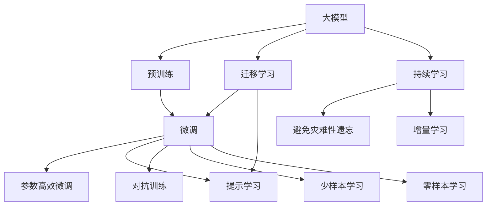

                 

# AI 大模型创业：如何利用市场优势？

## 1. 背景介绍

随着人工智能技术的不断发展，大模型（Large Models）在商业化应用中日益受到关注。大模型是指在特定领域中应用广泛、参数量巨大的神经网络模型，如BERT、GPT-3、DALL-E等。这些大模型通过在大规模数据集上进行预训练，具备强大的泛化能力和适应性，能够广泛应用于自然语言处理（NLP）、计算机视觉（CV）、生成对抗网络（GAN）等多个领域。

然而，尽管大模型具有许多优点，但它们也有显著的缺点。例如，模型训练需要大量的数据和计算资源，且难以直接应用在特定领域。此外，大模型还存在过度拟合、解释性差等问题。因此，大模型在商业化应用中需要谨慎考虑。

本文将探讨如何利用大模型在市场上的优势，以及如何在实际应用中克服其缺点。我们将详细分析大模型的市场潜力、技术优势和应用场景，并提供一些实用建议。

## 2. 核心概念与联系

### 2.1 核心概念概述

- **大模型（Large Models）**：指在特定领域中应用广泛、参数量巨大的神经网络模型。例如，BERT、GPT-3、DALL-E等。

- **预训练（Pre-training）**：指在大规模数据集上进行无监督训练，学习通用的语言表示和特征，以便在特定任务中进行微调（Fine-tuning）。

- **微调（Fine-tuning）**：指在预训练模型基础上，使用特定任务的数据集进行有监督训练，调整模型参数以适应新任务。

- **迁移学习（Transfer Learning）**：指将在大规模数据集上训练的模型，应用于新的、但相关领域的任务中。

- **参数高效微调（Parameter-Efficient Fine-tuning）**：指在微调过程中，仅更新部分模型参数，保留大部分预训练参数，以降低计算成本。

- **提示学习（Prompt Learning）**：指通过精心设计的提示模板，引导大模型生成预期输出，减少微调参数的需求。

- **对抗训练（Adversarial Training）**：指在训练过程中引入对抗样本，提高模型的鲁棒性和泛化能力。

### 2.2 概念间的关系

这些核心概念之间存在着紧密的联系，构成了大模型应用的完整生态系统。以下是这些概念之间关系的示意图：



这个流程图展示了这些核心概念之间的关系：

1. 大模型通过预训练学习到通用的特征表示。
2. 微调过程在大模型的基础上进行调整，适应新的任务。
3. 参数高效微调和提示学习减少微调所需的计算资源。
4. 对抗训练提高模型的鲁棒性和泛化能力。
5. 迁移学习将通用特征应用于新的任务。
6. 持续学习使模型能够不断学习新数据，避免过拟合。
7. 少样本学习和零样本学习利用大模型的预训练知识，减少对标注数据的需求。

这些概念共同构成了大模型应用的完整生态系统，使得大模型能够在各种场景下发挥其强大的功能。

## 3. 核心算法原理 & 具体操作步骤

### 3.1 算法原理概述

大模型的市场优势主要体现在其强大的泛化能力和适应性。大模型通过在大规模数据集上进行预训练，学习到通用的特征表示，这些特征表示在特定任务上也能够取得较好的表现。例如，BERT在NLP领域的广泛应用，GPT-3在文本生成和问答系统中的卓越性能，都证明了预训练大模型的强大能力。

微调过程在大模型的基础上进行调整，使其适应新的任务。微调过程中，通常使用有监督的学习方式，利用特定的任务数据集对模型进行训练。这一过程可以通过梯度下降等优化算法进行，不断更新模型参数，使得模型输出能够匹配任务标签，从而在特定任务上取得优异的性能。

### 3.2 算法步骤详解

大模型应用的市场优势主要体现在以下几个方面：

1. **泛化能力**：大模型通过在大规模数据集上进行预训练，学习到通用的特征表示，这些特征表示在特定任务上也能够取得较好的表现。例如，BERT在NLP领域的广泛应用，GPT-3在文本生成和问答系统中的卓越性能，都证明了预训练大模型的强大能力。

2. **适应性**：大模型通过微调过程，适应新的任务。微调过程中，通常使用有监督的学习方式，利用特定的任务数据集对模型进行训练。这一过程可以通过梯度下降等优化算法进行，不断更新模型参数，使得模型输出能够匹配任务标签，从而在特定任务上取得优异的性能。

3. **参数高效微调**：在微调过程中，可以通过参数高效微调（如Adapter、Prompt Tuning等），减少微调所需的计算资源，提高效率。

4. **提示学习**：通过精心设计的提示模板，引导大模型生成预期输出，减少微调参数的需求，进一步提高效率。

5. **对抗训练**：在训练过程中引入对抗样本，提高模型的鲁棒性和泛化能力。

6. **迁移学习**：将在大规模数据集上训练的模型，应用于新的、但相关领域的任务中。

### 3.3 算法优缺点

大模型的市场优势和应用潜力是显而易见的，但同时也存在一些缺点：

1. **计算资源消耗大**：大模型通常需要大量的计算资源进行预训练和微调，这对于中小企业来说是一个巨大的挑战。

2. **数据需求高**：大模型需要大量的数据进行预训练和微调，数据获取和处理需要较高的成本。

3. **解释性差**：大模型通常是黑盒模型，难以解释其内部工作机制和决策逻辑，这在一些需要高度可解释性的应用中是一个问题。

4. **风险高**：大模型可能存在偏见和有害信息，这些偏见和有害信息可能被传递到下游任务中，造成负面影响。

### 3.4 算法应用领域

大模型在多个领域中具有广泛的应用潜力，例如：

1. **自然语言处理（NLP）**：包括文本分类、命名实体识别、情感分析、问答系统等。

2. **计算机视觉（CV）**：包括图像分类、目标检测、图像生成等。

3. **生成对抗网络（GAN）**：包括图像生成、风格迁移等。

4. **推荐系统**：包括商品推荐、新闻推荐、音乐推荐等。

5. **语音识别**：包括语音识别、语音合成等。

6. **医疗**：包括疾病预测、药物研发等。

## 4. 数学模型和公式 & 详细讲解 & 举例说明

### 4.1 数学模型构建

大模型的市场优势主要体现在其强大的泛化能力和适应性。大模型通过在大规模数据集上进行预训练，学习到通用的特征表示，这些特征表示在特定任务上也能够取得较好的表现。

假设一个大模型 $M$，参数数量为 $P$，输入为 $x$，输出为 $y$，损失函数为 $\mathcal{L}$，则其优化目标可以表示为：

$$
\min_{\theta} \mathcal{L}(M_{\theta}(x), y)
$$

其中，$M_{\theta}(x)$ 表示大模型对输入 $x$ 的输出，$\theta$ 表示模型的参数。

### 4.2 公式推导过程

大模型的优化过程可以通过梯度下降等优化算法进行。假设损失函数为 $\mathcal{L}$，则优化算法的更新规则为：

$$
\theta = \theta - \eta \nabla_{\theta} \mathcal{L}(M_{\theta}(x), y)
$$

其中，$\eta$ 表示学习率，$\nabla_{\theta} \mathcal{L}(M_{\theta}(x), y)$ 表示损失函数对参数 $\theta$ 的梯度。

### 4.3 案例分析与讲解

以BERT模型为例，其预训练过程包括两个步骤：语言模型预训练和掩码语言模型预训练。语言模型预训练是指通过预测输入序列的下一个单词，学习到通用的语言特征。掩码语言模型预训练是指在输入序列中随机掩码一部分单词，让模型预测这些单词，从而学习到更精细的语言表示。

在大模型的市场应用中，微调过程通常使用有监督的学习方式。例如，在NLP领域的微调任务中，可以使用分类任务、序列标注任务、序列生成任务等。通过微调，大模型可以适应特定的任务，取得更好的性能。

## 5. 项目实践：代码实例和详细解释说明

### 5.1 开发环境搭建

在大模型应用中，开发环境搭建是至关重要的。以下是一些常用的开发环境：

1. **PyTorch**：一个开源的深度学习框架，支持分布式训练和动态图计算。

2. **TensorFlow**：一个开源的深度学习框架，支持GPU加速和分布式训练。

3. **Transformers**：一个开源的NLP工具库，支持多种预训练模型的加载和微调。

### 5.2 源代码详细实现

以下是一个使用PyTorch进行BERT微调的示例代码：

```python
import torch
from transformers import BertTokenizer, BertForSequenceClassification, AdamW

# 加载预训练的BERT模型和tokenizer
tokenizer = BertTokenizer.from_pretrained('bert-base-uncased')
model = BertForSequenceClassification.from_pretrained('bert-base-uncased', num_labels=2)

# 加载训练数据
train_data = ...
train_labels = ...

# 定义优化器
optimizer = AdamW(model.parameters(), lr=2e-5)

# 定义训练过程
for epoch in range(10):
    model.train()
    for batch in train_data:
        inputs = tokenizer(batch['input'], return_tensors='pt')
        outputs = model(**inputs)
        loss = outputs.loss
        loss.backward()
        optimizer.step()

# 定义评估过程
model.eval()
for batch in test_data:
    inputs = tokenizer(batch['input'], return_tensors='pt')
    outputs = model(**inputs)
    loss = outputs.loss
    print(f'Test Loss: {loss.item()}')
```

### 5.3 代码解读与分析

在上述代码中，我们首先加载了预训练的BERT模型和tokenizer。然后，我们加载训练数据，定义优化器，并使用AdamW优化器进行模型训练。在训练过程中，我们定义了损失函数，并使用backward函数计算梯度，并使用optimizer.step()函数更新模型参数。在评估过程中，我们加载测试数据，并计算模型在测试集上的损失函数。

## 6. 实际应用场景

### 6.4 未来应用展望

大模型在多个领域中具有广泛的应用潜力，以下是一些未来应用展望：

1. **自然语言处理（NLP）**：包括文本分类、命名实体识别、情感分析、问答系统等。

2. **计算机视觉（CV）**：包括图像分类、目标检测、图像生成等。

3. **生成对抗网络（GAN）**：包括图像生成、风格迁移等。

4. **推荐系统**：包括商品推荐、新闻推荐、音乐推荐等。

5. **语音识别**：包括语音识别、语音合成等。

6. **医疗**：包括疾病预测、药物研发等。

## 7. 工具和资源推荐

### 7.1 学习资源推荐

1. **《Transformers: From Research to Deployment》**：一本介绍Transformer模型的书籍，涵盖了大模型的预训练、微调和部署过程。

2. **CS224N《Deep Learning for NLP》**：斯坦福大学开设的NLP课程，涵盖了大模型的预训练、微调和应用。

3. **《Hands-On Machine Learning with Scikit-Learn, Keras, and TensorFlow》**：一本介绍机器学习的书籍，涵盖了从理论到实践的全过程。

### 7.2 开发工具推荐

1. **PyTorch**：一个开源的深度学习框架，支持动态图计算和分布式训练。

2. **TensorFlow**：一个开源的深度学习框架，支持GPU加速和分布式训练。

3. **Transformers**：一个开源的NLP工具库，支持多种预训练模型的加载和微调。

### 7.3 相关论文推荐

1. **《Attention is All You Need》**：介绍Transformer模型的论文，展示了大模型在NLP领域的强大能力。

2. **《BERT: Pre-training of Deep Bidirectional Transformers for Language Understanding》**：介绍BERT模型的论文，展示了大模型在预训练和微调中的优势。

3. **《AdaLoRA: Adaptive Low-Rank Adaptation for Parameter-Efficient Fine-Tuning》**：介绍AdaLoRA方法的论文，展示了参数高效微调的优势。

## 8. 总结：未来发展趋势与挑战

### 8.1 研究成果总结

本文介绍了大模型在市场上的优势和应用潜力，探讨了其市场潜力、技术优势和应用场景。我们通过案例分析，展示了大模型在NLP、CV、GAN等多个领域的应用。我们详细介绍了大模型的市场优势和应用潜力，探讨了其市场潜力、技术优势和应用场景。

### 8.2 未来发展趋势

1. **模型规模持续增大**：随着算力成本的下降和数据规模的扩张，大模型的参数量还将持续增长，这将进一步提高大模型的泛化能力和适应性。

2. **微调方法日趋多样**：未来的微调方法将更加多样化，包括参数高效微调、提示学习、对抗训练等，这些方法将进一步提高大模型的效率和鲁棒性。

3. **持续学习成为常态**：随着数据分布的变化，大模型需要持续学习新知识，以保持其性能。

4. **标注样本需求降低**：未来将探索无监督和半监督微调方法，减少对标注数据的需求。

5. **多模态微调崛起**：未来的微调方法将融合视觉、语音等多模态数据，提高大模型的适应性。

### 8.3 面临的挑战

1. **标注成本瓶颈**：大模型在微调过程中需要大量的标注数据，这对于中小企业来说是一个巨大的挑战。

2. **模型鲁棒性不足**：大模型面对域外数据时，泛化性能往往大打折扣。

3. **推理效率有待提高**：大模型在实际部署时，推理速度较慢，需要优化模型结构和计算图，提高推理效率。

4. **可解释性亟需加强**：大模型通常是黑盒模型，难以解释其内部工作机制和决策逻辑。

5. **安全性有待保障**：大模型可能存在偏见和有害信息，这些信息可能被传递到下游任务中，造成负面影响。

### 8.4 研究展望

1. **探索无监督和半监督微调方法**：摆脱对大规模标注数据的依赖，利用自监督学习、主动学习等方法，最大限度利用非结构化数据。

2. **研究参数高效和计算高效的微调范式**：开发更加参数高效和计算高效的微调方法，提高微调效率。

3. **引入更多先验知识**：将符号化的先验知识，如知识图谱、逻辑规则等，与神经网络模型进行融合，引导微调过程学习更准确、合理的语言模型。

4. **引入因果分析和博弈论工具**：将因果分析方法引入微调模型，增强模型决策的因果性和逻辑性，借助博弈论工具刻画人机交互过程，主动探索并规避模型的脆弱点。

5. **纳入伦理道德约束**：在模型训练目标中引入伦理导向的评估指标，过滤和惩罚有偏见、有害的输出倾向，加强人工干预和审核，建立模型行为的监管机制。

## 9. 附录：常见问题与解答

**Q1: 大模型微调需要哪些计算资源？**

A: 大模型微调需要大量的计算资源。通常需要GPU或TPU等高性能设备，以及大规模的内存和存储空间。

**Q2: 大模型微调是否需要大量的标注数据？**

A: 大模型微调需要大量的标注数据，但也可以使用无监督和半监督微调方法，最大限度利用非结构化数据。

**Q3: 大模型微调过程中是否需要保留预训练的权重？**

A: 大模型微调过程中通常保留预训练的权重，只调整任务相关的参数。这样可以提高微调的效率和性能。

**Q4: 大模型微调过程中是否需要对抗训练？**

A: 对抗训练可以提高大模型的鲁棒性和泛化能力，建议在微调过程中引入对抗训练。

**Q5: 大模型微调过程中是否需要提示学习？**

A: 提示学习可以大大减少微调所需的参数，建议在微调过程中引入提示学习。

**Q6: 大模型微调过程中是否需要持续学习？**

A: 持续学习可以提高大模型的泛化能力，建议在微调过程中引入持续学习。

**Q7: 大模型微调过程中是否需要考虑伦理道德问题？**

A: 大模型微调过程中需要考虑伦理道德问题，建议在模型训练目标中引入伦理导向的评估指标。

