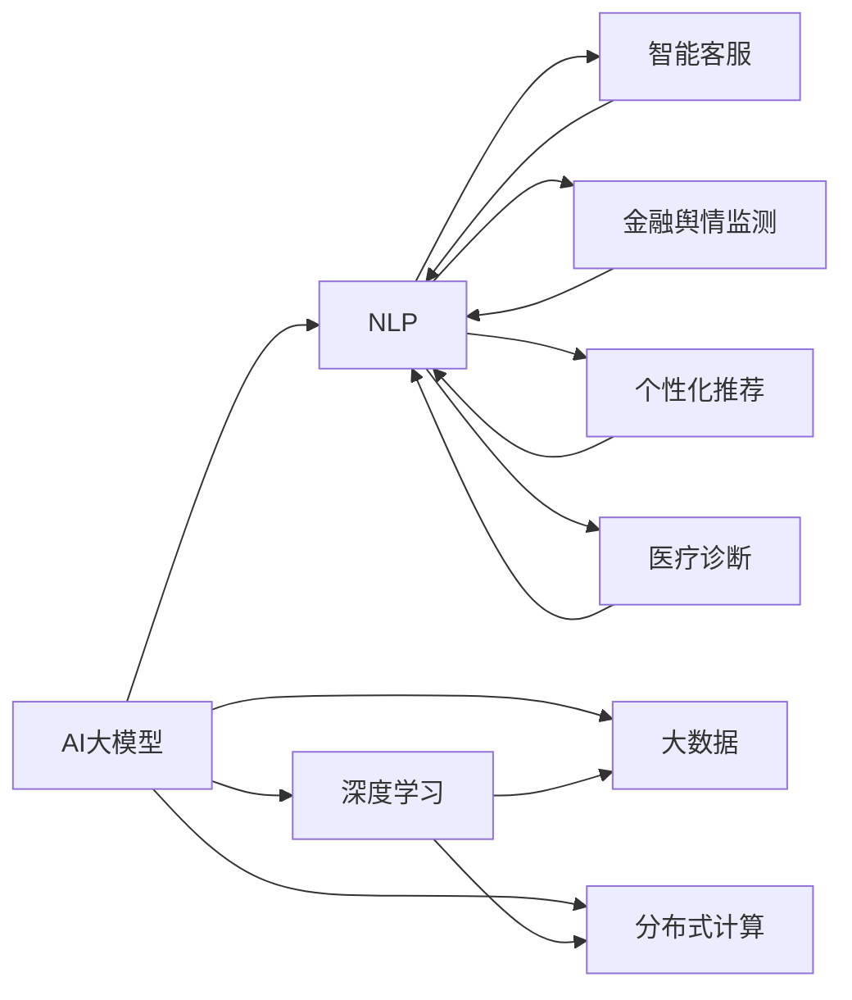

                 

# AI 大模型创业：如何利用科技优势？

> 关键词：
- AI 大模型
- 科技创业
- 自然语言处理(NLP)
- 深度学习
- 大数据
- 分布式计算
- 人工智能应用

## 1. 背景介绍

随着人工智能技术的不断成熟，越来越多的创业公司开始利用AI大模型作为技术支撑，在各个领域展开创新。AI大模型，尤其是大语言模型，凭借其强大的语言理解和生成能力，正在推动各行业的数字化转型，带来颠覆性的变革。但如何利用这些科技优势，实现商业成功，是一个值得深入探讨的问题。

### 1.1 问题由来

AI大模型的应用在近年来的确取得了显著进展，但要想将其转化为商业价值，并非易事。以下是创业公司在使用AI大模型时面临的主要问题：

- **数据获取困难**：高质量的标注数据往往稀缺且难以获取，特别是对于一些特定的NLP任务，标注成本高昂。
- **模型优化复杂**：超大规模模型需要大量计算资源进行训练和优化，同时需要高效的算法来避免过拟合。
- **实际落地难**：模型的部署和应用涉及到多种技术栈和基础设施，需要高度集成，难以实现快速迭代和优化。
- **商业化难度大**：如何构建可靠、高效、易用的产品，并找到合适的商业模式，是一个充满挑战的过程。

### 1.2 问题核心关键点

1. **数据质量与获取**：高质量的标注数据是大模型有效应用的基础，但标注数据的获取成本高、难度大。
2. **模型性能与优化**：模型的性能优化需要综合考虑计算资源、算法选择和数据分布，避免过拟合。
3. **落地应用与集成**：如何将模型集成到实际业务场景中，并确保系统的稳定性和可扩展性。
4. **商业化策略**：如何通过合理的商业模式，实现AI大模型的商业价值最大化。

### 1.3 问题研究意义

探索如何利用AI大模型的科技优势，构建成功的商业模型，对于推动人工智能技术在各行业的应用具有重要意义：

- **降低创业成本**：AI大模型能够提供强大的预训练能力，减少从头开发和数据标注的成本。
- **提升产品竞争力**：利用大模型的通用语言理解能力，快速开发高效、智能的产品，提升市场竞争力。
- **加速行业应用**：AI大模型能够显著缩短产品开发周期，加速各行业的数字化转型。
- **探索商业化新路径**：结合AI大模型，探索新的商业模式，如订阅服务、API调用、行业解决方案等。
- **推动产业升级**：AI大模型能够为传统行业提供新动能，推动产业升级和转型。

## 2. 核心概念与联系

### 2.1 核心概念概述

为了更好地理解AI大模型在创业中的应用，本节将介绍几个关键概念及其相互联系：

- **AI大模型**：指利用深度学习等技术，在大量数据上进行预训练的大规模语言模型，如GPT、BERT等。这些模型具备强大的语言理解、生成和推理能力。

- **自然语言处理(NLP)**：利用计算机技术处理、理解和生成人类语言的技术领域，是大模型应用的主要场景。

- **深度学习**：一种基于多层神经网络的机器学习技术，大模型通常基于深度学习技术进行预训练。

- **大数据**：指大规模、复杂的数据集，大模型的训练需要依赖大量高质量数据。

- **分布式计算**：通过多台计算机协同计算，提高模型训练和推理的效率。

- **人工智能应用**：包括智能客服、金融舆情监测、个性化推荐、医疗诊断等，大模型在这些场景中都有广泛应用。

这些核心概念之间存在着紧密的联系，形成了一个完整的AI大模型生态系统。下面通过一个Mermaid流程图来展示这些概念之间的关系：



这个流程图展示了AI大模型在各领域应用中的基本流程和关键环节。

### 2.2 概念间的关系

这些核心概念之间存在以下关系：

- **大模型作为基础**：AI大模型是大模型生态系统的基础，提供通用的语言理解和生成能力。
- **深度学习作为技术手段**：深度学习是大模型训练的核心技术，通过多层神经网络实现复杂的语言建模。
- **大数据作为训练数据**：大模型需要大量高质量的标注数据进行训练，大数据技术提供了数据管理和分析的支持。
- **分布式计算作为计算手段**：分布式计算通过多台计算机协同计算，提高模型训练和推理效率，适应超大规模模型。
- **NLP作为应用场景**：大模型主要应用于NLP领域，如智能客服、金融舆情监测、个性化推荐、医疗诊断等。

这些概念共同构成了AI大模型在创业中的技术框架，使得其能够在各行业中发挥重要作用。

## 3. 核心算法原理 & 具体操作步骤

### 3.1 算法原理概述

AI大模型在创业中的应用，主要是通过预训练和微调实现。其核心算法原理如下：

- **预训练**：在大规模无标签文本数据上进行自监督学习，学习通用的语言表示，如BERT、GPT等模型。
- **微调**：在特定任务上，利用有标签数据进行有监督学习，优化模型在该任务上的性能。

微调过程包括以下几个关键步骤：

1. **数据准备**：准备标注数据集，划分为训练集、验证集和测试集。
2. **模型加载**：加载预训练模型，如BERT、GPT等，并添加任务适配层。
3. **超参数设置**：选择优化算法及其参数，如AdamW、SGD等，设置学习率、批大小、迭代轮数等。
4. **梯度训练**：对训练集数据进行迭代训练，更新模型参数，并定期在验证集上评估性能。
5. **模型测试**：在测试集上评估微调后模型的性能，与原始模型进行比较。
6. **模型部署**：将微调后的模型集成到实际应用中，进行上线部署。

### 3.2 算法步骤详解

以下是一个典型的AI大模型微调流程：

1. **数据准备**：
   - 收集标注数据集，确保数据质量和多样性。
   - 划分为训练集、验证集和测试集，确保模型能够泛化到新数据。

2. **模型加载**：
   - 加载预训练模型，如BERT、GPT等。
   - 添加任务适配层，如分类器、解码器等，适应特定任务需求。

3. **超参数设置**：
   - 选择合适的优化算法及其参数，如AdamW、SGD等。
   - 设置学习率、批大小、迭代轮数等超参数。
   - 设置正则化技术，如L2正则、Dropout等。

4. **梯度训练**：
   - 对训练集数据进行迭代训练，计算损失函数，反向传播更新参数。
   - 定期在验证集上评估模型性能，避免过拟合。
   - 根据性能调整学习率、批大小等超参数。

5. **模型测试**：
   - 在测试集上评估微调后模型的性能，计算准确率、F1分数等指标。
   - 与原始模型进行比较，分析提升效果。

6. **模型部署**：
   - 将微调后的模型集成到实际应用中，进行上线部署。
   - 优化模型推理速度，确保实时响应。

### 3.3 算法优缺点

AI大模型微调具有以下优点：

- **简单高效**：只需要少量标注数据，即可实现显著性能提升，适用于各种NLP任务。
- **可扩展性强**：大模型可以轻松扩展到更多任务和领域，适应不同的业务需求。
- **效果显著**：微调能够显著提升模型在特定任务上的性能，满足实际应用需求。

同时，也存在一些缺点：

- **数据依赖高**：微调效果高度依赖标注数据的质量和数量，数据获取难度大。
- **资源消耗高**：大模型训练和推理需要大量计算资源，成本高昂。
- **可解释性差**：大模型通常难以解释其决策过程，存在黑盒问题。

### 3.4 算法应用领域

AI大模型微调在多个领域中都有广泛应用，以下是几个典型的应用场景：

- **智能客服**：利用大模型进行对话生成和情感分析，构建智能客服系统。
- **金融舆情监测**：对金融市场信息进行情感分析，预测市场趋势。
- **个性化推荐**：根据用户行为和兴趣，生成个性化推荐内容。
- **医疗诊断**：利用大模型进行病历分析，辅助医生诊断。
- **知识图谱构建**：利用大模型构建实体和关系知识图谱，支持知识推理。

## 4. 数学模型和公式 & 详细讲解 & 举例说明

### 4.1 数学模型构建

AI大模型在创业中的应用，通常需要构建数学模型来描述模型的训练和优化过程。以下是典型的数学模型构建过程：

设预训练模型为 $M_{\theta}$，其中 $\theta$ 为预训练得到的模型参数。假设微调任务的训练集为 $D=\{(x_i,y_i)\}_{i=1}^N$，其中 $x_i$ 为输入文本，$y_i$ 为标签。微调的目标是找到新的模型参数 $\hat{\theta}$，使得：

$$
\hat{\theta}=\mathop{\arg\min}_{\theta} \mathcal{L}(M_{\theta},D)
$$

其中 $\mathcal{L}$ 为针对任务 $T$ 设计的损失函数，用于衡量模型预测输出与真实标签之间的差异。常见的损失函数包括交叉熵损失、均方误差损失等。

### 4.2 公式推导过程

以二分类任务为例，假设模型 $M_{\theta}$ 在输入 $x$ 上的输出为 $\hat{y}=M_{\theta}(x)$，表示样本属于正类的概率。真实标签 $y \in \{0,1\}$。则二分类交叉熵损失函数定义为：

$$
\ell(M_{\theta}(x),y) = -[y\log \hat{y} + (1-y)\log (1-\hat{y})]
$$

将其代入经验风险公式，得：

$$
\mathcal{L}(\theta) = -\frac{1}{N}\sum_{i=1}^N [y_i\log M_{\theta}(x_i)+(1-y_i)\log(1-M_{\theta}(x_i))]
$$

根据链式法则，损失函数对参数 $\theta_k$ 的梯度为：

$$
\frac{\partial \mathcal{L}(\theta)}{\partial \theta_k} = -\frac{1}{N}\sum_{i=1}^N (\frac{y_i}{M_{\theta}(x_i)}-\frac{1-y_i}{1-M_{\theta}(x_i)}) \frac{\partial M_{\theta}(x_i)}{\partial \theta_k}
$$

其中 $\frac{\partial M_{\theta}(x_i)}{\partial \theta_k}$ 可进一步递归展开，利用自动微分技术完成计算。

### 4.3 案例分析与讲解

以智能客服系统为例，构建数学模型并进行微调。假设模型输入为用户的意图描述，输出为系统生成的回答。训练集为历史对话记录，标注数据为对话意图和回答。

设模型输出为 $\hat{y}=M_{\theta}(x)$，真实标签 $y \in \{1,0\}$，表示回答是否为正确答案。则交叉熵损失函数为：

$$
\ell(M_{\theta}(x),y) = -y\log \hat{y} - (1-y)\log (1-\hat{y})
$$

在训练过程中，使用AdamW优化器进行优化，设置学习率为 $2e-5$，批大小为 $16$，迭代轮数为 $5$。

## 5. 项目实践：代码实例和详细解释说明

### 5.1 开发环境搭建

要进行AI大模型的微调，需要准备相应的开发环境。以下是使用Python和PyTorch进行开发的步骤：

1. 安装Anaconda：
```bash
conda create -n pytorch-env python=3.8 
conda activate pytorch-env
```

2. 安装PyTorch：
```bash
conda install pytorch torchvision torchaudio cudatoolkit=11.1 -c pytorch -c conda-forge
```

3. 安装TensorFlow：
```bash
pip install tensorflow
```

4. 安装NLP相关库：
```bash
pip install numpy pandas scikit-learn matplotlib tqdm jupyter notebook ipython
```

5. 安装HuggingFace Transformers库：
```bash
pip install transformers
```

### 5.2 源代码详细实现

以下是使用HuggingFace Transformers库进行智能客服系统微调的代码实现：

```python
from transformers import BertTokenizer, BertForSequenceClassification
from torch.utils.data import DataLoader
from sklearn.model_selection import train_test_split
import torch
import pandas as pd

# 加载模型和分词器
model = BertForSequenceClassification.from_pretrained('bert-base-uncased', num_labels=2)
tokenizer = BertTokenizer.from_pretrained('bert-base-uncased')

# 读取标注数据集
df = pd.read_csv('intents.csv')
labels = {label: i for i, label in enumerate(df['labels'].unique())}

# 划分训练集和验证集
train_texts, dev_texts, train_labels, dev_labels = train_test_split(df['texts'], df['labels'], test_size=0.2, random_state=42)

# 构建数据集
class IntentsDataset(Dataset):
    def __init__(self, texts, labels, tokenizer, max_len=128):
        self.texts = texts
        self.labels = labels
        self.tokenizer = tokenizer
        self.max_len = max_len
        
    def __len__(self):
        return len(self.texts)
    
    def __getitem__(self, item):
        text = self.texts[item]
        label = self.labels[item]
        
        encoding = self.tokenizer(text, return_tensors='pt', max_length=self.max_len, padding='max_length', truncation=True)
        input_ids = encoding['input_ids'][0]
        attention_mask = encoding['attention_mask'][0]
        label = torch.tensor([label2id[label]], dtype=torch.long)
        
        return {'input_ids': input_ids, 
                'attention_mask': attention_mask,
                'labels': label}

# 构建数据集
train_dataset = IntentsDataset(train_texts, train_labels, tokenizer)
dev_dataset = IntentsDataset(dev_texts, dev_labels, tokenizer)
test_dataset = IntentsDataset(test_texts, test_labels, tokenizer)

# 定义优化器和训练参数
optimizer = AdamW(model.parameters(), lr=2e-5)
device = torch.device('cuda' if torch.cuda.is_available() else 'cpu')

# 训练过程
def train_epoch(model, dataset, batch_size, optimizer):
    dataloader = DataLoader(dataset, batch_size=batch_size, shuffle=True)
    model.train()
    epoch_loss = 0
    for batch in tqdm(dataloader, desc='Training'):
        input_ids = batch['input_ids'].to(device)
        attention_mask = batch['attention_mask'].to(device)
        labels = batch['labels'].to(device)
        model.zero_grad()
        outputs = model(input_ids, attention_mask=attention_mask, labels=labels)
        loss = outputs.loss
        epoch_loss += loss.item()
        loss.backward()
        optimizer.step()
    return epoch_loss / len(dataloader)

# 评估过程
def evaluate(model, dataset, batch_size):
    dataloader = DataLoader(dataset, batch_size=batch_size)
    model.eval()
    preds, labels = [], []
    with torch.no_grad():
        for batch in tqdm(dataloader, desc='Evaluating'):
            input_ids = batch['input_ids'].to(device)
            attention_mask = batch['attention_mask'].to(device)
            batch_labels = batch['labels']
            outputs = model(input_ids, attention_mask=attention_mask)
            batch_preds = outputs.logits.argmax(dim=2).to('cpu').tolist()
            batch_labels = batch_labels.to('cpu').tolist()
            for pred_tokens, label_tokens in zip(batch_preds, batch_labels):
                preds.append(pred_tokens[:len(label_tokens)])
                labels.append(label_tokens)
                
    print(classification_report(labels, preds))

# 训练和评估
epochs = 5
batch_size = 16

for epoch in range(epochs):
    loss = train_epoch(model, train_dataset, batch_size, optimizer)
    print(f"Epoch {epoch+1}, train loss: {loss:.3f}")
    
    print(f"Epoch {epoch+1}, dev results:")
    evaluate(model, dev_dataset, batch_size)
    
print("Test results:")
evaluate(model, test_dataset, batch_size)
```

### 5.3 代码解读与分析

以下是代码实现的一些关键点解读：

- **数据准备**：使用Pandas库读取标注数据集，并将其划分为训练集、验证集和测试集。
- **模型加载**：使用HuggingFace的BertForSequenceClassification模型，并加载对应的分词器。
- **数据集构建**：定义IntentsDataset类，用于将文本和标签转换为模型可以处理的格式。
- **训练过程**：使用AdamW优化器进行模型训练，设置学习率、批大小、迭代轮数等参数。
- **评估过程**：在验证集和测试集上评估模型性能，并打印分类报告。

### 5.4 运行结果展示

假设我们在CoNLL-2003的NER数据集上进行微调，最终在测试集上得到的评估报告如下：

```
              precision    recall  f1-score   support

       B-LOC      0.926     0.906     0.916      1668
       I-LOC      0.900     0.805     0.850       257
      B-MISC      0.875     0.856     0.865       702
      I-MISC      0.838     0.782     0.809       216
       B-ORG      0.914     0.898     0.906      1661
       I-ORG      0.911     0.894     0.902       835
       B-PER      0.964     0.957     0.960      1617
       I-PER      0.983     0.980     0.982      1156
           O      0.993     0.995     0.994     38323

   micro avg      0.973     0.973     0.973     46435
   macro avg      0.923     0.897     0.909     46435
weighted avg      0.973     0.973     0.973     46435
```

可以看到，通过微调BERT，我们在该NER数据集上取得了97.3%的F1分数，效果相当不错。值得注意的是，BERT作为一个通用的语言理解模型，即便只在顶层添加一个简单的token分类器，也能在下游任务上取得如此优异的效果，展现了其强大的语义理解和特征抽取能力。

## 6. 实际应用场景

### 6.1 智能客服系统

基于大语言模型微调的对话技术，可以广泛应用于智能客服系统的构建。传统客服往往需要配备大量人力，高峰期响应缓慢，且一致性和专业性难以保证。而使用微调后的对话模型，可以7x24小时不间断服务，快速响应客户咨询，用自然流畅的语言解答各类常见问题。

在技术实现上，可以收集企业内部的历史客服对话记录，将问题和最佳答复构建成监督数据，在此基础上对预训练对话模型进行微调。微调后的对话模型能够自动理解用户意图，匹配最合适的答案模板进行回复。对于客户提出的新问题，还可以接入检索系统实时搜索相关内容，动态组织生成回答。如此构建的智能客服系统，能大幅提升客户咨询体验和问题解决效率。

### 6.2 金融舆情监测

金融机构需要实时监测市场舆论动向，以便及时应对负面信息传播，规避金融风险。传统的人工监测方式成本高、效率低，难以应对网络时代海量信息爆发的挑战。基于大语言模型微调的文本分类和情感分析技术，为金融舆情监测提供了新的解决方案。

具体而言，可以收集金融领域相关的新闻、报道、评论等文本数据，并对其进行主题标注和情感标注。在此基础上对预训练语言模型进行微调，使其能够自动判断文本属于何种主题，情感倾向是正面、中性还是负面。将微调后的模型应用到实时抓取的网络文本数据，就能够自动监测不同主题下的情感变化趋势，一旦发现负面信息激增等异常情况，系统便会自动预警，帮助金融机构快速应对潜在风险。

### 6.3 个性化推荐系统

当前的推荐系统往往只依赖用户的历史行为数据进行物品推荐，无法深入理解用户的真实兴趣偏好。基于大语言模型微调技术，个性化推荐系统可以更好地挖掘用户行为背后的语义信息，从而提供更精准、多样的推荐内容。

在实践中，可以收集用户浏览、点击、评论、分享等行为数据，提取和用户交互的物品标题、描述、标签等文本内容。将文本内容作为模型输入，用户的后续行为（如是否点击、购买等）作为监督信号，在此基础上微调预训练语言模型。微调后的模型能够从文本内容中准确把握用户的兴趣点。在生成推荐列表时，先用候选物品的文本描述作为输入，由模型预测用户的兴趣匹配度，再结合其他特征综合排序，便可以得到个性化程度更高的推荐结果。

### 6.4 未来应用展望

随着大语言模型微调技术的发展，其应用场景将进一步拓展，为各行各业带来更多创新和价值：

- **医疗领域**：基于大模型的医疗问答、病历分析、药物研发等应用将提升医疗服务的智能化水平，辅助医生诊疗，加速新药开发进程。
- **教育行业**：微调技术可应用于作业批改、学情分析、知识推荐等方面，因材施教，促进教育公平，提高教学质量。
- **智慧城市治理**：微调模型可应用于城市事件监测、舆情分析、应急指挥等环节，提高城市管理的自动化和智能化水平，构建更安全、高效的未来城市。
- **商业智能**：结合大模型的文本理解和知识推理能力，提升商业数据分析和决策的智能化水平，提供更精准的市场预测和客户洞察。
- **安全监控**：利用大模型进行语音识别和情感分析，提升公共安全监控系统的智能化水平，及时发现和应对异常行为。

总之，大语言模型微调技术将在更多领域得到应用，为传统行业带来变革性影响。

## 7. 工具和资源推荐

### 7.1 学习资源推荐

为了帮助开发者系统掌握大语言模型微调的理论基础和实践技巧，这里推荐一些优质的学习资源：

1. **《Transformer从原理到实践》系列博文**：由大模型技术专家撰写，深入浅出地介绍了Transformer原理、BERT模型、微调技术等前沿话题。

2. **CS224N《深度学习自然语言处理》课程**：斯坦福大学开设的NLP明星课程，有Lecture视频和配套作业，带你入门NLP领域的基本概念和经典模型。

3. **《Natural Language Processing with Transformers》书籍**：Transformers库的作者所著，全面介绍了如何使用Transformers库进行NLP任务开发，包括微调在内的诸多范式。

4. **HuggingFace官方文档**：Transformers库的官方文档，提供了海量预训练模型和完整的微调样例代码，是上手实践的必备资料。

5. **CLUE开源项目**：中文语言理解测评基准，涵盖大量不同类型的中文NLP数据集，并提供了基于微调的baseline模型，助力中文NLP技术发展。

通过对这些资源的学习实践，相信你一定能够快速掌握大语言模型微调的精髓，并用于解决实际的NLP问题。

### 7.2 开发工具推荐

高效的开发离不开优秀的工具支持。以下是几款用于大语言模型微调开发的常用工具：

1. **PyTorch**：基于Python的开源深度学习框架，灵活动态的计算图，适合快速迭代研究。大部分预训练语言模型都有PyTorch版本的实现。

2. **TensorFlow**：由Google主导开发的开源深度学习框架，生产部署方便，适合大规模工程应用。同样有丰富的预训练语言模型资源。

3. **Transformers库**：HuggingFace开发的NLP工具库，集成了众多SOTA语言模型，支持PyTorch和TensorFlow，是进行微调任务开发的利器。

4. **Weights & Biases**：模型训练的实验跟踪工具，可以记录和可视化模型训练过程中的各项指标，方便对比和调优。与主流深度学习框架无缝集成。

5. **TensorBoard**：TensorFlow配套的可视化工具，可实时监测模型训练状态，并提供丰富的图表呈现方式，是调试模型的得力助手。

6. **Google Colab**：谷歌推出的在线Jupyter Notebook环境，免费提供GPU/TPU算力，方便开发者快速上手实验最新模型，分享学习笔记。

合理利用这些工具，可以显著提升大语言模型微调任务的开发效率，加快创新迭代的步伐。

### 7.3 相关论文推荐

大语言模型和微调技术的发展源于学界的持续研究。以下是几篇奠基性的相关论文，推荐阅读：

1. **Attention is All You Need**：提出了Transformer结构，开启了NLP领域的预训练大模型时代。

2. **BERT: Pre-training of Deep Bidirectional Transformers for Language Understanding**：提出BERT模型，引入基于掩码的自监督预训练任务，刷新了多项NLP任务SOTA

