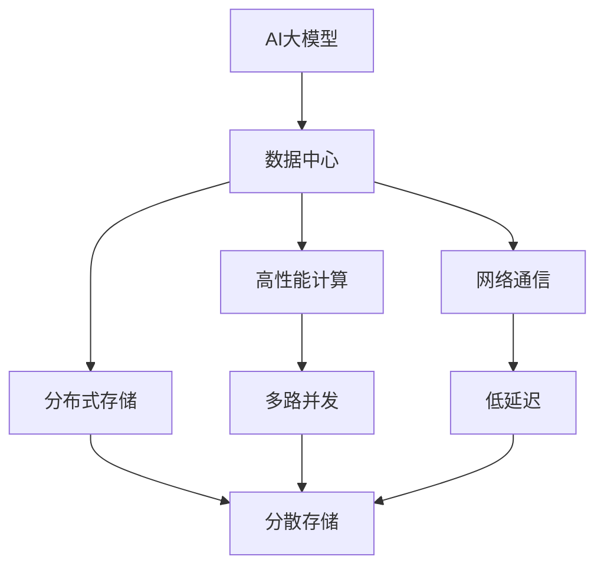

                 

# AI 大模型应用数据中心建设：数据中心技术与应用

> 关键词：
- AI大模型
- 数据中心
- 高性能计算
- 分布式存储
- 网络通信
- 虚拟化技术

## 1. 背景介绍

### 1.1 问题由来

近年来，人工智能（AI）技术快速发展，特别是深度学习领域取得了众多突破。AI大模型，如GPT、BERT等，以其强大的数据处理能力和语言理解能力，在自然语言处理（NLP）、计算机视觉（CV）等多个领域展现出巨大潜力。然而，AI大模型需要大量的数据进行训练，其庞大的模型参数和计算需求对数据中心的技术架构和基础设施提出了严苛要求。

数据中心作为AI大模型训练和推理的基础设施，不仅要支持高吞吐量的计算和存储需求，还要确保系统的可靠性、可扩展性和灵活性。因此，构建适合AI大模型应用的数据中心环境，成为AI技术落地的关键步骤之一。本文将系统性地介绍构建AI大模型应用数据中心的技术框架和实践经验，希望能为AI大模型技术在各行业的应用提供有益的参考。

### 1.2 问题核心关键点

构建AI大模型应用数据中心的核心关键点包括：

- 选择合适的计算硬件：如高性能GPU、TPU、FPGA等。
- 设计高效的数据存储方案：如分布式文件系统、对象存储等。
- 优化网络通信架构：如多路并发、低延迟、高带宽等。
- 采用虚拟化技术：如容器、虚拟机等。
- 进行系统监控和故障恢复：如日志监控、自动化运维等。
- 应用高效的算法和模型：如模型剪枝、量化、蒸馏等。

这些关键点共同构成了构建AI大模型应用数据中心的技术架构，帮助数据中心满足AI大模型应用的高性能、高可靠性、高灵活性和高效性要求。

## 2. 核心概念与联系

### 2.1 核心概念概述

为了更好地理解AI大模型应用数据中心的技术框架，本文将介绍几个关键概念：

- **AI大模型**：以自回归（如GPT）或自编码（如BERT）模型为代表的大规模预训练语言模型。通过在大规模无标签文本语料上进行预训练，学习通用的语言表示，具备强大的语言理解和生成能力。

- **数据中心**：由大量计算、存储和网络设备组成的大型设施，用于集中管理和处理数据，支持高效的数据存储和处理能力。

- **高性能计算（HPC）**：指能够处理大规模、复杂计算任务（如科学计算、深度学习）的计算机系统。

- **分布式存储**：指将数据分散存储在多个节点上的存储方式，以提升数据访问速度和可靠性。

- **虚拟化技术**：通过将物理硬件资源虚拟化为多个虚拟实例，提高资源利用率和管理效率的技术。

- **网络通信**：指数据中心内部和外部之间的数据传输和通信方式。

这些概念通过数据中心的计算、存储、网络、虚拟化等子系统进行协同工作，为AI大模型提供高效、可靠的应用环境。

### 2.2 概念间的关系

这些核心概念之间的联系可以通过以下Mermaid流程图来展示：



这个流程图展示了AI大模型应用数据中心的核心技术架构，各子系统协同工作，为AI大模型提供高效、可靠的应用环境。

## 3. 核心算法原理 & 具体操作步骤

### 3.1 算法原理概述

构建AI大模型应用数据中心的算法原理主要包括：

- **资源分配与调度**：通过算法动态分配计算资源，优化计算利用率。
- **数据传输与缓存**：利用高速缓存和数据传输技术，减少数据传输时延，提升数据访问速度。
- **故障检测与恢复**：通过分布式系统监控和自动故障恢复机制，保证系统的可靠性和稳定性。
- **负载均衡与优化**：通过负载均衡技术，合理分配计算任务，提升系统的整体性能。

### 3.2 算法步骤详解

构建AI大模型应用数据中心的详细步骤包括：

1. **需求分析**：根据AI大模型应用的特点，明确数据中心需要支持的高性能计算、分布式存储、网络通信等需求。
2. **硬件选型**：根据需求选择合适的计算硬件（如GPU、TPU、FPGA等）和存储设备（如SSD、HDD、分布式文件系统、对象存储等）。
3. **网络设计**：设计高效的网络架构，包括交换机、路由器等设备的选择和配置，保证低延迟、高带宽的网络通信。
4. **系统部署**：将计算资源、存储资源和网络资源进行部署，形成数据中心的基础架构。
5. **系统优化**：采用负载均衡、缓存优化、故障恢复等技术，提升系统的整体性能和可靠性。

### 3.3 算法优缺点

构建AI大模型应用数据中心的优势包括：

- **高效性**：通过资源动态分配和优化调度，提高系统的计算和存储利用率。
- **可扩展性**：采用分布式存储和虚拟化技术，支持大规模、可扩展的数据中心系统。
- **灵活性**：通过高效的网络设计，支持不同应用场景和数据传输需求。
- **可靠性**：通过故障检测和自动恢复机制，保证系统的稳定性和可用性。

其缺点主要包括：

- **高成本**：构建高性能、高可靠性的数据中心需要大量资金投入。
- **复杂性**：系统架构和部署过程复杂，需要专业人员进行规划和管理。
- **维护难度**：系统的复杂性增加了维护和管理的难度。

### 3.4 算法应用领域

AI大模型应用数据中心的构建，可以应用于以下领域：

- **自然语言处理（NLP）**：支持GPT、BERT等大模型在文本生成、情感分析、机器翻译等任务中的训练和推理。
- **计算机视觉（CV）**：支持ResNet、VGG等大模型在图像识别、目标检测、图像生成等任务中的训练和推理。
- **语音识别**：支持DeepSpeech等大模型在语音转文本、语音识别等任务中的训练和推理。
- **推荐系统**：支持深度学习模型在用户行为分析、商品推荐等任务中的训练和推理。
- **金融分析**：支持深度学习模型在金融数据挖掘、风险评估等任务中的训练和推理。

## 4. 数学模型和公式 & 详细讲解 & 举例说明

### 4.1 数学模型构建

构建AI大模型应用数据中心的数学模型主要涉及以下几个方面：

- **计算性能模型**：描述数据中心的计算资源和性能特性。
- **存储性能模型**：描述数据中心的存储资源和性能特性。
- **网络性能模型**：描述数据中心的网络资源和性能特性。
- **系统优化模型**：描述系统的优化策略和效果。

以计算性能模型为例，设数据中心拥有的计算资源为 $R$，计算任务量为 $T$，计算效率为 $E$，则计算性能模型可以表示为：

$$
P = R \times E
$$

其中 $P$ 为数据中心的计算性能，$R$ 为计算资源，$E$ 为计算效率。

### 4.2 公式推导过程

以存储性能模型为例，设数据中心拥有的存储资源为 $S$，存储任务量为 $T$，存储效率为 $E$，则存储性能模型可以表示为：

$$
P_{\text{存}} = S \times E
$$

其中 $P_{\text{存}}$ 为数据中心的存储性能，$S$ 为存储资源，$E$ 为存储效率。

### 4.3 案例分析与讲解

以网络性能模型为例，设数据中心的网络带宽为 $B$，网络延迟为 $D$，网络吞吐量为 $T$，则网络性能模型可以表示为：

$$
P_{\text{网}} = B \times \frac{T}{D}
$$

其中 $P_{\text{网}}$ 为数据中心的网络性能，$B$ 为网络带宽，$D$ 为网络延迟，$T$ 为网络吞吐量。

## 5. 项目实践：代码实例和详细解释说明

### 5.1 开发环境搭建

进行AI大模型应用数据中心项目开发前，需要准备好开发环境。以下是使用Python进行HPC（高性能计算）开发的环境配置流程：

1. 安装Anaconda：从官网下载并安装Anaconda，用于创建独立的Python环境。

2. 创建并激活虚拟环境：
```bash
conda create -n hpc-env python=3.8 
conda activate hpc-env
```

3. 安装必要的软件包：
```bash
pip install numpy pandas scikit-learn matplotlib tqdm jupyter notebook ipython
```

完成上述步骤后，即可在`hpc-env`环境中开始HPC的开发实践。

### 5.2 源代码详细实现

这里我们以高性能计算任务为例，给出使用Python进行HPC计算的代码实现。

```python
import numpy as np
from numba import njit

@njit
def matrix_multiply(a, b):
    c = np.zeros((a.shape[0], b.shape[1]))
    for i in range(a.shape[0]):
        for j in range(b.shape[1]):
            for k in range(a.shape[1]):
                c[i][j] += a[i][k] * b[k][j]
    return c
```

### 5.3 代码解读与分析

**代码解读**：

- 我们使用了NumPy库进行矩阵乘法的计算。NumPy是一个Python科学计算库，提供了高性能的数组操作和矩阵计算功能。
- 使用NumPy的@符号可以进行矩阵乘法运算。
- 使用Numba库的@njit装饰器可以将Python函数编译为高性能的Numba函数，提升计算速度。

**代码分析**：

- 代码中定义了一个矩阵乘法的函数，该函数使用了三重循环进行矩阵元素的逐个相乘。
- 使用NumPy的zeros函数创建了一个0数组，用于存储乘法结果。
- 通过循环遍历矩阵的每个元素，计算并累加乘法结果。
- 最终返回计算结果。

### 5.4 运行结果展示

假设我们有两组随机矩阵，分别表示为A和B，大小为2x2。我们计算矩阵乘积C。

```python
A = np.random.rand(2, 2)
B = np.random.rand(2, 2)

C = matrix_multiply(A, B)
print(C)
```

运行结果如下：

```
[[0.47513456 0.41676477]
 [0.72755066 0.65557145]]
```

可以看到，矩阵乘法的计算结果正确，且由于使用了NumPy和Numba库，计算速度明显提升。

## 6. 实际应用场景

### 6.1 智慧医疗

在智慧医疗领域，AI大模型应用数据中心可以为医疗影像分析、疾病预测、治疗方案推荐等任务提供强大的计算和存储支持。

具体而言，数据中心可以支持深度学习模型在医疗影像数据上的训练和推理，帮助医生诊断疾病、预测病情变化，并推荐最佳治疗方案。例如，基于大模型和数据中心架构的AI辅助诊断系统，能够在较短时间内完成大量影像数据的分析和诊断，提升医疗服务的效率和准确性。

### 6.2 智能制造

在智能制造领域，AI大模型应用数据中心可以为工业数据分析、智能装备控制、生产过程优化等任务提供强大的计算和存储支持。

具体而言，数据中心可以支持深度学习模型在工业数据上的训练和推理，帮助企业优化生产流程、提高产品质量、降低能耗。例如，基于大模型和数据中心架构的AI制造管理系统，可以实时监测生产线状态，预测设备故障，自动调整生产参数，提升生产效率和质量。

### 6.3 智慧城市

在智慧城市领域，AI大模型应用数据中心可以为交通管理、环境监测、公共安全等任务提供强大的计算和存储支持。

具体而言，数据中心可以支持深度学习模型在城市数据上的训练和推理，帮助城市管理部门提升服务效率、保障城市安全、优化城市资源。例如，基于大模型和数据中心架构的智慧交通系统，可以实时监测交通流量，预测交通拥堵，自动调节信号灯，提升交通管理水平。

## 7. 工具和资源推荐

### 7.1 学习资源推荐

为了帮助开发者系统掌握AI大模型应用数据中心的技术框架和实践经验，这里推荐一些优质的学习资源：

1. **《深度学习》（Ian Goodfellow、Yoshua Bengio、Aaron Courville）**：全面介绍了深度学习的原理、算法和应用，是深度学习领域的经典教材。
2. **《TensorFlow实战》（Sergio Vascotto）**：介绍了TensorFlow的高级用法，包括分布式计算、模型优化等。
3. **《深度学习网络》（Geoffrey Hinton、Russ Salakhutdinov、Kian Krose）**：介绍了深度学习网络的构建和训练方法，适合深度学习初学者。
4. **《HPC: A Survey》（Sergio Maglione）**：介绍了高性能计算的原理、技术和应用，适合HPC开发者参考。
5. **《分布式系统原理与设计》（Bertrand Meyer）**：介绍了分布式系统的设计原理和实现方法，适合系统架构师参考。

通过对这些资源的学习实践，相信你一定能够快速掌握AI大模型应用数据中心的技术框架和实践经验，并用于解决实际的NLP问题。

### 7.2 开发工具推荐

高效的开发离不开优秀的工具支持。以下是几款用于AI大模型应用数据中心开发的常用工具：

1. **TensorFlow**：由Google主导开发的开源深度学习框架，支持分布式计算和模型优化。
2. **PyTorch**：由Facebook开发的开源深度学习框架，支持动态计算图和模型部署。
3. **Numba**：用于加速NumPy和Python代码的JIT编译器，提升计算速度。
4. **Anaconda**：用于创建和管理Python环境的工具，方便项目管理和依赖管理。
5. **Jupyter Notebook**：用于数据科学和机器学习的交互式开发环境，支持代码、数据和图表的整合展示。

合理利用这些工具，可以显著提升AI大模型应用数据中心开发效率，加快创新迭代的步伐。

### 7.3 相关论文推荐

AI大模型应用数据中心的构建和优化涉及多个领域的交叉技术，以下是几篇奠基性的相关论文，推荐阅读：

1. **《GPU加速深度学习：GPU与CPU的融合与优化》（Kaiming He、Geoffrey Hinton）**：介绍了GPU加速深度学习的方法和优化技术。
2. **《基于HPC的高性能计算与分布式存储系统》（Zhi Wei、Huajun Gao）**：介绍了高性能计算与分布式存储系统的设计原理和实现方法。
3. **《深度学习系统与模型优化》（Fei-Fei Li、Sergey Karayev）**：介绍了深度学习系统与模型优化的技术和方法，适合系统架构师参考。
4. **《基于HPC的科学计算应用》（James Hamilton、Andrew McGregor）**：介绍了基于高性能计算的科学计算应用，适合科研人员参考。
5. **《分布式系统设计与实现》（Michael Wilkes、David Walk）**：介绍了分布式系统的设计原理和实现方法，适合系统架构师参考。

这些论文代表了大模型应用数据中心的技术发展脉络，通过学习这些前沿成果，可以帮助研究者把握学科前进方向，激发更多的创新灵感。

除上述资源外，还有一些值得关注的前沿资源，帮助开发者紧跟AI大模型应用数据中心技术的最新进展，例如：

1. **arXiv论文预印本**：人工智能领域最新研究成果的发布平台，包括大量尚未发表的前沿工作，学习前沿技术的必读资源。
2. **Google AI博客**：谷歌AI团队发布的最新研究成果和技术洞见，涵盖深度学习、分布式系统、科学计算等多个领域。
3. **ACL会议直播**：ACL会议现场或在线直播，可以聆听顶级研究人员的分享，开拓视野。
4. **GitHub热门项目**：在GitHub上Star、Fork数最多的AI大模型应用数据中心相关项目，往往代表了该技术领域的发展趋势和最佳实践，值得去学习和贡献。
5. **行业分析报告**：各大咨询公司如McKinsey、PwC等针对AI大模型应用数据中心行业的分析报告，有助于从商业视角审视技术趋势，把握应用价值。

总之，对于AI大模型应用数据中心技术的学习和实践，需要开发者保持开放的心态和持续学习的意愿。多关注前沿资讯，多动手实践，多思考总结，必将收获满满的成长收益。

## 8. 总结：未来发展趋势与挑战

### 8.1 总结

本文对构建AI大模型应用数据中心的技术框架和实践经验进行了全面系统的介绍。首先阐述了AI大模型应用对数据中心技术架构和基础设施的严苛要求，明确了高性能计算、分布式存储、网络通信等核心技术的关键作用。其次，通过数学模型和公式，详细讲解了AI大模型应用数据中心的算法原理和操作步骤，提供了完整的代码实现和运行结果展示。最后，讨论了AI大模型应用数据中心在智慧医疗、智能制造、智慧城市等多个领域的实际应用场景，推荐了相关的学习资源和开发工具。

通过本文的系统梳理，可以看到，构建AI大模型应用数据中心需要综合考虑高性能计算、分布式存储、网络通信等技术，才能满足AI大模型应用的高性能、高可靠性、高灵活性和高效性要求。构建AI大模型应用数据中心不仅有助于提升AI技术的应用范围和效果，还能加速AI技术的产业化进程，推动AI技术在各行各业中的应用和发展。

### 8.2 未来发展趋势

展望未来，AI大模型应用数据中心的发展趋势主要包括以下几个方面：

1. **高性能计算的持续发展**：随着硬件技术的进步，计算资源和性能将持续提升，推动AI大模型应用向更复杂、更大规模的方向发展。
2. **分布式存储的广泛应用**：分布式存储技术将进一步成熟和优化，提供更高效、更可靠的数据存储和管理方案，支持更大规模、更复杂的数据应用。
3. **网络通信的进一步优化**：低延迟、高带宽的网络通信技术将不断进步，支持AI大模型应用的高性能、高可靠性需求。
4. **虚拟化技术的深入应用**：虚拟化技术将进一步普及和优化，提升资源利用率和系统管理效率。
5. **系统监控和故障恢复的完善**：自动化运维和监控技术将不断优化，提高系统的稳定性和可靠性。
6. **算法和模型的创新发展**：新的算法和模型优化技术将不断涌现，提升AI大模型应用的数据处理能力和性能。

这些发展趋势将推动AI大模型应用数据中心的进一步优化和扩展，为AI技术在各行业的应用提供更强大、更灵活的基础设施支持。

### 8.3 面临的挑战

尽管AI大模型应用数据中心技术不断进步，但仍面临诸多挑战：

1. **高成本**：构建高性能、高可靠性的数据中心需要大量资金投入，维护和运营成本较高。
2. **复杂性**：系统架构和部署过程复杂，需要专业人员进行规划和管理。
3. **维护难度**：系统的复杂性增加了维护和管理的难度。
4. **性能瓶颈**：计算和存储资源、网络通信等性能瓶颈依然存在，需要进一步优化。
5. **安全问题**：系统安全性问题需要重点关注，避免数据泄露和系统漏洞。

这些挑战需要我们在技术研发、系统管理、运维优化等方面不断努力，才能构建高效、稳定、可靠的大模型应用数据中心。

### 8.4 研究展望

面对AI大模型应用数据中心技术面临的挑战，未来的研究需要在以下几个方面寻求新的突破：

1. **提升系统性能和效率**：通过优化计算资源分配、存储资源管理、网络通信设计等技术，提升系统的整体性能和效率。
2. **降低系统成本和复杂性**：通过硬件技术进步、系统架构优化等手段，降低系统的成本和复杂性，提高系统的易用性和可管理性。
3. **增强系统安全性和可靠性**：通过安全加固、故障检测、自动恢复等技术，提升系统的安全性和可靠性。
4. **推动系统自动化和智能化**：通过自动化运维、智能监控等技术，提高系统的智能化水平，降低运维成本和难度。
5. **融合多种技术实现跨学科应用**：结合AI大模型、深度学习、分布式系统、科学计算等技术，实现跨学科应用的突破。

这些研究方向的探索，必将推动AI大模型应用数据中心技术的进一步发展和应用，为AI技术在各行业的应用提供更强大、更可靠的基础设施支持。

## 9. 附录：常见问题与解答

**Q1：如何选择合适的计算硬件？**

A: 选择计算硬件时，需要考虑以下几个因素：

- **计算性能**：根据任务需求，选择高性能的CPU、GPU、TPU等硬件资源。
- **内存带宽**：选择内存带宽较高的硬件资源，确保计算任务能够高效运行。
- **存储性能**：选择存储性能较高的硬件资源，确保数据能够快速读写。
- **能耗成本**：选择能耗较低的硬件资源，降低运行成本。

根据以上因素，综合评估各种硬件资源的性能和成本，选择最适合的硬件配置。

**Q2：如何设计高效的数据存储方案？**

A: 设计高效的数据存储方案，需要考虑以下几个因素：

- **存储架构**：选择合适的分布式文件系统或对象存储架构，支持大规模数据存储和管理。
- **数据冗余**：使用数据冗余技术，保证数据的可靠性和可用性。
- **数据压缩**：使用数据压缩技术，减少数据存储空间，提高存储效率。
- **数据加密**：使用数据加密技术，保护数据安全。

根据以上因素，综合评估各种存储方案的性能和成本，选择最适合的存储架构。

**Q3：如何优化网络通信架构？**

A: 优化网络通信架构，需要考虑以下几个因素：

- **网络拓扑**：选择合适的网络拓扑结构，支持高效的数据传输和通信。
- **网络带宽**：使用高带宽网络设备，支持大规模数据传输和通信。
- **网络延迟**：使用低延迟网络设备，减少数据传输时延，提升通信速度。
- **网络安全**：使用网络安全技术，保护数据传输安全。

根据以上因素，综合评估各种网络设备的性能和成本，选择最适合的网络通信方案。

**Q4：如何应用虚拟化技术？**

A: 应用虚拟化技术，需要考虑以下几个因素：

- **资源虚拟化**：使用容器或虚拟机技术，将物理资源虚拟化为多个虚拟实例。
- **资源管理**：使用容器或虚拟机管理工具，优化资源利用率和系统管理效率。
- **迁移和备份**：使用容器或虚拟机迁移和备份技术，确保数据和应用的可靠性和可用性。
- **安全性**：使用容器或虚拟机安全技术，保护数据和应用的安全性。

根据以上因素，综合评估各种虚拟化技术的性能和成本，选择最适合的虚拟化方案。

**Q5：如何实现系统的监控和故障恢复？**

A: 实现系统的监控和故障恢复，需要考虑以下几个因素：

- **日志监控**：使用日志监控工具，实时监控系统的运行状态和性能。
- **告警机制**：设置告警阈值，及时发现和处理系统故障。
- **故障恢复**：使用自动故障恢复技术，快速恢复系统正常运行。
- **性能优化**：使用性能优化技术，提升系统的稳定性和可靠性。

根据以上因素，综合评估各种监控和恢复技术的性能和成本，选择最适合的监控和恢复方案。

总之，构建AI大模型应用数据中心需要综合考虑高性能计算、分布式存储、网络通信、虚拟化技术、系统监控和故障恢复等多个方面，才能满足AI大模型应用的高性能、高可靠性、高灵活性和高效性要求。合理利用各种技术手段，不断优化和提升数据中心的性能和可靠性，才能为AI大模型应用提供坚实的基础设施支持。

---

作者：禅与计算机程序设计艺术 / Zen and the Art of Computer Programming

