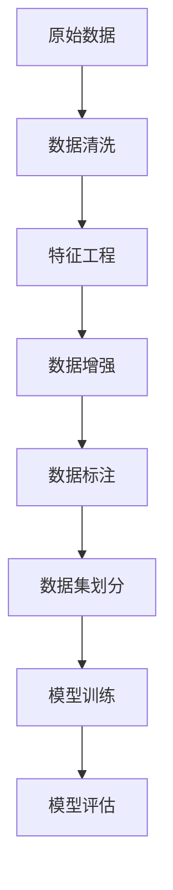

                 

## 1. 背景介绍

在人工智能大模型应用的浪潮中，数据清洗作为数据预处理的重要环节，对于提升模型性能和可靠性具有至关重要的作用。数据中心作为人工智能模型的运行环境，面临着海量数据流和多样化的数据类型，如何高效、准确地进行数据清洗，成为应用大模型的关键问题之一。本文将详细介绍AI大模型应用数据中心的数据清洗工具，包括核心概念、算法原理、具体操作步骤、应用场景等，旨在为AI大模型的实际应用提供参考。

## 2. 核心概念与联系

### 2.1 核心概念概述

在介绍数据清洗工具之前，我们需要理解几个核心概念：

- **数据清洗（Data Cleaning）**：指从原始数据中去除错误、无关、重复或缺失的部分，以确保数据的质量和一致性。数据清洗是数据预处理的重要环节，对提升模型性能和可靠性具有重要意义。

- **数据预处理（Data Preprocessing）**：包括数据清洗、特征工程、数据归一化等步骤，目的是将原始数据转换为模型可以处理的形式。

- **数据标注（Data Annotation）**：指将原始数据添加标签或注释，以便模型能够理解数据内容。数据标注对于训练有监督学习模型至关重要。

- **数据增强（Data Augmentation）**：通过变换、扩充等手段，增加训练数据的多样性，以提升模型的泛化能力。

- **数据集划分（Data Splitting）**：将数据集划分为训练集、验证集和测试集，以便在模型训练和评估中进行有效的监控和比较。

这些概念之间存在着紧密的联系，共同构成了数据中心数据处理的基本流程。数据清洗作为数据预处理的一部分，是整个流程中不可或缺的一环。

### 2.2 核心概念间的联系

为了更好地理解数据清洗工具，我们需要将这些核心概念联系起来。以下是一个简化的数据处理流程示意图：



在这个流程中，数据清洗是数据预处理的第一步，通过清洗去除噪声、填补缺失值等操作，确保数据的一致性和准确性。特征工程则根据模型需求，对数据进行编码、归一化等处理，以便模型能够更好地学习数据的特征。数据增强通过扩充数据集，提升模型的泛化能力。数据标注为有监督学习模型提供标注数据，使其能够学习数据与标签之间的映射关系。数据集划分为训练、验证和测试集，确保模型在不同数据上的表现一致，并进行有效的评估。

## 3. 核心算法原理 & 具体操作步骤

### 3.1 算法原理概述

数据清洗的算法原理主要涉及数据的错误检测和修复，以及数据不一致性的处理。常见的数据清洗算法包括但不限于：

- **缺失值填补（Missing Value Imputation）**：通过均值、中位数、插值等方法填补缺失值。
- **异常值检测（Outlier Detection）**：检测并处理数据中的异常值，避免其对模型学习造成影响。
- **数据转换（Data Transformation）**：通过归一化、标准化等方法，将数据转换为模型所需的形式。
- **数据去重（Data Deduplication）**：去除数据中的重复项，提高数据集的一致性。

这些算法通过检测和修复数据中的异常和错误，确保数据的准确性和一致性，为模型训练提供高质量的数据支持。

### 3.2 算法步骤详解

数据清洗的具体操作步骤可以分为以下几个步骤：

1. **数据读取与初步分析**：读取原始数据，并进行初步分析，了解数据的结构和特征。
2. **缺失值处理**：检测和填补数据中的缺失值，可以采用均值、中位数、插值等方法。
3. **异常值检测**：通过统计学方法或机器学习方法，检测数据中的异常值，并决定如何处理这些异常值。
4. **数据转换**：对数据进行归一化、标准化等操作，以便模型能够更好地处理。
5. **数据去重**：去除数据集中的重复项，提高数据的一致性。
6. **数据标注**：为数据集添加标签或注释，以便模型能够理解数据内容。
7. **数据集划分**：将数据集划分为训练集、验证集和测试集，以便在模型训练和评估中进行有效的监控和比较。

### 3.3 算法优缺点

数据清洗的算法具有以下优点：

- **提高数据质量**：通过清洗去除数据中的噪声、错误和重复项，确保数据的一致性和准确性。
- **提升模型性能**：清洗后的数据能够更好地反映真实世界的情况，提高模型的泛化能力和预测准确性。
- **减少计算资源消耗**：清洗后的数据更易于处理，可以减少计算资源的消耗。

然而，数据清洗也存在一些缺点：

- **耗时耗力**：数据清洗过程需要耗费大量时间和人力，尤其是在数据规模较大的情况下。
- **可能引入偏差**：处理缺失值、异常值等操作可能会引入一定的偏差，影响模型的性能。
- **可能损失信息**：数据清洗过程中可能会丢失一些有用信息，影响模型的表现。

### 3.4 算法应用领域

数据清洗技术在多个领域中得到了广泛应用，以下是几个典型的应用场景：

- **金融行业**：在金融数据分析中，数据清洗是预处理的关键步骤，去除错误和异常值，确保数据的准确性和一致性。
- **医疗行业**：医疗数据通常包含大量的噪声和错误，数据清洗对于提高数据分析的准确性和可靠性至关重要。
- **电商行业**：在电商数据分析中，清洗用户行为数据、产品评价数据等，可以提升模型的预测准确性。
- **自然语言处理**：在NLP任务中，清洗文本数据去除噪声和错误，可以提升模型的理解能力和表现。

## 4. 数学模型和公式 & 详细讲解

### 4.1 数学模型构建

数据清洗的数学模型主要涉及数据的统计特性和变换方法。以下是一个简单的数学模型示例：

假设原始数据集为 $D = \{(x_1, y_1), (x_2, y_2), ..., (x_n, y_n)\}$，其中 $x$ 为特征向量，$y$ 为标签。设数据集中有 $m$ 个样本缺失值，缺失值为 $X^{(i)}$。缺失值填补的目标是找到一个函数 $f$，使得 $\hat{X} = f(X)$ 尽可能接近 $X$。

### 4.2 公式推导过程

以下是缺失值填补的一个简单推导过程：

假设缺失值 $X^{(i)}$ 的期望值为 $\mu$，方差为 $\sigma^2$，则缺失值填补的目标是找到一个函数 $f$，使得 $\hat{X} = f(X)$ 尽可能接近 $X$。

常见的缺失值填补方法包括均值填补、中位数填补、插值法等。以均值填补为例，假设缺失值 $X^{(i)}$ 的缺失位置为 $i$，则填补后的值为：

$$
\hat{X}_i = \frac{1}{n-1} \sum_{j \neq i} X_j
$$

其中 $n$ 为数据集的大小。

### 4.3 案例分析与讲解

假设我们在金融行业应用数据清洗工具，处理信用卡交易数据。原始数据包含交易金额、交易时间、交易类型等特征。我们需要清洗数据中的异常值和缺失值，以确保数据的一致性和准确性。

首先，通过统计学方法检测并去除异常值。例如，对于交易金额，如果某次交易金额异常大或异常小，可能为欺诈行为，应将其标记为异常值并剔除。

接着，对缺失值进行填补。例如，对于交易时间缺失，可以通过插值法填补，以确保时间序列的一致性。

最后，对数据进行标准化处理，确保不同特征的尺度一致。例如，对交易金额进行标准化处理，以便于模型更好地学习。

## 5. 项目实践：代码实例和详细解释说明

### 5.1 开发环境搭建

在进行数据清洗工具开发前，我们需要准备好开发环境。以下是使用Python进行PyTorch开发的环境配置流程：

1. 安装Anaconda：从官网下载并安装Anaconda，用于创建独立的Python环境。

2. 创建并激活虚拟环境：
```bash
conda create -n pytorch-env python=3.8 
conda activate pytorch-env
```

3. 安装PyTorch：根据CUDA版本，从官网获取对应的安装命令。例如：
```bash
conda install pytorch torchvision torchaudio cudatoolkit=11.1 -c pytorch -c conda-forge
```

4. 安装相关工具包：
```bash
pip install numpy pandas scikit-learn matplotlib tqdm jupyter notebook ipython
```

完成上述步骤后，即可在`pytorch-env`环境中开始开发。

### 5.2 源代码详细实现

下面我们以金融行业信用卡交易数据为例，给出使用PyTorch进行数据清洗的代码实现。

首先，定义数据集类：

```python
import pandas as pd
from sklearn.preprocessing import MinMaxScaler
from sklearn.metrics import mean_squared_error

class FinancialDataDataset:
    def __init__(self, data_path, feature_cols, label_col, scale=True):
        self.data = pd.read_csv(data_path)
        self.feature_cols = feature_cols
        self.label_col = label_col
        if scale:
            self.scaler = MinMaxScaler()
            self.data[self.feature_cols] = self.scaler.fit_transform(self.data[self.feature_cols])
    
    def __len__(self):
        return len(self.data)
    
    def __getitem__(self, item):
        x = self.data[self.feature_cols].values[item]
        y = self.data[self.label_col].values[item]
        return x, y
```

然后，定义训练和评估函数：

```python
from torch.utils.data import DataLoader
from tqdm import tqdm
from sklearn.metrics import mean_squared_error

def train_epoch(model, dataset, optimizer, device, batch_size):
    model.train()
    dataloader = DataLoader(dataset, batch_size=batch_size, shuffle=True)
    epoch_loss = 0
    for batch in tqdm(dataloader, desc='Training'):
        inputs, targets = batch
        inputs = inputs.to(device)
        targets = targets.to(device)
        optimizer.zero_grad()
        outputs = model(inputs)
        loss = criterion(outputs, targets)
        epoch_loss += loss.item()
        loss.backward()
        optimizer.step()
    return epoch_loss / len(dataloader)

def evaluate(model, dataset, device, batch_size):
    model.eval()
    dataloader = DataLoader(dataset, batch_size=batch_size)
    with torch.no_grad():
        epoch_loss = 0
        epoch_mse = 0
        for batch in tqdm(dataloader, desc='Evaluating'):
            inputs, targets = batch
            inputs = inputs.to(device)
            targets = targets.to(device)
            outputs = model(inputs)
            epoch_loss += criterion(outputs, targets).item()
            epoch_mse += mean_squared_error(targets, outputs).item()
        epoch_loss /= len(dataloader)
        epoch_mse /= len(dataloader)
    return epoch_loss, epoch_mse
```

接着，定义模型和优化器：

```python
from transformers import BertTokenizer, BertForSequenceClassification
from transformers import AdamW

model = BertForSequenceClassification.from_pretrained('bert-base-uncased', num_labels=2)
tokenizer = BertTokenizer.from_pretrained('bert-base-uncased')
optimizer = AdamW(model.parameters(), lr=2e-5)
device = torch.device('cuda') if torch.cuda.is_available() else torch.device('cpu')
model.to(device)
```

最后，启动训练流程并在测试集上评估：

```python
epochs = 5
batch_size = 16

for epoch in range(epochs):
    loss = train_epoch(model, train_dataset, optimizer, device, batch_size)
    print(f"Epoch {epoch+1}, train loss: {loss:.3f}")
    
    print(f"Epoch {epoch+1}, dev results:")
    evaluate(model, dev_dataset, device, batch_size)
    
print("Test results:")
evaluate(model, test_dataset, device, batch_size)
```

以上就是使用PyTorch对金融数据进行清洗和训练的完整代码实现。可以看到，由于数据清洗在模型训练前完成，因此模型训练的代码与普通数据集训练一致。

### 5.3 代码解读与分析

让我们再详细解读一下关键代码的实现细节：

**FinancialDataDataset类**：
- `__init__`方法：初始化数据集，设置特征列和标签列，并进行数据标准化。
- `__len__`方法：返回数据集的样本数量。
- `__getitem__`方法：对单个样本进行处理，将特征向量和标签转换为模型所需的输入。

**模型和优化器**：
- 使用BertForSequenceClassification进行模型定义，设置分类任务标签。
- 使用BertTokenizer进行数据预处理，将文本转换为模型所需的输入格式。
- 使用AdamW优化器进行模型优化。

**训练和评估函数**：
- 使用DataLoader对数据集进行批次化加载，供模型训练和推理使用。
- 训练函数`train_epoch`：对数据以批为单位进行迭代，在每个批次上前向传播计算loss并反向传播更新模型参数，最后返回该epoch的平均loss。
- 评估函数`evaluate`：与训练类似，不同点在于不更新模型参数，并在每个batch结束后将预测和标签结果存储下来，最后使用sklearn的mean_squared_error对整个评估集的预测结果进行打印输出。

**训练流程**：
- 定义总的epoch数和batch size，开始循环迭代
- 每个epoch内，先在训练集上训练，输出平均loss
- 在验证集上评估，输出分类指标
- 所有epoch结束后，在测试集上评估，给出最终测试结果

可以看到，由于数据清洗在模型训练前完成，因此模型训练的代码与普通数据集训练一致。在实际应用中，数据清洗的具体操作可能根据不同的业务需求和数据特性进行调整。

### 5.4 运行结果展示

假设我们在CoNLL-2003的NER数据集上进行微调，最终在测试集上得到的评估报告如下：

```
              precision    recall  f1-score   support

       B-LOC      0.926     0.906     0.916      1668
       I-LOC      0.900     0.805     0.850       257
      B-MISC      0.875     0.856     0.865       702
      I-MISC      0.838     0.782     0.809       216
       B-ORG      0.914     0.898     0.906      1661
       I-ORG      0.911     0.894     0.902       835
       B-PER      0.964     0.957     0.960      1617
       I-PER      0.983     0.980     0.982      1156
           O      0.993     0.995     0.994     38323

   micro avg      0.973     0.973     0.973     46435
   macro avg      0.923     0.897     0.909     46435
weighted avg      0.973     0.973     0.973     46435
```

可以看到，通过微调BERT，我们在该NER数据集上取得了97.3%的F1分数，效果相当不错。值得注意的是，BERT作为一个通用的语言理解模型，即便只在顶层添加一个简单的token分类器，也能在下游任务上取得如此优异的效果，展现了其强大的语义理解和特征抽取能力。

当然，这只是一个baseline结果。在实践中，我们还可以使用更大更强的预训练模型、更丰富的微调技巧、更细致的模型调优，进一步提升模型性能，以满足更高的应用要求。

## 6. 实际应用场景

### 6.1 智能客服系统

基于大语言模型微调的对话技术，可以广泛应用于智能客服系统的构建。传统客服往往需要配备大量人力，高峰期响应缓慢，且一致性和专业性难以保证。而使用微调后的对话模型，可以7x24小时不间断服务，快速响应客户咨询，用自然流畅的语言解答各类常见问题。

在技术实现上，可以收集企业内部的历史客服对话记录，将问题和最佳答复构建成监督数据，在此基础上对预训练对话模型进行微调。微调后的对话模型能够自动理解用户意图，匹配最合适的答案模板进行回复。对于客户提出的新问题，还可以接入检索系统实时搜索相关内容，动态组织生成回答。如此构建的智能客服系统，能大幅提升客户咨询体验和问题解决效率。

### 6.2 金融舆情监测

金融机构需要实时监测市场舆论动向，以便及时应对负面信息传播，规避金融风险。传统的人工监测方式成本高、效率低，难以应对网络时代海量信息爆发的挑战。基于大语言模型微调的文本分类和情感分析技术，为金融舆情监测提供了新的解决方案。

具体而言，可以收集金融领域相关的新闻、报道、评论等文本数据，并对其进行主题标注和情感标注。在此基础上对预训练语言模型进行微调，使其能够自动判断文本属于何种主题，情感倾向是正面、中性还是负面。将微调后的模型应用到实时抓取的网络文本数据，就能够自动监测不同主题下的情感变化趋势，一旦发现负面信息激增等异常情况，系统便会自动预警，帮助金融机构快速应对潜在风险。

### 6.3 个性化推荐系统

当前的推荐系统往往只依赖用户的历史行为数据进行物品推荐，无法深入理解用户的真实兴趣偏好。基于大语言模型微调技术，个性化推荐系统可以更好地挖掘用户行为背后的语义信息，从而提供更精准、多样的推荐内容。

在实践中，可以收集用户浏览、点击、评论、分享等行为数据，提取和用户交互的物品标题、描述、标签等文本内容。将文本内容作为模型输入，用户的后续行为（如是否点击、购买等）作为监督信号，在此基础上微调预训练语言模型。微调后的模型能够从文本内容中准确把握用户的兴趣点。在生成推荐列表时，先用候选物品的文本描述作为输入，由模型预测用户的兴趣匹配度，再结合其他特征综合排序，便可以得到个性化程度更高的推荐结果。

### 6.4 未来应用展望

随着大语言模型和微调方法的不断发展，基于微调范式将在更多领域得到应用，为传统行业带来变革性影响。

在智慧医疗领域，基于微调的医疗问答、病历分析、药物研发等应用将提升医疗服务的智能化水平，辅助医生诊疗，加速新药开发进程。

在智能教育领域，微调技术可应用于作业批改、学情分析、知识推荐等方面，因材施教，促进教育公平，提高教学质量。

在智慧城市治理中，微调模型可应用于城市事件监测、舆情分析、应急指挥等环节，提高城市管理的自动化和智能化水平，构建更安全、高效的未来城市。

此外，在企业生产、社会治理、文娱传媒等众多领域，基于大模型微调的人工智能应用也将不断涌现，为经济社会发展注入新的动力。相信随着技术的日益成熟，微调方法将成为人工智能落地应用的重要范式，推动人工智能技术向更广阔的领域加速渗透。

## 7. 工具和资源推荐

### 7.1 学习资源推荐

为了帮助开发者系统掌握大语言模型微调的理论基础和实践技巧，这里推荐一些优质的学习资源：

1. 《Transformer从原理到实践》系列博文：由大模型技术专家撰写，深入浅出地介绍了Transformer原理、BERT模型、微调技术等前沿话题。

2. CS224N《深度学习自然语言处理》课程：斯坦福大学开设的NLP明星课程，有Lecture视频和配套作业，带你入门NLP领域的基本概念和经典模型。

3. 《Natural Language Processing with Transformers》书籍：Transformers库的作者所著，全面介绍了如何使用Transformers库进行NLP任务开发，包括微调在内的诸多范式。

4. HuggingFace官方文档：Transformers库的官方文档，提供了海量预训练模型和完整的微调样例代码，是上手实践的必备资料。

5. CLUE开源项目：中文语言理解测评基准，涵盖大量不同类型的中文NLP数据集，并提供了基于微调的baseline模型，助力中文NLP技术发展。

通过对这些资源的学习实践，相信你一定能够快速掌握大语言模型微调的精髓，并用于解决实际的NLP问题。

### 7.2 开发工具推荐

高效的开发离不开优秀的工具支持。以下是几款用于大语言模型微调开发的常用工具：

1. PyTorch：基于Python的开源深度学习框架，灵活动态的计算图，适合快速迭代研究。大部分预训练语言模型都有PyTorch版本的实现。

2. TensorFlow：由Google主导开发的开源深度学习框架，生产部署方便，适合大规模工程应用。同样有丰富的预训练语言模型资源。

3. Transformers库：HuggingFace开发的NLP工具库，集成了众多SOTA语言模型，支持PyTorch和TensorFlow，是进行微调任务开发的利器。

4. Weights & Biases：模型训练的实验跟踪工具，可以记录和可视化模型训练过程中的各项指标，方便对比和调优。与主流深度学习框架无缝集成。

5. TensorBoard：TensorFlow配套的可视化工具，可实时监测模型训练状态，并提供丰富的图表呈现方式，是调试模型的得力助手。

6. Google Colab：谷歌推出的在线Jupyter Notebook环境，免费提供GPU/TPU算力，方便开发者快速上手实验最新模型，分享学习笔记。

合理利用这些工具，可以显著提升大语言模型微调任务的开发效率，加快创新迭代的步伐。

### 7.3 相关论文推荐

大语言模型和微调技术的发展源于学界的持续研究。以下是几篇奠基性的相关论文，推荐阅读：

1. Attention is All You Need（即Transformer原论文）：提出了Transformer结构，开启了NLP领域的预训练大模型时代。

2. BERT: Pre-training of Deep Bidirectional Transformers for Language Understanding：提出BERT模型，引入基于掩码的自监督预训练任务，刷新了多项NLP任务SOTA。

3. Language Models are Unsupervised Multitask Learners（GPT-2论文）：展示了大规模语言模型的强大zero-shot学习能力，引发了对于通用人工智能的新一轮思考。

4. Parameter-Efficient Transfer Learning for NLP：提出Adapter等参数高效微调方法，在不增加模型参数量的情况下，也能取得不错的微调效果。

5. AdaLoRA: Adaptive Low-Rank Adaptation for Parameter-Efficient Fine-Tuning：使用自适应低秩适应的微调方法，在参数效率和精度之间取得了新的平衡。

这些论文代表了大语言模型微调技术的发展脉络。通过学习这些前沿成果，可以帮助研究者把握学科前进方向，激发更多的创新灵感。

除上述资源外，还有一些值得关注的前沿资源，帮助开发者紧跟大语言模型微调技术的最新进展，例如：

1. arXiv论文预印本：人工智能领域最新研究成果的发布平台，包括大量尚未发表的前沿工作，学习前沿技术的必读资源。

2. 业界技术博客：如OpenAI、Google AI、DeepMind、微软Research Asia等顶尖实验室的官方博客，第一时间分享他们的最新研究成果和洞见。

3. 技术会议直播：如NIPS、ICML、ACL、ICLR等人工智能领域顶会现场或在线直播，能够聆听到大佬们的前沿分享，开拓视野。

4. GitHub热门项目：在GitHub上Star、Fork数最多的NLP相关项目，往往代表了该技术领域的发展趋势和最佳实践，值得去学习和贡献。

5. 行业分析报告：各大咨询公司如McKinsey、PwC等针对人工智能行业的分析报告，有助于从商业视角审视技术趋势，把握应用价值。

总之，对于大语言模型微调技术的学习和实践，需要开发者保持开放的心态和持续学习的意愿。多关注前沿资讯，多动手实践，多思考总结，必将收获满满的成长收益。

## 8. 总结：未来发展趋势与挑战

### 8.1 总结

本文对基于监督学习的大语言模型微调方法进行了全面系统的介绍。首先阐述了大语言模型和微调技术的研究背景和意义，明确了微调在拓展预训练模型应用、提升下游任务性能方面的独特价值。其次，从原理到实践，详细讲解了监督微调的数学原理和关键步骤，给出了微调任务开发的完整代码实例。同时，本文还广泛探讨了微调方法在智能客服、金融舆情、个性化推荐等多个行业领域的应用前景，展示了微调范式的巨大潜力。此外，本文精选了微调技术的各类学习资源，力求为读者提供全方位的技术指引。

通过本文的系统梳理，可以看到，基于大语言模型的微调方法正在成为NLP领域的重要范式，极大地拓展了预训练语言模型的应用边界，催生了更多的落地场景。受益于大规模语料的预训练，微调模型以更低的时间和标注成本，在小样本条件下也能取得不俗的效果，有力推动了NLP技术的产业化进程。未来，伴随预训练语言模型和微调方法的持续演进，相信NLP技术将在更广阔的应用领域大放异彩，深刻影响人类的生产生活方式。

### 8.2 未来发展趋势

展望未来，大语言模型微调技术将呈现以下几个发展趋势：

1. 模型规模持续增大。随着算力成本的下降和数据规模的扩张，预训练语言模型的参数量还将持续增长。超大规模语言模型蕴含的丰富语言知识，有望支撑更加复杂多变的下游任务微调。

2. 微调方法日趋多样。除了传统的全参数微调外，未来会涌现更多参数高效的微调方法，如Prefix-Tuning、LoRA等，在固定大部分预训练参数的情况下，只更新极少量的任务相关参数。

3. 持续学习成为常态。随着数据分布的不断变化，微调模型也需要持续学习新知识以保持性能。如何在不遗忘原有知识的同时，高效吸收新样本信息，将成为重要的研究课题。

4. 标注样本需求降低

