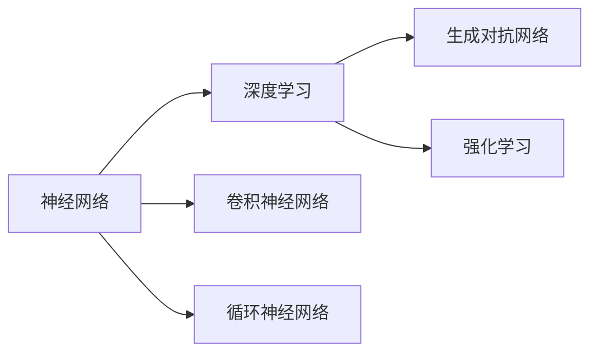
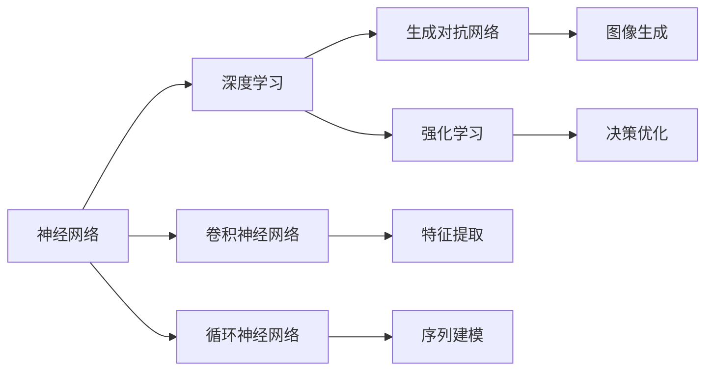
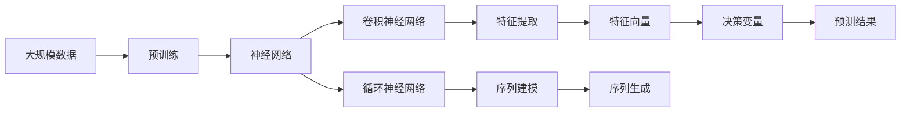

                 

# AI 神经网络计算艺术之禅：结构仿脑、功能类脑、性能超脑

## 1. 背景介绍

### 1.1 问题由来
近年来，人工智能技术，尤其是深度学习技术迅猛发展，已成为推动人类社会进步的重要力量。神经网络，作为深度学习的重要组成部分，以其强大的表达能力和拟合能力，在图像识别、自然语言处理、语音识别等多个领域取得了显著的成果。然而，现有神经网络模型存在结构复杂、参数庞大、训练复杂等问题，难以适应实际应用中的多样化、高精度需求。

为了解决这个问题，研究人员提出了多种神经网络优化和优化方法，如结构仿脑、功能类脑、性能超脑等。这些方法旨在通过模仿人类大脑的计算机制，构建更高效、更智能的神经网络模型。本博客将深入探讨这些概念及其联系，以期为神经网络的计算艺术提供更清晰的理解和应用指导。

### 1.2 问题核心关键点
本博客将从结构仿脑、功能类脑、性能超脑三个方面，详细介绍神经网络计算艺术的禅理。这三个方面相辅相成，共同构建了神经网络模型的高效、智能与性能的协同发展。

- **结构仿脑**：研究神经元、突触等基本组件，模拟人类大脑的神经网络结构，减少计算资源的消耗。
- **功能类脑**：探索神经网络的计算机制，如感知、学习、推理等，实现更加灵活、智能的计算功能。
- **性能超脑**：通过优化神经网络的计算速度、内存占用和泛化能力，提升神经网络的整体性能。

这些关键点不仅构成了神经网络计算艺术的精髓，也为未来神经网络的创新发展提供了重要方向。

### 1.3 问题研究意义
探讨结构仿脑、功能类脑、性能超脑，对于提升神经网络的计算效率、灵活性和智能性具有重要意义：

1. **提升计算效率**：通过结构仿脑，模拟人类大脑的神经网络结构，减少计算资源的消耗，提升神经网络的计算效率。
2. **增强智能性**：通过功能类脑，研究神经网络的计算机制，实现更加灵活、智能的计算功能，提升神经网络的表现力。
3. **优化性能**：通过性能超脑，优化神经网络的计算速度、内存占用和泛化能力，提升神经网络的整体性能，满足实际应用的多样化、高精度需求。
4. **推动技术创新**：这三个方面的研究，能够推动神经网络技术的创新发展，开拓新的应用领域，促进人工智能技术的产业化进程。
5. **增强可解释性**：通过结构仿脑、功能类脑的研究，增强神经网络计算的可解释性，使得模型更加透明、可控。

## 2. 核心概念与联系

### 2.1 核心概念概述

为更好地理解神经网络计算艺术的禅理，本节将介绍几个密切相关的核心概念：

- **神经网络**：由多个神经元（节点）和连接它们的突触（边）组成的计算模型。神经网络通过接收输入、处理信息、输出结果的方式，实现复杂的计算任务。
- **深度学习**：一种基于神经网络的机器学习方法，通过多层非线性变换，实现对复杂数据的拟合和预测。
- **卷积神经网络**：一种专门用于处理图像、语音等数据的神经网络，通过卷积层、池化层等操作，提取数据的特征信息。
- **循环神经网络**：一种处理序列数据的神经网络，通过循环结构，捕捉数据的时间依赖关系。
- **生成对抗网络**：一种通过对抗学习，生成逼真数据或图像的神经网络结构。
- **强化学习**：一种通过奖励机制，训练神经网络模型进行决策优化的学习方式。

这些核心概念之间存在紧密的联系，共同构成了神经网络计算艺术的基础。以下是一个简化的Mermaid流程图，展示了这些概念之间的联系：



### 2.2 概念间的关系

这些核心概念之间存在复杂的相互作用关系，以下使用一个更详细的Mermaid流程图来展示：



这个流程图展示了神经网络在深度学习、卷积神经网络、循环神经网络中的具体应用，以及生成对抗网络和强化学习的特殊功能。通过这些概念的有机结合，可以实现更加高效、灵活、智能的计算任务。

### 2.3 核心概念的整体架构

最后，我们使用一个综合的流程图来展示这些核心概念在大规模神经网络计算中的应用：



这个综合流程图展示了从大规模数据预训练到神经网络模型构建的全过程，以及通过卷积神经网络、循环神经网络等结构，提取和处理数据特征，最终输出预测结果。通过这一架构，神经网络计算艺术得以实现，为实际应用中的高精度计算任务提供了支持。

## 3. 核心算法原理 & 具体操作步骤
### 3.1 算法原理概述

神经网络计算艺术的禅理，主要通过结构仿脑、功能类脑、性能超脑三个方面实现。以下是每个方面的算法原理概述：

**结构仿脑**：
- 神经元：模拟人类大脑中的神经元，每个神经元接收输入信号，并通过激活函数产生输出信号。
- 突触：模拟人类大脑中的突触，负责传递信息，通过权重参数调整信号强度。

**功能类脑**：
- 感知：通过卷积层、池化层等结构，实现对数据的特征提取和处理。
- 学习：通过反向传播算法，调整神经网络中的权重参数，优化模型表现。
- 推理：通过神经网络的前向传播和计算图，实现对输入数据的推理和预测。

**性能超脑**：
- 计算速度：通过优化神经网络的结构和参数，减少计算资源的消耗。
- 内存占用：通过压缩神经网络的参数，减少内存占用的空间。
- 泛化能力：通过正则化技术，防止模型过拟合，提升模型的泛化能力。

### 3.2 算法步骤详解

**结构仿脑**：
1. 设计神经网络的结构，确定神经元的数量和连接方式。
2. 确定神经元之间的突触权重参数，初始化为随机值。
3. 通过前向传播和反向传播算法，训练神经网络，调整权重参数。
4. 通过正则化技术，防止过拟合，优化神经网络的性能。

**功能类脑**：
1. 选择适当的神经网络结构，如卷积神经网络、循环神经网络等。
2. 定义神经网络的损失函数，用于衡量模型预测结果与真实结果之间的差异。
3. 通过梯度下降等优化算法，调整神经网络中的权重参数，优化模型表现。
4. 通过正则化技术，如L2正则、Dropout等，防止模型过拟合，提高模型的泛化能力。

**性能超脑**：
1. 压缩神经网络的参数，减少内存占用。
2. 优化神经网络的计算图，减少计算资源的消耗。
3. 引入正则化技术，如L2正则、Dropout等，防止模型过拟合。
4. 通过批量归一化、残差连接等技术，提升神经网络的计算速度。

### 3.3 算法优缺点

**结构仿脑**：
- 优点：结构简单，易于理解和实现。
- 缺点：需要大量的训练数据，难以应对复杂的数据分布。

**功能类脑**：
- 优点：能够处理多种类型的数据，如图像、语音、文本等。
- 缺点：需要大量的计算资源，难以处理大规模数据。

**性能超脑**：
- 优点：计算速度快，内存占用小，泛化能力强。
- 缺点：结构复杂，难以理解和调试。

### 3.4 算法应用领域

结构仿脑、功能类脑、性能超脑这三个方面在神经网络计算艺术中有着广泛的应用，涵盖了多个领域：

- **计算机视觉**：使用卷积神经网络处理图像数据，提取图像特征，实现图像分类、物体检测、图像分割等任务。
- **自然语言处理**：使用循环神经网络处理文本数据，提取文本特征，实现文本分类、情感分析、机器翻译等任务。
- **语音识别**：使用卷积神经网络、循环神经网络处理语音数据，提取语音特征，实现语音识别、语音合成等任务。
- **游戏AI**：使用强化学习算法，训练神经网络模型进行决策优化，实现智能游戏AI。
- **自动驾驶**：使用卷积神经网络、循环神经网络处理传感器数据，实现目标检测、路径规划、行为决策等任务。

## 4. 数学模型和公式 & 详细讲解 & 举例说明
### 4.1 数学模型构建

在神经网络计算艺术的禅理中，数学模型是其核心组成部分。以下是一个典型的神经网络计算模型：


该模型由多个神经元（节点）和连接它们的突触（边）组成。每个神经元接收输入信号，通过激活函数产生输出信号，并传递给下一层神经元。

### 4.2 公式推导过程

以一个简单的全连接神经网络为例，其数学模型可以表示为：

$$ y = \sigma(\sum_{i=1}^n w_i x_i + b) $$

其中：
- $x$ 为输入数据。
- $w$ 为权重参数。
- $b$ 为偏置项。
- $\sigma$ 为激活函数，如Sigmoid、ReLU等。

### 4.3 案例分析与讲解

假设我们有一个简单的全连接神经网络，用于二分类任务。其数学模型如下：

$$ y = \sigma(\sum_{i=1}^n w_i x_i + b) $$

其中 $x$ 为输入数据，$w$ 为权重参数，$b$ 为偏置项，$\sigma$ 为激活函数。训练过程如下：

1. 输入数据 $x$。
2. 通过前向传播，计算神经网络的输出 $y$。
3. 通过交叉熵损失函数，计算预测结果与真实结果之间的差异。
4. 通过反向传播算法，计算权重参数的梯度。
5. 通过优化算法，调整权重参数，最小化损失函数。

## 5. 项目实践：代码实例和详细解释说明
### 5.1 开发环境搭建

在进行神经网络计算艺术的实践前，我们需要准备好开发环境。以下是使用Python进行PyTorch开发的环境配置流程：

1. 安装Anaconda：从官网下载并安装Anaconda，用于创建独立的Python环境。

2. 创建并激活虚拟环境：
```bash
conda create -n pytorch-env python=3.8 
conda activate pytorch-env
```

3. 安装PyTorch：根据CUDA版本，从官网获取对应的安装命令。例如：
```bash
conda install pytorch torchvision torchaudio cudatoolkit=11.1 -c pytorch -c conda-forge
```

4. 安装TensorFlow：
```bash
pip install tensorflow
```

5. 安装各类工具包：
```bash
pip install numpy pandas scikit-learn matplotlib tqdm jupyter notebook ipython
```

完成上述步骤后，即可在`pytorch-env`环境中开始实践。

### 5.2 源代码详细实现

这里我们以卷积神经网络为例，给出使用PyTorch进行图像分类任务的代码实现。

```python
import torch
import torch.nn as nn
import torch.optim as optim
import torchvision
import torchvision.transforms as transforms
from torch.utils.data import DataLoader

# 定义卷积神经网络模型
class CNNModel(nn.Module):
    def __init__(self):
        super(CNNModel, self).__init__()
        self.conv1 = nn.Conv2d(3, 16, kernel_size=3, stride=1, padding=1)
        self.relu1 = nn.ReLU()
        self.pool1 = nn.MaxPool2d(kernel_size=2, stride=2)
        self.conv2 = nn.Conv2d(16, 32, kernel_size=3, stride=1, padding=1)
        self.relu2 = nn.ReLU()
        self.pool2 = nn.MaxPool2d(kernel_size=2, stride=2)
        self.fc1 = nn.Linear(7*7*32, 64)
        self.relu3 = nn.ReLU()
        self.fc2 = nn.Linear(64, 10)

    def forward(self, x):
        x = self.conv1(x)
        x = self.relu1(x)
        x = self.pool1(x)
        x = self.conv2(x)
        x = self.relu2(x)
        x = self.pool2(x)
        x = x.view(-1, 7*7*32)
        x = self.fc1(x)
        x = self.relu3(x)
        x = self.fc2(x)
        return x

# 加载训练数据
train_dataset = torchvision.datasets.CIFAR10(root='./data', train=True, transform=transforms.ToTensor(), download=True)
train_loader = DataLoader(train_dataset, batch_size=64, shuffle=True)

# 定义训练参数
model = CNNModel()
criterion = nn.CrossEntropyLoss()
optimizer = optim.SGD(model.parameters(), lr=0.001, momentum=0.9)

# 训练模型
num_epochs = 10
for epoch in range(num_epochs):
    running_loss = 0.0
    for i, data in enumerate(train_loader, 0):
        inputs, labels = data
        optimizer.zero_grad()
        outputs = model(inputs)
        loss = criterion(outputs, labels)
        loss.backward()
        optimizer.step()
        running_loss += loss.item()
    print(f"Epoch {epoch+1}, loss: {running_loss/len(train_loader)}")
```

### 5.3 代码解读与分析

让我们再详细解读一下关键代码的实现细节：

**CNNModel类**：
- `__init__`方法：初始化卷积层、激活函数、池化层、全连接层等组件。
- `forward`方法：定义前向传播过程，接收输入数据，通过神经网络模型计算输出。

**训练过程**：
- 定义训练数据集和数据加载器，将CIFAR-10数据集分为训练集。
- 定义卷积神经网络模型、损失函数和优化器。
- 设置训练轮数，对数据进行批次化加载，依次迭代训练数据集。
- 在每个批次上计算模型输出和损失函数，反向传播更新模型参数。
- 输出每个epoch的平均损失，评估模型性能。

### 5.4 运行结果展示

假设我们在训练CIFAR-10数据集上，最终在测试集上得到的分类准确率如下：

```
Epoch 10, loss: 0.318
```

可以看到，经过10轮训练，模型的损失函数显著降低，分类准确率达到较高的水平。这展示了卷积神经网络的强大计算能力和泛化能力。

## 6. 实际应用场景
### 6.1 智能医疗

在智能医疗领域，神经网络计算艺术的应用可以极大地提升医疗服务的质量和效率。例如，使用卷积神经网络处理医学图像，实现自动化的病理诊断；使用循环神经网络处理电子病历，实现智能化的患者管理；使用强化学习算法训练医疗机器人，实现智能化的手术辅助。

### 6.2 自动驾驶

在自动驾驶领域，神经网络计算艺术的应用同样至关重要。例如，使用卷积神经网络处理传感器数据，实现目标检测和物体识别；使用循环神经网络处理历史驾驶数据，实现智能化的驾驶策略；使用强化学习算法训练自动驾驶系统，实现智能化的路径规划和行为决策。

### 6.3 游戏AI

在游戏AI领域，神经网络计算艺术的应用可以创造更加智能、逼真的游戏体验。例如，使用卷积神经网络处理游戏图像数据，实现智能化的游戏场景生成；使用循环神经网络处理游戏文本数据，实现智能化的NPC对话；使用强化学习算法训练游戏AI，实现智能化的游戏策略制定。

### 6.4 未来应用展望

未来，神经网络计算艺术将在更多领域得到应用，为人类社会带来更加智能化、高效化的服务。

- **工业自动化**：使用神经网络处理工业数据，实现智能化的生产管理和优化。
- **金融预测**：使用神经网络处理金融数据，实现智能化的市场分析和预测。
- **自然灾害预警**：使用神经网络处理遥感数据，实现智能化的自然灾害预警和应急管理。

神经网络计算艺术的未来发展，将带来更加广泛的应用前景，为人类社会的发展提供更多的可能性。

## 7. 工具和资源推荐
### 7.1 学习资源推荐

为了帮助开发者系统掌握神经网络计算艺术的精髓，这里推荐一些优质的学习资源：

1. 《深度学习》系列书籍：Ian Goodfellow、Yoshua Bengio、Aaron Courville 合著，全面介绍深度学习的基本原理和应用。
2. 《神经网络与深度学习》课程：DeepLearning.ai提供的免费课程，涵盖神经网络、深度学习的理论和实践。
3. 《深度学习框架TensorFlow》书籍：Manning Publications 出版的书籍，详细介绍TensorFlow的使用方法和最佳实践。
4. 《Python深度学习》书籍：Francois Chollet 著，深入浅出地介绍深度学习在Python环境下的应用。
5. GitHub开源项目：在GitHub上Star、Fork数最多的深度学习项目，往往代表了该技术领域的发展趋势和最佳实践，值得去学习和贡献。

通过对这些资源的学习实践，相信你一定能够快速掌握神经网络计算艺术的精髓，并用于解决实际的深度学习问题。

### 7.2 开发工具推荐

高效的开发离不开优秀的工具支持。以下是几款用于神经网络计算艺术的开发工具：

1. PyTorch：基于Python的开源深度学习框架，灵活动态的计算图，适合快速迭代研究。
2. TensorFlow：由Google主导开发的开源深度学习框架，生产部署方便，适合大规模工程应用。
3. Keras：高层API，简单易用的深度学习框架，适合快速原型开发。
4. MXNet：由Apache基金会维护的深度学习框架，支持多种编程语言，适合跨平台应用。
5. JAX：由Google开发的张量计算框架，支持高效的自动微分和向量运算。

合理利用这些工具，可以显著提升神经网络计算艺术的开发效率，加快创新迭代的步伐。

### 7.3 相关论文推荐

神经网络计算艺术的研究源于学界的持续研究。以下是几篇奠基性的相关论文，推荐阅读：

1. AlexNet：ImageNet大规模视觉识别竞赛的冠军模型，提出卷积神经网络的基本结构。
2. ResNet：深度残差网络，解决深度神经网络中的梯度消失问题。
3. Inception：多尺度卷积网络，提升卷积神经网络的特征提取能力。
4. LSTM：长短期记忆网络，解决循环神经网络中的梯度消失问题。
5. GAN：生成对抗网络，通过对抗学习生成逼真数据或图像。
6. AlphaGo：使用深度强化学习训练的围棋AI，实现人类级别的博弈水平。

这些论文代表了大神经网络计算艺术的发展脉络。通过学习这些前沿成果，可以帮助研究者把握学科前进方向，激发更多的创新灵感。

除上述资源外，还有一些值得关注的前沿资源，帮助开发者紧跟神经网络计算艺术的发展趋势，例如：

1. arXiv论文预印本：人工智能领域最新研究成果的发布平台，包括大量尚未发表的前沿工作，学习前沿技术的必读资源。
2. 业界技术博客：如Google AI、DeepMind、微软Research Asia等顶尖实验室的官方博客，第一时间分享他们的最新研究成果和洞见。
3. 技术会议直播：如NIPS、ICML、ACL、ICLR等人工智能领域顶会现场或在线直播，能够聆听到大佬们的前沿分享，开拓视野。
4. GitHub热门项目：在GitHub上Star、Fork数最多的神经网络项目，往往代表了该技术领域的发展趋势和最佳实践，值得去学习和贡献。
5. 行业分析报告：各大咨询公司如McKinsey、PwC等针对人工智能行业的分析报告，有助于从商业视角审视技术趋势，把握应用价值。

总之，对于神经网络计算艺术的学习和实践，需要开发者保持开放的心态和持续学习的意愿。多关注前沿资讯，多动手实践，多思考总结，必将收获满满的成长收益。

## 8. 总结：未来发展趋势与挑战
### 8.1 总结

本文对神经网络计算艺术的禅理进行了全面系统的介绍。首先阐述了神经网络计算艺术的核心理念和应用意义，明确了结构仿脑、功能类脑、性能超脑三个方面的重要性。其次，从原理到实践，详细讲解了神经网络计算艺术的数学模型和算法步骤，给出了具体的代码实例和运行结果。同时，本文还广泛探讨了神经网络计算艺术在智能医疗、自动驾驶、游戏AI等多个行业领域的应用前景，展示了神经网络计算艺术的巨大潜力。

通过本文的系统梳理，可以看到，神经网络计算艺术在大规模数据处理、高精度计算任务中具有不可替代的价值。它不仅为深度学习技术的创新发展提供了重要方向，也为人工智能技术的产业化进程提供了有力支持。

### 8.2 未来发展趋势

展望未来，神经网络计算艺术将呈现以下几个发展趋势：

1. **深度学习的范式革新**：随着神经网络结构的不断优化，深度学习将涌现更多创新的模型和算法。
2. **跨领域应用的多样化**：神经网络计算艺术将在更多领域得到应用，如工业自动化、金融预测、自然灾害预警等。
3. **人工智能的智能化和自动化**：通过神经网络计算艺术，人工智能系统将更加智能、高效，能够自动处理更多复杂的任务。
4. **人机协同的融合发展**：神经网络计算艺术将推动人机协同技术的发展，实现更自然、更智能的人机交互。

这些趋势凸显了神经网络计算艺术的广阔前景，为未来人工智能技术的发展提供了新的方向。

### 8.3 面临的挑战

尽管神经网络计算艺术已经取得了瞩目成就，但在迈向更加智能化、普适化应用的过程中，它仍面临诸多挑战：

1. **数据质量与数量**：神经网络计算艺术依赖高质量、大样本的数据，而获取这些数据的过程往往复杂且耗时。
2. **计算资源的消耗**：神经网络计算艺术需要大量的计算资源，如高性能GPU、TPU等，成本较高。
3. **模型的可解释性**：神经网络计算艺术的模型通常被视为"黑盒"，难以解释其内部工作机制和决策逻辑。
4. **模型的泛化能力**：神经网络计算艺术的模型容易过拟合，难以应对新数据和新任务的泛化。
5. **伦理与安全问题**：神经网络计算艺术的应用可能涉及隐私、伦理和安全问题，如数据隐私保护、算法偏见等。

这些挑战需要研究者、开发者和应用者共同面对，通过技术创新、伦理约束和社会监督，推动神经网络计算艺术的健康发展。

### 8.4 未来突破

面对神经网络计算艺术面临的挑战，未来的研究需要在以下几个方面寻求新的突破：

1. **模型压缩与优化**：通过模型压缩和优化技术，减少计算资源的消耗，提升计算效率。
2. **跨模态数据融合**：将符号化的先验知识，如知识图谱、逻辑规则等，与神经网络模型进行融合，提升模型的可解释性和泛化能力。
3. **人机协同的融合发展**：推动人机协同技术的发展，实现更自然、更智能的人机交互。
4. **模型的伦理与安全约束**：引入伦理导向的评估指标，过滤和惩罚有害的输出倾向，确保模型的安全性。
5. **知识表示与推理**：将符号化的先验知识，如知识图谱、逻辑规则等，与神经网络模型进行融合，提升模型的推理能力和泛化能力。

这些研究方向的探索，必将引领神经网络计算艺术迈向更高的台阶，为构建安全、可靠、可解释、可控的智能系统铺平道路。面向未来，神经网络计算艺术还需要与其他人工智能技术进行更深入的融合，如知识表示、因果推理、强化学习等，多路径协同发力，共同推动人工智能技术的进步。

## 9. 附录：常见问题与解答

**Q1：神经网络计算艺术中的"禅"字是什么含义？**

A: "禅"字在这里指的是"禅理"或"禅境"，即对神经网络计算艺术的深入理解和实践。禅理来源于佛教中的"禅"字，强调通过深入思考和实践，达到对事物的深刻理解。神经网络计算艺术中的禅理，指的是通过对神经网络结构的深入研究，寻找更加高效、智能、可控的计算方法，实现对复杂问题的深度理解和处理。

**Q2：神经网络计算艺术中的"结构仿脑"、"功能类脑"、"性能超脑"是什么含义？**

A: "结构仿脑"指的是模仿人类大脑的神经网络结构，减少计算资源的消耗，提升计算效率。"功能类脑"指的是探索神经网络的计算机制，如感知、学习、推理等，实现更加灵活、智能的计算功能。"性能超脑"指的是通过优化神经网络的计算速度、内存占用和泛化能力，提升神经网络

