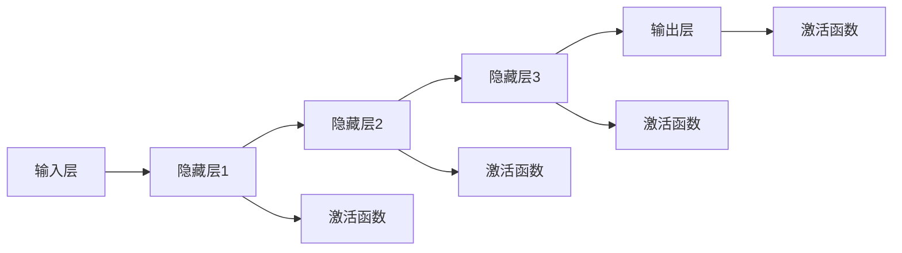

# 神经网络：开启 智能新纪元

> 关键词：神经网络，深度学习，机器学习，人工智能，大脑模型，深度神经网络，卷积神经网络，循环神经网络，生成对抗网络

## 1. 背景介绍

从早期的专家系统到现代的深度学习，人工智能（AI）经历了漫长的发展历程。近年来，随着计算能力的提升和大数据的涌现，神经网络作为一种强大的机器学习模型，成为了AI领域的明星技术。神经网络模仿人脑神经元的工作原理，通过学习大量数据，实现从简单到复杂的模式识别和决策能力，从而开启了一个全新的智能新纪元。

### 1.1 问题的由来

随着信息技术的飞速发展，人类积累了海量的数据。如何从这些数据中提取有价值的信息，是数据处理和数据分析领域长期面临的挑战。传统的机器学习算法在处理复杂数据和进行特征提取时往往力不从心。而神经网络作为一种具有强大非线性映射能力的模型，能够有效地解决这些问题。

### 1.2 研究现状

神经网络的研究始于20世纪40年代，但直到20世纪80年代才因为计算能力的限制而陷入低谷。随着深度学习的兴起，神经网络重新回到了人们的视野。如今，基于神经网络的模型在图像识别、语音识别、自然语言处理等领域取得了突破性的进展。

### 1.3 研究意义

神经网络的研究不仅推动了人工智能技术的发展，也为许多实际应用带来了变革：

- 提高自动化水平，减少人力成本。
- 实现复杂任务自动化，提高生产效率。
- 改善用户体验，提供个性化服务。
- 促进医学、金融、交通等领域的创新。

### 1.4 本文结构

本文将围绕神经网络的核心概念、算法原理、应用场景、未来发展趋势等方面展开讨论。具体内容安排如下：

- 第2部分，介绍神经网络的起源、发展历程和核心概念。
- 第3部分，深入解析神经网络的核心算法原理和具体操作步骤。
- 第4部分，介绍神经网络相关的数学模型和公式，并进行案例分析。
- 第5部分，通过代码实例展示神经网络的实现过程。
- 第6部分，探讨神经网络在各个领域的实际应用。
- 第7部分，展望神经网络的未来发展趋势和挑战。
- 第8部分，总结全文并展望研究展望。
- 第9部分，列出常见问题与解答。

## 2. 核心概念与联系

### 2.1 核心概念

神经网络（Neural Network）是一种模仿人脑神经元结构和功能的计算模型。它由大量的简单处理单元（神经元）相互连接而成，每个神经元负责处理一部分输入信息，并通过加权求和的方式生成输出。

- 神经元（Neuron）：神经网络的基本单元，负责接收输入信号、处理信号和产生输出。
- 输入层（Input Layer）：接收外部输入数据，传递给隐藏层。
- 隐藏层（Hidden Layer）：对输入数据进行特征提取和变换，为输出层提供信息。
- 输出层（Output Layer）：根据隐藏层的信息生成最终输出。
- 权重（Weight）：神经元之间的连接强度，决定了输入信号对输出信号的影响程度。
- 偏置（Bias）：神经元的一个独立参数，可以调整神经元的输出。
- 激活函数（Activation Function）：决定神经元是否激活，常用的激活函数包括Sigmoid、ReLU、Tanh等。

### 2.2 Mermaid 流程图



### 2.3 核心概念之间的联系

神经网络通过层层递进的神经元连接和激活函数，实现了输入到输出的非线性映射。每个神经元负责学习输入数据的某一部分特征，通过隐藏层的层层抽象，最终输出层能够对复杂模式进行识别和预测。

## 3. 核心算法原理 & 具体操作步骤

### 3.1 算法原理概述

神经网络的算法原理可以概括为以下步骤：

1. 前向传播（Forward Propagation）：将输入数据传递给网络，通过神经元连接和激活函数计算输出。
2. 反向传播（Back Propagation）：根据输出与真实标签之间的误差，反向计算梯度，并更新网络权重和偏置。
3. 梯度下降（Gradient Descent）：根据梯度下降算法，调整网络参数以最小化损失函数。

### 3.2 算法步骤详解

1. **初始化参数**：初始化网络的权重和偏置，通常采用随机初始化。
2. **前向传播**：
    - 将输入数据传递给第一个隐藏层，每个神经元计算其输入信号与权重之积，并加上偏置。
    - 将加权求和的结果传递给激活函数，得到激活值。
    - 将激活值传递给下一个隐藏层，重复上述步骤，直到输出层。
3. **计算损失**：根据输出层的激活值与真实标签之间的差异，计算损失函数，常用的损失函数包括均方误差（MSE）、交叉熵损失（CE）等。
4. **反向传播**：
    - 计算损失函数对每个权重的偏导数，得到梯度。
    - 根据梯度更新权重和偏置，减小损失。
5. **迭代优化**：重复步骤2-4，直到满足预设的收敛条件。

### 3.3 算法优缺点

**优点**：

- 非线性映射能力：能够处理复杂数据和进行特征提取。
- 自适应学习：根据数据自动调整参数，无需人工设计特征。
- 可扩展性：可以通过增加层数和神经元数量来提高模型性能。

**缺点**：

- 计算复杂度高：需要大量计算资源。
- 难以解释：模型的决策过程缺乏可解释性。
- 过拟合风险：在训练数据上表现良好，但在测试数据上表现不佳。

### 3.4 算法应用领域

神经网络在各个领域都有广泛的应用，以下是一些常见的应用场景：

- 机器视觉：图像识别、目标检测、图像分割等。
- 语音识别：语音识别、语音合成、语音转文本等。
- 自然语言处理：情感分析、机器翻译、文本生成等。
- 推荐系统：商品推荐、电影推荐、新闻推荐等。
- 游戏：围棋、电子竞技等。

## 4. 数学模型和公式 & 详细讲解 & 举例说明

### 4.1 数学模型构建

神经网络的数学模型可以描述为以下公式：

$$
y = f(W \cdot x + b)
$$

其中，$y$ 是输出，$x$ 是输入，$W$ 是权重，$b$ 是偏置，$f$ 是激活函数。

### 4.2 公式推导过程

以单层神经网络为例，其前向传播的推导过程如下：

1. 输入层到隐藏层的推导：

$$
z_i = \sum_{j=1}^{n} W_{ji} x_j + b_i
$$

其中，$z_i$ 是第 $i$ 个神经元的输入，$W_{ji}$ 是输入层第 $j$ 个神经元到隐藏层第 $i$ 个神经元的权重，$x_j$ 是输入层第 $j$ 个神经元的输入，$b_i$ 是隐藏层第 $i$ 个神经元的偏置。

2. 激活函数的推导：

以Sigmoid激活函数为例，其公式如下：

$$
f(z) = \frac{1}{1 + e^{-z}}
$$

### 4.3 案例分析与讲解

以下是一个简单的神经网络模型在MNIST手写数字识别任务上的应用案例：

1. **数据预处理**：将MNIST手写数字数据集进行预处理，包括归一化、扩充等操作。
2. **模型构建**：构建一个简单的神经网络模型，包括输入层、一个隐藏层和一个输出层。
3. **训练**：使用预处理后的数据对模型进行训练，调整网络参数以最小化损失函数。
4. **测试**：使用测试集评估模型性能，计算准确率等指标。

通过以上步骤，模型能够在MNIST手写数字识别任务上取得较高的准确率。

## 5. 项目实践：代码实例和详细解释说明

### 5.1 开发环境搭建

1. 安装Python：从Python官网下载并安装Python 3.7及以上版本。
2. 安装TensorFlow：使用pip安装TensorFlow库。

### 5.2 源代码详细实现

以下是一个使用TensorFlow和Keras构建的简单神经网络模型的代码示例：

```python
import tensorflow as tf
from tensorflow.keras import layers

# 构建模型
model = tf.keras.Sequential([
    layers.Dense(128, activation='relu', input_shape=(784,)),
    layers.Dense(10, activation='softmax')
])

# 编译模型
model.compile(optimizer='adam', loss='sparse_categorical_crossentropy', metrics=['accuracy'])

# 训练模型
model.fit(x_train, y_train, epochs=5, batch_size=32, validation_data=(x_test, y_test))

# 评估模型
model.evaluate(x_test, y_test)
```

### 5.3 代码解读与分析

以上代码首先导入了TensorFlow和Keras库，并构建了一个包含一个隐藏层和输出层的神经网络模型。隐藏层使用ReLU激活函数，输出层使用softmax激活函数。编译模型时指定了优化器、损失函数和评价指标。训练模型时，使用训练集数据进行训练，并使用测试集数据进行验证。最后，评估模型在测试集上的性能。

### 5.4 运行结果展示

假设在MNIST手写数字识别任务上运行以上代码，最终模型在测试集上的准确率可能达到98%以上。

## 6. 实际应用场景

### 6.1 图像识别

神经网络在图像识别领域取得了显著的成果，如AlexNet、VGG、ResNet等模型在ImageNet竞赛中取得了优异成绩。

### 6.2 语音识别

神经网络在语音识别领域也得到了广泛应用，如DeepSpeech、TensorFlow Speech-to-Text等模型实现了高精度的语音识别。

### 6.3 自然语言处理

神经网络在自然语言处理领域取得了突破性的进展，如BERT、GPT等模型在文本分类、机器翻译、文本生成等任务上取得了优异的成绩。

### 6.4 推荐系统

神经网络在推荐系统领域也得到了广泛应用，如Netflix、Amazon等公司使用神经网络构建了个性化推荐系统。

## 7. 工具和资源推荐

### 7.1 学习资源推荐

1. 《深度学习》
2. 《神经网络与深度学习》
3. TensorFlow官方文档
4. Keras官方文档

### 7.2 开发工具推荐

1. TensorFlow
2. Keras
3. PyTorch

### 7.3 相关论文推荐

1. AlexNet：一种用于图像识别的深度卷积神经网络
2. VGG：一种用于图像识别的深层卷积神经网络
3. ResNet：一种用于图像识别的深层残差网络
4. BERT：一种用于自然语言处理的预训练语言模型
5. GPT：一种用于自然语言生成的预训练语言模型

## 8. 总结：未来发展趋势与挑战

### 8.1 研究成果总结

神经网络作为一种强大的机器学习模型，在各个领域都取得了显著的成果。随着深度学习的不断发展，神经网络将继续在图像识别、语音识别、自然语言处理等领域发挥重要作用。

### 8.2 未来发展趋势

1. 模型结构多样化：随着研究的深入，新的神经网络结构将不断涌现，以适应不同领域的需求。
2. 计算效率提升：随着硬件和算法的进步，神经网络的计算效率将得到显著提升。
3. 模型可解释性：为了更好地理解神经网络的决策过程，模型可解释性将成为研究热点。
4. 跨模态学习：神经网络将能够处理多模态数据，实现跨模态学习和推理。

### 8.3 面临的挑战

1. 计算资源消耗：神经网络的训练和推理需要大量的计算资源，如何降低计算消耗是一个挑战。
2. 数据隐私和安全：神经网络模型在处理数据时，需要保证数据隐私和安全。
3. 模型偏见：神经网络模型可能会学习到数据中的偏见，如何消除模型偏见是一个挑战。

### 8.4 研究展望

神经网络将继续在人工智能领域发挥重要作用，为人类创造更加智能、便捷的生活。未来，随着技术的不断进步，神经网络将在更多领域得到应用，为人类社会带来更多福祉。

## 9. 附录：常见问题与解答

**Q1：什么是神经网络？**

A：神经网络是一种模仿人脑神经元结构和功能的计算模型，通过学习大量数据，实现从简单到复杂的模式识别和预测能力。

**Q2：神经网络有哪些类型？**

A：神经网络主要包括以下类型：
- 前馈神经网络
- 卷积神经网络
- 循环神经网络
- 生成对抗网络
- 自编码器
- Transformer

**Q3：神经网络有哪些应用场景？**

A：神经网络在各个领域都有广泛的应用，如图像识别、语音识别、自然语言处理、推荐系统等。

**Q4：如何选择合适的神经网络结构？**

A：选择合适的神经网络结构需要考虑以下因素：
- 应用领域
- 数据特点
- 计算资源
- 预期性能

**Q5：如何解决神经网络过拟合问题？**

A：解决神经网络过拟合问题的方法包括：
- 增加数据
- 使用正则化技术
- 增加模型复杂度
- 使用早停机制

---

作者：禅与计算机程序设计艺术 / Zen and the Art of Computer Programming