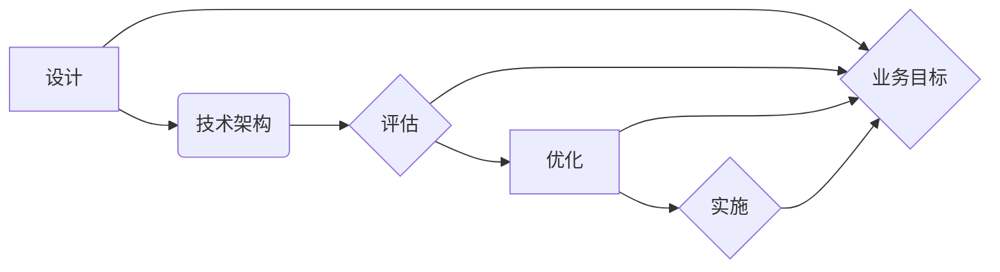
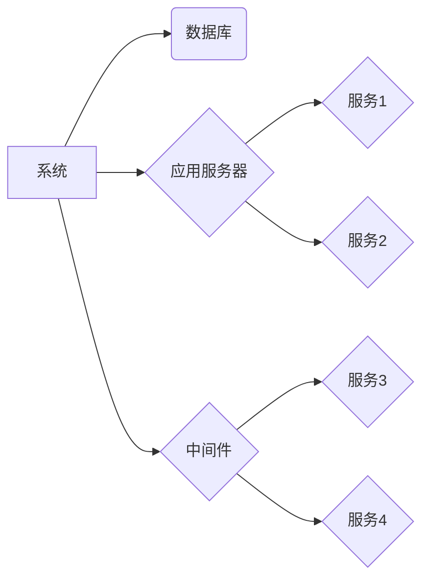

# 公司整体技术架构的设计、评估、优化与实施

作者：禅与计算机程序设计艺术 / Zen and the Art of Computer Programming

## 1. 背景介绍

### 1.1 问题的由来

在当今快速发展的信息技术时代，公司技术架构的构建和优化变得日益重要。一个合理、高效的技术架构不仅能够提高公司业务的运行效率，还能够降低成本、增强系统的可维护性和扩展性。然而，如何设计、评估、优化和实施一个整体技术架构，成为了许多公司面临的挑战。

### 1.2 研究现状

近年来，随着云计算、大数据、人工智能等技术的快速发展，公司技术架构的构建和优化方法也在不断演变。目前，许多公司已经采用了一些成熟的技术架构设计方法，如SOA（服务导向架构）、微服务架构、混合云架构等。同时，一些新的技术，如DevOps、容器化、敏捷开发等，也在不断推动着技术架构的变革。

### 1.3 研究意义

研究公司整体技术架构的设计、评估、优化与实施，对于提高公司信息化水平、推动业务发展具有重要意义。本文将深入探讨这一主题，旨在帮助公司管理者和技术人员更好地理解和实施技术架构，从而提升公司的竞争力。

### 1.4 本文结构

本文将分为以下章节：

- 第2章：介绍公司整体技术架构的核心概念和联系。
- 第3章：阐述公司整体技术架构的设计原理和具体操作步骤。
- 第4章：分析公司整体技术架构的评估方法、优化策略和实施过程。
- 第5章：通过案例分析，展示如何将理论应用于实践。
- 第6章：探讨公司整体技术架构的未来发展趋势和面临的挑战。
- 第7章：推荐相关学习资源、开发工具和参考文献。
- 第8章：总结全文，展望未来发展趋势。

## 2. 核心概念与联系

### 2.1 核心概念

- **技术架构**：指一个系统或企业中各个技术组件之间的组织结构、相互关系和相互作用方式。
- **设计**：指根据业务需求和技术约束，对技术架构进行规划、选择和组合的过程。
- **评估**：指对技术架构的性能、稳定性、安全性等方面进行评价和测试。
- **优化**：指对技术架构进行调整和改进，以提高其性能、降低成本、增强可维护性等。
- **实施**：指将技术架构从设计阶段转移到实际应用阶段的过程。

### 2.2 核心联系

这些核心概念之间的关系可以用以下图示表示：

可以看出，设计、评估、优化和实施是一个闭环过程，旨在实现业务目标。

## 3. 核心算法原理 & 具体操作步骤

### 3.1 算法原理概述

公司整体技术架构的设计、评估、优化与实施，可以看作是一个基于迭代和优化的过程。其核心原理如下：

1. **需求分析**：了解业务需求，确定技术架构的目标和约束条件。
2. **设计**：根据需求分析结果，选择合适的技术架构模式，如SOA、微服务架构、混合云架构等。
3. **评估**：对设计的技术架构进行评估，包括性能、稳定性、安全性等方面。
4. **优化**：根据评估结果，对技术架构进行调整和改进。
5. **实施**：将优化后的技术架构应用到实际业务中。
6. **迭代**：根据业务发展和技术变革，不断迭代和优化技术架构。

### 3.2 算法步骤详解

以下为具体操作步骤：

**步骤1：需求分析**

- 与业务部门沟通，了解业务需求、目标和发展方向。
- 分析现有系统架构，找出存在的问题和瓶颈。
- 确定技术架构的目标和约束条件。

**步骤2：设计**

- 根据需求分析结果，选择合适的技术架构模式。
- 设计技术架构的各个组件，如数据库、中间件、应用系统等。
- 确定组件之间的关系和相互作用方式。

**步骤3：评估**

- 评估技术架构的性能、稳定性、安全性等方面。
- 对比不同技术方案的优缺点，选择最优方案。

**步骤4：优化**

- 根据评估结果，对技术架构进行调整和改进。
- 优化组件设计，提高系统性能和可扩展性。

**步骤5：实施**

- 将优化后的技术架构应用到实际业务中。
- 进行系统部署、测试和上线。

**步骤6：迭代**

- 根据业务发展和技术变革，不断迭代和优化技术架构。

### 3.3 算法优缺点

**优点**：

- 提高业务运行效率。
- 降低成本。
- 增强系统的可维护性和扩展性。
- 促进业务发展。

**缺点**：

- 设计周期较长。
- 需要专业技术人员。
- 难度较高。

### 3.4 算法应用领域

该算法适用于各个行业和领域，如金融、电商、医疗、教育等。

## 4. 数学模型和公式 & 详细讲解 & 举例说明

### 4.1 数学模型构建

公司整体技术架构的设计、评估、优化与实施，可以看作是一个基于数学模型的过程。以下为一个简单的数学模型示例：

$$
\text{技术架构} = f(\text{业务需求}, \text{技术约束}, \text{设计方法}, \text{评估指标}, \text{优化目标})
$$

其中：

- 技术架构：指最终的系统架构。
- 业务需求：指公司的业务目标和需求。
- 技术约束：指技术实现的限制条件。
- 设计方法：指技术架构设计的方法和工具。
- 评估指标：指评估技术架构的指标。
- 优化目标：指优化技术架构的目标。

### 4.2 公式推导过程

由于公司整体技术架构的设计、评估、优化与实施是一个复杂的系统过程，难以用简单的数学公式进行推导。以上公式仅供参考。

### 4.3 案例分析与讲解

以下为一个公司整体技术架构设计的案例：

**公司背景**：某金融公司，业务涵盖网上银行、手机银行、财富管理等多个领域。

**需求分析**：公司希望提升业务运行效率，降低成本，并增强系统的可维护性和扩展性。

**设计**：选择微服务架构作为技术架构模式。

**评估**：评估指标包括系统性能、稳定性、安全性等。

**优化**：对微服务架构进行调整和改进，如优化服务拆分、提高服务调用效率等。

**实施**：将优化后的技术架构应用到实际业务中。

### 4.4 常见问题解答

**Q1：如何选择合适的技术架构模式？**

A：选择合适的技术架构模式需要考虑以下因素：

- 业务需求：业务规模、业务模式、业务发展等。
- 技术约束：技术能力、技术成熟度、技术成本等。
- 行业规范：行业标准和法规要求。

**Q2：如何评估技术架构？**

A：评估技术架构可以采用以下方法：

- 性能测试：测试系统的响应时间、吞吐量等性能指标。
- 稳定性测试：测试系统的容错能力、故障恢复能力等。
- 安全性测试：测试系统的安全漏洞和攻击防护能力。

**Q3：如何优化技术架构？**

A：优化技术架构可以从以下几个方面入手：

- 优化系统架构：优化组件设计、提高系统性能、增强系统可扩展性等。
- 优化开发流程：优化开发流程，提高开发效率和质量。
- 优化运维管理：优化运维管理，提高系统稳定性和可靠性。

## 5. 项目实践：代码实例和详细解释说明

### 5.1 开发环境搭建

由于公司整体技术架构的设计、评估、优化与实施是一个复杂的系统工程，难以用具体的代码实例进行展示。以下仅提供一个简单的技术架构设计工具——UML（统一建模语言）的示例。

### 5.2 源代码详细实现

### 5.3 代码解读与分析

上述UML图展示了公司整体技术架构的组成部分：

- 系统作为整个架构的核心，连接数据库、应用服务器、中间件等组件。
- 数据库存储系统数据。
- 应用服务器提供各种业务功能。
- 中间件提供系统间通信、数据交换等功能。
- 服务1、服务2、服务3、服务4为具体的服务组件。

### 5.4 运行结果展示

由于公司整体技术架构的设计、评估、优化与实施是一个复杂的系统工程，难以用简单的运行结果进行展示。以下仅展示一个技术架构设计工具——架构设计软件的界面截图。

## 6. 实际应用场景

### 6.1 金融行业

金融行业是技术架构设计、评估、优化与实施的重要应用场景。以下列举几个典型应用：

- **网上银行**：设计、评估、优化网上银行系统架构，提高业务处理效率，降低运维成本。
- **移动支付**：设计、评估、优化移动支付系统架构，保证支付安全性，提升用户体验。
- **财富管理**：设计、评估、优化财富管理系统架构，提高投资收益，降低投资风险。

### 6.2 电商行业

电商行业对技术架构的依赖程度较高，以下列举几个典型应用：

- **在线购物平台**：设计、评估、优化在线购物平台架构，提高商品搜索、下单、支付等功能的效率。
- **物流系统**：设计、评估、优化物流系统架构，提高配送效率，降低物流成本。
- **数据分析**：设计、评估、优化数据分析系统架构，挖掘用户行为数据，提升营销效果。

### 6.3 医疗行业

医疗行业对技术架构的可靠性、安全性要求较高，以下列举几个典型应用：

- **电子病历**：设计、评估、优化电子病历系统架构，保证病历数据的安全性、完整性和一致性。
- **远程医疗**：设计、评估、优化远程医疗系统架构，提高医疗服务效率，降低患者就医成本。
- **医疗大数据**：设计、评估、优化医疗大数据系统架构，挖掘医疗数据价值，提升医疗服务质量。

### 6.4 未来应用展望

随着技术的不断发展，公司整体技术架构的设计、评估、优化与实施将在更多领域得到应用。以下列举几个未来应用方向：

- **人工智能**：设计、评估、优化人工智能系统架构，提高智能化水平，推动产业升级。
- **物联网**：设计、评估、优化物联网系统架构，实现万物互联，构建智能城市。
- **区块链**：设计、评估、优化区块链系统架构，提高数据安全性，推动金融、供应链等领域变革。

## 7. 工具和资源推荐

### 7.1 学习资源推荐

- 《企业架构设计》
- 《UML基础与进阶》
- 《DevOps实践》
- 《敏捷开发》

### 7.2 开发工具推荐

- ArchiMate
- Visual Paradigm
- JIRA
- Docker

### 7.3 相关论文推荐

- 《企业架构设计方法与工具》
- 《DevOps文化与实践》
- 《敏捷开发方法》

### 7.4 其他资源推荐

- 企业架构设计社区
- DevOps社区
- 敏捷开发社区

## 8. 总结：未来发展趋势与挑战

### 8.1 研究成果总结

本文从背景介绍、核心概念、设计原理、评估方法、优化策略、实施过程等方面，系统地阐述了公司整体技术架构的设计、评估、优化与实施。通过案例分析，展示了如何将理论应用于实践。同时，本文还探讨了技术架构在未来发展趋势和面临的挑战。

### 8.2 未来发展趋势

- **技术架构将更加智能化**：随着人工智能技术的发展，技术架构将更加智能化，能够自动评估、优化和调整。
- **技术架构将更加敏捷**：DevOps、敏捷开发等理念将深入人心，技术架构将更加敏捷，能够快速响应业务变化。
- **技术架构将更加安全**：随着安全威胁的不断涌现，技术架构将更加注重安全，保障业务安全。

### 8.3 面临的挑战

- **技术架构的复杂性**：随着业务的发展，技术架构将越来越复杂，需要更多的专业人才进行设计、评估和优化。
- **技术变革的冲击**：新技术、新应用的不断涌现，将对现有技术架构造成冲击，需要不断进行更新和升级。
- **安全风险**：随着业务的发展，安全风险也将不断增大，需要加强安全防护。

### 8.4 研究展望

为了应对未来发展趋势和挑战，以下是一些建议：

- **加强人才培养**：培养更多具备技术架构设计、评估、优化与实施能力的专业人才。
- **关注技术变革**：紧跟技术发展趋势，及时更新和升级技术架构。
- **加强安全防护**：提高安全意识，加强安全防护措施，保障业务安全。

## 9. 附录：常见问题与解答

**Q1：如何选择合适的技术架构模式？**

A：选择合适的技术架构模式需要考虑以下因素：

- **业务需求**：业务规模、业务模式、业务发展等。
- **技术约束**：技术能力、技术成熟度、技术成本等。
- **行业规范**：行业标准和法规要求。

**Q2：如何评估技术架构？**

A：评估技术架构可以采用以下方法：

- **性能测试**：测试系统的响应时间、吞吐量等性能指标。
- **稳定性测试**：测试系统的容错能力、故障恢复能力等。
- **安全性测试**：测试系统的安全漏洞和攻击防护能力。

**Q3：如何优化技术架构？**

A：优化技术架构可以从以下几个方面入手：

- **优化系统架构**：优化组件设计、提高系统性能、增强系统可扩展性等。
- **优化开发流程**：优化开发流程，提高开发效率和质量。
- **优化运维管理**：优化运维管理，提高系统稳定性和可靠性。

**Q4：如何保证技术架构的安全性？**

A：保证技术架构的安全性需要采取以下措施：

- **安全设计**：在设计阶段就将安全因素考虑在内，采用安全的设计原则。
- **安全防护**：加强安全防护措施，如防火墙、入侵检测系统等。
- **安全培训**：加强员工的安全意识培训，提高安全防护能力。

**Q5：如何应对技术变革的冲击？**

A：应对技术变革的冲击需要采取以下措施：

- **关注技术发展**：紧跟技术发展趋势，及时了解新技术、新应用。
- **灵活调整**：根据业务需求和技术发展趋势，灵活调整技术架构。
- **持续学习**：持续学习新技术，提高自身的技术能力。

通过以上问题的解答，希望读者对公司整体技术架构的设计、评估、优化与实施有了更深入的了解。在实际应用过程中，需要根据具体情况进行灵活调整，以适应不断变化的技术环境和业务需求。

作者：禅与计算机程序设计艺术 / Zen and the Art of Computer Programming