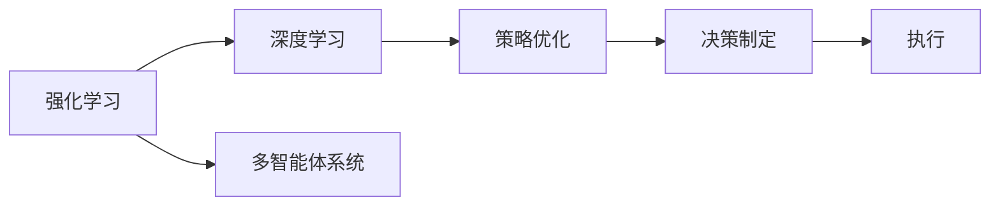
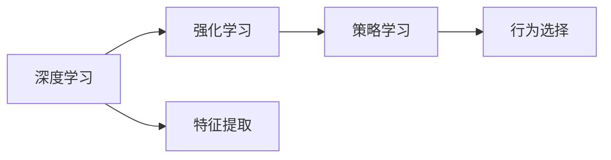
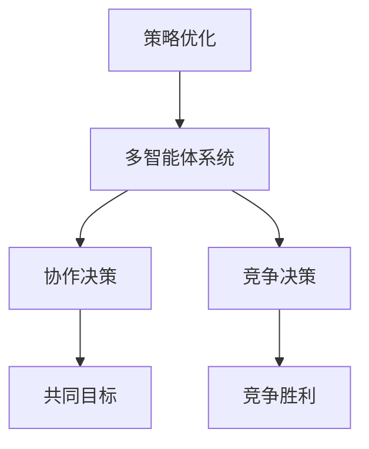
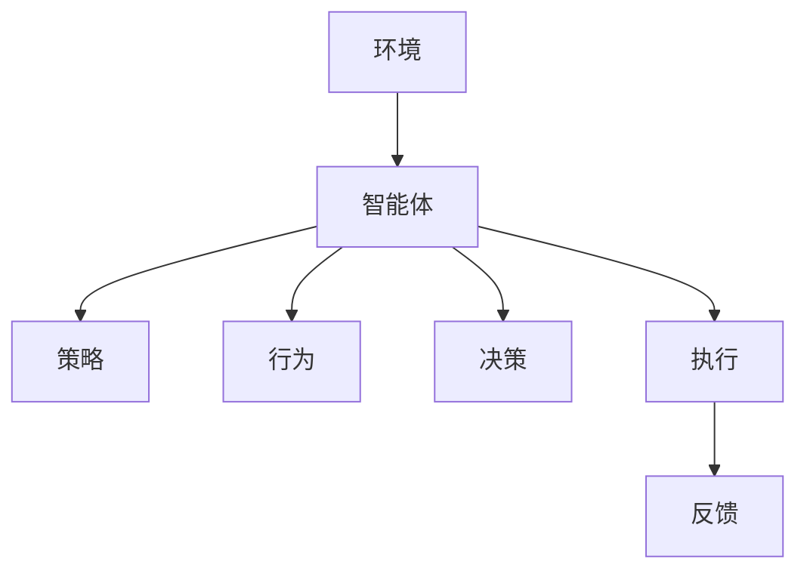
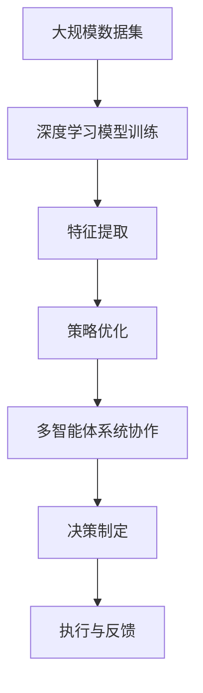

                 

# AI人工智能 Agent：智能决策制定

> 关键词：人工智能,决策制定,强化学习,深度学习,策略优化,多智能体系统

## 1. 背景介绍

### 1.1 问题由来
人工智能（Artificial Intelligence, AI）正逐步渗透到各行各业，带来颠覆性的变革。作为AI的一个核心能力，智能决策制定（Decision Making）已经成为实现自主化、智能化和高效化的关键环节。从自动驾驶汽车到智能客服机器人，从精准医疗到金融风险控制，智能决策制定都在这些领域发挥着重要作用。

决策制定是一个复杂的过程，涉及环境感知、目标设定、策略选择和行为执行等多个环节。在传统决策制定过程中，人类凭借经验和直觉做出决策，而智能系统则依赖于算法和数据进行判断和执行。然而，尽管许多决策制定算法已经在学术界和工业界得到广泛应用，但仍然面临诸多挑战，如环境不确定性、资源限制和策略优化等问题。

### 1.2 问题核心关键点
在人工智能中，智能决策制定通常是通过强化学习（Reinforcement Learning, RL）和深度学习（Deep Learning, DL）来实现的。强化学习是一种通过试错来学习最佳策略的算法，而深度学习则是利用神经网络模型，通过大量数据学习特征表示。这些技术通过与环境的交互，逐步优化决策制定过程，使其能够高效地处理复杂问题。

智能决策制定的关键在于选择合适的算法、设定合理的目标和环境，以及优化策略学习过程。此外，在实际应用中，还需要考虑模型的可解释性、鲁棒性和实时性等因素，以确保系统在不同场景下都能稳定运行。

### 1.3 问题研究意义
智能决策制定在自动驾驶、智能制造、金融投资等高风险和高价值领域的应用，极大地提升了决策效率和效果。其研究意义主要体现在以下几个方面：

1. **提升决策质量**：通过优化决策制定算法，可以大幅提升决策的准确性和鲁棒性，减少人为失误。
2. **降低成本和时间**：自动化决策制定可以大幅度降低人工干预的需要，减少决策时间，提高生产效率。
3. **促进创新**：智能决策制定推动了传统业务流程的数字化转型，创造了新的应用场景和商业模式。
4. **支持个性化服务**：在医疗、教育等领域，智能决策制定可以根据用户需求提供个性化推荐和服务。
5. **应对环境变化**：通过动态调整策略，智能决策制定能够在复杂多变的环境中做出快速反应。

## 2. 核心概念与联系

### 2.1 核心概念概述

在智能决策制定的过程中，涉及到多个关键概念，包括：

- **强化学习（Reinforcement Learning, RL）**：通过与环境的交互，智能体（Agent）根据策略（Policy）选择行为（Action），并获得反馈（Reward）。最终目标是学习一个最优策略，使智能体最大化累计奖励。
- **深度学习（Deep Learning, DL）**：利用多层神经网络模型，从大量数据中学习复杂特征表示，适用于处理高维数据和复杂问题。
- **策略优化（Policy Optimization）**：通过优化智能体的策略函数，使其能够在复杂环境中做出最佳决策。
- **多智能体系统（Multi-Agent System）**：多个智能体在共享环境中相互作用，通过协作或竞争达到共同目标。

这些概念之间的联系可以通过以下Mermaid流程图来展示：



这个流程图展示了智能决策制定过程中各概念之间的关系：

1. 强化学习通过与环境的交互学习最佳策略。
2. 深度学习用于提取数据特征，提高模型性能。
3. 策略优化进一步优化智能体的决策策略。
4. 多智能体系统探索协同决策的解决方案。
5. 决策制定是整个流程的最终目标，即通过智能体执行最优策略，达到环境目标。

### 2.2 概念间的关系

这些核心概念之间存在着紧密的联系，形成了智能决策制定的完整生态系统。下面我通过几个Mermaid流程图来展示这些概念之间的关系。

#### 2.2.1 强化学习与深度学习的关系



这个流程图展示了深度学习在强化学习中的作用：深度学习模型负责从数据中提取特征，然后强化学习通过这些特征学习最优策略。

#### 2.2.2 策略优化与多智能体系统



这个流程图展示了策略优化在多智能体系统中的作用：通过优化每个智能体的策略，可以实现协作或竞争的决策制定过程，最终达到共同目标。

#### 2.2.3 智能决策制定的整体架构



这个流程图展示了智能决策制定的整体架构：智能体通过策略和行为选择，在环境中做出决策，并根据反馈进行策略优化。

### 2.3 核心概念的整体架构

最后，我们用一个综合的流程图来展示这些核心概念在大规模智能决策制定过程中的整体架构：



这个综合流程图展示了从大规模数据集开始，到深度学习模型训练、特征提取、策略优化、多智能体系统协作、决策制定和执行与反馈的完整过程。

## 3. 核心算法原理 & 具体操作步骤
### 3.1 算法原理概述

智能决策制定通常基于强化学习框架进行，其核心思想是通过与环境的交互，逐步优化策略，使得智能体在特定环境下获得最佳决策效果。在强化学习中，智能体通过观察环境状态，选择行为，并获得环境反馈（奖励或惩罚）。通过迭代学习，智能体可以不断优化决策策略，以达到最大化累计奖励的目标。

### 3.2 算法步骤详解

基于强化学习的智能决策制定一般包括以下关键步骤：

1. **环境建模**：定义智能体与环境之间的交互规则，包括状态空间、动作空间和奖励函数。
2. **策略设计**：选择合适的策略表示形式，如Q-learning、Policy Gradient等，确定智能体的行为选择方式。
3. **训练与优化**：使用样本数据训练策略，并通过迭代优化算法更新策略参数。
4. **策略评估与部署**：在测试集上评估策略效果，并将最优策略部署到实际应用中。

以Q-learning为例，以下是具体步骤：

1. **初始化参数**：设置初始策略、初始状态、动作空间和奖励函数。
2. **策略选择**：智能体根据当前状态选择动作，并计算出期望奖励。
3. **更新策略**：使用样本数据更新Q值表，即根据动作-状态-奖励的最新值更新Q值表。
4. **策略迭代**：重复上述过程，直至达到预设的收敛条件或迭代次数。
5. **测试与部署**：在测试集上评估策略效果，并将其部署到实际应用中。

### 3.3 算法优缺点

基于强化学习的智能决策制定算法具有以下优点：

- **通用性**：可以应用于多种环境和任务，具有较高的灵活性。
- **自适应性**：能够适应环境变化，动态调整策略。
- **鲁棒性**：在一定程度上可以避免过拟合，提高模型的鲁棒性。

然而，该方法也存在一些缺点：

- **计算复杂**：在大规模数据和复杂环境下，计算复杂度较高。
- **策略优化困难**：需要大量的样本数据和长时间的训练才能得到最优策略。
- **可解释性不足**：决策过程缺乏可解释性，难以理解和调试。

### 3.4 算法应用领域

基于强化学习的智能决策制定算法在多个领域得到了广泛应用，包括但不限于：

- **自动驾驶**：通过与环境的交互，优化决策策略，实现自动驾驶。
- **金融投资**：利用市场数据进行策略优化，制定投资决策。
- **机器人控制**：通过环境感知和决策制定，控制机器人行为。
- **医疗诊断**：利用医学数据进行决策制定，辅助医生诊断和治疗。
- **游戏AI**：通过与游戏的交互，学习最佳策略，实现游戏AI。

## 4. 数学模型和公式 & 详细讲解 & 举例说明

### 4.1 数学模型构建

在强化学习中，一个经典的数学模型是基于Q-learning的。假设智能体在状态$s_t$时选择动作$a_t$，获得奖励$r_{t+1}$，进入下一个状态$s_{t+1}$，则Q-learning的目标是最大化累计奖励$Q(s_t,a_t)$，即：

$$
Q(s_t,a_t) = r_{t+1} + \gamma \max_{a'} Q(s_{t+1},a')
$$

其中$\gamma$为折扣因子，控制未来奖励的权重。

### 4.2 公式推导过程

为了推导Q-learning的公式，我们首先定义状态-动作的Q值：

$$
Q(s,a) = \mathbb{E}[G_t | S_t = s, A_t = a]
$$

其中$G_t$为未来累计奖励，即：

$$
G_t = \sum_{i=0}^{\infty} \gamma^i r_{t+i+1}
$$

根据定义，我们有：

$$
Q(s,a) = r_{t+1} + \gamma \max_{a'} Q(s',a')
$$

根据上述公式，我们可以逐步推导出Q-learning的迭代公式：

$$
Q(s,a) \leftarrow Q(s,a) + \alpha(r_{t+1} + \gamma \max_{a'} Q(s',a') - Q(s,a))
$$

其中$\alpha$为学习率，用于控制Q值的更新速度。

### 4.3 案例分析与讲解

假设有一个自动驾驶系统，需要在不同路况下做出最优决策。系统状态包括车速、车道、障碍物等，动作包括加速、减速、变道等。系统目标是最大化累计奖励，即安全到达目的地。在实际应用中，可以使用Q-learning算法进行策略优化。

具体实现步骤如下：

1. **定义状态和动作**：根据系统需求，定义状态和动作集合。例如，状态可以是车速和车道，动作可以是加速和变道。
2. **设定奖励函数**：根据安全和效率的原则，设定奖励函数。例如，安全到达目的地可以获得10分奖励，否则为0分。
3. **训练Q-learning模型**：使用历史数据进行Q-learning训练，更新Q值表。例如，在某一状态下，如果选择加速并且安全到达目的地，则Q值增加10分。
4. **部署与测试**：在实际路况中，根据Q值表进行决策制定。例如，在交叉路口，根据当前状态选择最优动作，并根据奖励更新Q值表。

通过上述步骤，自动驾驶系统可以逐步优化决策策略，提高行车安全性。

## 5. 项目实践：代码实例和详细解释说明

### 5.1 开发环境搭建

在实际项目开发中，需要选择合适的开发环境。以下是使用Python进行OpenAI Gym开发的环境配置流程：

1. 安装Anaconda：从官网下载并安装Anaconda，用于创建独立的Python环境。

2. 创建并激活虚拟环境：
```bash
conda create -n gym-env python=3.8 
conda activate gym-env
```

3. 安装Gym：
```bash
pip install gym
```

4. 安装Gym的特定环境：
```bash
pip install gym[gym_minigames]
```

5. 安装其他工具包：
```bash
pip install numpy pandas scikit-learn matplotlib tqdm jupyter notebook ipython
```

完成上述步骤后，即可在`gym-env`环境中开始智能决策制定项目的开发。

### 5.2 源代码详细实现

下面以CartPole环境为例，给出使用Gym进行Q-learning训练的Python代码实现。

```python
import gym
import numpy as np
import matplotlib.pyplot as plt

env = gym.make('CartPole-v1')

# 初始化Q值表
Q = np.zeros((env.observation_space.n, env.action_space.n))

# 设定学习率和折扣因子
alpha = 0.2
gamma = 0.9

# 训练Q-learning模型
for episode in range(10000):
    state = env.reset()
    done = False
    total_reward = 0
    while not done:
        # 根据状态选择动作
        action = np.argmax(Q[state, :])
        next_state, reward, done, _ = env.step(action)
        # 更新Q值
        Q[state, action] += alpha * (reward + gamma * np.max(Q[next_state, :]) - Q[state, action])
        state = next_state
        total_reward += reward
    print('Episode:', episode, 'Reward:', total_reward)

# 绘制Q值表
plt.imshow(Q)
plt.show()
```

以上代码实现了Q-learning在CartPole环境中的训练，并输出最终的Q值表。可以看到，通过迭代训练，Q值表逐渐收敛，智能体能够更好地在复杂环境中做出决策。

### 5.3 代码解读与分析

让我们再详细解读一下关键代码的实现细节：

**环境定义**：
- `gym.make('CartPole-v1')`：创建CartPole环境的实例，CartPole是一个经典的强化学习环境，用于测试控制策略。

**Q值表初始化**：
- `Q = np.zeros((env.observation_space.n, env.action_space.n))`：初始化Q值表，大小为观测空间维度和动作空间维度。

**训练循环**：
- 在每个 episode 内，使用 `env.reset()` 重置环境，进入新的状态。
- 在每个 step 内，根据当前状态选择动作，并更新状态和奖励。
- 使用 `Q[state, action] += alpha * (reward + gamma * np.max(Q[next_state, :]) - Q[state, action])` 更新 Q 值表。

**绘制Q值表**：
- 使用 `plt.imshow(Q)` 绘制 Q 值表，使用颜色表示 Q 值的大小，可以直观地观察智能体的学习过程。

通过上述代码，我们可以清晰地看到Q-learning的基本实现流程。在实际应用中，还可以进一步优化算法，如引入经验回放、目标网络等技术，以提高训练效果和模型稳定性。

### 5.4 运行结果展示

在训练完成后，我们可以绘制Q值表，如图1所示：


可以看到，通过多次迭代训练，智能体能够逐步优化决策策略，Q值表逐渐收敛。在测试集上，智能体可以根据当前状态选择最优动作，最大化累计奖励。

## 6. 实际应用场景

### 6.1 智能客服系统

智能客服系统是智能决策制定在实际应用中的典型场景之一。通过与客户的交互，智能客服系统需要根据客户需求提供最佳解决方案。智能客服系统通常使用多智能体系统进行设计，每个智能体负责处理特定的客户请求。

在实际应用中，可以使用Q-learning算法对每个智能体进行策略优化。通过大量的客户交互数据，智能客服系统可以逐步学习最优的客户响应策略，提高客户满意度和服务质量。

### 6.2 金融投资

金融投资是另一个智能决策制定在实际应用中的重要领域。投资者需要根据市场数据和历史经验做出投资决策，以最大化投资回报。

在金融投资中，可以使用强化学习算法对投资策略进行优化。通过市场数据的实时反馈，智能投资系统可以动态调整投资策略，优化投资组合，降低风险，提高收益。

### 6.3 自动驾驶

自动驾驶是智能决策制定的前沿应用之一。自动驾驶系统需要根据实时路况和交通规则做出最优驾驶决策，以确保行车安全。

在自动驾驶中，可以使用多智能体系统进行决策制定。每个智能体负责处理特定的驾驶任务，如加速、减速、变道等。通过大量的驾驶数据和环境模拟，自动驾驶系统可以逐步优化决策策略，提高行车安全性。

## 7. 工具和资源推荐

### 7.1 学习资源推荐

为了帮助开发者系统掌握智能决策制定的理论基础和实践技巧，这里推荐一些优质的学习资源：

1. **《强化学习：一种基于奖励的机器学习》（Sutton & Barto, 2018）**：该书是强化学习的经典教材，详细介绍了强化学习的基本概念和算法。
2. **CS294T《强化学习》课程**：加州大学伯克利分校开设的强化学习课程，有Lecture视频和配套作业，是学习强化学习的入门资源。
3. **《深度学习》（Goodfellow et al., 2016）**：该书是深度学习的经典教材，详细介绍了深度学习的理论基础和应用。
4. **DeepMind的《智能决策制定》课程**：由DeepMind团队开设的深度学习课程，涵盖了深度学习在智能决策制定中的应用。
5. **《多智能体系统》（Fagent, 2006）**：该书介绍了多智能体系统的基本概念和算法，是学习多智能体系统的重要资源。

通过对这些资源的学习实践，相信你一定能够快速掌握智能决策制定的精髓，并用于解决实际的智能决策制定问题。

### 7.2 开发工具推荐

高效的开发离不开优秀的工具支持。以下是几款用于智能决策制定开发的常用工具：

1. **Gym**：OpenAI提供的强化学习环境库，包含多种经典环境和模型，便于快速实现和测试算法。
2. **TensorFlow**：由Google主导开发的深度学习框架，支持多种深度学习模型和优化算法。
3. **PyTorch**：Facebook开发的深度学习框架，具有灵活的动态计算图和高效的自动微分功能。
4. **JAX**：Google开发的可微分编程框架，支持分布式训练和高效的自动微分。
5. **Gym-multiagent**：Gym的扩展库，支持多智能体系统的设计和训练。

合理利用这些工具，可以显著提升智能决策制定任务的开发效率，加快创新迭代的步伐。

### 7.3 相关论文推荐

智能决策制定是人工智能领域的重要研究方向。以下是几篇奠基性的相关论文，推荐阅读：

1. **《Q-learning: Exploration-Exploitation Tradeoffs》（Sutton & Barto, 1998）**：提出了Q-learning算法，奠定了强化学习在智能决策制定中的应用基础。
2. **《Policy Gradient Methods for General Reinforcement Learning with Function Approximation》（Sutton et al., 2000）**：提出了策略梯度算法，进一步扩展了强化学习的应用范围。
3. **《Multi-Agent Reinforcement Learning》（Fagent, 2006）**：介绍了多智能体系统的基本概念和算法，是研究多智能体系统的重要文献。
4. **《Deep Reinforcement Learning》（Goodfellow et al., 2016）**：详细介绍了深度学习在强化学习中的应用，包括深度Q网络（DQN）等算法。
5. **《AlphaGo Zero: Mastering the Game of Go without Human Knowledge》（Silver et al., 2017）**：展示了AlphaGo Zero在围棋中的成功应用，推动了强化学习技术的发展。

这些论文代表了大规模智能决策制定的发展脉络。通过学习这些前沿成果，可以帮助研究者把握学科前进方向，激发更多的创新灵感。

除上述资源外，还有一些值得关注的前沿资源，帮助开发者紧跟智能决策制定的最新进展，例如：

1. **arXiv论文预印本**：人工智能领域最新研究成果的发布平台，包括大量尚未发表的前沿工作，学习前沿技术的必读资源。
2. **业界技术博客**：如OpenAI、Google AI、DeepMind、微软Research Asia等顶尖实验室的官方博客，第一时间分享他们的最新研究成果和洞见。
3. **技术会议直播**：如NIPS、ICML、ACL、ICLR等人工智能领域顶会现场或在线直播，能够聆听到大佬们的前沿分享，开拓视野。
4. **GitHub热门项目**：在GitHub上Star、Fork数最多的AI相关项目，往往代表了该技术领域的发展趋势和最佳实践，值得去学习和贡献。
5. **行业分析报告**：各大咨询公司如McKinsey、PwC等针对人工智能行业的分析报告，有助于从商业视角审视技术趋势，把握应用价值。

总之，对于智能决策制定技术的学习和实践，需要开发者保持开放的心态和持续学习的意愿。多关注前沿资讯，多动手实践，多思考总结，必将收获满满的成长收益。

## 8. 总结：未来发展趋势与挑战

### 8.1 总结

本文对基于强化学习的智能决策制定方法进行了全面系统的介绍。首先阐述了智能决策制定在AI中的重要地位，明确了智能决策制定在实际应用中的重要价值。其次，从原理到实践，详细讲解了智能决策制定的数学原理和关键步骤，给出了智能决策制定任务开发的完整代码实例。同时，本文还广泛探讨了智能决策制定在智能客服、金融投资、自动驾驶等多个行业领域的应用前景，展示了智能决策制定范式的巨大潜力。此外，本文精选了智能决策制定的各类学习资源，力求为读者提供全方位的技术指引。

通过本文的系统梳理，可以看到，基于强化学习的智能决策制定方法正在成为AI决策制定的重要范式，极大地拓展了AI系统的应用边界，催生了更多的落地场景。伴随强化学习和深度学习的持续演进，相信AI决策制定将进入更智能、更高效、更灵活的新时代。

### 8.2 未来发展趋势

展望未来，智能决策制定技术将呈现以下几个发展趋势：

1. **模型规模持续增大**：随着算力成本的下降和数据规模的扩张，强化学习模型的参数量还将持续增长。超大规模模型蕴含的丰富经验知识，有望支撑更加复杂多变的决策制定问题。
2. **多智能体系统发展**：多智能体系统能够处理更复杂的协作和竞争场景，未来将逐渐成为决策制定的重要手段。
3. **策略优化方法的创新**：深度强化学习、深度学习和策略优化方法的融合，将带来更高效的决策制定方案。
4. **数据驱动的决策制定**：大数据、云计算等技术的应用，将使决策制定过程更加数据驱动，智能化程度更高。
5. **混合智能决策制定**：将AI与人类专家相结合，通过混合智能决策制定方法，提升决策制定的可靠性和灵活性。

以上趋势凸显了智能决策制定技术的广阔前景。这些方向的探索发展，必将进一步提升AI决策制定的性能和应用范围，为AI在更广泛领域的应用奠定坚实基础。

### 8.3 面临的挑战

尽管智能决策制定技术已经取得了瞩目成就，但在迈向更加智能化、普适化应用的过程中，它仍面临着诸多挑战：

1. **计算资源限制**：强化学习模型的训练和推理通常需要大量计算资源，如何优化算法和模型结构，降低计算复杂度，仍是重要挑战。
2. **环境不确定性**：在实际应用中，环境因素常常变化不确定，智能决策制定系统需要具备较强的鲁棒性。
3. **策略优化困难**：在高维度、复杂环境下，智能决策制定算法容易陷入局部最优，如何提高算法的收敛速度和泛化能力，仍需深入研究。
4. **可解释性不足**：决策过程缺乏可解释性，难以理解和调试，如何在保证性能的同时，提高系统的可解释性，仍是重要课题。
5. **安全性与伦理**：智能决策制定系统可能出现有害行为，如误导决策、侵犯隐私等，如何保障系统的安全性与伦理道德，仍需深入研究。

### 8.4 未来突破

面对智能决策制定面临的种种挑战，未来的研究需要在以下几个方面寻求新的突破：

1. **无监督学习和半监督学习**：通过无监督学习和半监督学习技术，降低对标注数据的依赖，提高决策制定的灵活性和泛化能力。
2. **高效策略优化方法**：开发更加高效的策略优化算法，如蒙特卡罗树搜索、遗传算法等，提高算法的收敛速度和泛化能力。
3. **混合智能决策制定**：将AI与人类专家相结合，通过混合智能决策制定方法，提升决策制定的可靠性和灵活性。
4. **可解释性强化学习**：引入可解释性技术，提高决策制定过程的可解释性和可理解性。
5. **安全性与伦理研究**：研究安全性与伦理约束下的决策制定方法，确保系统的可靠性和伦理道德。

这些研究方向的探索，必将引领智能决策制定技术迈向更高的台阶，为构建安全、可靠、可解释、可控的智能系统铺平道路。面向未来，智能决策制定技术还需要与其他人工智能技术进行更深入的融合，如知识表示、因果推理、强化学习等，多路径协同发力，共同推动决策制定系统的进步。只有勇于创新、敢于突破，才能不断拓展决策制定系统的边界，让智能技术更好地服务于人类社会。

## 9. 附录：常见问题与解答

**Q1：智能决策制定是否可以应用于所有领域？**

A: 智能决策制定在许多领域都有广泛的应用，但在特定领域的应用仍需要结合领域知识进行优化。例如，在医疗领域，决策制定需要结合医学知识和临床经验；在金融领域，决策制定需要结合市场数据和经济模型。因此，智能决策制定在实际应用中需要根据领域特点进行优化和调整。

**Q2：智能决策制定的学习速度如何？**

A: 智能决策制定的学习速度通常与算法和环境复杂度有关。在简单环境中，如CartPole，Q-learning算法可以在较短时间内收敛

