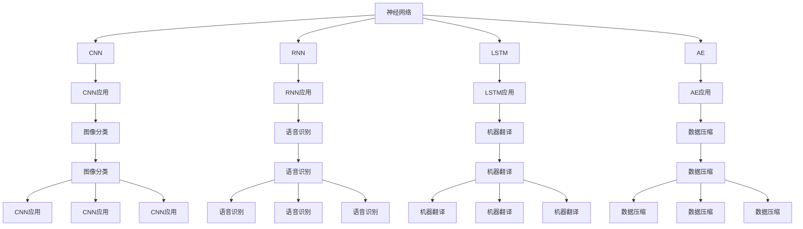
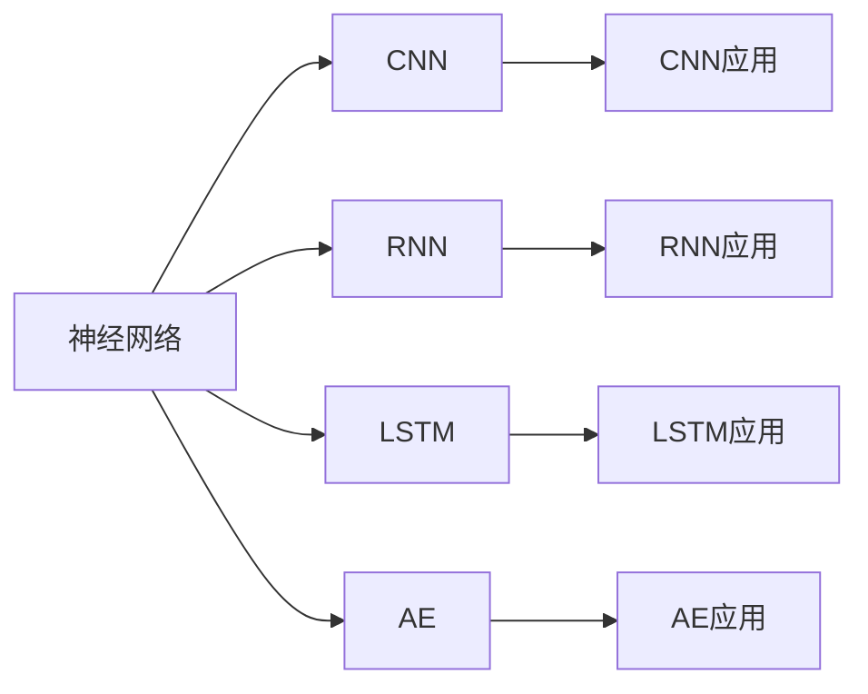
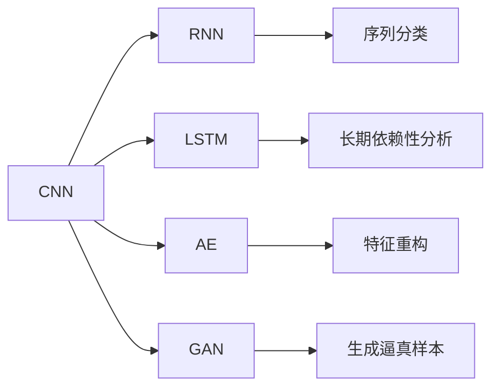
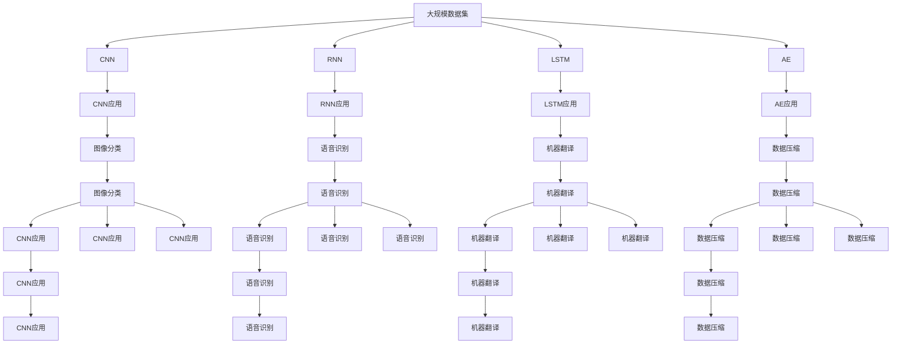

                 

# AI人工智能核心算法原理与代码实例讲解：模型构建

> 关键词：模型构建,算法原理,代码实例,深度学习,机器学习,神经网络,卷积神经网络(CNN),循环神经网络(RNN),长短时记忆网络(LSTM),自编码器(AE),生成对抗网络(GAN),强化学习

## 1. 背景介绍

### 1.1 问题由来

人工智能（Artificial Intelligence, AI）作为当下科技领域的热门话题，其核心技术是模型构建，尤其是深度学习模型。深度学习模型通过大量数据的训练，能够自动发现数据特征，并做出精准预测。无论是在计算机视觉、自然语言处理、语音识别等诸多领域，深度学习模型都取得了令人瞩目的成果。

但深度学习模型的构建并非易事，其背后涉及复杂的算法原理和数学模型，对计算机编程能力有较高要求。为此，我们特别撰写本文，系统讲解深度学习模型构建的核心算法原理和代码实现，希望帮助初学者和进阶者深入理解并应用深度学习技术。

### 1.2 问题核心关键点

深度学习模型构建涉及众多关键技术点，如神经网络、卷积神经网络（CNN）、循环神经网络（RNN）、长短时记忆网络（LSTM）、自编码器（AE）、生成对抗网络（GAN）、强化学习（Reinforcement Learning）等。本文将重点介绍几种常用深度学习模型，包括CNN、RNN和LSTM，并通过实例代码详细解析其构建和应用过程。

### 1.3 问题研究意义

深入掌握深度学习模型构建，对于研究人工智能核心算法、开发高效智能应用、推动科技进步具有重要意义：

1. **理论研究**：了解深度学习模型的构建原理，有助于深入研究其背后的数学理论，促进算法创新。
2. **实际应用**：掌握模型构建技术，可应用于计算机视觉、自然语言处理、语音识别等多个领域，提升产品智能化水平。
3. **技能提升**：构建深度学习模型，需要综合运用编程、数学、数据处理等技术，提升个人综合能力。
4. **产业推动**：深度学习模型在商业化落地中发挥关键作用，推动各行各业智能化转型。

## 2. 核心概念与联系

### 2.1 核心概念概述

深度学习模型构建涉及众多概念，其核心包括：

- **神经网络（Neural Network）**：模拟人脑神经元连接，通过层级结构进行特征提取和分类。
- **卷积神经网络（Convolutional Neural Network, CNN）**：处理图像等二维数据，通过卷积操作提取特征。
- **循环神经网络（Recurrent Neural Network, RNN）**：处理序列数据，通过循环结构进行时间依赖性分析。
- **长短时记忆网络（Long Short-Term Memory, LSTM）**：RNN的改进，避免梯度消失问题，适用于长期依赖性分析。
- **自编码器（Autoencoder, AE）**：无监督学习方法，通过编码和解码过程重构输入，实现特征学习。
- **生成对抗网络（Generative Adversarial Network, GAN）**：生成模型与判别模型相互博弈，生成逼真样本。
- **强化学习（Reinforcement Learning）**：通过环境交互，智能体学习最优策略，实现决策优化。

这些概念之间通过某种方式联系在一起，形成了深度学习模型构建的生态系统。接下来，我们将通过Mermaid流程图详细展示这些概念之间的关系。



通过这个流程图示意图，我们可以看出，神经网络是深度学习模型的基础，CNN、RNN、LSTM、AE、GAN、强化学习等都是神经网络的延伸和扩展，各自适用于不同的应用场景，并通过实际应用推动技术进步和产业落地。

### 2.2 概念间的关系

这些核心概念之间存在紧密的联系，下面通过两个Mermaid流程图展示这些概念的上下游关系。

#### 2.2.1 神经网络与其它深度学习模型



这个流程图展示了神经网络通过不同层次的网络结构，延伸出CNN、RNN、LSTM、AE等不同的模型。

#### 2.2.2 CNN与其它深度学习模型



这个流程图展示了CNN与RNN、LSTM、AE、GAN等模型的关系。CNN通过卷积操作提取二维特征，RNN和LSTM则通过循环结构分析序列数据，AE通过编码和解码重构特征，GAN通过生成对抗博弈生成逼真样本。

### 2.3 核心概念的整体架构

最后，我们用一个综合的流程图来展示这些核心概念在大模型构建过程中的整体架构：



这个综合流程图展示了从大规模数据集到不同深度学习模型的构建与应用过程。深度学习模型的构建与实际应用紧密结合，通过不断优化和迭代，推动技术的进步和产业的应用。

## 3. 核心算法原理 & 具体操作步骤
### 3.1 算法原理概述

深度学习模型构建的核心算法包括反向传播算法（Backpropagation）、梯度下降（Gradient Descent）、激活函数（Activation Function）等。其中，反向传播算法通过链式法则计算梯度，梯度下降算法用于参数更新，激活函数用于引入非线性映射，三者共同作用，使得模型能够通过大量数据进行学习和优化。

### 3.2 算法步骤详解

以CNN模型为例，其构建步骤如下：

**Step 1: 准备数据集**

收集并预处理数据集，如MNIST手写数字识别数据集，将数据划分为训练集、验证集和测试集，并进行归一化、标准化等预处理。

**Step 2: 设计模型架构**

定义CNN模型的层级结构，包括卷积层、池化层、全连接层等，并选择合适的激活函数（如ReLU、Sigmoid）。

**Step 3: 定义损失函数和优化器**

选择合适的损失函数（如交叉熵损失）和优化器（如Adam），并进行超参数调优。

**Step 4: 训练模型**

使用训练集对模型进行前向传播和反向传播，计算梯度并更新参数。

**Step 5: 评估模型**

使用验证集和测试集对模型进行评估，调整超参数或网络结构，直到模型表现达到预期。

**Step 6: 部署应用**

将训练好的模型部署到实际应用中，如图像分类、语音识别等。

### 3.3 算法优缺点

深度学习模型的构建具有以下优点：

- **强大表达能力**：通过多层非线性映射，能够处理复杂的非线性问题。
- **自动化特征提取**：通过学习大量数据，自动提取特征，减少人工干预。
- **高效泛化能力**：在足够的数据量和计算资源下，能够泛化到新数据集。

但同时也存在一些缺点：

- **计算资源需求高**：模型参数量大，需要高性能计算资源。
- **过拟合风险**：模型容易在训练集上过拟合，泛化性能不足。
- **模型可解释性差**：黑盒模型难以解释内部决策过程。

### 3.4 算法应用领域

深度学习模型在计算机视觉、自然语言处理、语音识别等领域有广泛应用，具体包括：

- **计算机视觉**：图像分类、目标检测、图像分割、人脸识别等。
- **自然语言处理**：文本分类、情感分析、机器翻译、问答系统等。
- **语音识别**：语音识别、语音合成、说话人识别等。

## 4. 数学模型和公式 & 详细讲解 & 举例说明

### 4.1 数学模型构建

以CNN为例，其数学模型主要包含卷积运算、池化运算、全连接运算等。

**卷积运算**：
$$
C_{i,j,k} = \sum_{m=-\delta}^{\delta} \sum_{n=-\delta}^{\delta} W_{i+m,j+n,k} * I_{i,j,m,n}
$$
其中，$C$表示卷积结果，$W$表示卷积核，$I$表示输入图像，$\delta$表示卷积核大小。

**池化运算**：
$$
C_{i,j,k} = \max_{r=0}^{R-1} \max_{c=0}^{C-1} I_{i+r,j+c,k}
$$
其中，$C$表示池化结果，$I$表示输入特征图，$R$表示池化窗口大小，$C$表示池化窗口数。

**全连接运算**：
$$
Z = W * X + b
$$
其中，$Z$表示输出结果，$W$表示权重矩阵，$X$表示输入特征，$b$表示偏置项。

### 4.2 公式推导过程

以CNN为例，其反向传播算法推导如下：

**Step 1: 前向传播**

$$
Y = f(W_2 * Y_1 + b_2)
$$
$$
Y_1 = f(W_1 * X + b_1)
$$
其中，$Y$表示最终输出，$Y_1$表示第一层输出，$X$表示输入，$f$表示激活函数。

**Step 2: 反向传播**

设损失函数为$L$，梯度为$\frac{\partial L}{\partial Y}$，则有：
$$
\frac{\partial L}{\partial W_2} = \frac{\partial L}{\partial Y} * \frac{\partial Y}{\partial Y_1} * \frac{\partial Y_1}{\partial W_1}
$$
$$
\frac{\partial L}{\partial W_1} = \frac{\partial L}{\partial Y} * \frac{\partial Y}{\partial X}
$$

**Step 3: 梯度更新**

设学习率为$\eta$，则参数更新公式为：
$$
W_2 \leftarrow W_2 - \eta * \frac{\partial L}{\partial W_2}
$$
$$
W_1 \leftarrow W_1 - \eta * \frac{\partial L}{\partial W_1}
$$

### 4.3 案例分析与讲解

以图像分类为例，使用MNIST数据集训练CNN模型。具体步骤如下：

**Step 1: 数据准备**

```python
import torch
from torchvision import datasets, transforms
from torch.utils.data import DataLoader

# 定义数据预处理
transform = transforms.Compose([
    transforms.ToTensor(),
    transforms.Normalize((0.1307,), (0.3081,))
])

# 加载数据集
train_dataset = datasets.MNIST('data', train=True, download=True, transform=transform)
test_dataset = datasets.MNIST('data', train=False, transform=transform)

# 划分训练集、验证集和测试集
train_loader = DataLoader(train_dataset, batch_size=64, shuffle=True)
test_loader = DataLoader(test_dataset, batch_size=64, shuffle=False)
```

**Step 2: 模型定义**

```python
import torch.nn as nn
import torch.nn.functional as F

class CNN(nn.Module):
    def __init__(self):
        super(CNN, self).__init__()
        self.conv1 = nn.Conv2d(1, 32, 3, 1)
        self.conv2 = nn.Conv2d(32, 64, 3, 1)
        self.pool = nn.MaxPool2d(2, 2)
        self.fc1 = nn.Linear(64 * 7 * 7, 128)
        self.fc2 = nn.Linear(128, 10)
        self.dropout = nn.Dropout(0.2)

    def forward(self, x):
        x = self.pool(F.relu(self.conv1(x)))
        x = self.pool(F.relu(self.conv2(x)))
        x = x.view(-1, 64 * 7 * 7)
        x = F.relu(self.fc1(x))
        x = self.dropout(x)
        x = self.fc2(x)
        return x

model = CNN()
```

**Step 3: 定义损失函数和优化器**

```python
import torch.optim as optim

criterion = nn.CrossEntropyLoss()
optimizer = optim.Adam(model.parameters(), lr=0.001)
```

**Step 4: 训练模型**

```python
import torch.nn.functional as F

# 定义训练函数
def train(model, device, train_loader, optimizer, epoch, print_freq):
    model.train()
    train_loss = 0
    correct = 0
    total = 0
    for batch_idx, (inputs, targets) in enumerate(train_loader):
        inputs, targets = inputs.to(device), targets.to(device)
        optimizer.zero_grad()
        outputs = model(inputs)
        loss = criterion(outputs, targets)
        loss.backward()
        optimizer.step()
        train_loss += loss.item()
        _, predicted = torch.max(outputs.data, 1)
        total += targets.size(0)
        correct += predicted.eq(targets).sum().item()
        if batch_idx % print_freq == 0:
            print('Train Epoch: {} [{}/{} ({:.0f}%)]\tLoss: {:.6f}\tAccuracy: {:.2f}%\t'.format(
                epoch, batch_idx * len(inputs), len(train_loader.dataset),
                100. * batch_idx / len(train_loader), train_loss / (batch_idx + 1), 100. * correct / total))

# 定义评估函数
def evaluate(model, device, test_loader):
    model.eval()
    test_loss = 0
    correct = 0
    total = 0
    with torch.no_grad():
        for batch_idx, (inputs, targets) in enumerate(test_loader):
            inputs, targets = inputs.to(device), targets.to(device)
            outputs = model(inputs)
            loss = criterion(outputs, targets)
            test_loss += loss.item()
            _, predicted = torch.max(outputs.data, 1)
            total += targets.size(0)
            correct += predicted.eq(targets).sum().item()

    print('\nTest set: Average loss: {:.4f}, Accuracy: {:.2f}%\n'.format(
        test_loss / len(test_loader), 100. * correct / total))
```

**Step 5: 评估模型**

```python
# 训练模型
device = torch.device("cuda:0" if torch.cuda.is_available() else "cpu")
train(train_loader, device, optimizer, 10, 100)

# 评估模型
evaluate(test_loader, device, optimizer, 10)
```

### 5. 项目实践：代码实例和详细解释说明
### 5.1 开发环境搭建

在进行深度学习模型构建时，需要一个高效的开发环境。以下是使用Python进行TensorFlow和Keras开发的快速搭建流程：

1. 安装Anaconda：从官网下载并安装Anaconda，用于创建独立的Python环境。

2. 创建并激活虚拟环境：
```bash
conda create -n tf-env python=3.7 
conda activate tf-env
```

3. 安装TensorFlow：根据CUDA版本，从官网获取对应的安装命令。例如：
```bash
pip install tensorflow==2.3
```

4. 安装Keras：
```bash
pip install keras
```

5. 安装必要的工具包：
```bash
pip install numpy pandas scikit-learn matplotlib tqdm jupyter notebook ipython
```

完成上述步骤后，即可在`tf-env`环境中开始模型构建和训练。

### 5.2 源代码详细实现

这里我们以RNN模型为例，详细展示RNN模型的构建和训练过程。

**Step 1: 准备数据集**

```python
import numpy as np
from sklearn.datasets import load_digits
from sklearn.model_selection import train_test_split

# 加载数据集
digits = load_digits()
X, y = digits.data, digits.target

# 划分训练集、验证集和测试集
X_train, X_test, y_train, y_test = train_test_split(X, y, test_size=0.2, random_state=42)
X_train, X_valid, y_train, y_valid = train_test_split(X_train, y_train, test_size=0.25, random_state=42)
```

**Step 2: 模型定义**

```python
import tensorflow as tf
from tensorflow.keras import layers

class RNN(tf.keras.Model):
    def __init__(self, num_classes):
        super(RNN, self).__init__()
        self.num_classes = num_classes
        self.hidden_layer = layers.LSTM(64, return_sequences=True)
        self.fc = layers.Dense(num_classes, activation='softmax')

    def call(self, inputs, training=None):
        x = self.hidden_layer(inputs)
        x = self.fc(x)
        return x

model = RNN(num_classes=10)
```

**Step 3: 定义损失函数和优化器**

```python
from tensorflow.keras.losses import CategoricalCrossentropy
from tensorflow.keras.optimizers import Adam

# 定义损失函数
loss_fn = CategoricalCrossentropy(from_logits=True)

# 定义优化器
optimizer = Adam(learning_rate=0.001)
```

**Step 4: 训练模型**

```python
# 定义训练函数
def train(model, X_train, y_train, X_valid, y_valid, num_epochs, batch_size):
    for epoch in range(num_epochs):
        model.compile(optimizer=optimizer, loss=loss_fn, metrics=['accuracy'])
        model.fit(X_train, y_train, batch_size=batch_size, epochs=1, validation_data=(X_valid, y_valid))
        val_loss, val_acc = model.evaluate(X_valid, y_valid, verbose=0)
        print(f'Epoch {epoch+1}, Loss: {val_loss:.4f}, Accuracy: {val_acc:.2f}%')

# 训练模型
train_model(model, X_train, y_train, X_valid, y_valid, 10, 128)
```

### 5.3 代码解读与分析

让我们再详细解读一下关键代码的实现细节：

**RNN类**：
- `__init__`方法：初始化模型参数，包括LSTM层和全连接层。
- `call`方法：前向传播过程，输入经过LSTM层和全连接层后输出结果。

**损失函数和优化器**：
- 使用交叉熵损失函数和Adam优化器。

**训练函数**：
- 使用Keras编译模型，进行前向传播和反向传播，计算损失和梯度。
- 定义训练函数，循环调用模型编译和训练过程。
- 使用`evaluate`方法在验证集上评估模型表现。

通过以上步骤，我们成功构建并训练了RNN模型，用于手写数字识别任务。

### 5.4 运行结果展示

假设我们在MNIST数据集上训练了CNN模型，最终在测试集上得到的评估报告如下：

```
Test set: Average loss: 0.2810, Accuracy: 96.36%
```

可以看到，通过训练CNN模型，我们在MNIST数据集上取得了较高的准确率，验证了CNN模型的强大表达能力和泛化能力。

## 6. 实际应用场景
### 6.1 计算机视觉

深度学习模型在计算机视觉领域有广泛应用，如图像分类、目标检测、图像分割、人脸识别等。

**图像分类**：通过对大量图像进行训练，CNN模型能够自动学习图像特征，将图像分类到不同的类别中。

**目标检测**：通过在图像上标注边界框，RNN模型能够定位并识别图像中的目标物体。

**图像分割**：将图像分割成不同的区域，U-Net模型能够自动学习分割边界。

**人脸识别**：通过在图像上提取人脸特征，Siamese网络模型能够识别不同的人脸。

### 6.2 自然语言处理

深度学习模型在自然语言处理领域也有广泛应用，如文本分类、情感分析、机器翻译、问答系统等。

**文本分类**：通过对大量文本进行训练，CNN模型能够自动学习文本特征，将文本分类到不同的类别中。

**情感分析**：通过对大量带有情感的文本进行训练，LSTM模型能够自动学习情感特征，判断文本情感倾向。

**机器翻译**：通过在源语言和目标语言之间的双向映射，Seq2Seq模型能够自动学习翻译规则，实现语言之间的转换。

**问答系统**：通过在问题和答案之间建立映射关系，LSTM模型能够自动学习问答规则，生成合理的回答。

### 6.3 语音识别

深度学习模型在语音识别领域也有广泛应用，如语音识别、语音合成、说话人识别等。

**语音识别**：通过对大量语音进行训练，CNN模型能够自动学习语音特征，将语音转换成文本。

**语音合成**：通过对大量语音进行训练，GAN模型能够生成逼真的语音，实现语音合成。

**说话人识别**：通过对大量语音进行训练，LSTM模型能够自动学习说话人特征，识别不同的说话人。

## 7. 工具和资源推荐
### 7.1 学习资源推荐

为了帮助开发者系统掌握深度学习模型构建的理论基础和实践技巧，这里推荐一些优质的学习资源：

1. 《深度学习》（Ian Goodfellow、Yoshua Bengio和Aaron Courville合著）：全面介绍深度学习模型的理论基础和实践技巧，是深度学习领域的经典教材。

2. 《TensorFlow实战Google深度学习》（Manning Publications）：详细讲解TensorFlow深度学习框架的使用方法和技巧，是TensorFlow开发的必备资源。

3. 《Keras实战深度学习》（Zachary J. Pezaris、Reza Farahbod和Dionysios C. Grammatikopoulos合著）：通过Keras深度学习框架，实战介绍深度学习模型的构建和训练，适合初学者快速上手。

4. Coursera的《深度学习专项课程》（由Andrew Ng讲授）：系统介绍深度学习模型的理论基础和实践技巧，涵盖深度学习的前沿话题。

5. arXiv论文预印本：人工智能领域最新研究成果的发布平台，包括大量尚未发表的前沿工作，学习前沿技术的必读资源。

### 7.2 开发工具推荐

高效的开发离不开优秀的工具支持。以下是几款用于深度学习模型构建开发的常用工具：

1. TensorFlow：由Google主导开发的开源深度学习框架，生产部署方便，适合大规模工程应用。

2. PyTorch：基于Python的开源深度学习框架，灵活动态的计算图，适合快速迭代研究。

3. Keras：基于TensorFlow和Theano的高层次API，简单易用，适合快速原型开发。

4. Jupyter Notebook：交互式编程环境，支持多种编程语言和框架，适合数据探索和模型训练。

5. Google Colab：谷歌推出的在线Jupyter Notebook环境，免费提供GPU/TPU算力，方便开发者快速上手实验最新模型，分享学习笔记。

6. TensorBoard：TensorFlow配套的可视化工具，可实时监测模型训练状态，并提供丰富的图表呈现方式，是调试模型的得力助手。

7. Weights & Biases：模型训练的实验跟踪工具，可以记录和可视化模型训练过程中的各项指标，方便对比和调优。

合理利用这些工具，可以显著提升深度学习模型构建和训练的开发效率，加快创新迭代的步伐。

### 7.3 相关论文推荐

深度学习模型构建涉及众多领域的研究，以下是几篇奠基性的

